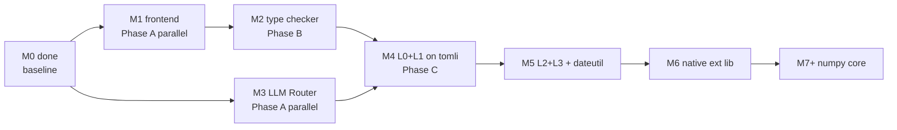

# ADR-0002: Multi-agent topology and milestone sequencing for autonomous delivery

## Context

Cobrust is mandated to be delivered autonomously by an LLM-agent team
under CTO direction (constitution `CLAUDE.md` §0–§9). The constitution
defines M0..M7+ with explicit gate discipline (§7), atomic-commit rules
(§6), and ADR-or-it-didn't-happen requirements. This ADR fixes the
agent topology and the sequencing rules that maximize parallelism
without violating any of those rules.

## Options considered

1. **Single-agent serial** — one agent does M1, M2, M3, ... in sequence.
   - Pros: simplest control flow, no merge conflicts.
   - Cons: zero parallelism, leaves M1's tail blocking M3's start;
     wall-clock time to M7 is the sum, not the max.

2. **CTO + per-milestone P9 + general-purpose / P7 workforce** *(chosen)*
   - CTO (the main agent session) orchestrates strategy, lands ADRs,
     defines milestone task prompts, spawns one P9 per milestone with
     `isolation: "worktree"`, integrates via merge of the worktree
     branch, runs verification gates after each merge.
   - Each P9 owns its milestone end-to-end: spawns sub-agents
     (`general-purpose` for code writes; `pua:senior-engineer-p7` for
     focused technical research; `Plan`/`Explore` for architecture and
     codebase mapping), runs lint/test/fuzz, commits atomically per §6.
   - Independent milestones run in parallel; dependent ones serialize.
   - Pros: maximum parallelism, P9 closure gives a clean integration
     boundary, gate enforcement remains centralized at CTO.
   - Cons: more git branches in flight; high token spend
     (constitution §8: "token cost is not a constraint").

3. **All milestones spawned simultaneously**
   - Pros: theoretical maximum parallelism.
   - Cons: violates dependency reality — M2 needs M1's AST surface,
     M4 needs M2 (types) + M3 (router), M5 needs M4. Spawning a P9
     before its prerequisites are merged guarantees rework.

## Decision

Adopt **option 2**.

- The **CTO is the main agent** (this Claude Code session). The CTO
  does not write production code; the CTO writes ADRs, dispatches P9s,
  enforces gates on merge, and unblocks cross-milestone conflicts.
- Each milestone has **one P9 Tech Lead**, spawned via the
  `pua:tech-lead-p9` agent type with `isolation: "worktree"`.
- P9s manage their own sub-agents (`general-purpose` for writes,
  `pua:senior-engineer-p7` for focused research, plus `Plan` / `Explore`
  as needed).
- CTO **merges worktree branches into `main` after gate verification**.

### Sequencing



| Phase | Milestones | Parallel? | Trigger |
|---|---|---|---|
| A | M1 + M3 | Yes — disjoint crates, no semantic coupling | M0 merged |
| B | M2 | Sequential after M1 | M1 merged with stable AST surface |
| C | M4 | Sequential after both M2 + M3 | both merged green |
| D | M5 → M6 → M7 | Strictly serial | each waits on the prior |

### Worktree convention

| Milestone | Branch | Worktree path |
|---|---|---|
| M1 | `feature/m1-frontend` | `../cobrust-m1` |
| M2 | `feature/m2-types` | `../cobrust-m2` |
| M3 | `feature/m3-llm-router` | `../cobrust-m3` |
| M4 | `feature/m4-tomli` | `../cobrust-m4` |
| M5 | `feature/m5-dateutil` | `../cobrust-m5` |
| M6 | `feature/m6-native-ext` | `../cobrust-m6` |
| M7 | `feature/m7-numpy` | `../cobrust-m7` |

P9 commits land on the feature branch. CTO merges via
`git merge --no-ff feature/<branch>` after gate verification, producing
a merge commit that anchors the milestone in the main history.

### Gate enforcement on merge (CTO responsibility)

After every P9 reports completion, the CTO runs the full local gate
suite on the merged tree before considering the milestone done:

```bash
cargo fmt --all -- --check
cargo clippy --workspace --all-targets --locked -- -D warnings
cargo build --workspace --all-targets --locked
cargo test --workspace --locked
bash scripts/doc-coverage.sh
```

Plus milestone-specific gates from `CLAUDE.md` §7 (e.g. M1 fuzz hours,
M3 router consensus determinism, M4 PyO3 wrapper testsuite).

Any gate failure → revert merge with `git reset --hard ORIG_HEAD`,
return diagnostic to P9 for repair.

### P9 task prompt template (CTO output to spawn agents)

Every P9 spawn carries:

1. Milestone scope (verbatim from constitution §7).
2. Required reads (constitution + module spec + this ADR + relevant
   ADRs).
3. Done means (from §7 plus extra explicit acceptance gates).
4. Workflow constraints (test-first, atomic-commit, doc-coverage,
   triple-tree sync, lint discipline).
5. PUA discipline injection (per skill protocol — Glob for
   `**/pua/skills/pua/SKILL.md`).
6. Sub-agent strategy hint (`general-purpose` for writes; P9 has no
   Edit/Write tools).
7. Report format expected (`[P9-MN-COMPLETION]` header + commit SHA +
   gate status + known issues + escalation requests).

### Cross-milestone conflict protocol

If a P9 discovers that delivering its milestone requires a change in a
peer milestone's surface (e.g. M3 router needs an AST type from M1):

1. P9 stops and reports `[ESCALATION]` with the conflict description.
2. CTO arbitrates — usually by landing a small enabling change in main
   first (a "spike commit"), then resuming both P9s.
3. First occurrence sets precedent; if it recurs, follow-up ADR.

## Consequences

- **Positive**
  - Maximum parallelism on independent milestones (Phase A: M1 ∥ M3).
  - Clear integration boundary at P9 reports — CTO merges with full
    gate evidence in hand.
  - Worktree isolation prevents merge conflicts during agent execution.
  - CTO retains gate enforcement; a P9 cannot ship a half-broken
    milestone past `main`.

- **Negative**
  - More git branches in flight; requires discipline to clean up
    merged feature branches.
  - High token spend — agents spawn sub-agents recursively. Constitution
    §8 explicitly accepts this cost in exchange for correctness.
  - Wall-clock per milestone is bounded by the slowest sub-agent;
    parallelism gains are real but not multiplicative.

- **Neutral / unknown**
  - Cross-milestone refactor protocol is sketched, not battle-tested.
    Will refine in a follow-up ADR if the first occurrence reveals
    sharp edges.
  - Exact tool inventory of P9 (`Agent`, `SendMessage`, `Read`, `Grep`,
    `Glob`, `WebSearch`, `Bash`) means P9 must spawn `general-purpose`
    for any code write. P9 acting as pure manager is by design — see
    `pua:tech-lead-p9` definition.

## Evidence

- Constitution `CLAUDE.md` §6 (atomic commits, ADR-or-it-didn't-happen,
  doc-coverage in CI), §7 (milestones), §8 (operating instructions for
  the agent).
- Agent tool documentation: `isolation: "worktree"` for parallel-safe
  execution.
- PUA framework agent definitions: `pua:cto-p10`, `pua:tech-lead-p9`,
  `pua:senior-engineer-p7`.
