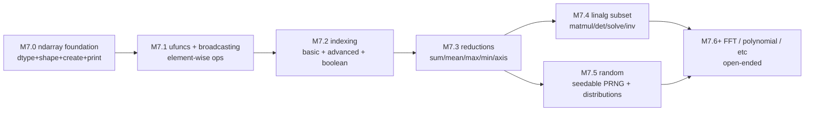

# ADR-0012: M7 numpy core — sub-milestone plan and backend strategy

## Context

Constitution `CLAUDE.md` §7 names M7+ as "Numerical tier: numpy core
subset" and flags it as **the big one**: a separate planning doc, only
to begin once M6 is complete (M6 closed at `ffed7c5` with 376 tests,
9 ADRs accepted). numpy is structurally different from every prior
target:

- **Massive surface area** — `numpy` exposes hundreds of functions
  across ndarray, dtypes, ufuncs, broadcasting, indexing, reductions,
  linalg, random, FFT, polynomial, distutils integration, and more.
- **Heavy C/Cython core** — most of the hot path is hand-tuned C with
  SIMD intrinsics; pure-Rust translation that matches perf is a
  research project.
- **Numerical correctness is identity** — for users, "numpy
  compatibility" means bit-for-bit (or `rtol`-bounded) agreement on
  every documented function. The constitution's `@py_compat(numerical,
  rtol)` tag was put there for exactly this milestone.

This ADR fixes the M7 sub-milestone breakdown, the backend strategy
(translate vs. bind), and the per-sub-milestone gates. It does not
attempt to be the implementation — each P9 dispatch produces its own
ADRs (0013 onward) to pin sub-milestone-specific decisions.

## Backend strategy: translate the surface, bind the core

| Layer | Strategy | Rationale |
|---|---|---|
| numpy public Python API | **Translate** to Cobrust | Surface compatibility is the user-visible contract; this is the whole point. |
| numpy Cython glue (`*.pyx`) | **Translate** via the Cython shim from M6 | Already proven in `cobrust-msgpack` (M6). |
| numpy C core (`numpy/core/src/multiarray/*.c`) | **Bind** to Rust's [`ndarray`](https://crates.io/crates/ndarray) crate | Re-implementing the C core in pure Cobrust without LAPACK / BLAS / SIMD investment is a multi-year detour. `ndarray` is the de-facto Rust ndarray crate, has the same `(dtype, shape, strides, data)` model, and supports ufunc-shaped element-wise ops. |
| BLAS / LAPACK | **Bind** to system / vendored | `ndarray-linalg` already wraps OpenBLAS / Accelerate / netlib; we route through it for M7.4 linalg. |
| Random | **Bind** to [`rand`](https://crates.io/crates/rand) + [`rand_distr`](https://crates.io/crates/rand_distr) | Seedable PRNGs already standard in Rust; `numpy.random.Generator` API surface translates to `rand`'s `Rng` trait fairly cleanly. |
| FFT | **Bind** to [`rustfft`](https://crates.io/crates/rustfft) | M7.6+; not on the critical path. |

**Why not full translation**: the M3 LLM Router taught us this lesson —
the constitution's "first-class subsystem" phrasing did not require us
to reimplement HTTP; we used `reqwest`. Same principle applies to
numerics. Translation is for surface-area compatibility; binding is
for compiled-language primitives that already exist in Rust.

This decision is itself a constitution-level decision — it generalizes
to any future translation target where the C core has a mature Rust
crate. Captured here as ADR-0012; future ADRs for individual M7
sub-milestones (0013+) should defer to it.

## Sub-milestones

| Sub-ms | Scope | Backend | Acceptance gate |
|---|---|---|---|
| **M7.0** | `ndarray`, `dtype` (`int32/64`, `f32/64`, `bool`); `array()`, `zeros()`, `ones()`, `arange()`; shape/dtype/print | `ndarray` crate as backend | ≥ 50 well-typed + ≥ 50 ill-typed programs pass; ≥ 1000 fuzz panic-free; differential vs upstream numpy on basic constructors |
| **M7.1** | Universal functions (`+ - * / **`, `np.add/subtract/...`); broadcasting rules; element-wise math (`sin/cos/exp/log/sqrt`) | `ndarray` element-wise + own broadcasting impl | bit-identical for int dtypes; `rtol=1e-7` for float; 1000-input differential corpus |
| **M7.2** | Indexing: basic slicing (`a[1:3]`), integer-array indexing (`a[[0,2,5]]`), boolean masks (`a[a>0]`); `np.where`; views vs copies | `ndarray::ArrayView` / `ArrayViewMut` | view semantics preserved; differential corpus covers all indexing forms |
| **M7.3** | Reductions: `sum/prod/mean/std/var/min/max/argmin/argmax` with `axis=None` and `axis=k` | `ndarray::Zip` + `fold_axis` | numerical agreement; pairwise summation for floats |
| **M7.4** | linalg subset: `matmul/dot`, `det`, `solve`, `inv`, `svd`, `eigh`, `cholesky` | `ndarray-linalg` (OpenBLAS / Accelerate) | `rtol=1e-6` agreement on conditioned matrices; documented unstable cases |
| **M7.5** | `np.random.Generator`: `default_rng`, `seed`, `integers`, `random`, `normal`, `uniform`, `choice` | `rand` + `rand_distr` | seed reproducibility (same seed → same stream across machines); KS-test agreement in distribution |
| **M7.6+** | FFT (`rustfft`), polynomial, datetime64, structured arrays — open-ended | per-sub-ms | per-sub-ms |

## Per-sub-milestone deliverables

Each M7.x P9 dispatch lands:
1. One sub-milestone ADR (0013, 0014, …) — pins the dtype tier table,
   broadcasting algorithm choice, etc.
2. A `cobrust-numpy-<area>` crate (e.g. `cobrust-numpy-array`,
   `cobrust-numpy-ufunc`, …) **OR** extends the existing
   `cobrust-numpy` crate (created at M7.0). M7.0's ADR-0013 picks one
   of these; later M7.x defer.
3. The translated subset of upstream numpy + canned LLM responses
   under `corpus/numpy/M7-x/`.
4. PyO3 wrapper progress incremental — only `cobrust-numpy` (parent
   crate) gets a unified PyO3 ext; sub-crates contribute to it.
5. Triple-tree doc sync, doc-coverage extension, gate-suite green
   on cold rebuild from `main`.

## Acceptance criteria for "M7 done"

The constitution does not define M7 done means; this ADR proposes:

- Through M7.5 inclusive — sub-milestone gates all green.
- A representative downstream notebook (e.g. a small simulation
  using arrays, ufuncs, indexing, reductions, and linalg) runs to
  completion via the cobrust-numpy PyO3 wrapper, producing output
  that matches upstream numpy to `rtol=1e-6` on all checked tensors.

M7.6+ is **explicitly open-ended** — additional sub-milestones land
as the project's user base reveals which numpy slices are
load-bearing.

## Sequencing rules

- **Strict serial**: M7.0 → M7.1 → M7.2 → M7.3.
- **Parallel allowed** at M7.4 + M7.5 (linalg and random are
  independent of each other; both build on M7.3 reductions).
- **M7.6+** is opportunistic.

```mermaid
gantt
    title M7 sub-milestones (estimate, not commitment)
    dateFormat  X
    axisFormat  M7.%s
    section Serial
    M7.0 ndarray         :a0, 0, 4
    M7.1 ufuncs          :a1, after a0, 4
    M7.2 indexing        :a2, after a1, 4
    M7.3 reductions      :a3, after a2, 3
    section Parallel
    M7.4 linalg          :a4, after a3, 5
    M7.5 random          :a5, after a3, 3
```

## Constraints inherited from earlier ADRs

- **L0..L3 closed loop** (`adr:0007`, `adr:0008`) applies — every M7.x
  goes through spec extraction → translation → verification → integration.
- **Synthetic-LLM mode default, real-LLM gated by `--features
  real-llm`** (`adr:0007`, M5 follow-up) — same as M4..M6.
- **Native-ext methodology** (`adr:0010`) applies for any Cython sources
  in numpy (`numpy.core._multiarray_umath` etc.); Cython shim is in place
  from M6.
- **PyO3 build path** (`adr:0011`) applies for PyO3 wrapper assembly;
  optional `--features pyo3`.

## Decision

Adopt this six-stage plan. Spawn one P9 per sub-milestone in
worktree-isolated branches `feature/m7-{stage}-...`. CTO merges each
sub-milestone after gate verification, mirroring the M0..M6 cadence.

Start immediately with **M7.0 (ndarray foundation)**. The remaining
sub-milestones are queued — each begins only after its prerequisite
merges into `main`.

## Consequences

- **Positive**
  - Decomposes "the big one" into delivery-shaped pieces; each P9 has
    a 60–90 minute scope rather than an open-ended numpy mandate.
  - Backend strategy (bind, don't reimplement) is captured at the
    constitution layer; later sub-milestones inherit cleanly.
  - The `ndarray` + `ndarray-linalg` + `rand` + `rustfft` crate set
    is mature; we get robust numerics without building a numerics
    research org.
- **Negative**
  - Cobrust's runtime now depends on the `ndarray` family. License
    review confirms MIT/Apache compat; documented in each sub-ms's
    ADR.
  - "Translate the surface, bind the core" means cobrust-numpy is
    not a from-scratch numpy. Users should understand this is
    deliberate. Documented in `docs/human/{en,zh}/architecture.md`
    M7 section.
- **Neutral / unknown**
  - Distinct dtype / SIMD performance gaps may emerge under real
    workloads; addressed per sub-ms ADR.
  - The "downstream notebook" acceptance criterion may need
    refinement once a real corpus is chosen; track in M7.0's ADR-0013.

## Evidence

- Constitution `CLAUDE.md` §7 (M7+ "the big one"), §4.2 (L0..L3
  gates which M7.x inherit), §8 (token cost not a constraint —
  applies to bulky numpy translations).
- ADR-0007 (translator pipeline), ADR-0008 (perf + repair),
  ADR-0009 (downstream), ADR-0010 (native-ext), ADR-0011 (PyO3).
- Upstream Rust crates: `ndarray` 0.16, `ndarray-linalg` 0.16, `rand`
  0.8, `rustfft` 6.x.

## See also

- `docs/agent/strategy/numpy-translation-architecture.md` — strategic
  insight (2026-05-19): numpy = 30% Python-wrapper translation + 50% C
  kept intact via FFI + 20% Fortran external dep. Same difficulty grade
  as tomli. READ BEFORE any M7 / Phase N numpy sprint dispatch.
