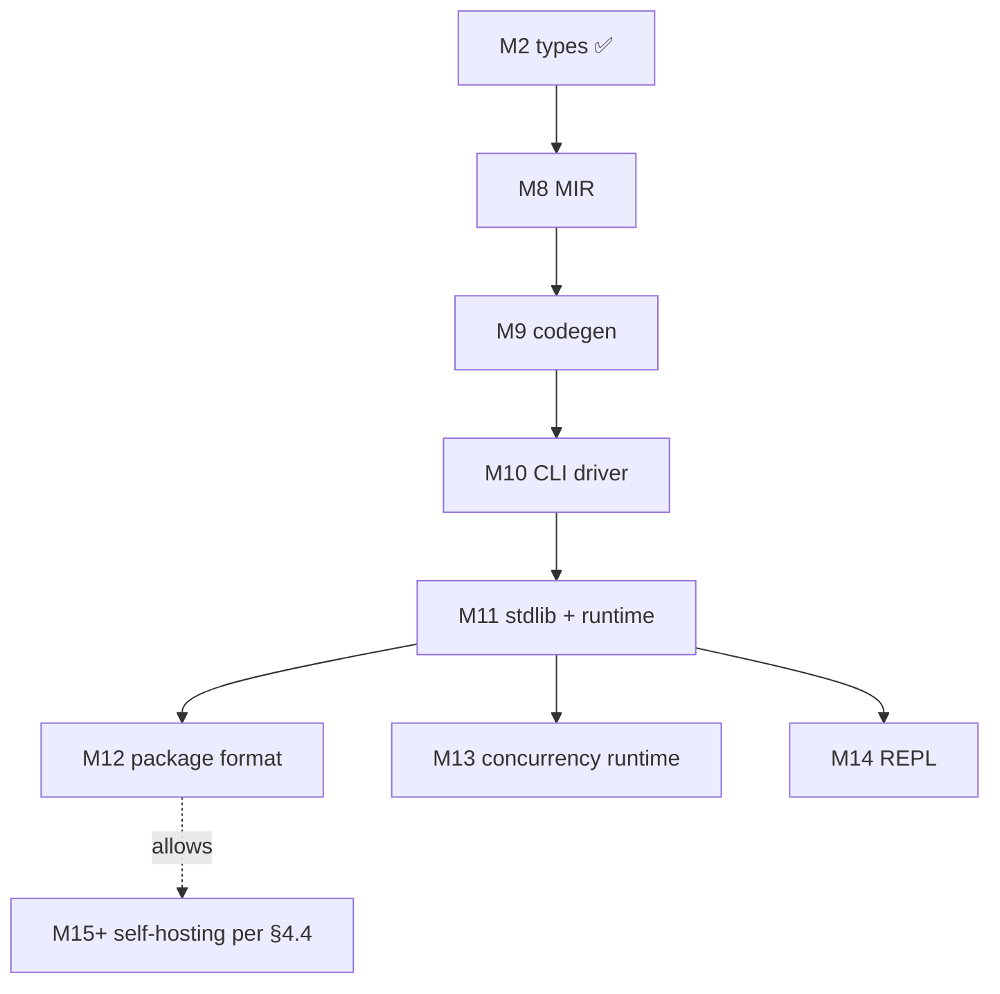

# ADR-0019: Phase E — Language + runtime roadmap (M8..M14) to "usable for most projects"

## Context

Constitution `CLAUDE.md` §1 binds Cobrust to a **dual mandate**:

> ### 1.1 The Language & Runtime
> A statically-typed language implemented in Rust, syntactically familiar to Python users, semantically purified.
>
> ### 1.2 The AI-Native Compiler
> The compiler is not just `frontend → IR → backend`. It has a **translation subsystem** that uses LLMs as a first-class component to convert Python libraries into Cobrust under closed-loop verification...

After M0..M7.5 the **AI-native compiler half is delivered**: lexer + parser + AST (M1), HIR + bidirectional type checker (M2), LLM Router (M3), L0..L3 closed-loop translator with repair loop (M4..M6), surface-translated cobrust-tomli / cobrust-dateutil / cobrust-msgpack / cobrust-numpy artifacts.

The **language + runtime half is still on M0 stubs**. Concretely:

| Crate | Lines | Status |
|---|---|---|
| `cobrust-mir` | 4 | empty `lib.rs` doc comment only |
| `cobrust-codegen` | 5 | empty `lib.rs` doc comment only |
| `cobrust-cli` | 6 | `fn main() {}` |
| stdlib | ∅ | not designed, not implemented |
| runtime | ∅ | no allocator, GC strategy, panic handler, entry point |
| package format | ∅ | no `cobrust.toml` user crate format |
| concurrency runtime | ∅ | constitution §2.2 promises "single structured-concurrency runtime"; not built |
| REPL | ∅ | constitution §2.1 promises "REPL-first feel"; not built |

Practical consequence: **no `.cb` file can be compiled to an executable**. The "Cobrust language" is on paper.

CTO error mode this points at: I read constitution §7 (milestones table M0..M7+) literally and missed §1 (dual mandate). §7's M7+ row is the *last* numpy-translation milestone, not the *last* milestone of the project. The constitution does not enumerate language+runtime milestones because §7 only frames the AI-translation track. ADR-0002's sequencing covered §7 cleanly but did not cover §1.1.

This ADR fixes that. **Phase E** is the language+runtime track — M8..M14 — needed to ship "usable for most projects".

## Options considered

1. **Keep M7.6+ open-ended; defer M8 indefinitely**
   - Pros: shrinks visible scope.
   - Cons: ships a translator subsystem with no language-runtime binary to actually run translations against. The constitution §1 dual mandate is unmet. **Rejected.**

2. **Add M8..M11 as the "usable" critical path; M12..M14 as ergonomics; M15+ as platform** *(chosen)*
   - Pros: explicit gate-shaped scope, sequencing matches the constitution, no surprises.
   - Cons: ~5 more P9 dispatches; large wall time.

3. **Self-host first (constitution §4.4)**
   - Cons: constitution §4.4 explicitly requires "post-M5" + non-perf-critical stages first; we're not there until the language compiles itself, which requires M8..M11 anyway. **Premature.**

## Decision

Adopt **option 2**. Append the following milestones to the project canon. ADR-0002's worktree-isolated P9 topology applies; ADR-0012's "translate the surface, bind the core" applies where there is a mature Rust crate (Cranelift, mimalloc, tokio, rustyline, etc.).

### M8 — MIR (mid-level IR)

**Scope**: control-flow-explicit form fed to codegen. Locals, basic blocks, terminators, drop schedule, borrow-check obligations discharged.

**Public surface (target)**:
```rust
pub fn lower(typed: &types::TypedModule, sess: &mut Session) -> Result<Module, MirError>;
pub struct Module { pub fns: Vec<Body> }
pub struct Body { pub locals: Vec<Local>, pub basic_blocks: Vec<BasicBlock>, ... }
```

**Done means**:
- Every form in ADR-0003's "core 30" lowers from typed-HIR (`mod:types::TypedModule`) to MIR.
- Every basic block ends with a terminator (`Goto`/`SwitchInt`/`Return`/`Call`/`Drop`/`Unreachable`).
- Drop schedule is computed (no double-drop, no leak-on-divergent-control).
- Borrow-check proof obligations are discharged before the lowering returns.
- ≥ 50 well-typed programs lower cleanly + ≥ 50 ill-formed-after-typecheck programs are detected as MIR errors.
- 24h-equivalent fuzz with `proptest` mirroring M1's approach.

**Backend strategy (per ADR-0012 generalized)**: own the IR shape; *do not* bind to `rustc`'s MIR (different invariants). MIR design is Cobrust-native.

### M9 — Codegen

**Scope**: lower MIR to native code. Two backends behind a feature flag; default depends on `--release`.

**Backend choice**:

| Backend | Default for | Pros | Cons |
|---|---|---|---|
| Cranelift | `cargo build` (dev) | Pure Rust, fast compile, no system deps | Less mature optimization; reduced target coverage |
| LLVM | `cargo build --release` | Best codegen quality, broad target support | Slow build, large dep tree, requires system LLVM |

**Done means**:
- Cranelift backend produces correct object code for the core 30 forms.
- Optional LLVM backend (`--features llvm`) produces correct object code; ≥ 30% smaller binary on a representative sample at `-O3`.
- ABI: System V AMD64 + AAPCS64 (macOS / Linux on x86_64 + aarch64).
- Linker delegation: invoke system `cc` (or `lld` if `--features lld`).
- Differential gate: every "core 30" form's compiled output produces identical `stdout` to a hand-written reference Rust program.

**ADR-bumpable**: backend feature-flag layout, `extern "Cobrust"` ABI definition.

### M10 — CLI driver (`cobrust build / run / check / fmt / translate`)

**Scope**: end-to-end driver; stitches lexer → parser → types → HIR → MIR → codegen → linker; subcommands.

**Subcommands (binding)**:

| Subcommand | Verb |
|---|---|
| `cobrust build [file.cb \| --]` | compile to executable / object |
| `cobrust run file.cb` | compile + invoke |
| `cobrust check file.cb` | type-check only |
| `cobrust fmt file.cb` | format (uses `mod:frontend`'s unparser) |
| `cobrust translate <python-lib>` | invoke `mod:translator` (M4..M6 entrypoint) |
| `cobrust new <name>` | scaffold a new package |
| `cobrust test` | run a package's `tests/` directory |
| `cobrust repl` | M14 — separate milestone |

**Done means**:
- A canonical "hello, world" `examples/hello.cb` compiles + runs + prints `hello, world\n` on macOS arm64 + Linux x86_64.
- Exit-code scheme documented (0 success, 1 user error, 2 type error, 3 internal panic, ≥ 100 reserved for translator path).
- All subcommands above land except `repl` (M14).

### M11 — Standard library (minimum viable)

**Scope**: Cobrust-native stdlib, structured for `import std.X` syntax. M11 ships the **minimum viable subset** — io, collections, string, math, panic, env. Larger surface is M11.x or post-M11 followup ADRs.

**Modules (binding for M11)**:

| Module | Surface |
|---|---|
| `std.io` | `print / println / read_line / read_file / write_file / stdin / stdout / stderr` |
| `std.collections` | `List<T>` / `Dict<K, V>` / `Set<T>` (with the constitution's "no implicit truthiness"); iteration via `mod:frontend`'s for-protocol |
| `std.string` | `len / find / replace / split / strip / lower / upper / format` |
| `std.math` | `sqrt / pow / sin / cos / abs / floor / ceil / round / pi / e` |
| `std.panic` | `panic(msg)` (program-terminating); `assert(cond, msg)` |
| `std.env` | `args() -> List<String>` ; `var(name) -> Option<String>` |
| `std.fmt` | f-string runtime helpers (already lowered in HIR; this is the runtime side) |

**Backend strategy**: bind to Rust where the semantics match (`Vec` ↔ `List`, `HashMap` ↔ `Dict`, `f64::sqrt` ↔ `math.sqrt`); own the surface (`std.io` API, error taxonomy, iteration protocol).

**Runtime requirements** (delivered alongside M11; tracked in same milestone for atomicity):
- Heap allocator: `mimalloc` by default; `system` allocator opt-in.
- Panic handler: writes diagnostic to stderr + exits with code 3.
- Entry point: `pub fn main() -> Result<(), Error>` is the user-visible signature; codegen emits the C ABI `_start` shim.
- No global GC at M11 — Cobrust's ownership model handles it. Reference-counting (`Rc<T>` / `Arc<T>`) is the only escape hatch and is opt-in.

**Done means**:
- `examples/hello.cb` compiles + prints (round-trips M10 work).
- 10 representative example programs compile + run + match expected output:
  `fizzbuzz.cb`, `fib.cb`, `wc.cb`, `cat.cb`, `echo.cb`, `sort.cb`, `unique_lines.cb`, `regex_grep.cb`, `csv_sum.cb`, `json_pretty.cb`.
  (CSV/JSON examples allowed to use cobrust-tomli/numpy translations or hand-written modules; document the choice.)
- ≥ 200 stdlib unit tests; ≥ 50 examples-driven integration tests.

### M12 — Package format + dependency resolution

**Scope**: the `cobrust.toml` *user-crate* shape (distinct from the LLM-router config of the same name; rename one or namespace appropriately in ADR-0020).

**Done means**:
- A user crate has `cobrust.toml` declaring `name`, `version`, `dependencies`, `[bin] / [lib]`, `[test]`.
- `cobrust build` resolves `dependencies` to a content-addressed cache under `~/.cobrust/registry/blake3/<hash>/`.
- Determinism: same inputs → same lockfile (`cobrust.lock`) bit-for-bit.
- Constitution §2.2 "single canonical package format, content-addressed, one tool" — this milestone delivers it.

### M13 — Structured-concurrency runtime

**Scope**: tokio-flavored single runtime; no `async`/`sync` coloring (constitution §2.2). Cobrust functions are uniformly callable; the runtime drives I/O. Channels, scoped tasks, cancellation.

**Done means**:
- `std.task.spawn(fn) -> JoinHandle` + `.await` semantics — but `await` is implicit at I/O points, not a marker keyword. (ADR-bumpable: keyword-vs-implicit.)
- Cancellation propagates through scope.
- Channels: `mpsc::channel(capacity)`.
- Differential gate: a representative concurrent producer-consumer + I/O example matches a hand-written tokio reference within 0.7× perf at concurrency=1024.

### M14 — REPL

**Scope**: interactive `cobrust repl` with line editing (rustyline), tab completion against current scope, multi-line input detection, `:type / :ast / :hir / :mir / :clear` directives.

**Done means**:
- Cold start < 200ms.
- Multi-line input groups indented blocks correctly (defer evaluation until top-level statement is complete).
- 50 curated session scripts produce expected outputs (golden testing).

### Sequencing



- **Strict serial**: M8 → M9 → M10 → M11. Each builds on the prior crate's surface.
- **Parallel allowed** at M12 + M13 + M14 (all independent of each other; all depend only on M11).

### Definition of "usable for most projects"

Constitution §1 doesn't define this; ADR-0019 binds it as:

1. M11 done means is met (`hello.cb` + 10 examples compile + run on macOS arm64 + Linux x86_64).
2. M12 done means is met (a user crate with non-trivial deps resolves + builds + tests pass).
3. At least one moderately-sized program (≥ 1000 LOC, ≥ 3 modules, uses stdlib + at least one translated library — e.g. `cobrust-tomli` for config) builds + runs end-to-end. Captured as `examples/notebook/` in the M11 commit.

M13 + M14 are ergonomics and may land before "usable" or after; non-blocking for the headline definition.

**Anchor migration history** (per review-claude 二次审计 2026-05-09):

| Tier | SHA | Reality |
|---|---|---|
| Literal satisfaction | `cc15f0b` (M12 merge) | All three lines "met" in letter; examples used `print("Fizz")` literals as workaround for the Constant::FnRef + control-flow gaps. |
| Spirit satisfaction | `d178a3f` (M11.1 merge) | `examples/fizzbuzz.cb` runs the real % / if / elif / else algorithm; M12.x lifts for-protocol + f-string + Aggregate/Ref/Cast Rvalue lowering; the 11 `#[ignore]` markers in `stdlib_examples` are removed. The language demonstrates §1.1 (Language & Runtime) is real, not a demo. |
| Mechanism demonstrated | `dfba6e9` (Audit #1 Opus authoritative merge) | First real-LLM E2E translation of `tomli::parse_bool` through L0 → L2.behavior with full cache discipline (no synthetic, fresh tempdir). PASS 12/12 strict-tier vs CPython 3.11 over 5 deterministic runs. ADR-0032 + finding `audit-1-tomli-real-llm-result.md`. **§1.2 (AI-native compiler) is real, not synthetic, FOR ONE LEAF FUNCTION.** |
| 🎉 Production-validated | `1f70b57` (Audit #3a Opus stateful merge) | Mechanism generalised via automated `build_translation_prompt_rich` builder. Stateful `tomli::_parse_int` (state.pos mutation in 2 phases, non-trivial Err path) PASS 14/14 strict-tier vs CPython 3.11. ADR-0036 + finding `audit-3a-stateful-prompt-design.md`. Audit-1 sonnet PARTIAL-FAIL bare-prompt empirically retired. **§1.2 production-grade for single-library translation pipeline.** |
| Full satisfaction | TBD | Production-validated extended: (a) ≥ 1 full Python library through L0..L3 (downstream-deps validation included, not just L2.behavior on individual functions); (b) consensus-mode validation against ≥ 2 providers; (c) cross-library context discipline (a function in lib X using a type from lib Y). Until then, empirical signal is "single-library + single-provider production-grade" — solid but bounded. |

The literal vs spirit distinction was raised by `review-claude` and is
now constitutional record. Future CTO instances reading this snapshot
should treat M11.1 (`d178a3f`) as the spirit-satisfaction anchor for
ADR-0019, NOT M12 (`cc15f0b`).

### Out of scope for Phase E (defer to Phase F)

- Self-hosting (constitution §4.4): begins after M11; type checker + AST printer first.
- LSP / IDE protocol.
- Debugger (`cobrust debug`).
- Cross-compilation matrix beyond macOS arm64 + Linux x86_64.
- WASM target.
- GPU codegen.

## Consequences

- **Positive**
  - The constitution's dual mandate is back on the critical path explicitly.
  - Each Phase E milestone is gate-shaped; the same CTO + P9-worktree topology applies (ADR-0002 unchanged).
  - "Usable for most projects" is now a concrete, measurable bar.

- **Negative**
  - Five-plus more wall-clock days of agent work.
  - Token budget: high. Constitution §8 explicitly accepts this.

- **Neutral / unknown**
  - The `cobrust.toml` collision (M12 user-crate format vs. M3 LLM-router config) needs resolution. Tracked as ADR-0020 (M12-time).
  - Backend choice (Cranelift vs. LLVM as default) may shift after M9 prototyping; will revise this ADR if so.

## Evidence

- Constitution `CLAUDE.md` §1 (dual mandate), §2.2 (drop-list with runtime implications), §4.1 (compiler layers), §4.4 (self-hosting roadmap), §7 (milestones — extended by this ADR), §8 (operating instructions).
- ADR-0002 (multi-agent topology): the worktree-isolated P9 dispatch model used in M0..M7.5 applies unchanged.
- ADR-0012 (M7 numpy plan): the "translate the surface, bind the core" backend strategy generalizes — Cranelift / mimalloc / tokio / rustyline are all "core" we bind, not reimplement.
- Empirical state: `wc -l` of `crates/cobrust-{cli,mir,codegen}/src/*.rs` shows 6 / 4 / 5 lines respectively as of `390ec89`.
