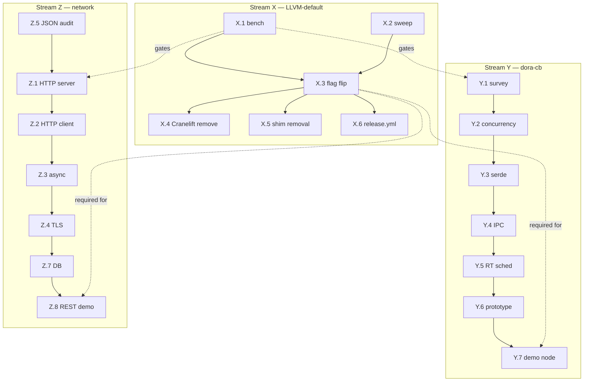

# ADR-0070: v0.7.0 master design — LLVM-default + dora-cb + network libs

## 1. Context

### 1.1 User mandate (verbatim, 2026-05-25)

> "务必把项目做到完美,为之后能做dora-cb正式参与机器人项目做准备,以及网络后端开发所需的库也要做准备,务必都在0.7.0前弄好,LLVM后端要完全替换掉现有的"

Translation:
- Make project perfect
- Prepare for `dora-cb` formal robotics participation (production-bar dora-rs interop)
- Prepare network-backend development libraries
- All before v0.7.0
- LLVM backend must fully replace existing (Cranelift)

### 1.2 Pre-state (v0.6.2 LIVE, HEAD `aa8b138`)

- ADR-0058g sub-wave-5 RATIFIED — LLVM-Cranelift feature parity at stdlib
  helper level (fmt + iter + math + parse_int + str-methods runtime hookup)
- F45a: 11/12 RESOLVED + 12th SHIPPED 2026-05-23
- F51 sub-wave-2 CLOSED — clippy `--features llvm` workspace clean
- Cranelift remains **default** backend (`cobrust-codegen` `default = []`;
  `llvm = ["dep:inkwell"]` is opt-in)
- `cobrust-jit` crate is Cranelift-specific (per ADR-0056a) — REPL + JIT path
  depend on Cranelift today

### 1.3 Pre-v0.7.0 deferred items

- **ADR-0068 §7.2** — shim binary removal (`cobrust-lsp-shim`,
  `cobrust-dap-shim`) was originally scoped for v0.7.0 only. ADR-0070
  consolidates that into the broader v0.7.0 sprint chain (Stream X.5).
- **ADR-0058g sub-wave-6** — `arr.append()` first-arg implicit-borrow
  (`AmbiguousType` blocker for `s.split` family non-string args). Resolution
  candidate inside Stream X.2 (LLVM stability sweep) if surfaced; otherwise
  documented as v0.7.0+ debt.

## 2. v0.7.0 scope — three streams

### 2.1 Stream X — LLVM-default migration

User directive: "LLVM 后端要完全替换掉现有的". Interpretation: Cranelift
removed; LLVM is only backend. Open questions §6 Q1+Q2 confirm bar.

| Sub | Description | Gate / output |
|---|---|---|
| X.1 | Benchmark Cranelift vs LLVM on LC-100 + examples corpus | `bench/cranelift-vs-llvm-v0.7.0.json` artifact; compile-time + runtime tables |
| X.2 | Stability sweep LLVM through LC-100 + examples + integration | LLVM passes every program Cranelift passes; gap list filed if any |
| X.3 | Default flag flip | `cobrust-codegen` `default = ["llvm"]`; build.rs adjustments |
| X.4 | Cranelift removal decision | Per "完全替换": full remove preferred. Trade-off doc inline §4; final call gated on X.1+X.2 data |
| X.5 | ADR-0068 shim binary removal | `cobrust-lsp-shim` + `cobrust-dap-shim` crates deleted; ADR-0068 §7.2 closure |
| X.6 | release.yml + Homebrew formula adjustments | Wheel matrix re-evaluated (LLVM substantially larger than Cranelift); macOS + Linux Tier-3 9-wheel re-baselined |

Phasing rationale: X.1 + X.2 produce evidence; X.3-X.6 are decisions gated
on that evidence. F35-sibling discipline — no flip before benchmarks.

### 2.2 Stream Y — Robotics-readiness (dora-cb)

dora-rs survey findings (2026-05-25, GH API):
- **Project**: DORA (Dataflow-Oriented Robotic Architecture) — Rust middleware
  for AI-based robotics; low-latency, distributed dataflow; dataflow graphs.
  3.7k stars, Rust-native.
- **Topics**: `dataflow`, `embodied-ai`, `low-latency`, `robotics`, `rust`
- **API surface (`apis/` directory)**: `rust/` + `python/` + `c/` + `c++/`
  language bindings. Cobrust would target the `rust/` binding surface (native
  FFI per CLAUDE.md §4.2 L3 PyO3-style reverse-binding pattern) OR translate
  the `python/` binding via L0-L3 pipeline.

| Sub | Description | Gate / output |
|---|---|---|
| Y.1 | Survey dora-rs Rust API surface in depth | `docs/agent/strategy/dora-rs-api-surface.md`; symbol inventory |
| Y.2 | Concurrency primitives audit | CLAUDE.md §2.2 "one structured-concurrency runtime" — Cobrust `task` semantics vs dora-rs node spawning; gap analysis |
| Y.3 | Serialization | Cap'n Proto + Arrow (dora-rs primary formats); Cobrust binding crate |
| Y.4 | IPC | ZMQ + shared-memory bindings; primary inter-node transport |
| Y.5 | Real-time scheduling | Priority + period + deadline primitives; tokio-rt vs custom |
| Y.6 | dora-cb prototype design | **Decision**: FFI-bind existing dora-rs runtime (Y.6a) vs full L0-L3 translation of Python bindings (Y.6b). §6 Q4. Recommended: FFI-first (Y.6a) for v0.7.0 ratification bar; translation path (Y.6b) deferred to post-v0.7.0 if FFI bar met |
| Y.7 | Done-means | End-to-end `dora start` workflow with at least one Cobrust-authored node participating in a dataflow graph |

### 2.3 Stream Z — Network-backend libraries

User directive: "网络后端开发所需的库". Minimum bar interpretation: HTTP +
JSON + DB sufficient to author a REST service; WebSocket / TLS / async are
stretch. Per CLAUDE.md §2.5 LLM-first: surface must match Python `asyncio`
+ `requests` + `aiohttp` priors.

| Sub | Description | Substrate | Done-means |
|---|---|---|---|
| Z.1 | HTTP server | tokio + hyper | `cobrust-http` crate; `axum`-style or `aiohttp`-style API (LLM-first §2.5: prefer overlap with both) |
| Z.2 | HTTP client | reqwest | `cobrust-requests` (extend stub crate) per L0-L3 OR native binding |
| Z.3 | Async I/O primitives | tokio runtime exposure | `asyncio`-compatible surface (sleep / gather / Future); per §2.2 single structured-concurrency runtime |
| Z.4 | TLS | rustls bindings | Embedded in Z.1 + Z.2; not standalone |
| Z.5 | JSON | serde_json | Verify `cobrust-tomli` completeness; dict[str, Any] equivalence; ensure `json.dumps` / `json.loads` LLM-first parity |
| Z.6 | WebSocket | tokio-tungstenite | `cobrust-websocket` crate; stretch goal |
| Z.7 | DB connectors | sqlx (Postgres / SQLite) + redis-rs | `cobrust-psycopg` / `cobrust-redis` / `cobrust-sqlite3` translation per L0-L3 |
| Z.8 | Done-means | — | Cobrust-authored REST service: HTTP server + DB-backed + JSON endpoints, demoable via curl |

## 3. Phasing (sequencing critical)

Sequencing:

1. **Phase X.early** (parallel): X.1 + X.2 benchmark + sweep. Data informs §4 + §6 Q1+Q2.
2. **Phase X.mid** (sequential): X.3 → X.5 → X.6. Gated on X.1+X.2 GREEN per F35-sibling discipline.
3. **Phase X.late** (decision): X.4 Cranelift removal — gated on §6 Q1 ratification.
4. **Phase Y.start** + **Phase Z.start** can begin as soon as X.1+X.2 commit
   (don't need X.3 done; only benchmarking phase). Survey + design work
   parallelizable.
5. **Phase Y.tail** + **Phase Z.tail** (Y.6/Y.7 + Z.7/Z.8) gated on X.3
   complete (need stable LLVM-default backend for demo workloads).

Stream X is **precondition** for empirical Y.7 + Z.8 demos.

## 4. Risk surfaces

- **Cranelift JIT path** (HIGH). `cobrust-jit` crate is Cranelift-specific
  per ADR-0056a. Removing Cranelift removes JIT path entirely. §6 Q2.
  Mitigations: (a) keep `cobrust-jit` as opt-in Cranelift-only sub-crate;
  (b) port to LLVM `lli` / MCJIT; (c) remove JIT path entirely (AOT-only
  per CLAUDE.md §5.3 "AOT compilation by default").
- **REPL** (HIGH). Per CLAUDE.md M14 stub, REPL is JIT-backed. Same
  Cranelift dependency. Resolution mirrors §6 Q2.
- **DAP / lldb** (LOW). Debug path already LLVM-based via DWARF emission;
  no migration cost.
- **CI / wheel binary size** (MEDIUM). LLVM substantially larger than
  Cranelift. Tier-3 9-wheel matrix per ADR-0065 may need re-evaluation:
  - wheel size inflation (potentially 50-100MB per wheel vs ~20MB today)
  - CI build time per matrix entry
  - GH Actions cache pressure (F44 sibling — stale-green vector)
- **dora-cb scope ambiguity** (MEDIUM). User said "正式参与" — interpret as
  "production usable for at least one dora node implementation". Minimum
  ratification bar = Y.7 demo. Stretch = full Cobrust port (Y.6b).
- **网络 backend scope ambiguity** (MEDIUM). User said "所需的库" — minimum
  bar = HTTP + JSON + DB (REST service authorable). WebSocket / TLS / async
  treated as stretch. Z.8 demo is ratification gate.
- **L0-L3 translation reliability** (MEDIUM). Per F45a / F44 baseline, the
  full L0-L3 pipeline has been demonstrated on tomli (M4) + msgpack (M6).
  Z.7 DB connectors + Y.6b (if pursued) would be largest L0-L3 sprints
  to date; F51 sibling (clippy CI gate) + F44 (cache-stale-green) discipline
  applies.

## 5. Done-means (v0.7.0 ratification)

- All §2 streams **shipped** OR **explicitly deferred with finding URN**.
  No silent drops.
- LLVM backend is **default** (or **only**) backend in workspace.
- ADR-0068 §7.2 shim binaries removed.
- Empirical demos (both required):
  - **dora-cb minimal node**: Cobrust-authored source file, compiles via
    LLVM-default backend, participates as a node in a live dora-rs
    runtime dataflow graph (Y.7).
  - **Cobrust REST service**: HTTP server + DB-backed + JSON endpoints,
    demoable via curl against running binary (Z.8).
- All wave-3 + new infra runs GREEN under LLVM-default backend
  (LC-100 + examples + integration + clippy --features llvm via F51 gate).
- `cobrust-jit` + REPL fate explicitly decided (§6 Q2).
- Cross-link from CHANGELOG.md v0.7.0 entry to ADR-0070.

## 6. Open questions

| ID | Question | Recommended bar | Decision gate |
|---|---|---|---|
| Q1 | Cranelift: full remove vs opt-in feature flag | Full remove (per user "完全替换"); confirm post-X.1+X.2 | User explicit sign-off post §X.1+X.2 evidence |
| Q2 | `cobrust-jit` fate | Option (b) port to LLVM MCJIT preferred; (a) Cranelift-only sub-crate as fallback | Gated on Q1 |
| Q3 | Network backend: pure L0-L3 translate vs native-Cobrust | Hybrid: low-level (tokio / hyper / sqlx) = native FFI binding; high-level (`requests`-style API) = L0-L3 translate | Per-library; settled in §2.3 sub-phase ADRs |
| Q4 | dora-cb: FFI binding vs full Cobrust port | FFI-first (Y.6a) for v0.7.0; translation path (Y.6b) deferred | Gated on Y.1 survey + Y.7 demo feasibility |

## 7. Cross-refs

- ADR-0001 (Apache-2.0 + MIT dual license)
- CLAUDE.md §1.2 (AI-native compiler) + §2.2 (no GIL — single
  structured-concurrency runtime) + §2.5 (LLM-first design principle)
- CLAUDE.md §4.2 (L0-L3 translation pipeline — gates for Stream Z + Y.6b)
- ADR-0056a (`cobrust-jit` Cranelift dependency — Stream X §4 risk surface)
- ADR-0058g (LLVM wave-3 RATIFIED — precondition state for Stream X)
- ADR-0065 (Tier-3 9-wheel matrix — Stream X.6 re-baseline scope)
- ADR-0067 (vscode-cursor extension — affected by X.5 shim removal)
- ADR-0068 (single-binary subcommand collapse — §7.2 shim removal in X.5)
- ADR-0069 (wheel FHS layout — affected by X.6 release.yml adjustments)
- F44 (CI cache stale-green — discipline gate for Stream X.6)
- F45a (12/12 RESOLVED — closure baseline for Stream X.2 gap list)
- F51 (clippy --features llvm CI gate — Stream X stability sweep gate)

## 8. Status

**Status**: proposed.

**Ratification path**:
1. §X.1 + §X.2 benchmark + stability evidence committed
2. §6 Q1 + Q2 user sign-off (Cranelift remove + JIT fate)
3. §X.3 default flip lands on main
4. §Y.7 + §Z.8 empirical demos GREEN
5. ADR status flip `proposed` → `accepted` in v0.7.0 release commit

**Author**: P10 CTO via P8 dispatch.

**Date**: 2026-05-25.
