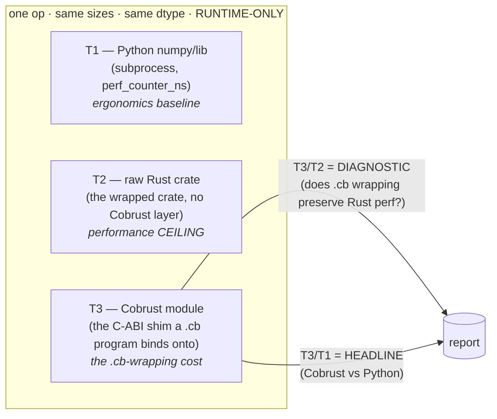

# Cobrust performance benchmarks — methodology (single source of truth)

This directory holds the Cobrust performance-benchmark suite and is the
**single methodology source** every library / ecosystem-module benchmark
follows. It exists to satisfy CLAUDE.md §5.2 ("every claim of 'faster' or
'safer' cites the experiment file") and §5.3 ("every benchmark is
reproducible: scripted, seeded, hardware-tagged"). It also gives the
translation pipeline's `L2.perf` gate (currently an `AcceptAllPerf` stub) a
real number to gate on, per CLAUDE.md §4.2 ("Performance gate: ≥ 0.8× of
original on representative benchmarks").

> **Status of the suite.** Three increments landed:
> 1. **coil element-wise add** (`coil-elementwise-add.md` +
>    `benches/elementwise_add.rs`) — coil at the raw-`ndarray` ceiling,
>    *faster* than numpy at small/mid N.
> 2. **coil matrix multiply** (`coil-matmul.md` + `benches/matmul.rs`) — the
>    `@` operator; an HONEST loss on the headline ratio: `T3/T1` (vs numpy) is a
>    large BLAS gap (`~1.9×→~12×→~12×` over N=16/64/256), root-caused to the
>    ndarray-GEMM-vs-BLAS backend gap (raw ndarray itself loses `T2/T1 ≈ 7×`),
>    motivating #157. The diagnostic `T3/T2` (vs raw ndarray) is `>1` but
>    **shrinks/amortizes** toward the ceiling (`~5.8×→~2.6×→~1.7×`) — coil's
>    O(N²) matmul marshalling copies, an O(N²)-against-O(N³) tax (a named
>    #166-analogue fast-path follow-up). A worked example of reporting a gap,
>    not a win — incl. a corrected cold-capture (warm-up raised to 50).
> 3. **coil full-array reduction `mean`** (`coil-mean.md` + `benches/reduce.rs`)
>    — the scientifically-distinct case: a reduction is O(N)→O(1), so there is
>    **NO output array to marshal** across the FFI boundary (contrast the
>    add/matmul result `Buffer`). The diagnostic `T3/T2` (vs raw
>    `coil::mean_scalar`) collapses to **~1.0× at ALL N** — proving the
>    scalar-return FFI cross is free and that the add/matmul wrapping tax was the
>    *output copy*, not the boundary itself (the headline insight). The headline
>    `T3/T1` is an HONEST loss at scale (`~0.17×→~6×→~13×`), a *kernel* gap —
>    ndarray's scalar `mean` fold vs numpy's SIMD pairwise sum (raw ndarray loses
>    by the same `T2/T1`) — NOT BLAS, NOT coil's wrapping; names a SIMD/pairwise
>    reduce-kernel follow-up (the reduction analogue of #166).
>
> Future library benchmarks reuse the 3-tier model + honesty rules below.

---

## 1. The 3-tier model

Every ecosystem-module benchmark measures the **same operation** three ways.
The tiers are deliberately chosen so two ratios fall out, one diagnostic and
one headline.

| Tier | What runs | Role | Why it is the right comparison |
|---|---|---|---|
| **T1** | The Python library (e.g. `numpy`) in a `python3` subprocess, timed with `time.perf_counter_ns()` | The **ergonomics baseline** — "what a Python user already gets" | numpy is C/SIMD-backed; beating *Python the language* is trivial, beating numpy *the library* is the real bar |
| **T2** | The **raw Rust crate the Cobrust module wraps** (e.g. `ndarray`), called directly with no Cobrust layer | The **performance ceiling** | This is the best a Rust program can do for the op. The Cobrust module *wraps* this crate, so it can only approach T2, never beat it. Pins how much headroom exists. |
| **T3** | The **Cobrust module's C-ABI shim** — the exact symbol a compiled `.cb` program binds onto (e.g. `__cobrust_coil_buffer_add`) — plus the per-op result free | The **`.cb`-wrapping cost** | This is what a real `.cb` user pays. It includes the runtime kernel **and** the FFI boundary + per-op allocation the wrapping imposes. |

### 1.1 The two ratios

- **`T3 / T2` — the diagnostic axis (the most important number).** Does the
  `.cb` wrapping (FFI cross + per-op result alloc + any redundant copies in
  the kernel) **preserve** the raw-Rust ceiling, or **erode** it?
  `T3/T2 = 1.0` means coil is as fast as hand-written `ndarray`; `T3/T2 =
  4.0` means the wrapping costs a 4× slowdown that a future optimization
  could reclaim. This ratio is **the actionable engineering signal** — it
  isolates Cobrust's own overhead from the underlying crate's speed.
- **`T3 / T1` — the headline ("Cobrust vs Python").** `< 1.0` means the
  Cobrust module is faster than the Python library; `> 1.0` means slower.
  This is the number for external communication, but it conflates two
  things (Cobrust's wrapping cost **and** how the raw Rust crate compares to
  the C library), so it is **less diagnostic** than `T3/T2`.

### 1.2 The array-size sweep (where the crossover lives)

Run the **same op at several sizes** (default `[100, 10_000, 1_000_000]`):

- **Small (100)** — *boundary-dominated.* Fixed per-call costs (FFI cross,
  `Box` alloc/free of the result handle, Python's interpreter dispatch in
  T1) dominate; the kernel is noise. Exposes per-op overhead.
- **Large (1_000_000)** — *kernel-bound.* Fixed costs amortize; throughput
  (memory bandwidth, SIMD width, number of passes over the data) dominates.
- **The crossover** between these regimes is the key finding of any tier
  comparison — it tells you whether a module's overhead is a *fixed per-call
  tax* (amortizes away — fine for big arrays) or a *per-element tax* (scales
  with the data — a real throughput bug). See the coil report for a worked
  example where the overhead turned out to be per-element, not fixed.

---

## 2. Honesty rules (§5.3 — non-negotiable; the audit checks these)

These are the rules an audit verifies for **every** benchmark in this suite.
Violating any one is the primary failure mode of a perf claim.

- **(a) RUNTIME-ONLY — never include compile time.**
  - For the Cobrust tier (T3), time the **runtime C-ABI call in a hot loop**,
    NEVER a `cobrust build`. Translation/compilation is a separate concern.
  - **Input arrays are allocated ONCE, OUTSIDE the timed region**, in all
    tiers. Only the operation is timed.
  - The op's **result allocation + free IS timed and MUST be documented as
    included** when it is a genuine, unavoidable part of the module's per-op
    cost. (For coil, every `.cb` `a + b` allocates a fresh `Buffer` the scope
    later drops — so the alloc+free is real cost and is included; T1's
    `np.add` and T2's `&a + &b` each allocate+free one result per iter too,
    keeping the three tiers symmetric.)
- **(b) WARM-UP, then MEDIAN (never mean), over N samples.**
  - Discard `WARMUP` iterations first (default `50`) to reach steady state
    (caches warm, branch predictors trained, JIT/allocator warmed).
  - Collect **N individual per-iteration samples** (default `N = 201`, odd so
    the median is one observed sample, not an average of two) and report the
    **true median** ns/op. Median, not mean, because a dev laptop produces
    occasional large outliers (scheduler preemption, thermal) that skew the
    mean; the median is the robust central estimate.
  - Report **N**, the **median ns/op**, and the **median ns/element**. Mean +
    min are reported alongside for transparency, but the headline metric is
    the median.
- **(c) SAME WORK across tiers.**
  - Same array size, same `f64` dtype, same operation semantics.
  - Inputs are a **deterministic ramp** (`a[i] = i*0.5 + 1.0`,
    `b[i] = i*0.25 - 3.0`) so (i) the op cannot be constant-folded away and
    (ii) all three tiers add **bit-identical values** (numpy re-derives the
    same ramp via `np.arange`).
  - **Document any unavoidable cross-tier difference.** (Example for coil: T1
    times numpy's `np.add` over a contiguous C array; T2/T3 time `ndarray`
    `ArrayD<f64>` — both contiguous 1-D f64, semantically identical; numpy
    being a separate process means T1 also pays process-internal Python
    dispatch, which is *part of* the "what a Python user gets" baseline, not
    an artifact to subtract.)
- **(d) HARDWARE-TAGGED.**
  - The report captures **CPU model + core count + OS (kernel) + rustc
    version + the Python interpreter & library version used for T1**.
  - The report **explicitly notes these are dev-laptop numbers** — no fixed
    CPU governor, no thermal isolation, no `taskset` pinning. They are
    **indicative, reproducible-in-shape, NOT a controlled benchmark-rig
    measurement.** Absolute ns vary run-to-run; the **ratios are stable** and
    are the load-bearing result.
- **(e) REPRODUCIBLE — one scripted entrypoint.**
  - A single command re-runs the whole comparison. For coil:
    `cargo bench -p cobrust-coil --bench elementwise_add`, or the
    hardware-tagged wrapper `scripts/bench/coil_elementwise_add.sh` which
    additionally stamps the hardware header into a report-ready block.
  - The benchmark is **seeded/deterministic** (the ramp is a pure function of
    the index; no RNG), so the *work* is identical across runs and machines.

### 2.1 CI behavior

- The **T1 (Python) tier self-SKIPS** when no `python3` with `numpy` is found
  (the same `pick_python()` discovery the coil differential gate uses). On
  CI, where numpy is typically absent, the **T2 + T3 Rust tiers still run**
  and the `T3/T2` diagnostic is still produced; the report records the T1
  skip. T1 is therefore a *local-development* enrichment, not a CI gate.
- The bench compiles under the normal workspace build (it is a registered
  `[[bench]]` with `harness = false`), so `cargo build`/`clippy
  --all-targets` keep it warning-clean as part of the L2 build gate.

---

## 3. How to add a new library benchmark

1. Pick the operation that is most representative of the library's hot path.
2. Implement a `harness = false` bench (`benches/<op>.rs`) in the library's
   crate that runs **all three tiers** (T2/T3 in Rust; T1 by shelling out to
   the Python library, self-skipping when absent). Reuse the structure of
   `crates/cobrust-coil/benches/elementwise_add.rs`:
   - `pick_python()` discovery + numpy/lib-availability self-skip.
   - `summarize()` → median (+ mean/min) over N per-iter samples.
   - `KEY=value` stdout lines (grep-able) **and** a human-readable table.
3. Allocate inputs once; time only the op (+ documented result alloc/free).
4. Write the report under `docs/agent/benchmarks/<library>-<op>.md` with the
   hardware tag, the honesty-rule restatement, the numbers table, **and a
   "why these numbers" section** that explains the result mechanistically
   (not just reports it) — e.g. by reading the kernel and counting its
   allocations/passes.
5. Wire the headline ratio into the `L2.perf` gate's threshold once the gate
   is de-stubbed (CLAUDE.md §4.2: ≥ 0.8× the Python library).

---

## 4. Files

| File | Role |
|---|---|
| `README.md` (this file) | Methodology — the single source of truth |
| `coil-elementwise-add.md` | First report: coil `a + b` vs numpy vs raw `ndarray` |
| `crates/cobrust-coil/benches/elementwise_add.rs` | The runnable 3-tier `a + b` bench |
| `scripts/bench/coil_elementwise_add.sh` | Hardware-tagged one-command `a + b` wrapper |
| `coil-matmul.md` | Second report: coil `a @ b` vs numpy(BLAS) vs raw `ndarray` |
| `crates/cobrust-coil/benches/matmul.rs` | The runnable 3-tier `a @ b` bench |
| `scripts/bench/coil_matmul.sh` | Hardware-tagged one-command `a @ b` wrapper |
| `coil-mean.md` | Third report: coil `mean(a)` vs numpy vs raw `coil::mean_scalar` — the O(N)→O(1) reduction (no output to marshal; `T3/T2 ≈ 1.0`) |
| `crates/cobrust-coil/benches/reduce.rs` | The runnable 3-tier `mean(a)` reduction bench |
| `scripts/bench/coil_mean.sh` | Hardware-tagged one-command `mean(a)` wrapper |
