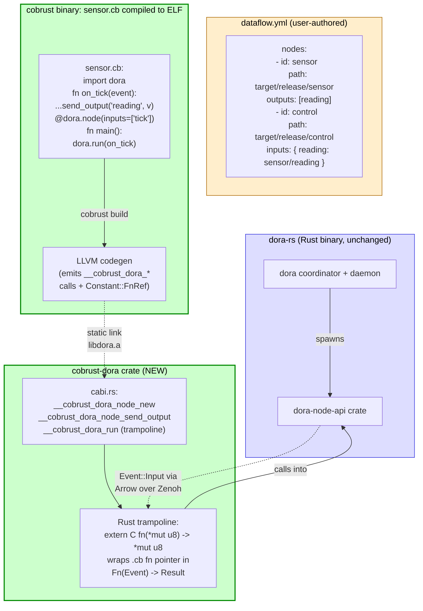

# dora-cb Architecture Insight

> READ THIS FIRST before any Stream Y dora-cb sprint dispatch.
> Pairs with ADR-0076 (the architectural decisions) and
> `v0.7.0-dora-cb-integration-roadmap.md` (the 2026-05-25 dora-rs API survey).

## Core insight (mirrors numpy-translation-architecture)

**dora-cb = a "wrapper FFI" project, NOT a "dataflow runtime port" project.**

The community over-estimates dora translation difficulty because they're scared
by the dataflow / Zenoh / Arrow / tokio coordination layer — but that layer is
NEVER the translation target. dora-rs already ships it as a production-grade
Rust binary; Cobrust nodes plug in as **first-class C-ABI callers** of the
dora-node-api crate, exactly like a Cobrust node written today plugs into pit
or den via ADR-0072 + ADR-0073.

This is the SAME shape as the numpy story (`numpy-translation-architecture.md`):

| Layer | dora-cb (this doc) | numpy (sister doc) |
|---|---|---|
| User-visible Cobrust surface | `import dora; node = dora.Node()` | `import coil; a = coil.eye(3)` |
| Cobrust wrapper crate | NEW `cobrust-dora` (~5-7 symbols) | Existing `cobrust-coil` (numpy rebrand) |
| Cobrust ↔ runtime ABI | C-ABI shims (ADR-0073 trampoline pattern) | PyO3 + C-ABI shims (ADR-0011) |
| Heavy underlying runtime | `dora-node-api` Rust crate (Zenoh + Arrow + tokio) | numpy C `.so` + LAPACK / BLAS Fortran |
| Translate the heavy layer? | **NO** — FFI from Cobrust unchanged | **NO** — FFI from Cobrust unchanged |
| Phase planning | 3 phases (this doc) | 1-2 phases (numpy sister doc) |

## Why FFI is the right path (vs translation)

1. **§2.5 LLM-first overlap**: a robotics engineer LLM, given "write a dora
   node in Cobrust", will emit the Python-dora idiom (`for event in node: ...`
   + `node.send_output("out", pa.array([...]))`). FFI preserves this surface
   verbatim — LLM gets it right first try. Translation would produce a
   Cobrust-native dataflow surface the LLM has never seen.
2. **Schedule risk**: dora-rs is at workspace `0.2.1` — pre-1.0 SemVer; the
   Python API is still mutating. Full L0-L3 translation would chase a moving
   target. FFI tracks via `cargo update`.
3. **Zero perf loss**: the inner dataflow loop (Zenoh SHM transport + Arrow
   zero-copy) is dora-rs's hot path. Cobrust nodes participate at the dora-rs
   API boundary; there's nothing to gain from re-implementing the loop.
4. **Closed-loop verification natural**: dora-rs's own pytest suite + example
   dataflows ARE the oracle. CI runs `dora start dataflow.yml` against a
   Cobrust node and asserts message round-trip.

## Architecture diagram — dataflow → Cobrust callback bridge

## The five layers ADR-0072 + ADR-0073 already ship

`cobrust-dora` plugs into the SAME chain:

| Layer | dora-cb role |
|---|---|
| L1 typecheck | `dora.Node()` + `node.send_output(...)` look up in `cobrust-types/src/ecosystem.rs` manifest under `DORA_NODE_ADT = AdtId(ECO_ADT_BASE + 0x600)` block |
| L2 MIR intrinsic-rewrite | `node.send_output(out, data)` retargets to `Constant::Str("__cobrust_dora_node_send_output")` |
| L3 codegen extern decl | LLVM `declare_runtime_helpers` adds the dora-shim externs; `Constant::FnRef` materialises the .cb callback fn pointer (ADR-0073 §2 D3) |
| L4 runtime shim | NEW `crates/cobrust-dora/src/cabi.rs` — mirrors `cobrust-pit/src/cabi.rs` trampoline pattern verbatim |
| L5 static link | `cobrust-cli/src/build.rs` `locate_ecosystem_archive("dora")` resolves `libdora.a`; transitively pulls dora-node-api + zenoh + arrow at the final link step |

## Translation targets — what stays Rust, what becomes Cobrust

| Layer | LOC share (rough) | Translate to Cobrust? |
|---|---|---|
| dora-rs core (Zenoh wiring, Arrow IPC, tokio runtime, coordinator) | ~50K LOC | **NO** — FFI from `cobrust-dora` |
| dora `apis/python/node` (PyO3 wrapper, ~500 LOC) | <1% | **NO** — replaced by `cobrust-dora` cabi.rs |
| `cobrust-dora` Rust wrapper (cabi.rs + manifest entries) | ~600 LOC new | (this IS the deliverable) |
| User node code (`.cb` files in `examples/`) | per-node ~20-100 LOC | **YES** — Cobrust source |

The trampoline pattern (ADR-0073 §2 D4) means the .cb callback fn-pointer
crosses the C-ABI boundary AT MOST ONCE per dataflow message. Steady-state hot
path is pure dora-rs Rust + a single `unsafe extern "C"` callback site per
event. No perf loss vs hand-written Rust dora node.

## Non-trivial design surfaces (deep-protocol coupling)

These are "detail-hard" not "path-wrong" — same category as numpy
`__array_interface__` / dtype metaclass:

- **Arrow IPC wire format**: dora messages cross as Arrow `RecordBatch`. The
  .cb side needs a Cobrust-ergonomic view (slice / iterator / list-of-rows).
  Phase 1 ships only scalar `i64` + `str` payloads (the `IntoArrow` path for
  primitives); list / dict payloads are Phase 2.
- **Event::Input metadata**: timestamps, OpenTelemetry trace IDs, parameters
  dict. Phase 1 exposes timestamp + parameters only; trace IDs are Phase 3.
- **dora-yaml descriptor parsing**: each Cobrust node binary today doesn't
  read the yaml — dora coordinator does and spawns the binary. But for
  Cobrust to declare INPUTS / OUTPUTS at compile time (so the type-check
  can verify `send_output("oops_typo", ...)` against the declared output
  list), the .cb source needs an attribute / decorator that mirrors the
  yaml node entry. Phase 2 scope (`@dora.node(inputs=[...], outputs=[...])`).
- **dora ROS2 bridge**: dora-rs ships ROS2 interop via `ros2-bridge-node`
  binary. Cobrust nodes consume ROS2 messages by setting an `input` of
  type `ros2`. No Cobrust ROS2 API needed at v0.7.0 ratification; ROS2 is
  dora's concern, Cobrust just reads Arrow Events. ROS2 sub-ADR 0076a is
  Phase 3+ only.

## Prerequisites (proven, already shipped)

- **ADR-0072** (.cb ecosystem-import chain, 5 modules CI-verified) — every L1-L5
  layer except L4-shim-authoring is reusable as-is.
- **ADR-0073** (.cb↔Rust callback marshalling) — the trampoline pattern that
  makes `dora.run(on_event)` work. pit (`__cobrust_pit_app_route`) is the proof.
- **ADR-0074** (decorator desugar) — makes `@dora.node(inputs=[...])` sugar
  feasible (Phase 2).
- **ADR-0028** (M13 concurrency runtime, tokio) — dora-rs's own tokio is the
  runtime; Cobrust's tokio singleton must NOT double-init.

## Phase plan summary (full detail in ADR-0076 §Q5)

| Phase | Wall | Scope | Key gate |
|---|---|---|---|
| **Phase 1** | ~2 day-units | Crate scaffold + manifest entry + 1 source-1 sink-1 callback hello node | `dora start` runs a Cobrust sender + Rust receiver round trip |
| **Phase 2** | ~3 day-units | Multi-IO, yaml-load, panic-safety, drop discipline, `@dora.node` decorator | `dora start` runs 4-node Cobrust dataflow with mixed Arrow payloads |
| **Phase 3** | ~3 day-units | Real-robotics demo (CartPole sim camera → tiny CNN → control output) | End-to-end physical demo + CI smoke |

Total budget: **~8 day-units (~1.5 work-weeks)** at agent-velocity. Matches
the user "周→天" pace mandate.

## When to act on this insight

DISPATCH NOW. v0.7.0 Stream Y is the binding constraint — dora-cb production-bar
must land before release per user 2026-05-25 directive. ADR-0076 ratifies the
design; Phase 1 sprint dispatches off this strategy doc.

## Cross-references

- [[adr:0072]] .cb ecosystem-import chain (5 modules CI-verified, the parent chain)
- [[adr:0073]] .cb↔Rust callback marshalling (the load-bearing pattern)
- [[adr:0074]] decorator desugar (Phase 2 prerequisite)
- [[adr:0028]] M13 concurrency runtime (tokio singleton concern)
- [[adr:0076]] dora-cb Stream Y architecture (this doc's ratification companion)
- [[strategy:v0.7.0-dora-cb-integration-roadmap]] — the 2026-05-25 dora-rs API survey
- [[strategy:numpy-translation-architecture]] — sister strategy doc; same wrapper-FFI shape
- **upstream**: <https://github.com/dora-rs/dora> (workspace 0.2.1, 2026-05-25 survey)

## F35-sibling discipline note

If this doc and `v0.7.0-dora-cb-integration-roadmap.md` ever diverge on a
factual claim (e.g. dora's wire format), THIS doc is the architectural
authority; the integration-roadmap is the API survey. Reconcile by
re-fetching dora-rs HEAD and updating the survey first, then propagating.
