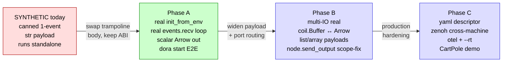

# dora-REAL Integration Plan

> **This is a PLAN for the CTO to act on, NOT an authoritative spec.** It
> scopes the path from the current SYNTHETIC dora trampoline to a REAL
> `dora-node-api` FFI binding, so a future impl sprint executes without
> re-discovery. Where it touches `cobrust-types` / `cobrust-mir` /
> `cobrust-codegen` / `coil` surface design, those are PROPOSALS — the
> ratifying decision is a follow-up sub-ADR (likely ADR-0076 Phase-2/3
> amendments + ADR-0076c for the Arrow surface). Empirical API facts are
> cited; anything not directly verified is marked **[UNVERIFIED]**.
>
> Companion to ADR-0076 (the ratified architecture) and
> `v0.7.0-dora-cb-integration-roadmap.md` (the 2026-05-25 first survey).
> This doc RE-SURVEYS dora-rs as of 2026-06-01 and the survey moved — see
> §3.0 the version-drift correction (F35-sibling).

---

## 1. Bottom-line

### 1.1 How big is dora-REAL?

**Tractable, not large — but bigger than the prior survey's "~7 symbols, days"
estimate implied, because the crux is not the node API surface, it is the
Arrow data-marshalling boundary + the external-runtime test harness.** The
node API itself is genuinely small (~6 methods on `DoraNode`, a 4-variant
`Event` enum, a blocking `events.recv()` loop). What makes dora-REAL non-trivial:

1. **A whole new dependency tier enters the workspace.** `dora-node-api` pulls
   `arrow ^54.2.1` + `tokio ^1.24` + `bincode` + `flume` + `shared_memory_extended`
   + (transitively, via `dora-core`) the Zenoh-based daemon-comms stack. Today
   the workspace has **zero** `arrow` / `zenoh` / `bincode` deps (verified by
   grep over `crates/*/Cargo.toml`). This is the ADR-0076 §8 risk-3/risk-4
   weight, now concrete.
2. **The Arrow marshalling boundary is real new code, not a re-export.**
   `coil`'s `Buffer` is `Box<ndarray::ArrayD<f64>>` (no arrow dep); dora's
   payload is `arrow::array::ArrayRef`. Getting a `coil.Buffer` onto a dora
   output (and a dora input back into a `coil.Buffer`) requires a hand-written
   `ndarray ↔ arrow Float64Array` bridge. This is the "detail-hard not
   path-wrong" surface the architecture doc flagged.
3. **The node binary can no longer run standalone.** Today the synthetic E2E
   runs the compiled `prog` directly and asserts stdout. A REAL dora node calls
   `DoraNode::init_from_env()`, which reads daemon-injected env vars and
   **fails / blocks if no dora daemon spawned it**. So the E2E must either
   (a) drive a real `dora start dataflow.yml` (needs the `dora` CLI binary on
   PATH), or (b) use the `dora-rs` **dynamic-node** path (`init_from_node_id`)
   against a hand-started coordinator+daemon. The test topology changes shape.

### 1.2 The tractable v0.7.0 increment

**Phase A: one real hello-world dora node — a `.cb` source compiles + links
against `dora-node-api 0.5.0` and runs as a genuine custom node inside a real
`dora start` dataflow, sending one scalar output that a sibling node receives.**

Concretely the v0.7.0 ratification-worthy increment is:

- `cobrust-dora` grows a `dora-node-api = "=0.5.0"` dependency (exact-pin) and a
  real `node.rs` wrapping `DoraNode` + `EventStream`.
- The 4 lifecycle shims (`node_new` / `node_run` / `event_*` / `node_drop`)
  stop fabricating a canned event and instead drive `init_from_env()` +
  `events.recv()`, firing the `.cb` callback once per **real** `Event::Input`.
- `send_output` carries one **scalar** payload (`i64` or a length-1 Arrow
  primitive array) — enough to prove the wire, deferring the `coil.Buffer ↔
  Arrow` bridge to Phase B.
- A real `examples/dora_hello/dataflow.yml` + a sibling receiver (Rust is
  acceptable for Phase A per ADR-0076 §6 Phase-1 done-means), driven by a CI
  smoke job that **skips clean** when `dora` is not on PATH.

This is the ADR-0076 "Phase 1 done-means gate 3" that the synthetic trampoline
deliberately stubbed — it is the single highest-value real-vs-synthetic delta.

### 1.3 The synthetic → real path (one glance)



The load-bearing insight: **the C-ABI surface (`__cobrust_dora_*` symbols, the
manifest rows, the codegen `Constant::FnRef` callback) does NOT change between
synthetic and real.** The compiler-side chain (L1→L3 + L5) is already correct.
Only the L4 runtime shim body swaps from "fabricate a canned event" to "drive a
real `DoraNode`". That is why this is FFI-tractable: it is a `cabi.rs`-local
rewrite plus a new dependency, not a compiler change.

---

## 2. Current synthetic state

Verified by reading `crates/cobrust-dora/{Cargo.toml,build.rs,src/lib.rs,src/cabi.rs}`
+ the 3 E2E tests + the ecosystem manifest at HEAD `936f13c`.

### 2.1 What is implemented (the proven chain)

| Layer | Surface | File |
|---|---|---|
| L1 typecheck | `("dora","Node")`, `("dora","node")`, `("dora","declare_input")`, `("dora","declare_output")` module rows + `(DORA_NODE_ADT, "run"\|"shutdown")` + `(DORA_EVENT_ADT, "id"\|"data_str"\|"send_output")` handle rows; `DORA_NODE_ADT = 0xE000_0600`, `DORA_EVENT_ADT = 0xE000_0601` | `cobrust-types/src/ecosystem.rs` |
| L2 MIR | intrinsic-retarget onto the `__cobrust_dora_*` symbols (reused ADR-0072 path; **no dora-specific code in `cobrust-mir/src/lower.rs`** — grep is empty) | (generic) |
| L3 codegen | `Constant::FnRef` materialises the `.cb` `fn(dora.Event)->i64` callback as a raw C fn pointer (reused ADR-0073 path) | (generic) |
| HIR sugar | `@dora.node(inputs=[...], outputs=[...])` module-receiver decorator → synthetic `dora.node(handler)` (F68 resolution; metadata validated then **dropped**) | `cobrust-hir/src/lower.rs` |
| L4 runtime | 11 `#[no_mangle] extern "C"` shims — the SYNTHETIC trampoline | `cobrust-dora/src/cabi.rs` |
| L5 link | `locate_ecosystem_archive("dora")` → `libdora.a`, static-linked after `libcobrust_stdlib.a` | `cobrust-cli/src/build.rs` |

E2E coverage today (all green, all run the compiled binary **standalone**):
`dora_hello_e2e.rs` (single canned event + 2 negative callback-shape gates),
`decorator_dora_e2e.rs` (decorator + bare-form + 4 negative shape gates),
`dora_multi_io_e2e.rs` (multi-input dispatch + `send_output` capture).

### 2.2 Where the trampoline is + what is faked

The fake is entirely inside `cobrust-dora/src/cabi.rs`. Specifically:

- **`__cobrust_dora_node_run` (cabi.rs ~L371)** is the trampoline core. It reads
  `REGISTERED_HANDLER` (a process-global `AtomicPtr`), builds a **canned**
  `Vec<(String,String)>` of `(id, payload)` — `("camera","frame_001")` when no
  inputs declared, else one `("<id>","frame_<id>")` per `DECLARED_INPUTS` entry
  — boxes a `DoraEventHandle` per pair, invokes the callback under
  `catch_unwind`, frees the box. **There is no `DoraNode`, no `events.recv()`,
  no Arrow, no daemon.** The comment at L364 names the eventual replacement:
  "a later phase replaces this with the real `DoraNode::events().into_iter()`
  driven loop over the zenoh broker."
- **`DoraEventHandle { id: String, data_str: String }` (cabi.rs ~L257)** — the
  payload is a **UTF-8 string only**. The comment at L262 marks the Phase-2
  widening to `__cobrust_dora_event_data_arrow` + Arrow `RecordBatch`.
- **`__cobrust_dora_event_send_output` (cabi.rs ~L574)** captures the emission by
  `println!("output[{id}]={payload}")` to stdout (so the E2E can assert it) +
  bumps `SEND_OUTPUT_COUNT`. The comment at L606 marks the real path: "A real
  broker would marshal `payload` into an Arrow RecordBatch + publish on the
  zenoh output channel here."
- **`DECLARED_INPUTS` / `DECLARED_OUTPUTS` (cabi.rs ~L213/L222)** — process-global
  `Mutex<Vec<String>>` populated by `declare_input`/`declare_output` shims that
  the decorator desugar emits. In the real path these become the node's actual
  input/output port set (and the validation moves to compile time).
- **`Cargo.toml`** carries `# Phase 1 is synthetic — no dora-node-api dep yet`
  and a stale plan to pin `=0.2.x` (see §3.0 drift).

### 2.3 The three divergences from ADR-0076 the impl already introduced

These matter because the real-FFI sprint must reconcile them — they are NOT in
the ADR but ARE in the shipped code:

1. **`event.send_output(...)` not `node.send_output(...)`.** ADR-0076 §4/§5
   sketches `node.send_output("reading", ...)`, but the manifest row is
   `(DORA_EVENT_ADT, "send_output")` (ecosystem.rs ~L1224). Rationale recorded
   in `dora_multi_io_e2e.rs` header L48-63: in the callback form the `node`
   handle is a **local of `main`, not in the handler's scope**, so a
   `node.send_output` call cannot type-check inside the handler without a
   separate "ambient node" mechanism. **This is the single biggest real-FFI
   design tension** — see §4.4.
2. **Callback returns `i64`, not `Result[None, Error]`.** ADR-0076 §4
   `dora_event_handler_fn_ty()` sketches `Result[None, Str]`; the shipped
   `dora_event_handler_fn_ty()` (ecosystem.rs ~L300) returns `Ty::Int`. The
   trampoline discards the return (hood's "side-effect IS the intent" pattern).
3. **`inputs=`/`outputs=` metadata is dropped at HIR** (F68 outcome) — validated
   as list-of-str literals then discarded; the synthesised call is single-arg
   `dora.node(handler)`. The metadata must become **load-bearing** in the real
   path (it IS the node's port declaration + the compile-time `send_output` ID
   check ADR-0076 §6 Phase-2 done-means 2 promises).

---

## 3. The real dora-rs API (`dora-node-api`)

All facts below verified 2026-06-01 against docs.rs + crates.io + the
`dora-rs/dora` main-branch `examples/rust-dataflow` source. Citations in §7.

### 3.0 Version-drift correction (F35-sibling — READ FIRST)

**The prior survey + ADR-0076 are stale on the version.** They cite dora-rs
**workspace `0.2.1`** and plan `dora-node-api = "0.2.x"` + `arrow = "58"`. The
**actual published `dora-node-api` crate is independently versioned and is now
`0.5.0`** (released 2026-03-25, Apache-2.0, ~102.6K downloads). The "0.2.1" was
the *workspace* version string, not the *crate* version — a confusion the impl
sprint must not inherit. Corrected pins:

| Field | ADR-0076 / survey (stale) | **Real, as-of 2026-06-01** |
|---|---|---|
| `dora-node-api` version | `0.2.x` | **`0.5.0`** |
| `arrow` version | `58` | **`54.2.1`** (dora pulls `arrow ^54.2.1`) |
| transitive deps | "zenoh + arrow + bincode + tokio" | `arrow 54`, `tokio ^1.24`, `futures 0.3`, `bincode 1.3`, `flume 0.10`, `shared_memory_extended 0.13`, `serde_json`, `tracing`; `dora-core 0.5`, `dora-message 0.8`, `dora-arrow-convert 0.5`; **optional** `opentelemetry 0.23` + `dora-metrics`/`dora-tracing` |
| License | Apache-2.0 | Apache-2.0 (compatible with Cobrust's Apache-2.0 OR MIT) |

The impl sprint MUST pin `dora-node-api = "=0.5.0"` exact-patch + record the
"as-of 2026-06-01, crate 0.5.0" qualifier in the commit message (ADR-0075 §10
F35-sibling discipline). **[UNVERIFIED]** whether 0.5.0 → next minor breaks the
`init_from_env`/`send_output` signatures below; re-survey on dispatch eve.

### 3.1 Node init

```rust
use dora_node_api::{self, DoraNode, Event, EventStream, IntoArrow};
use dora_node_api::dora_core::config::DataId;  // re-exported

// Standard (daemon-spawned) node:
let (mut node, mut events): (DoraNode, EventStream) = DoraNode::init_from_env()?;

// Dynamic (manually-spawned) node — takes a NodeId:
let (mut node, mut events) = DoraNode::init_from_node_id(node_id /*: NodeId*/)?;
```

`init_from_env()` reads daemon-injected environment to discover the node's
config + open its Zenoh channels. **A node started this way only works when the
dora daemon spawned it** (the daemon sets the env). Manual/standalone launch
uses `init_from_node_id` (the *dynamic node* path) against a running coordinator.

### 3.2 Runtime model (tokio)

The canonical Rust node **builds its own tokio multi-thread runtime and enters
it** before the event loop:

```rust
let rt = tokio::runtime::Builder::new_multi_thread().enable_all().build()?;
let _rt_guard = rt.enter();
```

This is the ADR-0076 §8 risk-2 (tokio double-init) crux: Cobrust's stdlib
`std.task` (ADR-0028) also installs a multi-thread tokio singleton. The shim
MUST NOT install a second one. **[UNVERIFIED]** the exact reconciliation — the
ADR points at `cobrust-strike`'s "enter as guest if a runtime exists, else
create" pattern; confirm against `cobrust-strike/src` on dispatch.

### 3.3 Event loop + inputs

```rust
loop {
    let event = match events.recv() {   // blocking; Option<Event>
        Some(ev) => ev,
        None => break,                   // stream closed
    };
    match event {
        Event::Input { id, metadata, data } => match id.as_str() {
            "tick" => { /* read `data: arrow::array::ArrayRef` */ }
            _ => {}
        }
        Event::Stop(_) => break,
        _ => {}
    }
}
```

- `EventStream` is documented as an async-iterator but exposes a **blocking
  `recv() -> Option<Event>`** for the sync node-author model (the example uses
  it directly inside the tokio guard). `into_iter()` also exists.
- `Event::Input { id: DataId, metadata, data: arrow::array::ArrayRef }`. Other
  variants include `Event::Stop(..)` (+ error/reload variants not enumerated in
  the public excerpt — **[UNVERIFIED]** full variant list; read the `Event` enum
  docs on dispatch).
- The stream self-closes after `Event::Stop`, so an explicit `break` on Stop is
  conventional but the `None` arm also terminates.

### 3.4 Outputs

```rust
pub fn send_output(
    &mut self,
    output_id: DataId,
    parameters: MetadataParameters,   // typically `metadata.parameters` echoed
    data: impl Array,                 // arrow Array; primitives via IntoArrow
) -> eyre::Result<()>

pub fn send_output_bytes(&mut self, output_id: DataId, parameters: MetadataParameters, data_len: usize, data: &[u8]) -> Result<()>
pub fn send_output_raw<F: FnOnce(&mut [u8])>(&mut self, output_id: DataId, parameters: MetadataParameters, data_len: usize, data: F) -> Result<()>
```

Primitives reach `send_output` via the **`IntoArrow`** trait: `42u64.into_arrow()`
→ a length-1 arrow array. So a scalar output is `node.send_output(out_id,
meta.parameters, v.into_arrow())`. (Note: docs.rs renders the `data` bound as
`impl Array` on the struct page but `impl IntoArrow` is the ergonomic example
path; **[UNVERIFIED]** the exact trait bound name in 0.5.0 — both appear; the
example uses `.into_arrow()` so `IntoArrow` is the author-facing contract.)

Info methods: `dataflow_id(&self) -> &DataflowId`, `dataflow_descriptor(&self)
-> Result<&Descriptor>`.

### 3.5 YAML dataflow + how a node binary is launched

A Rust/custom node is a normal binary referenced by `path:`; the daemon spawns
it. The dataflow declares per-node `build:` + `path:` + `inputs:`/`outputs:`:

```yaml
nodes:
  - id: rust-node
    build: cargo build -p rust-dataflow-example-node   # build hook
    path: ../../target/debug/rust-dataflow-example-node # spawned binary
    inputs:
      tick: dora/timer/millis/10          # built-in timer source
    outputs:
      - random
  - id: rust-sink
    build: cargo build -p rust-dataflow-example-sink
    path: ../../target/debug/rust-dataflow-example-sink
    inputs:
      message: rust-node/random           # upstream node/output mapping
```

- `dora build dataflow.yml` runs each node's `build:` hook; `dora start
  dataflow.yml` sends the dataflow to the coordinator, which has the daemon
  spawn each `path:` binary with the right env. By default `dora start` attaches
  and streams logs, stopping on ctrl-c.
- Built-in sources like `dora/timer/millis/N` give a node a tick without an
  upstream — **ideal for the Phase-A hello-world** (no second sender needed to
  drive the Cobrust node).
- For Cobrust the `build:` hook would be `cobrust build sensor.cb -o
  target/release/sensor` and `path:` points at that ELF. **[UNVERIFIED]** whether
  `dora build` tolerates a non-cargo `build:` command cleanly — it is documented
  as an arbitrary shell command, so it should, but confirm on the spike.

---

## 4. FFI strategy — `.cb` dora node → real dora-rs node

### 4.1 The mapping (what each `.cb` surface becomes)

| `.cb` source | synthetic today | real dora-node-api |
|---|---|---|
| `import dora` + `dora.Node("name")` | boxes a `DoraNodeHandle{_name}` | `DoraNode::init_from_env()` → store `(DoraNode, EventStream)` in the handle (+ enter/guest the tokio runtime) |
| `@dora.node(inputs=[...], outputs=[...])` | metadata dropped (F68) | metadata becomes the port set: drive `id.as_str()` dispatch + validate `send_output` ids at compile time |
| `dora.node(handler)` / decorator | stores fn ptr in `REGISTERED_HANDLER` | unchanged — store the fn ptr; the real loop calls it per `Event::Input` |
| `node.run()` | canned 1-event loop | real `loop { events.recv() }` → per `Event::Input`, box an `Event` handle, invoke the callback, free it; `break` on `Stop`/`None` |
| `event.id()` | returns canned String | `id.as_str()` from the real `Event::Input` |
| `event.data_str()` | returns canned String | decode the `arrow::array::ArrayRef` (scalar string/utf8 case) |
| `event.send_output(id, payload)` | `println!` capture | `node.send_output(DataId::from(id), meta.parameters, payload.into_arrow())` — **needs the node handle reachable from the event** (§4.4) |

### 4.2 What is tractable to FFI (cheap — `cabi.rs`-local)

- **Node lifecycle + event loop.** `init_from_env` + `recv()` + the
  `Event::Input` match is ~30 lines of Rust inside the existing shim bodies.
  The ABI (opaque `*mut u8` Node handle, raw fn-pointer callback, `Box`
  into/from raw, `catch_unwind` abort-on-panic) is **already correct** and
  reused verbatim from pit/hood. No compiler change.
- **Scalar `i64` round-trip.** `i64 → IntoArrow → length-1 arrow array` on the
  way out; read element 0 of a primitive `ArrayRef` on the way in. Small,
  self-contained.
- **The static-link path (L5).** `locate_ecosystem_archive("dora")` already
  resolves `libdora.a`; adding the `dora-node-api` cargo dep makes that archive
  fatter but the link wiring is unchanged. **[UNVERIFIED]** whether a
  `staticlib` `libdora.a` that transitively contains tokio + zenoh + arrow
  links cleanly into the `.cb` ELF without symbol/runtime conflicts — this is
  the **single most important spike** (§5 Phase-A Sprint 0).

### 4.3 What needs Cobrust runtime work (the crux — Arrow marshalling)

The deep surface, exactly as the architecture doc predicted ("detail-hard not
path-wrong"):

- **`coil.Buffer ↔ Arrow`.** `coil`'s `Buffer` is `Box<ndarray::ArrayD<f64>>`
  (verified: `coil/Cargo.toml` deps `ndarray 0.16`, no arrow). dora payloads are
  `arrow::array::ArrayRef`. A real array-carrying node (`send_output("reading",
  some_coil_buffer)`) needs a bridge: `ndarray::ArrayD<f64> →
  arrow::array::Float64Array` (and back). Options:
  1. **Hand-marshal** in `cobrust-dora`: walk the ndarray contiguous slice into
     an `arrow::buffer::Buffer`, build a `Float64Array`. ~1-D first, n-D via the
     arrow `FixedSizeList`/metadata later. Mirrors how `coil` already
     hand-marshals to faer (it explicitly rejected `faer-ext` for a hand bridge
     — same discipline). **Recommended.**
  2. Add `arrow` as a `coil` dep and have `coil.Buffer` BE arrow-backed —
     **rejected**: re-plumbs all of coil's ndarray/faer math for one consumer;
     huge blast radius; arrow 54 ↔ coil's ndarray 0.16 is a deep change.
- **The `pa.array_i64([...])` / pyarrow surface.** ADR-0076 §3/§5 shows the user
  writing `pa.array_i64([v])`. There is **no `pyarrow`/`pa` module in Cobrust
  today** (grep: no arrow anywhere). Phase A sidesteps this (scalar `i64`
  literal output, no `pa.`); Phase B must decide whether the payload surface is
  `coil.Buffer` (reuse the numerical pillar — **preferred**, one-way-to-do-it
  §5.1) or a new thin `pa`-shim (closer to dora's Python idiom, §2.5 overlap,
  but a second array type). **[UNVERIFIED] / open design question — flag for the
  CTO.** This is the most consequential surface choice in the whole plan.
- **Tokio runtime reconciliation** (§3.2) — `std.task` vs dora's runtime. Needs
  a verified guest-enter pattern, not just the ADR's hand-wave.

### 4.4 The `node.send_output` scope problem (must resolve before Phase B)

The shipped `event.send_output(...)` was a Phase-1 workaround because `node` is
not in the handler's scope. For the REAL path, `send_output` is a **`DoraNode`
method that needs `&mut node`** — but the event arrives inside the callback,
which only has the `Event` pointer. Three resolutions (pick in the impl ADR):

1. **Ambient/process-global node handle.** Stash the live `DoraNode` (or a
   `&mut` to it via a `Mutex`/cell) in a process global the trampoline owns; the
   `event.send_output` shim reaches it. Keeps the `event.send_output` surface
   the impl already ships + the E2E already asserts. Mutability across the C
   boundary needs a `Mutex<DoraNode>` or `RefCell` + single-thread invariant.
   **Simplest migration; recommended for Phase A/B.**
2. **Pass node into the callback.** Change the callback ABI to `fn(node, event)`
   — **rejected**: breaks the ONE-callback-shape invariant ADR-0073 §5.1 holds
   across pit/hood/dora; large blast radius.
3. **Switch to `node.send_output` with a captured-node mechanism.** Matches the
   ADR text but needs the "ambient node" anyway, so it collapses into option 1
   with a different surface name. Decide surface (`event.` vs `node.`) on §2.5
   overlap grounds in the impl ADR.

### 4.5 Compiler-change audit for the real path

**Expected: still near-zero compiler changes for Phase A.** The L1→L3 + L5 chain
is generic and proven; Phase A is a `cabi.rs` body rewrite + a Cargo dep. Phase
B's port-routing + compile-time `send_output`-id check (ADR-0076 §6 Phase-2
done-means 2: `TypeError::DoraUnknownOutputId{..., suggestion}`) **does** need
type-checker work (thread the dropped `inputs/outputs` metadata into the
manifest + a validation pass) — that is the one real compiler increment, and it
is small + additive (mirrors existing ecosystem-id checks).

---

## 5. Phased plan

Each phase gates the next via an independent paired audit (ADSD mandatory). Wall
budgets are agent-velocity day-units, deliberately conservative vs the prior
survey because the dep-tier + harness work is now costed in.

### Phase A — one REAL hello-world dora node (the v0.7.0 increment)

**Wall: ~3 day-units.** Goal: a `.cb` node runs as a genuine custom node in a
real `dora start` dataflow and sends one scalar another node receives.

- **Sprint 0 (spike, BLOCKING):** add `dora-node-api = "=0.5.0"` to
  `cobrust-dora/Cargo.toml`; `cargo build -p cobrust-dora --release` on macOS +
  Linux x86_64 + Linux aarch64. Confirm the arrow/tokio/zenoh transitive stack
  builds AND that a `staticlib` `libdora.a` links into a trivial `.cb` ELF
  without symbol/runtime conflict. **If Zenoh fails on a target, fall back to
  dora's TCP transport feature for that target** (ADR-0076 §8 risk-4). This
  spike de-risks the entire pillar; do it first, commit the result as evidence.
- Rewrite the 4 lifecycle shims: `node_new` → `init_from_env()` (+ tokio guest);
  `node_run` → real `recv()` loop firing the callback per `Event::Input`;
  `event_id`/`event_data_str` → read the real `Event`; `node_drop` → drop the
  `DoraNode`/`EventStream`.
- `send_output` carries one scalar (`i64`/length-1 Arrow) via the ambient-node
  handle (§4.4 option 1). No `coil.Buffer` yet.
- Real `examples/dora_hello/dataflow.yml`: a `dora/timer/millis/N` tick drives
  the Cobrust node; outputs to a sibling **Rust** receiver (acceptable Phase-A
  per ADR-0076 §6). `build:` = `cobrust build`.
- CI smoke job installs the `dora` CLI (or uses a dynamic-node harness) and runs
  `dora start`; **skips clean (not fails)** when `dora` is absent.

**Done-means:**
1. `cargo build -p cobrust-dora --release` green on all 3 targets (Sprint 0).
2. `cobrust build examples/dora_hello/sensor.cb -o sensor`; `nm sensor | grep
   __cobrust_dora_` shows the shims resolved against the real lib.
3. `dora start examples/dora_hello/dataflow.yml` runs; the receiver logs the
   real Cobrust-emitted scalar (NOT the canned `frame_001`).
4. `DROP_COUNT` shows exactly-once Node drop at shutdown; no leak under a
   100-tick run.
5. CI green (fmt/clippy/build/test/doc-coverage/`--locked`) on the host matrix;
   the dora-E2E job skips clean where `dora` is unavailable.

**Heaviest risks:** the Sprint-0 link spike (arrow+zenoh+tokio staticlib into a
`.cb` ELF — **could block the pillar**); the `dora` CLI on CI (install weight /
flakiness); tokio double-init (§3.2). All three are ADR-0076 §8 risks 2/4/5 made
concrete.

### Phase B — multi-IO + real Arrow data (`coil.Buffer ↔ Arrow`)

**Wall: ~4 day-units.** Goal: real array payloads + multi-port routing.

- Resolve the **payload-surface design question** (§4.3): `coil.Buffer` vs a
  `pa`-shim — needs an impl ADR (candidate ADR-0076c). **Recommend `coil.Buffer`**
  (one-way-to-do-it; reuses the numerical pillar).
- Build the `ndarray::ArrayD<f64> ↔ arrow::Float64Array` bridge in
  `cobrust-dora` (hand-marshalled, 1-D first). `event.data_arrow()` /
  `send_output("id", buffer)`.
- Thread the F68-dropped `inputs/outputs` metadata into the manifest so the real
  loop dispatches on `id.as_str()` per declared port AND the type-checker
  rejects a mistyped output id at compile time
  (`TypeError::DoraUnknownOutputId{ id, declared, suggestion }`, ADR-0076 §6
  Phase-2 done-means 2). **This is the one real compiler increment** (§4.5).
- Resolve `node.` vs `event.` `send_output` surface (§4.4) in the same ADR.
- Receiver-side `.cb` node (replace the Phase-A Rust receiver) → a fully-Cobrust
  multi-node dataflow.

**Done-means:**
1. A ≥3-node all-`.cb` dataflow (sensor → transform → sink) runs `dora start`
   round-trip with real Arrow array payloads.
2. Mistyped output id rejects at `cobrust check` with the fix-suggesting
   diagnostic.
3. A handler panic aborts the process via `__cobrust_panic` (ADR-0073 §3 Q5);
   dora restarts/fails per its policy.
4. `coil.Buffer` round-trips a `[f64]` array through Arrow IPC bit-faithfully
   (differential test vs a Rust/Python sibling node).
5. Drop discipline: a 1000-event run shows balanced Node + Event (+ Arrow
   handle) drops; CI green; doc-coverage updated.

**Heaviest risks:** the Arrow ↔ ndarray bridge correctness (n-D layout,
endianness, null bitmap) + perf (zero-copy vs a copy); the payload-surface
decision rippling into `coil`; the compiler-side metadata threading (small but
the first dora compiler change).

### Phase C — yaml descriptor + zenoh cross-machine + robotics demo

**Wall: ~3 day-units.** Goal: production-bar evidence for v0.7.0 readiness.

- `dora.dataflow_descriptor()` → parsed descriptor (manifest row + shim over
  `DoraNode::dataflow_descriptor`).
- Cross-machine zenoh validation (the transport is dora's; the Cobrust node just
  participates) — a multi-daemon smoke.
- Optional `--rt` (mlockall/SCHED_FIFO pass-through) + `--otel` (opentelemetry
  0.23 feature) Cargo features.
- The ADR-0076 §6 Phase-3 CartPole control-loop demo: `sim_env.cb` →
  `inference.cb` (coil matmul policy) → `actuator.cb`, 100 ticks, reproducible
  CI smoke (10-tick gated variant).

**Done-means:** the CartPole dataflow runs ≥100 ticks without crashing
(stand-time beats random baseline); CI smoke (gated on `dora` on PATH); zh/en/agent
docs cite the demo as the v0.7.0 robotics-readiness evidence; token+perf numbers
in the release notes. Stretch: riscv64 cross-build (consumes ADR-0075 Phase 1).

**Heaviest risks:** zenoh cross-machine flakiness in CI; the demo's coil-policy
numerical fidelity; riscv64 cross of the full arrow+zenoh stack (stretch only).

---

## 6. Risks / uncertainties (carry forward for the CTO)

| # | Item | Severity | Notes |
|---|---|---|---|
| R1 | **Version drift: real `dora-node-api` is `0.5.0`, not the ADR's `0.2.x`; arrow is `54` not `58`** (§3.0) | HIGH (planning) | ADR-0076 §6/§8 + the prior survey are stale. Pin `=0.5.0`; re-survey on dispatch eve. F35-sibling. |
| R2 | **Staticlib link spike unproven** — does `libdora.a` (transitively tokio+zenoh+arrow) link into a `.cb` ELF cleanly? (§4.2, Phase-A Sprint 0) | HIGH | **[UNVERIFIED]** — the gating spike for the whole pillar. If it fails, the C-ABI-staticlib strategy itself is in question (fallback: cdylib/dynamic-node path). |
| R3 | **Node binary can't run standalone** — `init_from_env` needs the daemon; today's E2E runs `prog` directly (§1.1, §3.1) | HIGH | The E2E topology changes. Either drive real `dora start` (needs `dora` CLI on CI) or use the `init_from_node_id` dynamic-node path. |
| R4 | **`coil.Buffer ↔ Arrow` bridge is real new code; payload-surface (`coil.Buffer` vs `pa`-shim) is an OPEN design question** (§4.3) | HIGH | The most consequential surface choice. Recommend `coil.Buffer`. Needs an impl ADR (candidate ADR-0076c). |
| R5 | **`node.send_output` vs `event.send_output` scope tension** — shipped code diverged from the ADR (§2.3 #1, §4.4) | MEDIUM | Needs the ambient-node mechanism either way; decide the surface name on §2.5 grounds. |
| R6 | **tokio double-init** — `std.task` (ADR-0028) vs dora's own runtime (§3.2) | MEDIUM | **[UNVERIFIED]** reconciliation; ADR points at `cobrust-strike`'s guest-enter pattern — confirm it exists + applies. |
| R7 | **`dora` CLI / daemon on CI** — install weight + flakiness (Phase-A/C smoke) | MEDIUM | Gate the job to skip-clean when `dora` absent so `--locked` stays green. Sibling: memory CI killed-runner flake triage. |
| R8 | **Callback contract `i64` vs `Result[None,Error]`** — shipped code diverged from ADR §4 (§2.3 #2) | LOW | Cosmetic for Phase A; revisit if Phase B wants real error propagation from the handler. |
| R9 | **F68 `inputs/outputs` metadata currently dropped** — must become load-bearing for real port routing + compile-time id check (§2.3 #3, Phase B) | MEDIUM | The one genuine compiler increment; small + additive but the first dora-specific type-checker code. |
| R10 | **`Event` full variant list + exact `send_output` `data` trait bound (`impl Array` vs `impl IntoArrow`) in 0.5.0** | LOW | **[UNVERIFIED]** — read the 0.5.0 `Event` enum + `DoraNode::send_output` rustdoc on dispatch; the example uses `.into_arrow()`. |
| R11 | **`dora build` accepting a non-cargo `cobrust build` hook** (§3.5) | LOW | **[UNVERIFIED]** — documented as arbitrary shell; confirm on the Phase-A spike. |

### Explicitly NOT verified (and why it's OK to defer)

- The exact 0.5.0 rustdoc for `Event` variants, `MetadataParameters`'s concrete
  type, and whether `recv()` vs `recv_async()` is the blocking one — all read on
  dispatch from docs.rs; the example pins the load-bearing shape.
- Whether zenoh 1.x builds on all 3 CI targets without a C toolchain surprise —
  that IS the Phase-A Sprint-0 spike, intentionally the first thing done.
- The numpy/`coil` n-D Arrow layout details — deferred to Phase B by design.

---

## 7. Sources

Internal (read 2026-06-01, HEAD `936f13c`):
- `crates/cobrust-dora/{Cargo.toml, build.rs, src/lib.rs, src/cabi.rs}` — the synthetic state.
- `crates/cobrust-types/src/ecosystem.rs` — the dora manifest rows (`0x600` block).
- `crates/cobrust-cli/tests/{dora_hello_e2e.rs, decorator_dora_e2e.rs, dora_multi_io_e2e.rs}` — the `.cb` surface exercised.
- `crates/cobrust-cli/src/build.rs` (`locate_ecosystem_archive`) — the L5 link path.
- `crates/cobrust-coil/{Cargo.toml, src/cabi.rs}` — the `Buffer = Box<ndarray::ArrayD<f64>>` shape (the Arrow-marshalling counterparty).
- `docs/agent/adr/0076-dora-cb-stream-y.md` — the ratified architecture (+ its stale 0.2.x/arrow-58 assumptions).
- `docs/agent/strategy/{v0.7.0-dora-cb-integration-roadmap.md, dora-cb-architecture.md}` — the 2026-05-25 survey + companion.
- `docs/agent/findings/f68-dora-phase1-followups.md` — the decorator-desugar + demo-simplification follow-ups.

External (dora-rs, verified 2026-06-01):
- `dora-node-api` rustdoc — <https://docs.rs/dora-node-api/latest/dora_node_api/> and `struct.DoraNode.html` (init/send_output/info method signatures; `Event::Input{id,metadata,data: ArrayRef}`; `IntoArrow`).
- `dora-node-api` crate metadata (version `0.5.0`, Apache-2.0, ~102.6K downloads, deps `arrow ^54.2.1` / `tokio ^1.24` / `bincode 1.3` / `flume` / `shared_memory_extended` / `dora-core 0.5` / `dora-message 0.8` / optional `opentelemetry 0.23`) — crates.io API `/api/v1/crates/dora-node-api` + <https://docs.rs/crate/dora-node-api/latest>.
- Canonical Rust node skeleton + tokio runtime pattern + `events.recv()` loop + `.into_arrow()` `send_output` — `dora-rs/dora` main `examples/rust-dataflow/node/src/main.rs`.
- `dataflow.yml` `build:`/`path:`/`inputs:`/`outputs:` + `dora/timer/millis/N` source — `dora-rs/dora` main `examples/rust-dataflow/dataflow.yml`.
- `dora start`/coordinator/daemon node-spawning + env-injected `init_from_env` + dynamic-node `init_from_node_id` — dora-rs docs CLI + Dynamic-Node guides (<https://dora-rs.ai/docs/api/cli/>, <https://dora-rs.ai/docs/guides/Development/dynamic-node/>).
- Upstream repo — <https://github.com/dora-rs/dora> (main, 2026-06-01).

---

## 8. F35/F36-sibling discipline

- **F35 (version drift):** §3.0 is the explicit correction; any sprint quoting
  `0.2.x` / `arrow 58` is drifting. Pin `=0.5.0` + "as-of 2026-06-01" in the
  commit.
- **F36 (fixture-name vs behavior):** the Phase-A E2E MUST actually drive a real
  `dora start` (or dynamic-node) round-trip — a test named `dora_real_*` that
  only checks compilation reasserts F36. The "real" claim is load-bearing and
  must be verified, not named.
- This doc supersedes the prior survey's §2 version facts; reconcile by
  re-fetching dora-rs HEAD and updating the survey before the impl sprint, per
  the architecture doc's own reconciliation rule.

---

## 9. Spike results — R2 BLOCKING gate RESOLVED (Phase-A Sprint-0, 2026-06-01)

The R2 staticlib-link spike ran (real `dora-node-api 0.5.0` added behind a forced
probe; tree REVERTED after — clean at HEAD `3879611`, 8 cabi tests pass).
**VERDICT: NUANCED-YES — the C-ABI-staticlib approach is VIABLE.**

- **`libdora.a` (real dora-node-api + tokio + arrow 54) LINKS into a `.cb` Mach-O
  and the binary RUNS.** Honest, not DCE'd: a forced `node.run()` probe pulled
  **28,376 real dora/arrow/tokio symbols** into the final image; it printed
  `got frame: frame_001`, exit 0. No symbol/runtime/duplicate conflicts.
- **The ONE required compiler-side change:** target-gated macOS framework link
  flags — the real link first fails on `_CFArrayCreate`/IOKit symbols (from the
  `sysinfo`/`machine-uid` telemetry tier); `-framework CoreFoundation -framework
  IOKit -framework Security` → links + runs. ~3 net-new lines in
  `cobrust-cli/src/build.rs` (Cobrust has ZERO framework-linking today → new
  surface, gate per-target).
- **WEIGHT (real):** `libdora.a` 17.2 MB → **450 MB** (lean 370); stripped binary
  19 MB → **85 MB** (lean 75); lock 559 → **663 crates** (the SHIPPED lean
  `default-features=false` config; the full-fat spike with the telemetry tier was
  691); cold build ~11 min.
- **`default-features = false` is a big win:** drops the telemetry tier
  (opentelemetry-otlp + gRPC + sysinfo, ~40 crates) AND the IOKit framework need
  (lean link needs only `-framework CoreFoundation`). Does NOT drop `ring`/`reqwest`.

**CROSS-TARGET (portability/retirement angle):**
- **wasm32-wasip1: FUNDAMENTAL FAIL** — `tokio` hard `compile_error!` (no net on
  wasm); dora needs tokio-net for daemon IPC. **Real-dora nodes are NOT
  wasm-targetable** — the wasm dora story stays SYNTHETIC-only.
- **riscv64gc: toolchain gap, not source** — 83 crates deep, then `ring`'s build
  needs `riscv64-linux-gnu-gcc` (absent on dev Mac; a CI runner with
  `gcc-riscv64-linux-gnu` should proceed — plausible, unproven here).

**cargo-audit delta:** +2 NEW *unmaintained* warnings (NOT CVEs) — `RUSTSEC-2025-0141`
(bincode 1.3.3) + `RUSTSEC-2025-0057` (fxhash 0.2.1, via inquire); CI would need
both ignored (alongside rsa + paste). Persist even lean.

**PLAN CORRECTIONS (the spike read the real tree; supersede the body above):**
dora-node-api 0.5.0 uses **tarpc + shared_memory_extended, NOT zenoh** (no zenoh
in the tree); the wasm blocker is **tokio-net**, not zenoh; opentelemetry/metrics/
tracing are **default** features (opt-OUT), not optional add-ins.

**RECOMMENDATION: PROCEED to Phase A** with `default-features=false` + a
`dora-real` feature gate (mirror `coil-faer`) + the `-framework CoreFoundation`
link fix. ACCEPT the cost: 75 MB binaries, 691-crate lock, +2 audit ignores,
wasm-real impossible (synthetic-only), riscv64 needs the CI cross-gcc. A HEAVY but
WORKING commitment — a CTO/user go/no-go on the weight is warranted before the
impl sprint.
