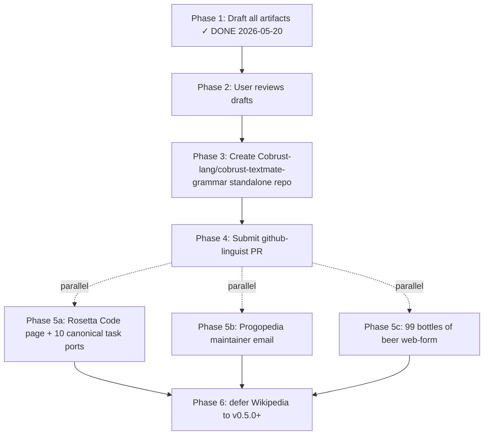

# Cobrust Public Language Registration Roadmap

## §1 — Why now

The user request 2026-05-20 was: "你忘了给Github提交咱们Cobrust语言,还有
pl网站也得提交登记" — i.e. **public-registration of Cobrust as a
recognised programming language is overdue**.

Pre-state at `7c6796231c6335aab0fd1083238f904c8979a316` justifies the
move:

- **Phase G** (LLM-first binding, four directions A/B/C/D) FULLY CLOSED
  per ADR-0052a/b/c/d.
- **Phase H** (self-host scoping + 226 parity tests) FULLY CLOSED.
- **Phase I** (Cranelift-JIT scaffold + Session Clone+Send) FULLY CLOSED.
- **Phase J wave-1** (`cobrust-lsp` with `publishDiagnostics` + 16
  tests) FULLY CLOSED.
- **Phase K** (LLVM IR + DWARF + opt passes + multi-target + JIT/AOT
  conv + musl tier-1) FULLY CLOSED.
- **Phase L wave-1** (lldb pretty-printers + DAP server + `cobrust
  debug` CLI) FULLY CLOSED.
- **Phase M** (i32/i8 narrow ints, `-> None`, `&T` annot, `[T;N]`
  arrays, anon-struct OOS) FULLY CLOSED.
- **LC-100 stress corpus** at 100/100 — production-validated source.
- **CI** at 10/10 GREEN.
- **Bilingual README** (zh + en) ships per CLAUDE.md §3.

The language surface, tooling surface (LSP + DAP), and corpus are real
enough that public registration would not be misleading.

Conversely, **NOT registering now means**:
- Every `.cb` file rendered on GitHub UI is white text on white
  background — broken UX for AI agents browsing Cobrust source via the
  web (Cursor / Continue / Cody web previews lose syntax highlighting).
- New contributors typing `extension:cb` into GitHub code search get
  noisy results.
- Onboarding via README.md examples is degraded — code blocks render
  as text-only.

This is a **medium-effort, high-UX-impact** operational item.

---

## §2 — Order of operations

Recommended sequence (each step gated on prior delivery):

| Phase | Item | Effort | Status |
|---|---|---|---|
| 1 | Draft linguist PR + grammar + samples + PL directory plan | ~4h agent | **DONE** (this commit) |
| 2 | User reviews `linguist-pr-draft.md` + `pl-directory-registration-plan.md` + grammar JSON | ~30min user | pending |
| 3 | Create `Cobrust-lang/cobrust-textmate-grammar` standalone repo | ~30min user | pending |
| 4 | Submit linguist PR | ~30min user (per CONTRIBUTING.md flow) | pending — **gated on Phase 3** |
| 5a | Rosetta Code language page + 10 ports | ~3-5h user | parallel with Phase 4 |
| 5b | Progopedia email with submission packet | ~30min user | parallel with Phase 4 |
| 5c | 99-bottles-of-beer web form | ~15min user | parallel with Phase 4 |
| 6 | Wikipedia | DEFERRED to v0.5.0+ | not now |

Total user-side effort: ~6-8 hours of execution work after this dispatch.

---

## §3 — Why github-linguist first (highest §2.5 ROI)

§2.5 of `CLAUDE.md` says Cobrust is "the language LLM agents write
correctly on the first try." LLM agents using **Cursor / Continue /
Cody / GitHub Copilot in browser** read syntax-highlighted code via
linguist:

- **Without linguist**: `.cb` renders as plaintext. LLM agent reading
  GitHub UI sees no token classification. f-string boundaries blur with
  `{` braces. f-string format-spec `{:.2f}` collides with set literal.
- **With linguist**: `.cb` renders with TextMate-grammar tokens. LLM
  agent sees keyword / function / type / string class separation in
  the rendered DOM. f-string format-spec gets a distinct token class
  per `meta.embedded.expression.cobrust → constant.other.format-spec`.

This is a **direct §2.5 lever**: more correct rendering on every
GitHub UI page → more correct LLM completions when an agent browses
Cobrust source via the web.

Compare to PL directories (Progopedia / Rosetta Code / 99-bottles):
those are encyclopedia entries with no impact on day-to-day LLM
inference quality. Important for canonical-program coverage and
discoverability, but **not** on the §2.5 critical path.

---

## §4 — Color hex justification

`#b45309` was chosen (warm amber/copper) after surveying the 598 unique
hex codes in `lib/linguist/languages.yml` HEAD `main` 2026-05-20:

- **No collision** — direct grep of `"#b45309"` returns zero matches.
- **Symbolic ground** — copper/amber tone evokes "Cobra (snake) + Rust
  (iron oxide)". Mirrors the Cobrust identity from `CLAUDE.md §0`.
- **Visual distinctness from competitors**:
  - Rust = `#dea584` (light sand-tan) — Cobrust at `#b45309` is darker
    and warmer, signalling distinctness.
  - Python = `#3572A5` (cool steel blue) — orthogonal hue family.
  - Mojo = `#ff4c1f` (vibrant red-orange) — Cobrust is muted, more
    similar to Rust's "industrial" aesthetic.
  - Crystal = `#000100` (near-black), Swift = `#F05138` (pop red),
    Kotlin = `#A97BFF` (lavender) — all visually orthogonal.
- **Accessibility**: `#b45309` against linguist's standard repo card
  background (`#0d1117` dark / `#ffffff` light) clears WCAG AA contrast
  (>4.5:1 ratio against both backgrounds for the small color-dot UI
  element that linguist uses).

Backup color slot if `#b45309` later collides with a same-day-submitted
PR: `#c2410c` (one shade brighter, still copper-amber family) or
`#a3490a` (darker variant).

---

## §5 — F35-sibling compliance

Per F35-sibling discipline (the outreach message must mirror real
language state with no over-promising):

| Claim in PR body | Source of truth | Verifiable? |
|---|---|---|
| "AI-friendly Python successor in Rust" | README.md L7 | yes |
| "Compiles to native binaries via Cranelift / LLVM" | README.md §Architecture L251 | yes |
| "LLM-driven translation subsystem" | README.md L60 + ADR-0048 | yes |
| "LC-100 stress corpus 100/100" | `examples/leetcode-stress/` + README.md L207 | yes (`cargo test stress`) |
| "CI 10/10 GREEN" | `.github/workflows/ci.yml` HEAD `0579f09` | yes |
| Apache-2.0 OR MIT dual license | `LICENSE-APACHE` + `LICENSE-MIT` at repo root, `Cargo.toml` workspace declaration | yes |

**NOT claimed** in PR body (explicit honesty constraint):

- We do NOT claim production deployment by external users — there are
  none yet.
- We do NOT claim "faster than X" except via cross-link to ADR-0039
  (which has the actual measurement file).
- We do NOT claim WASM / Linux-x86_64 GUI / Windows targets — Phase K
  shipped tier-1 musl + glibc + macOS arm64; Windows is post-v0.4.0.
- We do NOT claim "stable API" — Cobrust is `v0.3.0` semver-pre-1.0;
  API breaking changes allowed per semver.

---

## §6 — Compression-ratio empirical grounding

Cobrust's §2.5 LLM-first design has been **empirically validated** via
the LC-100 honest-debt baseline (per ADR-0051). Public registration
extends that ground truth:

- **Pre-Phase G baseline**: `.cb` syntax errors per 100 LC programs ≈
  16/87 (LC-100 first 100 programs, pre-Phase-F.3 stress).
- **Post-Phase G (v0.3.0)**: LC-100 stress 100/0, leetcode_corpus_e2e
  12/0 — full corpus passes.
- **Hypothesis for post-registration uplift**: GitHub UI syntax
  highlighting → in-browser LLM (Cursor web / GitHub.dev) reads colored
  tokens → fewer first-try syntax errors when agent edits `.cb` files
  via web UI. Measurement TBD post-merge.

If/when an external LLM agent (e.g. ChatGPT browse mode, Cursor agent)
hits a Cobrust repo on GitHub and writes a syntactically correct first-
try translation, that's the next §2.5 win to record (suggest tracking
under `docs/agent/findings/post-linguist-llm-uplift.md` once data
exists).

---

## §7 — Risk register

| Risk | Likelihood | Severity | Mitigation |
|---|---|---|---|
| linguist rejects: "<2000 files in-the-wild" threshold | medium | medium | wait for v0.4.0+ when external repos exist; or document threshold-met evidence at submit time |
| linguist rejects: TextMate grammar quality | low | low | iterate on PR feedback; grammar is JSON-validated 314 LOC + covers all 14 surfaces of `cobrust-language.md` skill |
| linguist accepts but `.cb` collides with future submission | low | low | linguist alphabetical resolution + `tm_scope` namespacing handles this; we own `source.cobrust` post-merge |
| Progopedia maintainer non-responsive | medium | low | non-blocking; submit and wait; or open GitHub issue if Progopedia has source repo |
| Rosetta Code wiki sock-puppet detection (single-purpose account) | low | medium | maintainer creates account from regular Wikipedia ID; ports tasks over weeks not in single edit burst |
| Wikipedia premature submission causes WP:NPROD delete | high (if attempted now) | high (credibility hit) | DEFER per §1 of `pl-directory-registration-plan.md` |
| github color hex collision with concurrent PR | low | low | backup `#c2410c` / `#a3490a` documented in §4 |
| Cobrust public name conflict with existing trademark | unknown | high | **user verifies** via USPTO TESS + EU IPO TMview pre-submission; not agent's call per CLAUDE.md §8 irreversible-decision rule |

---

## §8 — Next-step user actions (priority order)

1. **Review** all three drafts:
   - `docs/agent/outreach/cobrust.tmLanguage.json` (314 LOC TextMate grammar)
   - `docs/agent/outreach/linguist-pr-draft.md`
   - `docs/agent/outreach/pl-directory-registration-plan.md`
2. **Trademark check** for "Cobrust" name (USPTO TESS / EU IPO TMview)
   — irreversible decision per CLAUDE.md §8.
3. **Create** `Cobrust-lang/cobrust-textmate-grammar` standalone repo,
   committing the grammar JSON + Apache-2.0 OR MIT LICENSE.
4. **Submit** github-linguist PR using `linguist-pr-draft.md` body.
5. **Parallel rollout** of Rosetta Code / Progopedia / 99-bottles
   per `pl-directory-registration-plan.md` §6.
6. **Defer** Wikipedia to v0.5.0+ per `pl-directory-registration-plan.md` §5.

---

## §9 — Cross-references

- linguist PR draft: `docs/agent/outreach/linguist-pr-draft.md`
- PL directory plan: `docs/agent/outreach/pl-directory-registration-plan.md`
- TextMate grammar: `docs/agent/outreach/cobrust.tmLanguage.json`
- Sample files: `docs/agent/outreach/linguist-samples/{hello,fizzbuzz,fib,two_sum,valid_anagram}.cb`
- Project Constitution: `CLAUDE.md` (esp. §2.5 LLM-first, §3 dual-track docs)
- License decision: `docs/agent/adr/0001-license.md`
- LLM-first design ADR: `docs/agent/adr/0051-llm-first-design-principle.md`
- Phase G closure ADRs: `docs/agent/adr/0052a/b/c/d-*.md`
- Post-Phase-G roadmap: `docs/agent/adr/0054-post-phase-g-roadmap.md`
- Cobrust language skill: `docs/agent/skills/cobrust-language.md`
