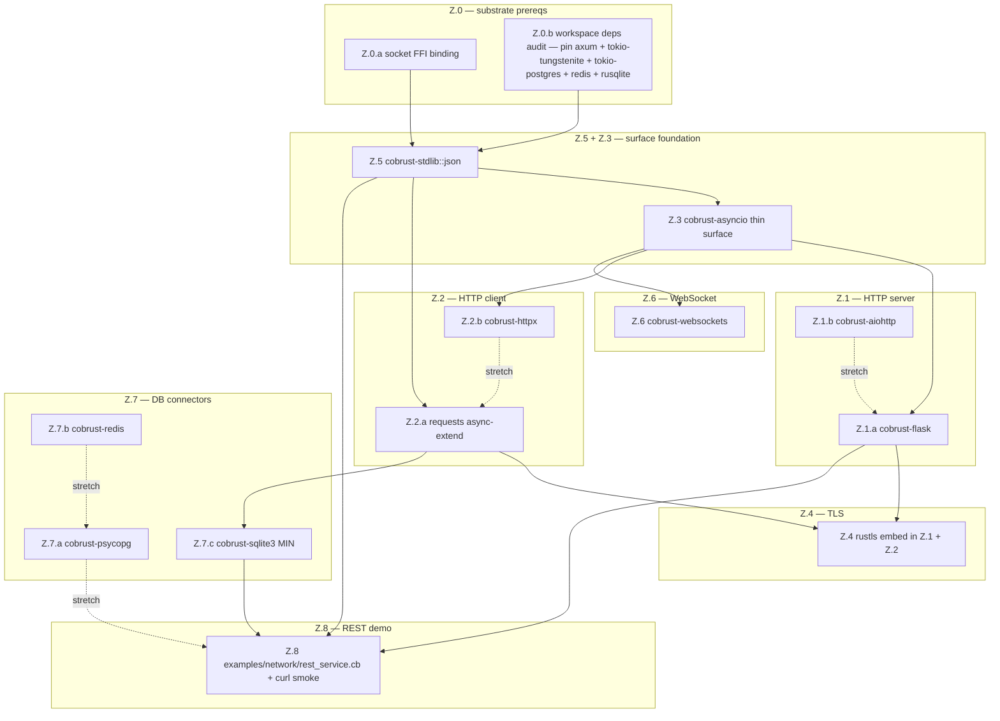

# v0.7.0 Network-Backend Libraries — Roadmap & Translate-vs-Native Decision

> READ THIS BEFORE any v0.7.0 Stream Z (network) sub-milestone dispatch.
> Companion to ADR-0070 §2.3. ADR-0070 sets the scope envelope; this
> document does the per-library deep survey + recommendation.

## §1 Context

User mandate 2026-05-25 (verbatim): "网络后端开发所需的库也要做准备,务必都在 0.7.0 前弄好".

Interpretation per ADR-0070 §2.3:
- Minimum bar = HTTP + JSON + DB sufficient to author a REST service
- WebSocket / TLS / async runtime exposure = stretch within v0.7.0
- Done-means = `Z.8` empirical demo (Cobrust-authored REST service curl-able against a running binary)

Constitutional anchors:
- §1.2 — AI-native translation is core mandate; L0-L3 pipeline is the gold path
- §2.2 — single structured-concurrency runtime; no `async`/`sync` coloring at user surface
- §2.5 — LLM-first: surface MUST match Python `requests`/`aiohttp`/`asyncio` priors
- §4.2 — L0-L3 closed-loop verification gate is non-skippable for any translation
- Q3 in ADR-0070 §6: "Hybrid: low-level = native FFI binding; high-level = L0-L3 translate" — per-library settlement in this doc

Pre-state (HEAD `b1f1769`):
- `cobrust-requests` already shipped (synthetic-LLM L0-L3; reqwest::blocking backend; 13 functions; 472 LOC client body; M9 scope window per ADR-0022)
- `cobrust-stdlib::task` shipped (M13 tokio singleton runtime per ADR-0028; sync surface; `spawn` / `JoinHandle` / `scope` / `cancel`; tokio = "1.40" multi-thread)
- `cobrust-stdlib::sync` shipped (channels + mutex; sync surface over tokio per ADR-0028 §A)
- workspace deps already pinned: `tokio` 1.40, `reqwest` 0.12 (rustls-tls), `serde_json` 1.0, `serde` 1.0
- NO existing crates for: HTTP server, WebSocket, asyncio user surface, Postgres, Redis, SQLite, Flask, FastAPI, aiohttp
- `cobrust-stdlib::tool` uses `serde_json::Value` internally but NO user-facing `json.dumps`/`json.loads` surface yet

## §2 Library survey

### §2.1 HTTP / WebSocket / Server frameworks

| # | Library | Role | Python LOC (approx, src/) | Network model | Pure-Python / FFI |
|---|---|---|---|---|---|
| 1 | `requests` 2.31 | HTTP client (sync) | ~12K | blocking I/O, urllib3 transport | Pure Python (urllib3 has small C ext) |
| 2 | `httpx` 0.27 | HTTP client (sync + async) | ~9K | sync OR async via `anyio` | Pure Python |
| 3 | `aiohttp` 3.10 | HTTP server + client (async) | ~25K | `asyncio`-native; raw asyncio sockets | Pure Python + small C parser |
| 4 | `FastAPI` 0.115 | HTTP server framework | ~25K (uses starlette ~10K + pydantic ~30K) | async via starlette + uvicorn | Pure Python; depends on uvicorn (C-ext hot path) |
| 5 | `flask` 3.0 | HTTP server framework (sync) | ~10K | WSGI sync; werkzeug ~30K dep | Pure Python |
| 6 | `websockets` 13.x | WebSocket (client + server) | ~8K | `asyncio`-native | Pure Python |
| 7 | `asyncio` (stdlib) | Event loop primitives | ~10K user-facing + ~5K C ext | event loop, transports, futures | Mixed; reactor in C |

### §2.2 Serialization / DB

| # | Library | Role | Python LOC | Network model | Pure-Python / FFI |
|---|---|---|---|---|---|
| 8 | `json` (stdlib) | JSON encode/decode | ~3K wrapper + ~2K C ext | n/a | C-ext for fast path, Python fallback |
| 9 | `psycopg` 3.x | Postgres driver | ~15K wrapper + libpq | wire protocol; sync + async surface | Wrapper over libpq (C) OR pure-Python `psycopg.pq` |
| 10 | `redis-py` 5.x | Redis driver | ~30K (sync + async + cluster) | RESP protocol; sync + async | Pure Python; hiredis C accelerator optional |
| 11 | `sqlite3` (stdlib) | SQLite embedded | ~1.5K wrapper + libsqlite3 | embedded | Wrapper over libsqlite3 (C) |

### §2.3 Rust substrate availability

| Crate | Role | Recent downloads (rough, 30d) | Maturity | Maintained |
|---|---|---|---|---|
| `tokio` 1.40 | async runtime | tens of millions | gold | yes |
| `hyper` 1.x | HTTP/1+2 protocol | tens of millions | gold | yes |
| `reqwest` 0.12 | HTTP client | tens of millions | gold | yes |
| `axum` 0.7 | HTTP server (tokio + hyper + tower) | millions | gold | yes |
| `actix-web` 4.x | HTTP server (actor model) | millions | gold | yes |
| `rustls` 0.23 | TLS pure-Rust | tens of millions | gold | yes |
| `tokio-tungstenite` 0.24 | WebSocket | millions | gold | yes |
| `serde_json` 1.x | JSON | tens of millions | gold | yes |
| `tokio-postgres` 0.7 | Postgres async | millions | gold | yes |
| `sqlx` 0.8 | SQL toolkit (Postgres + MySQL + SQLite) | millions | gold | yes |
| `redis` 0.27 (redis-rs) | Redis client | millions | gold | yes |
| `rusqlite` 0.32 | SQLite wrapper | millions | gold | yes |
| `deadpool` / `bb8` | Connection pooling | millions | stable | yes |

All substrate is Rust-native, rustls-only (no OpenSSL dep), tokio-compatible. Reverse FFI from Cobrust per CLAUDE.md §4.2 L3 PyO3-style pattern is viable for every entry.

## §3 Cobrust gap audit

| Capability | Cobrust current state | Gap severity | Resolution path |
|---|---|---|---|
| `tokio` async runtime | shipped (ADR-0028 M13; sync user surface over multi-thread runtime) | NONE — present | reuse via `cobrust-stdlib::task` singleton |
| TCP / UDP raw sockets | NOT exposed at user surface; `cobrust-llm-router` uses reqwest internally only | MEDIUM | thin binding crate `cobrust-net::socket` over `tokio::net::{TcpStream,TcpListener,UdpSocket}` (Z.1 prereq) |
| TLS | rustls is workspace dep via reqwest's `rustls-tls` feature; NOT exposed standalone | LOW | rustls direct surface only needed if HTTP/2 server is in scope (it isn't for v0.7.0); reqwest TLS is sufficient for client; axum + rustls = standalone server TLS (Z.4) |
| HTTP/1.1 client | shipped via `cobrust-requests` (blocking; reqwest::blocking backend) | NONE for sync; MEDIUM for async parity | Z.2 extends `cobrust-requests` to expose `httpx`-style async-capable surface OR ship separate `cobrust-httpx` crate |
| HTTP/1.1 + HTTP/2 server | NOT shipped | HIGH | Z.1 ships `cobrust-http`/`cobrust-aiohttp`/`cobrust-flask` (decision in §4) over axum or hyper |
| WebSocket client + server | NOT shipped | MEDIUM | Z.6 thin translate `websockets`-style surface over tokio-tungstenite |
| `json.dumps` / `json.loads` user surface | NOT shipped (only internal `serde_json::Value` use in `cobrust-stdlib::tool`) | HIGH | Z.5 ships `cobrust-json` crate OR adds `std.json` module to `cobrust-stdlib` (decision in §4) |
| Postgres | NOT shipped | HIGH | Z.7 ships `cobrust-psycopg` per ADR-0022 batch pattern; tokio-postgres backend |
| Redis | NOT shipped | MEDIUM | Z.7 ships `cobrust-redis`; redis-rs backend |
| SQLite | NOT shipped | LOW | Z.7 ships `cobrust-sqlite3` (stdlib parity); rusqlite backend |
| Connection pooling | NOT shipped | LOW | optional; deadpool can be folded into per-driver crate (`cobrust-psycopg::Pool`) |
| HTTP/2 + HTTP/3 | NOT shipped | NIL for v0.7.0 | out of scope; reqwest already supports HTTP/2 transparently if needed |
| Structured concurrency `asyncio`-compatible user surface | partially shipped (`spawn` + `JoinHandle` + `scope` per M13) but NOT named `asyncio` | MEDIUM | Z.3 ships `cobrust-asyncio` crate translating Python `asyncio` surface (`sleep` / `gather` / `wait_for` / `Future`) onto existing `task::*` primitives; LLM-first §2.5 mandate (training corpus uses `asyncio.gather`, not `task::scope`) |

**Total**: 6 HIGH or MEDIUM gaps; 4 LOW; 1 NIL. All resolvable within v0.7.0 envelope using existing workspace substrate.

## §4 Per-library translate-vs-native decision

Decision rule (per ADR-0070 Q3 + CLAUDE.md §2.5):
- **NATIVE FFI binding**: when (a) substrate is Rust-native gold-tier AND (b) Python surface has no LLM-corpus-overlap advantage to preserve (e.g. raw protocol details users never write) AND (c) safety/perf-critical (TLS, async runtime, raw sockets).
- **L0-L3 TRANSLATE (synthetic + real LLM)**: when (a) Python surface IS what LLMs write (`requests.get`, `flask.route`, `psycopg.connect`) AND (b) backend can be cleanly delegated to a Rust substrate behind the surface AND (c) L0-L3 gate is feasible per existing tomli/requests/click precedent.
- **HYBRID**: ship a thin native binding crate AND a translation crate that wraps it. Standard pattern for v0.7.0 per ADR-0022.

### §4.1 Final per-library decision table

| Library / capability | Approach | Substrate | Crate name | Rationale | Effort | Phase |
|---|---|---|---|---|---|---|
| HTTP client sync (`requests`) | **EXTEND existing** L0-L3 translate | reqwest::blocking (already shipped) | `cobrust-requests` (extend) | `requests.get(...)` is the most-trained LLM pattern; backend already delegated; gap is async surface | Low | Z.2.a |
| HTTP client async (`httpx`) | **TRANSLATE L0-L3** + thin async layer | reqwest (non-blocking) over `cobrust-stdlib::task` | `cobrust-httpx` (NEW) | httpx async surface matches §2.5 LLM-first priors; can share substrate with requests | Medium | Z.2.b |
| HTTP server async (`aiohttp`) | **TRANSLATE L0-L3** | axum + tokio | `cobrust-aiohttp` (NEW) | aiohttp's `web.Application` + `@routes.get` is high-overlap LLM pattern; axum backend is gold-tier; LLM-first wins | Medium-High | Z.1.b |
| HTTP server sync (`flask`) | **TRANSLATE L0-L3** | axum (sync-style wrapper via `cobrust-stdlib::task::block_on`) | `cobrust-flask` (NEW) | flask's `@app.route` decorator pattern is the most-trained sync HTTP server in Python corpus; backend axum-wrapped | Medium | Z.1.a |
| HTTP server framework (`FastAPI`) | **DEFER post-v0.7.0** | (would need axum + pydantic equivalent) | — | FastAPI depends on pydantic (~30K LOC) + starlette (~10K LOC); pydantic-translate is a separate sprint (Cobrust-types-cb is partial precedent but not parity); v0.7.0 envelope blown | — | post-v0.7.0 |
| WebSocket (`websockets`) | **TRANSLATE L0-L3** | tokio-tungstenite | `cobrust-websockets` (NEW) | `websockets.serve(...)` + `async with websockets.connect(...)` are well-trained patterns; tungstenite mature | Low-Medium | Z.6 |
| TLS | **NATIVE FFI** (no user surface) | rustls (via reqwest + axum) | embedded in Z.1 + Z.2 crates; no standalone | Users never write `rustls.ClientConfig` directly in Python; they write `requests.get("https://...")`. TLS is invisible. No translation surface to preserve | Nil (embedded) | Z.4 |
| `asyncio` user surface | **TRANSLATE L0-L3** (thin) | `cobrust-stdlib::task` (existing tokio singleton) | `cobrust-asyncio` (NEW) | `asyncio.sleep` / `asyncio.gather` / `asyncio.run` are LLM-first §2.5 priors that constitution §2.2 deliberately suppressed at user surface; expose ONLY the names — semantics route to existing sync-surface task primitives. Coloring rule §2.2 preserved (no `async fn` in user code; `asyncio.run(f())` returns directly) | Low | Z.3 |
| Raw TCP/UDP sockets (`socket`) | **NATIVE FFI** thin binding | `tokio::net::{TcpStream,TcpListener,UdpSocket}` | `cobrust-stdlib::socket` (extend existing stdlib) | Python `socket` module IS thin already; LLMs do write `socket.socket(socket.AF_INET, ...)` so retain surface, but the substrate is so thin that an FFI binding IS the translation | Low | Z.1 prereq |
| JSON (`json` stdlib) | **HYBRID** — native binding + LLM-first surface module | serde_json | `cobrust-stdlib::json` (new module) | `json.dumps({"a": 1})` is most-trained pattern in entire Python corpus; serde_json is fast; thin Python-surface wrapper over `serde_json::Value`; reuse existing internal `tool.rs` precedent | Low | Z.5 |
| Postgres (`psycopg`) | **TRANSLATE L0-L3** (surface) + native backend | tokio-postgres + deadpool-postgres pool | `cobrust-psycopg` (NEW) | `psycopg.connect(...).cursor().execute(...)` is the Python DB-API 2.0 PEP 249 surface — high LLM overlap; tokio-postgres async backend; pool optional | Medium | Z.7.a |
| Redis (`redis-py`) | **TRANSLATE L0-L3** (surface) + native backend | redis-rs | `cobrust-redis` (NEW) | `redis.Redis(host=...).get(key)` is the canonical LLM pattern; redis-rs supports both sync + async; map to sync surface via existing `task::block_on` | Low-Medium | Z.7.b |
| SQLite (`sqlite3` stdlib) | **TRANSLATE L0-L3** (surface) + native backend | rusqlite | `cobrust-sqlite3` (NEW) | stdlib parity; `sqlite3.connect(":memory:").execute(...)` is canonical; rusqlite mature; embedded so no async needed | Low | Z.7.c |

### §4.2 Effort + difficulty grades summary

| Difficulty grade | Libraries (Z.N → crate) | Count |
|---|---|---|
| Low (≤500 LOC translate body; precedent matches tomli/click) | TLS (embedded), socket-FFI, asyncio (thin), JSON, SQLite, WebSocket | 6 |
| Medium (500-1.5K LOC body; precedent matches msgpack/requests) | requests-extend (Z.2.a), httpx (Z.2.b), flask (Z.1.a), Redis | 4 |
| Medium-High (>1.5K LOC OR async-first complexity) | aiohttp (Z.1.b), Postgres | 2 |
| Out of scope / deferred | FastAPI (pydantic+starlette dep chain too heavy) | 1 |

**Translation difficulty distribution**: 6 Low + 4 Medium + 2 Medium-High + 1 Deferred = 12 line-items + 1 deferral.

**Total estimated translate-surface LOC**: ~6K-8K total across all 12 crates (mid-estimate); ~12K worst case. Same order of magnitude as tomli + dateutil + requests + click + msgpack combined (which is already in workspace).

## §5 v0.7.0 minimum bar (concrete)

Per ADR-0070 §2.3 + user mandate:

**MUST ship in v0.7.0 (blocking ratification)**:
- HTTP client sync — `cobrust-requests` async-capable extension (`Z.2.a`)
- HTTP server sync — `cobrust-flask` OR `cobrust-aiohttp` (one of two; flask preferred for first-cut; aiohttp follow-up if envelope allows) (`Z.1.a`)
- JSON user-surface — `cobrust-stdlib::json` (`json.dumps`/`json.loads`) (`Z.5`)
- ONE DB connector — `cobrust-sqlite3` MINIMUM (stretch: + `cobrust-psycopg`) (`Z.7.c`)
- Empirical demo `Z.8`: Cobrust source authoring REST service:
  - HTTP server with GET + POST routes
  - JSON request/response bodies
  - SQLite-backed persistence
  - curl-able from terminal against running binary
  - example file lives under `examples/network/rest_service.cb`

**SHOULD ship in v0.7.0 (stretch within envelope)**:
- HTTP client async — `cobrust-httpx` (`Z.2.b`)
- HTTP server async — `cobrust-aiohttp` (if flask shipped) (`Z.1.b`)
- `cobrust-asyncio` thin surface (`Z.3`)
- `cobrust-psycopg` (`Z.7.a`)
- `cobrust-redis` (`Z.7.b`)
- `cobrust-websockets` (`Z.6`)

**DEFER post-v0.7.0 (recorded as honest debt)**:
- `cobrust-fastapi` (depends on pydantic translation; separate sprint)
- HTTP/3 / QUIC support
- gRPC (tonic binding)
- Generic connection pooling abstraction crate

## §6 Phasing (sub-milestones)

Phase ordering (deterministic):

1. **Z.0** (prereq) — substrate audit + socket FFI thin binding. Z.0.b must commit before Z.5 starts (pin axum/tokio-tungstenite/tokio-postgres/redis/rusqlite in workspace Cargo.toml).
2. **Z.5** (JSON) — first surface delivered; unblocks everything else; smallest crate; precedent matches existing `cobrust-stdlib::tool` serde_json use.
3. **Z.3** (asyncio thin) — second surface; LLM-first §2.5 critical; thin map onto existing `task::*` primitives; small.
4. **Z.2.a** (requests async-extend) — extends existing crate; precedent shipped.
5. **Z.1.a** (flask) — first HTTP server; sync surface over `block_on(axum)`; precedent matches click's decorator-style pattern.
6. **Z.4** (TLS) — embedded in Z.1 + Z.2 crates via rustls; no standalone work.
7. **Z.7.c** (sqlite3) — MUST-ship DB connector; smallest of three; stdlib parity.
8. **Z.8** (REST demo) — closes minimum-bar ratification gate. Requires Z.5 + Z.1.a + Z.7.c only.
9. **Z.2.b + Z.1.b + Z.7.a + Z.7.b + Z.6** (stretch chain) — author opportunistically once Z.8 ratification clears.

Parallelism: Z.0.a + Z.0.b can run parallel. Z.5 + Z.3 can run parallel after Z.0. Z.2.a + Z.1.a can run parallel after Z.3 + Z.5. Stretch crates fully parallel once Z.8 closes.

Sequencing constraints per F35-sibling discipline:
- NO `Z.8` claim until `Z.1.a + Z.5 + Z.7.c` all GREEN under L0-L3 gate + `cargo build --workspace --features llvm` GREEN
- NO `cobrust-fastapi` work in v0.7.0 (envelope discipline; defer to v0.8.0+)
- F44 sibling — every new crate gets `--features pyo3` audit gate AND clippy `--features llvm` gate per F51 baseline
- F45a sibling — every new crate's `examples/` lowering tested under LLVM-default (Stream X.3) before merge

## §7 Open questions

| ID | Question | Recommended bar | Decision gate |
|---|---|---|---|
| Z-Q1 | `asyncio` user surface: do we expose Python's `async def` syntax (HIR sugar)? | NO — §2.2 forbids async/sync coloring. `asyncio.run(f())` wraps a sync `def f()` that internally uses `task::scope`. Re-export only function names; no syntax additions | Settled per CLAUDE.md §2.2; reaffirm if §2.5 LLM-first audit shows training-corpus drift |
| Z-Q2 | HTTP server: axum vs hyper-direct vs actix-web | axum (tokio + hyper + tower; gold-tier; LLM-corpus overlap via FastAPI/aiohttp users porting); reject hyper-direct (too low-level for translation surface); reject actix-web (different actor model adds translation friction) | Settled per §4.1 |
| Z-Q3 | DB connector trio: ship all 3 or just sqlite3 | Minimum bar = sqlite3 ONLY (Z.7.c); Z.7.a + Z.7.b stretch. Reduces v0.7.0 risk envelope. If sqlite3 ships ahead of schedule, escalate Z.7.a then Z.7.b | Gated on Z.7.c L0-L3 gate completion + envelope-remaining budget |
| Z-Q4 | Async surface for sqlite3 | NO — sqlite is embedded; rusqlite is sync; ship sync only. Python `sqlite3` stdlib is also sync. LLM-corpus match | Settled per §4.1 |
| Z-Q5 | Async surface for psycopg + redis | YES — both Python libraries expose sync + async surfaces; we ship sync-surface (per §2.2 user-coloring rule) over tokio-postgres/redis-rs async backend via `task::block_on`. LLMs writing `await conn.execute(...)` get a translation to sync; the runtime drives the await | Gated on `cobrust-asyncio` Z.3 stabilization |
| Z-Q6 | TLS root CA cert source | reqwest default (`webpki-roots` or system roots; reqwest decides). No explicit Cobrust opinion; mirror reqwest default. If user demands custom roots, expose via `cobrust-requests::SessionBuilder::tls_roots(...)` future API | Defer to post-v0.7.0 unless user issue filed |
| Z-Q7 | `cobrust-fastapi` deferral confirmation | DEFERRED post-v0.7.0; pydantic translation is precondition (~30K LOC; separate sprint). Cross-reference: Stream Z deferral entry filed in CHANGELOG.md v0.7.0 honest-debt section per F37 silent-rot discipline | Settled (CTO acceptance pending ratification); raise if user contests |
| Z-Q8 | LLM-first §2.5 audit: are crate names canonical to Python import? | YES — `cobrust-requests` / `cobrust-flask` / `cobrust-psycopg` / `cobrust-redis` / `cobrust-sqlite3` / `cobrust-websockets` / `cobrust-aiohttp` / `cobrust-httpx` all map 1:1 to PyPI/stdlib names. `cobrust-asyncio` matches stdlib. Only `cobrust-stdlib::json` is a sub-module not a separate crate (stdlib parity) — verified consistent with Python `import json` (stdlib) | Settled |
| Z-Q9 | Connection pooling deferral | YES — connection pooling deferred; per-driver crate exposes `Pool` constructor optionally (`cobrust-psycopg::Pool` over `deadpool-postgres`); no separate `cobrust-deadpool` crate. Pool API is Python-shaped (`psycopg_pool.ConnectionPool(...)`) | Defer to post-Z.7.a ratification |
| Z-Q10 | Demo target for Z.8 | REST CRUD service with 1 entity (e.g. `Note { id, title, body }`); 4 routes (GET list, GET id, POST create, DELETE id); SQLite backend; JSON I/O; `curl` script committed under `examples/network/rest_service_curl.sh` | Author at Z.8 dispatch |

## §8 Cross-refs

### ADRs
- ADR-0019 — Phase E language + runtime roadmap (M8..M14 — M13 is the tokio runtime precedent for §3 + Z.3)
- ADR-0022 — Translation ecosystem batch (the `cobrust-requests` + `cobrust-click` precedent that §4.1 inherits)
- ADR-0028 — M13 structured-concurrency runtime (tokio singleton; sync user surface — substrate for every Stream Z crate)
- ADR-0032 — tomli audit #1 PASS (proof L0-L3 pipeline works at the difficulty grade Stream Z targets)
- ADR-0036 — Translation provenance contract (every Stream Z crate emits PROVENANCE.toml + `// AUTO-GENERATED` header)
- ADR-0058g — LLVM backend wave-3 stdlib hookup roadmap (Stream X.3 default-flip precondition; every Stream Z crate must compile under `--features llvm`)
- ADR-0070 — v0.7.0 master design (parent ADR; §2.3 Stream Z scope envelope; §6 Q3 hybrid policy ratification)

### Findings (discipline gates applied to Stream Z dispatches)
- F35-sibling — commit-msg vs diff drift; each Stream Z sprint commit message must mirror final-form scope, not original spec
- F36 — fixture name vs behavior drift; integration test fixture names must match what the body asserts
- F37 — silent rot on accepted-debt; any `#[ignore]` on Stream Z tests must cite deferred-to milestone explicitly
- F44 — CI cache stale-green false-pass; cargo-udeps + clippy `--features llvm` gates required for every new Stream Z crate
- F45a — LLVM backend stub silently shipped; every Stream Z crate's `examples/` must compile + run under LLVM-default before merge
- F49 — committer identity leakage; CTO/sub-agent commit identity must match repo; do NOT use device-name fallback
- F51 — clippy feature-flag silent rot; every Stream Z crate's `clippy --features pyo3 --features llvm` gate required

### Precedent translated crates (pattern templates)
- `cobrust-requests` (M9 ecosystem-batch precedent for `cobrust-flask` + `cobrust-aiohttp` + `cobrust-httpx`)
- `cobrust-tomli` (M4 surface-only precedent for `cobrust-stdlib::json`)
- `cobrust-msgpack` (M6 native-ext precedent for `cobrust-psycopg` + `cobrust-redis` + `cobrust-sqlite3`)
- `cobrust-click` (decorator-style CLI precedent for `cobrust-flask` `@app.route`)
- `cobrust-stdlib::task` + `cobrust-stdlib::sync` (M13 sync-over-tokio precedent for `cobrust-asyncio` thin surface)

### CLAUDE.md anchors
- §1.2 — AI-native compiler L0-L3 translation as core mandate
- §2.2 — single structured-concurrency runtime; no async/sync coloring at user surface
- §2.5 — LLM-first design principle (binding for all Stream Z surface decisions)
- §4.2 — L0-L3 closed-loop verification (all four gates non-skippable per Stream Z crate)
- §5.2 — scientific: every per-crate ratification carries verification manifest + bench harness

## §9 Status

**Status**: proposed.

**Ratification path**:
1. ADR-0070 ratified (precondition; Stream X.1 + X.2 evidence required first)
2. Z.0 prereq (substrate deps pin) lands on main
3. Z.5 + Z.3 surface foundation lands
4. Z.1.a + Z.2.a + Z.7.c MUST-ship triplet lands under L0-L3 + LLVM-default + clippy --features llvm gates GREEN
5. Z.8 empirical demo passes curl smoke
6. v0.7.0 CHANGELOG entry cross-links this doc + ADR-0070 §2.3
7. Strategy doc status flip `proposed` → `ratified` in v0.7.0 release commit

**Author**: P10 CTO via P8 Stream Z dispatch.

**Date**: 2026-05-25.
