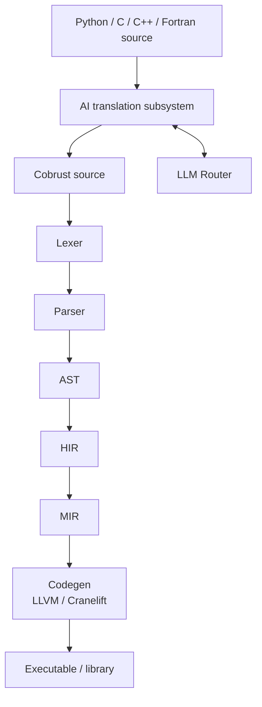
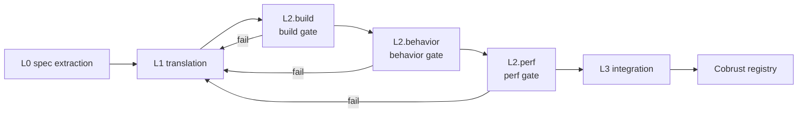
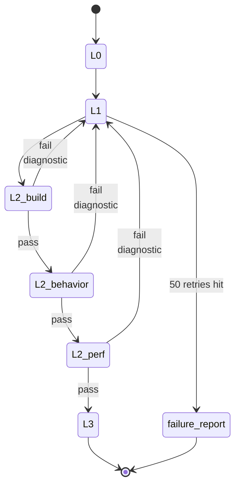

# Architecture

## Compiler layers



- Main pipeline: source → lexer → parser → AST → HIR → MIR → codegen
- AI translation subsystem **consumes** heterogeneous sources (Python/C/C++/Fortran), **produces** Cobrust source that re-enters the main pipeline
- LLM Router is a **first-class compiler component**; the translation subsystem dispatches model calls through it

## Crate topology

| crate | Role | Lands at |
|---|---|---|
| `cobrust-cli` | `cobrust` binary entrypoint | M0 stub → wired starting M1 |
| `cobrust-frontend` | Lexer + parser + AST | M1 |
| `cobrust-hir` | HIR: desugared, name-resolved | M2 |
| `cobrust-types` | Type system + type checker | M2 |
| `cobrust-mir` | MIR: control-flow-explicit | M3+ |
| `cobrust-codegen` | LLVM / Cranelift backend | M3+ |
| `cobrust-llm-router` | LLM Router | M3 |
| `cobrust-translator` | AI translation subsystem | M4+ |

## AI translation subsystem: four-stage closed loop

Every stage has explicit gates. **No stage is optional.**



### L0 — spec extraction

- Input: target Python library source + tests + docs
- Output: machine-readable behavioral spec (signatures, invariants, exemplar I/O pairs, numerical tolerances)
- Method: LLM agent generates a differential-testing harness using CPython library as oracle
- Artifact: `spec.toml` + `harness/` directory committed to translation manifest

### L1 — translation

- Input: L0 spec + original source
- Output: Cobrust / Rust implementation
- Granularity: **function-level, bottom-up by dependency graph**
- Method: LLM call via the LLM Router; consensus mode for high-risk functions
- Constraint: every emitted file has a translation-provenance header

### L2 — verification (three gates, all required)

- **build gate**: `cargo build --release` zero warnings
- **behavior gate**: original testsuite + property tests + L0 differential harness pass; tolerance per `@py_compat` tag; minimum 1000 fuzzed inputs per public function
- **perf gate**: ≥ 0.8× of original on representative benchmarks (configurable per library)

### L3 — integration

- PyO3 wrapper exposes Cobrust impl with Python-compatible API
- **Downstream validation**: run the testsuites of the top-5 libraries that depend on this one against the new translation. **This is the ultimate oracle.**
- Publish to Cobrust registry with full provenance manifest

### Failure loop



Failure at any gate → diagnostic feeds back to L1 → re-translate → re-verify. Loop until pass or escalation threshold (default 50 retries) hit, at which point a human-readable failure report is filed and the function is marked `@py_compat(none)` with explanation.

## LLM Router (first-class compiler component)

`cobrust-llm-router` is **not a tool**, it's a **compiler subsystem**. It is treated as seriously as the type checker. It does **not** live in `tools/`.

### Capabilities

- Provider-agnostic interface; concrete adapters for **OpenAI-compatible** and **Anthropic-compatible** APIs
- Custom `base_url` and custom model names per provider (DeepSeek, Qwen, local vLLM, Together, OpenRouter, etc. all just work)
- Per-task routing: `{ task, strategy: "cost" | "quality" | "latency" | "consensus", n? }`
- Streaming support for both formats
- Token accounting per task, per library, per session — written to `.cobrust/ledger.jsonl`
- Retry with exponential backoff; failure isolation per provider (one provider down ≠ pipeline halt)
- Caching layer keyed by `(prompt_hash, model, params)` — content-addressed, on-disk, optional remote cache
- Consensus mode: query N models, take majority / structured-diff / best-of-N (judged by a verifier model or by gate pass-rate)

### Configuration example

Full example in [`cobrust.toml.example`](../../../cobrust.toml.example). Minimal:

```toml
[router]
default_strategy = "quality"

[providers.anthropic_official]
kind = "anthropic"
base_url = "https://api.anthropic.com"
api_key_env = "ANTHROPIC_API_KEY"
models = ["claude-opus-4-7"]

[routing.translate]
strategy = "consensus"
n = 2
preferred = ["anthropic_official:claude-opus-4-7", "deepseek:deepseek-v3"]
```

### Router non-goals

- **Not** a chat UI
- **Not** a long-running agent loop driver (translation subsystem owns that)
- **Not** a prompt template store; templates live next to the consumer

## Self-hosting roadmap

The compiler is initially in Rust. Once Cobrust reaches sufficient maturity (post-M5), begin self-hosting non-performance-critical compiler stages — **type checker and AST printer first**.

## Further reading

- [Agent-facing module specs](../../agent/modules/)
- [Milestones](milestones.md)
