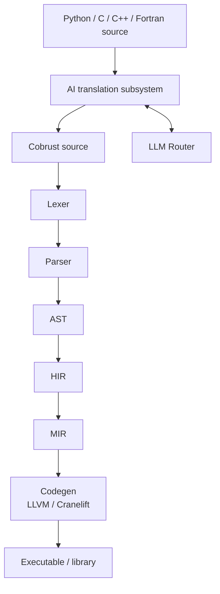
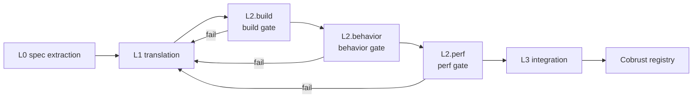
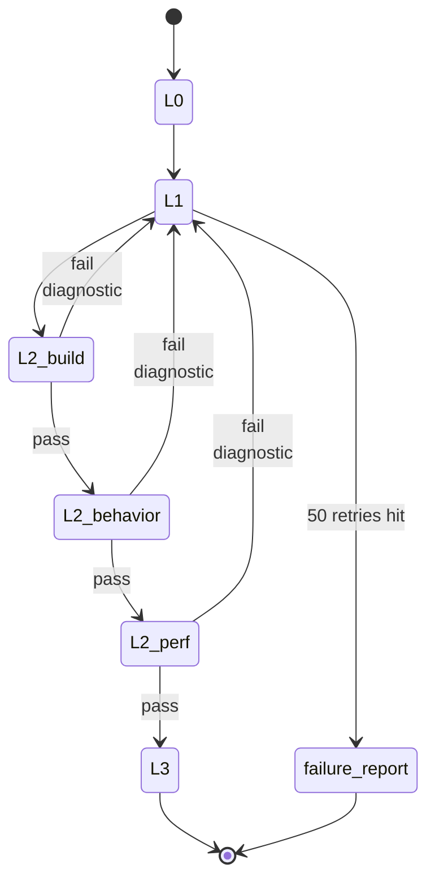

# Architecture

## Compiler layers



- Main pipeline: source → lexer → parser → AST → HIR → MIR → codegen
- AI translation subsystem **consumes** heterogeneous sources (Python/C/C++/Fortran), **produces** Cobrust source that re-enters the main pipeline
- LLM Router is a **first-class compiler component**; the translation subsystem dispatches model calls through it

## Crate topology

| crate | Role | Lands at |
|---|---|---|
| `cobrust-cli` | `cobrust` binary entrypoint | M0 stub → wired starting M1 |
| `cobrust-frontend` | Lexer + parser + AST | M1 |
| `cobrust-hir` | HIR: desugared, name-resolved | M2 |
| `cobrust-types` | Type system + type checker | M2 |
| `cobrust-mir` | MIR: control-flow-explicit | M3+ |
| `cobrust-codegen` | LLVM / Cranelift backend | M3+ |
| `cobrust-llm-router` | LLM Router | M3 |
| `cobrust-translator` | AI translation subsystem | M4+ |

## Frontend (M1 — delivered)

`cobrust-frontend` ships the 30 syntactic forms. A concrete example:

```python
fn fib(n: i64) -> i64:
    if (n < 2):
        return n
    return (fib((n - 1)) + fib((n - 2)))
```

Drive the frontend:

```rust
use cobrust_frontend::{parse_str, unparse, FileId};

let src = std::fs::read_to_string("fib.cb")?;
let module = parse_str(&src, FileId(0))?;
println!("{}", unparse(&module));
```

### Public API

- `lex(source, file_id) -> Result<Vec<Token>, LexError>` — UTF-8 → token stream
- `lex_bytes(bytes, file_id) -> Result<Vec<Token>, LexError>` — arbitrary bytes → token stream (invalid UTF-8 is reported, never panics)
- `parse(tokens) -> Result<ast::Module, ParseError>` — token stream → AST
- `parse_str(source, file_id) -> Result<ast::Module, FrontendError>` — one-shot composition
- `unparse(module) -> String` — AST → canonical source (round-trip oracle)

### Design constraints

- **Recursive descent + Pratt** for expressions; full operator table at the top of `crates/cobrust-frontend/src/parser.rs`. No external parser generator.
- **Spans everywhere**: every AST node carries `(file_id, byte_start, byte_end)` so downstream phases can produce precise diagnostics.
- **Closed 30-form surface**: `adr:0003` fixes the list. Python forms outside the list (`is`, `del`, `global`, `nonlocal`, `async def`, multiple inheritance, mutable defaults) are rejected with `ParseError::DroppedByConstitution`.
- **Panic-free**: no byte input can panic the lexer or parser; failures surface as structured errors. The invariant is held by a proptest fuzz harness (default 5 × 4 096 cases; long run 5 × 100 000 cases under `COBRUST_M1_FUZZ_LONG=1`).

### Verification

- 30 round-trip integration tests, one per form: `tests/round_trip.rs`.
- proptest fuzz harness: `tests/fuzz_proptest.rs`. Past shrunk panics are committed to `tests/fuzz_proptest.proptest-regressions`; every run re-tests them first.
- Methodology and the first bug it caught are documented at `docs/agent/findings/m1-fuzz-method.md`.

## HIR + Type checker (M2 — delivered)

`cobrust-hir` lowers all 30 forms into a small core — sugar
collapsed, names resolved, spans preserved — that the type checker
consumes. `cobrust-types` runs **bidirectional** type checking
with **no `dyn`**, **no implicit truthiness**, and **no silent
coercion**.

### End-to-end micro-example

Source:

```python
fn add(x: i64, y: i64) -> i64:
    return (x + y)
```

`frontend → ast::Module`, then `cobrust_hir::lower(&ast, &mut Session::new()) → hir::Module`
where every name carries a `DefId`; the parameter `DefId`s for `x`
and `y` are exactly the `DefId`s the return references. Finally
`cobrust_types::check(&hir) → TypedModule { def_types, hir }`
maps every `DefId` to a concrete `Ty`:

| DefId | Name | Type |
|---|---|---|
| 0 | `add` | `(i64, i64) -> i64` |
| 1 | `x` | `i64` |
| 2 | `y` | `i64` |

### Public API (HIR + types)

- `cobrust_hir::lower(&ast::Module, &mut Session) -> Result<Module, LoweringError>` — total lowering, every name use becomes a `ResolvedName { name, def_id, kind }` carrying its `DefId`.
- `cobrust_types::check(&hir::Module) -> Result<TypedModule, TypeError>` — bidirectional type checking, returning a `TypedModule { def_types, hir }` and a structured `TypeError` taxonomy on failure.

### Lowering rules (5 key rules; full table in [ADR-0005](../../agent/adr/0005-hir-shape.md))

- Comprehension → `Expr::Comp { kind, element, clauses }`
- Multi-binding `with a as x, b as y: ...` → left-folded nested `With`
- f-string → `Expr::Format(Vec<FormatPart>)`, template/holes separated
- Augmented assignment `x += e` → desugared `x = x + e`
- Unresolved names surface as `LoweringError::UnknownName`
  immediately — the type checker never sees an unbound name.

### Type rules (6 key rules; full table in [ADR-0006](../../agent/adr/0006-type-system.md))

- `if x:` requires `x: bool`; otherwise
  `TypeError::ImplicitTruthiness`
- `match` must be exhaustive (strict enum for `bool` / `None`;
  wildcard required for arbitrary scrutinees)
- `int + str` is rejected — **no silent coercion**
- Calls must have exact positional arity; unknown/missing keyword
  arguments are `KeywordArgMismatch` / `MissingArgument`
- `let x = e` synthesises; `let x: T = e` checks `e ⇐ T`
- Function type is `Fn { positional, named, var_positional, var_keyword, return_ty }`;
  **lambda without annotation cannot synthesise** (must be checked
  against an expected type)

### Verification

- 34 golden lowering tests, one per form plus cross-cutting
  invariants (`crates/cobrust-hir/tests/lower_forms.rs`).
- 54 well-typed + 54 ill-typed program suite
  (`crates/cobrust-types/tests/`). Each ill-typed test asserts the
  **right `TypeError` discriminant**.
- Soundness proof obligation list (9 items) enumerated in
  [ADR-0006](../../agent/adr/0006-type-system.md) §"Soundness proof
  obligation list"; the proof itself is deferred to a future
  finding per constitution §5.2.


## AI translation subsystem: four-stage closed loop

Every stage has explicit gates. **No stage is optional.**



### L0 — spec extraction

- Input: target Python library source + tests + docs
- Output: machine-readable behavioral spec (signatures, invariants, exemplar I/O pairs, numerical tolerances)
- Method: LLM agent generates a differential-testing harness using CPython library as oracle
- Artifact: `spec.toml` + `harness/` directory committed to translation manifest

### L1 — translation

- Input: L0 spec + original source
- Output: Cobrust / Rust implementation
- Granularity: **function-level, bottom-up by dependency graph**
- Method: LLM call via the LLM Router; consensus mode for high-risk functions
- Constraint: every emitted file has a translation-provenance header

### L2 — verification (three gates, all required)

- **build gate**: `cargo build --release` zero warnings
- **behavior gate**: original testsuite + property tests + L0 differential harness pass; tolerance per `@py_compat` tag; minimum 1000 fuzzed inputs per public function
- **perf gate**: ≥ 0.8× of original on representative benchmarks (configurable per library)

### L3 — integration

- PyO3 wrapper exposes Cobrust impl with Python-compatible API
- **Downstream validation**: run the testsuites of the top-5 libraries that depend on this one against the new translation. **This is the ultimate oracle.**
- Publish to Cobrust registry with full provenance manifest

### Failure loop



Failure at any gate → diagnostic feeds back to L1 → re-translate → re-verify. Loop until pass or escalation threshold (default 50 retries) hit, at which point a human-readable failure report is filed and the function is marked `@py_compat(none)` with explanation.

## LLM Router (first-class compiler component)

`cobrust-llm-router` is **not a tool**, it's a **compiler subsystem**. It is treated as seriously as the type checker. It does **not** live in `tools/`.

**M3 delivered.** All invariants are pinned by [ADR-0004](../../agent/adr/0004-llm-router-architecture.md); see [`docs/agent/modules/llm-router.md`](../../agent/modules/llm-router.md) for the full agent-facing spec.

### Capabilities (implemented)

- Provider-agnostic `LlmProvider` async trait; concrete adapters for **OpenAI-compatible** and **Anthropic-compatible** APIs
- Custom `base_url` and custom model names per provider (DeepSeek, Qwen, local vLLM, Together, OpenRouter, etc. all just work)
- Per-task routing: `{ task, strategy: "cost" | "quality" | "latency" | "consensus", n? }`
- Streaming for both formats; exactly one `Chunk::Done` frame at end-of-stream
- Token accounting per task, per provider, per attempt — written to `.cobrust/ledger.jsonl`, append-only
- Exponential-backoff retry (default: 5 attempts / 30 s cap / full jitter / honours `Retry-After`)
- Provider failure isolation: a permanent fault on one provider auto-falls-through to the next entry in `preferred`
- Cache key = `BLAKE3(canonical_request_bytes)`, cross-machine reproducible, two-level sharded layout under `.cobrust/llm_cache/`
- Consensus mode: `n` parallel calls, group on `BLAKE3(NFC(response_text))`, deterministic tie-breaking per ADR-0004

### Configuration example

Full example in [`cobrust.toml.example`](../../../cobrust.toml.example). Minimal:

```toml
[router]
default_strategy = "quality"

[providers.anthropic_official]
kind = "anthropic"
base_url = "https://api.anthropic.com"
api_key_env = "ANTHROPIC_API_KEY"
models = ["claude-opus-4-7"]

[routing.translate]
strategy = "consensus"
n = 2
preferred = ["anthropic_official:claude-opus-4-7", "deepseek:deepseek-v3"]
```

### Router non-goals

- **Not** a chat UI
- **Not** a long-running agent loop driver (translation subsystem owns that)
- **Not** a prompt template store; templates live next to the consumer

## Self-hosting roadmap

The compiler is initially in Rust. Once Cobrust reaches sufficient maturity (post-M5), begin self-hosting non-performance-critical compiler stages — **type checker and AST printer first**.

## Further reading

- [Agent-facing module specs](../../agent/modules/)
- [Milestones](milestones.md)
