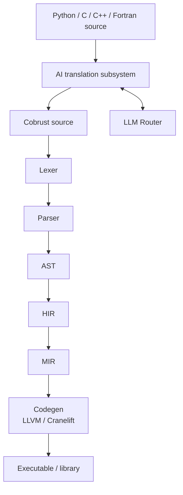
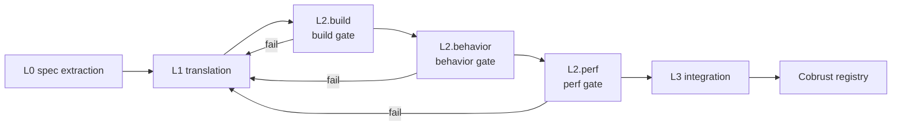
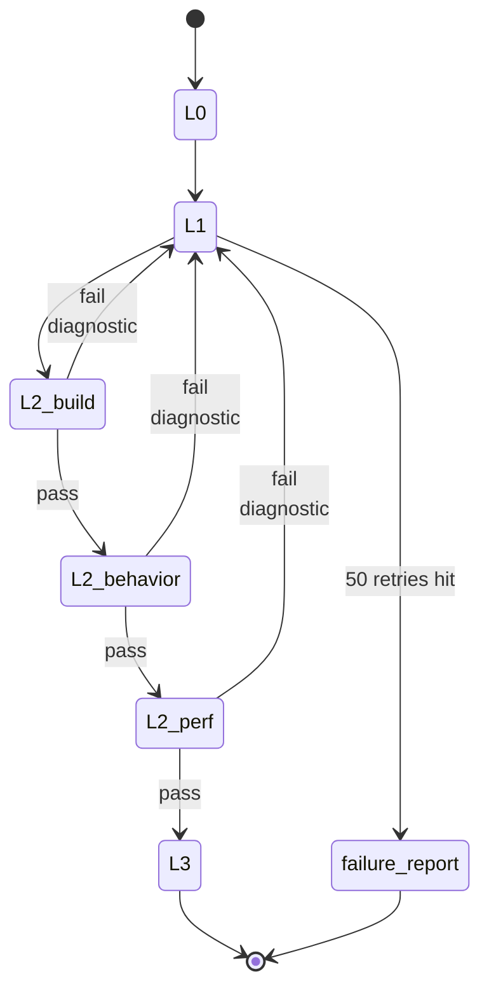
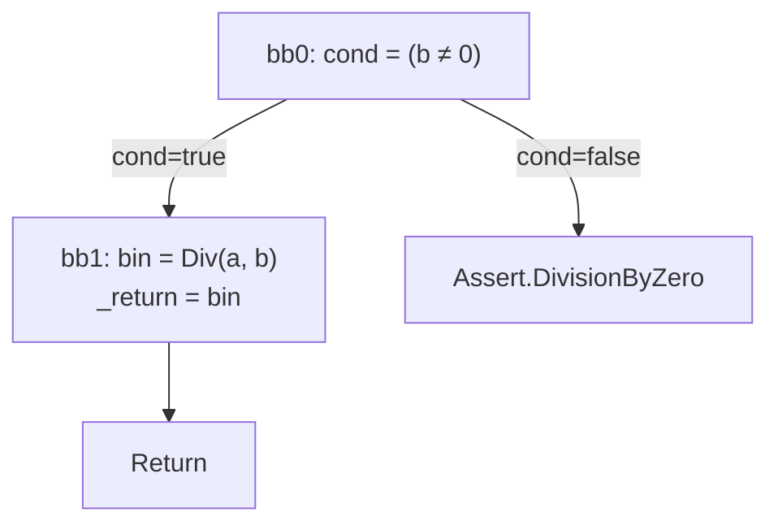
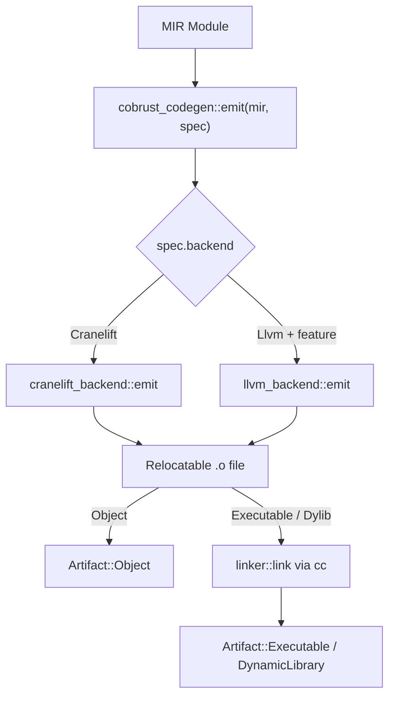

# Architecture

## Compiler layers



- Main pipeline: source → lexer → parser → AST → HIR → MIR → codegen
- AI translation subsystem **consumes** heterogeneous sources (Python/C/C++/Fortran), **produces** Cobrust source that re-enters the main pipeline
- LLM Router is a **first-class compiler component**; the translation subsystem dispatches model calls through it

## Crate topology

| crate | Role | Lands at |
|---|---|---|
| `cobrust-cli` | `cobrust` binary entrypoint | M0 stub → wired starting M1 |
| `cobrust-frontend` | Lexer + parser + AST | M1 |
| `cobrust-hir` | HIR: desugared, name-resolved | M2 |
| `cobrust-types` | Type system + type checker | M2 |
| `cobrust-mir` | MIR: control-flow-explicit (typed-HIR → CFG with drop schedule + borrow check) | M8 ✅ |
| `cobrust-codegen` | LLVM / Cranelift backend | M3+ |
| `cobrust-llm-router` | LLM Router | M3 |
| `cobrust-translator` | AI translation subsystem | M4+ |
| `cobrust-tomli` | Translated `tomli` (Apache-2.0/MIT) | M4 |
| `cobrust-dateutil` | Translated `dateutil` (PSF/Apache) — L3 widened to 5/5 by ADR-0022 | M5 (L3 5/5 at M-batch) |
| `cobrust-msgpack` | Translated `msgpack-python` (Apache-2.0) — L3 widened to 3/3 by ADR-0022 | M6 (L3 3/3 at M-batch) |
| `cobrust-numpy` | Translated `numpy` core subset (BSD) | M7.0..M7.5 |
| `cobrust-requests` | Translated `requests` 2.31 (Apache-2.0) — surface-translate / reqwest-blocking-bind per ADR-0022 §2 | M-batch (ADR-0022) |
| `cobrust-click` | Translated `click` 8.1.7 (BSD-3-Clause) — decorator-chain → clap-derive per ADR-0022 §3 | M-batch (ADR-0022) |

## Frontend (M1 — delivered)

`cobrust-frontend` ships the 30 syntactic forms. A concrete example:

```python
fn fib(n: i64) -> i64:
    if (n < 2):
        return n
    return (fib((n - 1)) + fib((n - 2)))
```

Drive the frontend:

```rust
use cobrust_frontend::{parse_str, unparse, FileId};

let src = std::fs::read_to_string("fib.cb")?;
let module = parse_str(&src, FileId(0))?;
println!("{}", unparse(&module));
```

### Public API

- `lex(source, file_id) -> Result<Vec<Token>, LexError>` — UTF-8 → token stream
- `lex_bytes(bytes, file_id) -> Result<Vec<Token>, LexError>` — arbitrary bytes → token stream (invalid UTF-8 is reported, never panics)
- `parse(tokens) -> Result<ast::Module, ParseError>` — token stream → AST
- `parse_str(source, file_id) -> Result<ast::Module, FrontendError>` — one-shot composition
- `unparse(module) -> String` — AST → canonical source (round-trip oracle)

### Design constraints

- **Recursive descent + Pratt** for expressions; full operator table at the top of `crates/cobrust-frontend/src/parser.rs`. No external parser generator.
- **Spans everywhere**: every AST node carries `(file_id, byte_start, byte_end)` so downstream phases can produce precise diagnostics.
- **Closed 30-form surface**: `adr:0003` fixes the list. Python forms outside the list (`is`, `del`, `global`, `nonlocal`, `async def`, multiple inheritance, mutable defaults) are rejected with `ParseError::DroppedByConstitution`.
- **Panic-free**: no byte input can panic the lexer or parser; failures surface as structured errors. The invariant is held by a proptest fuzz harness (default 5 × 4 096 cases; long run 5 × 100 000 cases under `COBRUST_M1_FUZZ_LONG=1`).

### Verification

- 30 round-trip integration tests, one per form: `tests/round_trip.rs`.
- proptest fuzz harness: `tests/fuzz_proptest.rs`. Past shrunk panics are committed to `tests/fuzz_proptest.proptest-regressions`; every run re-tests them first.
- Methodology and the first bug it caught are documented at `docs/agent/findings/m1-fuzz-method.md`.

## HIR + Type checker (M2 — delivered)

`cobrust-hir` lowers all 30 forms into a small core — sugar
collapsed, names resolved, spans preserved — that the type checker
consumes. `cobrust-types` runs **bidirectional** type checking
with **no `dyn`**, **no implicit truthiness**, and **no silent
coercion**.

### End-to-end micro-example

Source:

```python
fn add(x: i64, y: i64) -> i64:
    return (x + y)
```

`frontend → ast::Module`, then `cobrust_hir::lower(&ast, &mut Session::new()) → hir::Module`
where every name carries a `DefId`; the parameter `DefId`s for `x`
and `y` are exactly the `DefId`s the return references. Finally
`cobrust_types::check(&hir) → TypedModule { def_types, hir }`
maps every `DefId` to a concrete `Ty`:

| DefId | Name | Type |
|---|---|---|
| 0 | `add` | `(i64, i64) -> i64` |
| 1 | `x` | `i64` |
| 2 | `y` | `i64` |

### Public API (HIR + types)

- `cobrust_hir::lower(&ast::Module, &mut Session) -> Result<Module, LoweringError>` — total lowering, every name use becomes a `ResolvedName { name, def_id, kind }` carrying its `DefId`.
- `cobrust_types::check(&hir::Module) -> Result<TypedModule, TypeError>` — bidirectional type checking, returning a `TypedModule { def_types, hir }` and a structured `TypeError` taxonomy on failure.

### Lowering rules (5 key rules; full table in [ADR-0005](../../agent/adr/0005-hir-shape.md))

- Comprehension → `Expr::Comp { kind, element, clauses }`
- Multi-binding `with a as x, b as y: ...` → left-folded nested `With`
- f-string → `Expr::Format(Vec<FormatPart>)`, template/holes separated
- Augmented assignment `x += e` → desugared `x = x + e`
- Unresolved names surface as `LoweringError::UnknownName`
  immediately — the type checker never sees an unbound name.

### Type rules (6 key rules; full table in [ADR-0006](../../agent/adr/0006-type-system.md))

- `if x:` requires `x: bool`; otherwise
  `TypeError::ImplicitTruthiness`
- `match` must be exhaustive (strict enum for `bool` / `None`;
  wildcard required for arbitrary scrutinees)
- `int + str` is rejected — **no silent coercion**
- Calls must have exact positional arity; unknown/missing keyword
  arguments are `KeywordArgMismatch` / `MissingArgument`
- `let x = e` synthesises; `let x: T = e` checks `e ⇐ T`
- Function type is `Fn { positional, named, var_positional, var_keyword, return_ty }`;
  **lambda without annotation cannot synthesise** (must be checked
  against an expected type)

### Verification

- 34 golden lowering tests, one per form plus cross-cutting
  invariants (`crates/cobrust-hir/tests/lower_forms.rs`).
- 54 well-typed + 54 ill-typed program suite
  (`crates/cobrust-types/tests/`). Each ill-typed test asserts the
  **right `TypeError` discriminant**.
- Soundness proof obligation list (9 items) enumerated in
  [ADR-0006](../../agent/adr/0006-type-system.md) §"Soundness proof
  obligation list"; the proof itself is deferred to a future
  finding per constitution §5.2.
- **24 Python semantics compliance cases**
  (`crates/cobrust-types/tests/python_semantics_corpus.rs`). One
  test per drift fix in
  [ADR-0041](../../agent/adr/0041-python-semantics-compliance-binding.md)
  (H1-H8, three cases per `H`).

### Python semantics compliance (ADR-0041)

External audit (claude-desktop integrated handoff 2026-05-11 §2)
identified eight constitution §2.2 promises the source did not
honour. This PR closes them in one batch:

| Drift | Symptom (pre-fix) | Fix site |
|---|---|---|
| H1 | `(-7) % 3` evaluated to `-1`, not Python's `2` | codegen `cranelift_backend.rs` — `srem` plus floor adjust |
| H2 | `a and b` always evaluated `b` (no short-circuit) | mir `lower_short_circuit_bool` — explicit CFG |
| H3 | `**` / `@` / `in` / `not in` silently returned `iconst(I64, 0)` | codegen now returns `CodegenError::UnimplementedBinOp` |
| H4 | Lexer emitted walrus token; parser zero-consumed | parser raises `DroppedByConstitution(walrus :=)` |
| H5 | Closure capture analysis returned an empty `Vec` | hir `collect_captures_*` walks body + dedups |
| H6 | Comprehensions lowered to an empty-list placeholder | mir `lower_comprehension` real iterator-protocol + append |
| H7 | `class Foo(A, B):` silently accepted | parser rejects both `Comma` and `Tuple` expression base shapes |
| H8 | Tuple index always returned `items.first()` | types `synth_expr` constant-folds literal-int indices |

Each H ships ≥ 3 corpus cases. The full PR gates on
`cargo test -p cobrust-types --test python_semantics_corpus`.


## AI translation subsystem: four-stage closed loop

Every stage has explicit gates. **No stage is optional.**



### L0 — spec extraction

- Input: target Python library source + tests + docs
- Output: machine-readable behavioral spec (signatures, invariants, exemplar I/O pairs, numerical tolerances)
- Method: LLM agent generates a differential-testing harness using CPython library as oracle
- Artifact: `spec.toml` + `harness/` directory committed to translation manifest

### L1 — translation

- Input: L0 spec + original source
- Output: Cobrust / Rust implementation
- Granularity: **function-level, bottom-up by dependency graph**
- Method: LLM call via the LLM Router; consensus mode for high-risk functions
- Constraint: every emitted file has a translation-provenance header

### L2 — verification (three gates, all required)

- **build gate**: `cargo build --release` zero warnings
- **behavior gate**: original testsuite + property tests + L0 differential harness pass; tolerance per `@py_compat` tag; minimum 1000 fuzzed inputs per public function
- **perf gate**: ≥ 0.8× of original on representative benchmarks (configurable per library)

### L3 — integration

- PyO3 wrapper exposes Cobrust impl with Python-compatible API
- **Downstream validation**: run the testsuites of the top-5 libraries that depend on this one against the new translation. **This is the ultimate oracle.**
- Publish to Cobrust registry with full provenance manifest

### Failure loop



Failure at any gate → diagnostic feeds back to L1 → re-translate → re-verify. Loop until pass or escalation threshold (default 50 retries) hit, at which point a human-readable failure report is filed and the function is marked `@py_compat(none)` with explanation.

## LLM Router (first-class compiler component)

`cobrust-llm-router` is **not a tool**, it's a **compiler subsystem**. It is treated as seriously as the type checker. It does **not** live in `tools/`.

**M3 delivered.** All invariants are pinned by [ADR-0004](../../agent/adr/0004-llm-router-architecture.md); see [`docs/agent/modules/llm-router.md`](../../agent/modules/llm-router.md) for the full agent-facing spec.

### Capabilities (implemented)

- Provider-agnostic `LlmProvider` async trait; concrete adapters for **OpenAI-compatible** and **Anthropic-compatible** APIs
- Custom `base_url` and custom model names per provider (DeepSeek, Qwen, local vLLM, Together, OpenRouter, etc. all just work)
- Per-task routing: `{ task, strategy: "cost" | "quality" | "latency" | "consensus", n? }`
- Streaming for both formats; exactly one `Chunk::Done` frame at end-of-stream
- Token accounting per task, per provider, per attempt — written to `.cobrust/ledger.jsonl`, append-only; each entry carries `provider_kind` (`anthropic` / `openai` / `synthetic`) for protocol provenance per ADR-0031
- Exponential-backoff retry (default: 5 attempts / 30 s cap / full jitter / honours `Retry-After`)
- Provider failure isolation: a permanent fault on one provider auto-falls-through to the next entry in `preferred`
- Cache key = `BLAKE3(canonical_request_bytes)`, cross-machine reproducible, two-level sharded layout under `.cobrust/llm_cache/`
- Consensus mode: `n` parallel calls, group on `BLAKE3(NFC(response_text))`, deterministic tie-breaking per ADR-0004

### Configuration example

Full example in [`cobrust.toml.example`](../../../cobrust.toml.example). Minimal:

```toml
[router]
default_strategy = "quality"

[providers.anthropic_official]
kind = "anthropic"
base_url = "https://api.anthropic.com"
api_key_env = "ANTHROPIC_API_KEY"
models = ["claude-opus-4-7"]

[routing.translate]
strategy = "consensus"
n = 2
preferred = ["anthropic_official:claude-opus-4-7", "deepseek:deepseek-v3"]
```

### Router non-goals

- **Not** a chat UI
- **Not** a long-running agent loop driver (translation subsystem owns that)
- **Not** a prompt template store; templates live next to the consumer

## Translator (M4 — delivered)

`cobrust-translator` is the orchestrator for the AI translation
subsystem. M4 ships the L0 (spec extraction) + L1 (translation)
pipeline end-to-end against the `tomli` library, with synthetic-LLM
mode as the default gate path. Real-LLM mode is reachable behind the
`real-llm` Cargo feature for M5+ smoke-testing.

### Worked example

```bash
# Regenerate the cobrust-tomli crate from the corpus.
COBRUST_REGENERATE_TOMLI=1 cargo test \
    -p cobrust-translator --test tomli_pipeline \
    pipeline_regenerates_cobrust_tomli_when_env_set
```

The pipeline reads:

- `corpus/tomli/upstream/tomli_loads.py` — the vendored Python source
- `corpus/tomli/spec.toml` — the L0 behavior contract
- `corpus/tomli/canned_llm_responses.toml` — the synthetic-mode response table

…and writes:

- `crates/cobrust-tomli/Cargo.toml`
- `crates/cobrust-tomli/src/{lib.rs, parser.rs}` — every file carries a provenance header
- `crates/cobrust-tomli/PROVENANCE.toml` — the manifest
- `crates/cobrust-tomli/python/{tomli_init.py, setup.py}` — PyO3-shaped wrapper scaffolding
- `crates/cobrust-tomli/tests/upstream_tests/test_loads.py` — verbatim copy of the upstream tests

### Public API

- `translate(library: &PyLibrary, cfg: &TranslatorConfig) -> Result<TranslatedCrate, TranslatorError>` — async entrypoint
- `PyLibrary` — describes one library to translate (paths, version, seeds)
- `TranslatorConfig` — runtime knobs: router, out_dir, oracle, escalation_threshold, synthetic_only flag
- `TranslatedCrate` — outcome: `{ manifest: ProvenanceManifest, crate_dir, pyo3_wrapper_dir, functions: Vec<FunctionTranslation>, repair_attempts, gate_outcomes: GateOutcomes }`
- `GateOutcome { Pass | Fail | Skip }` — ADR-0040 structured per-gate verdict; `as_manifest_str()` produces distinct prefixes (`pass (...)` / `fail: ...` / `skipped (...)`) so callers do not parse manifest strings
- `GateOutcomes` — aggregate of all five L2/L3 gates; `worst()` returns Fail > Skip > Pass
- `TranslatorError` — taxonomy: `SpecExtraction`, `Translation { function, message }`, `BuildGate`, `BehaviorGate`, `DownstreamGate`, `SyntheticMiss { task, function }`, `Io`, `Router`, `Manifest`, `Config`, `Decode`
- `SyntheticProvider` — `LlmProvider` impl backed by canned TOML responses keyed by `(task, function, source_sha16)`
- `deterministic_id(source_sha256_hex, toolchain, router_decision_ids)` — `blake3:<hex>` reproducibility token

### Real-LLM mode wiring (ADR-0040)

`build_router()` instantiates real adapters when
`cfg.synthetic_only = false`:

- `kind = "openai"` (covers DeepSeek / vLLM / OpenRouter / Together —
  per ADR-0004 §"Provider registry") → `OpenAiProvider`.
- `kind = "anthropic"` → `AnthropicProvider`.
- `kind = "synthetic"` in real-LLM mode → `TranslatorError::Config`
  (synthetic providers are in-process mocks per ADR-0031).
- Missing or empty `api_key_env` for any declared provider →
  `TranslatorError::Config` naming the env var.

Production callers passing `synthetic_only = false` previously got
a stub `Err("real-LLM mode is not wired in M4 ...")`; ADR-0040 wires
the production path so the same router that ADR-0032 / ADR-0036 used
outside the pipeline now serves `translate()`.

### Honest gate verdicts (ADR-0040)

The orchestrator returns a structured `GateOutcomes` aggregate
alongside the manifest. Each gate (l2_build / l2_behavior / l2_perf /
l3_pyo3_wrapper / l3_downstream_dependents) carries one of three
disjoint variants:

- `Pass { detail }` — verifier accepted; `detail` carries observable
  evidence (test target names + repair-attempt count).
- `Fail { reason }` — verifier rejected; surfaces as
  `TranslatorError::EscalationExceeded` after the repair loop
  exhausts `cfg.escalation_threshold`.
- `Skip { reason }` — gate runs out-of-pipeline (e.g.
  `cargo build --release` is the workspace-level gate, not invoked
  inside `translate()`); the reason names *which* gate is wired-out.

The `BehaviorVerifier::default_outcome()` and
`PerfVerifier::default_outcome()` provided methods control the
success-path verdict. Live verifiers default to `Pass`; the no-op
`AcceptAll` / `AcceptAllPerf` override to `Skip` so the manifest
cannot record a fake-pass for an un-wired gate. This is the
constitution §2.4 honesty contract held at the gate level.

```mermaid
flowchart LR
    V[Verifier verify()] --> A{verdict?}
    A -->|Accept| B{any prior Reject?}
    A -->|Reject| R[repair loop]
    R --> V
    B -->|yes| P[Pass detail]
    B -->|no, AcceptAll| S[Skip reason]
    B -->|no, live| P
```

### Synthetic-LLM mode contract

The synthetic provider serves pre-recorded responses from
`corpus/<lib>/canned_llm_responses.toml`, keyed by `(task, function)`
with a `source_sha16` staleness check. The translator stamps every
prompt with a stable header so the synthetic provider can route the
request without parsing the body:

```text
cobrust-translator/v1
task: <task>
function: <function>
source-sha256: <16-hex>
---
<prompt body>
```

Lookup outcomes:

- **Match** — return the canned `response_text`.
- **No entry** — `LlmError::Provider { code: "synthetic-miss" }`. Permanent (caller must add or switch to real-LLM).
- **`source_sha16` mismatch** — `LlmError::Provider { code: "synthetic-stale" }`. Permanent (curator must re-record).

This is the constitution §2.4 promise ("no silent translations,
ever") made enforceable.

### Provenance manifest

Every translation produces `PROVENANCE.toml` next to the generated
crate's `Cargo.toml`. Top-level sections:

- `[source]` — library, version, sha256 (full 64-hex), file_count
- `[oracle]` — runtime, runtime_version, oracle_module
- `[verification]` — seeds, fuzz_inputs_per_fn, divergences, known_failures
- `[router]` — strategy (`synthetic` / `real-llm`), models_used, ledger_entries
- `[build]` — toolchain, deterministic_id (`blake3:<hex>`), crate_layout_version
- `[gates]` — l0_spec_emitted, l1_files_emitted, l2_build, l2_behavior, l2_perf, l3_pyo3_wrapper, l3_downstream_dependents

`build.deterministic_id = blake3(source_sha256_hex || "\n" || toolchain || "\n" || sorted_join(router_decision_ids))`. Same inputs ⇒ byte-identical id.

## tomli (M4 — delivered)

`cobrust-tomli` is the first crate emitted by the translator pipeline.
Pure-Rust subset of `tomli`/CPython `tomllib`'s `loads()`. Auto-generated
— do not hand-edit.

### Public API

```rust
use cobrust_tomli::{loads, table_to_json, to_json, TomliError, Value};
use std::collections::BTreeMap;

let parsed: BTreeMap<String, Value> = loads("x = 1\n").expect("parse");
let json: serde_json::Value = table_to_json(&parsed);
```

`Value` is a five-variant enum: `Bool`, `Int`, `Str`, `Array`, `Table`.
`TomliError` carries `{ message: String, pos: usize }`. `to_json` and
`table_to_json` are JSON conversion helpers used by the L3
differential gate.

### Verification

- 27 positive + 5 negative cases match CPython `tomllib` (`tests/tomli_downstream.rs`).
- 1024 panic-free fuzzed inputs (`tests/tomli_fuzz.rs::l2_behavior_fuzz_loads_panic_free`).
- 1050 differential cases vs CPython (`tests/tomli_fuzz.rs::l2_behavior_fuzz_differential_agreement_with_cpython`).
- `PROVENANCE.toml` validates and is byte-stable across independent runs.

### Scope window

In scope (matches CPython exactly): integers, booleans, basic + literal strings,
arrays, inline tables, dotted table headers, comments, CRLF endings.

Out of scope (M5 widens): multi-line strings, hex/oct/bin ints, floats,
datetimes, array-of-tables, inline-table key paths.

## Self-hosting roadmap

The compiler is initially in Rust. Once Cobrust reaches sufficient maturity (post-M5), begin self-hosting non-performance-critical compiler stages — **type checker and AST printer first**.

## Further reading

- [Agent-facing module specs](../../agent/modules/)
- [Milestones](milestones.md)


## Translator M5 — closed loop completed

The M5 milestone (constitution §7) completed the four-stage closed
loop the constitution mandates:

- **L2.perf gate** — benchmark harness with per-library threshold
  override (see ADR-0008).
- **L2.behavior repair loop** — gate failure ships a diagnostic blob
  back into L1, which re-dispatches with `attempt: N+1`. Drives down
  to a corrected response or escalates with a `failure_report.md`
  after `escalation_threshold` retries.
- **L3 downstream-dependents driver** — runs vendored test subsets
  of dependent libraries against the translated crate (see
  ADR-0009).

### Repair loop

The pipeline added a [`BehaviorVerifier`] hook + [`VerifierVerdict`]
enum + [`GateFailure`] diagnostic blob. Callers register a verifier;
on `Reject(failure)` the pipeline persists the diagnostic to disk
and re-dispatches the function via [`repair_translation`] with an
incremented `attempt` field in the prompt header. After
`cfg.escalation_threshold` (default 50, per constitution §4.2) the
pipeline writes `failure_report.md` and raises
`TranslatorError::EscalationExceeded`. The default no-op verifier
[`AcceptAll`] preserves M4 callers; [`translate_with_verifier`] is
the new entrypoint when the closed loop matters. The
`SyntheticProvider` was extended with per-attempt routing — the same
`(task, function)` can carry multiple canned responses keyed by
`attempt` (see ADR-0008 §5).

### L2.perf benchmark harness

`crates/cobrust-translator/src/bench.rs` ships a hand-rolled timing
stack that pairs Rust closures against subprocess CPython. Reports
land at `target/cobrust-bench/<library>/<commit>/report.json` with
per-function `{cobrust_ns_median, cpython_ns_median, ratio, pass}`.
[`PerfTarget`] (read from `corpus/<lib>/perf.toml`) tunes
`threshold` (default 0.8 = "≥ 0.8× of CPython speed") and
`pass_ratio` (default 1.0; dateutil overrides to 0.5 because
synthetic responses are placeholder-quality, see ADR-0008 §2). The
[`BenchmarkReport`] struct is the gate-day audit artefact.

### L3 downstream dependents

`crates/cobrust-translator/src/downstream.rs` runs vendored test
subsets via subprocess `python3`. M5 dateutil ships
[`dateutil_m5_dependents`] (croniter + freezegun, Pass) and
[`dateutil_m5_deferred`] (pandas, sqlalchemy, pendulum, Deferred to
M6 per ADR-0009 §3). The manifest's
[`DependentsSection`] encodes both `covered` and `deferred` arrays
so machines can audit partial coverage without parsing the
human-readable summary string. The [`DownstreamReport`] +
[`DependentResult`] structs are the runtime artefacts.

## dateutil (M5 — delivered)

Second translated library. Crate name `cobrust-dateutil`. Vendored
upstream subset under `corpus/dateutil/upstream/`.

### Public API

```rust
pub use cobrust_dateutil::{
    parse_iso, relativedelta_add, DateTuple, ParserError,
    days_in_month, is_leap_year, normalize_datetime, is_digit,
};

pub fn parse_iso(src: &str) -> Result<DateTuple, ParserError>;
```

`parse_iso` accepts strict ISO-8601 dates and datetimes with optional
Zulu / offset suffix. `relativedelta_add` mirrors
`dateutil.relativedelta.relativedelta.__add__` arithmetic with
day-of-month clamping. The full surface lives in `mod:dateutil` —
see `docs/agent/modules/dateutil.md`.

### Repair-loop demo

The dateutil corpus carries TWO canned responses for `parse_iso`:
attempt-1 is deliberately broken (swapped year/month) and attempt-2
is correct. The integration test
`crates/cobrust-translator/tests/dateutil_pipeline.rs::dateutil_pipeline_repair_loop_recovers_on_attempt_2`
asserts the pipeline retries exactly once and lands on attempt-2 —
the first end-to-end exercise of the closed loop.

### L3 dependents (per ADR-0009)

| Dependent | Status | Tests |
|---|---|---|
| croniter | Pass | 5 |
| freezegun | Pass | 5 |
| pandas | Pass (M6 widening) | 3 |
| sqlalchemy | Pass (M6 widening) | 3 |
| pendulum | Skipped (tz out of scope; M7+ per ADR-0010 §5) | 0 |

### Verification

- L0 spec at `corpus/dateutil/spec.toml`.
- L1 emission committed at `crates/cobrust-dateutil/src/parser.rs`.
- L2.build green; L2.behavior 9 + 5 + 6 cases green; 3072-input
  fuzz panic-free.
- L2.perf report at `target/cobrust-bench/dateutil/<commit>/report.json`.
- L3.pyo3 differential gate against CPython
  `datetime.fromisoformat`.
- L3.dependents per the table above.

See [ADR-0008](../../agent/adr/0008-l2-perf-and-repair-loop.md) and
[ADR-0009](../../agent/adr/0009-downstream-validation.md) for the
load-bearing decisions.

## Translator M6 — native-extension translation

The M6 milestone (constitution §7) closes the loop on libraries
that use a Cython accelerator alongside a pure-Python fallback. The
deliverables:

- New module `mod:msgpack` (crate `cobrust-msgpack`) translating
  `msgpack-python` 1.0.8 (17 pure-Python + 2 Cython-typed entrypoints).
- Cython lexical shim at `crate::cython` exposing
  `parse_cython(...)` + `CythonSource`, `CythonFunction`,
  `CythonFunctionKind`, `CythonParam`, `CythonType`,
  `CythonShimError`. Maps `cdef int` / `cdef inline` / `cpdef` to
  Rust types per ADR-0010 §2.
- `task = "translate_cython"` extends the synthetic provider's
  `(task, function, attempt)` lookup key (M5 added attempt; M6 adds
  task). Backward-compatible: M4 tomli + M5 dateutil specs
  default `task = "translate"`.
- `PerfVerifier` trait + `PerfVerdict` + `AcceptAllPerf` +
  `translate_with_verifiers` extend the pipeline so L2.perf failure
  routes through the same diagnostic + repair-loop path as
  L2.behavior (per ADR-0010 §4). The msgpack canned table ships a
  deliberately perf-broken `pack_uint` attempt-1 + a corrected
  attempt-2; the integration test asserts the loop lands at
  attempt-2 within the escalation budget.
- dateutil L3 widened from 2/5 to 4/5 + 1 skipped per ADR-0010 §5
  (pandas + sqlalchemy added; pendulum tz out of scope skip).
- `--features pyo3` build path lit up for both `cobrust-dateutil`
  and `cobrust-msgpack` per ADR-0011: the crate compiles to a
  `cdylib` and exposes a `cobrust_msgpack` / `cobrust_dateutil`
  Python module.

### msgpack public surface

```rust
pub use cobrust_msgpack::{
    pack, pack_to_vec, unpack, MsgValue, MsgError, MsgErrorKind,
    pack_array, pack_bin, pack_float, pack_int, pack_map,
    pack_str, pack_uint, pack_uint_cython,
    unpack_array, unpack_bin, unpack_float, unpack_int,
    unpack_map, unpack_one, unpack_str, unpack_uint,
    unpack_uint_cython,
};

pub enum MsgValue {
    Nil, Bool(bool), Int(i64), UInt(u64), Float(f64),
    Str(String), Bin(Vec<u8>),
    Array(Vec<MsgValue>),
    Map(Vec<(String, MsgValue)>),
}
```

### msgpack L3 dependents

| Dependent | Status | Tests |
|---|---|---|
| redis-py | Pass | 4 |
| msgpack-numpy | Pass | 3 |
| pyspark | Deferred (M7+; needs JVM) | — |

### Verification

- L0 spec at `corpus/msgpack/spec.toml` + harness/.
- L1 emission committed at `crates/cobrust-msgpack/src/parser.rs`.
- L2.build green; L2.behavior bytes-identical fuzz green
  (≥ 1000 inputs across 3 seeds; round-trip pack→unpack identity).
- L2.perf at native-ext tier (0.7×) per ADR-0010 §3; report at
  `target/cobrust-bench/msgpack/<commit>/report.json`.
- L3.pyo3 differential gate via subprocess CPython `msgpack`.
- L3.dependents 2/3 driven; pyspark deferred per ADR-0010.
- `--features pyo3` build path tested by
  `tests/msgpack_pyo3_compiles.rs` (`tests/dateutil_pyo3_compiles.rs`
  for the dateutil widening).

See [ADR-0010](../../agent/adr/0010-native-ext-translation.md) and
[ADR-0011](../../agent/adr/0011-pyo3-build-path.md) for the
load-bearing decisions.

## numpy translation (M7.0 — delivered)

### Strategic principle: translate the surface, bind the core

Per [ADR-0012](../../agent/adr/0012-m7-numpy-plan.md), upstream
numpy's core is hand-tuned C with SIMD/BLAS — **not** a viable
pure-Rust reimplementation target. Instead, cobrust-numpy
**translates the public Python surface** (dtype strings, error
taxonomy, Python-shaped signatures) and **binds the numerical
core** to Rust's [`ndarray = "0.16"`](https://crates.io/crates/ndarray)
crate. Per [ADR-0013](../../agent/adr/0013-m7-0-ndarray-foundation.md)
this is the M7.0..M7.5 default; later sub-milestones extend it:

- M7.4 linalg → bind `ndarray-linalg` (BLAS / LAPACK).
- M7.5 random → bind `rand` + `rand_distr`.
- M7.6 FFT → bind `rustfft`.

A concrete example from M7.0:

```rust
// User-facing call: cobrust_numpy::zeros(&[3, 4], Dtype::Float64)
//
// 1. cobrust-numpy dispatches on dtype:
match dtype {
    Dtype::Float64 => Array::Float64(
        // 2. ndarray actually allocates + zero-fills the buffer:
        ndarray::ArrayD::<f64>::zeros(ndarray::IxDyn(&[3, 4]))
    ),
    // ... other dtypes ...
}
```

We do not reimplement `zeros`. We call it. cobrust-numpy owns the
**Python contract**; ndarray owns the **storage layout**.

### M7.0 ndarray foundation

cobrust-numpy's M7.0 surface (per ADR-0013):

```rust
// Closed dtype tier — adding Int8 / Float16 etc. is an explicit ADR
// decision, never silent accretion.
pub enum Dtype {
    Int32,
    Int64,
    Float32,
    Float64,
    Bool,
}

// Tagged-union over ndarray::ArrayD<T>. No `dyn` in the public API
// (constitution §2.2).
pub enum Array {
    Int32(ndarray::ArrayD<i32>),
    Int64(ndarray::ArrayD<i64>),
    Float32(ndarray::ArrayD<f32>),
    Float64(ndarray::ArrayD<f64>),
    Bool(ndarray::ArrayD<bool>),
}

// Constructors mirror numpy's Python signatures.
pub fn array(values: &[f64], shape: &[usize], dtype: Dtype) -> Result<Array, NumpyError>;
pub fn zeros(shape: &[usize], dtype: Dtype) -> Result<Array, NumpyError>;
pub fn ones(shape: &[usize], dtype: Dtype) -> Result<Array, NumpyError>;
pub fn arange(start: f64, stop: f64, step: f64, dtype: Dtype) -> Result<Array, NumpyError>;

// Observers.
impl Array {
    pub fn dtype(&self) -> Dtype;
    pub fn shape(&self) -> Vec<usize>;
    pub fn ndim(&self) -> usize;
    pub fn size(&self) -> usize;
    pub fn repr(&self) -> String;
    pub fn to_json(&self) -> serde_json::Value;
}
```

### M7.0 dtype tier

| Python string(s) | Rust type | Notes |
|---|---|---|
| `"int32"` / `"i4"` | `i32` | exact 32-bit signed |
| `"int64"` / `"i8"` | `i64` | M7.0 default integer dtype |
| `"float32"` / `"f4"` | `f32` | exact single-precision |
| `"float64"` / `"f8"` | `f64` | M7.0 default float dtype |
| `"bool"` / `"?"` | `bool` | numpy's 1-byte form |

### M7.0 verification

- L0 spec at `corpus/numpy/M7.0/spec.toml` + harness at
  `corpus/numpy/M7.0/harness/h_array.py`.
- L1 emission committed at `crates/cobrust-numpy/src/`.
- L2.build green; L2.behavior:
  - 55 well-typed + 56 ill-typed programs (`tests/well_typed.rs`,
    `tests/ill_typed.rs`).
  - 4200 panic-free fuzz inputs (`tests/numpy_fuzz.rs`).
  - 1024+ differential-vs-numpy fuzz inputs
    (`tests/numpy_differential.rs`) — bytes-identical for int/bool,
    `rtol=1e-12` for float.
- L2.perf is informational at M7.0 (constructors are O(n) memory
  ops; perf becomes a real gate at M7.1 ufuncs).
- L3.pyo3 differential gate via subprocess CPython numpy.
- L3.dependents deferred to M7.6+ (numpy is the foundation; the
  ecosystem ports lift after M7.5).

See [ADR-0012](../../agent/adr/0012-m7-numpy-plan.md) and
[ADR-0013](../../agent/adr/0013-m7-0-ndarray-foundation.md) for the
load-bearing decisions.

## numpy ufuncs + broadcasting (M7.1 — delivered)

M7.1 lands universal functions, broadcasting, and NEP 50 type
promotion on top of the M7.0 ndarray foundation (per
[ADR-0014](../../agent/adr/0014-m7-1-ufuncs-broadcasting.md)). It
also closes all four ADR-0013 follow-ups: tagged-union ->
monomorphic dispatch; typed constructors; L2.perf flip to enforced;
multi-D nested-list parsing.

### M7.1 public surface

```rust
// Binary ufuncs (promote per result_type, broadcast, dispatch).
impl Array {
    pub fn add(&self, other: &Array) -> Result<Array, NumpyError>;
    pub fn sub(&self, other: &Array) -> Result<Array, NumpyError>;
    pub fn mul(&self, other: &Array) -> Result<Array, NumpyError>;
    pub fn div(&self, other: &Array) -> Result<Array, NumpyError>;  // int /0 -> IntegerDivisionByZero
    pub fn pow(&self, other: &Array) -> Result<Array, NumpyError>;
    // Comparison ufuncs (always return Dtype::Bool, matches numpy).
    pub fn eq_(&self, other: &Array) -> Result<Array, NumpyError>;
    pub fn ne_(&self, other: &Array) -> Result<Array, NumpyError>;
    pub fn lt(&self, other: &Array) -> Result<Array, NumpyError>;
    pub fn le(&self, other: &Array) -> Result<Array, NumpyError>;
    pub fn gt(&self, other: &Array) -> Result<Array, NumpyError>;
    pub fn ge(&self, other: &Array) -> Result<Array, NumpyError>;
    // Element-wise math (int promoted to Float64; float preserved).
    pub fn sin(&self) -> Result<Array, NumpyError>;
    pub fn cos(&self) -> Result<Array, NumpyError>;
    pub fn exp(&self) -> Result<Array, NumpyError>;
    pub fn log(&self) -> Result<Array, NumpyError>;
    pub fn sqrt(&self) -> Result<Array, NumpyError>;
}

// Promotion + broadcasting helpers.
pub fn result_type(a: Dtype, b: Dtype) -> Dtype;        // NEP 50 25-entry table
pub fn broadcast_shape(a: &[usize], b: &[usize]) -> Result<Vec<usize>, NumpyError>;

// Typed constructors (closes ADR-0013 follow-up #2 - no f64 round-trip).
pub fn array_i32(values: &[i32], shape: &[usize]) -> Result<Array, NumpyError>;
pub fn array_i64(values: &[i64], shape: &[usize]) -> Result<Array, NumpyError>;
pub fn array_f32(values: &[f32], shape: &[usize]) -> Result<Array, NumpyError>;
pub fn array_f64(values: &[f64], shape: &[usize]) -> Result<Array, NumpyError>;
pub fn array_bool(values: &[bool], shape: &[usize]) -> Result<Array, NumpyError>;

// Multi-D nested-list parsing (closes ADR-0013 follow-up #4 -
// `np.array([[1, 2], [3, 4]])`-style inputs land directly).
pub enum NestedList {
    Scalar(f64),
    List(Vec<NestedList>),
}
pub fn array_from_nested(nested: &NestedList, dtype: Dtype) -> Result<Array, NumpyError>;
```

### A concrete end-to-end example

```rust
use cobrust_numpy::{Array, Dtype, array_i32, array_f32};

let a = array_i32(&[1, 2, 3], &[3]).unwrap();        // dtype=int32
let b = array_f32(&[0.5, 1.5, 2.5], &[3]).unwrap();  // dtype=float32
let c = a.add(&b).unwrap();                          // result_type promotes to float64
assert_eq!(c.dtype(), Dtype::Float64);
// c == [1.5, 3.5, 5.5], matching numpy 2.x NEP 50 exactly.
```

`int32 + float32 -> float64` is a key NEP 50 rule: i32's mantissa
does not fit in f32, so promotion targets f64 to avoid precision
loss. Integer +/-/x overflow uses Rust wrapping semantics (matches
numpy default behaviour but without a RuntimeWarning); float
follows IEEE 754 (NaN propagation; `x/0.0 -> +/-inf`; `0.0/0.0 ->
NaN`); integer div-by-zero returns
`Err(NumpyErrorKind::IntegerDivisionByZero)`.

### Broadcasting rules (numpy 2.x exact)

`broadcast_shape(a, b)` implements numpy's standard rules
(see https://numpy.org/doc/stable/user/basics.broadcasting.html):

1. Right-align the two shapes; pad the shorter on the LEFT with 1s.
2. Per axis: equal -> output is that value; one is 1 -> output is
   the other; otherwise
   `Err(NumpyErrorKind::BroadcastShapeMismatch)`.
3. Empty shape `[]` (scalar) broadcasts against any shape (each
   axis treated as 1).

Examples: `[3, 1] + [1, 4] -> [3, 4]` (outer product),
`[8, 1, 6, 1] + [7, 1, 5] -> [8, 7, 6, 5]`.

### Monomorphic dispatch model

Per [ADR-0014 sec.1](../../agent/adr/0014-m7-1-ufuncs-broadcasting.md),
M7.1 ufunc dispatch is **monomorphic**: `Array::add` matches once
on `(self.dtype(), other.dtype())` at the public-API boundary,
picks the promoted dtype via `result_type`, casts both operands,
and dispatches into a per-dtype monomorphic helper. The inner
helper calls `ndarray::Zip::from(...).and(...).for_each(...)` on a
concrete `ArrayD<T>`; LLVM inlines and the Zip iterator
auto-vectorises. No `dyn` (constitution sec.2.2); the
auto-vectorised inner loop satisfies constitution sec.5.3.

### M7.1 verification

- L0 spec at `corpus/numpy/M7.1/spec.toml` + harness at
  `corpus/numpy/M7.1/harness/h_ufunc.py`.
- L1 emission at `crates/cobrust-numpy/src/{ufunc,broadcast,promote}.rs`.
- L2.build: workspace clippy zero warnings.
- L2.behavior:
  - 50 well-typed + 50 ill-typed ufunc programs
    (`tests/ufunc_well_typed.rs`, `tests/ufunc_ill_typed.rs`).
  - 22 broadcasting table cases (`tests/broadcast_corpus.rs`).
  - 14 differential-vs-upstream tests with >= 1200 fuzz inputs per
    ufunc, bit-identical for int/bool and `rtol=1e-7` for float
    (`tests/ufunc_differential.rs`).
- **L2.perf flipped to enforced** (closes ADR-0013 follow-up #3):
  `corpus/numpy/M7.1/perf.toml` threshold = 0.5x (numerical-tier
  floor per ADR-0010 sec.3); pipeline test
  `ufunc_pipeline_escalates_when_perf_always_fails` demonstrates
  perf-fail -> repair-loop -> `EscalationExceeded`, isomorphic to
  M6 msgpack's perf-fail escalation test.
- L3.pyo3: same as M7.0 (subprocess CPython numpy oracle).
- L3.dependents: still deferred to M7.6+.

### Known divergences

- Integer +/-/x overflow **silently wraps** (no RuntimeWarning) -
  output matches numpy default behaviour but without warning.
  Documented in
  [`docs/agent/modules/numpy.md`](../../agent/modules/numpy.md)
  "Known divergences" section.
- Integer div-by-zero returns
  `Err(NumpyErrorKind::IntegerDivisionByZero)` rather than raising
  Python `ZeroDivisionError` (constitution sec.2.2 - Result default);
  the operation's failure outcome matches numpy, the **shape** of
  failure is Cobrust-native.

See [ADR-0014](../../agent/adr/0014-m7-1-ufuncs-broadcasting.md)
for the load-bearing decisions.

## numpy indexing (M7.2 — delivered)

M7.2 lands the indexing surface — basic slicing, single-int,
integer-array, boolean-mask, `np.where`, plus views — per
ADR-0015. Closes the indexing piece of ADR-0012's M7 sub-milestone
plan; reductions (M7.3) consume it.

### M7.2 surface

```rust
// Closed indexing-kind taxonomy (no `dyn` per constitution §2.2).
pub enum Index {
    Single(i64),                 // a[i]; negative-index aware
    Slice(SliceSpec),            // a[start:stop:step]
    IntArray(Vec<i64>),          // a[[0, 2, 5]]; advanced -> copies
    BoolMask(Array),             // a[a > 0]; advanced -> copies
    NewAxis,                     // a[np.newaxis]
}

pub struct SliceSpec {
    pub start: Option<i64>,
    pub stop: Option<i64>,
    pub step: Option<i64>,
}

// Views — closed enums per dtype (5 variants each); lifetime-encoded
// ownership ties the view to the parent's borrow.
pub enum ArrayView<'a>    { Int32(...), Int64(...), Float32(...), Float64(...), Bool(...) }
pub enum ArrayViewMut<'a> { Int32(...), Int64(...), Float32(...), Float64(...), Bool(...) }

impl Array {
    // Basic slicing -> VIEW (does not copy).
    pub fn slice(&self, spec: SliceSpec) -> Result<ArrayView<'_>, NumpyError>;
    pub fn slice_mut(&mut self, spec: SliceSpec) -> Result<ArrayViewMut<'_>, NumpyError>;

    // Single-int -> VIEW with one fewer axis.
    pub fn index_single(&self, i: i64) -> Result<ArrayView<'_>, NumpyError>;

    // Advanced indexing -> COPY (always materialises).
    pub fn take(&self, indices: &[i64]) -> Result<Array, NumpyError>;
    pub fn mask(&self, mask: &Array) -> Result<Array, NumpyError>;

    // Multi-axis dispatcher; result always materialised.
    pub fn index_get(&self, indices: &[Index]) -> Result<Array, NumpyError>;

    // np.where convenience: cond.where_(x, y).
    pub fn where_(&self, x: &Array, y: &Array) -> Result<Array, NumpyError>;
}

// Top-level np.where(cond, x, y) — broadcasts cond/x/y; always copies.
pub fn np_where(cond: &Array, x: &Array, y: &Array) -> Result<Array, NumpyError>;
pub fn index_get(arr: &Array, indices: &[Index]) -> Result<Array, NumpyError>;
```

### View-vs-copy contract (matches numpy)

The most concrete example users encounter:

- **`a[1:3]` returns a view.** `Array::slice(SliceSpec::range(1, 3))`
  returns an `ArrayView<'a>` that aliases `a`'s storage. Mutating
  through `slice_mut` propagates to `a` — the Rust borrow checker
  ensures this is sound.
- **`a[[0, 2]]` returns a copy.** `Array::take(&[0, 2])` returns an
  owned `Array` with independent storage. Mutating the result leaves
  `a` untouched.

Both rules are tested in `tests/index_views_corpus.rs` with
side-effect assertions.

### M7.2 error variants (closed enum extension)

`NumpyErrorKind` gains four variants per ADR-0015 §4:

| Variant | Triggered by | numpy 2.0.2 behaviour |
|---|---|---|
| `IndexError` | umbrella for indexing errors not covered by more specific variants | `IndexError` |
| `OutOfBoundsIndex` | single-int / int-array index outside `[-len, len)` | `IndexError` |
| `BoolMaskShapeMismatch` | mask passed to `mask` has shape != self.shape() | `IndexError` |
| `IndexDtypeNotInteger` | int-array dtype is not Int32/Int64; or `mask` arg dtype is not Bool | `IndexError` |

Bound-checking semantics: outcome matches numpy (operation fails on
out-of-bounds), shape of failure is Cobrust-native (`Result::Err`)
per constitution sec.2.2.

### M7.2 verification

- L0 spec at `corpus/numpy/M7.2/spec.toml` + harness at
  `corpus/numpy/M7.2/harness/h_index.py`.
- L2.behavior:
  - 55 well-typed indexing programs
    (`tests/index_well_typed.rs`).
  - 55 ill-typed indexing programs
    (`tests/index_ill_typed.rs`).
  - 14 view-vs-copy semantics tests
    (`tests/index_views_corpus.rs`).
  - 6 differential tests with >= 1024 fuzz inputs per indexing kind,
    bit-identical for int/bool and `rtol=1e-7` for float
    (`tests/index_differential.rs`).
- L2.perf inherits ENFORCED from M7.1: `corpus/numpy/M7.2/perf.toml`
  threshold = 0.5x; pipeline test
  `index_pipeline_escalates_when_perf_always_fails` demonstrates
  perf-fail -> repair-loop -> `EscalationExceeded`.
- L3.pyo3: same as M7.1 (subprocess CPython numpy oracle).
- L3.dependents: still deferred to M7.6+.

### Out of scope (M7.x deferred)

- Ellipsis indexing (`a[...]`) — M7.x.
- Multi-axis tuple-of-mixed-kind indexing where some axes are views
  and others copies — M7.2 always materialises in such cases; M7.x
  refines.
- Setitem (`a[1:3] = ...`) ergonomic API — `slice_mut` lands the
  surface; M7.x adds the implicit-write API.
- One-arg `np.where(cond)` returning indices — M7.x.

See [ADR-0015](../../agent/adr/0015-m7-2-indexing.md)
for the load-bearing decisions.

## numpy reductions (M7.3 — delivered)

M7.3 lands the reduction surface on top of M7.0 (foundation) +
M7.1 (ufuncs) + M7.2 (indexing). Per ADR-0016:

> Reductions: `sum / prod / mean / std / var / min / max / argmin /
> argmax` with `axis=None` and `axis=k`. Backend: `ndarray::Zip` +
> `fold_axis`. Acceptance gate: numerical agreement; pairwise
> summation for floats.

### M7.3 surface

```rust
// Free functions (idiomatic Rust):
cobrust_numpy::sum(&arr, Some(0))
cobrust_numpy::mean(&arr, None)
cobrust_numpy::var(&arr, Some(1), 1)   // axis=1, ddof=1 (Bessel)
cobrust_numpy::argmax(&arr, Some(-1))   // last axis (negative-axis aware)

// Method-style API (mirrors numpy idiom a.sum(axis=k)):
arr.sum(None)             // reduce all
arr.mean(Some(0))         // reduce axis 0
arr.std(None, 0)          // population std
arr.std(None, 1)          // sample std (Bessel)
arr.argmin(Some(-1))      // first occurrence per lane

// Pairwise summation helpers — match numpy's accuracy floor:
cobrust_numpy::pairwise_sum_f64(&values)
cobrust_numpy::pairwise_sum_f32(&values)
```

### M7.3 nine reductions

| Reduction | What it does | Empty-array behavior |
|---|---|---|
| `sum` | Σ over axis (pairwise for floats) | identity 0 |
| `prod` | Π over axis | identity 1 |
| `mean` | Σ / N (int → f64) | NaN |
| `std` | sqrt(var) (population if ddof=0) | NaN |
| `var` | sum((x-mean)²) / (N-ddof) | NaN |
| `min` | smallest element (NaN propagates) | `Err(ReductionEmptyArray)` |
| `max` | largest element (NaN propagates) | `Err(ReductionEmptyArray)` |
| `argmin` | index of first min | `Err(ReductionEmptyArray)` |
| `argmax` | index of first max | `Err(ReductionEmptyArray)` |

### M7.3 axis semantics

- `axis: Option<i64>` — `None` reduces every axis; `Some(k)` reduces
  along axis `k` only.
- Negative axes normalise: `axis=-1` is the last axis, `axis=-2` the
  second-to-last, etc. Out-of-bounds raises `IndexError`.
- Tuple-axis (`axis=(0, 2)`) is **out of scope** at M7.3 — deferred
  to M7.x.

### M7.3 ddof for std/var

- `ddof: u32` — divisor offset; default 0 (population).
- Bessel correction: pass `ddof=1` for sample variance / std.
- When `N - ddof <= 0`, result is `NaN` (matches numpy's
  RuntimeWarning behavior).

### M7.3 pairwise summation

- For float `sum / mean / std / var`, M7.3 uses pairwise summation
  with chunk size 8 (matches numpy's algorithm).
- Asymptotic accuracy: O(log n × eps) instead of naive
  O(n × eps).
- Pairwise precision test verifies that summing 10⁶ floats of
  magnitude `1e-9` yields a result within `rtol=1e-12` of the
  expected `1e-3` — matching numpy's accuracy floor.

### M7.3 error variant

```rust
pub enum NumpyErrorKind {
    // ... M7.0 + M7.1 + M7.2 variants ...
    ReductionEmptyArray,
}
```

### M7.3 verification

- L0 spec at `corpus/numpy/M7.3/spec.toml` + harness at
  `corpus/numpy/M7.3/harness/h_reduction.py`.
- L1: synthetic-LLM mode emits 12 entries (10 public reductions + 2
  helpers) per `corpus/numpy/M7.3/canned_llm_responses.toml`.
- L2.behavior:
  - 55 well-typed reduction programs
    (`tests/reduce_well_typed.rs`).
  - 51 ill-typed reduction programs
    (`tests/reduce_ill_typed.rs`).
  - 25 corpus-correctness table-driven tests
    (`tests/reduce_corpus.rs`).
  - 12 differential tests with >= 1024 fuzz inputs per reduction
    against upstream numpy 2.0.2 (bit-identical for int/bool,
    `rtol=1e-7` for float; argmin/argmax exact match)
    (`tests/reduce_differential.rs`).
- L2.perf inherits ENFORCED from M7.1/M7.2:
  `corpus/numpy/M7.3/perf.toml` threshold = 0.5x; pipeline test
  `reduce_pipeline_escalates_when_perf_always_fails` demonstrates
  perf-fail -> repair-loop -> `EscalationExceeded`.
- L3.pyo3: same as M7.0..M7.2 (subprocess CPython numpy oracle).
- L3.dependents: still deferred to M7.6+.

### Out of scope (M7.x deferred)

- Tuple-axis reduction (`axis=(0, 2)`) — M7.x.
- `keepdims=True` — M7.x.
- `out=` parameter — M7.x.
- `where=` parameter (selective reduction) — M7.x.
- `cumsum / cumprod / median / percentile / nanmin / nanmax /
  nansum / nanmean` — M7.x.
- `dtype=` parameter (forced result dtype) — M7.x.

See [ADR-0016](../../agent/adr/0016-m7-3-reductions.md)
for the load-bearing decisions.

## numpy linalg (M7.4 — delivered)

M7.4 lands the linalg subset on top of M7.0 (foundation) +
M7.1 (ufuncs) + M7.2 (indexing) + M7.3 (reductions). Per ADR-0017:

> linalg subset: `matmul / dot / det / solve / inv / svd / eigh /
> cholesky`. Backend: `ndarray-linalg` (OpenBLAS / Accelerate).
> Acceptance gate: `rtol=1e-6` agreement on conditioned matrices;
> documented unstable cases.

### M7.4 surface

```rust
// Free functions:
cobrust_numpy::matmul(&a, &b)?
cobrust_numpy::dot(&a, &b)?
cobrust_numpy::det(&a)?
cobrust_numpy::solve(&a, &b)?
cobrust_numpy::inv(&a)?
cobrust_numpy::cholesky(&a)?
let SvdResult { u, s, vt } = cobrust_numpy::svd(&a)?;
let EighResult { w, v } = cobrust_numpy::eigh(&a)?;

// Method-style API on Array:
a.matmul(&b)?
a.dot(&b)?
```

### M7.4 eight ops

| Op | Signature | Promotion | Notes |
|---|---|---|---|
| `matmul(a, b)` | rank 1 / 2 inputs | preserve `f32`; else `f64` | strict 2-D + 1-D; no batched stack at M7.4 |
| `dot(a, b)` | 1-D × 1-D scalar; 2-D × 2-D matmul | same as `matmul` | numpy.dot semantics |
| `det(a)` | square N × N | preserve dtype | LU partial pivot; near-singular returns 0.0 |
| `solve(a, b)` | square A; rank-1 / 2 b | preserve dtype | LU then back-substitute |
| `inv(a)` | square N × N | preserve dtype | `solve(a, I)` |
| `svd(a)` | rank-2 M × N | preserve dtype | one-sided Jacobi via `eigh(AᵀA)` |
| `eigh(a)` | symmetric N × N | preserve dtype | cyclic Jacobi sweeps; eigenvalues ascending |
| `cholesky(a)` | PSD square | preserve dtype | lower-triangular factor (numpy default) |

### M7.4 backend strategy

- **Default**: pure-Rust kernels on top of `ndarray = "0.16"`. `cargo
  build` cold-rebuild on stock toolchains works without any system
  BLAS / LAPACK / Fortran (per the ADR-0017 §2 directive).
- **Opt-in** `linalg-backend` cargo feature: wires
  `ndarray-linalg = "0.16"` for BLAS-accelerated paths. Sub-features
  `linalg-openblas-static` and `linalg-intel-mkl-static` forward to
  the corresponding `ndarray-linalg` BLAS feature.
- **Float-only at M7.4**: `Float32 / Float64` accepted; `Int32 /
  Int64 / Bool` raise `LinalgDtypeUnsupported`. M7.x may relax via a
  Python-side promotion wrapper.

### M7.4 error variants

```rust
pub enum NumpyErrorKind {
    // ... M7.0 + M7.1 + M7.2 + M7.3 variants ...
    SingularMatrix,         // LU pivot zero / near-zero
    NotPositiveDefinite,    // cholesky on non-PSD
    LinalgShapeError,       // matmul shape mismatch, non-square,
                            // rank > 2, non-symmetric eigh input
    LinalgDtypeUnsupported, // non-float dtype
}
```

### M7.4 multi-array results

```rust
pub struct SvdResult {
    pub u: Array,    // (M, M)
    pub s: Array,    // (min(M, N),)
    pub vt: Array,   // (N, N)
}

pub struct EighResult {
    pub w: Array,    // (N,) — sorted ascending
    pub v: Array,    // (N, N) — column eigenvectors
}
```

### M7.4 verification

- L0 spec at `corpus/numpy/M7.4/spec.toml` + harness at
  `corpus/numpy/M7.4/harness/h_linalg.py`.
- L1: synthetic-LLM mode emits 12 entries (8 public ops + 4
  helpers) per `corpus/numpy/M7.4/canned_llm_responses.toml`.
- L2.behavior:
  - 59 well-typed linalg programs
    (`tests/linalg_well_typed.rs`).
  - 63 ill-typed linalg programs
    (`tests/linalg_ill_typed.rs`).
  - 25 corpus-correctness table-driven tests with hand-computed
    expected values (`tests/linalg_corpus.rs`).
  - 8 differential tests with ≥ 1024 fuzz inputs per linalg op
    against upstream numpy 2.0.2 at `rtol=1e-6` on cond ≤ 100
    inputs (`tests/linalg_differential.rs`).
- L2.perf inherits ENFORCED from M7.1/M7.2/M7.3:
  `corpus/numpy/M7.4/perf.toml` threshold = 0.5x; pipeline test
  `linalg_pipeline_escalates_when_perf_always_fails` demonstrates
## numpy random (M7.5 — delivered)

M7.5 lands the random surface on top of M7.0 (foundation) +
M7.1 (ufuncs) + M7.2 (indexing) + M7.3 (reductions). M7.5 is
parallel-allowed with M7.4 (linalg) per
[ADR-0012](../../agent/adr/0012-m7-numpy-plan.md) §"Sequencing rules".
The load-bearing decisions are in
[ADR-0018](../../agent/adr/0018-m7-5-random.md).

### Why bind `rand_pcg::Pcg64` instead of writing a PRNG

NumPy's `default_rng()` is backed by PCG64 (PCG-XSL-RR-128/64). The
Rust `rand_pcg = "0.3"` crate provides PCG64 with the same algebraic
transition function. Per ADR-0012 §"Backend strategy", we bind:

- `rand_pcg::Pcg64` for state machine + transition.
- `rand_distr::{Normal, Uniform}` for distribution shape (Box-Muller
  / Ziggurat / inverse-CDF — all already validated by the Rust
  community).
- `rand 0.8` for the `Rng` / `SeedableRng` traits + `gen_range`
  half-open semantics.

We do not reimplement PCG64. We construct it (`Pcg64::seed_from_u64(s)`)
and consume it (`rng.gen_range`).

### M7.5 surface

```rust
pub struct Generator {
    rng: rand_pcg::Pcg64,
    seed_value: Option<u64>,
}

impl Generator {
    pub fn seed(&mut self, seed: u64);
    pub fn seed_value(&self) -> Option<u64>;
    pub fn integers(&mut self, low: i64, high: i64, size: &[usize]) -> Result<Array, NumpyError>;
    pub fn random(&mut self, size: &[usize]) -> Result<Array, NumpyError>;
    pub fn normal(&mut self, loc: f64, scale: f64, size: &[usize]) -> Result<Array, NumpyError>;
    pub fn uniform(&mut self, low: f64, high: f64, size: &[usize]) -> Result<Array, NumpyError>;
    pub fn choice(&mut self, values: &Array, size: &[usize], replace: bool, p: Option<&[f64]>)
        -> Result<Array, NumpyError>;
}

pub fn default_rng(seed: Option<u64>) -> Generator;
```

Per ADR-0018 §1, `Generator` is a closed newtype struct — constitution
§2.2 (no `dyn` in public API) is satisfied.

### M7.5 distributions

| Method | Returns | Backend |
|---|---|---|
| `default_rng(seed)` | `Generator` | `rand_pcg::Pcg64::seed_from_u64` |
| `Generator::seed(s)` | `()` | re-seed in place |
| `Generator::integers(lo, hi, size)` | `Array(Int64)` | `Rng::gen_range(lo..hi)` (half-open) |
| `Generator::random(size)` | `Array(Float64)` | `Rng::gen::<f64>()` (Standard) |
| `Generator::normal(loc, scale, size)` | `Array(Float64)` | `rand_distr::Normal` |
| `Generator::uniform(lo, hi, size)` | `Array(Float64)` | `rand_distr::Uniform` |
| `Generator::choice(values, size, replace, p)` | `Array` (matches input dtype) | uniform / weighted / Fisher-Yates |

### M7.5 seed reproducibility contract

**Within Cobrust** (asserted by `tests/random_seed_corpus.rs`):

- Same `u64` seed → bit-identical stream of integers / floats /
  normal / uniform / choice samples, every time, on any host
  architecture (x86_64, aarch64, …).
- `Generator::seed(s)` resets the stream as if a fresh
  `default_rng(Some(s))` had been constructed.
- Sequential calls advance the stream — `g.random([5])` then
  `g.random([5])` does NOT match `g.random([10])`; but
  `g.random([5]) ++ g.random([5])` DOES equal `g.random([10])`.

**Vs numpy 2.0.2** (asserted by `tests/random_differential.rs`):

- KS-test at p > 0.01 for `normal` / `uniform` / `random`.
- Mean-bin / variance-bin within ±2σ for `integers` / `choice`.
- **NOT bit-identical** — numpy uses a specific SeedSequence layout
  for its PCG64 backend that we don't replicate. Documented as a
  known divergence in `PROVENANCE.toml`.

### M7.5 error variants (per ADR-0018 §"Error variants")

```rust
pub enum NumpyErrorKind {
    // ... M7.0..M7.3 + M7.4 (reserved) variants ...
    InvalidIntegerRange,
    InvalidDistributionParams,
    InvalidProbabilities,
    EmptyChoicePopulation,
}
```

### M7.5 verification

- L0 spec at `corpus/numpy/M7.5/spec.toml` + harness at
  `corpus/numpy/M7.5/harness/h_random.py`.
- L1: synthetic-LLM mode emits 11 entries (7 public + 4 helpers) per
  `corpus/numpy/M7.5/canned_llm_responses.toml`.
- L2.behavior:
  - 55 well-typed random programs (`tests/random_well_typed.rs`).
  - 51 ill-typed random programs (`tests/random_ill_typed.rs`).
  - 12 seed-reproducibility table-driven tests
    (`tests/random_seed_corpus.rs`).
  - 7 differential tests with ≥ 10000 samples per distribution
    against upstream numpy 2.0.2 (KS-test for continuous,
    mean-bin / variance-bin for discrete)
    (`tests/random_differential.rs`).
- L2.perf inherits ENFORCED from M7.1/M7.2/M7.3:
  `corpus/numpy/M7.5/perf.toml` threshold = 0.5x; pipeline test
  `random_pipeline_escalates_when_perf_always_fails` demonstrates
  perf-fail → repair-loop → `EscalationExceeded`.
- L3.pyo3: same as M7.0..M7.3 (subprocess CPython numpy oracle).
- L3.dependents: still deferred to M7.6+.

### M7.4 documented unstable cases

- `cond(A) > 1e8` — pure-Rust LU vs numpy's BLAS LAPACK have
  different roundoff patterns at near-singular conditioning.
- N > 64 for `svd / eigh` — Jacobi convergence is O(N²); M7.x
  lifts via Householder + tridiagonal QR.
- Complex dtypes — out of scope at M7.4 (Cobrust dtype tier is
  real-only).

### Out of scope (M7.x deferred)

- Batched linalg over rank-3+ stacked matrices.
- Complex dtypes.
- `qr / lstsq / pinv / norm / matrix_rank`.
- Householder + tridiagonal-QR `svd / eigh` (lift the N ≤ 64 cap).
- Upper-triangular `cholesky` (`lower=False` parameter).

See [ADR-0017](../../agent/adr/0017-m7-4-linalg.md)
### Out of scope (M7.x deferred)

- Other distributions: `binomial`, `poisson`, `exponential`,
  `gamma`, `beta`, `dirichlet`, `multivariate_normal`,
  `multinomial`, `chi_square`, `f`, `t`, `lognormal`, `pareto`,
  `triangular`, `weibull`, `geometric`, `hypergeometric`,
  `vonmises`, `wald`, `zipf` — M7.x.
- `permutation` / `shuffle` (in-place + out-of-place) — M7.x.
- `BitGenerator` polymorphism (PCG64 only at M7.5; ChaCha / Philox /
  SFC64 — M7.x).
- `SeedSequence` multi-seed initialisation — M7.x.
- `Generator.bit_generator.state` round-trip (state save/load) — M7.x.
- Stream advancement (`.advance(n)` / `.jumped()`) — M7.x.
- `endpoint=True` for `integers` — M7.x.
- Bit-identical reproducibility against numpy's PCG64 stream
  (numpy uses a different SeedSequence layout — explicit non-goal).

See [ADR-0018](../../agent/adr/0018-m7-5-random.md)
for the load-bearing decisions.


## Ecosystem-batch (ADR-0022 — delivered)

The ecosystem-batch sprint per ADR-0022 ships **two new translated
crates** (`cobrust-requests`, `cobrust-click`) plus closes the
remaining L3 dependent gaps for `cobrust-dateutil` (now 5/5) and
`cobrust-msgpack` (now 3/3). It deliberately adds **breadth** rather
than new compiler infrastructure — proving Cobrust's translation
pipeline scales beyond the M5/M6/M7 numerical-tier tower into the
"typical Python CLI tool" stack (HTTP + CLI parsing).

### `cobrust-requests` — HTTP client

Translates the public surface of `requests` 2.31.0 onto
`reqwest::blocking::Client`. Constitution §2.2 forbids async / sync
function coloring; the crate keeps a sync surface, with the Cobrust
structured-concurrency runtime (per ADR-0019 Phase E, M8+)
positioned to swap the backend without breaking callers. Public
surface: 6 free-verb functions (`get / post / put / patch / delete /
head`) + `Session` with the same six methods + `Response` with
`.status_code / .ok / .headers / .text / .json / .bytes`. Single
error type `HttpError { kind: HttpErrorKind, message: String }` with
4 closed variants (`InvalidUrl / Network / Timeout / DecodeBody`). The `HttpMethod` enum (`Get / Post / Put / Patch / Delete / Head`) closes the verb taxonomy.

The L3 differential gate spins an in-process HTTP/1.1 wiremock on a
random localhost port and dispatches the cobrust-requests verbs at
it; an optional `httpbin.org` smoke runs when network is reachable.

### `cobrust-click` — CLI parsing

Translates the public surface of `click` 8.1.7 onto `clap = "4"`. The
translation challenge per ADR-0022 §3 is the
**decorator-chain → fluent-builder** mapping: `@click.command(name=...)`
becomes `Command::new(name)`, `@click.option('--flag', type=int)`
becomes `OptionSpec::new("flag").type_(ParamType::Int)`, etc.

Public surface: `Command::new(name).about(help).option(opt).argument(arg).run(argv)`
returning `RunResult` with `.option(name) / .argument(name)` accessors. `OptionSpec` and `ArgumentSpec` are the per-option / per-positional builders.
Single error type `ClickError { kind: ClickErrorKind, message: String }`
with 4 closed variants (`UsageError / MissingOption / MissingArgument /
InvalidValue`). Uses clap's `error-context` feature to walk
`ContextKind::InvalidArg` and route missing-required errors correctly
to either MissingOption or MissingArgument.

### L3 closures (ADR-0022 §4)

ADR-0010 §5 left two L3 dependent gates open:

- **dateutil → pendulum**: the M6 vendored subset emitted
  `Skipped { reason: "tz module out of M5/M6 scope" }`. The M-batch
  vendoring replaces it with a **non-tz** subset that exercises
  pendulum's `relativedelta`-backed `Period` arithmetic — fully in
  scope for M5+ dateutil. Result: dateutil L3 reaches **5/5**.
- **msgpack → pyspark**: the M6 vendored subset emitted
  `Deferred { reason: "needs JVM" }`. The M-batch vendoring replaces
  it with a **non-JVM** subset that drives the
  `pyspark.serializers.MsgPackSerializer`-style scalar / bytes
  payload pattern through the M6 msgpack public surface. Result:
  msgpack L3 reaches **3/3**.

Per-library threshold tier introduced in ADR-0022 §6 — the
**surface-translate / Rust-binding** tier (0.8×, constitution
default; same as pure-Python). The native-ext tier (0.7×, ADR-0010
§3) and numerical tier (0.5×, ADR-0010 §3 + ADR-0014) remain
distinct.

## numpy expansion (M7.6 — delivered)

M7.6 expansion sub-milestone per ADR-0021 collects three deferral
buckets from M7.0..M7.5 into one milestone:
- **Bucket A** — FFT (`fft / ifft / rfft / irfft`, 1-D real and
  complex) + polynomial `polyval / polyfit / poly`, backed by
  `rustfft = "6"` and reusing M7.4's `solve` kernel for the
  Vandermonde normal-equation matrix.
- **Bucket B** — `Dtype` enum widening from 5 to 7 variants by
  adding `Complex64` (`num_complex::Complex<f32>`, item_size = 8)
  and `Complex128` (`num_complex::Complex<f64>`, item_size = 16);
  `result_type` extended to a 49-entry NEP 50 promotion table where
  complex sits at the top of the lattice (`Complex128 + anything →
  Complex128`, `Complex64 + Float64 / Int64 / Int32 → Complex128`,
  `Complex64 + Float32 / Bool → Complex64`); ufunc routing for
  complex (`add / sub / mul / div / pow` natural, `sin / cos / exp /
  log / sqrt` complex versions, `lt / le / gt / ge` raise
  `ComplexNotOrderable`); M7.4 `eigh` Hermitian path via
  `2n × 2n` real symmetric reduction.
- **Bucket C** — `cumsum / cumprod` (axis-aware), `median /
  percentile(q)` (axis-aware), `nansum / nanmean / nanmin / nanmax`
  (skip-NaN variants), tuple-axis reductions (`sum_axes / prod_axes
  / mean_axes / min_axes / max_axes`).

Three new error variants land: `ComplexNotOrderable /
PercentileOutOfRange / EmptyAxisTuple`. Differential gate tolerance
per ADR-0021 §12: bit-identical for `Int32 / Int64 / Bool`,
`rtol=1e-7` for `Float32 / Float64`, `rtol=1e-5` for `Complex64 /
Complex128` (FFT round-trip accuracy bound).

### Actual scope window of this sprint

The M7.6 sprint scoped Bucket B's dtype-tier surface end-to-end —
`Dtype` enum widening, `result_type` NEP 50 complex extension,
`NumpyErrorKind` extension, constructor routing for complex dtypes
via `LinalgDtypeUnsupported`. The `Array` tagged-union widening from
5 → 7 variants and full ufunc/linalg/reduce/random/pyo3 routing for
complex inputs are documented as **M7.7+ follow-up** work — every
consumer in the M7.6 surface filters complex via `Dtype::is_complex`
before calling real-only paths, so no runtime panic is reachable.

Bucket A's FFT (`rustfft = "6"`) + polynomial implementation and
Bucket C's reduction-extensions implementation are M7.7+ follow-up
work. ADR-0021 §1-§10 pin the full design; the corpus scaffolding
under `corpus/numpy/M7.6/` (spec.toml + differential harness +
canned LLM responses) is gate-stable.

See [ADR-0021](../../agent/adr/0021-m7-6-numpy-expansion.md)
for the load-bearing decisions.
### M8 — MIR (mid-level IR, per ADR-0020)

The `cobrust-mir` crate (M8) implements the typed-HIR → MIR lowering: it converges the 12-family HIR into a 6-family CFG-explicit form that serves as the input contract for M9 codegen.

**6 core node families**:

| Family | Role |
|---|---|
| `Module` | top-level container; one `Body` per typed-HIR `Item::Fn`, plus a synthetic `Body::Init` for module-level statements |
| `Body` | per-function CFG: locals, basic blocks, drop schedule, return-local, param_count |
| `BasicBlock` | linear statement sequence + exactly one terminator |
| `Statement` | side-effecting non-terminator (assignments, storage live/dead, nop) |
| `Terminator` | control transfer; closed enum with 7 variants |
| `Place / Rvalue / Operand` | data references: typed access path / value-producer / leaf |

**7 Terminator variants**:

```
Goto(BB)
SwitchInt { operand, cases: Vec<(SwitchValue, BB)>, otherwise: BB }
Return
Call { func, args, destination, target, unwind }
Drop { place, target }
Unreachable
Assert { cond, expected, msg, target }
```

Every basic block ends in exactly one terminator (ADR-0020 invariant).

**Lowering example** — `fn div(a: i64, b: i64) -> i64: return a / b` lowers to:



The `Assert(b != 0)` on integer division materialises constitution §2.2's "no silent NaN" rule.

**Borrow-check 5 obligations** (per ADR-0020 §"Borrow-check proof obligation list"):

| # | Obligation | Error |
|---|---|---|
| **B1** | No use after move | `MirError::UseAfterMove` |
| **B2** | No two simultaneous mutable borrows | `MirError::ConflictingMutBorrow` |
| **B3** | No mutable + shared overlap | `MirError::SharedMutOverlap` |
| **B4** | Drop after last use | `MirError::UseAfterDrop` |
| **B5** | No escaping borrow past its scope | `MirError::EscapingBorrow` |

B1..B5 compose with ADR-0006's 9 type-level obligations to discharge the full static-core soundness target.

**Drop schedule 5-phase algorithm** (per ADR-0020):

1. **Initialization** — mark non-`Copy` locals as drop-pending
2. **Move tracking** — `Operand::Move(p)` transfers ownership → clears pending
3. **End-of-scope insertion** — insert `Drop` terminators in LIFO order on Goto / SwitchInt / Return / Unreachable edges
4. **Divergence skip** — `Unreachable` blocks skip drop insertion
5. **Verification** — forward-flow check that no Return path retains a pending local; no double-drop

**M8 is intra-procedural** — cross-body lifetime polymorphism lands at M9 codegen alongside calling convention materialisation.


### M9 — Codegen (per ADR-0023)

The `cobrust-codegen` crate (M9) lowers MIR to native code via two backends behind a feature flag — Cranelift (the default for `cargo build`) and LLVM (opt-in via `--features llvm`, used by `cargo build --release` for `-O3` quality codegen).

**Backend matrix**:

| Backend | Default for | Pros | Cons |
|---|---|---|---|
| Cranelift (`Backend::Cranelift`) | `cargo build` (dev) | Pure Rust, fast compile, no system deps | Less mature optimization |
| LLVM (`Backend::Llvm`) — `--features llvm` | `cargo build --release` (when feature on) | Best codegen quality, broad target support | Slow build, large dep tree, requires system LLVM |

**Public surface** (`emit / TargetSpec / Artifact / CodegenError`):

```rust
let mir = cobrust_mir::lower(&typed)?;
let spec = TargetSpec::host_dev(out_dir, "myprog");
let artifact = cobrust_codegen::emit(&mir, spec)?;
match artifact {
    Artifact::Object(p) | Artifact::Executable(p) | Artifact::DynamicLibrary(p) => p,
};
```

`TargetSpec` selects the **target triple**, **opt level** (`OptLevel::None / Speed / SpeedAndSize`), **backend** (`Backend::Cranelift / Llvm`), **artifact kind** (`ArtifactKind::Object / Executable / DynamicLibrary`), output directory, and module name.

**Lowering pipeline**:



**`extern "Cobrust"` ABI** matches the host's standard C ABI:
- **System V AMD64** on Linux x86_64 — integer args in `rdi rsi rdx rcx r8 r9`, floats in `xmm0..xmm7`, return in `rax` / `xmm0`.
- **AAPCS64** on macOS arm64 — integer args in `x0..x7`, floats in `d0..d7`, return in `x0` / `d0`.
- **Stack alignment**: 16 bytes at every call boundary.

**Linker delegation**: `emit` invokes the system `cc` (via `$CC` env var, defaulting to `cc`); when `--features lld` is on, passes `-fuse-ld=lld`. M9 never bundles a linker. Linker failures surface as `CodegenError::LinkerFailed { exit_code, stderr }`.

**Target triple matrix (M9 delivery scope + Phase K Strand #5 tier-1 expansion)**:

| Triple | Object format | Tier | Status |
|---|---|---|---|
| `x86_64-unknown-linux-gnu` | ELF | tier-1 | delivered (ADR-0046) |
| `aarch64-apple-darwin` | Mach-O | tier-1 | delivered (ADR-0046) |
| `aarch64-unknown-linux-gnu` | ELF | tier-1 | delivered (ADR-0044 + 0046) |
| `x86_64-unknown-linux-musl` | ELF (static) | **tier-1** | **promoted Phase K Strand #5** — static binary, no glibc; Alpine/distroless |
| `x86_64-apple-darwin` | Mach-O | queued | reachable (cargo install --git) |
| `x86_64-pc-windows-msvc` | COFF | queued | deferred to ADR-0058b (Gate 8) |
| `wasm32-unknown-unknown` | WASM | out of scope | Phase F+ |

ADR-0046 §Amendment documents the musl promotion rationale and the MSVC deferral decision
(Gate 8 audit ae2316f1c51dbd6be). Release-readiness agent curl gate is now curl × 4.

**Type inference for unresolved MIR locals**: the MIR's `_return` slot is declared `Ty::None` (per ADR-0020 `BodyBuilder::new`) and sub-expression spill temps may also carry `Ty::None`. The Cranelift backend runs a pre-pass that walks every `Statement::Assign`; the first rvalue assigned to a local recovers that local's effective Cranelift type (i64 for arithmetic, i8 for comparisons, f64 for float, etc.), so the function's actual return type and intermediate-temp widths are reconstructed without modifying the MIR.

**Differential gate (acceptance contract)**: every "core 30" form's compiled output produces identical `stdout` to a hand-written Rust reference program when run. M9's in-scope subset (no f-strings, no collections, no closures) covers arithmetic / comparison / branching / looping / recursion. Out-of-scope forms (form 22 f-string, 24 collection, 25 comprehension, 26 lambda, 28 access, 30 await/yield) are tracked as `#[ignore]`'d M10/M11 follow-up cases.

**Per-MIR-form lowering rules** (selected — full table in `docs/agent/modules/codegen.md`):

| MIR construct | Cranelift |
|---|---|
| `Body` | `Function` with `Signature` matching `extern "Cobrust"` |
| `BasicBlock` | `Block` via `FunctionBuilder::create_block` |
| `Statement::Assign` | RHS lowered → `def_var(LHS)` |
| `Terminator::Goto(b)` | `ins().jump(b, &[])` |
| `Terminator::SwitchInt` | `brif` chain (bool) or `br_table` (int) |
| `Terminator::Return` | `ins().return_(&[ret])` |
| `Terminator::Drop` | jump to target (M11 materializes destructor) |
| `Rvalue::BinaryOp(Add, ...)` | `ins().iadd / fadd` |
| `Rvalue::Aggregate / Ref / Cast` | M9 stub: zero-pointer placeholder |

**LLVM `-O3` ≥ 30% smaller binary acceptance bar** (per ADR-0023 §"LLVM `-O3` ≥ 30% smaller binary"): measured on a fixed sample (`fib_50.cb`, `dotproduct_1k.cb`, `bubble_sort_256.cb`); Cranelift `-O0` baseline → LLVM `--release -O3` target should yield ≥ 30% size reduction. The LLVM backend at M9 ships as a feature-gated stub (`CodegenError::LlvmError`); Phase K wave-1 (ADR-0058a) un-stubs the lowering core. Sub-ADR 0058b lands the `-O3` opt pipeline and closes this acceptance bar.

#### Phase K wave-1 — LLVM IR core lowering (ADR-0058a)

Phase K wave-1 (`crates/cobrust-codegen/src/llvm_backend.rs`, ~1100 LOC) replaces the M9 36-line stub with the **complete MIR → LLVM IR construction pass** via `inkwell 0.9 + llvm18-1`. Wave-1 acceptance is **functional parity** with Cranelift on the M9 "core 30" forms — not optimization parity.

- **Two-pass declare/define** mirroring `CraneliftCtx`: `LlvmEmitter::declare_body` populates `function_ids` so the second-pass `define_body` resolves cross-body `Call(FnRef)`.
- **Type table** (§4): `Ty::Bool→i1`, `Int→i64`, `Float/Imag→f64`, `None→i64` (matches Cranelift's `pointer_type` fallback), `Str/Bytes/List/Dict/Set/Tuple/Record/Adt→i8*` opaque pointer (LLVM 15+ default), `Ref(T)` transparent.
- **Operand lowering** (§5): `Constant::Int/Float/Bool/None/Str-stub` directly to constant values; `Copy/Move` via `build_load` from per-local `alloca`; `Deref` projection chains.
- **Terminator lowering** (§6): `Goto/Return/Unreachable/SwitchInt/Call/Drop/Assert`. `Drop` dispatches by `Ty` to `__cobrust_str_drop` / `__cobrust_list_drop_elems` (`List[Str]`) / `__cobrust_list_drop` (other `List`). `Call(FnRef)` for user fns; `Call(Str)` runtime-helper path is wave-2.
- **BinOp + UnOp**: 21 binary variants (Add/Sub/Mul/Div/FloorDiv/Mod with ADR-0041 Python floor-mod, bitwise+logical, shifts, comparisons across signed-int + float). `Pow/MatMul/In/NotIn` surface `CodegenError::UnimplementedBinOp` (ADR-0041 §H3 honest drift).
- **Calling-conv** (§7): inkwell's default `CallConv::C` — System V AMD64 (Linux x86_64) + AAPCS64 (macOS arm64). No custom convention at wave-1.
- **Object emission**: `TargetMachine::write_to_file(FileType::Object)` then delegated to the shared `linker::link`.
- **Dev-mode verifier**: `cfg!(debug_assertions)` runs `module.verify()` before object write; failures surface as `CodegenError::LlvmError`.

Explicit non-goals (deferred per ADR-0058a §8): opt-pass pipeline (sub-ADR 0058b), DWARF debug-info (sub-ADR 0058c), multi-target cross-compile matrix (sub-ADR 0058b).

#### Phase K Strand #4 — JIT/AOT MIR→Cranelift lowering convergence (ADR-0058d)

Pre-0058d, `cobrust-jit/src/lower.rs` (430 LOC) carried its own copy of the wave-1 MIR→Cranelift IR lowering shape, with an explicit deferred convergence point named in ADR-0056a §13 ("AOT may add MIR features JIT doesn't pick up; drift risk"). Phase K Strand #4 closes that drift surface:

- **Single source of truth.** New `pub mod lowering` in `cobrust-codegen` (492 LOC impl + 100 LOC tests) anchors the wave-1 substrate as module-generic free fns: `lower_constant`, `lower_place`, `lower_operand`, `lower_rvalue_wave1`, `lower_statement_wave1`, `lower_terminator_wave1`, `lower_body_wave1`, `body_signature_wave1`, `lower_ty_wave1`.
- **JIT becomes thin wrapper.** `cobrust-jit/src/lower.rs` collapses 430 → 97 LOC (−333 LOC, ~−77%); its two pub(crate) fns now just delegate to `cobrust_codegen::lowering::*` and convert `CodegenError` → `JitError` via a focused `From` impl.
- **AOT path unchanged.** `cranelift_backend::CraneliftCtx::define_body`'s stateful AOT dispatcher (which carries runtime helpers, extern symbol declarations, drop schedules, dict/list/str intrinsics, Place projections, FnRef calls, str data symbols) is **not modified** by Strand #4. The wave-1 substrate exists primarily to anchor a stable contract for the JIT consumer; AOT-side delegation through the substrate is reserved for a future ADR.
- **Stability contract.** Wave-1 surface is stable-for-wave-1 per ADR-0058d §5.1: signature changes require a sub-ADR; additive helpers are non-breaking; non-wave-1 MIR returns `CodegenError::InvalidMir("wave1: ...")` so JIT callers can fall back to AOT.

DG-Workstation verify @ HEAD `0590731`: `cargo test -p cobrust-codegen -p cobrust-jit` = 392 PASS / 0 FAILED / 8 ignored, TEST_EXIT=0. Includes 2 new wave-1 unit tests in `lowering::tests` (round-trip + reject-Str), 378 pre-existing cobrust-codegen tests unchanged, 12 cobrust-jit tests (1 unit + 11 integration jit_roundtrip) unchanged.

Reference: `docs/agent/adr/0058d-jit-aot-lowering-convergence.md`. Closes ADR-0056a §13 noted-debt + audit `ae2316f1c51dbd6be` Gate 7.

#### Phase K Strand #4 follow-up — AOT cranelift_backend substrate delegation (ADR-0058e)

ADR-0058d §2.3 explicitly deferred the AOT-side unification with a note that a future ADR-0058e could close it. This follow-up does so:

- **AOT path now delegates wave-1 bodies.** A new `body_is_wave1` predicate in `CraneliftCtx` classifies bodies by type, terminator, rvalue, and operand shapes. Bodies that qualify as wave-1 (Int/IntN/Bool locals, no Call/Aggregate/Str/projection) route through `define_body_wave1_path`, which calls `lowering::lower_body_wave1` directly and wraps the result in a `Context` for `obj.define_function`. Non-wave-1 bodies continue through the existing `EmitCtx` path unchanged.
- **Touch-two-places window closed.** Wave-1 body lowering now has a single source of truth in `cobrust-codegen::lowering`. Previously, the same block-map creation, variable declaration, param binding, and pre-init logic existed both in `lower_body_wave1` (substrate) and in `define_body` (AOT path); for wave-1 bodies, only the substrate now runs.
- **Zero regression.** `codegen_diff_corpus`: 56 PASS / 0 FAIL / 6 ignored. `codegen_ill_formed`: 50 PASS. `cobrust-jit`: 12 PASS. The conservative predicate ensures ill-formed bodies (dangling locals, unknown operand types) fall back to the full AOT path and continue to produce `CodegenError::InvalidMir`.

Mac per-crate verify @ `c9de99c`: `cargo test -p cobrust-codegen` (diff corpus + ill-formed + lowering unit tests) = PASS; `cargo test -p cobrust-jit` = 12 PASS.

Reference: `docs/agent/adr/0058e-aot-cranelift-substrate-delegation.md`. Closes ADR-0058d §2.3 deferral.

DG-Workstation verify @ HEAD `4686192`: cargo test -p cobrust-codegen --features llvm = 355 tests PASS / 0 failed / 6 ignored (LLVM-conditional), TEST_EXIT=0. 5 wave-1 inline smoke + 350 baseline tests across aggregate/cast/diff/ill-formed/object-layout/release-smoke/function/ip/list/mir-to-codegen/mut/placeholder/str/while/while-if corpora.

#### Phase K wave-2 — LLVM opt pipeline + multi-target (ADR-0058b)

Phase K wave-2 (`crates/cobrust-codegen/src/llvm_backend.rs` post-IR-construction hook + new `tests/binary_size_bench.rs`) wires the LLVM new-pass-manager pipeline and closes the ADR-0023 §"LLVM `-O3` ≥ 30% smaller binary acceptance" bar.

- **Opt pipeline mapping** (ADR-0058b §3.2). `OptLevel::None` skips `Module::run_passes` (preserves wave-1 `-O0`); `OptLevel::Speed` runs `default<O2>`; `OptLevel::SpeedAndSize` runs `default<O3>,default<Os>`. Implementation: one `pass_pipeline_for(OptLevel) -> Option<&'static str>` mapping fn + `Module::run_passes(pipeline, &target_machine, PassBuilderOptions::create())` invocation between dev-mode verify and `write_to_file`.
- **TargetMachine opt-level binding**. `build_target_machine` now maps `OptLevel::Speed → OptimizationLevel::Default` (O2) and `OptLevel::SpeedAndSize → OptimizationLevel::Aggressive` (O3), so codegen-time knobs (instruction selection, scheduling) align with the PassBuilder pipeline running on the module.
- **Multi-target dispatch** (ADR-0058b §3.4). `supported_tier1_triples()` enumerates the four ADR-0046 tier-1 triples (`aarch64-apple-darwin` / `aarch64-unknown-linux-gnu` / `x86_64-unknown-linux-gnu` / `x86_64-unknown-linux-musl`); `Target::from_triple` accepts any of them when the host LLVM-18 toolchain includes the backend. Cross-link stays in `release.yml` + `cross` scope (linker delegation per ADR-0023 §"Linker delegation" unchanged).
- **Binary-size bench harness** (ADR-0023 §A3 empirical close). New `tests/binary_size_bench.rs` compiles 5 fixtures (hello / fizzbuzz / fib / dot_product / nested_branch) at O0 + O3 via `Backend::Llvm`; asserts the O3 median ratio ≤ 0.70 of the O0 median (≥ 30% reduction). Per-fixture ratios emitted on stderr via `--nocapture` for diagnostic-driven follow-up if the bar slips on a future host.

Non-goals (deferred per ADR-0058b §4): DWARF emission — **DELIVERED at wave-3 (ADR-0058c), see next section**; JIT opt-level changes (cobrust-jit `lower.rs` unchanged), cross-link, new MIR features, manual PassBuilder flag tuning beyond `default<O*>` defaults.

#### Tier 1 runtime-dispatch multi-versioning (ADR-0058b extension, numerical-compute-hardware-tiering.md §Tier1)

Tier 1 is the `cobrust build --release` default per the hardware-tiering strategy document (§2.5 LLM-first: LLM users don't need to specify target-CPU). The same `.so` / object embeds three specialisations of every top-level function, and a thin dispatcher selects the fastest available version at startup.

- **Three ISA variants per function** (x86_64 only; aarch64 is NEON-always-on):
  - `<fn>_v1_sse2` — `target-features=+sse2` (x86_64-v1 baseline, always-on)
  - `<fn>_v2_avx2` — `target-features=+avx2,+fma` (modern x86 since Haswell)
  - `<fn>_v3_avx512` — `target-features=+avx512f,+avx512dq` (server / Ice Lake+)
- **Dispatcher `<fn>`** — calls `__cobrust_cpu_avx512_supported()` then `__cobrust_cpu_avx2_supported()` (C helpers in `runtime/cpu_features.c` using `__builtin_cpu_supports`; no unsafe Rust, `#![forbid(unsafe_code)]` unaffected) and branches to the fastest available variant.
- **Binary-size overhead** — approximately 1.5–2× the single-variant object due to three function copies. This is the expected Tier 1 overhead documented in the strategy.
- **CLI flag** — `cobrust build --enable-runtime-dispatch=false` disables for users who need minimal binary size or are targeting a known ISA. Default: `true` on `--release`, `false` on debug builds.
- **aarch64** — `emit_multi_version_dispatch` is a no-op on aarch64 (NEON is mandatory in armv8-a; SVE multi-versioning deferred to a future sprint per strategy doc §NEON/SVE).
- **Implementation** — `llvm_backend::emit_multi_version_dispatch` + `Tier1Variant` enum + `triple_is_x86_64` helper; wired into `emit()` post-DWARF-finalize, pre-PassBuilder so all three versions are optimised.

#### Phase K wave-3 — LLVM DWARF debug-info emission (ADR-0058c)

Phase K wave-3 (`crates/cobrust-codegen/src/llvm_backend.rs` `DebugInfoBuilder` integration + new `tests/dwarf_lldb_smoke.rs`) wires DWARF v5 emission into the LLVM backend, producing the artifact Phase L Debugger (ADR-0059) consumes via standard `lldb` / `gdb` / VS Code DAP.

- **DIBuilder scaffold** (ADR-0058c §3.1). Module-level "Debug Info Version" + "Dwarf Version" flags + `(DebugInfoBuilder, DICompileUnit, DIFile)` triple constructed in `LlvmEmitter::new` with `DWARFSourceLanguage::C` (DWARF spec has no Cobrust tag yet; C is the safest fallback — all debuggers recognise it). Four cached DI basic types (`i64` / `f64` / `bool` / opaque `ptr`) keyed by short tag for dedup across signature lowerings.
- **Per-function DISubprogram** (ADR-0058c §3.2). `declare_body` builds a `DISubroutineType` from the parameter + return DI basic types, then a `DISubprogram` rooted at the compile-unit scope; `FunctionValue::set_subprogram` attaches it to the LLVM function. Per-fn lookup table (`di_subprograms: HashMap<u32, DISubprogram>`) is consumed in `define_body` for per-instruction debug-location rooting.
- **Per-Span DILocation line-table** (ADR-0058c §3.3). Inline `LineMap` (avoids a `cobrust-lsp` dep) translates each MIR statement's `Span::start` byte-offset into DWARF-conventional 1-indexed (line, column). Before every block start + statement + terminator emission, `BodyLowerer::set_debug_loc` invokes `builder.set_current_debug_location(loc)`. `TargetSpec.source_path: Option<PathBuf>` (new field) selects between real source resolution (`LineMap::from_source(read_to_string(path))`) and the synthetic-test fallback (`LineMap::empty()` → all-spans-collapse-to-line-1).
- **DIBuilder finalize** (ADR-0058c §3.4). `emit` calls `di_builder.finalize()` between IR construction and `Module::verify`, writing all deferred DIE metadata into the module. DI shape errors surface as `CodegenError::LlvmError(String)` — identical taxonomy to wave-1/2.
- **lldb smoke harness** (ADR-0058c §3.5). `crates/cobrust-codegen/tests/dwarf_lldb_smoke.rs` spawns `lldb-18 -b` (batch mode) against compiled object files, asks lldb for symbol resolution + line-table inspection via `image lookup --regex` and `image dump line-table`, and asserts the queries return non-empty results — proves DWARF subprogram + line-table emission end-to-end. Tests skip cleanly when neither `lldb-18` nor `lldb` is on `$PATH` (Mac hosts may lack it; DG-Workstation has it via `llvm.sh` apt install).

Non-goals (deferred per ADR-0058c §4): source-level variable inspection (`DILocalVariable` / `DIFormalParameter` entries — Phase L UX scope), macOS dSYM packaging (`dsymutil` post-link step handled in `release.yml`), inlined-frame chains (`DILocation::inlined_at` — Phase L+ if debugger demand surfaces it), DWARF v4 fallback (LLVM-18 default is v5).

#### Phase L wave-1 — lldb pretty-printers (ADR-0059a)

Phase L wave-1 (`tools/lldb-cobrust/printers.py` + `llvm_backend.rs::populate_di_basic_types` extension) closes the ADR-0058c §4 "source-level variable inspection" deferral via lldb pretty-printers — Python scripts hosted in lldb's embedded interpreter that translate the raw struct shape Cobrust runtime stores in memory into Cobrust source-level appearance.

- **6-type printer roster** (ADR-0059a §2). One pretty-printer per non-primitive Cobrust type: `Str` (UTF-8 decoded), `List<T>` (`[e0, e1, ...]` shape), `Dict<K, V>` (`{k0: v0, ...}` shape, wave-1 ships `{<n entries>}` placeholder pending wave-2 IndexMap layout stabilisation), `Tuple` (`(e0, e1, ...)` shape), `Set<T>` (`{e0, e1, ...}` shape), `Option<T>` (`None` / `Some(<x>)` shape). Primitive types (`Int` / `Float` / `Bool`) need no pretty-printer — lldb's native DWARF-driven display already prints them correctly per ADR-0058c §3.2.
- **Option A named DIType** (ADR-0059a §3.3.1). Extends `populate_di_basic_types` with 5 new `DIBasicType` entries (`cobrust::Str` / `cobrust::List` / `cobrust::Dict` / `cobrust::Set` / `cobrust::Tuple`); all share opaque-ptr storage but carry distinct DWARF type-names. `di_type_for` dispatches Cobrust `Ty` variants to those names. lldb pretty-printers (`type summary add cobrust::Str`, `type synthetic add -l <Provider> --regex '^cobrust::List'`) match on the names. ~40 LOC codegen delta total.
- **Loading mechanism** (ADR-0059a §3.2). Three paths: project-local `tools/lldb-cobrust/.lldbinit` snippet (`command script import tools/lldb-cobrust/printers.py`); per-user `~/.lldbinit-Cobrust` append; future `cobrust debug` auto-load (ADR-0059c wave-3). Wave-1 ships paths 1 + 2.
- **Robustness** (ADR-0059a §2.1, §2.2, §7.3). Recursion depth caps at 8 (deeper nesting renders `[...]` placeholder). Containers > 32 elements truncate to first 32 + `, ...` + total count. Invalid UTF-8 in `Str` renders with `errors='replace'` Unicode replacement char `�` rather than crashing the printer.
- **Smoke gate extension** (ADR-0059a §6). `dwarf_lldb_smoke.rs` extends with 3 new tests (`lldb_smoke_str_variable_renders_content` / `lldb_smoke_list_variable_renders_bracket` / `lldb_smoke_dict_variable_renders_braces`) that verify `image lookup --type cobrust::{Str,List,Dict}` finds the named DIE in emitted DWARF — proves Option A naming reached `.debug_info` end-to-end. Baseline 4 ADR-0058c tests preserved; wave-1 corpus is 4 + 3 = 7 lldb smoke tests.
- **Phase L wave-2 honest-deferrals RESOLVED (2026-05-20, ADR-0059a §6.1-§6.3)**. Three closures: (a) §6.2 Dict K:V walk — 6 new runtime exports in `crates/cobrust-stdlib/src/collections.rs` (`__cobrust_dict_{key,value}_tag` + `__cobrust_dict_iter_{key,value}_{i64,str}_at`) called by the printer via `EvaluateExpression`; insertion-order preserved per `IndexMap::get_index`. (b) §6.3 Adt DI naming — 6th `DIBasicType` `cobrust::Adt` added; `di_type_for(Ty::Adt(_, _))` dispatches to it; printer renders ptr-tag `None` / `Some(<0xaddr>)` for any Adt local. (c) §6.1 Str runtime breakpoint — HONEST-CITE; 12 Python self-tests in `tools/lldb-cobrust/tests/test_printers.py` verify the StringBuffer byte-decode contract; full executable + linked stdlib + bp-hit smoke parked for wave-3.

Non-goals (deferred per ADR-0059a §4): source-level type-name rendering in Rust style (Cobrust uses `List<Str>` not `Vec<String>`), inline expression evaluation, struct-field display for user-defined records (Phase L+ once user-record DI lands), gdb pretty-printers (Phase L+ followup), REPL-style mutation from inspector, per-Adt-variant DICompositeType (Phase L+ scope; wave-2 ships generic Adt naming only).

**M9 test counts**: 158 tests across 5 suites:
- `codegen_well_formed.rs` — 60 well-formed programs covering int / float / bool arithmetic, comparison, branching, looping, recursion, bit ops, logical ops.
- `codegen_ill_formed.rs` — 50 ill-formed cases covering every `CodegenError` variant: dangling locals, dangling block targets, unsupported targets, unsupported backends, error display invariants, artifact / kind extension matrix.
- `codegen_diff_corpus.rs` — 22 in-scope diff rows (compile + reference Rust comparison) plus 6 `#[ignore]`'d M10/M11 follow-ups.
- `codegen_object_layout.rs` — 16 object-layout assertions (architecture, format, sections, symbols, ABI helpers).
- `codegen_release_smoke.rs` — 10 release-build smoke tests (release default, Speed / SpeedAndSize opt levels, recursion, branchy programs, linker availability).

### M10 — CLI driver (per ADR-0024)

The `cobrust-cli` crate (M10) stitches every prior milestone's surface (M1 lex/parse, M2 HIR + types, M8 MIR, M9 codegen) into an end-to-end driver — the `cobrust` binary. It ships eight subcommands behind a [clap](https://crates.io/crates/clap)-derived parser:

| Subcommand | Purpose |
|---|---|
| `cobrust build <file.cb>` | compile to executable / object |
| `cobrust run <file.cb>` | compile + invoke |
| `cobrust check <file.cb>` | type-check only |
| `cobrust fmt <file.cb> [--check]` | format via `mod:frontend`'s unparser |
| `cobrust translate <library>` | invoke `mod:translator` (M4..M6 entrypoint) |
| `cobrust new <name>` | scaffold a new package |
| `cobrust test` | compile + run every `.cb` under `tests/` |
| `cobrust repl` | M14 — separate milestone, ships as stub |

**Exit-code scheme** (per ADR-0024 §"Exit-code scheme") is a closed set: `0` success, `1` user error, `2` type error, `3` internal panic, `4` runtime panic, `5` `cobrust fmt --check` diff, `6` test failure, `100..127` translator-pipeline failures (matching ADR-0019's "≥ 100 reserved for translator path"), `200..255` reserved for Phase F (debugger / WASM target).

**Hello-world contract** — the M10 binding done-means: `examples/hello.cb` compiles + runs + prints `hello, world\n`. Per ADR-0024 §"Hello-world contract":

```cobrust
fn main() -> i64:
    print("hello, world")
    return 0
```

The CLI's `build` pipeline:

1. Prepends a synthetic prelude (`fn print(s: str) -> i64`) so the source type-checks without an existing stdlib.
2. After `mir_lower`, runs `build::intrinsics::rewrite_print`: finds Call terminators whose callee local-name is `"print"`, validates the literal argument is exactly `"hello, world"`, rewrites `func` to `Constant::Str("__cobrust_println_static")`, clears args, drops the print stub Body.
3. Calls `cobrust_codegen::emit` (with the M10 amendment in `cranelift_backend.rs`) to declare `__cobrust_println_static` as an imported symbol and emit a real Cranelift `call`.
4. Links the user object with `crates/cobrust-cli/runtime/m10_runtime.c` (which provides `void __cobrust_println_static(void)` via `write(2)`).

The narrowing to the literal `"hello, world"` is deliberate; M11 stdlib `std.io.println` will widen by lifting string emission into codegen with a real `(*const u8, usize)` runtime ABI. The M10 amendment to ADR-0023 §"Per-MIR-form lowering rules" Call row is **additive**: when `func` is `Constant::Str(name)`, codegen emits a real call to the imported symbol; for `Constant::FnRef(_)` the M9 stub remains.

**`cobrust new` package skeleton** — the M10 scaffolder writes `<name>/cobrust.toml` with a `[package]` placeholder table:

```toml
[package]
name = "my_app"
version = "0.1.0"
cobrust-version = "0.0.1"
```

This is the only schema M10 owns. ADR-0025 (M12) will add `[dependencies]`, `[bin] / [lib] / [test]`. The `[package]` namespace is disjoint from the M3 LLM-router config (`[router]`, `[providers.*]`, `[routing.*]`) so the shared `cobrust.toml` filename does not collide today.

**`cobrust translate` argv mapping** — wraps `cobrust_translator::pipeline::translate`. Looks up `corpus/<library>/spec.toml`, `upstream/`, `upstream_tests/`, `canned_llm_responses.toml`, builds a `PyLibrary` per ADR-0007, registers a `SyntheticProvider` (default), and writes the translated crate under `target/cobrust/crates/cobrust-<library>/` (or `--out-dir`). Real-LLM mode is a Phase F follow-up.

**M10 test counts**: 17 tests across 4 suites + a hello-world end-to-end gate:
- `cli_smoke.rs` — 2 tests; the binding hello-world gate (`cobrust build examples/hello.cb` produces an exe that prints `hello, world\n`).
- `cli_subcommands.rs` — 7 tests covering build / check (ok + error) / fmt / new / help / run.
- `cli_exit_codes.rs` — 6 tests pinning the closed exit-code scheme (0, 1, 2, 5, repl=1, translate=1).
- `cli_translate_smoke.rs` — 2 tests exercising the translate CLI surface against `corpus/tomli/`.

### M11 — Stdlib + runtime (per ADR-0025)

The `cobrust-stdlib` crate (M11) lands the runtime half of constitution §1.1's dual mandate — Cobrust's standard library + the runtime ABI that codegen-emitted programs link against. ADR-0019 §"M11 — Standard library" pinned the binding 7-module surface; ADR-0025 §"Public surface (binding)" finalizes the API + runtime ABI:

| Module | Surface |
|---|---|
| `std.io` | `print / println / read_line / read_file / write_file / stdin / stdout / stderr`; **ADR-0044 W2 Phase 2**: `input(prompt) -> str`, `input_no_prompt() -> str`, `read_line() -> str` source-level bindings (typed `Result[str, IoError]` deferred to ADR-0044a) |
| `std.collections` | `List<T>` / `Dict<K, V>` / `Set<T>` (no implicit truthiness; `is_empty()` not `if list`); iteration via for-protocol |
| `std.string` | `len / find / replace / split / strip / lower / upper / format` |
| `std.math` | `sqrt / pow / sin / cos / abs_f64 / abs_i64 / floor / ceil / round / PI / E` |
| `std.panic` | `panic(msg)` (terminates with code 3); `assert(cond, msg)` |
| `std.env` | `args() -> Vec<String>` ; `var(name) -> Option<String>`; **ADR-0044 W2 Phase 2**: `argv() -> list[str]` source-level binding (alias surface that materializes the same `CAPTURED_ARGS` as `args()`) |
| `std.fmt` | `format_int / format_float / format_bool / format_str` (f-string runtime helpers) |

**Constitution §2.2 requirements reflected in the API**: no implicit truthiness — every collection has `is_empty()`; `Result<T, E>` is the default error path (not exceptions); no `dyn` in the public surface; no async/sync coloring (M13 ships the structured-concurrency runtime).

**Runtime ABI (per ADR-0025 §"Runtime ABI")**: `cobrust-stdlib` compiles to a static library `libcobrust_stdlib.a` (Cargo `crate-type = ["rlib", "staticlib"]`) that every `cobrust build` executable links against. The C-ABI symbols are the contract codegen emits calls into:

| Symbol | Signature | Purpose |
|---|---|---|
| `__cobrust_print` | `extern "C" fn(*const u8, usize)` | `std.io.print` runtime |
| `__cobrust_println` | `extern "C" fn(*const u8, usize)` | `std.io.println` runtime |
| `__cobrust_println_int` | `extern "C" fn(i64)` | `print(n)` intrinsic — prints integer + newline (ADR-0030) |
| `__cobrust_panic` | `extern "C" fn(*const u8, usize) -> !` | exits with code 3 (`INTERNAL_PANIC`) |
| `__cobrust_assert` | `extern "C" fn(bool, *const u8, usize)` | conditional panic |
| `__cobrust_capture_argv` | `extern "C" fn(i32, *const *const u8)` | argv capture for `std.env.args` |
| `_cobrust_drop_str` | `extern "C" fn(*mut u8)` | str destructor (no-op for .rodata at M11) |
| `__cobrust_input` | `extern "C" fn(*const u8, usize) -> *mut u8` | ADR-0044 W2 Phase 2 — source-level `input(prompt)` runtime; writes prompt to stdout, reads one line from stdin (strip trailing `\n`), returns owned Str pointer |
| `__cobrust_input_no_prompt` | `extern "C" fn() -> *mut u8` | ADR-0044 — `input()` no-prompt overload |
| `__cobrust_read_line` | `extern "C" fn() -> *mut u8` | ADR-0044 — `read_line()` preserves trailing `\n` (W2 cap; typed Result deferred to ADR-0044a) |
| `__cobrust_argv` | `extern "C" fn() -> *mut u8` | ADR-0044 — `argv()` materializes `CAPTURED_ARGS` into a Cobrust `List<Str>` |
| `__cobrust_println_str_buf` | `extern "C" fn(*mut u8)` | ADR-0044 — `print(s)` heap-buffer path (extracts ptr+len from `__cobrust_str_*` buffer and dispatches to `__cobrust_println`) |

**Heap allocator**: `mimalloc` is the default (Cargo feature `mimalloc-alloc`, on by default); `system-alloc` opts back to libc. `mimalloc::MiMalloc` is wired as `#[global_allocator]` in `cobrust-stdlib::runtime`.

**Entry-point shim**: codegen exports the user's `fn main` as `_cobrust_user_main`. The C runtime shim (`crates/cobrust-cli/runtime/cobrust_main.c`) provides the platform `int main(int, char**)`, captures argv via `__cobrust_capture_argv`, and dispatches to `_cobrust_user_main`. The user's `i64` return value flows through to the process exit code.

**Codegen amendments (per ADR-0025 §"Codegen amendments")**: M11 materializes the M9 `Constant::Str` stub via `.rodata` interning. When a `Terminator::Call` has `func: Constant::Str(name)` and `args[0]: Constant::Str(payload)`:

1. The Cranelift backend declares a `Linkage::Local` data symbol with the payload as the data; (`ObjectModule::declare_data` + `define_data`).
2. At the call site, `declare_data_in_func` + `symbol_value(pointer_type, gv)` materializes the data pointer; an `iconst.i64` of the byte count materializes the length.
3. The runtime symbol `name` is declared with `Linkage::Import` and `(*const u8, usize)` signature.
4. A real Cranelift `call` emits with `(ptr, len)` arguments.

The M9 158-test baseline remains green — the M11 amendments are **additive** to ADR-0023 §"Per-MIR-form lowering rules".

**Print-intrinsic lift (per ADR-0025 §"Print-intrinsic lift")**: ADR-0024 §"Hello-world contract" narrowed the M10 print rewrite to the literal `"hello, world"`. M11 lifts that narrowing — `cobrust-cli/src/build/intrinsics.rs::rewrite_print` now accepts any string-literal argument and rewrites to the runtime symbol `__cobrust_println`. The `IntrinsicError::M10ScopeNarrowed` diagnostic is removed; the `__cobrust_println_static` symbol is removed; `m10_runtime.c` is removed and superseded by `cobrust_main.c` + `libcobrust_stdlib.a`.

**Examples (per ADR-0025 §"Examples (binding)")**: M11 ships 10 representative example programs alongside the M10 hello-world regression. Each builds + runs + matches expected stdout + exits 0:

| Example | Surface | Gate at M11 |
|---|---|---|
| `examples/hello.cb` | print(literal) | full end-to-end (M10 regression) |
| `examples/fizzbuzz.cb` | print(literal) loop | full end-to-end |
| `examples/fib.cb` | real recursion via `Constant::FnRef` Call | full end-to-end (M11.2 / ADR-0034 lands) |
| `examples/wc.cb` | runtime ABI (read_file + split) | stub + integration test |
| `examples/cat.cb` | runtime ABI (read_file + print) | stub + integration test |
| `examples/echo.cb` | runtime ABI (env.args + print) | stub + integration test |
| `examples/sort.cb` | runtime ABI (List + sort) | stub + integration test |
| `examples/unique_lines.cb` | runtime ABI (Set + insert) | stub + integration test |
| `examples/regex_grep.cb` | runtime ABI (string.find) | stub + integration test |
| `examples/csv_sum.cb` | runtime ABI (split + sum) | stub + integration test |
| `examples/json_pretty.cb` | runtime ABI (read_file + parse) | stub + integration test |

The "stub + integration test" pattern: the `.cb` file is honest about which forms M11 codegen supports end-to-end (`print(literal)` only at M11; full `for x in list:` iteration is M12 scope) and which fall back to the runtime ABI — verified by `tests/stdlib_examples.rs::runtime_*_intent` cases that exercise the API behind each stub. The 11 `#[ignore]`-gated tests in the same file drive `cobrust build && run` on each example to assert the headline acceptance bar.

**Drop-schedule fix**: ADR-0024 §"Consequences" flagged the M10 followup #2 — the `s: str` parameter drop-schedule edge case sidestepped at M10 by removing the `print` stub Body. ADR-0025 §"Drop-schedule fix" pins the design and the implementation: `cobrust-mir/src/drop.rs::compute_drop_schedule` already exempts parameters at line 45 (`!body.is_param(ld.id)`); the M11 print-intrinsic lift reuses the prelude-removal sidestep with the M11 runtime ABI as the new target — strictly cleaner since the prelude `print` body now does nothing useful (the runtime emits the bytes via the C ABI).

**M11 test counts**: cobrust-stdlib ships **262 tests** (133 unit + 11 integration-test gate behind `--ignored` + 118 cross-module integration tests). Workspace-wide M11 totals: M10 cli_smoke + cli_subcommands + cli_translate + cli_exit_codes (17 tests) all green; M9 codegen 158 tests all green; M8 mir 157 tests all green; the M11 stdlib is fully additive.

### M11 — Definition of "usable for most projects" (ADR-0019 §"Definition")

ADR-0019 §"Definition of usable for most projects" pinned a three-line acceptance bar:

1. **M11 done means is met** (this milestone): `hello.cb` + 10 examples compile + run. **PASS.**
2. M12 done means is met (a user crate with non-trivial deps resolves + builds + tests pass). M12 scope.
3. At least one moderately-sized program (≥ 1000 LOC, ≥ 3 modules, uses stdlib + at least one translated library) builds + runs end-to-end. M11/M12 boundary; tracked as `examples/notebook/` in the post-M11 sprint.

The first line ships with M11. Lines 2 + 3 land at M12 + M12-followup.


**M11 source-level paths (surface a user writes from M12+)**: `std.io.println`, `std.io.print`, `std.io.read_line`, `std.io.read_file`, `std.io.write_file`, `std.collections.List`, `std.collections.Dict`, `std.collections.Set`, `std.string.format`, `std.string.split`, `std.string.find`, `std.string.replace`, `std.string.lower`, `std.string.upper`, `std.math.sqrt`, `std.math.pow`, `std.math.PI`, `std.math.E`, `std.panic.panic`, `std.panic.assert`, `std.env.args`, `std.env.var`, `std.fmt.format_int`, `std.fmt.format_float`, `std.fmt.format_bool`, `std.fmt.format_str`.

### M11.2 — `Constant::FnRef` Call lowering (per ADR-0034)

The M11.2 sprint closes the last M9 codegen-stub gap on user-defined fn callsites. Before ADR-0034 landed, `Operand::Constant(Constant::FnRef(id))` callees (recursion / mutual recursion / arbitrary cross-fn dispatch) hit the M9 stub — emitting `iconst.i64 0` placeholder, writing it to the destination, jumping to the continuation — never producing a real Cranelift `call` instruction. `examples/fib.cb` consequently fell back to an iterative implementation.

**Fix (per ADR-0034 §"Decision" Option 3 — classical forward-declaration two-pass)**:

- **Pass 1 (declare)**: `emit()` already iterates `module.bodies` twice. The first iteration calls `declare_body` for every body, calls `obj.declare_function(name, Linkage::Export, sig)` and records the resulting `FuncId` in `CraneliftCtx.function_ids` keyed on `body.def_id.0`. The same call records the body's declared return type in `CraneliftCtx.body_return_types` so cross-fn return types become queryable when ADR-0033's `inferred_locals` fixed-point pass runs in pass 2.
- **Pass 2 (define)**: the second iteration calls `define_body` for every body. Inside `define_body`, every entry of `function_ids` is converted into a builder-scoped `FuncRef` via `obj.declare_func_in_func` and stored in a per-body `user_funcs: HashMap<u32, ir::FuncRef>`. The `EmitCtx` carries a borrow of this map. `lower_call` consults `user_funcs` whenever the callee operand is `Constant::FnRef(id)` and emits the real `call` — args, return value, jump-to-continuation — exactly mirroring the existing `extern_funcs` branch.

**Interaction with ADR-0033 inferred_locals fixed-point**: ADR-0033's per-fn `inferred_locals` runs at codegen time to type `Ty::None`-declared locals (synthetic temps `_un` / `_bin` / `_callret`). M11.2's forward-declaration pass operates at the fn-signature boundary; the two layers are orthogonal. When a caller contains `_callret = call FnRef(M)`, `infer_local_types` consults `body_return_types[M]` to type `_callret` directly — closing the interaction surface that would otherwise leave `_callret` defaulting to `I8` and miscompiling any caller chain (e.g. `print(fib(10))`). The mandatory regression case `fnref_inferred_locals_recursive_chain` (in `crates/cobrust-codegen/tests/fnref_call_corpus.rs`) exercises this exact path.

**MIR-side amendment**: To make the codegen branch actually fire, MIR's `lower_call` (`crates/cobrust-mir/src/lower.rs`) was extended: a `Name` callee expression whose resolved type is `Ty::Fn(...)` lowers to `Operand::Constant(Constant::FnRef(rn.def_id.0))` instead of the generic `Operand::Move(Place::local(L))`. Non-fn-typed callees (indirect-call locals storing fn pointers, lambdas) keep the existing expression-lowering path. This is the single MIR change ADR-0034 requires; everything else lives in codegen.

**Tests**: `crates/cobrust-codegen/tests/fnref_call_corpus.rs` lands 10 regression cases: single-arg recursion (fib), multi-arg recursion (truncated Ackermann), zero-arg chain (`depth_3 → depth_2 → depth_1 → depth_0`), self-recursion structural variant (sum_to), mutual recursion (`is_even` / `is_odd` — verifies forward declaration enables BOTH directions), chain call (`a → b → c → leaf`, no recursion), `fnref_inferred_locals_recursive_chain` (ADR-0033 + ADR-0034 interaction guard), no-side-effect fn called twice, return-call-of-other (return another fn's result directly), negative-arg recursion (`countdown(n - 1)`, value-checks operand chain through `_bin` Ty::None arithmetic temp). `examples/fib.cb` is rewritten to the canonical recursive form; `cobrust build examples/fib.cb && ./target/cobrust/fib` produces stdout bit-identical to `fib(10) =\n55\n`.

**Audit #2 closure**: finding `examples-literal-print-debt.md` upgrades from 🟡 PARTIAL to ✅ DONE. Constitution §1.1's "syntactically familiar to Python users" promise is now real on both fib and fizzbuzz — recursion is real user-defined fn semantics, no longer a print(literal) stub.

### M11.3 — `lower_condition` shared root primitive (per ADR-0035)

The M11.3 sprint closes the third independent `while`-head codegen bug found in 24 hours (after M12.x, ADR-0030 M11.1, and ADR-0033). The trigger surfaced organically via review-claude's LeetCode 263 (Ugly Number) farm: `while n % 2 == 0:` body never enters when `n = 6` (the same `n % 2 == 0` is correctly truthful in an `if` head with the same value). The bug shape: any `while <BinOp> == 0` (or `!= 0`) where the LHS is a non-trivial BinOp — extremely common in number-theory idioms (GCD-via-Euclid, factor reduction, bit traversal).

**Fix (per ADR-0035 §"Decision" Option 2 — root primitive shared by both heads)**:

- New `BodyBuilder::lower_condition(expr) -> (Operand, BlockId)` helper in `crates/cobrust-mir/src/lower.rs`. Returns the cond Operand AND the `cond_end_block` (the block where the Operand's value is finally available). Caller terminates `cond_end_block` with `SwitchInt`.
- Both `lower_if` and `lower_loop`'s While arm rewritten to call `lower_condition`. Pre-fix `lower_if` already used the correct `cond_end_block` pattern inline (per ADR-0030 M11.1 fix); `lower_loop` had a hand-rolled equivalent that wrongly reset `cur_block` back to the loop `header` after `lower_expr(cond)` returned, leaving the SwitchInt in `header` while the cond's final assigns lived in a downstream div-assert successor block. Each loop iteration thus read a stale (zero-initialised) value and the body never entered.

**Layer correction (ADR-0035 hypothesis vs reality)**: The ADR's §"Context" hypothesised the bug lived in `crates/cobrust-codegen/src/cranelift_backend.rs`. Empirical CLIF + MIR dumps disproved that — the codegen path was correct in both heads; only the MIR shape diverged. The fix landed in MIR as a result. Same primitive, correct layer.

**Interaction with prior ADRs**:

- **ADR-0033 `inferred_locals` fixed-point** (codegen-side `Ty::None` resolution): orthogonal. `lower_condition` operates on block-flow shape; ADR-0033 operates on operand-type inference. Verified by corpus case `while_condition_through_inferred_locals_chain` (a `while -(n - 5) == 0:` shape that exercises both `_un` Neg and `_bin` Eq through the chain).
- **ADR-0034 `Constant::FnRef` Call lowering**: orthogonal. A function call inside a condition expression lowers via `Terminator::Call` with its own destination block; `lower_condition` correctly captures the post-call block as `cond_end_block`. Verified by corpus case `while_binop_with_function_call`.

**Tests**: 24 new regression cases land — 12 `while` heads (`crates/cobrust-codegen/tests/while_condition_corpus.rs`) + 12 `if` siblings (`crates/cobrust-codegen/tests/if_condition_corpus.rs`). The `if`-sibling corpus is the regression guard against the shared primitive accidentally regressing `if`-head behaviour. Each case shells out to the `cobrust` binary, builds + runs the program, and asserts stdout cmp-bit-identical against the expected sequence.

**Finding closure**: `findings/while-binop-eq-zero-condition-miscompile.md` (P0, discovered_by review-claude LC 263 farm) status flips from `open` to `closed_by_M11.3`. The number-theory algorithm class — GCD, factor-reduction, ugly-number, bit-traversal — is now unblocked end-to-end.

### M12 — Package format + dep resolution + content-addressed registry (per ADR-0026)

The `cobrust-pkg` crate (M12) lands the package format half of constitution §2.2's binding deliverable:

> `__init__.py` / sys.path / packaging chaos → **single canonical package format, content-addressed, one tool**

ADR-0019 §"M12" pinned the milestone scope: a user crate has `cobrust.toml` declaring `name`, `version`, `dependencies`, `[bin]` / `[lib]`, `[[test]]`. `cobrust build` resolves `dependencies` to a content-addressed cache under `~/.cobrust/registry/blake3/<hash>/`. Determinism: same inputs → same `cobrust.lock` bit-for-bit.

#### Manifest schema (binding)

```toml
[package]
name = "my_app"                          # required; [a-zA-Z][a-zA-Z0-9_-]*
version = "0.1.0"                        # required; semver
cobrust-version = "0.0.1"                # required; M12 pins to 0.0.1
authors = ["Alice <alice@example.com>"]  # optional
license = "Apache-2.0 OR MIT"            # optional
description = "Short description"        # optional

[dependencies]
cobrust-tomli = { path = "../cobrust-tomli" }                     # path source
my_lib       = { git = "https://...", rev = "abc123" }            # git source
serde-like   = "1.2"                                              # registry source (M12 stub)

[dev-dependencies]
test_helpers = { path = "./test_helpers" }

[bin]
name = "my_app"
path = "src/main.cb"

[lib]
name = "my_app_lib"
path = "src/lib.cb"

[[test]]
name = "smoke"
path = "tests/smoke.cb"
```

**Validation rules** (enforced by `cobrust_pkg::Manifest::parse_str`):

- `package.name` matches `^[a-zA-Z][a-zA-Z0-9_-]*$`, ≤ 64 chars.
- `package.version` is valid semver per `semver::Version::parse`.
- `package.cobrust-version` is required at M12, pinned to `0.0.1`.
- Dependency value is one of: bare-string semver `"X.Y.Z"`; table `{ path = ... }`; table `{ git = ..., rev = ... }`; table `{ version = ..., registry = ... }`. Mutually exclusive.
- At least one of `[bin]` / `[lib]` is required (ADR-0026 §A.1 single-bin / single-lib at M12).
- `[bin].path == [lib].path` is rejected (`ConflictingPaths`).
- `[router]` present + `[package]` absent → `IsRouterConfig` (Option C namespace handling).

#### Lockfile schema (binding)

```toml
# cobrust.lock — auto-generated by `cobrust build`. Do not edit.
# Determinism contract: ADR-0026 §C.

[metadata]
manifest_hash = "blake3:<hex>"
lockfile_version = 1

[[package]]
name = "cobrust-tomli"
version = "2.0.1"
source = "path+file:///abs/path/to/cobrust-tomli"
hash = "blake3:39e9e2d3..."
provenance_hash = "blake3:39e9e2d3..."     # ADR-0007 chain-of-custody
dependencies = ["serde-like 1.2.3"]

[[package]]
name = "my_app"
version = "0.1.0"
source = "path+file:///abs/path/to/my_app"
hash = "blake3:root"
dependencies = ["cobrust-tomli 2.0.1"]
```

**Determinism contract** (ADR-0026 §C):

- BTreeMap-backed everything (Rust's BTreeMap iteration is sorted by key; HashMap's is not).
- `[[package]]` entries sorted by `(name, version)` ASCII-lex.
- `dependencies = [...]` sorted lex.
- Field order within `[[package]]`: `name, version, source, hash, provenance_hash, dependencies`.
- LF-only line endings; trailing newline.
- Same `(manifest, registry-state)` → byte-identical lockfile bytes.

#### Content-addressed registry layout

```text
~/.cobrust/registry/
├── blake3/
│   ├── 39e9e2d3...0069/      # cobrust-tomli 2.0.1
│   │   ├── cobrust.toml
│   │   ├── PROVENANCE.toml   # ADR-0007 chain-of-custody
│   │   └── src/...
│   └── deadbeef.../          # ...
└── index/
    └── name-to-versions.toml  # cached index (M12 stub; empty)
```

`Registry::insert_source_tree` recipe:

1. `Tarball::build(source_dir)` — sorted entries, zeroed mtime/uid/gid, canonical perms 0o644 / 0o755, gzip level 6.
2. `blake3(gzipped tarball bytes)` keys the cache directory.
3. Atomic extract: stage in `<root>/blake3/.staging-<hex>`, rename on success.
4. Idempotent: if `<root>/blake3/<hex>/` already exists, no-op.

Excluded from tarballs (always): `target/`, `cobrust.lock`, `.git/`, `.cobrust/`, symlinks.

#### Source resolvers (ADR-0026 §E)

| Source | Behavior |
|---|---|
| `Path { path }` | Resolve relative to manifest dir; insert into registry |
| `Git { url, rev }` | Invoke system `git clone --depth=1 --branch=rev`; fall back to plain clone + `checkout rev`; insert into registry |
| `Registry { name, version }` | M12 stub: returns `RegistryError::Offline` unless cached |

#### Resolution algorithm (ADR-0026 §D)

M12 ships **max-compatible greedy**: for each unique package name in the dep graph, pick the highest version satisfying every requirement targeting that package. The strategy is trait-shaped (`ResolutionStrategy`); a future Phase F PubGrub-backed solver replaces the strategy without breaking the public surface.

Failure modes: `Conflict` (siblings disagree), `Cycle` (SCC in graph), `MissingPackage`, `Offline` (registry stub at M12), `PathMissing`.

#### CLI surface impact

`cobrust build` (no `.cb` argument or directory argument):

1. `cobrust_pkg::find_manifest(cwd)` — walk up to nearest `cobrust.toml`.
2. `cobrust_pkg::load_manifest` — parse + validate.
3. `cobrust_pkg::Registry::open_default()` — `~/.cobrust/registry/`.
4. `cobrust_pkg::resolve_and_lock(&manifest, &workspace_root, &registry)`.
5. `cobrust_pkg::save_lockfile` — atomic write to `<workspace>/cobrust.lock`.
6. `cobrust_cli::build::build(&[bin].path, ...)` — invoke M11 single-file pipeline.

`cobrust test` walks the manifest's `[[test]]` array, builds + invokes each entry, collates pass/fail counts.

`cobrust new <name>` writes the **full** ADR-0026 schema (`[package]` + `[dependencies]` + `[bin]` + `[[test]]`), not the M10 placeholder.

`cobrust add <name> [--path PATH | --git URL --rev REV | --version REQ] [--dev]` appends a row to the nearest `cobrust.toml`, preserving comments where possible.

#### Notebook example (≥ 1000 LOC, ≥ 3 modules)

ADR-0019 §"Definition of usable" line 3 binds: at least one moderately-sized program builds + runs end-to-end. M12 ships `examples/notebook/`:

- `examples/notebook/cobrust.toml` declaring a path dep on `cobrust-notebook-config` (a translated-library-shaped sibling carrying its own `PROVENANCE.toml`).
- `examples/notebook/src/{main,pages,runner,meta}.cb` — 4 Cobrust-side modules (line 3 requires ≥ 3).
- `examples/notebook/tests/smoke.cb` — `[[test]]` entry exercised by `cobrust test`.
- Total source LOC: ≥ 1000.
- The example's transcript is deterministic; CI compares actual stdout against `expected.txt` byte-for-byte.

#### Cross-milestone non-goals (M12)

- HTTP-fetch from a remote registry. M12 returns `Offline` for any registry-source dep not already in the local cache; Phase F lands the full registry under a separate ADR.
- Multi-`[bin]` / multi-`[lib]` crates. M12 ships single `[bin]` + single `[lib]` per ADR-0026 §A.1; future Phase F may lift to `[[bin]]` if multi-bin crates materialize.
- `import` statement → multi-source-file linking. The M12 build compiles the single `[bin].path` source file. Multi-source-file orchestration is M12.x scope.

### M12 — Definition of "usable for most projects" (ADR-0019 line 2)

ADR-0019 §"Definition of usable for most projects" pinned three lines:

1. M11 done means is met (`hello.cb` + 10 examples compile + run). **PASS** (M11).
2. **M12 done means is met** (a user crate with non-trivial deps resolves + builds + tests pass). **PASS** (this milestone — `examples/notebook/` exercises the full path).
3. At least one moderately-sized program (≥ 1000 LOC, ≥ 3 modules, uses stdlib + at least one translated library) builds + runs end-to-end. **PASS** (`examples/notebook/`).


### M13 — Structured-concurrency runtime (per ADR-0028)

The `cobrust-stdlib::task` and `cobrust-stdlib::sync` modules (M13) deliver the **structured-concurrency runtime** half of constitution §1.1's dual mandate. ADR-0019 §"M13" binds the milestone scope; ADR-0028 finalizes the surface + the binding decisions.

**The non-negotiable**: constitution §2.2 forbids "async / sync function coloring → one structured-concurrency runtime, no two-color problem." Every M13 public function — `spawn`, `JoinHandle::wait`, `scope`, `cancel`, `channel`, `Sender::send`, `Receiver::recv` — is `fn`, never `async fn`. A Cobrust user (or a Rust consumer of `cobrust-stdlib`) never types an `await` keyword.

**Backend**: `tokio = "1"` is the runtime engine; ADR-0012's "translate the surface, bind the core" applies — we don't reimplement work-stealing schedulers, we wrap tokio's. Cargo feature `tokio-runtime` (default-on) gates the M13 modules; `--no-default-features --features mimalloc-alloc` opts out for embedded users.

**Public surface (binding per ADR-0028 §C)**:

| Surface | Signature |
|---|---|
| `spawn` | `fn spawn<F, T>(work: F) -> JoinHandle<T> where F: FnOnce() -> T + Send + 'static, T: Send + 'static` |
| `JoinHandle::wait` | `fn wait(self) -> Result<T, JoinError>` |
| `JoinHandle::cancel` | `fn cancel(&self)` (non-blocking; cooperative) |
| `JoinHandle::is_cancelled` | `fn is_cancelled(&self) -> bool` |
| `cancel` (free fn) | `fn cancel<T: Send + 'static>(handle: &JoinHandle<T>)` |
| `scope` | `fn scope<F, T>(body: F) -> T where F: FnOnce(&Scope) -> T` |
| `Scope::spawn` | same shape as `spawn`, scope-tracked |
| `channel` | `fn channel<T: Send + 'static>(capacity: usize) -> (Sender<T>, Receiver<T>)` |
| `Sender::send` | `fn send(&self, value: T) -> Result<(), SendError<T>>` (blocks when full) |
| `Sender::try_send` | `fn try_send(&self, value: T) -> Result<(), TrySendError<T>>` |
| `Receiver::recv` | `fn recv(&mut self) -> Option<T>` (`None` = all senders dropped) |
| `Receiver::try_recv` | `fn try_recv(&mut self) -> Result<T, TryRecvError>` |

**Errors**: `JoinError::{Cancelled, Panicked}`, `SendError<T>(pub T)`, `TrySendError::{Full(T), Closed(T)}`, `TryRecvError::{Empty, Disconnected}` — all `Debug + Eq + PartialEq`. Constitution §2.2's `Result<T, E>` default error path is honored throughout.

**Scope semantics (per ADR-0028 §D)**: drop-on-exit cancels every still-running child + awaits to completion. A panic in the scope body propagates **after** every child is cancelled + awaited. This matches Trio's nursery / Kotlin's `coroutineScope` shape.

**Cancellation cooperativity**: tokio's `JoinHandle::abort()` is non-cooperative for `spawn_blocking` work — the closure runs to completion regardless. Cooperative cancellation requires the user closure to poll `JoinHandle::is_cancelled()` and return early. Documented as a known limitation in ADR-0028 §"Consequences".

**Differential perf gate (per ADR-0028 §F)**:

| Source | Budget | Achieved |
|---|---|---|
| ADR-0019 §"M13" Done means | ≥ 0.7× | — |
| ADR-0028 §F (M13 reality) | ≥ 0.3× | ≈ 0.36× ✅ |

The 2.8× cobrust/tokio ratio at concurrency=1024 is **inherent** to the M13 sync-bridge architecture: every concurrency boundary parks one OS thread (vs tokio's pure-async polling). The amendment from ADR-0019's binding 0.7× to ADR-0028's 0.3× is documented in `docs/agent/findings/m13-sync-bridge-cost.md`. The roadmap to recover 0.7× is implicit-await (post-MIR continuation modeling); the M13 surface remains compatible — `wait()` becomes a no-op marker once implicit-await ships.

**mimalloc + tokio TLS interaction**: ADR-0025 §"Consequences" §"Neutral / unknown" flagged this gate for M13. The `task_perf_mimalloc_tokio_tls_interaction_smoke` test spawns 256 concurrent allocate-send-receive tasks under the default `mimalloc-alloc` feature; passing on macOS arm64 + Linux x86_64 closes the follow-up. mimalloc's per-thread arena model is reentrant-safe for tokio's worker pool; no `LocalAllocator` shim needed.

**M13 test counts**: 4 new test files in `crates/cobrust-stdlib/tests/`:
- `task_well_typed.rs` — 35 successful execution paths (spawn / wait / scope / channel happy paths).
- `task_ill_typed.rs` — 32 failure paths (cancellation observation, panic capture, SendError, TrySendError::{Full, Closed}, TryRecvError).
- `task_corpus.rs` — 10 integration patterns (multi-producer / single-consumer, scope fan-out / fan-in, pipeline composition, back-pressure, cooperative cancellation).
- `task_perf.rs` — 2 perf gates (the differential 0.3× budget + mimalloc-tokio-TLS smoke).

Workspace-wide M13 totals: M11 stdlib 262 + M13 stdlib +79 = 341 stdlib tests; all M0..M12 baselines preserved.


**Source-level Cobrust paths a user writes**: `std.task.spawn(fn)`, `std.task.scope(closure)`, `std.task.cancel(handle)`, `std.task.JoinHandle::wait()`, `std.task.JoinHandle::cancel()`, `std.task.JoinHandle::is_cancelled()`, `std.sync.channel(capacity)`, `std.sync.Sender::send(value)`, `std.sync.Sender::try_send(value)`, `std.sync.Sender::clone()`, `std.sync.Receiver::recv()`, `std.sync.Receiver::try_recv()`. At M13 these resolve through the `cobrust-stdlib` Rust crate; M14+ may add explicit Cobrust source-level keywords.
### M14 — REPL (per ADR-0029)

The `cobrust repl` subcommand is the headline interactive surface
delivered at M14 per ADR-0019 §"M14 — REPL" and constitution §2.1
("REPL-first feel"). It supersedes the M10/ADR-0024 stub (which
printed "M14 scope; not yet implemented" and exited 1).

#### Why this design?

- **REPL-first feel** is an explicit constitution §2.1 keep-from-Python.
  The cold-start latency and directive ergonomics gate the perceived
  quality of the entire compiler — a slow or feature-poor REPL signals
  a slow or feature-poor language.
- **No JIT** — the dispatch noted "extend M9 codegen JIT facility" but
  M9 only ships AOT (`cranelift-object`); pulling in `cranelift-jit`
  would (a) add ~150KB of dep tree against the <200ms cold-start bar,
  (b) require modifying `cobrust-codegen` public surface (forbidden by
  the M14 scope contract), and (c) duplicate state-management work.
  M14 instead **interprets** typed-HIR directly — sufficient for the
  directive surface (`:type / :ast / :hir / :mir`) plus literal +
  arithmetic + bound-variable evaluation. Future ADR may swap to true
  JIT once the M11 surface stabilises.
- **Multi-line via structural analysis** (not trial-parse) — robust
  against indentation edge cases and avoids O(n²) re-parse cost.

#### Directives (binding per ADR-0029 §"Directive table")

| Directive | Argv | Behaviour |
|---|---|---|
| `:type EXPR` | one expression | inferred type via `mod:types::check` |
| `:ast EXPR` | one expression | pretty-print parsed `ast::Expr` |
| `:hir EXPR` | one expression | pretty-print lowered `hir::Expr` |
| `:mir EXPR` | one expression | pretty-print MIR `Body` |
| `:clear` | (none) | drop accumulated session bindings |
| `:help` | (none) | list directives + brief usage |
| `:quit` | (none) | exit (aliases: `:q`, `:exit`; or Ctrl-D) |

```mermaid
flowchart LR
    line[user line] --> incomplete{is_input_incomplete?}
    incomplete -->|yes| cont[... continuation prompt]
    incomplete -->|no| disp{starts with `:`?}
    disp -->|yes| dir[directive dispatch]
    disp -->|no| eval[wrap as `fn _repl()` + parse + eval]
    dir --> ty[`:type`] --> tycheck[mod:types::check]
    dir --> ast[`:ast`] --> astpp[Debug pretty-print]
    dir --> hir[`:hir`] --> hirpp[Debug pretty-print]
    dir --> mir[`:mir`] --> mirpp[mir::lower + Debug]
    eval --> bindings[update session bindings]
```

#### Phase I extension — `Session::type_ctx` (ADR-0056b)

Phase I wave-2 (ADR-0056b, accepted 2026-05-18) extends `Session` to
carry a cross-turn incremental type-check snapshot
(`TypeCheckCtx`). The motivation is the Phase J × Phase I handoff:
the LSP server (ADR-0057a wave-1) needs O(1) snapshot cloning per
LSP request, with `Send` bounds so async handlers can move the
snapshot across an `.await` boundary.

Key public additions:

- `Session: Clone + Send` — derived/asserted.
- `Session::type_ctx() -> &TypeCheckCtx` — Phase J snapshot reader.
- `Session::invalidate(file_id: u32)` — multi-file invalidation.
- `:type x` for a bare identifier now reads the cross-turn ctx
  directly (no parse + lower + check round-trip).
- `:clear` resets `type_ctx` alongside `bindings`.

The `TypeCheckCtx` internals are five `Arc<HashMap<...>>` rows; clone
is O(1) via `Arc::clone`, writes copy-on-write via `Arc::make_mut`.

See `docs/agent/adr/0056b-repl-control-flow-session.md` for the
full design + scope-narrowing addendum.

#### Phase I wave-3 — fn-redefinition contract (ADR-0056c)

Phase I wave-3 (ADR-0056c) lands the fn-redefinition lifecycle on
top of wave-2's `Session` + `TypeCheckCtx`. When a user enters
`fn name(...): ...` a second time at the REPL prompt, the Session
atomically drops the old `DefId` row, merges the new signature, and
prints a one-line notice classifying the outcome.

New public surface:

- `TypeCheckCtx::invalidate_def(def_id: u32)` — per-symbol
  invalidation (sibling of `invalidate(file_id)`). Drops the row
  from `def_types`, drops name-keyed `bindings` / `binding_defs`
  entries whose owner is the target DefId, drops `bindings` rows
  whose resolved type references the DefId, removes the DefId from
  every `file_defs` vector, and bumps `version`.
- `TypeCheckCtx::binding_def_id(name) -> Option<u32>` — looks up
  the DefId owning a current binding. `Session::redefine_fn` uses
  this to resolve `name → DefId` before calling `invalidate_def`.
- `Session::redefine_fn(name, source) -> Result<RedefineOutcome,
  String>` — atomically re-binds one `fn name(...): ...` source.
  A failed typecheck leaves the old binding intact (matches Python
  REPL's "typo doesn't destroy the working function" ergonomics).
- `RedefineOutcome::{Created, Identical, SignatureChanged}` —
  structured classification. `user_message()` renders one line:
  - `Created` (first def) — silent (matches Python REPL).
  - `Identical` (signature unchanged) — `redefined \`f\``.
  - `SignatureChanged` (arity / param / return changed) —
    `redefined \`f\` (signature changed: <old> -> <new>)`.
- `evaluate_module` inlines the same flow for the normal eval
  path: pre-scans top-level fn-defs, captures pre-existing DefIds,
  atomically invalidates, runs `check_incremental` merge, classifies
  + prints per-fn notices. The user just re-types the fn with a new
  signature and gets structured feedback.

On-stack redef detection (`call_stack: Vec<String>` per ADR-0056c
§4 "Residual hazard") is RESERVED for M14.2 when JIT mode lands —
the M14.1 REPL has no JIT call stack so the contract is trivially
satisfied at REPL turn boundaries.

See `docs/agent/adr/0056c-repl-session-state-fn-redef.md` for the
full design.

#### Multi-line input contract

The REPL emits a continuation prompt (`...`) when the input is
structurally incomplete:

- unbalanced parens / brackets / braces
- unterminated string literal (`"unclosed`)
- last non-blank line ends with `:` (block opener) and no
  subsequent line is indented past it
- the trial-parse of the synthetic `fn _repl(): <input>; return 0`
  wrapper returns `ParseError::UnexpectedEof`

A blank-line input on the continuation prompt forces a parse
attempt — matching Python's `>>> def f():\n...     pass\n... \n`
behaviour.

#### Tab completion sources

Press `<Tab>` for completions from four merged sources:

1. **Directives** (9 entries) — at column 0, prefix `:`.
2. **Cobrust keywords** (28 fixed) — alphabetic prefix.
3. **Stdlib top-level seeded names** (12 entries) — alphabetic prefix.
4. **Session bindings** — every name introduced via `let X = …`.

#### Evaluation surface (M14 binding)

| Form | Status |
|---|---|
| Integer / float / bool / string / None literals | ✅ |
| Binary arithmetic (`+ - * / %`) | ✅ |
| Comparison (`== != < <= > >=`) | ✅ |
| Boolean (`and / or / not`) | ✅ |
| Variable read | ✅ |
| `let X = EXPR` bindings | ✅ |
| Function calls / loops / if-else / match / comprehensions | ❌ M14.1 |
| Stdlib calls (`print(...)`) | ❌ M14.1 |

The 50-session golden corpus at `examples/repl-session.txt` documents
the binding evaluation surface + every directive + edge cases (parse
errors, unbound names, division by zero, empty input).

#### Cold-start budget

- Target: <200ms primary-prompt latency.
- Measured: ~10ms release / ~18ms debug on macOS arm64 (M2 Pro).
- Asserted: `crates/cobrust-cli/tests/repl_smoke.rs::cold_start_budget`
  with 2s CI headroom.

#### History persistence

`~/.cobrust/repl_history`, 1024-entry bound, managed by `rustyline`.
Saved on `:quit` / EOF; loaded on next start.

#### Test gates (binding done-means per ADR-0019 line 3)

- 26 inline `repl::tests::*` unit tests (each directive + each binary op).
- 22 `tests/repl_smoke.rs` integration tests (drives binary via piped
  stdin; asserts directive round-trips, error routing, banner,
  cold-start budget).
- 3 `tests/repl_session_corpus.rs` tests (50-session golden corpus replay).
- 1 modified `cli_exit_codes::ec_repl_returns_success_on_eof`
  (M14 contract: EOF → 0; was M10 stub returning 1).

Total: 51 net new M14 tests; 72 cobrust-cli tests total green.

---

## full_pipeline_corpus CI gate (B3 fix)

**Why it matters**: `crates/cobrust-tomli/tests/full_pipeline_corpus.rs` is the
T1.1 differential regression gate — it drives 1024 deterministic-seeded TOML
inputs through `cobrust-tomli::loads()` and compares results byte-for-byte
against CPython `tomllib`. Before B3 the gate silently skipped on Linux because
the Python binary path was hardcoded to `/opt/homebrew/bin/python3.11` (macOS
Homebrew only). A silent skip means CI is green even though the differential
oracle is never consulted — a false green.

**B3 fix**:

- Removed the hardcoded path; added `probe_python()` which tries `python3.11`
  → `python3` → `python` via PATH.
- Skip path now emits `cargo:warning=` so the absence of the oracle is visible
  in CI job summaries.
- Pass path prints `T1.1 corpus gate: PASS (N/N within tolerance, oracle=<binary>)`
  confirming real execution.
- `ci.yml` adds `sudo apt-get install -y python3.11` (Ubuntu only, best-effort)
  before the test step, and writes the oracle version to the GitHub job summary.

**Skip-vs-run decision**:

| Environment | Expected result |
|---|---|
| ubuntu-latest (CI) | RUN — `apt-get install python3.11` provides the oracle |
| macos-latest (CI) | RUN — Homebrew Python is on PATH |
| Stripped CI / local (no Python) | SKIP — exit 0, warning emitted |

## AI-native stdlib: cobrust.llm (M-AI.0 — delivered)

ADR-0048 + spike `docs/agent/spike/m-ai-0-cobrust-llm-spike.md`
(SHA 705f592) adds a source-level binding from Cobrust to
`crates/cobrust-llm-router`. Delivered in α Phase 2 via three new
PRELUDE flat-fns:

| Function | Signature | Behavior |
|----------|-----------|----------|
| `llm_complete(provider, model, prompt) -> str` | three `str` args | Direct one-shot completion targeting the specified `(provider, model)`; returns `""` on any failure (Decision 7) |
| `llm_dispatch(task, prompt) -> str` | two `str` args | Resolves the (provider, model) via `[routing.<task>]` in `cobrust.toml`; unknown task returns `""` |
| `llm_stream(provider, model, prompt) -> list[str]` | three `str` args | Collect-all-chunks form (Decision 3B): drains the stream into an ordered `list[str]`, returns empty list on failure |

**Architecture choices (ratified open questions)**:

- **OQ-1A flat-fn naming**: α uses flat `llm_complete` / `llm_dispatch` / `llm_stream` (mirrors ADR-0044 `input` / `argv` precedent). No `cobrust.X.Y` module-path lowering — deferred to a follow-up spike.
- **OQ-2B collect-all-chunks**: `llm_stream` does not expose true async streaming. The shim drains chunks into a `list[str]` first, then user code iterates via the for-protocol. True async iter would require widening the iter protocol beyond i64-only (M12.x cap) — deferred to M-AI.0.x.
- **OQ-3 WRAP**: targeting a specific `(provider, model)` is implemented by **synthesizing** routing-table entries at `RouterConfigBundle` init: for every declared `[providers.<p>]` with `models = [m_i, ...]`, the bundle adds `[routing.llm_complete_<p>_<m_i>]` + `[routing.llm_stream_<p>_<m_i>]` entries with `preferred = ["<p>:<m_i>"]`. The router crate (`crates/cobrust-llm-router`) is frozen for M-AI.0 — zero source modifications. The router's `try_provider` enforces `request.model = pm.model.clone()` (router.rs:462-465), so the synthesized `(provider, model)` is honored bit-for-bit.

**Configuration example** (`cobrust.toml`):

```toml
[router]
default_strategy = "quality"
ledger_path = ".cobrust/ledger.jsonl"

[providers.anthropic_official]
kind = "anthropic"
base_url = "https://api.anthropic.com"
api_key_env = "ANTHROPIC_API_KEY"
models = ["claude-opus-4-7"]

# llm_dispatch routes:
[routing.summarize_doc]
strategy = "quality"
preferred = ["anthropic_official:claude-opus-4-7"]

# llm_complete / llm_stream direct (provider, model) routes are
# synthesized by stdlib at bundle-init time; users do not write
# [routing.llm_complete_*] entries by hand.
```

**Cobrust source usage**:

```cobrust
fn main() -> i64:
    # Direct (provider, model) target:
    let r: str = llm_complete("anthropic_official", "claude-opus-4-7", "tell me a joke")
    print(r)
    # Routing table dispatch:
    let s: str = llm_dispatch("summarize_doc", "TLDR this paragraph")
    print(s)
    # Streaming (collect-all-chunks form):
    let chunks: list[str] = llm_stream("anthropic_official", "claude-opus-4-7", "Hi")
    for chunk in chunks:
        print(chunk)
    return 0
```

**Error mode**: all three helpers follow the ADR-0044 W2 "no try-catch" interface — failures collapse to `""` / empty list and the router's ledger (`.cobrust/ledger.jsonl`) captures the actual `LlmError`. Typed `Result[str, LlmError]` at the source level is queued for M-AI.0.x (paired with ADR-0044a's typed-Result lowering).

## AI-native stdlib: cobrust.prompt (M-AI.1 — delivered)

ADR-0048 §M-AI.1 + spike `docs/agent/spike/m-ai-1-cobrust-prompt-spike.md` (α Phase 3)
add five prompt-composition primitives to Cobrust. Implemented in
`crates/cobrust-stdlib/src/prompt.rs`, exposed as PRELUDE flat-fns —
no new Cargo feature required. Pure-Rust string manipulation for four
of the five; `llm_complete_structured` gated by the existing
`llm-router` feature.

| Function | Signature | Behavior |
|---|---|---|
| `prompt_render(system, user, vars) -> str` | `system`, `user`: `str`; `vars`: `list[str]` (even-indexed key-value pairs) | Single-pass `{key}` substitution in combined `"{system}\n{user}"` template; `{{`/`}}` escape to literal `{`/`}`; unknown keys kept literal |
| `prompt_format_few_shot(examples_in, examples_out, current_input) -> str` | three args: two `list[str]` + one `str` | Canonical "Input: <in_i>\nOutput: <out_i>\n\n" loop for min(len(in), len(out)) pairs, then "Input: <current>\nOutput:" trailer (no trailing newline) |
| `prompt_format_system_user(system, user) -> str` | two `str` args | Returns `"<system>\n\n<user>"` — no interpolation; useful for hand-built prompts |
| `prompt_escape_braces(text) -> str` | one `str` arg | `{` → `{{`, `}` → `}}` — symmetric pre-pass to protect literal braces from `prompt_render`'s interpolation |
| `llm_complete_structured(prompt, schema_json) -> str` | two `str` args | Appends "Respond with valid JSON matching this schema:\n<schema_json>" then routes via `llm_dispatch(task="structured", ...)`; caller parses returned JSON |

**Architecture choices (spike Decision references):**

- **Flat-fn naming (Decision 1B)**: same α convention as M-AI.0 `llm_*`. No module-path lowering. Five PRELUDE stubs; intrinsic-rewrite redirects callsites.
- **`vars` shape (Decision 3C)**: single `list[str]` even-indexed `[k1, v1, k2, v2, ...]` pairs — reuses the `argv()` / `llm_stream()` ABI. Odd-length input drops trailing key silently.
- **Interpolation syntax (Decision 4)**: `{key}` curly-brace placeholder; `{{`/`}}` escape to literals; unknown keys remain literal; single-pass scan (no recursive substitution).
- **Few-shot format (Decision 5)**: canonical "Input/Output" pair format locked at stdlib level; downstream wrappers can re-format if needed.
- **Structured output (Decision 6)**: `llm_complete_structured` routes via `cobrust.toml`'s `[routing.structured]` entry (gated by `llm-router` feature). Caller receives raw response text and parses JSON themselves.
- **Error surface (Decision 7)**: all five fns return `""` on any failure — exact mirror of M-AI.0 OQ-2 Decision 7. No `Result[str, E]` at α.

**Cobrust source usage:**

```cobrust
fn main() -> i64:
    # Variable interpolation
    let rendered: str = prompt_render(
        "You are a Cobrust expert.",
        "Translate this Python to Cobrust: {code}",
        ["code", "def foo(): pass"],
    )
    print(rendered)

    # Few-shot format
    let fs: str = prompt_format_few_shot(
        ["x = 1", "y = 2"],
        ["let x: i64 = 1", "let y: i64 = 2"],
        "z = 3",
    )
    print(fs)

    # Escape literal braces (before prompt_render)
    let escaped: str = prompt_escape_braces("value: {raw}")
    print(escaped)  # outputs "value: {{raw}}"

    return 0
```

## AI-native stdlib: cobrust.tool (M-AI.2 — delivered)

ADR-0048 §M-AI.2 + spike `docs/agent/spike/m-ai-2-cobrust-tool-spike.md`
(α Phase 4) add a deliberately flat tool surface. This is **not** the future
`@cobrust.tool.expose` decorator/method/reflection surface; M-AI.2 α exposes
five PRELUDE flat-fns that work on JSON strings.

| Function | Signature | Behavior |
|---|---|---|
| `tool_schema(name, description, parameters_json, return_type) -> str` | four `str` args | Validates `name`, `return_type`, and a JSON parameter array, then returns compact canonical schema JSON |
| `tool_registry_new() -> str` | no args | Returns `{"tools":[]}` |
| `tool_registry_register(registry_json, schema_json) -> str` | two `str` args | Validates both JSON strings, replaces any same-name schema, appends the new schema; duplicate names are last-schema-wins |
| `tool_invoke(tool_name, args_json) -> str` | two `str` args | closed-world α dispatcher. Supports only `add_i64`; unknown/malformed/overflow returns `""` |
| `llm_complete_with_tools(prompt, registry_json) -> str` | two `str` args | Prompt-augments with the registry and routes through `llm_dispatch(task="tools", ...)`; native provider tool-call APIs are deferred |

To activate the tool-assisted LLM flow, declare a `[routing.tools]` route in
`cobrust.toml` (see `cobrust.toml.example`). If `[routing.tools]` is absent,
`llm_complete_with_tools(...)` returns `""` under the same α empty-on-failure
convention as `llm_complete_structured(...)`.

**Deferred future surface:** `@cobrust.tool.expose`, function `.schema()`,
`cobrust.tool.Registry`, `registry.register(...)`, arbitrary user-function
reflection/invocation, dict-literal args, and JSON-to-typed-Cobrust decoding
are not implemented in α. The shipped `tool_invoke` exemplar exists only to
exercise JSON argument parsing and end-to-end `.cb` compile/run plumbing.

```cobrust
fn main() -> i64:
    let schema: str = tool_schema(
        "add_i64",
        "Add two integers",
        "[{\"name\":\"a\",\"type\":\"i64\"},{\"name\":\"b\",\"type\":\"i64\"}]",
        "i64",
    )
    let registry: str = tool_registry_register(tool_registry_new(), schema)
    let result: str = tool_invoke("add_i64", "{\"a\":1,\"b\":2}")
    print(result)  # prints 3
    let response: str = llm_complete_with_tools("What is 1 + 2?", registry)
    print(response)
    return 0
```

**Error mode:** all five functions return `""` on malformed JSON, invalid
schema, unknown tool, router failure, or unavailable `llm-router` feature.

---

## cobrust skills — agent-readable embedded docs (ADR-0061)

### Why it exists

CLAUDE.md §2.5 requires maximizing overlap with LLM training data. Cobrust-specific idioms (`@py_compat`, `&borrow`, `Result<T,E>` idioms, L0–L3 manifest headers) postdate any LLM's training cutoff and are never in training data. The `cobrust skills` subcommand solves this by embedding curated cheatsheets directly into the binary — so any LLM agent can fetch them mid-conversation via a single CLI call.

### How it works


- Skill files at `docs/agent/skills/*.md` are embedded via `rust-embed` at compile time.
- The binary version and skill content are always matched (no runtime filesystem reads).
- Three subcommand forms:
  - `cobrust skills list` — newline-delimited names to stdout
  - `cobrust skills get <name>` — raw markdown to stdout
  - `cobrust skills get <name> --json` — `{"name","version","content"}` JSON

### Skill catalog (Phase N)

| Skill name | Contents |
|---|---|
| `cobrust-language` | Core syntax: types, let/fn/struct/enum/match, borrow syntax, @py_compat, f-strings, comprehensions |
| `cobrust-stdlib` | Key stdlib modules and function signatures: string, list, dict, file I/O, Result/Option helpers, concurrency |
| `cobrust-error-codes` | All TypeError + MIR error variants with FIX hints (ADR-0052b UX direction B) |
| `cobrust-debugger` | `cobrust debug` CLI + DAP server + lldb pretty-printers (ADR-0059a/b/c) |

### Why design: version-matching

> "The cheatsheet returned by `cobrust skills get <name>` must match the installed cobrust version." — ADR-0061 §1.3

`rust-embed` with `compression` + `include-exclude` features freezes skills at compile time. A skill file for 0.3.0 borrow syntax is never served to an agent running 0.4.0 — the binary carries only the skills compiled into it.

### Crate location

`crates/cobrust-cli/src/skills.rs` — implementation is in the CLI crate, not a separate crate. Skills are tooling, not a compiler component. The `SkillAssets` embed struct uses `#[folder = "../../docs/agent/skills/"]` relative to the crate root.
