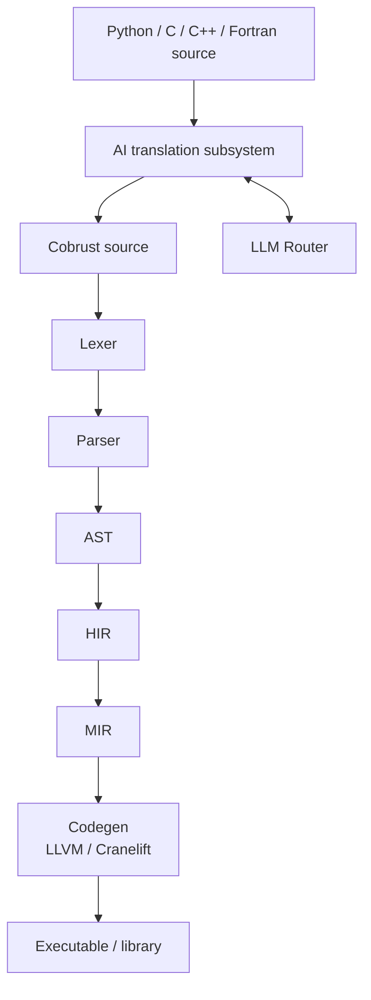
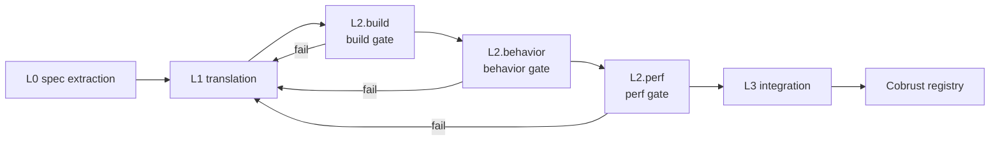
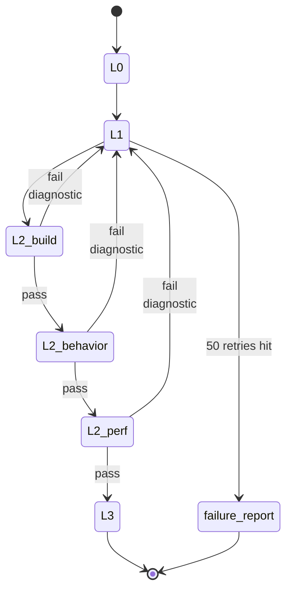

# Architecture

## Compiler layers



- Main pipeline: source → lexer → parser → AST → HIR → MIR → codegen
- AI translation subsystem **consumes** heterogeneous sources (Python/C/C++/Fortran), **produces** Cobrust source that re-enters the main pipeline
- LLM Router is a **first-class compiler component**; the translation subsystem dispatches model calls through it

## Crate topology

| crate | Role | Lands at |
|---|---|---|
| `cobrust-cli` | `cobrust` binary entrypoint | M0 stub → wired starting M1 |
| `cobrust-frontend` | Lexer + parser + AST | M1 |
| `cobrust-hir` | HIR: desugared, name-resolved | M2 |
| `cobrust-types` | Type system + type checker | M2 |
| `cobrust-mir` | MIR: control-flow-explicit | M3+ |
| `cobrust-codegen` | LLVM / Cranelift backend | M3+ |
| `cobrust-llm-router` | LLM Router | M3 |
| `cobrust-translator` | AI translation subsystem | M4+ |

## Frontend (M1 — delivered)

`cobrust-frontend` ships the 30 syntactic forms. A concrete example:

```python
fn fib(n: i64) -> i64:
    if (n < 2):
        return n
    return (fib((n - 1)) + fib((n - 2)))
```

Drive the frontend:

```rust
use cobrust_frontend::{parse_str, unparse, FileId};

let src = std::fs::read_to_string("fib.cb")?;
let module = parse_str(&src, FileId(0))?;
println!("{}", unparse(&module));
```

### Public API

- `lex(source, file_id) -> Result<Vec<Token>, LexError>` — UTF-8 → token stream
- `lex_bytes(bytes, file_id) -> Result<Vec<Token>, LexError>` — arbitrary bytes → token stream (invalid UTF-8 is reported, never panics)
- `parse(tokens) -> Result<ast::Module, ParseError>` — token stream → AST
- `parse_str(source, file_id) -> Result<ast::Module, FrontendError>` — one-shot composition
- `unparse(module) -> String` — AST → canonical source (round-trip oracle)

### Design constraints

- **Recursive descent + Pratt** for expressions; full operator table at the top of `crates/cobrust-frontend/src/parser.rs`. No external parser generator.
- **Spans everywhere**: every AST node carries `(file_id, byte_start, byte_end)` so downstream phases can produce precise diagnostics.
- **Closed 30-form surface**: `adr:0003` fixes the list. Python forms outside the list (`is`, `del`, `global`, `nonlocal`, `async def`, multiple inheritance, mutable defaults) are rejected with `ParseError::DroppedByConstitution`.
- **Panic-free**: no byte input can panic the lexer or parser; failures surface as structured errors. The invariant is held by a proptest fuzz harness (default 5 × 4 096 cases; long run 5 × 100 000 cases under `COBRUST_M1_FUZZ_LONG=1`).

### Verification

- 30 round-trip integration tests, one per form: `tests/round_trip.rs`.
- proptest fuzz harness: `tests/fuzz_proptest.rs`. Past shrunk panics are committed to `tests/fuzz_proptest.proptest-regressions`; every run re-tests them first.
- Methodology and the first bug it caught are documented at `docs/agent/findings/m1-fuzz-method.md`.

## HIR + Type checker (M2 — delivered)

`cobrust-hir` lowers all 30 forms into a small core — sugar
collapsed, names resolved, spans preserved — that the type checker
consumes. `cobrust-types` runs **bidirectional** type checking
with **no `dyn`**, **no implicit truthiness**, and **no silent
coercion**.

### End-to-end micro-example

Source:

```python
fn add(x: i64, y: i64) -> i64:
    return (x + y)
```

`frontend → ast::Module`, then `cobrust_hir::lower(&ast, &mut Session::new()) → hir::Module`
where every name carries a `DefId`; the parameter `DefId`s for `x`
and `y` are exactly the `DefId`s the return references. Finally
`cobrust_types::check(&hir) → TypedModule { def_types, hir }`
maps every `DefId` to a concrete `Ty`:

| DefId | Name | Type |
|---|---|---|
| 0 | `add` | `(i64, i64) -> i64` |
| 1 | `x` | `i64` |
| 2 | `y` | `i64` |

### Public API (HIR + types)

- `cobrust_hir::lower(&ast::Module, &mut Session) -> Result<Module, LoweringError>` — total lowering, every name use becomes a `ResolvedName { name, def_id, kind }` carrying its `DefId`.
- `cobrust_types::check(&hir::Module) -> Result<TypedModule, TypeError>` — bidirectional type checking, returning a `TypedModule { def_types, hir }` and a structured `TypeError` taxonomy on failure.

### Lowering rules (5 key rules; full table in [ADR-0005](../../agent/adr/0005-hir-shape.md))

- Comprehension → `Expr::Comp { kind, element, clauses }`
- Multi-binding `with a as x, b as y: ...` → left-folded nested `With`
- f-string → `Expr::Format(Vec<FormatPart>)`, template/holes separated
- Augmented assignment `x += e` → desugared `x = x + e`
- Unresolved names surface as `LoweringError::UnknownName`
  immediately — the type checker never sees an unbound name.

### Type rules (6 key rules; full table in [ADR-0006](../../agent/adr/0006-type-system.md))

- `if x:` requires `x: bool`; otherwise
  `TypeError::ImplicitTruthiness`
- `match` must be exhaustive (strict enum for `bool` / `None`;
  wildcard required for arbitrary scrutinees)
- `int + str` is rejected — **no silent coercion**
- Calls must have exact positional arity; unknown/missing keyword
  arguments are `KeywordArgMismatch` / `MissingArgument`
- `let x = e` synthesises; `let x: T = e` checks `e ⇐ T`
- Function type is `Fn { positional, named, var_positional, var_keyword, return_ty }`;
  **lambda without annotation cannot synthesise** (must be checked
  against an expected type)

### Verification

- 34 golden lowering tests, one per form plus cross-cutting
  invariants (`crates/cobrust-hir/tests/lower_forms.rs`).
- 54 well-typed + 54 ill-typed program suite
  (`crates/cobrust-types/tests/`). Each ill-typed test asserts the
  **right `TypeError` discriminant**.
- Soundness proof obligation list (9 items) enumerated in
  [ADR-0006](../../agent/adr/0006-type-system.md) §"Soundness proof
  obligation list"; the proof itself is deferred to a future
  finding per constitution §5.2.


## AI translation subsystem: four-stage closed loop

Every stage has explicit gates. **No stage is optional.**



### L0 — spec extraction

- Input: target Python library source + tests + docs
- Output: machine-readable behavioral spec (signatures, invariants, exemplar I/O pairs, numerical tolerances)
- Method: LLM agent generates a differential-testing harness using CPython library as oracle
- Artifact: `spec.toml` + `harness/` directory committed to translation manifest

### L1 — translation

- Input: L0 spec + original source
- Output: Cobrust / Rust implementation
- Granularity: **function-level, bottom-up by dependency graph**
- Method: LLM call via the LLM Router; consensus mode for high-risk functions
- Constraint: every emitted file has a translation-provenance header

### L2 — verification (three gates, all required)

- **build gate**: `cargo build --release` zero warnings
- **behavior gate**: original testsuite + property tests + L0 differential harness pass; tolerance per `@py_compat` tag; minimum 1000 fuzzed inputs per public function
- **perf gate**: ≥ 0.8× of original on representative benchmarks (configurable per library)

### L3 — integration

- PyO3 wrapper exposes Cobrust impl with Python-compatible API
- **Downstream validation**: run the testsuites of the top-5 libraries that depend on this one against the new translation. **This is the ultimate oracle.**
- Publish to Cobrust registry with full provenance manifest

### Failure loop



Failure at any gate → diagnostic feeds back to L1 → re-translate → re-verify. Loop until pass or escalation threshold (default 50 retries) hit, at which point a human-readable failure report is filed and the function is marked `@py_compat(none)` with explanation.

## LLM Router (first-class compiler component)

`cobrust-llm-router` is **not a tool**, it's a **compiler subsystem**. It is treated as seriously as the type checker. It does **not** live in `tools/`.

**M3 delivered.** All invariants are pinned by [ADR-0004](../../agent/adr/0004-llm-router-architecture.md); see [`docs/agent/modules/llm-router.md`](../../agent/modules/llm-router.md) for the full agent-facing spec.

### Capabilities (implemented)

- Provider-agnostic `LlmProvider` async trait; concrete adapters for **OpenAI-compatible** and **Anthropic-compatible** APIs
- Custom `base_url` and custom model names per provider (DeepSeek, Qwen, local vLLM, Together, OpenRouter, etc. all just work)
- Per-task routing: `{ task, strategy: "cost" | "quality" | "latency" | "consensus", n? }`
- Streaming for both formats; exactly one `Chunk::Done` frame at end-of-stream
- Token accounting per task, per provider, per attempt — written to `.cobrust/ledger.jsonl`, append-only
- Exponential-backoff retry (default: 5 attempts / 30 s cap / full jitter / honours `Retry-After`)
- Provider failure isolation: a permanent fault on one provider auto-falls-through to the next entry in `preferred`
- Cache key = `BLAKE3(canonical_request_bytes)`, cross-machine reproducible, two-level sharded layout under `.cobrust/llm_cache/`
- Consensus mode: `n` parallel calls, group on `BLAKE3(NFC(response_text))`, deterministic tie-breaking per ADR-0004

### Configuration example

Full example in [`cobrust.toml.example`](../../../cobrust.toml.example). Minimal:

```toml
[router]
default_strategy = "quality"

[providers.anthropic_official]
kind = "anthropic"
base_url = "https://api.anthropic.com"
api_key_env = "ANTHROPIC_API_KEY"
models = ["claude-opus-4-7"]

[routing.translate]
strategy = "consensus"
n = 2
preferred = ["anthropic_official:claude-opus-4-7", "deepseek:deepseek-v3"]
```

### Router non-goals

- **Not** a chat UI
- **Not** a long-running agent loop driver (translation subsystem owns that)
- **Not** a prompt template store; templates live next to the consumer

## Translator (M4 — delivered)

`cobrust-translator` is the orchestrator for the AI translation
subsystem. M4 ships the L0 (spec extraction) + L1 (translation)
pipeline end-to-end against the `tomli` library, with synthetic-LLM
mode as the default gate path. Real-LLM mode is reachable behind the
`real-llm` Cargo feature for M5+ smoke-testing.

### Worked example

```bash
# Regenerate the cobrust-tomli crate from the corpus.
COBRUST_REGENERATE_TOMLI=1 cargo test \
    -p cobrust-translator --test tomli_pipeline \
    pipeline_regenerates_cobrust_tomli_when_env_set
```

The pipeline reads:

- `corpus/tomli/upstream/tomli_loads.py` — the vendored Python source
- `corpus/tomli/spec.toml` — the L0 behavior contract
- `corpus/tomli/canned_llm_responses.toml` — the synthetic-mode response table

…and writes:

- `crates/cobrust-tomli/Cargo.toml`
- `crates/cobrust-tomli/src/{lib.rs, parser.rs}` — every file carries a provenance header
- `crates/cobrust-tomli/PROVENANCE.toml` — the manifest
- `crates/cobrust-tomli/python/{tomli_init.py, setup.py}` — PyO3-shaped wrapper scaffolding
- `crates/cobrust-tomli/tests/upstream_tests/test_loads.py` — verbatim copy of the upstream tests

### Public API

- `translate(library: &PyLibrary, cfg: &TranslatorConfig) -> Result<TranslatedCrate, TranslatorError>` — async entrypoint
- `PyLibrary` — describes one library to translate (paths, version, seeds)
- `TranslatorConfig` — runtime knobs: router, out_dir, oracle, escalation_threshold, synthetic_only flag
- `TranslatedCrate` — outcome: `{ manifest: ProvenanceManifest, crate_dir, pyo3_wrapper_dir, functions: Vec<FunctionTranslation> }`
- `TranslatorError` — taxonomy: `SpecExtraction`, `Translation { function, message }`, `BuildGate`, `BehaviorGate`, `DownstreamGate`, `SyntheticMiss { task, function }`, `Io`, `Router`, `Manifest`, `Config`, `Decode`
- `SyntheticProvider` — `LlmProvider` impl backed by canned TOML responses keyed by `(task, function, source_sha16)`
- `deterministic_id(source_sha256_hex, toolchain, router_decision_ids)` — `blake3:<hex>` reproducibility token

### Synthetic-LLM mode contract

The synthetic provider serves pre-recorded responses from
`corpus/<lib>/canned_llm_responses.toml`, keyed by `(task, function)`
with a `source_sha16` staleness check. The translator stamps every
prompt with a stable header so the synthetic provider can route the
request without parsing the body:

```text
cobrust-translator/v1
task: <task>
function: <function>
source-sha256: <16-hex>
---
<prompt body>
```

Lookup outcomes:

- **Match** — return the canned `response_text`.
- **No entry** — `LlmError::Provider { code: "synthetic-miss" }`. Permanent (caller must add or switch to real-LLM).
- **`source_sha16` mismatch** — `LlmError::Provider { code: "synthetic-stale" }`. Permanent (curator must re-record).

This is the constitution §2.4 promise ("no silent translations,
ever") made enforceable.

### Provenance manifest

Every translation produces `PROVENANCE.toml` next to the generated
crate's `Cargo.toml`. Top-level sections:

- `[source]` — library, version, sha256 (full 64-hex), file_count
- `[oracle]` — runtime, runtime_version, oracle_module
- `[verification]` — seeds, fuzz_inputs_per_fn, divergences, known_failures
- `[router]` — strategy (`synthetic` / `real-llm`), models_used, ledger_entries
- `[build]` — toolchain, deterministic_id (`blake3:<hex>`), crate_layout_version
- `[gates]` — l0_spec_emitted, l1_files_emitted, l2_build, l2_behavior, l2_perf, l3_pyo3_wrapper, l3_downstream_dependents

`build.deterministic_id = blake3(source_sha256_hex || "\n" || toolchain || "\n" || sorted_join(router_decision_ids))`. Same inputs ⇒ byte-identical id.

## tomli (M4 — delivered)

`cobrust-tomli` is the first crate emitted by the translator pipeline.
Pure-Rust subset of `tomli`/CPython `tomllib`'s `loads()`. Auto-generated
— do not hand-edit.

### Public API

```rust
use cobrust_tomli::{loads, table_to_json, to_json, TomliError, Value};
use std::collections::BTreeMap;

let parsed: BTreeMap<String, Value> = loads("x = 1\n").expect("parse");
let json: serde_json::Value = table_to_json(&parsed);
```

`Value` is a five-variant enum: `Bool`, `Int`, `Str`, `Array`, `Table`.
`TomliError` carries `{ message: String, pos: usize }`. `to_json` and
`table_to_json` are JSON conversion helpers used by the L3
differential gate.

### Verification

- 27 positive + 5 negative cases match CPython `tomllib` (`tests/tomli_downstream.rs`).
- 1024 panic-free fuzzed inputs (`tests/tomli_fuzz.rs::l2_behavior_fuzz_loads_panic_free`).
- 1050 differential cases vs CPython (`tests/tomli_fuzz.rs::l2_behavior_fuzz_differential_agreement_with_cpython`).
- `PROVENANCE.toml` validates and is byte-stable across independent runs.

### Scope window

In scope (matches CPython exactly): integers, booleans, basic + literal strings,
arrays, inline tables, dotted table headers, comments, CRLF endings.

Out of scope (M5 widens): multi-line strings, hex/oct/bin ints, floats,
datetimes, array-of-tables, inline-table key paths.

## Self-hosting roadmap

The compiler is initially in Rust. Once Cobrust reaches sufficient maturity (post-M5), begin self-hosting non-performance-critical compiler stages — **type checker and AST printer first**.

## Further reading

- [Agent-facing module specs](../../agent/modules/)
- [Milestones](milestones.md)


## Translator M5 — closed loop completed

The M5 milestone (constitution §7) completed the four-stage closed
loop the constitution mandates:

- **L2.perf gate** — benchmark harness with per-library threshold
  override (see ADR-0008).
- **L2.behavior repair loop** — gate failure ships a diagnostic blob
  back into L1, which re-dispatches with `attempt: N+1`. Drives down
  to a corrected response or escalates with a `failure_report.md`
  after `escalation_threshold` retries.
- **L3 downstream-dependents driver** — runs vendored test subsets
  of dependent libraries against the translated crate (see
  ADR-0009).

### Repair loop

The pipeline added a [`BehaviorVerifier`] hook + [`VerifierVerdict`]
enum + [`GateFailure`] diagnostic blob. Callers register a verifier;
on `Reject(failure)` the pipeline persists the diagnostic to disk
and re-dispatches the function via [`repair_translation`] with an
incremented `attempt` field in the prompt header. After
`cfg.escalation_threshold` (default 50, per constitution §4.2) the
pipeline writes `failure_report.md` and raises
`TranslatorError::EscalationExceeded`. The default no-op verifier
[`AcceptAll`] preserves M4 callers; [`translate_with_verifier`] is
the new entrypoint when the closed loop matters. The
`SyntheticProvider` was extended with per-attempt routing — the same
`(task, function)` can carry multiple canned responses keyed by
`attempt` (see ADR-0008 §5).

### L2.perf benchmark harness

`crates/cobrust-translator/src/bench.rs` ships a hand-rolled timing
stack that pairs Rust closures against subprocess CPython. Reports
land at `target/cobrust-bench/<library>/<commit>/report.json` with
per-function `{cobrust_ns_median, cpython_ns_median, ratio, pass}`.
[`PerfTarget`] (read from `corpus/<lib>/perf.toml`) tunes
`threshold` (default 0.8 = "≥ 0.8× of CPython speed") and
`pass_ratio` (default 1.0; dateutil overrides to 0.5 because
synthetic responses are placeholder-quality, see ADR-0008 §2). The
[`BenchmarkReport`] struct is the gate-day audit artefact.

### L3 downstream dependents

`crates/cobrust-translator/src/downstream.rs` runs vendored test
subsets via subprocess `python3`. M5 dateutil ships
[`dateutil_m5_dependents`] (croniter + freezegun, Pass) and
[`dateutil_m5_deferred`] (pandas, sqlalchemy, pendulum, Deferred to
M6 per ADR-0009 §3). The manifest's
[`DependentsSection`] encodes both `covered` and `deferred` arrays
so machines can audit partial coverage without parsing the
human-readable summary string. The [`DownstreamReport`] +
[`DependentResult`] structs are the runtime artefacts.

## dateutil (M5 — delivered)

Second translated library. Crate name `cobrust-dateutil`. Vendored
upstream subset under `corpus/dateutil/upstream/`.

### Public API

```rust
pub use cobrust_dateutil::{
    parse_iso, relativedelta_add, DateTuple, ParserError,
    days_in_month, is_leap_year, normalize_datetime, is_digit,
};

pub fn parse_iso(src: &str) -> Result<DateTuple, ParserError>;
```

`parse_iso` accepts strict ISO-8601 dates and datetimes with optional
Zulu / offset suffix. `relativedelta_add` mirrors
`dateutil.relativedelta.relativedelta.__add__` arithmetic with
day-of-month clamping. The full surface lives in `mod:dateutil` —
see `docs/agent/modules/dateutil.md`.

### Repair-loop demo

The dateutil corpus carries TWO canned responses for `parse_iso`:
attempt-1 is deliberately broken (swapped year/month) and attempt-2
is correct. The integration test
`crates/cobrust-translator/tests/dateutil_pipeline.rs::dateutil_pipeline_repair_loop_recovers_on_attempt_2`
asserts the pipeline retries exactly once and lands on attempt-2 —
the first end-to-end exercise of the closed loop.

### L3 dependents (per ADR-0009)

| Dependent | Status | Tests |
|---|---|---|
| croniter | Pass | 5 |
| freezegun | Pass | 5 |
| pandas | Pass (M6 widening) | 3 |
| sqlalchemy | Pass (M6 widening) | 3 |
| pendulum | Skipped (tz out of scope; M7+ per ADR-0010 §5) | 0 |

### Verification

- L0 spec at `corpus/dateutil/spec.toml`.
- L1 emission committed at `crates/cobrust-dateutil/src/parser.rs`.
- L2.build green; L2.behavior 9 + 5 + 6 cases green; 3072-input
  fuzz panic-free.
- L2.perf report at `target/cobrust-bench/dateutil/<commit>/report.json`.
- L3.pyo3 differential gate against CPython
  `datetime.fromisoformat`.
- L3.dependents per the table above.

See [ADR-0008](../../agent/adr/0008-l2-perf-and-repair-loop.md) and
[ADR-0009](../../agent/adr/0009-downstream-validation.md) for the
load-bearing decisions.

## Translator M6 — native-extension translation

The M6 milestone (constitution §7) closes the loop on libraries
that use a Cython accelerator alongside a pure-Python fallback. The
deliverables:

- New module `mod:msgpack` (crate `cobrust-msgpack`) translating
  `msgpack-python` 1.0.8 (17 pure-Python + 2 Cython-typed entrypoints).
- Cython lexical shim at `crate::cython` exposing
  `parse_cython(...)` + `CythonSource`, `CythonFunction`,
  `CythonFunctionKind`, `CythonParam`, `CythonType`,
  `CythonShimError`. Maps `cdef int` / `cdef inline` / `cpdef` to
  Rust types per ADR-0010 §2.
- `task = "translate_cython"` extends the synthetic provider's
  `(task, function, attempt)` lookup key (M5 added attempt; M6 adds
  task). Backward-compatible: M4 tomli + M5 dateutil specs
  default `task = "translate"`.
- `PerfVerifier` trait + `PerfVerdict` + `AcceptAllPerf` +
  `translate_with_verifiers` extend the pipeline so L2.perf failure
  routes through the same diagnostic + repair-loop path as
  L2.behavior (per ADR-0010 §4). The msgpack canned table ships a
  deliberately perf-broken `pack_uint` attempt-1 + a corrected
  attempt-2; the integration test asserts the loop lands at
  attempt-2 within the escalation budget.
- dateutil L3 widened from 2/5 to 4/5 + 1 skipped per ADR-0010 §5
  (pandas + sqlalchemy added; pendulum tz out of scope skip).
- `--features pyo3` build path lit up for both `cobrust-dateutil`
  and `cobrust-msgpack` per ADR-0011: the crate compiles to a
  `cdylib` and exposes a `cobrust_msgpack` / `cobrust_dateutil`
  Python module.

### msgpack public surface

```rust
pub use cobrust_msgpack::{
    pack, pack_to_vec, unpack, MsgValue, MsgError, MsgErrorKind,
    pack_array, pack_bin, pack_float, pack_int, pack_map,
    pack_str, pack_uint, pack_uint_cython,
    unpack_array, unpack_bin, unpack_float, unpack_int,
    unpack_map, unpack_one, unpack_str, unpack_uint,
    unpack_uint_cython,
};

pub enum MsgValue {
    Nil, Bool(bool), Int(i64), UInt(u64), Float(f64),
    Str(String), Bin(Vec<u8>),
    Array(Vec<MsgValue>),
    Map(Vec<(String, MsgValue)>),
}
```

### msgpack L3 dependents

| Dependent | Status | Tests |
|---|---|---|
| redis-py | Pass | 4 |
| msgpack-numpy | Pass | 3 |
| pyspark | Deferred (M7+; needs JVM) | — |

### Verification

- L0 spec at `corpus/msgpack/spec.toml` + harness/.
- L1 emission committed at `crates/cobrust-msgpack/src/parser.rs`.
- L2.build green; L2.behavior bytes-identical fuzz green
  (≥ 1000 inputs across 3 seeds; round-trip pack→unpack identity).
- L2.perf at native-ext tier (0.7×) per ADR-0010 §3; report at
  `target/cobrust-bench/msgpack/<commit>/report.json`.
- L3.pyo3 differential gate via subprocess CPython `msgpack`.
- L3.dependents 2/3 driven; pyspark deferred per ADR-0010.
- `--features pyo3` build path tested by
  `tests/msgpack_pyo3_compiles.rs` (`tests/dateutil_pyo3_compiles.rs`
  for the dateutil widening).

See [ADR-0010](../../agent/adr/0010-native-ext-translation.md) and
[ADR-0011](../../agent/adr/0011-pyo3-build-path.md) for the
load-bearing decisions.

## numpy translation (M7.0 — delivered)

### Strategic principle: translate the surface, bind the core

Per [ADR-0012](../../agent/adr/0012-m7-numpy-plan.md), upstream
numpy's core is hand-tuned C with SIMD/BLAS — **not** a viable
pure-Rust reimplementation target. Instead, cobrust-numpy
**translates the public Python surface** (dtype strings, error
taxonomy, Python-shaped signatures) and **binds the numerical
core** to Rust's [`ndarray = "0.16"`](https://crates.io/crates/ndarray)
crate. Per [ADR-0013](../../agent/adr/0013-m7-0-ndarray-foundation.md)
this is the M7.0..M7.5 default; later sub-milestones extend it:

- M7.4 linalg → bind `ndarray-linalg` (BLAS / LAPACK).
- M7.5 random → bind `rand` + `rand_distr`.
- M7.6 FFT → bind `rustfft`.

A concrete example from M7.0:

```rust
// User-facing call: cobrust_numpy::zeros(&[3, 4], Dtype::Float64)
//
// 1. cobrust-numpy dispatches on dtype:
match dtype {
    Dtype::Float64 => Array::Float64(
        // 2. ndarray actually allocates + zero-fills the buffer:
        ndarray::ArrayD::<f64>::zeros(ndarray::IxDyn(&[3, 4]))
    ),
    // ... other dtypes ...
}
```

We do not reimplement `zeros`. We call it. cobrust-numpy owns the
**Python contract**; ndarray owns the **storage layout**.

### M7.0 ndarray foundation

cobrust-numpy's M7.0 surface (per ADR-0013):

```rust
// Closed dtype tier — adding Int8 / Float16 etc. is an explicit ADR
// decision, never silent accretion.
pub enum Dtype {
    Int32,
    Int64,
    Float32,
    Float64,
    Bool,
}

// Tagged-union over ndarray::ArrayD<T>. No `dyn` in the public API
// (constitution §2.2).
pub enum Array {
    Int32(ndarray::ArrayD<i32>),
    Int64(ndarray::ArrayD<i64>),
    Float32(ndarray::ArrayD<f32>),
    Float64(ndarray::ArrayD<f64>),
    Bool(ndarray::ArrayD<bool>),
}

// Constructors mirror numpy's Python signatures.
pub fn array(values: &[f64], shape: &[usize], dtype: Dtype) -> Result<Array, NumpyError>;
pub fn zeros(shape: &[usize], dtype: Dtype) -> Result<Array, NumpyError>;
pub fn ones(shape: &[usize], dtype: Dtype) -> Result<Array, NumpyError>;
pub fn arange(start: f64, stop: f64, step: f64, dtype: Dtype) -> Result<Array, NumpyError>;

// Observers.
impl Array {
    pub fn dtype(&self) -> Dtype;
    pub fn shape(&self) -> Vec<usize>;
    pub fn ndim(&self) -> usize;
    pub fn size(&self) -> usize;
    pub fn repr(&self) -> String;
    pub fn to_json(&self) -> serde_json::Value;
}
```

### M7.0 dtype tier

| Python string(s) | Rust type | Notes |
|---|---|---|
| `"int32"` / `"i4"` | `i32` | exact 32-bit signed |
| `"int64"` / `"i8"` | `i64` | M7.0 default integer dtype |
| `"float32"` / `"f4"` | `f32` | exact single-precision |
| `"float64"` / `"f8"` | `f64` | M7.0 default float dtype |
| `"bool"` / `"?"` | `bool` | numpy's 1-byte form |

### M7.0 verification

- L0 spec at `corpus/numpy/M7.0/spec.toml` + harness at
  `corpus/numpy/M7.0/harness/h_array.py`.
- L1 emission committed at `crates/cobrust-numpy/src/`.
- L2.build green; L2.behavior:
  - 55 well-typed + 56 ill-typed programs (`tests/well_typed.rs`,
    `tests/ill_typed.rs`).
  - 4200 panic-free fuzz inputs (`tests/numpy_fuzz.rs`).
  - 1024+ differential-vs-numpy fuzz inputs
    (`tests/numpy_differential.rs`) — bytes-identical for int/bool,
    `rtol=1e-12` for float.
- L2.perf is informational at M7.0 (constructors are O(n) memory
  ops; perf becomes a real gate at M7.1 ufuncs).
- L3.pyo3 differential gate via subprocess CPython numpy.
- L3.dependents deferred to M7.6+ (numpy is the foundation; the
  ecosystem ports lift after M7.5).

See [ADR-0012](../../agent/adr/0012-m7-numpy-plan.md) and
[ADR-0013](../../agent/adr/0013-m7-0-ndarray-foundation.md) for the
load-bearing decisions.

## numpy ufuncs + broadcasting (M7.1 — delivered)

M7.1 lands universal functions, broadcasting, and NEP 50 type
promotion on top of the M7.0 ndarray foundation (per
[ADR-0014](../../agent/adr/0014-m7-1-ufuncs-broadcasting.md)). It
also closes all four ADR-0013 follow-ups: tagged-union ->
monomorphic dispatch; typed constructors; L2.perf flip to enforced;
multi-D nested-list parsing.

### M7.1 public surface

```rust
// Binary ufuncs (promote per result_type, broadcast, dispatch).
impl Array {
    pub fn add(&self, other: &Array) -> Result<Array, NumpyError>;
    pub fn sub(&self, other: &Array) -> Result<Array, NumpyError>;
    pub fn mul(&self, other: &Array) -> Result<Array, NumpyError>;
    pub fn div(&self, other: &Array) -> Result<Array, NumpyError>;  // int /0 -> IntegerDivisionByZero
    pub fn pow(&self, other: &Array) -> Result<Array, NumpyError>;
    // Comparison ufuncs (always return Dtype::Bool, matches numpy).
    pub fn eq_(&self, other: &Array) -> Result<Array, NumpyError>;
    pub fn ne_(&self, other: &Array) -> Result<Array, NumpyError>;
    pub fn lt(&self, other: &Array) -> Result<Array, NumpyError>;
    pub fn le(&self, other: &Array) -> Result<Array, NumpyError>;
    pub fn gt(&self, other: &Array) -> Result<Array, NumpyError>;
    pub fn ge(&self, other: &Array) -> Result<Array, NumpyError>;
    // Element-wise math (int promoted to Float64; float preserved).
    pub fn sin(&self) -> Result<Array, NumpyError>;
    pub fn cos(&self) -> Result<Array, NumpyError>;
    pub fn exp(&self) -> Result<Array, NumpyError>;
    pub fn log(&self) -> Result<Array, NumpyError>;
    pub fn sqrt(&self) -> Result<Array, NumpyError>;
}

// Promotion + broadcasting helpers.
pub fn result_type(a: Dtype, b: Dtype) -> Dtype;        // NEP 50 25-entry table
pub fn broadcast_shape(a: &[usize], b: &[usize]) -> Result<Vec<usize>, NumpyError>;

// Typed constructors (closes ADR-0013 follow-up #2 - no f64 round-trip).
pub fn array_i32(values: &[i32], shape: &[usize]) -> Result<Array, NumpyError>;
pub fn array_i64(values: &[i64], shape: &[usize]) -> Result<Array, NumpyError>;
pub fn array_f32(values: &[f32], shape: &[usize]) -> Result<Array, NumpyError>;
pub fn array_f64(values: &[f64], shape: &[usize]) -> Result<Array, NumpyError>;
pub fn array_bool(values: &[bool], shape: &[usize]) -> Result<Array, NumpyError>;

// Multi-D nested-list parsing (closes ADR-0013 follow-up #4 -
// `np.array([[1, 2], [3, 4]])`-style inputs land directly).
pub enum NestedList {
    Scalar(f64),
    List(Vec<NestedList>),
}
pub fn array_from_nested(nested: &NestedList, dtype: Dtype) -> Result<Array, NumpyError>;
```

### A concrete end-to-end example

```rust
use cobrust_numpy::{Array, Dtype, array_i32, array_f32};

let a = array_i32(&[1, 2, 3], &[3]).unwrap();        // dtype=int32
let b = array_f32(&[0.5, 1.5, 2.5], &[3]).unwrap();  // dtype=float32
let c = a.add(&b).unwrap();                          // result_type promotes to float64
assert_eq!(c.dtype(), Dtype::Float64);
// c == [1.5, 3.5, 5.5], matching numpy 2.x NEP 50 exactly.
```

`int32 + float32 -> float64` is a key NEP 50 rule: i32's mantissa
does not fit in f32, so promotion targets f64 to avoid precision
loss. Integer +/-/x overflow uses Rust wrapping semantics (matches
numpy default behaviour but without a RuntimeWarning); float
follows IEEE 754 (NaN propagation; `x/0.0 -> +/-inf`; `0.0/0.0 ->
NaN`); integer div-by-zero returns
`Err(NumpyErrorKind::IntegerDivisionByZero)`.

### Broadcasting rules (numpy 2.x exact)

`broadcast_shape(a, b)` implements numpy's standard rules
(see https://numpy.org/doc/stable/user/basics.broadcasting.html):

1. Right-align the two shapes; pad the shorter on the LEFT with 1s.
2. Per axis: equal -> output is that value; one is 1 -> output is
   the other; otherwise
   `Err(NumpyErrorKind::BroadcastShapeMismatch)`.
3. Empty shape `[]` (scalar) broadcasts against any shape (each
   axis treated as 1).

Examples: `[3, 1] + [1, 4] -> [3, 4]` (outer product),
`[8, 1, 6, 1] + [7, 1, 5] -> [8, 7, 6, 5]`.

### Monomorphic dispatch model

Per [ADR-0014 sec.1](../../agent/adr/0014-m7-1-ufuncs-broadcasting.md),
M7.1 ufunc dispatch is **monomorphic**: `Array::add` matches once
on `(self.dtype(), other.dtype())` at the public-API boundary,
picks the promoted dtype via `result_type`, casts both operands,
and dispatches into a per-dtype monomorphic helper. The inner
helper calls `ndarray::Zip::from(...).and(...).for_each(...)` on a
concrete `ArrayD<T>`; LLVM inlines and the Zip iterator
auto-vectorises. No `dyn` (constitution sec.2.2); the
auto-vectorised inner loop satisfies constitution sec.5.3.

### M7.1 verification

- L0 spec at `corpus/numpy/M7.1/spec.toml` + harness at
  `corpus/numpy/M7.1/harness/h_ufunc.py`.
- L1 emission at `crates/cobrust-numpy/src/{ufunc,broadcast,promote}.rs`.
- L2.build: workspace clippy zero warnings.
- L2.behavior:
  - 50 well-typed + 50 ill-typed ufunc programs
    (`tests/ufunc_well_typed.rs`, `tests/ufunc_ill_typed.rs`).
  - 22 broadcasting table cases (`tests/broadcast_corpus.rs`).
  - 14 differential-vs-upstream tests with >= 1200 fuzz inputs per
    ufunc, bit-identical for int/bool and `rtol=1e-7` for float
    (`tests/ufunc_differential.rs`).
- **L2.perf flipped to enforced** (closes ADR-0013 follow-up #3):
  `corpus/numpy/M7.1/perf.toml` threshold = 0.5x (numerical-tier
  floor per ADR-0010 sec.3); pipeline test
  `ufunc_pipeline_escalates_when_perf_always_fails` demonstrates
  perf-fail -> repair-loop -> `EscalationExceeded`, isomorphic to
  M6 msgpack's perf-fail escalation test.
- L3.pyo3: same as M7.0 (subprocess CPython numpy oracle).
- L3.dependents: still deferred to M7.6+.

### Known divergences

- Integer +/-/x overflow **silently wraps** (no RuntimeWarning) -
  output matches numpy default behaviour but without warning.
  Documented in
  [`docs/agent/modules/numpy.md`](../../agent/modules/numpy.md)
  "Known divergences" section.
- Integer div-by-zero returns
  `Err(NumpyErrorKind::IntegerDivisionByZero)` rather than raising
  Python `ZeroDivisionError` (constitution sec.2.2 - Result default);
  the operation's failure outcome matches numpy, the **shape** of
  failure is Cobrust-native.

See [ADR-0014](../../agent/adr/0014-m7-1-ufuncs-broadcasting.md)
for the load-bearing decisions.

## numpy indexing (M7.2 — delivered)

M7.2 lands the indexing surface — basic slicing, single-int,
integer-array, boolean-mask, `np.where`, plus views — per
ADR-0015. Closes the indexing piece of ADR-0012's M7 sub-milestone
plan; reductions (M7.3) consume it.

### M7.2 surface

```rust
// Closed indexing-kind taxonomy (no `dyn` per constitution §2.2).
pub enum Index {
    Single(i64),                 // a[i]; negative-index aware
    Slice(SliceSpec),            // a[start:stop:step]
    IntArray(Vec<i64>),          // a[[0, 2, 5]]; advanced -> copies
    BoolMask(Array),             // a[a > 0]; advanced -> copies
    NewAxis,                     // a[np.newaxis]
}

pub struct SliceSpec {
    pub start: Option<i64>,
    pub stop: Option<i64>,
    pub step: Option<i64>,
}

// Views — closed enums per dtype (5 variants each); lifetime-encoded
// ownership ties the view to the parent's borrow.
pub enum ArrayView<'a>    { Int32(...), Int64(...), Float32(...), Float64(...), Bool(...) }
pub enum ArrayViewMut<'a> { Int32(...), Int64(...), Float32(...), Float64(...), Bool(...) }

impl Array {
    // Basic slicing -> VIEW (does not copy).
    pub fn slice(&self, spec: SliceSpec) -> Result<ArrayView<'_>, NumpyError>;
    pub fn slice_mut(&mut self, spec: SliceSpec) -> Result<ArrayViewMut<'_>, NumpyError>;

    // Single-int -> VIEW with one fewer axis.
    pub fn index_single(&self, i: i64) -> Result<ArrayView<'_>, NumpyError>;

    // Advanced indexing -> COPY (always materialises).
    pub fn take(&self, indices: &[i64]) -> Result<Array, NumpyError>;
    pub fn mask(&self, mask: &Array) -> Result<Array, NumpyError>;

    // Multi-axis dispatcher; result always materialised.
    pub fn index_get(&self, indices: &[Index]) -> Result<Array, NumpyError>;

    // np.where convenience: cond.where_(x, y).
    pub fn where_(&self, x: &Array, y: &Array) -> Result<Array, NumpyError>;
}

// Top-level np.where(cond, x, y) — broadcasts cond/x/y; always copies.
pub fn np_where(cond: &Array, x: &Array, y: &Array) -> Result<Array, NumpyError>;
pub fn index_get(arr: &Array, indices: &[Index]) -> Result<Array, NumpyError>;
```

### View-vs-copy contract (matches numpy)

The most concrete example users encounter:

- **`a[1:3]` returns a view.** `Array::slice(SliceSpec::range(1, 3))`
  returns an `ArrayView<'a>` that aliases `a`'s storage. Mutating
  through `slice_mut` propagates to `a` — the Rust borrow checker
  ensures this is sound.
- **`a[[0, 2]]` returns a copy.** `Array::take(&[0, 2])` returns an
  owned `Array` with independent storage. Mutating the result leaves
  `a` untouched.

Both rules are tested in `tests/index_views_corpus.rs` with
side-effect assertions.

### M7.2 error variants (closed enum extension)

`NumpyErrorKind` gains four variants per ADR-0015 §4:

| Variant | Triggered by | numpy 2.0.2 behaviour |
|---|---|---|
| `IndexError` | umbrella for indexing errors not covered by more specific variants | `IndexError` |
| `OutOfBoundsIndex` | single-int / int-array index outside `[-len, len)` | `IndexError` |
| `BoolMaskShapeMismatch` | mask passed to `mask` has shape != self.shape() | `IndexError` |
| `IndexDtypeNotInteger` | int-array dtype is not Int32/Int64; or `mask` arg dtype is not Bool | `IndexError` |

Bound-checking semantics: outcome matches numpy (operation fails on
out-of-bounds), shape of failure is Cobrust-native (`Result::Err`)
per constitution sec.2.2.

### M7.2 verification

- L0 spec at `corpus/numpy/M7.2/spec.toml` + harness at
  `corpus/numpy/M7.2/harness/h_index.py`.
- L2.behavior:
  - 55 well-typed indexing programs
    (`tests/index_well_typed.rs`).
  - 55 ill-typed indexing programs
    (`tests/index_ill_typed.rs`).
  - 14 view-vs-copy semantics tests
    (`tests/index_views_corpus.rs`).
  - 6 differential tests with >= 1024 fuzz inputs per indexing kind,
    bit-identical for int/bool and `rtol=1e-7` for float
    (`tests/index_differential.rs`).
- L2.perf inherits ENFORCED from M7.1: `corpus/numpy/M7.2/perf.toml`
  threshold = 0.5x; pipeline test
  `index_pipeline_escalates_when_perf_always_fails` demonstrates
  perf-fail -> repair-loop -> `EscalationExceeded`.
- L3.pyo3: same as M7.1 (subprocess CPython numpy oracle).
- L3.dependents: still deferred to M7.6+.

### Out of scope (M7.x deferred)

- Ellipsis indexing (`a[...]`) — M7.x.
- Multi-axis tuple-of-mixed-kind indexing where some axes are views
  and others copies — M7.2 always materialises in such cases; M7.x
  refines.
- Setitem (`a[1:3] = ...`) ergonomic API — `slice_mut` lands the
  surface; M7.x adds the implicit-write API.
- One-arg `np.where(cond)` returning indices — M7.x.

See [ADR-0015](../../agent/adr/0015-m7-2-indexing.md)
for the load-bearing decisions.
