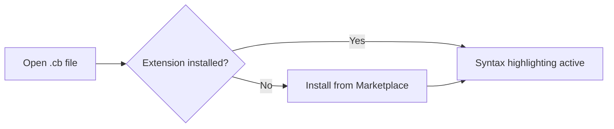

# Editor Setup — Cobrust Syntax Highlighting

## VSCode

1. Install the extension from the marketplace: search **"Cobrust Language Support"**, click **Install**.
   - Or via CLI: `code --install-extension cobrust-language-support-0.1.0.vsix`
2. Open any `.cb` file — highlighting activates automatically.
3. Comment toggle: `Ctrl+/` (Windows/Linux) or `Cmd+/` (macOS).
4. Bracket matching and auto-closing are enabled out of the box.



## Vim / Neovim

### Using vim-plug

```vim
" Add to ~/.vimrc or ~/.config/nvim/init.vim
Plug 'cobrust-lang/vim-cobrust'
```

Run `:PlugInstall`, then re-open any `.cb` file.

### Manual install

```bash
# Vim
mkdir -p ~/.vim/pack/cobrust/start/vim-cobrust
cp -r tools/vim-cobrust/syntax   ~/.vim/pack/cobrust/start/vim-cobrust/
cp -r tools/vim-cobrust/ftdetect ~/.vim/pack/cobrust/start/vim-cobrust/

# Neovim
mkdir -p ~/.local/share/nvim/site/pack/cobrust/start/vim-cobrust
cp -r tools/vim-cobrust/syntax   ~/.local/share/nvim/site/pack/cobrust/start/vim-cobrust/
cp -r tools/vim-cobrust/ftdetect ~/.local/share/nvim/site/pack/cobrust/start/vim-cobrust/
```

Verify: `vim -c 'syntax on' examples/fizzbuzz.cb`

## Helix

Helix uses Tree-sitter grammars. A Cobrust grammar is planned for a future
milestone. In the meantime, use the TextMate fallback:

1. Copy `tools/textmate-cobrust.tmbundle/Syntaxes/cobrust.tmLanguage` into
   your Helix config directory.
2. Add a file-type association in `~/.config/helix/languages.toml`:

```toml
[[language]]
name = "cobrust"
scope = "source.cobrust"
file-types = ["cb"]
comment-token = "#"
indent = { tab-width = 4, unit = "    " }
```

> **Note**: Full Helix Tree-sitter support is tracked in milestone F.1.8
> (language server). The TextMate path gives syntax coloring only.

## TextMate / Sublime Text

1. Double-click `tools/textmate-cobrust.tmbundle` — TextMate installs it automatically.
2. For Sublime Text: copy the bundle into `Packages/User/` and restart.

## Language Server (LSP, wave-1: diagnostics)

Cobrust ships a Language Server Protocol (LSP) implementation, `cobrust-lsp`,
that surfaces compiler errors directly in your editor as you type.

**Wave-1 scope (per ADR-0057a):**

- `textDocument/publishDiagnostics` — every `TypeError` / `MirError` /
  `LoweringError` from the Cobrust compile pipeline (parse + lower +
  type-check) is published as an LSP `Diagnostic` with:
  - the canonical error message from `cobrust check`,
  - a structured `code` (e.g. `"implicit-truthiness"`) for editor-side
    code-action routing,
  - the ADR-0052b `suggestion` field (when set) attached as
    `relatedInformation[0].message` — the fix path the agent-LLM
    consumes.

**Wave-2+ (deferred):** hover, completion, definition, rename, codeAction.
See ADR-0057 for the roster.

### Build and run

```bash
# From the repo root
cargo build --release -p cobrust-lsp
# The binary lands at target/release/cobrust-lsp
```

### VSCode / Cursor wiring

Add a minimal client in your `~/.vscode/extensions/<your-ext>/extension.js`
that launches `cobrust-lsp` over stdio for `.cb` files:

```javascript
const { LanguageClient } = require('vscode-languageclient/node');
const serverOptions = { command: '/path/to/cobrust-lsp' };
const clientOptions = {
  documentSelector: [{ scheme: 'file', language: 'cobrust' }],
};
new LanguageClient('cobrust', 'Cobrust LSP', serverOptions, clientOptions).start();
```

### Neovim wiring (nvim-lspconfig)

```lua
local lspconfig = require('lspconfig')
local configs = require('lspconfig.configs')
configs.cobrust = {
  default_config = {
    cmd = { '/path/to/cobrust-lsp' },
    filetypes = { 'cobrust' },
    root_dir = lspconfig.util.root_pattern('cobrust.toml', '.git'),
  },
}
lspconfig.cobrust.setup{}
```

## What is NOT included

- Wave-1 LSP only ships diagnostics. Go-to-definition, completion, hover,
  rename, and code-action quickfixes are scoped under ADR-0057b/c/d.
- Formatter integration — see the `cobrust fmt` CLI tool.
