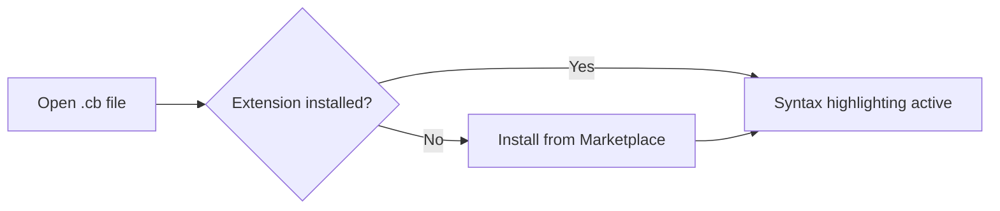

# Editor Setup — Cobrust Syntax Highlighting

## VSCode

1. Install the extension from the marketplace: search **"Cobrust Language Support"**, click **Install**.
   - Or via CLI: `code --install-extension cobrust-language-support-0.1.0.vsix`
2. Open any `.cb` file — highlighting activates automatically.
3. Comment toggle: `Ctrl+/` (Windows/Linux) or `Cmd+/` (macOS).
4. Bracket matching and auto-closing are enabled out of the box.



## Vim / Neovim

### Using vim-plug

```vim
" Add to ~/.vimrc or ~/.config/nvim/init.vim
Plug 'cobrust-lang/vim-cobrust'
```

Run `:PlugInstall`, then re-open any `.cb` file.

### Manual install

```bash
# Vim
mkdir -p ~/.vim/pack/cobrust/start/vim-cobrust
cp -r tools/vim-cobrust/syntax   ~/.vim/pack/cobrust/start/vim-cobrust/
cp -r tools/vim-cobrust/ftdetect ~/.vim/pack/cobrust/start/vim-cobrust/

# Neovim
mkdir -p ~/.local/share/nvim/site/pack/cobrust/start/vim-cobrust
cp -r tools/vim-cobrust/syntax   ~/.local/share/nvim/site/pack/cobrust/start/vim-cobrust/
cp -r tools/vim-cobrust/ftdetect ~/.local/share/nvim/site/pack/cobrust/start/vim-cobrust/
```

Verify: `vim -c 'syntax on' examples/fizzbuzz.cb`

## Helix

Helix uses Tree-sitter grammars. A Cobrust grammar is planned for a future
milestone. In the meantime, use the TextMate fallback:

1. Copy `tools/textmate-cobrust.tmbundle/Syntaxes/cobrust.tmLanguage` into
   your Helix config directory.
2. Add a file-type association in `~/.config/helix/languages.toml`:

```toml
[[language]]
name = "cobrust"
scope = "source.cobrust"
file-types = ["cb"]
comment-token = "#"
indent = { tab-width = 4, unit = "    " }
```

> **Note**: Full Helix Tree-sitter support is tracked in milestone F.1.8
> (language server). The TextMate path gives syntax coloring only.

## TextMate / Sublime Text

1. Double-click `tools/textmate-cobrust.tmbundle` — TextMate installs it automatically.
2. For Sublime Text: copy the bundle into `Packages/User/` and restart.

## What is NOT included

- Go-to-definition, type checking, completions, diagnostics — see **F.1.8** (LSP).
- Formatter integration — see the `cobrust fmt` CLI tool.
