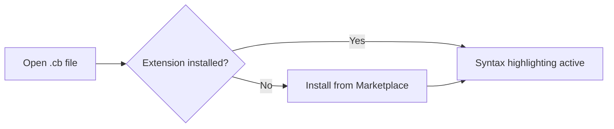
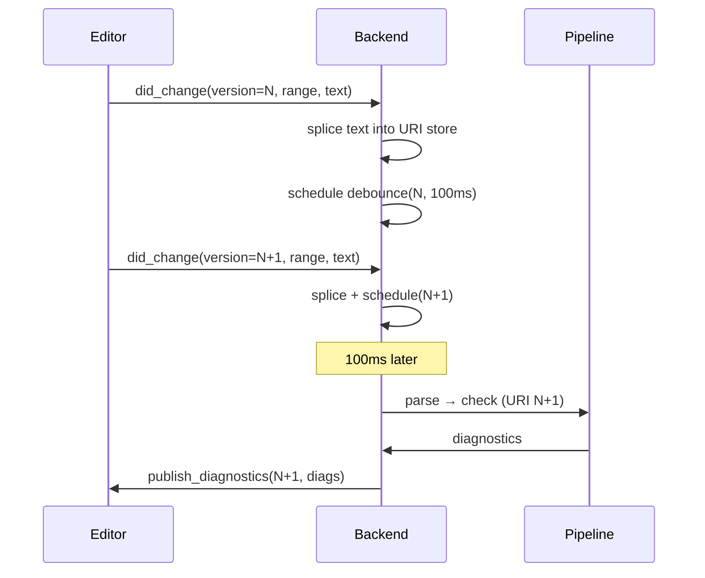
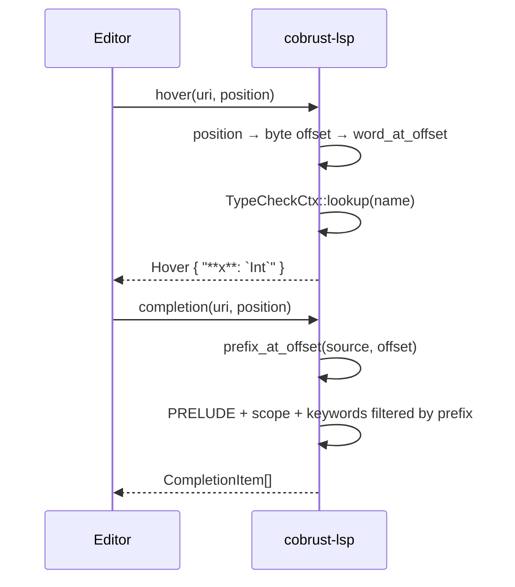
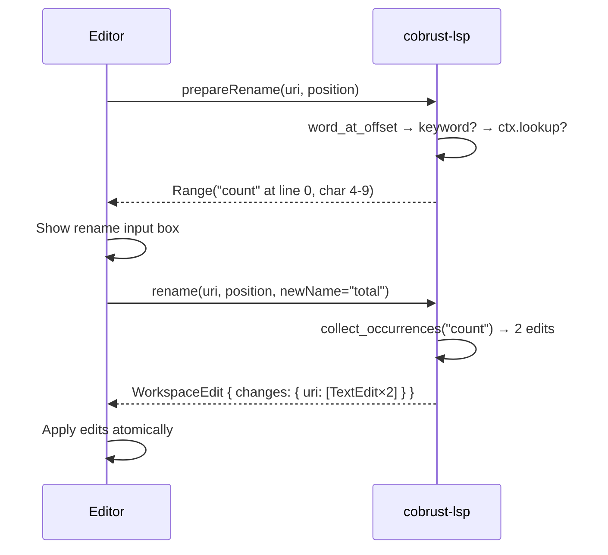

# Editor Setup — Cobrust Syntax Highlighting

## VSCode

1. Install the extension from the marketplace: search **"Cobrust Language Support"**, click **Install**.
   - Or via CLI: `code --install-extension cobrust-language-support-0.1.0.vsix`
2. Open any `.cb` file — highlighting activates automatically.
3. Comment toggle: `Ctrl+/` (Windows/Linux) or `Cmd+/` (macOS).
4. Bracket matching and auto-closing are enabled out of the box.



## Vim / Neovim

### Using vim-plug

```vim
" Add to ~/.vimrc or ~/.config/nvim/init.vim
Plug 'cobrust-lang/vim-cobrust'
```

Run `:PlugInstall`, then re-open any `.cb` file.

### Manual install

```bash
# Vim
mkdir -p ~/.vim/pack/cobrust/start/vim-cobrust
cp -r tools/vim-cobrust/syntax   ~/.vim/pack/cobrust/start/vim-cobrust/
cp -r tools/vim-cobrust/ftdetect ~/.vim/pack/cobrust/start/vim-cobrust/

# Neovim
mkdir -p ~/.local/share/nvim/site/pack/cobrust/start/vim-cobrust
cp -r tools/vim-cobrust/syntax   ~/.local/share/nvim/site/pack/cobrust/start/vim-cobrust/
cp -r tools/vim-cobrust/ftdetect ~/.local/share/nvim/site/pack/cobrust/start/vim-cobrust/
```

Verify: `vim -c 'syntax on' examples/fizzbuzz.cb`

## Helix

Helix uses Tree-sitter grammars. A Cobrust grammar is planned for a future
milestone. In the meantime, use the TextMate fallback:

1. Copy `tools/textmate-cobrust.tmbundle/Syntaxes/cobrust.tmLanguage` into
   your Helix config directory.
2. Add a file-type association in `~/.config/helix/languages.toml`:

```toml
[[language]]
name = "cobrust"
scope = "source.cobrust"
file-types = ["cb"]
comment-token = "#"
indent = { tab-width = 4, unit = "    " }
```

> **Note**: Full Helix Tree-sitter support is tracked in milestone F.1.8
> (language server). The TextMate path gives syntax coloring only.

## TextMate / Sublime Text

1. Double-click `tools/textmate-cobrust.tmbundle` — TextMate installs it automatically.
2. For Sublime Text: copy the bundle into `Packages/User/` and restart.

## Language Server (LSP, wave-1 + wave-2.1: live diagnostics)

Cobrust ships a Language Server Protocol (LSP) implementation, `cobrust-lsp`,
that surfaces compiler errors directly in your editor as you type.

**Wave-1 scope (per ADR-0057a):**

- `textDocument/publishDiagnostics` — every `TypeError` / `MirError` /
  `LoweringError` from the Cobrust compile pipeline (parse + lower +
  type-check) is published as an LSP `Diagnostic` with:
  - the canonical error message from `cobrust check`,
  - a structured `code` (e.g. `"implicit-truthiness"`) for editor-side
    code-action routing,
  - the ADR-0052b `suggestion` field (when set) attached as
    `relatedInformation[0].message` — the fix path the agent-LLM
    consumes.

### Live diagnostics during edit (didChange) — wave-2.1 (ADR-0057b)

As of ADR-0057b, diagnostics refresh on every keystroke (debounced at
~100ms) — not just on file open. The server:

- Declares `INCREMENTAL` text-document sync; clients send
  `textDocument/didChange` events with `contentChanges[].range` for
  partial edits or `contentChanges` without `range` for full-document
  replacements. Both are supported.
- Maintains a per-URI in-memory text store mutated in-place via
  range-splice (UTF-16 column accounting matches the LSP spec).
- Reuses a shared `TypeCheckCtx` across calls (per ADR-0056b's
  Clone+Send Arc-COW contract), invalidating the URI's rows before
  each re-check so the symbol table stays consistent with the
  client's source.
- Bounded debounce: 5 rapid edits within ~100ms coalesce into one
  pipeline re-run + one `publish_diagnostics` emission (configurable
  via `Backend::with_debounce_ms`).



### Hover — inferred type at cursor (wave-2.2, ADR-0057c)

As of ADR-0057c, `cobrust-lsp` answers `textDocument/hover` requests.
Place the cursor on any `let`-binding or function name and your editor
shows the inferred type as a Markdown card:

```
**x**: `Int`

Inferred type.
```

- Works on every binding registered in the incremental `TypeCheckCtx`
  after the file has been opened (or edited past a `didChange` debounce).
- Unknown names, keywords, and punctuation return no card (`null`).
- Wave-2.2 uses a word-boundary heuristic; full DefId-span hover (for
  sub-expression types) is wave-3 scope.

### Completion — PRELUDE + scope + keywords (wave-2.2, ADR-0057c)

`cobrust-lsp` answers `textDocument/completion` requests triggered by
any identifier character or `.` / `_`.

Three completion tiers:

| Tier | Kind | Examples | Sort prefix |
|---|---|---|---|
| PRELUDE functions | Function | `print`, `len`, `range`, `map`, `filter` | `0_` |
| In-scope bindings | Variable | Every `let`-binding in the current file | `1_` |
| Keywords | Keyword | `let`, `fn`, `if`, `match`, `for`, `return` | `2_` |

Filtering is by case-sensitive prefix match. Typing `pri` narrows to
`print` only.



### Rename — symbol rename across file (wave-2.3, ADR-0057d)

As of ADR-0057d, `cobrust-lsp` answers `textDocument/prepareRename`
and `textDocument/rename` requests — the F2 "Rename Symbol" shortcut
in every major editor.

**How it works:**

1. **Pre-flight (`prepareRename`)** — the editor calls this before
   showing the rename input box. The server returns:
   - A `Range` covering the symbol, if it is rename-able.
   - `null` if the cursor is on a keyword, whitespace, or an unknown
     (unbound) identifier.
2. **Rename** — after the user types the new name and confirms, the
   editor sends `textDocument/rename`. The server returns a
   `WorkspaceEdit` containing `TextEdit[]` for every occurrence of
   the old name in the file — definition and all uses.

**Example:**

```cobrust
let count = 0
count + 1
```

Place the cursor on `count`, press **F2** (VSCode/Cursor) or
`<space>rn` (Neovim), type `total`, and press Enter. The server
returns two edits — both `count` references are replaced atomically.

**Scope:** wave-2.3 covers single-document rename only. Cross-file
workspace rename (all files in the project) is planned for wave-3
(ADR-0057e).

**Not rename-able:**
- Language keywords (`let`, `def`, `if`, `match`, etc.)
- Whitespace and punctuation
- Identifiers not yet resolved by the type-checker



### Build and run

```bash
# From the repo root
cargo build --release -p cobrust-lsp
# The binary lands at target/release/cobrust-lsp
```

### VSCode / Cursor wiring

Add a minimal client in your `~/.vscode/extensions/<your-ext>/extension.js`
that launches `cobrust-lsp` over stdio for `.cb` files:

```javascript
const { LanguageClient } = require('vscode-languageclient/node');
const serverOptions = { command: '/path/to/cobrust-lsp' };
const clientOptions = {
  documentSelector: [{ scheme: 'file', language: 'cobrust' }],
};
new LanguageClient('cobrust', 'Cobrust LSP', serverOptions, clientOptions).start();
```

### Neovim wiring (nvim-lspconfig)

```lua
local lspconfig = require('lspconfig')
local configs = require('lspconfig.configs')
configs.cobrust = {
  default_config = {
    cmd = { '/path/to/cobrust-lsp' },
    filetypes = { 'cobrust' },
    root_dir = lspconfig.util.root_pattern('cobrust.toml', '.git'),
  },
}
lspconfig.cobrust.setup{}
```

## Debug Adapter Protocol (DAP, wave-2: VSCode / Cursor debugging)

Cobrust ships a Debug Adapter Protocol (DAP) server, `cobrust-dap`,
that powers in-editor step debugging via VSCode / Cursor's
**Run > Start Debugging** menu. The server delegates to `lldb-18`
under the hood and auto-loads the Phase L wave-1 + wave-2 pretty-
printers so the Variables pane shows Cobrust source-form values (e.g.
`xs: List<Int> = [1, 2, 3]`, `d: Dict<Int, Str> = {1: "a", 2: "b"}`,
`opt: Option<Int> = Some(<0xaddr>)`, not raw struct bytes).

Phase L wave-2 (ADR-0059a §6 resolved at 2026-05-20) extends the
printer surface with:

- **Dict K:V walk in insertion order** — the printer calls runtime
  exports `__cobrust_dict_iter_{key,value}_{i64,str}_at` via lldb's
  `expression` API, so `d` renders the actual `{k: v, ...}` shape
  rather than the wave-1 `{<n entries>}` placeholder.
- **Generic Adt naming** — every `Ty::Adt` local now has a distinct
  `cobrust::Adt` DWARF type-name, so the printer renders
  `None` / `Some(<0xaddr>)` ptr-tag for any user-defined enum or
  future Option / Result. Per-variant rendering (e.g. proper
  `Some(42)` showing the actual payload) awaits MIR threading the
  Adt schema through DI (Phase L+ scope).

**Wave-2 scope (per ADR-0059b):**

- 9 DAP requests supported: `initialize`, `launch`, `setBreakpoints`,
  `continue`, `next` (step-over), `pause`, `stackTrace`, `variables`,
  `disconnect`.
- Single-thread debug only (Cobrust programs are single-threaded today).
- Line breakpoints only (conditional breakpoints, function breakpoints,
  expression evaluation are wave-3+ deferrals).
- Attach mode is NOT supported; only `launch` (spawn a fresh binary).

### Prerequisites

- `lldb-18` available on PATH (macOS: `brew install llvm@18`; Linux:
  `apt install lldb-18` or via [llvm.sh](https://apt.llvm.org/)).
- A Cobrust binary built with debug info: `cobrust build --debug
  examples/fib.cb -o fib`.

### Build the DAP server

```bash
cargo build --release -p cobrust-dap
# Binary at: target/release/cobrust-dap
```

### VSCode `launch.json` sample

Add to your project's `.vscode/launch.json`:

```json
{
  "version": "0.2.0",
  "configurations": [
    {
      "type": "cobrust",
      "request": "launch",
      "name": "Debug Cobrust binary",
      "program": "${workspaceFolder}/fib",
      "cwd": "${workspaceFolder}",
      "stopOnEntry": true
    }
  ]
}
```

For VSCode to discover the `cobrust` debugger type, install or develop
a thin extension contributing a `debuggers` entry pointing at
`target/release/cobrust-dap`. The same `launch.json` works in Cursor
(VSCode fork).

### Step-debug demo (terminal walkthrough)

```bash
# 1. Build with debug info.
cargo run -p cobrust-cli -- build --debug examples/fib.cb -o /tmp/fib

# 2. Start debugging in VSCode/Cursor: Run > Start Debugging (F5)
#    with the launch.json above.

# 3. Set a breakpoint on line 8 of examples/fib.cb (inside the
#    recursive fib() call). VSCode shows it in the gutter.

# 4. Press F5 to launch. cobrust-dap spawns lldb-18, loads the
#    wave-1 pretty-printers, sets your breakpoint, and runs the
#    binary. Execution stops at the breakpoint; the Variables
#    pane shows `n: Int = N` for the recursive case.
```

## `cobrust debug` (wave-3: one-command launcher)

The `cobrust debug` subcommand (Phase L wave-3, ADR-0059c) wraps the
wave-1 lldb pretty-printers + wave-2 `cobrust-dap` server into a single
CLI entrypoint — no manual `lldb` / `command script import` / per-editor
`launch.json` wiring needed for the common case.

Three modes:

```bash
# Interactive lldb session: builds with debug info, auto-loads the
# wave-1 pretty-printers, drops you at the (lldb) prompt.
cobrust debug examples/fib.cb

# Interactive + auto-breakpoint at line 5 (repeatable: --bp 5 --bp 12).
cobrust debug examples/fib.cb --bp 5

# Forward stdio to the cobrust-dap server (for editor DAP-stdio
# transport; replaces the explicit cobrust-dap binary path in
# `launch.json`).
cobrust debug --dap
```

**Flags:**

- `<source.cb>` — required in interactive mode; optional in `--dap` mode
  (the DAP `Launch` request carries the program path).
- `--dap` — spawn the sibling `cobrust-dap` and forward stdin/stdout/stderr.
- `--bp <line>` — auto-set a line breakpoint; repeatable.
- `--lldb-path <path>` — override the lldb binary (default resolution:
  `lldb-18` then `lldb` on `$PATH`).
- `--quiet` / `-q` — suppress informational stderr.

**Exit codes** (per ADR-0024 §"Exit-code scheme"):

- `0` — clean exit from lldb / cobrust-dap.
- `1` — user error (missing source, lldb binary not found, sibling
  cobrust-dap binary not located).
- `3` — build failure (forwarded from `cobrust build` driver).

## What is NOT included

- Wave-1 LSP only ships diagnostics. Go-to-definition, completion, hover,
  rename, and code-action quickfixes are scoped under ADR-0057b/c/d.
- Wave-2 DAP supports the load-bearing single-thread step-debug surface
  only. Conditional breakpoints, expression watch (`evaluate`),
  multi-thread debug, attach mode, and `setVariable` are Phase L wave-3+
  followups per ADR-0059b §5.
- Wave-3 `cobrust debug` ships line-number breakpoints only. Conditional /
  function-name breakpoints stay inside the lldb prompt scope per
  ADR-0059c §5.
- Formatter integration — see the `cobrust fmt` CLI tool.
