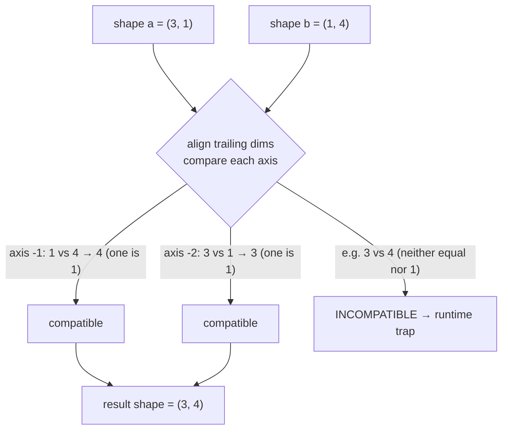

# `import coil` — numpy ndarray buffers from Cobrust (8/8 — final cobra-batch ecosystem module)

> Status: ADR-0072 8/8 first proof — coil is the EIGHTH and FINAL
> cobra-batch ecosystem module. Wired off the proven value-handle chain
> (the same shape den / molt / strike use), it completes the
> workspace-vendored ecosystem the v0.7.0 wave shipped. The first proof
> scoped to constructors + repr; ADR-0077 since added the operator /
> index / attribute surface — elementwise `a + b` / `a - b` / `a * b` /
> `a / b` (numpy **true division**, with **broadcasting**), the comparison
> operators (`a < b` … → a bool mask), the **`a @ b` matrix-multiply**
> operator, scalar forms `a + 1` / `a * 2`, scalar `a[i]` read, and
> `a.shape` / `a.ndim` / `a.size`.

## Example first

```python
import coil

fn main() -> i64:
    let a: coil.Buffer = coil.zeros(3)
    let _ = coil.print_buffer(a)
    return 0
```

Build and run:

```bash
cobrust build prog.cb -o prog
./prog
# array([0, 0, 0], dtype=float64)
```

## What you get (first proof surface)

- **`coil.zeros(n: i64) -> Buffer`** — allocate an `n`-element f64-zero
  1-D buffer. Shape `[n]`. Negative `n` clamps to zero (defensive).
- **`coil.ones(n: i64) -> Buffer`** — allocate an `n`-element f64-one
  1-D buffer. Shape `[n]`.
- **`coil.eye(n: i64) -> Buffer`** — allocate the `n x n` f64 identity
  matrix (`k=0` main-diagonal). Shape `[n, n]` — proves the chain
  handles non-1-D buffers too (drop is shape-agnostic).
- **`coil.print_buffer(b: Buffer) -> i64`** — print the buffer's
  numpy-compatible `array_repr` to stdout. Returns `0` on success;
  `-1` if the receiver is null (defensive).

## Spacing & value constructors (`linspace` / `logspace` / `full`)

Three more all-scalar-arg constructors — they take only **numbers**
(no buffer input) and produce a fresh `float64` 1-D buffer. These are
the numpy spacing / fill constructors most-used in real code:

```text
import coil

fn main() -> i64:
    let a: coil.Buffer = coil.linspace(0.0, 1.0, 5)   # [0, 0.25, 0.5, 0.75, 1]
    let _ = coil.print_buffer(a)                       # endpoint-inclusive
    let b: coil.Buffer = coil.logspace(0.0, 2.0, 3)   # [1, 10, 100]
    let _ = coil.print_buffer(b)                       # = 10 ** linspace
    let c: coil.Buffer = coil.full(3, 5.0)            # [5, 5, 5]
    let _ = coil.print_buffer(c)                       # n copies of value
    let m: f64 = coil.mean(coil.linspace(0.0, 10.0, 5))  # mean([0,2.5,5,7.5,10])
    print((m as i64))                                  # 5
    return 0
```

- **`coil.linspace(start: f64, stop: f64, num: i64) -> Buffer`** — `num`
  evenly-spaced samples over `[start, stop]`, **inclusive of `stop`**
  (numpy's `endpoint=True` default — `linspace(0, 1, 5)` is
  `[0, 0.25, 0.5, 0.75, 1]`, and the last sample is **exactly** `stop`,
  no float drift). The step is `(stop - start) / (num - 1)`. Edge cases
  match numpy: `num == 1` → `[start]`; `num <= 0` → an empty buffer.
- **`coil.logspace(start: f64, stop: f64, num: i64) -> Buffer`** — `num`
  samples spaced evenly on a base-10 **log** scale: `10 ** linspace(start,
  stop, num)`. `logspace(0, 2, 3)` is `[1, 10, 100]`. `num <= 0` → empty.
- **`coil.full(n: i64, value: f64) -> Buffer`** — a 1-D buffer of `n`
  copies of `value`. `full(3, 5.0)` is `[5, 5, 5]`. `n <= 0` → an empty
  buffer (a negative `n` clamps to `0`, like `coil.zeros`).

> Why no `endpoint` / `base` / `num=50` default keyword args? The `.cb`
> surface keeps these constructors **positional and explicit** — numpy's
> defaults (`num=50`, `endpoint=True`, `base=10.0`) are exactly the
> footgun-prone implicit state the elegance ledger drops. You always
> write the count; the endpoint-inclusive + base-10 behavior is the
> common case, and a future `endpoint=False` / custom-`base` form is a
> tracked follow-up if real code needs it.

## Statistics — scalar reductions (`mean` / `median` / `std` / `var` / `min` / `max` / `prod` / `ptp` / `nan*` / `percentile`)

Each of these reduces a whole buffer to **one `f64`** — the same shape an
LLM writes for numpy (`np.mean(a)` → `coil.mean(&a)`). The `&a` is an
explicit shared borrow: a `coil.Buffer` is a non-Copy handle, so passing
`&a` (not bare `a`) lets you keep the buffer alive for the next call.

```python
import coil

fn main() -> i64:
    let a: coil.Buffer = coil.mgrid(0, 5)        # [0, 1, 2, 3, 4]
    print((coil.mean(&a) as i64))                # 2  (mean = 2.0)
    print((coil.min(&a) as i64))                 # 0  (smallest element)
    print((coil.max(&a) as i64))                 # 4  (largest element)
    print((coil.prod(&a) as i64))                # 0  (0*1*2*3*4 = 0)
    print((coil.ptp(&a) as i64))                 # 4  (max 4 - min 0)
    print((coil.nansum(&a) as i64))              # 10 (0+1+2+3+4)
    print((coil.percentile(&a, 50.0) as i64))    # 2  (50th pct = median)
    return 0
```

The full reduction surface:

- **`coil.mean(a: Buffer) -> f64`** — arithmetic mean. Empty → `NaN`.
- **`coil.median(a: Buffer) -> f64`** — order-statistic middle (average of
  the two middle elements for even length). NaN-propagating; empty → `NaN`.
- **`coil.std(a: Buffer) -> f64`** — population standard deviation (ddof=0).
- **`coil.var(a: Buffer) -> f64`** — population variance (ddof=0).
- **`coil.min(a: Buffer) -> f64`** — the smallest element. NaN-propagating
  (a single NaN makes the whole result `NaN`, like `mean`). An **empty**
  buffer is a numpy `ValueError`, so it cleanly aborts the program (a
  controlled trap — `np.min([])` raises).
- **`coil.max(a: Buffer) -> f64`** — the largest element. Same NaN-propagate
  + empty-aborts contract as `min`.
- **`coil.prod(a: Buffer) -> f64`** — the product of every element.
  NaN-propagating. An **empty** buffer → `1.0` (the multiplicative
  identity, exactly numpy's `np.prod([]) == 1.0` — **not** a trap).
  Overflow saturates to `+inf` (numpy parity).
- **`coil.ptp(a: Buffer) -> f64`** — peak-to-peak, i.e. `max(a) - min(a)`
  (the data's range). A single element → `0.0`. NaN-propagating.
- **`coil.nansum(a: Buffer) -> f64`** — sum, treating NaN as zero. An
  all-NaN (or empty) buffer → `0.0`, **not** NaN (matches `np.nansum`).
- **`coil.nanmean(a: Buffer) -> f64`** — mean over the non-NaN elements
  only. All-NaN / empty → `NaN`.
- **`coil.nanstd(a: Buffer) -> f64`** — population std (ddof=0) over the
  non-NaN elements only. All-NaN / empty → `NaN`.
- **`coil.percentile(a: Buffer, q: f64) -> f64`** — the `q`-th percentile
  (`q` from `0` to `100`) using numpy's default **linear interpolation**.
  `q=0` is the min, `q=100` the max, `q=50` equals the median. For
  example `coil.percentile(&a, 25.0)` on `[1, 2, 3, 4]` is `1.75`.
  NaN-propagating; `q` is clamped to `[0, 100]`; empty → `NaN`.

Integer and bool buffers promote to `f64` first (same as numpy). The
`nan*` family is the right tool when your data has holes; the plain
`mean` / `ptp` / `percentile` propagate NaN so a single bad value is
visible rather than silently absorbed. (numpy's NaN-skipping
`nanpercentile` is a deliberate follow-up — only the propagating
`percentile` ships today.)

## Array manipulation — reshape & combine (`transpose` / `flatten` / `ravel` / `concatenate` / `vstack` / `hstack`)

These are the "combine + reshape" ops that return a **fresh
`coil.Buffer`** — they mirror exactly the array-manipulation idioms an
LLM reaches for first in numpy. They are wired **identically** to the
`@` matrix-multiply operator (borrow the Buffer args → return a fresh
Buffer handle the `.cb` scope drops once at exit), NOT the scalar-return
of the statistics batch.

```python
import coil

fn main() -> i64:
    let a: coil.Buffer = coil.array2x3(1.0, 2.0, 3.0, 4.0, 5.0, 6.0)  # (2,3)
    let t: coil.Buffer = coil.transpose(a)        # (3,2): [[1,4],[2,5],[3,6]]
    let _ = coil.print_buffer(t)
    let f: coil.Buffer = coil.flatten(a)          # (6,): [1,2,3,4,5,6]
    let _ = coil.print_buffer(f)
    let b: coil.Buffer = coil.array2x3(7.0, 8.0, 9.0, 10.0, 11.0, 12.0)
    let c: coil.Buffer = coil.concatenate(a, b)   # (4,3): join along axis 0
    let _ = coil.print_buffer(c)
    let h: coil.Buffer = coil.hstack(a, b)        # (2,6): join along axis 1
    let _ = coil.print_buffer(h)
    return 0
```

**Single-arg (reshape; always succeeds):**

- **`coil.transpose(a: Buffer) -> Buffer`** — reverse all axes (`a.T`). A
  1-D array is returned unchanged (numpy: `np.array([1,2,3]).T` is still
  `(3,)`); a 2-D `(m, n)` becomes `(n, m)`. Dtype + values preserved.
- **`coil.flatten(a: Buffer) -> Buffer`** — collapse to a 1-D C-order
  (row-major) copy.
- **`coil.ravel(a: Buffer) -> Buffer`** — collapse to a 1-D C-order copy.
  numpy's `ravel` may return a **view**; the handle ABI has no
  view-into-parent surface, so this is an owned copy with **identical
  values** to numpy's `ravel`.

**Reshape to a 2-D `(rows, cols)` (`-1` inference; bad shape → clean trap):**

- **`coil.reshape(a: Buffer, rows: i64, cols: i64) -> Buffer`** — flatten
  `a` in **C / row-major** order, then lay the elements out as a 2-D
  `(rows, cols)` array. **Dtype + values are preserved** — reshape never
  changes data: `np.arange(6).reshape(2, 3) == [[0,1,2],[3,4,5]]` (NOT
  column-major). Exactly **one** of `rows` / `cols` may be `-1`, which is
  inferred as `a.size() / (the other)` (`reshape(a, -1, 3)` on a size-6
  buffer gives `(2, 3)`; `reshape(a, 3, -1)` gives `(3, 2)`).

  ```python
  let a: coil.Buffer = coil.array2x3(1.0, 2.0, 3.0, 4.0, 5.0, 6.0)  # (2,3)
  let r: coil.Buffer = coil.reshape(a, 3, 2)    # (3,2): [[1,2],[3,4],[5,6]]
  let _ = coil.print_buffer(r)
  let i: coil.Buffer = coil.reshape(a, -1, 2)   # rows inferred: 6/2 = 3
  let _ = coil.print_buffer(i)
  ```

  A bad shape is numpy's `ValueError` and **traps** (the program aborts
  non-zero, never unwinds across the C-ABI): both dims `-1` ("can only
  specify one unknown dimension"), a `-1` paired with a non-divisor other,
  a non-`-1` dim `<= 0`, or a final `rows * cols != a.size()` ("cannot
  reshape array of size N into shape (rows,cols)"). This is the two-scalar
  form; the shape-**tuple** `np.reshape(a, (m, n))` is a tracked follow-up
  (it needs tuple-arg marshalling), and `order='F'` / `≥3-D` reshape are
  documented deferrals — this ships the overwhelmingly-common 2-D C-order
  case.

**Two-arg (combine; non-conformable / dtype-mismatch → clean trap):**

- **`coil.concatenate(a: Buffer, b: Buffer) -> Buffer`** — join two
  arrays along axis 0 (the default `np.concatenate` axis). Both must have
  the same rank and matching sizes on every axis except axis 0.
- **`coil.vstack(a: Buffer, b: Buffer) -> Buffer`** — stack row-wise. A
  1-D `(n,)` operand is first promoted to `(1, n)`, then concatenated
  along axis 0 (`vstack((n,),(n,)) -> (2, n)`; `vstack((r,c),(s,c)) ->
  (r+s, c)`).
- **`coil.hstack(a: Buffer, b: Buffer) -> Buffer`** — stack column-wise.
  1-D operands concatenate along axis 0 (`hstack((p,),(q,)) -> (p+q,)`);
  ≥2-D operands concatenate along axis 1 (`hstack((r,c1),(r,c2)) ->
  (r, c1+c2)`).

> **Dtype contract**: the single-arg ops (`transpose`/`flatten`/`ravel`)
> are dtype-generic across all five dtypes (input variant preserved). The
> two-arg combine ops require the operands to share a dtype and raise
> otherwise. numpy promotes a mixed-dtype pair to a common dtype; we keep
> the clean equal-dtype contract because (a) every `.cb` Buffer
> constructor today emits `Float64` (so the common path is always
> `f64`+`f64`), and (b) a silent cross-dtype promotion is exactly the
> implicit coercion §2.2 forbids. A mixed-dtype promoting form is a
> tracked follow-up.
>
> **Non-conformable trap**: the combine ops return a bare `Buffer` (not a
> `Result`), so a non-conformable pair (rank / non-axis-dim / dtype
> mismatch) **aborts the process** (a clean trap, NEVER unwinding across
> the C-ABI) — matching numpy's `ValueError` raise (the §2.5 closest
> honest semantics; a fallible `a.checked_concatenate(b) -> Result`
> escape is a later surface).
>
> **N-array / shape-tuple forms are deferred**: `np.concatenate([a, b, c,
> ...])` (an N-array list) and the shape-**tuple** `np.reshape(a, (m, n))`
> need `list[Buffer]` / tuple marshalling that does not exist yet — a
> follow-up once that lands. The two-scalar `coil.reshape(a, rows, cols)`
> form (above) DOES ship today; only the tuple-arg spelling is deferred.

## Sorting & search (`sort` / `argsort` / `unique` / `flatnonzero`)

These are the four "flat search & order" ops an LLM reaches for first.
Each takes one Buffer and returns a **fresh `coil.Buffer`** — wired
identically to the reshape ops above. They all **flatten** a
multi-dimensional input to 1-D (C-order) first, matching numpy's no-axis
default.

```python
import coil

fn main() -> i64:
    let a: coil.Buffer = coil.array2x2(3.0, 1.0, 4.0, 2.0)
    let s: coil.Buffer = coil.sort(a)              # [1, 2, 3, 4]  (float64)
    let _ = coil.print_buffer(s)

    let lo: coil.Buffer = coil.array1d2(3.0, 1.0)
    let hi: coil.Buffer = coil.array1d2(4.0, 2.0)
    let v: coil.Buffer = coil.concatenate(lo, hi)  # [3, 1, 4, 2]
    let idx: coil.Buffer = coil.argsort(v)         # [1, 3, 0, 2]  (int64!)
    let _ = coil.print_buffer(idx)
    return 0
```

- **`coil.sort(a: Buffer) -> Buffer`** — a fresh **ascending**-sorted 1-D
  copy. **Dtype-preserving** (a float input stays float, an int input
  stays int). For floats, every `NaN` sorts to the **end** (numpy:
  `np.sort([3., nan, 1.]) == [1., 3., nan]`).
- **`coil.argsort(a: Buffer) -> Buffer`** — the **indices** that would
  sort `a` ascending. The result is **always an `int64` Buffer** (the
  indices), whatever the input dtype. The sort is **stable**, so equal
  keys keep their original order. For floats the `NaN`-bearing indices go
  last. `np.argsort([3., 1., 2.]) == [1, 2, 0]`.
- **`coil.unique(a: Buffer) -> Buffer`** — the **sorted unique** values.
  **Dtype-preserving**. `np.unique([3, 1, 2, 1, 3]) == [1, 2, 3]`. For
  floats, multiple `NaN` collapse to **one** trailing `NaN`
  (`np.unique([nan, 1., nan]) == [1., nan]`).
- **`coil.flatnonzero(a: Buffer) -> Buffer`** — the flat (C-order)
  **indices** where `a != 0`. Always an **`int64` Buffer**.
  `np.flatnonzero([0, 5, 0, 2]) == [1, 3]`. For floats the test is `a !=
  0.0`, so a `NaN` (being `!= 0.0`) **is** counted as nonzero
  (`np.flatnonzero([0., nan, 0.]) == [1]`).

> **The dtype flip is the tell**: every `.cb` Buffer constructor builds a
> `Float64` Buffer, so `sort` / `unique` print `dtype=float64` while
> `argsort` / `flatnonzero` print `dtype=int64` — the result dtype
> literally flips to `int64` for the index-returning ops.
>
> **All four are total** — a sort / dedupe / nonzero scan never fails on a
> valid Buffer (there is no shape-conformability concept for a single
> argument), so unlike the 2-array combine ops there is no trap path.
>
> **The `axis` argument is deferred**: numpy's `sort` / `argsort` /
> `unique` take an optional `axis`; this batch always flattens (the
> no-axis default). A per-axis form is a tracked follow-up.

## Elementwise math — transcendental ufuncs (`exp` / `log` / `log10` / `sqrt` / `sin` / `cos` / `tan`)

These apply a math function to **every element**, returning a **fresh
`coil.Buffer`** — the unary-math idioms an LLM reaches for first in numpy.
They are wired **identically** to the reshape ops above (borrow the Buffer
arg → return a fresh Buffer handle the `.cb` scope drops once at exit).

```python
import coil

fn main() -> i64:
    let a: coil.Buffer = coil.array1d2(0.0, 1.0)
    let e: coil.Buffer = coil.exp(a)              # [1, 2.718281828459045]
    let _ = coil.print_buffer(e)

    let b: coil.Buffer = coil.array2x2(0.0, 1.0, 4.0, 9.0)
    let s: coil.Buffer = coil.sqrt(b)             # [[0, 1], [2, 3]]
    let _ = coil.print_buffer(s)

    # Chain: each op returns a fresh Buffer that feeds the next.
    let r: coil.Buffer = coil.sqrt(coil.exp(a))   # sqrt([1, e]) = [1, 1.648...]
    let _ = coil.print_buffer(r)
    return 0
```

**The seven core ops** (all `Buffer -> Buffer`):

- **`coil.exp(a)`** — `e**x`.
- **`coil.log(a)`** — natural log (base e).
- **`coil.log10(a)`** — base-10 log.
- **`coil.sqrt(a)`** — square root.
- **`coil.sin(a)` / `coil.cos(a)` / `coil.tan(a)`** — trig (radians).

There are also six convenience ops with the **same dtype rule**:
**`coil.exp2`** (`2**x`), **`coil.log2`**, **`coil.cbrt`** (cube root —
unlike `sqrt`, defined for negatives: `cbrt(-8) = -2`), **`coil.sinh`**,
**`coil.cosh`**, **`coil.tanh`**.

> **Dtype rule (the one thing to remember)**: these are all
> **float-returning**. An **integer** input is promoted to `float64`
> (`exp` of an int array gives a `float64` buffer); a **`float32`** input
> stays `float32`; a **`float64`** input stays `float64`. (A `bool` input
> is promoted to `float64` too — numpy would use `float16`, which coil has
> no equivalent for; the *values* are identical, only the dtype tier
> differs.)
>
> **Domain errors are values, not crashes**: there is no "shape mismatch"
> for a one-argument op, so these **never trap**. A mathematically
> undefined input produces the IEEE-754 special value numpy produces —
> `log(0) = -inf`, `log(-1) = NaN`, `sqrt(-1) = NaN`, `exp(710) = +inf`
> (overflow) — and the program keeps running. (numpy prints a
> RuntimeWarning; the array value is the same.) The repr renders these as
> `inf` / `-inf` / `NaN`.

## Elementwise math — rounding & sign ufuncs (`abs` / `floor` / `ceil` / `round` / `trunc` / `square` / `sign`)

These also apply to **every element** and return a **fresh `coil.Buffer`**
— wired identically to the transcendentals above. They differ in one
important way: they **preserve the dtype** (see the box below).

```python
import coil

fn main() -> i64:
    let a: coil.Buffer = coil.array2x2(0.5, 1.5, 2.5, -0.5)
    let r: coil.Buffer = coil.round(a)            # [[0, 2], [2, -0]]  (banker's!)
    let _ = coil.print_buffer(r)

    let b: coil.Buffer = coil.array2x2(-2.5, 0.0, 3.0, -7.0)
    let s: coil.Buffer = coil.sign(b)             # [[-1, 0], [1, -1]]
    let _ = coil.print_buffer(s)

    # Chain: each op returns a fresh Buffer that feeds the next.
    let c: coil.Buffer = coil.array1d2(-1.5, 2.5)
    let d: coil.Buffer = coil.abs(coil.floor(c))  # abs([-2, 2]) = [2, 2]
    let _ = coil.print_buffer(d)
    return 0
```

**The seven ops** (all `Buffer -> Buffer`):

- **`coil.abs(a)`** — absolute value (`abs(-1.5) = 1.5`).
- **`coil.floor(a)`** — round down (`floor(-1.5) = -2`).
- **`coil.ceil(a)`** — round up (`ceil(-1.5) = -1`).
- **`coil.round(a)`** — round to nearest, **half-to-even** (see below).
- **`coil.trunc(a)`** — truncate toward zero (`trunc(-1.7) = -1`, unlike
  `floor`).
- **`coil.square(a)`** — `x * x` (`square(-3) = 9`).
- **`coil.sign(a)`** — `-1` / `0` / `1`.

> **`round` is banker's rounding (round-half-to-even)** — the one thing
> people get wrong. A value exactly halfway rounds to the nearest **even**
> integer, matching numpy's `np.round` (and Python 3's `round`): `round(0.5)
> = 0`, `round(1.5) = 2`, `round(2.5) = 2`, `round(3.5) = 4`. This is
> **not** the "always round .5 up" rule from school. (`round(-0.5)` gives
> `-0`, which prints as `-0`.)

> **`sign(0) = 0` and `sign(NaN) = NaN`** — zero has sign zero (not `+1`),
> and a NaN stays NaN. `sign(x) = 1` for `x > 0`, `-1` for `x < 0`.

> **Dtype rule (the one thing to remember)**: unlike the transcendentals,
> these **preserve the dtype** — an `int` array stays `int`, a `float32`
> stays `float32`, a `float64` stays `float64`. They do **not** promote int
> to float. And `floor` / `ceil` / `round` / `trunc` are **no-ops on an
> integer array** (an integer is already "rounded" — numpy returns it
> unchanged). `abs` / `square` / `sign` do transform integers
> (`abs(-3) = 3`, `square(2) = 4`, `sign(-5) = -1`). (A `bool` input is
> returned unchanged in coil — numpy would promote to `float16` / `int8`
> or, for `sign`, raise; coil keeps `bool`, and the values match since
> `True`/`False` is the `1`/`0` these ops act on.)
>
> Like the transcendentals, these **never trap** (there is no shape
> mismatch for a one-argument op): `floor(NaN) = NaN`, `floor(-inf) =
> -inf`, `abs(NaN) = NaN`. (In the examples above every `.cb` constructor
> makes a `float64` buffer, so the integer-valued results print without a
> `.0` — `[[0, 2], [2, -0]]`, `dtype=float64`.)

## Predicates — `isnan` / `isinf` / `isfinite` (→ a `bool` mask)

When a computation can produce a NaN (`0/0`) or an infinity (`1/0`), you
want to *check* for it before it silently poisons the rest of the math.
These three predicates answer, per element, "is this value special?" — and
the result is a **boolean mask** (a `Buffer` of `True`/`False`), the same
shape as the input. This is the unary cousin of the `a < b` comparison
(which also gives a mask).

```cobrust
import coil

fn main() -> i64:
    # No NaN/inf literal yet, so build them with IEEE division:
    #   0.0/0.0 = NaN, 1.0/0.0 = +inf, x/1.0 = x (finite).
    let num: coil.Buffer = coil.array1d2(0.0, 1.0)
    let den: coil.Buffer = coil.array1d2(0.0, 1.0)
    let mixed: coil.Buffer = num / den            # [NaN, 1.0]

    let nans: coil.Buffer = coil.isnan(mixed)     # [True, False]
    let _ = coil.print_buffer(nans)               # array([True, False], dtype=bool)

    let fin: coil.Buffer = coil.isfinite(mixed)   # [False, True]  (the complement)
    let _ = coil.print_buffer(fin)

    # The "does this buffer have ANY NaN?" idiom — a mask feeds `any`.
    let has_nan: bool = coil.any(&coil.isnan(mixed))
    if has_nan:
        print(1)                                  # 1  (yes, there is a NaN)
    return 0
```

**The three ops** (all `Buffer -> Buffer`, result is a `bool` mask):

- **`coil.isnan(a)`** — is the element NaN? `isnan(nan) = True`,
  `isnan(inf) = False`, `isnan(1.0) = False`.
- **`coil.isinf(a)`** — is the element `+inf` or `-inf`? Both signs count.
  `isinf(inf) = True`, `isinf(-inf) = True`, `isinf(nan) = False`.
- **`coil.isfinite(a)`** — is the element finite (**not** NaN and **not**
  inf)? `isfinite(1.0) = True`, `isfinite(nan) = False`,
  `isfinite(inf) = False`. It is exactly the opposite of "NaN or inf".

> **The result is always a `bool` mask** — no matter the input dtype. Just
> like `np.isnan(x).dtype` is always `bool`, `coil.isnan` /`isinf` /
> `isfinite` always return a `True`/`False` buffer (it prints as
> `dtype=bool`), never a number. Combine a mask with `coil.any` / `coil.all`
> to collapse it to a single yes/no — `coil.any(coil.isnan(a))` is the
> canonical "is my data NaN-clean?" check.

> **Integers are always finite.** An integer can never be NaN or infinite,
> so on an `int` (or `bool`) buffer `isnan` and `isinf` are **all `False`**
> and `isfinite` is **all `True`** — matching numpy
> (`np.isnan([1, 2]) = [False, False]`, `np.isfinite(int_array)` is all
> `True`). Like the other one-argument ops, these **never trap** (a
> predicate just answers for every value, NaN and inf included).

## Reductions — `cumsum` / `cumprod` (→ Buffer), `argmin` / `argmax` (→ int), `any` / `all` (→ bool)

These are the reductions you reach for most often. Unlike everything above,
they come in **three return shapes** — a buffer, an integer, or a boolean —
depending on what the operation means:

```python
import coil

fn main() -> i64:
    # cumsum / cumprod return a fresh 1-D Buffer (a running total / product).
    let a: coil.Buffer = coil.array2x2(1.0, 2.0, 3.0, 4.0)
    let r: coil.Buffer = coil.cumsum(a)    # [1, 3, 6, 10]  (flattened to 1-D!)
    let _ = coil.print_buffer(r)

    # argmin / argmax return an i64 — the index of the smallest / largest.
    let b: coil.Buffer = coil.array2x2(3.0, 1.0, 1.0, 5.0)
    let lo: i64 = coil.argmin(&b)          # 1  (first occurrence of the min)
    let hi: i64 = coil.argmax(&b)          # 3  (the 5)
    print(lo)
    print(hi)

    # any / all return a bool. Print them with the `if` idiom.
    let c: coil.Buffer = coil.array1d2(0.0, 5.0)
    let some: bool = coil.any(&c)          # True  (the 5 is truthy)
    let every: bool = coil.all(&c)         # False (the 0 is falsy)
    if some:
        print(1)
    else:
        print(0)
    return 0
```

**The six ops**:

- **`coil.cumsum(a) -> Buffer`** — cumulative (running) sum.
- **`coil.cumprod(a) -> Buffer`** — cumulative (running) product.
- **`coil.argmin(a) -> i64`** — the index of the smallest element.
- **`coil.argmax(a) -> i64`** — the index of the largest element.
- **`coil.any(a) -> bool`** — `True` if **any** element is truthy.
- **`coil.all(a) -> bool`** — `True` if **all** elements are truthy.

> **`cumsum` / `cumprod` flatten a multi-dimensional array first** — with no
> axis argument, numpy (and coil) walk the array in row-major (C) order and
> return a **1-D** result of length `a.size`. So `cumsum([[1,2],[3,4]])` is
> `[1, 3, 6, 10]` — a flat 4-element buffer, **not** a 2×2.
>
> **Dtype note**: the integer accumulator widens to 64-bit — an `int32`
> input gives an `int64` result, and a `bool` input gives `int64` too
> (`[True,False,True]` → `[1, 1, 2]`). `float32` stays `float32`, `float64`
> stays `float64`. (Every `.cb` constructor makes a `float64` buffer, so the
> examples print integer-valued floats without a `.0`.)

> **`argmin` / `argmax` give a *flat* index, and ties go to the first
> occurrence.** On a 2-D input the index counts in row-major order
> (`argmax([[3,1],[1,5]]) = 3`, pointing at the `5`). If the min/max appears
> more than once, you get the **first** position. A `NaN` is treated as the
> winner (numpy's rule — `argmax([1, nan, 2]) = 1`).
>
> **Empty input is an error.** `coil.argmin` / `coil.argmax` of an empty
> buffer aborts the program cleanly (numpy raises `ValueError` — there is no
> "index of nothing"). This is a controlled abort, not a crash.

> **`any` / `all` truthiness**: zero is falsy, everything else is truthy —
> **including `NaN`** (`any([nan]) = True`, matching numpy). The empty cases
> follow logic: `any([]) = False` (no truthy element) and `all([]) = True`
> (vacuously — nothing fails). To print a `bool`, use the `if b:` form shown
> above rather than `print(b)` directly.

> **The *value* reductions `min` / `max` / `prod`** (the smallest / largest
> *value*, or the product — not an index) live in the **Statistics —
> scalar reductions** section above: they return an `f64`, exactly like
> `coil.mean`. (Every `.cb` buffer is `float64`, so an f64 return is
> numpy-exact — `np.max(f64_array)` is a float.) The numpy *dtype-
> preserving* form — `np.max(int_array)` returning an `int` — is a separate
> later design step; the f64 form covers every buffer you can build today.

## Scalar-argument ufuncs — `clip(a, lo, hi)` and `power(a, p)`

These are the first elementwise ops that take **extra scalar arguments**
beside the buffer — a clamp range for `clip`, an exponent for `power`. Both
return a **fresh `coil.Buffer`**.

```python
import coil

fn main() -> i64:
    # clip clamps every element into [lo, hi].
    let a: coil.Buffer = coil.array1d2(1.0, 9.0)
    let r: coil.Buffer = coil.clip(a, 2.0, 7.0)   # [2, 7]  (1 up to 2, 9 down to 7)
    let _ = coil.print_buffer(r)

    # power raises every element to the p-th power.
    let b: coil.Buffer = coil.array1d2(2.0, 3.0)
    let s: coil.Buffer = coil.power(b, 2.0)        # [4, 9]  (square)
    let _ = coil.print_buffer(s)

    # power(_, 0.5) is sqrt; chain a power into a clip.
    let c: coil.Buffer = coil.array1d2(1.0, 4.0)
    let d: coil.Buffer = coil.clip(coil.power(c, 2.0), 2.0, 9.0)  # clip([1,16],2,9)=[2,9]
    let _ = coil.print_buffer(d)
    return 0
```

**The two ops**:

- **`coil.clip(a, lo, hi) -> Buffer`** — clamp each element to `[lo, hi]`.
- **`coil.power(a, p) -> Buffer`** — raise each element to the `p`-th power.

> **`clip`: when `lo > hi`, the *upper* bound wins.** numpy computes `clip`
> as `minimum(maximum(a, lo), hi)`, so if you pass a `lo` bigger than `hi`,
> everything ends up at `hi`: `clip([1, 9], 7, 2) = [2, 2]`. (This is the one
> surprising case — most languages' `clamp` would *panic* on `lo > hi`; coil
> matches numpy instead.) A `NaN` element passes through unchanged
> (`clip(nan, 0, 1) = nan`).

> **`clip` preserves the dtype; `power` promotes to float.** `clip` keeps the
> input dtype (an `int` buffer stays `int` — the bounds are read as the
> array's dtype, `clip([1,5,9], 2, 7) = [2,5,7]` int64; a `float32` stays
> `float32`). `power`, in contrast, **always returns a float** — an `int`
> buffer gives a `float64` result (`power([1,2,3], 2.0) = [1., 4., 9.]`), and
> a `float32` stays `float32`. (Every `.cb` constructor here makes a
> `float64` buffer, so the integer-valued results print without a `.0`.)

> **`power` takes a *float* exponent — on purpose.** Using an `f64` exponent
> (rather than an integer) sidesteps numpy's one footgun here: `int ** int`
> with a *negative* integer exponent **raises** in numpy (you can't write
> `1/n` as an integer). A float exponent always promotes to float, so a
> negative exponent just works. The familiar cases hold: `power(x, 0.5)` is
> `sqrt(x)`, `power(x, 0)` is `1` for every `x` (even `0 ** 0 = 1`, matching
> numpy), and `power(x, 2.0)` is `x * x`. A negative base to a fractional
> power has no real value, so `power(-4.0, 0.5) = NaN` (the real branch — a
> value, never an error).

> Like the other elementwise ops, these **never trap** (a one-argument-plus-
> scalars op has no shape mismatch): a `NaN` / `inf` is a *value* that flows
> through, not an error.

## Binary min/max ufuncs — `maximum` / `minimum` / `fmax` / `fmin`

These four take **two buffers** and pick, lane by lane, the larger
(`maximum` / `fmax`) or smaller (`minimum` / `fmin`) of the paired
elements. They return a **fresh `coil.Buffer`** of the same shape and
dtype. The pair must share one shape and one dtype — a mismatched pair
**traps** (see the note below).

The whole reason there are *four* of them — not two — is **how they treat
`NaN`**:

- **`maximum` / `minimum` PROPAGATE `NaN`.** If *either* operand at a lane
  is `NaN`, the result there is `NaN`. (`maximum(1, NaN) = NaN`.)
- **`fmax` / `fmin` IGNORE `NaN`.** They return the *non-`NaN`* operand,
  and only yield `NaN` when **both** operands are `NaN`.
  (`fmax(1, NaN) = 1`, `fmax(NaN, NaN) = NaN`.)

```python
import coil


fn main() -> i64:
    let a: coil.Buffer = coil.array1d2(1.0, 2.0)
    let b: coil.Buffer = coil.array1d2(3.0, 1.0)
    # Elementwise pick: lane 0 takes b's 3, lane 1 takes a's 2.
    let mx: coil.Buffer = coil.maximum(a, b)        # [3, 2]
    let mn: coil.Buffer = coil.minimum(a, b)        # [1, 1]

    # The NaN split. Build a NaN with 0/0 (no NaN literal needed):
    let znum: coil.Buffer = coil.array1d2(1.0, 0.0)
    let zden: coil.Buffer = coil.array1d2(1.0, 0.0)
    let an: coil.Buffer = znum / zden               # [1, NaN]
    let bn: coil.Buffer = coil.array1d2(3.0, 7.0)
    let p: coil.Buffer = coil.maximum(an, bn)       # [3, NaN]  (NaN PROPAGATES)
    let q: coil.Buffer = coil.fmax(an, bn)          # [3, 7]    (NaN IGNORED)

    let _ = coil.print_buffer(mx)
    let _ = coil.print_buffer(q)
    return 0
```

- **`coil.maximum(a, b) -> Buffer`** — elementwise max, propagates `NaN`.
- **`coil.minimum(a, b) -> Buffer`** — elementwise min, propagates `NaN`.
- **`coil.fmax(a, b) -> Buffer`** — elementwise max, ignores `NaN`.
- **`coil.fmin(a, b) -> Buffer`** — elementwise min, ignores `NaN`.

> **The `maximum`-vs-`fmax` split is the one nuance to internalize.** On a
> lane where one operand is `NaN`: `maximum` / `minimum` keep the `NaN`
> (any `NaN` in → `NaN` out, like the rest of IEEE arithmetic), while
> `fmax` / `fmin` skip it and return the real number. So
> `maximum([1, NaN], [3, 7]) = [3, NaN]` but
> `fmax([1, NaN], [3, 7]) = [3, 7]`. The *only* time `fmax` / `fmin` give a
> `NaN` is when **both** operands are `NaN`. (This matches numpy exactly:
> `np.maximum`/`np.minimum` propagate, `np.fmax`/`np.fmin` ignore.)

> **Dtype-preserving; same-shape + same-dtype required.** The result keeps
> the operands' dtype (`maximum([1, 5], [3, 2]) = [3, 5]` stays `int64`; a
> `bool` pair stays `bool`, where max is OR and min is AND). Unlike numpy,
> coil does **not** broadcast or promote here: the two buffers must share
> one shape *and* one dtype. A non-conformable pair (e.g. `(2,)` against
> `(2, 2)`) or a cross-dtype pair **traps** — a clean abort, never a
> silently-broadcast or garbage result. (Broadcasting and cross-dtype
> promotion are tracked follow-ups, mirroring `concatenate`'s same-dtype
> contract.)

## Binary float ufuncs — `arctan2` / `hypot` / `logaddexp`

These three take **two buffers** and combine the paired elements with a
**float** math function — geometry and machine-learning staples. Unlike the
min/max family above, they are **float-promoting**: the result is always a
float (`arctan2`/`hypot` of two integer buffers come back as `float64`), the
same dtype rule as the transcendentals (`exp` / `sqrt`).

```python
import coil

fn main() -> i64:
    # arctan2(y, x): the angle (radians) of the point (x, y). ARG ORDER IS
    # (y, x) — Y FIRST. The signs of both pick the quadrant.
    let y: coil.Buffer = coil.array1d2(1.0, 1.0)
    let x: coil.Buffer = coil.array1d2(1.0, 0.0)
    let a: coil.Buffer = coil.arctan2(y, x)     # [pi/4, pi/2]
    let _ = coil.print_buffer(a)

    # hypot(x, y): the Euclidean norm sqrt(x*x + y*y) — overflow-safe.
    let p: coil.Buffer = coil.array1d2(3.0, 5.0)
    let q: coil.Buffer = coil.array1d2(4.0, 12.0)
    let h: coil.Buffer = coil.hypot(p, q)       # [5, 13]
    let _ = coil.print_buffer(h)

    # logaddexp(a, b): log(exp(a) + exp(b)) — numerically stable.
    let u: coil.Buffer = coil.array1d2(0.0, 1000.0)
    let v: coil.Buffer = coil.array1d2(0.0, 1000.0)
    let g: coil.Buffer = coil.logaddexp(u, v)   # [ln2, 1000+ln2]  (finite!)
    let _ = coil.print_buffer(g)
    return 0
```

**The three ops**:

- **`coil.arctan2(y, x) -> Buffer`** — the angle (radians, in `(-π, π]`) of
  the point `(x, y)`. The `arctan2(1, 0) = π/2` (straight up), `arctan2(0,
  -1) = π` (left), etc.
- **`coil.hypot(x, y) -> Buffer`** — the hypotenuse / Euclidean norm
  `sqrt(x*x + y*y)`. `hypot(3, 4) = 5`.
- **`coil.logaddexp(a, b) -> Buffer`** — `log(exp(a) + exp(b))`, the
  log-sum-exp building block. `logaddexp(0, 0) = ln 2 ≈ 0.693`.

> **`arctan2`'s argument order is `(y, x)` — Y FIRST.** This trips people up
> because it reads "backwards" from `(x, y)` coordinates. It is the numpy
> (and C `atan2`) order, chosen so the *signs of both arguments* place the
> angle in the correct quadrant — something single-argument `arctan(y/x)`
> cannot do. The litmus test: `arctan2(1, 0) = π/2`, **not** `0`. If you ever
> see `0` there, you swapped the arguments.

> **`hypot` is overflow-safe; `logaddexp` is numerically stable.** Both avoid
> the naive-formula trap. `hypot(1e308, 1e308)` returns a *finite* `≈
> 1.41e308`, where a literal `sqrt(x*x + y*y)` would overflow to `+inf` (the
> `x*x` blows up first). `logaddexp(1000, 1000)` returns a *finite* `1000 +
> ln 2`, where a literal `log(exp(1000) + exp(1000))` overflows (`exp(1000) =
> inf`). These are the whole reason the two ops exist as primitives rather
> than hand-rolled expressions — they are the robotics (`hypot`/`arctan2`)
> and ML (`logaddexp`) safe versions.

> **Float-promoting; same-shape + same-dtype required.** The result is always
> a float — `float64` for integer / `float64` inputs, `float32` only when
> *both* inputs are `float32` (the same per-operand rule as `exp` / `sqrt`).
> A `bool` pair comes back `float64` (`hypot(True, True) = sqrt(2)`; numpy
> would give `float16`, but the value matches). Like the min/max family, coil
> does **not** broadcast or promote across dtypes here: the two buffers must
> share one shape *and* one dtype — a non-conformable or cross-dtype pair
> **traps** (a clean abort, never a garbage result). (Broadcasting and
> cross-dtype promotion are tracked follow-ups.)

## Inverse trig & hyperbolic ufuncs — `arcsin` / `arccos` / `arctan` / `arcsinh` / `arccosh` / `arctanh`

These six are the **inverses** of the trig / hyperbolic functions — they
complete the unary-math family (the forward `sin` / `cos` / `tan` /
`sinh` / `cosh` / `tanh` are above). Each takes **one buffer** and returns
a **fresh `coil.Buffer`** of the same shape. They are **float-promoting**:
the result is always a float (the same dtype rule as `exp` / `sqrt` — int /
bool inputs come back `float64`, `float32` stays `float32`).

```python
import coil

fn main() -> i64:
    # arcsin(1) = pi/2, arctan(1) = pi/4 — the classic reference angles.
    let a: coil.Buffer = coil.array1d2(1.0, 0.0)
    let s: coil.Buffer = coil.arcsin(a)     # [pi/2, 0]
    let t: coil.Buffer = coil.arctan(a)     # [pi/4, 0]
    let _ = coil.print_buffer(s)
    let _ = coil.print_buffer(t)

    # Round-trip: sin(arcsin(x)) = x for x in [-1, 1].
    let x: coil.Buffer = coil.array1d2(0.5, -0.25)
    let r: coil.Buffer = coil.sin(coil.arcsin(x))   # [0.5, -0.25]
    let _ = coil.print_buffer(r)
    return 0
```

**The six ops**:

- **`coil.arcsin(a) -> Buffer`** — inverse sine. Domain `[-1, 1]`, range
  `[-π/2, π/2]`. `arcsin(1) = π/2`, `arcsin(0) = 0`.
- **`coil.arccos(a) -> Buffer`** — inverse cosine. Domain `[-1, 1]`, range
  `[0, π]`. `arccos(1) = 0`, `arccos(0) = π/2`, `arccos(-1) = π`.
- **`coil.arctan(a) -> Buffer`** — inverse tangent. All reals, range
  `(-π/2, π/2)`. `arctan(1) = π/4`. (Single-argument — for the
  quadrant-aware two-argument form, use `arctan2(y, x)` above.)
- **`coil.arcsinh(a) -> Buffer`** — inverse hyperbolic sine. All reals.
  `arcsinh(0) = 0`.
- **`coil.arccosh(a) -> Buffer`** — inverse hyperbolic cosine. Domain
  `[1, ∞)`. `arccosh(1) = 0`.
- **`coil.arctanh(a) -> Buffer`** — inverse hyperbolic tangent. Domain
  `(-1, 1)`. `arctanh(0) = 0`; `arctanh(±1) = ±∞` (the boundary).

> **Out-of-domain inputs return a `NaN` *value*, never an error.** `arcsin`
> and `arccos` are only defined on `[-1, 1]`, `arccosh` only on `[1, ∞)`,
> `arctanh` only on `(-1, 1)`. Feed one a value outside its domain and you
> get **`NaN` back as a value** — the program keeps running, exactly as
> numpy does (numpy prints a runtime warning, but the array value is
> `NaN`). So `arcsin(2) = NaN`, `arccosh(0) = NaN`, `arctanh(2) = NaN`. The
> boundary of `arctanh` is `±∞`: `arctanh(1) = +∞`, `arctanh(-1) = -∞`.
> None of these traps — a `NaN` / `∞` is a value that flows through, just
> like `sqrt(-1) = NaN` for the forward ops.

> **Float-promoting (same rule as the forward transcendentals).** The
> result is always a float — `float64` for integer / `float64` inputs,
> `float32` only when the input is `float32`. A `bool` input comes back
> `float64` (`arcsin(True) = arcsin(1) = π/2`; numpy would give `float16`,
> but the value matches). Since there is no shape mismatch for a one-buffer
> op, these **never trap** on shape; the only special outputs are the
> domain `NaN` / `±∞` *values* above.

## Rearranging & repeating — `diff` / `flip` / `roll` / `repeat` / `tile`

These five rearrange or repeat the elements of a buffer. Each works over
the **C-order flattened** array (numpy's no-axis default) and returns a
**fresh `coil.Buffer`**. They split by argument shape: `diff` and `flip`
take just the buffer; `roll`, `repeat`, and `tile` take a trailing **whole
number** (an `i64` — a shift count or a repeat count).

```python
import coil

fn main() -> i64:
    let a: coil.Buffer = coil.array1d2(1.0, 4.0)
    let d: coil.Buffer = coil.diff(a)        # [3]   (a[1] - a[0] = 4 - 1)
    let _ = coil.print_buffer(d)

    let b: coil.Buffer = coil.array1d2(1.0, 2.0)
    let f: coil.Buffer = coil.flip(b)        # [2, 1]   (reversed)
    let _ = coil.print_buffer(f)

    # roll takes an integer shift; a negative shift rolls the other way.
    let r: coil.Buffer = coil.roll(b, 1)     # [2, 1]   (last wraps to front)
    let _ = coil.print_buffer(r)

    # repeat each element n times; tile the whole array n times.
    let p: coil.Buffer = coil.repeat(b, 2)   # [1, 1, 2, 2]
    let _ = coil.print_buffer(p)
    let t: coil.Buffer = coil.tile(b, 2)     # [1, 2, 1, 2]
    let _ = coil.print_buffer(t)

    # chain: a fresh buffer feeds the next op. flip(diff(...)).
    let g: coil.Buffer = coil.array2x2(1.0, 4.0, 9.0, 16.0)  # [[1,4],[9,16]]
    let c: coil.Buffer = coil.flip(coil.diff(g))             # diff→[3,5,7], flip→[7,5,3]
    let _ = coil.print_buffer(c)
    return 0
```

**The five ops**:

- **`coil.diff(a) -> Buffer`** — the *first difference* `a[1:] - a[:-1]`.
  The result is one element shorter than the input: `diff([1,4,9,16]) =
  [3,5,7]`.
- **`coil.flip(a) -> Buffer`** — the reversed array: `flip([1,2,3]) =
  [3,2,1]`.
- **`coil.roll(a, k) -> Buffer`** — a *cyclic* shift by `k`: each element
  moves `k` places to the right, with the ones that fall off the end
  wrapping back to the front. `roll([1,2,3,4], 1) = [4,1,2,3]`.
- **`coil.repeat(a, n) -> Buffer`** — repeat **each element** `n` times:
  `repeat([1,2], 2) = [1,1,2,2]`.
- **`coil.tile(a, n) -> Buffer`** — tile the **whole array** `n` times:
  `tile([1,2], 2) = [1,2,1,2]`.

> **The shift count and repeat count are *integers*, not floats.** `roll`,
> `repeat`, and `tile` take a whole number — write `coil.roll(a, 1)`, not
> `coil.roll(a, 1.0)`. Passing a float (or a string) is a **compile error**,
> caught before your program ever runs (this is the §2.5 "catch it at
> compile time" rule — contrast `coil.power(a, p)`, whose exponent genuinely
> *is* a float). The exponent for `power` is a float; the counts here are
> integers — the type signatures keep the two from being confused.

> **`roll` keeps the original shape; the others flatten to 1-D.** `roll` is
> the one op that preserves a multi-dimensional shape — it shifts on the
> flattened view but reshapes back, so `roll([[1,2],[3,4]], 1) =
> [[4,1],[2,3]]` (still 2×2). `diff` / `flip` / `repeat` / `tile` always
> return a flat 1-D result (a 2-D input is flattened first).

> **A negative `roll` shifts the other way; the shift wraps around.** A
> negative count rolls *left*: `roll([1,2,3], -1) = [2,3,1]`. The count is
> taken modulo the length, so `roll(a, 0)` (or any multiple of the length)
> leaves the array unchanged, and `roll([1,2,3], 4)` is the same as
> `roll([1,2,3], 1)`.

> **`repeat` / `tile` with a count of 0 give an empty buffer**, matching
> numpy (`repeat(a, 0) = []`, `tile(a, 0) = []`); a count of 1 is just a
> copy. `diff` of a length-1 (or empty) buffer is empty (there are no
> adjacent pairs to subtract).

> **The dtype is preserved.** All five keep the input dtype (`diff` of an
> integer buffer stays integer, etc.) — unlike `power`, none of these
> promotes to float. (Every `.cb` constructor here makes a `float64` buffer,
> so the integer-valued results print without a `.0`.)

> Like the other ops, these **never trap** — an empty input or a zero count
> is an empty buffer, never an error.

## Triangle & diagonal extraction — `diag` / `tril` / `triu`

These three pull the *diagonal* or a *triangle* out of a matrix. They are
the closest thing in numpy to "look at one slice of a 2-D array", and they
all return a **fresh `coil.Buffer`**. They each take just the buffer (no
extra argument — the main diagonal only).

```python
import coil

fn main() -> i64:
    # diag is SHAPE-DEPENDENT — it does opposite things to a vector and a matrix.
    let v: coil.Buffer = coil.array1d2(1.0, 2.0)
    let m: coil.Buffer = coil.diag(v)        # [[1, 0], [0, 2]]   (vector -> diagonal matrix)
    let _ = coil.print_buffer(m)

    let a: coil.Buffer = coil.array2x2(1.0, 2.0, 3.0, 4.0)  # [[1,2],[3,4]]
    let d: coil.Buffer = coil.diag(a)        # [1, 4]   (matrix -> its diagonal)
    let _ = coil.print_buffer(d)

    # tril keeps the lower triangle (zeros above); triu keeps the upper (zeros below).
    let lo: coil.Buffer = coil.tril(a)       # [[1, 0], [3, 4]]
    let _ = coil.print_buffer(lo)
    let hi: coil.Buffer = coil.triu(a)       # [[1, 2], [0, 4]]
    let _ = coil.print_buffer(hi)

    # chain: diag(diag(v)) round-trips a vector through its diagonal matrix and back.
    let back: coil.Buffer = coil.diag(coil.diag(v))   # [1, 2]
    let _ = coil.print_buffer(back)
    return 0
```

**The three ops**:

- **`coil.diag(a) -> Buffer`** — *shape-dependent*:
  - a **1-D** vector of length `n` becomes the `n × n` matrix with the
    vector on the main diagonal and zeros elsewhere: `diag([1, 2]) =
    [[1, 0], [0, 2]]`.
  - a **2-D** matrix becomes its 1-D main diagonal: `diag([[1, 2], [3, 4]])
    = [1, 4]`.
- **`coil.tril(a) -> Buffer`** — the **lower triangle**: keep every element
  on and *below* the main diagonal, set the ones *above* to zero (same
  shape): `tril([[1, 2], [3, 4]]) = [[1, 0], [3, 4]]`.
- **`coil.triu(a) -> Buffer`** — the **upper triangle**: keep every element
  on and *above* the main diagonal, set the ones *below* to zero (same
  shape): `triu([[1, 2], [3, 4]]) = [[1, 2], [0, 4]]`.

> **`diag` does two opposite things depending on the input rank.** This is
> numpy's exact behaviour, and it is the one thing to internalize: give it a
> *vector* and you get a *matrix* (the vector laid on the diagonal); give it
> a *matrix* and you get a *vector* (the diagonal pulled out). That is why
> `diag(diag(v))` round-trips back to `v` — the outer call extracts what the
> inner call constructed. For a non-square matrix the extracted diagonal has
> length `min(rows, cols)`: `diag` of a `2 × 3` matrix gives 2 elements.

> **`tril` zeros *above*, `triu` zeros *below* — don't swap them.** The
> mnemonic: tri**l** = **l**ower (the lower triangle survives), tri**u** =
> **u**pper. On the same matrix they zero *opposite* corners:
> `tril([[1,2],[3,4]]) = [[1,0],[3,4]]` (upper-right `2` gone) while
> `triu([[1,2],[3,4]]) = [[1,2],[0,4]]` (lower-left `3` gone).

> **`tril` / `triu` require a 2-D matrix.** Passing a 1-D vector is a
> **runtime trap** (a clean process abort with a numpy-style diagnostic,
> never silent garbage). numpy itself treats a higher-rank input as a batch;
> coil's first proof requires exactly 2-D and traps otherwise (the batch
> form is a documented follow-up). `diag` accepts 1-D *or* 2-D; a 0-D scalar
> or a ≥3-D array traps.

> **Only the main diagonal (offset 0).** numpy's optional `k=` argument
> (pick a diagonal above or below the main one) is a documented follow-up —
> today all three operate on the main diagonal.

> **The dtype is preserved**, and the zero-fill uses that dtype's zero
> (`tril` of an integer matrix stays integer, with integer `0`s in the
> zeroed corner). (Every `.cb` constructor here makes a `float64` buffer, so
> the integer-valued results print without a `.0`.)

## Linear algebra — the `coil.linalg.*` sub-namespace (ADR-0079 Phase 1)

`coil.linalg.*` is the FIRST *dotted sub-namespace* under an ecosystem
module — it mirrors numpy's `np.linalg.*` idiom exactly (so the same
code an LLM writes for numpy works here, swapping only `np` → `coil`).
`coil.linalg` is a **namespace, not a value you bind**: you write
`coil.linalg.solve(a, b)` directly (you never `let la = coil.linalg`).

```python
import coil

fn main() -> i64:
    let a: coil.Buffer = coil.array2x2(1.0, 2.0, 3.0, 4.0)  # [[1,2],[3,4]]
    let b: coil.Buffer = coil.array1d2(5.0, 11.0)           # [5, 11]
    let x: coil.Buffer = coil.linalg.solve(a, b)            # solves A·x = b
    print((x[0] as i64))   # 1
    print((x[1] as i64))   # 2
    let d: f64 = coil.linalg.det(a)
    print((d as i64))      # -2
    return 0
```

- **`coil.linalg.solve(a: Buffer, b: Buffer) -> Buffer`** — solve the
  linear system `A · x = b` (LU partial pivot — LAPACK `*gesv`'s
  analogue). Returns the solution vector. `@py_compat(numerical(rtol=1e-6))`.
- **`coil.linalg.det(a: Buffer) -> f64`** — the determinant of a square
  matrix. Returns a plain `f64` (numpy's 0-d scalar is not a Cobrust
  type — a benign, documented divergence).
- **`coil.linalg.inv(a: Buffer) -> Buffer`** — the matrix inverse (via
  `solve(a, I)` — LAPACK `*getrf`+`*getri`'s analogue).

These wrap coil's **existing pure-Rust kernels** (no new numerical
code), so they ship on every target coil cross-compiles to (native /
RISC-V / WebAssembly) with zero system BLAS — the pure-Rust path is the
universal floor (ADR-0079 §6).

### Minimal 2-D / explicit-data constructors

`coil.linalg.*` needs 2-D matrices, but coil's other constructors are
1-D (and `coil.eye(n)` only makes the identity). These minimal
all-scalar-arg constructors build the small matrices the linalg surface
operates on:

- **`coil.array2x2(a, b, c, d: f64) -> Buffer`** — row-major `2 x 2`
  matrix `[[a, b], [c, d]]`.
- **`coil.array2x3(a, b, c, d, e, f: f64) -> Buffer`** — row-major
  `2 x 3` matrix (a non-square shape, e.g. for a `det` shape error).
- **`coil.array1d2(a, b: f64) -> Buffer`** — a 2-element 1-D vector
  `[a, b]` with explicit data (an arbitrary RHS like `[5, 11]` that
  `coil.ones` / `coil.mgrid` cannot produce).

> These are deliberately minimal (fixed small shapes). A general
> nested-list `coil.array([[1, 2], [3, 4]])` is a follow-up once
> `list[f64]` → coil marshalling lands. There is **no `np.matrix`
> legacy class** — only `Buffer` exists, and `coil.linalg.*` is matmul-
> style (the elegance ledger drops numpy's accumulated footguns).

### Shape / singularity errors are runtime traps

A `coil.Buffer` carries no rank or conditioning in its static type, so
shape / singularity errors surface at **runtime** (a clean process
abort with a diagnostic, never silent garbage):

- `coil.linalg.solve` / `coil.linalg.inv` of a **singular** matrix →
  runtime abort (`Singular matrix`).
- `coil.linalg.det` of a **non-square** matrix → runtime abort
  (`det requires a square matrix`). (A *singular* but square `det`
  returns `0.0` without aborting — matching numpy.)

Arity and unknown-member errors ARE caught at compile time:
`coil.linalg.solve(a)` (wrong arity) and `coil.linalg.solveX(a)`
(unknown member) are both type errors, not runtime crashes.

## Top-level linalg ops — `trace` / `norm` / `outer`

Three more linalg ops live at the **top level** (`coil.trace`, like
`coil.mean`) rather than under `coil.linalg.*` — they mirror numpy's
`np.trace` / `np.linalg.norm` / `np.outer`. Two give a scalar `f64`
(`trace`, `norm`); `outer` gives a 2-D `Buffer`.

```python
import coil

fn main() -> i64:
    let a: coil.Buffer = coil.array2x2(1.0, 2.0, 3.0, 4.0)  # [[1,2],[3,4]]
    let t: f64 = coil.trace(&a)             # 1 + 4 = 5 (main-diagonal sum)
    print((t as i64))                       # 5

    let v: coil.Buffer = coil.array1d2(3.0, 4.0)  # [3, 4]
    let n: f64 = coil.norm(&v)              # sqrt(3² + 4²) = 5  (L2 norm)
    print((n as i64))                       # 5

    let p: coil.Buffer = coil.outer(coil.array1d2(1.0, 2.0), v)  # [1,2] ⊗ [3,4]
    let _ = coil.print_buffer(p)            # [[3, 4], [6, 8]]  (2×2)
    return 0
```

- **`coil.trace(a: Buffer) -> f64`** — the sum of the main diagonal
  `a[i, i]` for `i in 0 .. min(rows, cols)`. Needs a **2-D** matrix.
  `trace([[1,2],[3,4]]) = 5`; non-square works too —
  `trace([[1,2,3],[4,5,6]]) = 1 + 5 = 6` (it sums the shorter diagonal).
  A non-2-D input is a **runtime trap** (numpy's `ValueError`); the
  `offset=` / `axis1,axis2=` forms are a documented follow-up.
- **`coil.norm(a: Buffer) -> f64`** — the Frobenius / L2 norm:
  `sqrt(sum of every element squared)`. Works on a 1-D vector
  (`norm([3,4]) = 5`) **and** a 2-D matrix (`norm([[1,2],[3,4]]) =
  sqrt(30) ≈ 5.477`) — same formula either way. An empty buffer gives
  `0.0`. The `ord=` argument (L1, ∞, nuclear) is a follow-up — this is
  the default L2 / Frobenius norm only.
- **`coil.outer(a: Buffer, b: Buffer) -> Buffer`** — the outer product:
  `result[i, j] = a[i] * b[j]`, a 2-D `(a.size, b.size)` matrix (both
  inputs are flattened to 1-D first). `outer([1,2],[3,4]) =
  [[3,4],[6,8]]`. Like `concatenate`, both inputs must share a dtype
  (the result keeps it — `int ⊗ int` stays `int`); a mixed pair is a
  runtime trap. An empty input gives a degenerate matrix (`outer([],
  [3,4])` → shape `(0,2)`).

> **Why `&a` for `trace` / `norm` but a bare `a` for `outer`'s inputs?**
> `trace` / `norm` only *read* the buffer, so you borrow it with `&a`
> (the handle stays yours for later use — the same shared-borrow rule as
> `coil.mean(&a)`). `outer` is wired like `concatenate`: it takes its two
> operands by value (they auto-borrow at the call). Both are non-`Copy`
> `Buffer` handles; the `&` on the read-only reductions is what lets you
> reuse `a` afterwards.

`trace` promotes integer inputs to `f64` in the sum (a value-faithful
scalar return — numpy keeps the integer dtype). These wrap coil's
pure-Rust kernels (no system BLAS, no `ndarray-linalg`), so they ship on
every target coil cross-compiles to.

## Elementwise operators + broadcasting (`a + b`, `a - b`, `a * b`, `a / b`)

Two `coil.Buffer` handles add / subtract / multiply / **divide** with the
`+` / `-` / `*` / `/` operators — and, like numpy, the shapes do NOT have
to match: a **broadcastable** pair is stretched to a common shape first.
You can also write `a + 1` / `a - 1` / `a * 2` / `a / 2` — a buffer
combined with a plain number (a **scalar**), exactly as in numpy.

```text
import coil

fn main() -> i64:
    let a: coil.Buffer = coil.ones(3)     # shape (3,): [1, 1, 1]
    let b: coil.Buffer = coil.ones(1)     # shape (1,): [1]
    let c: coil.Buffer = a + b            # broadcasts (3,)+(1,) -> (3,): [2, 2, 2]
    let m: f64 = coil.mean(c)             # 2.0
    print((m as i64))                     # 2
    return 0
```

Equal shapes still work unchanged (`coil.ones(3) + coil.ones(3)` →
`[2, 2, 2]`), and `*` / `-` / `/` broadcast identically (they share the
same code path as `+`, so anything `+` broadcasts, the others broadcast
too).

### Division is *true division* (`/` always gives a float)

`a / b` is numpy's `/` — **true division** — so it ALWAYS produces a
floating-point result, never an integer floor. `[1, 2, 3] / [2]` is
`[0.5, 1.0, 1.5]`, NOT `[0, 1, 1]`. And division by zero follows IEEE 754
(exactly like numpy): it does **not** crash — `1.0 / 0.0` is `inf`,
`-1.0 / 0.0` is `-inf`, `0.0 / 0.0` is `nan`. The program keeps running.

```text
import coil

fn main() -> i64:
    let a: coil.Buffer = coil.array1d2(10.0, 20.0)  # [10, 20]
    let b: coil.Buffer = coil.array1d2(2.0, 4.0)    # [2, 4]
    let c: coil.Buffer = a / b                       # [5.0, 5.0]  (10/2, 20/4)
    let _ = coil.print_buffer(c)

    let one: coil.Buffer = coil.ones(1)              # [1.0]
    let zero: coil.Buffer = coil.zeros(1)            # [0.0]
    let inf: coil.Buffer = one / zero                # [inf]  (IEEE, NOT a crash)
    let _ = coil.print_buffer(inf)
    return 0
```

> Note: `/` is *true division*, not floor division. Cobrust does not yet
> wire `//` (floor division) on a buffer — `a // b` is a compile error
> today.

### Scalars: `a + 1`, `a * 2`, `a / 2`

A buffer combined with a plain number adds / subtracts / multiplies /
divides that number into **every element** — numpy's "array ⊕ scalar".
Under the hood the scalar is treated as a length-`1` buffer and broadcast,
so it reuses the exact same machinery as `a + b`.

```text
import coil

fn main() -> i64:
    let a: coil.Buffer = coil.mgrid(1, 4)   # [1.0, 2.0, 3.0]
    let c: coil.Buffer = a + 1              # [2.0, 3.0, 4.0]
    let d: coil.Buffer = a * 2              # [2.0, 4.0, 6.0]
    let e: coil.Buffer = a / 2              # [0.5, 1.0, 1.5]  (true division)
    let m: f64 = coil.mean(c)              # 3.0
    print((m as i64))                       # 3
    return 0
```

The scalar may be an integer (`a + 1`) or a float (`a + 1.5`); an integer
is promoted to a float automatically. A buffer combined with a *non-number*
(e.g. `a + "x"`) is still a compile error.

### Scalar on the *left*: `2 * a`, `6 / a` (and the catch with `-` and `/`)

You can put the scalar on **either** side — `2 * a` works just like
`a * 2`, exactly as you'd write it in numpy.

```text
import coil

fn main() -> i64:
    let a: coil.Buffer = coil.array1d2(2.0, 4.0)   # [2, 4]
    let p: coil.Buffer = 1 + a                      # [3, 5]   (same as a + 1)
    let m: coil.Buffer = 3 * a                       # [6, 12]  (same as a * 3)
    let s: coil.Buffer = 10 - a                      # [8, 6]   -> 10 - each, NOT each - 10
    let d: coil.Buffer = 6 / a                       # [3, 1.5] -> 6 / each, NOT each / 6
    return 0
```

The important catch: `+` and `*` **commute** (order doesn't matter), but
`-` and `/` **do not**. `10 - a` means "10 minus each element"
(`[10-2, 10-4] = [8, 6]`), NOT "each element minus 10". Likewise `6 / a`
is "6 divided by each element" (`[6/2, 6/4] = [3, 1.5]`). Cobrust gets the
direction right — it does not silently flip your operands.

### Comparing two buffers: `a < b` gives a **mask**, not a single bool

Comparing two buffers with `<`, `<=`, `>`, `>=`, `==`, `!=` is
**element-wise**, exactly like numpy: the result is a *new buffer* of
`True`/`False` values (a "boolean mask"), NOT a single `True`/`False`.

```text
import coil

fn main() -> i64:
    let a: coil.Buffer = coil.array1d2(1.0, 5.0)
    let b: coil.Buffer = coil.array1d2(3.0, 2.0)
    let lt: coil.Buffer = a < b              # [1<3, 5<2] = [True, False]
    let eq: coil.Buffer = a == b             # [1==3, 5==2] = [False, False]
    let _ = coil.print_buffer(lt)            # array([True, False], dtype=bool)
    return 0
```

Note the result type is `coil.Buffer` (a bool-dtype array), **not** a plain
`bool`. That is why `a == b` does not collapse to a yes/no answer — it
compares each pair of elements. Like the arithmetic operators, comparison
**broadcasts** (`coil.mgrid(0, 3) < coil.ones(1)` → `[True, False, False]`).

What is **not** supported yet: comparing a buffer with a *plain number*
(`a < 1`). Cobrust rejects it at compile time with a message that tells you
the fix — compare against a same-shape buffer instead (e.g. `a < b`).

### Picking values with a mask: `coil.where(cond, a, b)`

`coil.where(cond, a, b)` selects element-by-element: wherever `cond` is
true it takes the value from `a`, otherwise from `b`. This is numpy's
3-argument `np.where`. The natural source of `cond` is a comparison mask —
the bool-dtype buffer you just saw from `a < b`:

```text
import coil

fn main() -> i64:
    let a: coil.Buffer = coil.array1d2(1.0, 5.0)
    let b: coil.Buffer = coil.array1d2(3.0, 2.0)
    let cond: coil.Buffer = a < b                  # [True, False]
    let x: coil.Buffer = coil.array1d2(10.0, 20.0)
    let y: coil.Buffer = coil.array1d2(30.0, 40.0)
    let r: coil.Buffer = coil.where(cond, x, y)    # [x[0], y[1]] = [10, 40]
    let _ = coil.print_buffer(r)                   # array([10, 40], dtype=float64)
    return 0
```

- **`coil.where(cond: Buffer, a: Buffer, b: Buffer) -> Buffer`** — for each
  position `i`, `result[i]` is `a[i]` when `cond[i]` is true, else `b[i]`.
  An all-true `cond` returns `a`; an all-false `cond` returns `b`.
- **`cond` truthiness**: a bool-dtype mask (from `a < b`) is the clean case
  — its `True`/`False` are used directly. A numeric `cond` is "true"
  wherever it is **nonzero** (matching numpy).
- **`a` and `b` must have the same dtype** — that dtype is the result's
  dtype. (Every `.cb` buffer is `float64` today, so this always holds.) A
  `NaN` inside `a`/`b` is *selected* like any other value — it flows
  through untouched.

> **All three must share one shape.** numpy *broadcasts* `cond`/`a`/`b` to a
> common shape; for now Cobrust requires `cond`, `a`, and `b` to have the
> **same** shape. A mismatched trio is a runtime trap (it aborts cleanly,
> matching numpy's `ValueError`). Broadcasting `where` — and the 1-argument
> `np.where(cond)` form that returns the *indices* of the true elements —
> are tracked follow-ups.

### Matrix multiply: `a @ b`

`@` is **matrix multiplication** (numpy's `@` / `np.matmul`), not
element-wise. `Buffer @ Buffer` gives a new `Buffer`: a `(m,k) @ (k,n)`
product is `(m,n)`, and a matrix-times-vector `(m,k) @ (k,)` is `(m,)`.

```text
import coil

fn main() -> i64:
    let a: coil.Buffer = coil.array2x2(1.0, 2.0, 3.0, 4.0)   # [[1,2],[3,4]]
    let b: coil.Buffer = coil.array2x2(5.0, 6.0, 7.0, 8.0)   # [[5,6],[7,8]]
    let c: coil.Buffer = a @ b           # [[19,22],[43,50]]  (matrix product)
    let _ = coil.print_buffer(c)         # array([[19, 22], [43, 50]], dtype=float64)

    let v: coil.Buffer = coil.array1d2(5.0, 6.0)   # [5, 6]
    let mv: coil.Buffer = a @ v          # [1*5+2*6, 3*5+4*6] = [17, 39]
    let _ = coil.print_buffer(mv)        # array([17, 39], dtype=float64)
    return 0
```

Two things to remember:

- **`@` is not `*`.** `a * b` multiplies element-by-element (and broadcasts);
  `a @ b` contracts the inner dimension (the rows-times-columns dot products).
  They give different answers — pick the one you mean.
- **`@` needs two buffers.** You cannot `@` a buffer with a plain number —
  `a @ 2` is rejected at compile time with a message that points you at the
  fix (use `*` to *scale* a buffer; use `@` only between two buffers). To scale,
  write `a * 2`; to matrix-multiply, make both sides buffers.
- **The single-number dot product is a method.** A 1-D · 1-D dot like
  `[1,2,3] · [4,5,6] = 32` is a plain number, and Cobrust has no zero-dimension
  scalar array type — so that case is the `a.dot(b)` **method** (it returns an
  `f64`), while `@` always returns a `coil.Buffer`.

Like `+`, the shapes are **not** in the static type, so a non-conformable
`a @ b` (inner dimensions that do not line up, e.g. a `(2,3)` times a `(2,2)`)
is caught at **runtime** — a clean abort with a numpy-style `shapes ... not
aligned` message, never a silently wrong answer (see the runtime-trap section
below).

> **A note on speed.** `@` is correct and ergonomic, but coil's default linalg
> backend is `ndarray`'s own pure-Rust matrix multiply — *not* a tuned BLAS
> like the one numpy uses. For large matrices numpy will be faster; the
> measured gap (and the plan to close it with a pure-Rust BLAS-class backend)
> is in `docs/agent/benchmarks/coil-matmul.md`.

### The broadcasting rule (numpy-exact)

Cobrust uses the exact numpy rule. Align the two shapes from the
**trailing** (rightmost) dimension; a missing leading dimension counts
as `1`; two dimensions are compatible if they are **equal** OR **one of
them is `1`** (the size-`1` dimension is repeated); the result dimension
is the larger of the two.



Worked examples (every value is what numpy produces):

- `(3,1) + (1,4)` → `(3,4)` — the textbook outer sum.
- `(2,3) + (3,)` → `(2,3)` — matrix + row (the missing leading dim of
  `(3,)` counts as `1`).
- `(3,) + (1,)` → `(3,)` — a length-`1` buffer broadcasts across the
  longer one. (This is also exactly how a scalar `a + 1` works internally:
  the `1` becomes a length-`1` buffer.)

### Incompatible shapes are a runtime trap

Like `coil.linalg`, a `coil.Buffer` carries **no shape in its static
type**, so a non-broadcastable pair can only be caught at **runtime**: a
clean process abort with a numpy-style diagnostic, never a silently
wrong buffer.

- `coil.ones(3) + coil.ones(4)` → runtime abort: `operands could not be
  broadcast together with shapes [3] [4]` (`3` vs `4` is neither equal
  nor `1`). numpy raises the same error.
- `coil.mgrid(0, 5) + coil.ones(2)` → runtime abort (`5` vs `2`).
- For `@` the rule is matmul alignment (not broadcasting): a `(2,3) @ (2,2)`
  aborts with `shapes [2, 3] and [2, 2] not aligned` (the inner dimensions
  `3` and `2` must match). numpy raises the same.

This is the one place §2.5's "catch it at compile time" cannot apply —
shape correctness is intrinsically a runtime property here (the handle
type is shape-agnostic). The trade is deliberate and documented in
ADR-0077: the operator mirrors numpy's surface (`a + b`, no `?`),
paying with a runtime check instead of a compile error.

## Why this design?

- **One value-handle ABI shape across den, molt, strike, coil**: every
  `Buffer` crosses as an opaque `*mut u8` pointer to a Boxed
  `coil::Array` (the existing tagged-union over `ndarray::ArrayD<T>`).
  The .cb caller owns the handle; scope-exit drop fires
  `__cobrust_coil_buffer_drop` exactly once, reclaiming the entire
  chain (Array → ArrayD → Vec<T>).
- **Compile-time-catch (§2.5 binding)**: `coil.flatten(a)` (not in the
  manifest) is rejected at type-check; `coil.zeros("three")` (wrong
  arg type) is rejected at type-check. No silent runtime surprise.
- **No `__init__.py` / no pip / no path drama**: `import coil` is the
  privileged ecosystem alias (ADR-0072 Q1); `cobrust build` static-
  links `libcoil.a` only when the source actually uses it (no link
  bloat).

## Today's limits

- **Elementwise operators**: `a + b` / `a - b` / `a * b` / `a / b` all
  compile and **broadcast** (`/` is true division). The six comparison
  operators (`a < b` … `a != b` → a bool mask) also compile (see above).
  Still unshipped: the floor-division `//`, the modulo `%`, and the power
  `**` — tracked in ADR-0077 §12.
- **Matrix multiply `a @ b` ships** (matrix and matrix-vector products →
  a `coil.Buffer`). Still deferred for `@`: batched / N-D matmul, the
  in-place `@=`, and mixed-rank broadcasting matmul.
- **Scalars work on either side**: `a + 1` / `a * 2` and `2 * a` / `6 / a`
  all compile (numpy "array ⊕ scalar"). What is NOT supported is mixing a
  buffer with a bare number under `<` or `@` — `a < 1` and `a @ 2` are both
  rejected at compile time (each with a fix-message: compare/multiply against
  a same-shape buffer, or use `*` to scale).
- **The 1-D dot product is the `a.dot(b)` method** (returns an `f64`); the
  `@` operator covers the matrix / matrix-vector cases (returns a
  `coil.Buffer`).
- **dtype is fixed to `float64`**: the first proof scopes to a single
  dtype to keep the wire surface minimal. A `coil.zeros(n, dtype)`
  shape with an explicit dtype tier is a follow-up.
- **No structured-data return from `print_buffer`**: the read method
  prints directly via `println!` on the Rust side. A future
  `Buffer.tolist() -> str` shape would lift the den-style
  `__cobrust_str_*` extern wiring (the build.rs deferral flag is
  already in place for that extension).

## Where the chain fits

```text
.cb `import coil` + `coil.zeros(3)` + `coil.print_buffer(a)`
  → cobrust-types ecosystem manifest (typecheck)          [L1]
  → cobrust-mir lowering (Str retarget → __cobrust_coil_*) [L2]
  → cobrust-codegen externs + handle drop                  [L3]
  → cobrust-coil C-ABI shims (libcoil.a)                   [L4]
  → cobrust-cli build.rs per-import static link            [L5]
```

The first four cobra-batch data modules (`den`/`nest`/`strike`/
`scale`/`molt`) walked through this chain ahead of `coil`; `coil` is
the LAST module to ship through it. The chain's MIR / HIR / drop /
link-locate layers are **unchanged** by this proof — chain generality
holds for the eighth time.
