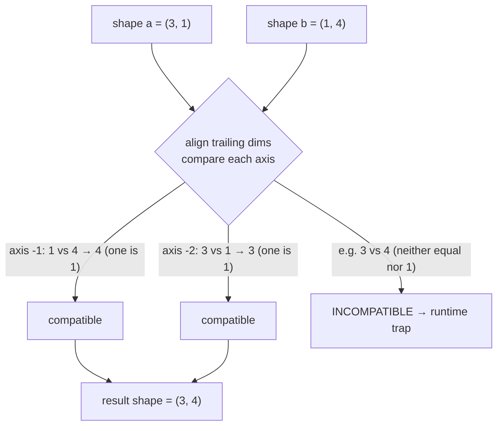

# `import coil` — numpy ndarray buffers from Cobrust (8/8 — final cobra-batch ecosystem module)

> Status: ADR-0072 8/8 first proof — coil is the EIGHTH and FINAL
> cobra-batch ecosystem module. Wired off the proven value-handle chain
> (the same shape den / molt / strike use), it completes the
> workspace-vendored ecosystem the v0.7.0 wave shipped. The first proof
> scoped to constructors + repr; ADR-0077 since added the operator /
> index / attribute surface — elementwise `a + b` / `a - b` / `a * b` /
> `a / b` (numpy **true division**, with **broadcasting**), scalar forms
> `a + 1` / `a * 2`, scalar `a[i]` read, and `a.shape` / `a.ndim` /
> `a.size`.

## Example first

```python
import coil

fn main() -> i64:
    let a: coil.Buffer = coil.zeros(3)
    let _ = coil.print_buffer(a)
    return 0
```

Build and run:

```bash
cobrust build prog.cb -o prog
./prog
# array([0, 0, 0], dtype=float64)
```

## What you get (first proof surface)

- **`coil.zeros(n: i64) -> Buffer`** — allocate an `n`-element f64-zero
  1-D buffer. Shape `[n]`. Negative `n` clamps to zero (defensive).
- **`coil.ones(n: i64) -> Buffer`** — allocate an `n`-element f64-one
  1-D buffer. Shape `[n]`.
- **`coil.eye(n: i64) -> Buffer`** — allocate the `n x n` f64 identity
  matrix (`k=0` main-diagonal). Shape `[n, n]` — proves the chain
  handles non-1-D buffers too (drop is shape-agnostic).
- **`coil.print_buffer(b: Buffer) -> i64`** — print the buffer's
  numpy-compatible `array_repr` to stdout. Returns `0` on success;
  `-1` if the receiver is null (defensive).

## Linear algebra — the `coil.linalg.*` sub-namespace (ADR-0079 Phase 1)

`coil.linalg.*` is the FIRST *dotted sub-namespace* under an ecosystem
module — it mirrors numpy's `np.linalg.*` idiom exactly (so the same
code an LLM writes for numpy works here, swapping only `np` → `coil`).
`coil.linalg` is a **namespace, not a value you bind**: you write
`coil.linalg.solve(a, b)` directly (you never `let la = coil.linalg`).

```python
import coil

fn main() -> i64:
    let a: coil.Buffer = coil.array2x2(1.0, 2.0, 3.0, 4.0)  # [[1,2],[3,4]]
    let b: coil.Buffer = coil.array1d2(5.0, 11.0)           # [5, 11]
    let x: coil.Buffer = coil.linalg.solve(a, b)            # solves A·x = b
    print((x[0] as i64))   # 1
    print((x[1] as i64))   # 2
    let d: f64 = coil.linalg.det(a)
    print((d as i64))      # -2
    return 0
```

- **`coil.linalg.solve(a: Buffer, b: Buffer) -> Buffer`** — solve the
  linear system `A · x = b` (LU partial pivot — LAPACK `*gesv`'s
  analogue). Returns the solution vector. `@py_compat(numerical(rtol=1e-6))`.
- **`coil.linalg.det(a: Buffer) -> f64`** — the determinant of a square
  matrix. Returns a plain `f64` (numpy's 0-d scalar is not a Cobrust
  type — a benign, documented divergence).
- **`coil.linalg.inv(a: Buffer) -> Buffer`** — the matrix inverse (via
  `solve(a, I)` — LAPACK `*getrf`+`*getri`'s analogue).

These wrap coil's **existing pure-Rust kernels** (no new numerical
code), so they ship on every target coil cross-compiles to (native /
RISC-V / WebAssembly) with zero system BLAS — the pure-Rust path is the
universal floor (ADR-0079 §6).

### Minimal 2-D / explicit-data constructors

`coil.linalg.*` needs 2-D matrices, but coil's other constructors are
1-D (and `coil.eye(n)` only makes the identity). These minimal
all-scalar-arg constructors build the small matrices the linalg surface
operates on:

- **`coil.array2x2(a, b, c, d: f64) -> Buffer`** — row-major `2 x 2`
  matrix `[[a, b], [c, d]]`.
- **`coil.array2x3(a, b, c, d, e, f: f64) -> Buffer`** — row-major
  `2 x 3` matrix (a non-square shape, e.g. for a `det` shape error).
- **`coil.array1d2(a, b: f64) -> Buffer`** — a 2-element 1-D vector
  `[a, b]` with explicit data (an arbitrary RHS like `[5, 11]` that
  `coil.ones` / `coil.mgrid` cannot produce).

> These are deliberately minimal (fixed small shapes). A general
> nested-list `coil.array([[1, 2], [3, 4]])` is a follow-up once
> `list[f64]` → coil marshalling lands. There is **no `np.matrix`
> legacy class** — only `Buffer` exists, and `coil.linalg.*` is matmul-
> style (the elegance ledger drops numpy's accumulated footguns).

### Shape / singularity errors are runtime traps

A `coil.Buffer` carries no rank or conditioning in its static type, so
shape / singularity errors surface at **runtime** (a clean process
abort with a diagnostic, never silent garbage):

- `coil.linalg.solve` / `coil.linalg.inv` of a **singular** matrix →
  runtime abort (`Singular matrix`).
- `coil.linalg.det` of a **non-square** matrix → runtime abort
  (`det requires a square matrix`). (A *singular* but square `det`
  returns `0.0` without aborting — matching numpy.)

Arity and unknown-member errors ARE caught at compile time:
`coil.linalg.solve(a)` (wrong arity) and `coil.linalg.solveX(a)`
(unknown member) are both type errors, not runtime crashes.

## Elementwise operators + broadcasting (`a + b`, `a - b`, `a * b`, `a / b`)

Two `coil.Buffer` handles add / subtract / multiply / **divide** with the
`+` / `-` / `*` / `/` operators — and, like numpy, the shapes do NOT have
to match: a **broadcastable** pair is stretched to a common shape first.
You can also write `a + 1` / `a - 1` / `a * 2` / `a / 2` — a buffer
combined with a plain number (a **scalar**), exactly as in numpy.

```text
import coil

fn main() -> i64:
    let a: coil.Buffer = coil.ones(3)     # shape (3,): [1, 1, 1]
    let b: coil.Buffer = coil.ones(1)     # shape (1,): [1]
    let c: coil.Buffer = a + b            # broadcasts (3,)+(1,) -> (3,): [2, 2, 2]
    let m: f64 = coil.mean(c)             # 2.0
    print((m as i64))                     # 2
    return 0
```

Equal shapes still work unchanged (`coil.ones(3) + coil.ones(3)` →
`[2, 2, 2]`), and `*` / `-` / `/` broadcast identically (they share the
same code path as `+`, so anything `+` broadcasts, the others broadcast
too).

### Division is *true division* (`/` always gives a float)

`a / b` is numpy's `/` — **true division** — so it ALWAYS produces a
floating-point result, never an integer floor. `[1, 2, 3] / [2]` is
`[0.5, 1.0, 1.5]`, NOT `[0, 1, 1]`. And division by zero follows IEEE 754
(exactly like numpy): it does **not** crash — `1.0 / 0.0` is `inf`,
`-1.0 / 0.0` is `-inf`, `0.0 / 0.0` is `nan`. The program keeps running.

```text
import coil

fn main() -> i64:
    let a: coil.Buffer = coil.array1d2(10.0, 20.0)  # [10, 20]
    let b: coil.Buffer = coil.array1d2(2.0, 4.0)    # [2, 4]
    let c: coil.Buffer = a / b                       # [5.0, 5.0]  (10/2, 20/4)
    let _ = coil.print_buffer(c)

    let one: coil.Buffer = coil.ones(1)              # [1.0]
    let zero: coil.Buffer = coil.zeros(1)            # [0.0]
    let inf: coil.Buffer = one / zero                # [inf]  (IEEE, NOT a crash)
    let _ = coil.print_buffer(inf)
    return 0
```

> Note: `/` is *true division*, not floor division. Cobrust does not yet
> wire `//` (floor division) on a buffer — `a // b` is a compile error
> today.

### Scalars: `a + 1`, `a * 2`, `a / 2`

A buffer combined with a plain number adds / subtracts / multiplies /
divides that number into **every element** — numpy's "array ⊕ scalar".
Under the hood the scalar is treated as a length-`1` buffer and broadcast,
so it reuses the exact same machinery as `a + b`.

```text
import coil

fn main() -> i64:
    let a: coil.Buffer = coil.mgrid(1, 4)   # [1.0, 2.0, 3.0]
    let c: coil.Buffer = a + 1              # [2.0, 3.0, 4.0]
    let d: coil.Buffer = a * 2              # [2.0, 4.0, 6.0]
    let e: coil.Buffer = a / 2              # [0.5, 1.0, 1.5]  (true division)
    let m: f64 = coil.mean(c)              # 3.0
    print((m as i64))                       # 3
    return 0
```

The scalar may be an integer (`a + 1`) or a float (`a + 1.5`); an integer
is promoted to a float automatically. A buffer combined with a *non-number*
(e.g. `a + "x"`) is still a compile error.

### The broadcasting rule (numpy-exact)

Cobrust uses the exact numpy rule. Align the two shapes from the
**trailing** (rightmost) dimension; a missing leading dimension counts
as `1`; two dimensions are compatible if they are **equal** OR **one of
them is `1`** (the size-`1` dimension is repeated); the result dimension
is the larger of the two.



Worked examples (every value is what numpy produces):

- `(3,1) + (1,4)` → `(3,4)` — the textbook outer sum.
- `(2,3) + (3,)` → `(2,3)` — matrix + row (the missing leading dim of
  `(3,)` counts as `1`).
- `(3,) + (1,)` → `(3,)` — a length-`1` buffer broadcasts across the
  longer one. (This is also exactly how a scalar `a + 1` works internally:
  the `1` becomes a length-`1` buffer.)

### Incompatible shapes are a runtime trap

Like `coil.linalg`, a `coil.Buffer` carries **no shape in its static
type**, so a non-broadcastable pair can only be caught at **runtime**: a
clean process abort with a numpy-style diagnostic, never a silently
wrong buffer.

- `coil.ones(3) + coil.ones(4)` → runtime abort: `operands could not be
  broadcast together with shapes [3] [4]` (`3` vs `4` is neither equal
  nor `1`). numpy raises the same error.
- `coil.mgrid(0, 5) + coil.ones(2)` → runtime abort (`5` vs `2`).

This is the one place §2.5's "catch it at compile time" cannot apply —
shape correctness is intrinsically a runtime property here (the handle
type is shape-agnostic). The trade is deliberate and documented in
ADR-0077: the operator mirrors numpy's surface (`a + b`, no `?`),
paying with a runtime check instead of a compile error.

## Why this design?

- **One value-handle ABI shape across den, molt, strike, coil**: every
  `Buffer` crosses as an opaque `*mut u8` pointer to a Boxed
  `coil::Array` (the existing tagged-union over `ndarray::ArrayD<T>`).
  The .cb caller owns the handle; scope-exit drop fires
  `__cobrust_coil_buffer_drop` exactly once, reclaiming the entire
  chain (Array → ArrayD → Vec<T>).
- **Compile-time-catch (§2.5 binding)**: `coil.flatten(a)` (not in the
  manifest) is rejected at type-check; `coil.zeros("three")` (wrong
  arg type) is rejected at type-check. No silent runtime surprise.
- **No `__init__.py` / no pip / no path drama**: `import coil` is the
  privileged ecosystem alias (ADR-0072 Q1); `cobrust build` static-
  links `libcoil.a` only when the source actually uses it (no link
  bloat).

## Today's limits

- **Elementwise operators**: `a + b` / `a - b` / `a * b` DO compile and
  now **broadcast** (ADR-0077 Phase 1 + Phase 3, see above). Still
  unshipped: `a / b`, the `@` matmul operator, and comparison operators
  (`a < b` → bool mask) — tracked in ADR-0077 §12.
- **No scalar broadcast yet**: `a + 1` (Buffer ⊕ a bare scalar) does NOT
  compile — only Buffer ⊕ Buffer broadcasts today (use a length-`1`
  buffer, e.g. `a + coil.ones(1)`). The mixed-operand manifest entry is
  a near-term follow-up.
- **No slice / index-write**: `a[1:3]` (slice read) and `a[i] = v`
  (index write) do NOT compile yet (scalar `a[i]` READ does). Tracked as
  the remainder of the ADR-0077 Phase-2 bundle.
- **No multi-handle methods**: `a.dot(b)` / `a.matmul(b)` etc do NOT
  compile yet — needs the manifest to grow receiver-and-arg shapes.
- **dtype is fixed to `float64`**: the first proof scopes to a single
  dtype to keep the wire surface minimal. A `coil.zeros(n, dtype)`
  shape with an explicit dtype tier is a follow-up.
- **No structured-data return from `print_buffer`**: the read method
  prints directly via `println!` on the Rust side. A future
  `Buffer.tolist() -> str` shape would lift the den-style
  `__cobrust_str_*` extern wiring (the build.rs deferral flag is
  already in place for that extension).

## Where the chain fits

```text
.cb `import coil` + `coil.zeros(3)` + `coil.print_buffer(a)`
  → cobrust-types ecosystem manifest (typecheck)          [L1]
  → cobrust-mir lowering (Str retarget → __cobrust_coil_*) [L2]
  → cobrust-codegen externs + handle drop                  [L3]
  → cobrust-coil C-ABI shims (libcoil.a)                   [L4]
  → cobrust-cli build.rs per-import static link            [L5]
```

The first four cobra-batch data modules (`den`/`nest`/`strike`/
`scale`/`molt`) walked through this chain ahead of `coil`; `coil` is
the LAST module to ship through it. The chain's MIR / HIR / drop /
link-locate layers are **unchanged** by this proof — chain generality
holds for the eighth time.
