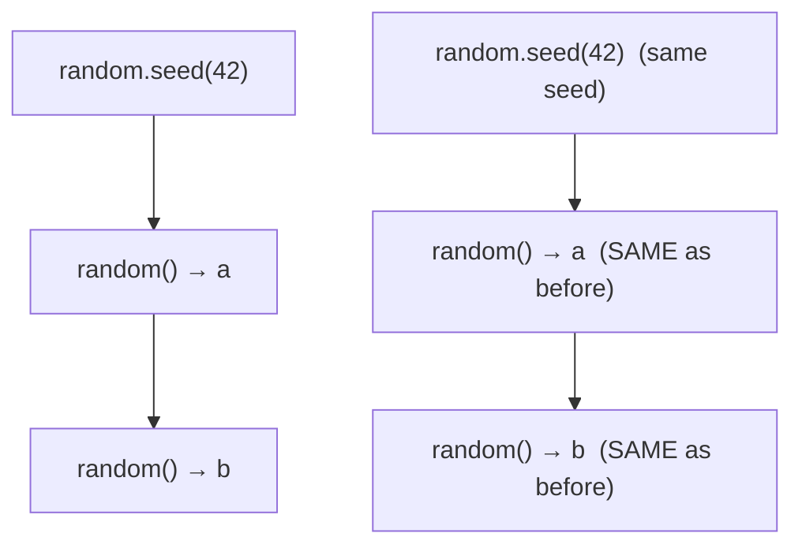

# `import random` — pseudo-random sampling from Cobrust

> Status: ADR-0086. Pseudo-random sampling — sampling, simulation, and
> randomized testing are universal in Python. This first cut ships the four
> scalar functions (`random`, `randint`, `uniform`, `seed`); the list forms
> (`choice`, `shuffle`, `sample`) are a documented follow-up.

## Example first

```python
import random

fn main() -> i64:
    # Re-seed so the run is reproducible (same seed → same stream).
    let _ = random.seed(42)

    # A uniform float in [0, 1).
    let x: f64 = random.random()

    # A uniform int in [1, 6] — INCLUSIVE on both ends (a die roll).
    let d: i64 = random.randint(1, 6)
    print(d)

    # A uniform float in [a, b].
    let t: f64 = random.uniform(-1.0, 1.0)

    # Re-seed with the SAME value → the SAME next draw.
    let _ = random.seed(42)
    let y: f64 = random.random()
    if x == y:
        print("reproducible")        # prints — same seed, same stream

    return 0
```

Build and run it:

```bash
cobrust build prog.cb -o prog
./prog
```

## What you get

| Function | Returns | What it does |
|---|---|---|
| `random.random()` | `f64` | a uniform float in **`[0, 1)`** (no argument) |
| `random.randint(a, b)` | `int` | a uniform int in **`[a, b]`, inclusive both ends** |
| `random.uniform(a, b)` | `f64` | a uniform float in **`[a, b]`** |
| `random.seed(n)` | — | re-seed the generator (same seed → same stream) |

### `random.randint` includes BOTH ends

This is the one thing to remember: `randint(a, b)` can return **either**
endpoint.

```python
random.randint(5, 5)   # always 5
random.randint(1, 6)   # any of 1, 2, 3, 4, 5, 6 — a fair die, 6 included
```

(If you have ever written a "random index" with the wrong upper bound and
never seen the last element — that off-by-one is exactly what `randint`'s
inclusive range avoids.)

### `random.random()` and `random.uniform()`

```python
random.random()            # 0.0 <= x < 1.0   (the unit interval)
random.uniform(2.5, 9.5)   # 2.5 <= x <= 9.5
random.uniform(-5.0, -1.0) # works for any range, including negative
```

### `random.seed()` makes runs reproducible

Seeding is the whole point of this module for testing: **the same seed
produces the same sequence**, every time.



```python
let _ = random.seed(42)
let a: f64 = random.random()
let _ = random.seed(42)
let b: f64 = random.random()
# a == b  — guaranteed
```

Without a `seed(...)` call, the generator is seeded from the operating
system's entropy on first use — so an un-seeded program is genuinely
non-deterministic (that is the feature). Because of that, you can never
assert a *raw* draw's value; what you *can* assert is the
**seed-reproducibility equality** above and that a draw falls in its range.

> Note: in Python, `random.seed(n)` returns `None`. In Cobrust the call
> yields a throwaway value you discard with `let _ = random.seed(n)`. The
> re-seed is the effect; the returned value carries no information.

## Compatibility — `@py_compat(semantic)`

Cobrust's `random` is backed by the **PCG64** generator (the same one
`coil.random` uses, matching numpy's `default_rng` family). Python's
`random` module is backed by the **Mersenne Twister**.

What this means:

- **The distributions match.** `random()` is uniform on `[0, 1)`,
  `randint(a, b)` is uniform on the inclusive integers `[a, b]`,
  `uniform(a, b)` is uniform on `[a, b]` — exactly as in Python.
- **The exact numbers do NOT match Python.** For the same seed, Cobrust
  and CPython produce *different* streams (different generators). Cobrust
  does not, and does not try to, reproduce CPython's exact values.
- **Within Cobrust, the same seed always reproduces the same stream** — on
  any machine, any architecture (PCG64 is portable).

So: rely on the *distribution* and on *Cobrust-internal seed
reproducibility*; do not expect a Cobrust draw to equal the CPython draw
for the same seed. This is the same honest stance `coil.random` takes
toward numpy.

## What is not here yet

The list-based functions are a planned follow-up:

- `random.choice(seq)` — pick a random element.
- `random.shuffle(seq)` — shuffle a list in place.
- `random.sample(seq, k)` — pick `k` distinct elements.

They need a list argument (and `shuffle` mutates it), which is the next
step for the library surface. Using one today is a **compile-time error**
(an unknown function), not a silent wrong answer.

## Why this design?

- **One global generator, like Python.** `random.random()` and friends
  share a single hidden generator, re-seeded by `random.seed(...)` — just
  like Python's module-level functions. (When you want an *independent*,
  explicitly-held generator, that is `coil.random`'s `Generator` instead.)
- **`randint` is inclusive on both ends.** That is what Python does, and it
  is the form that avoids the classic "never hit the last value"
  off-by-one. The implementation uses an inclusive range so `randint(1, 6)`
  really can return 6.
- **Seed for reproducibility, OS-entropy by default.** A seeded run is
  reproducible (essential for tests); an un-seeded run is genuinely random.
- **Honest about the generator.** We use PCG64, not the Mersenne Twister,
  so we *say so* and promise the distribution + reproducibility rather than
  implying a bit-for-bit match with CPython that does not hold
  (constitution §5.2: no unscientific claims).
