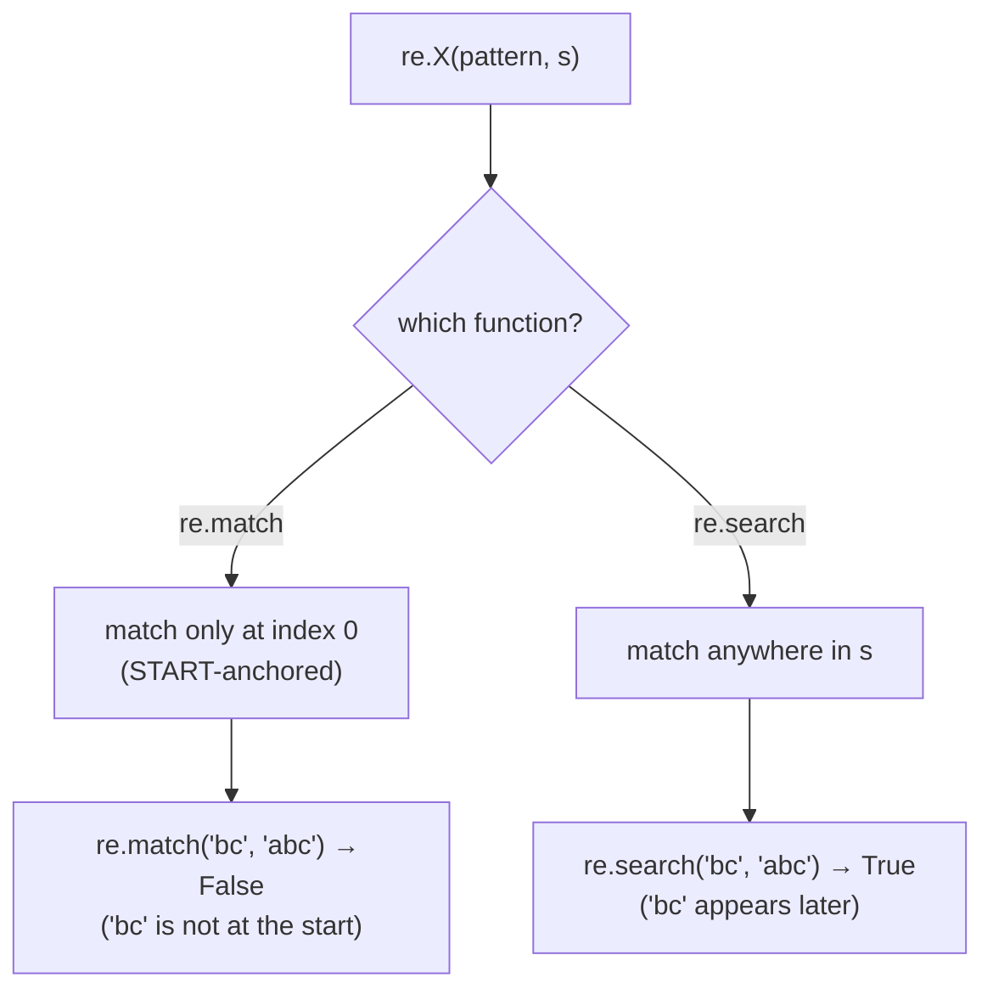

# `import re` — regular expressions from Cobrust

> Status: ADR-0084. Regular-expression processing — one of the most-used
> Python capabilities. This first cut ships the four stateless functions
> (`sub`, `findall`, `match`, `search`); the Match-object `.group()` form
> is a documented follow-up.

## Example first

```python
import re

fn main() -> i64:
    # Replace ALL matches.
    print(re.sub("a", "X", "banana"))           # bXnXnX

    # Find every match, then iterate the list.
    let nums: list[str] = re.findall("[0-9]+", "a1b22c333")
    for n in nums:
        print(n)                                # 1  /  22  /  333

    # match is START-anchored; search looks anywhere.
    if re.search("bc", "abc"):
        print("found bc somewhere")             # prints
    if re.match("bc", "abc"):
        print("starts with bc")                 # does NOT print
    else:
        print("does not start with bc")         # prints

    return 0
```

Build and run it:

```bash
cobrust build prog.cb -o prog
./prog
```

## What you get

| Function | Returns | What it does |
|---|---|---|
| `re.sub(pattern, repl, s)` | `str` | replace **all** non-overlapping matches |
| `re.findall(pattern, s)` | `list[str]` | **all** non-overlapping matches, as a list |
| `re.match(pattern, s)` | `bool` | does `pattern` match at the **start** of `s`? |
| `re.search(pattern, s)` | `bool` | does `pattern` match **anywhere** in `s`? |

### `re.sub` replaces ALL matches

```python
re.sub("a", "X", "banana")        # "bXnXnX"  — three replacements, not one
re.sub("[0-9]+", "#", "a1b22c333") # "a#b#c#" — each digit-run becomes one #
```

### `re.findall` gives you a real list you can iterate

```python
re.findall("[0-9]+", "a1b22c333")  # ["1", "22", "333"]
re.findall("[0-9]+", "abcdef")     # []  (no match → empty list)
```

The result is a normal `list[str]` — loop over it, index it, pass it
around.

### `re.match` vs `re.search` — the anchor matters

This is the one thing to remember: **`match` is anchored at the start;
`search` looks anywhere.**



```python
re.match("bc", "abc")   # False — "abc" does not START with "bc"
re.search("bc", "abc")  # True  — "bc" is in there (at index 1)
re.match("ab", "abc")   # True  — "abc" DOES start with "ab"
```

Both return a `bool`, so you use them directly in an `if`:

```python
if re.search("[0-9]+", line):
    print("the line has a number")
```

> Note: in Python, `re.match` / `re.search` return a *Match object* (or
> `None`). Cobrust's first cut returns a plain `bool`. The Match-object
> `.group()` surface is a planned follow-up.

## Compatibility — `@py_compat(semantic)`

Cobrust's `re` is backed by Rust's `regex` engine. For the everyday
patterns — character classes (`[0-9]`, `\w`, `\d`), quantifiers (`+`,
`*`, `?`, `{2,4}`), alternation (`a|b`), anchors (`^`, `$`), groups
(`(...)`) — it behaves like Python's `re`.

Two things differ (the documented divergence):

- **No backreferences** (`\1`) and **no lookaround** (`(?=...)`,
  `(?<=...)`). These are the price of `regex`'s linear-time guarantee. A
  pattern that uses them will **fail** (see "Invalid patterns" below).
- **`re.findall` returns the full matches.** For a pattern with no
  capture groups this is identical to Python. Python's group-capture
  behavior (one group → that group's text; several → tuples) is not yet
  mirrored — a grouped pattern gives you the whole match instead.

## Invalid patterns trap (they don't fail silently)

If you hand `re` a malformed pattern (for example `"["`), it **stops the
program with a clear error** — it does NOT quietly return "no match":

```python
import re

fn main() -> i64:
    print(re.sub("[", "X", "abc"))   # traps: cobrust panic: re: invalid pattern "["
    return 0
```

The program exits with a non-zero status and a message naming the bad
pattern. (Python raises `re.error`; Cobrust traps.) Today this happens at
**run time** because the pattern is a runtime string; catching a bad
**literal** pattern at *compile* time is a planned improvement.

## Why this design?

- **The four stateless functions first.** They cover the overwhelming
  majority of real `re` usage (substitute, find-all, test-for-a-match)
  and need no stateful Match object — so they map cleanly onto Cobrust's
  string / list / bool returns with zero new machinery.
- **`bool` for `match` / `search`, for now.** Most code uses
  `if re.search(...)`. Returning a `bool` makes that the natural,
  type-safe form; the richer Match object comes later.
- **Trap, don't lie, on a bad pattern.** A silent "no match" on a typo'd
  pattern is a classic Python footgun. Cobrust surfaces it loudly
  (constitution §2.2: no silent wrong answers).
