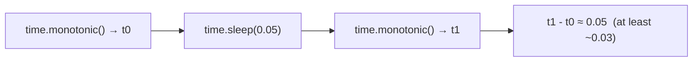

# `import time` — timing and timestamps from Cobrust

> Status: ADR-0087. Timing and timestamps — reading a clock and pausing a
> thread are universal in Python. This first cut ships the four scalar
> functions (`time`, `monotonic`, `perf_counter`, `sleep`); the calendar
> machinery (`strftime`, `gmtime`, …) and the integer-nanosecond variants
> (`time_ns`, …) are a documented follow-up.

## Example first

```python
import time

fn main() -> i64:
    # A timestamp: current Unix-epoch time in SECONDS (a wall clock).
    let now: f64 = time.time()
    if now > 1.7e9:
        print("after 2023")          # prints — a sane post-2023 epoch

    # Measure how long something takes with the monotonic clock.
    let start: f64 = time.monotonic()
    let _ = time.sleep(0.05)          # pause for 0.05 seconds
    let elapsed: f64 = time.monotonic() - start
    if elapsed >= 0.03:
        print("waited")              # prints — sleep really delayed

    # perf_counter is the SAME high-resolution clock as monotonic.
    let p: f64 = time.perf_counter()

    return 0
```

Build and run it:

```bash
cobrust build prog.cb -o prog
./prog
```

## What you get

| Function | Returns | What it does |
|---|---|---|
| `time.time()` | `f64` | current Unix-epoch time in **seconds** (a wall clock; no argument) |
| `time.monotonic()` | `f64` | seconds from a process-relative origin, **never goes backwards** (no argument) |
| `time.perf_counter()` | `f64` | **the same** high-resolution monotonic clock as `monotonic` (no argument) |
| `time.sleep(secs)` | — | suspend the current thread for `secs` seconds |

### Two clocks, two jobs

- **`time.time()` is a wall clock.** It answers "what time is it?" as a
  Unix timestamp in seconds (with a fractional part for sub-second
  precision). It can jump — forward or backward — if the system clock is
  adjusted (NTP, DST, a manual change). Use it for timestamps, not for
  measuring durations.

- **`time.monotonic()` is an interval clock.** It only ever moves forward
  and is immune to system-clock adjustments. Its absolute value is
  meaningless on its own (it counts from an arbitrary point when your
  program started) — its job is the *difference* between two readings.

```python
# Correct way to measure a duration:
let t0: f64 = time.monotonic()
# ... do work ...
let dt: f64 = time.monotonic() - t0      # seconds elapsed, always >= 0
```

### `time.perf_counter()` is the same clock as `monotonic`

Python documents `perf_counter` and `monotonic` as two named clocks. In
Cobrust they are **the same** highest-resolution monotonic clock — reading
either gives a value from one shared origin. Use whichever name reads
better; mixing them in a single `start` / `end` measurement is fine.

### `time.sleep()` pauses the thread

```python
let _ = time.sleep(0.5)    # pause for half a second
let _ = time.sleep(2.0)    # pause for two seconds
```

A non-positive sleep does nothing and returns immediately:

```python
let _ = time.sleep(0.0)    # no-op, returns at once
let _ = time.sleep(-1.0)   # no-op too — NOT an error, NOT a crash
```

> In Python, `time.sleep(-1)` raises a `ValueError`. Cobrust takes the
> gentler, safe path: a zero or negative sleep is simply a no-op. So if you
> compute a sleep from a subtraction (`time.sleep(deadline - now)`) and it
> comes out negative, your program keeps running instead of crashing.

> Note: in Python, `time.sleep(secs)` returns `None`. In Cobrust the call
> yields a throwaway value you discard with `let _ = time.sleep(secs)`. The
> pause is the effect; the returned value carries no information.



## Clocks are non-deterministic — what you can assert

A clock reading changes every time you read it, and `monotonic`'s origin
depends on when your program started, so you can never assert a clock's
*exact* value. What you *can* rely on:

- `time()` lands in a sane Unix-epoch range (after 2023, i.e. greater than
  `1.7e9` seconds).
- `monotonic()` called twice never decreases (`later >= earlier`).
- `sleep(d)` makes at least about `d` seconds pass (the operating system
  may sleep a little *longer*, never meaningfully *shorter*).

## Compatibility — `@py_compat(semantic)`

A clock is part of the environment, not a pure function, so Cobrust does
**not** reproduce CPython's exact float values:

- **The clock *semantics* match.** `time()` is a wall clock in Unix-epoch
  seconds; `monotonic()` / `perf_counter()` are a non-decreasing interval
  clock in seconds; `sleep(secs)` suspends for `secs` seconds — exactly as
  in Python.
- **The exact numbers do NOT match Python.** A different epoch rounding and
  a different (process-relative) monotonic origin mean the raw floats
  differ. `sleep` is best-effort, as it is in every language.

This is the same honest stance `random` takes toward CPython's generator:
rely on the *behavior* and the *ordering*, not on a bit-for-bit match.

## What is not here yet

A planned follow-up:

- `time.time_ns()` / `time.monotonic_ns()` / `time.perf_counter_ns()` — the
  integer-nanosecond variants.
- `time.process_time()` / `time.thread_time()` — CPU-time clocks.
- `time.gmtime()` / `time.localtime()` / `time.strftime()` /
  `time.strptime()` / … — calendar formatting and `struct_time` (needs a
  date/time structure plus timezones).

Using one today is a **compile-time error** (an unknown function), not a
silent wrong answer.

## Why this design?

- **One shared monotonic origin, captured lazily.** `monotonic` and
  `perf_counter` measure from one fixed point per program, captured the
  first time you call either — so every part of your program (and every
  thread) sees one consistent timeline. (This is the opposite of `random`,
  where each thread *wants* its own stream.)
- **`perf_counter` is the same clock as `monotonic`.** The standard library
  monotonic clock already *is* the highest-resolution timer the platform
  offers, so a separate clock would just return the same numbers. We keep
  both names but unify the clock.
- **A negative sleep is a no-op, not a crash.** A zero or negative pause has
  nothing to wait for, so returning at once is the safe, surprise-free
  choice — friendlier than crashing on a computed-negative duration.
- **Honest about the clock.** Clock readings depend on the machine and the
  moment, so we promise the *semantics* and the *ordering* rather than
  implying a bit-for-bit match with CPython that no clock could hold
  (constitution §5.2: no unscientific claims).
