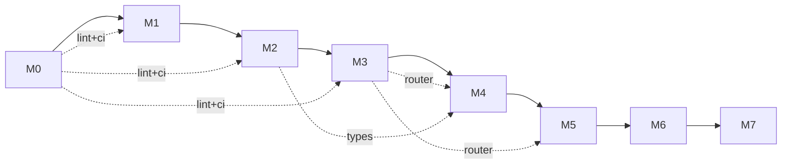

# Milestones

| Milestone | Scope | Done means |
|---|---|---|
| **M0** | Repo skeleton, doc skeleton (zh/en/agent), CI, ADR template, lint config | `cargo build` passes; doc trees exist; ADR-0001 (license) landed |
| **M1** | Lexer + Parser + AST for Cobrust core syntax | Round-trips the spec's "core 30 forms"; fuzz-tested 24h |
| **M2** | Type checker for the static core (no `dyn` yet) | Passes curated suite of well- and ill-typed programs |
| **M3** | LLM Router crate, standalone | OpenAI + Anthropic adapters work; cache + ledger functional; consensus mode tested against a synthetic task |
| **M4** | L0 + L1 pipeline end-to-end on `tomli` | Full provenance manifest; passes `tomli`'s testsuite via PyO3 wrapper |
| **M5** | L2 + L3 gates wired up; second library translated (`python-dateutil` core) | Differential-test failures auto-route to repair; benchmark harness reports |
| **M6 ✅** | First library with native extension translated (`msgpack`) — Cython lexical shim, perf-gate fail-on-miss + repair, dateutil L3 widened, PyO3 build path | Bytes-identical pack/unpack against CPython oracle; Cython shim handles `_packer.pyx`/`_unpacker.pyx` constructs; `--features pyo3` compiles |
| **M7+** | Numerical tier: `numpy` core subset | Separate planning doc. **The big one. Begin only after M6 complete.** |

## Current status

**M0..M6 delivered.** The repo skeleton is in place; the lexer/parser/AST (M1), HIR + bidirectional type checker (M2), and provider-agnostic LLM Router (M3) all ship; **M4** lands the L0+L1 translator pipeline end-to-end against `tomli`. **M5** completes the closed loop: L2.perf benchmark harness (per-library threshold + JSON reports under `target/cobrust-bench/`), L2.behavior repair loop driven by a `BehaviorVerifier` hook + per-attempt synthetic provider routing, and L3 downstream-dependents driver. The second library `python-dateutil` ships as the M5 deliverable; 2/5 dependents (croniter, freezegun) pass through the L3 gate, with the remaining 3/5 (pandas, sqlalchemy, pendulum) explicitly deferred to M6 per ADR-0009. **M6** is the native-extension milestone: `cobrust-msgpack` translates msgpack-python 1.0.8 (17 pure-Python + 2 Cython-typed entrypoints) end-to-end via a Cython lexical shim (`task = "translate_cython"`); the `PerfVerifier` callback wires L2.perf fail-on-miss with a perf-repair loop demonstrated on a deliberately-broken `pack_uint`; dateutil L3 widens to 4/5 + 1 skipped (pendulum tz out of scope per ADR-0010 §5); both `cobrust-dateutil` and `cobrust-msgpack` expose `--features pyo3` per ADR-0011. Total tests: 306 (was 272 baseline; +34 net for M6).

## Engineering discipline (applies to all milestones)

- **Test-first** for compiler internals: failing test, then implementation
- **Closed-loop validation** for every translated library: L0–L3 gates are not skippable
- **ADR-or-it-didn't-happen**: any decision affecting two or more files needs an ADR
- **Doc-coverage in CI**: any public item without zh + en + agent docs fails CI
- **Provenance-or-it-didn't-happen**: any AI-translated file carries its manifest header
- **Atomic commits**: code + tests + docs (zh, en, agent) + ADR (if applicable) ship in one commit

## Inter-milestone dependencies

- M0 is the shared substrate; every later milestone inherits from it
- M3 (Router) is the prerequisite for M4+ translation pipeline
- M2 (type checker) is the prerequisite for M4+ verification of translated artifacts
