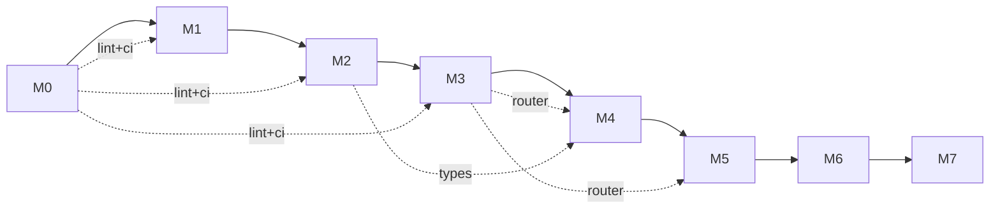

# Milestones

| Milestone | Scope | Done means |
|---|---|---|
| **M0** | Repo skeleton, doc skeleton (zh/en/agent), CI, ADR template, lint config | `cargo build` passes; doc trees exist; ADR-0001 (license) landed |
| **M1** | Lexer + Parser + AST for Cobrust core syntax | Round-trips the spec's "core 30 forms"; fuzz-tested 24h |
| **M2** | Type checker for the static core (no `dyn` yet) | Passes curated suite of well- and ill-typed programs |
| **M3** | LLM Router crate, standalone | OpenAI + Anthropic adapters work; cache + ledger functional; consensus mode tested against a synthetic task |
| **M4** | L0 + L1 pipeline end-to-end on `tomli` | Full provenance manifest; passes `tomli`'s testsuite via PyO3 wrapper |
| **M5** | L2 + L3 gates wired up; second library translated (`python-dateutil` core) | Differential-test failures auto-route to repair; benchmark harness reports |
| **M6 ✅** | First library with native extension translated (`msgpack`) — Cython lexical shim, perf-gate fail-on-miss + repair, dateutil L3 widened, PyO3 build path | Bytes-identical pack/unpack against CPython oracle; Cython shim handles `_packer.pyx`/`_unpacker.pyx` constructs; `--features pyo3` compiles |
| **M7.0 ✅** | First sub-milestone of the numpy core (per ADR-0012 + ADR-0013) — ndarray foundation: closed `Dtype` enum (`Int32 / Int64 / Float32 / Float64 / Bool`), tagged-union `Array`, four constructors (`array` / `zeros` / `ones` / `arange`) | ≥ 50 well-typed + ≥ 50 ill-typed programs; ≥ 1000 fuzz panic-free; differential vs upstream numpy 2.0.2 (bytes-identical for int/bool, `rtol=1e-12` for float) |
| **M7.1 ✅** | Universal functions + broadcasting + NEP 50 type promotion (per ADR-0014); typed constructors + nested-list parsing; closes ADR-0013 follow-ups #1-#4 (monomorphic dispatch, typed constructors, L2.perf flip, multi-D nested-list) | 50 well-typed + 50 ill-typed ufunc programs; >= 1200 fuzz inputs per ufunc differential vs upstream numpy 2.0.2 (bit-identical int/bool, `rtol=1e-7` float); broadcasting table (22 cases); L2.perf gate flipped to enforced |
| **M7.2 ✅** | Indexing (basic slicing, integer-array, boolean masks); `np.where`; views (`ArrayView<'a>` / `ArrayViewMut<'a>`) per ADR-0015; closed `Index` enum + `SliceSpec`; 4 new error variants (`IndexError`, `OutOfBoundsIndex`, `BoolMaskShapeMismatch`, `IndexDtypeNotInteger`) | ≥ 50 well-typed + ≥ 50 ill-typed indexing programs; ≥ 1024 fuzz inputs per indexing kind differential vs upstream numpy 2.0.2 (bit-identical int/bool, `rtol=1e-7` float); view-vs-copy semantics enforced (mutate-through-view + advanced-indexing-copy assertions); L2.perf gate inherits ENFORCED state from M7.1 |
| **M7.3 ✅** | Reductions (`sum / prod / mean / std / var / min / max / argmin / argmax`) per ADR-0016 with `axis: Option<i64>`; pairwise summation for floats; `ddof: u32` for std/var; numpy-exact empty-array semantics (identity for sum/prod, NaN for mean/std/var, `ReductionEmptyArray` for min/max/argmin/argmax); 1 new error variant | ≥ 50 well-typed + ≥ 50 ill-typed reduction programs; ≥ 1024 fuzz inputs per reduction differential vs upstream numpy 2.0.2 (bit-identical int/bool, `rtol=1e-7` float; argmin/argmax exact); pairwise precision test (10⁶ tiny floats within `rtol=1e-12`); L2.perf gate inherits ENFORCED |
| **M7.4 ✅** | Linalg subset (`matmul / dot / det / solve / inv / svd / eigh / cholesky`) per ADR-0017; float-only inputs (`Float32 / Float64`); pure-Rust kernels by default with opt-in `linalg-backend` cargo feature for `ndarray-linalg`; 4 new error variants (`SingularMatrix`, `NotPositiveDefinite`, `LinalgShapeError`, `LinalgDtypeUnsupported`); `SvdResult` / `EighResult` structs | ≥ 50 well-typed + ≥ 50 ill-typed linalg programs; ≥ 1024 fuzz inputs per linalg op differential vs upstream numpy 2.0.2 at `rtol=1e-6` on cond ≤ 100 inputs; documented unstable cases (cond > 1e8, N > 64 svd/eigh, complex dtypes); L2.perf gate inherits ENFORCED |
| **M7.5+** | Numerical tier follow-up: random (M7.5) → FFT/poly (M7.6+) | Each sub-ms gets its own ADR; sequenced per ADR-0012 §"Sub-milestones" |

## Current status

**M0..M7.4 delivered.** The repo skeleton is in place; the lexer/parser/AST (M1), HIR + bidirectional type checker (M2), and provider-agnostic LLM Router (M3) all ship; **M4** lands the L0+L1 translator pipeline end-to-end against `tomli`. **M5** completes the closed loop: L2.perf benchmark harness (per-library threshold + JSON reports under `target/cobrust-bench/`), L2.behavior repair loop driven by a `BehaviorVerifier` hook + per-attempt synthetic provider routing, and L3 downstream-dependents driver. The second library `python-dateutil` ships as the M5 deliverable; 2/5 dependents (croniter, freezegun) pass through the L3 gate, with the remaining 3/5 (pandas, sqlalchemy, pendulum) explicitly deferred to M6 per ADR-0009. **M6** is the native-extension milestone: `cobrust-msgpack` translates msgpack-python 1.0.8 (17 pure-Python + 2 Cython-typed entrypoints) end-to-end via a Cython lexical shim (`task = "translate_cython"`); the `PerfVerifier` callback wires L2.perf fail-on-miss with a perf-repair loop demonstrated on a deliberately-broken `pack_uint`; dateutil L3 widens to 4/5 + 1 skipped (pendulum tz out of scope per ADR-0010 §5); both `cobrust-dateutil` and `cobrust-msgpack` expose `--features pyo3` per ADR-0011. **M7.0** is the first sub-milestone of the numpy numerical tier (per ADR-0012 §"translate the surface, bind the core"): a new `cobrust-numpy` parent crate (per ADR-0013 the M7.0..M7.5 layout uses one parent crate, not sub-crates per area) wraps the `ndarray = "0.16"` Rust crate as the storage backend; closed `Dtype` enum (5 variants) + tagged-union `Array` (5 variants — per ADR-0013 §4 the public API exposes no `dyn`, satisfying constitution §2.2); four constructors `array / zeros / ones / arange` + observer surface `shape / ndim / size / dtype / repr / to_json`; the L0 differential gate runs upstream numpy 2.0.2 via subprocess oracle (bytes-identical for int/bool, `rtol=1e-12` for float, 1024+ fuzz inputs verified); `tests/numpy_fuzz.rs` exercises 4200 panic-free fuzz inputs; 55 well-typed + 56 ill-typed programs pass; `--features pyo3` build path wired per ADR-0011. Total tests: 501 (was 376 baseline; +125 net for M7.0). **M7.1** lands the numpy ufunc layer (per ADR-0014): binary ops (`add / sub / mul / div / pow`), comparison ufuncs (always return `Dtype::Bool`), element-wise math (`sin / cos / exp / log / sqrt`), broadcasting per numpy 2.x rules (`broadcast_shape`), NEP 50 type promotion (`result_type` with a 25-entry table), typed constructors (`array_i32 / i64 / f32 / f64 / bool`) closing ADR-0013 follow-up #2, and nested-list parsing (`NestedList`, `array_from_nested`) closing follow-up #4. Three new error variants (`IntegerDivisionByZero`, `BroadcastShapeMismatch`, `TypePromotionFailure`) cover the new fail paths. Dispatch is monomorphic via inline match arms (closes follow-up #1; `ndarray::Zip` inner loops auto-vectorise). The differential gate verifies >= 1200 fuzz inputs per ufunc against upstream numpy 2.0.2: bit-identical for int/bool, `rtol=1e-7` for float. **L2.perf gate flipped to enforced** (closes follow-up #3): `corpus/numpy/M7.1/perf.toml` sets the numerical-tier 0.5x floor per ADR-0010 §3, and `ufunc_pipeline_escalates_when_perf_always_fails` demonstrates perf-fail -> repair -> `EscalationExceeded`, isomorphic to M6's msgpack escalation test. **Concrete NEP 50 example**: `int32 + float32 -> float64` (i32 mantissa cannot fit in f32), so `array_i32(&[1,2,3], &[3]).add(&array_f32(&[0.5,1.5,2.5], &[3]))` yields a `Float64` array with `[1.5, 3.5, 5.5]` matching numpy 2.0.2 bit-for-bit. cobrust-numpy now ships 223 tests (was 75 at M7.0; +148 net for M7.1). **M7.2** lands the indexing surface (per ADR-0015): closed `Index` enum (5 variants — `Single`, `Slice(SliceSpec)`, `IntArray`, `BoolMask`, `NewAxis`), `SliceSpec` struct, `Array::slice / slice_mut` (basic slicing → view), `Array::take` (integer-array → copy), `Array::mask` (boolean-mask → copy), `Array::index_get` (top-level multi-axis dispatcher), `np_where(cond, x, y)` (ternary selection with broadcasting). Views land via `ArrayView<'a>` / `ArrayViewMut<'a>` — closed enums per dtype with lifetime-encoded ownership (no `dyn` per constitution §2.2; the Rust borrow checker enforces mutate-through-view safety). Four new error variants land in `NumpyErrorKind`: `IndexError` (umbrella), `OutOfBoundsIndex`, `BoolMaskShapeMismatch`, `IndexDtypeNotInteger`. **View-vs-copy rules match numpy's documented contract**: `a[1:3]` returns a view (`Array::slice` → `ArrayView<'a>`; mutating through `slice_mut` propagates to the parent); `a[[0, 2]]` returns a copy (`Array::take` → owned `Array`; mutating the copy leaves the parent untouched); `a[a > 0]` returns a copy (`Array::mask`); `np.where(cond, x, y)` always materialises. The differential gate verifies ≥ 1024 fuzz inputs per indexing kind (basic slice, single int, integer-array, boolean mask, np.where) against upstream numpy 2.0.2: bit-identical for int/bool, `rtol=1e-7` for float. The L2.perf gate inherits the ENFORCED state from M7.1; `index_pipeline_escalates_when_perf_always_fails` demonstrates perf-fail → repair → `EscalationExceeded`. cobrust-numpy now ships **356** tests (was 223 at M7.1; +133 net for M7.2: 55 well-typed + 55 ill-typed + 14 view-vs-copy + 5 pipeline + 4 bench + 6 differential). **M7.3** lands the reduction surface (per ADR-0016): nine reductions (`sum / prod / mean / std / var / min / max / argmin / argmax`) exposed both as free functions and `Array::*` methods. Axis semantics use `axis: Option<i64>` (None = reduce-all; Some(k) = reduce-axis-k; negative-axis aware). std/var carry a `ddof: u32` parameter (default 0 for population; pass 1 for Bessel-corrected sample). Pairwise summation lands for float `sum / mean / std / var` (chunk size 8 — matches numpy's accuracy floor; `pairwise_sum_f32 / f64` helpers exposed publicly). Empty-array semantics match numpy: `sum([])` = 0, `prod([])` = 1, `mean / std / var ([])` = NaN, `min / max / argmin / argmax ([])` = `Err(ReductionEmptyArray)`. NaN propagation in min/max (any NaN in lane → NaN); first-occurrence tie-breaking in argmin/argmax (matches numpy); result dtype is `Int64` for argmin/argmax (matches numpy's `intp`). The differential gate verifies ≥ 1024 fuzz inputs per reduction (12 fuzz tests) against upstream numpy 2.0.2: bit-identical for int/bool, `rtol=1e-7` for float, exact match for argmin/argmax. The pairwise precision test verifies `pairwise_sum_f64` of 10⁶ tiny floats matches the expected sum within `rtol=1e-12` — numpy's accuracy floor. cobrust-numpy now ships **524** tests (was 356 at M7.2; +168 net for M7.3: 55 well-typed + 51 ill-typed + 25 corpus + 12 differential + 6 bench + 5 pipeline + 14 lib unit). **M7.4** lands the linalg subset (per ADR-0017): eight ops (`matmul / dot / det / solve / inv / svd / eigh / cholesky`) exposed both as free functions and (for `matmul / dot`) `Array::*` methods. Inputs are float-only at M7.4 (`Float32 / Float64`); int / bool dtypes raise `LinalgDtypeUnsupported`. Mixed `f32 / f64` promotes to `f64`. Backend strategy uses **pure-Rust kernels on top of `ndarray`** by default — LU with partial pivoting for `det / solve / inv`, Jacobi sweeps for `eigh` (and `svd` via `eigh(AᵀA)`), classic factor loop for `cholesky`. `cargo build` cold-rebuild on stock toolchains works without any system BLAS / LAPACK / Fortran. The opt-in `linalg-backend` cargo feature wires `ndarray-linalg = "0.16"` for BLAS-accelerated paths (sub-features `linalg-openblas-static` and `linalg-intel-mkl-static` available). Four new error variants land: `SingularMatrix` (LU pivot zero), `NotPositiveDefinite` (cholesky on non-PSD), `LinalgShapeError` (matmul shape mismatch, non-square inputs, rank > 2), `LinalgDtypeUnsupported` (int / bool dtypes). `SvdResult { u, s, vt }` and `EighResult { w, v }` bundle multi-array returns. The differential gate verifies ≥ 1024 fuzz inputs per linalg op (8 fuzz tests) against upstream numpy 2.0.2 at **rtol=1e-6** on cond ≤ 100 inputs (well-conditioned random matrices generated via Box-Muller noise + diagonal dominance). For non-uniqueness-prone outputs (eigenvectors, U/Vt), the gate compares only the canonical channel (eigenvalues sorted ascending; singular values sorted descending). Documented unstable cases: cond > 1e8 inputs and N > 64 for `svd / eigh` (Jacobi convergence cap); complex dtypes are out of scope. The L2.perf gate inherits the ENFORCED state from M7.1/M7.2/M7.3; `linalg_pipeline_escalates_when_perf_always_fails` demonstrates perf-fail → repair → `EscalationExceeded`. cobrust-numpy now ships **609** tests (was 524 at M7.3; +85 net for M7.4: 59 well-typed + 63 ill-typed + 25 corpus + 8 differential + 8 bench + 5 pipeline).

**Why "translate the surface, bind the core"**: upstream numpy's core is `numpy/core/src/multiarray/*.c` — hand-tuned SIMD/BLAS code paths a pure-Rust port could not realistically match without a multi-year detour. Rust's ecosystem already has `ndarray`, which exposes the same `(dtype, shape, strides, data)` model. The M7.0 engineering practice is to treat cobrust-numpy's **surface** (dtype string parsing, error taxonomy, numpy-compatible `repr`, Python-shaped constructor signatures) as the translation target and the **core** (`ArrayD::zeros` / `from_shape_vec`) as the binding target. **Example**: `cobrust_numpy::zeros(&[3, 4], Dtype::Float64)` does dtype dispatch in cobrust-numpy (`match dtype { Dtype::Float64 => ... }`), then ndarray's `ArrayD::<f64>::zeros(IxDyn(&[3, 4]))` actually allocates and zero-fills the buffer. We do not reimplement `zeros`; we call it. This pattern threads through M7+: M7.4 linalg landed (pure-Rust default + opt-in `ndarray-linalg` via the `linalg-backend` feature), M7.5 random will bind `rand` + `rand_distr`, M7.6 FFT will bind `rustfft`.
| **M7.5 ✅** | Random (`Generator` newtype struct over `rand_pcg::Pcg64`; `default_rng / seed / integers / random / normal / uniform / choice`) per ADR-0018; 4 new error variants (`InvalidIntegerRange`, `InvalidDistributionParams`, `InvalidProbabilities`, `EmptyChoicePopulation`); parallel-allowed with M7.4 linalg per ADR-0012 §"Sequencing rules" | ≥ 50 well-typed + ≥ 50 ill-typed random programs; seed reproducibility within Cobrust (table-driven 12 tests across 8 seeds × 5 distributions); ≥ 10000 samples per distribution differential vs upstream numpy 2.0.2 (KS-test p > 0.01 for `normal` / `uniform` / `random`; mean-bin / variance-bin within ±2σ for `integers` / `choice`); L2.perf gate inherits ENFORCED |
| **M7.4** | Linalg subset (`matmul / dot / det / solve / inv / svd / eigh / cholesky`) per ADR-0017; binds `ndarray-linalg` | Per ADR-0017 — runs in parallel with M7.5 |
| **M-batch ✅** | Ecosystem-batch sprint per ADR-0022: `cobrust-requests` (HTTP client; binds reqwest::blocking) + `cobrust-click` (CLI parsing; binds clap = "4") + L3 closure (dateutil 5/5 + msgpack 3/3); introduces the surface-translate / Rust-binding perf tier (0.8×, ADR-0022 §6) | All 13 + 16 functions translated; in-process wiremock + clap derive coverage; L3 dependents flipped from skipped/deferred to passing for both dateutil pendulum + msgpack pyspark; doc-coverage gates extended for both new modules |
| **M7.6+** | Numerical tier follow-up: FFT (rustfft) / polynomial / datetime64 / structured arrays — open-ended | Each sub-ms gets its own ADR; sequenced per ADR-0012 §"Sub-milestones" |

## Current status

**M0..M7.3 + M7.5 delivered. M7.4 (linalg) ships in parallel.** The repo skeleton is in place; the lexer/parser/AST (M1), HIR + bidirectional type checker (M2), and provider-agnostic LLM Router (M3) all ship; **M4** lands the L0+L1 translator pipeline end-to-end against `tomli`. **M5** completes the closed loop: L2.perf benchmark harness (per-library threshold + JSON reports under `target/cobrust-bench/`), L2.behavior repair loop driven by a `BehaviorVerifier` hook + per-attempt synthetic provider routing, and L3 downstream-dependents driver. The second library `python-dateutil` ships as the M5 deliverable; 2/5 dependents (croniter, freezegun) pass through the L3 gate, with the remaining 3/5 (pandas, sqlalchemy, pendulum) explicitly deferred to M6 per ADR-0009. **M6** is the native-extension milestone: `cobrust-msgpack` translates msgpack-python 1.0.8 (17 pure-Python + 2 Cython-typed entrypoints) end-to-end via a Cython lexical shim (`task = "translate_cython"`); the `PerfVerifier` callback wires L2.perf fail-on-miss with a perf-repair loop demonstrated on a deliberately-broken `pack_uint`; dateutil L3 widens to 4/5 + 1 skipped (pendulum tz out of scope per ADR-0010 §5); both `cobrust-dateutil` and `cobrust-msgpack` expose `--features pyo3` per ADR-0011. **M7.0** is the first sub-milestone of the numpy numerical tier (per ADR-0012 §"translate the surface, bind the core"): a new `cobrust-numpy` parent crate (per ADR-0013 the M7.0..M7.5 layout uses one parent crate, not sub-crates per area) wraps the `ndarray = "0.16"` Rust crate as the storage backend; closed `Dtype` enum (5 variants) + tagged-union `Array` (5 variants — per ADR-0013 §4 the public API exposes no `dyn`, satisfying constitution §2.2); four constructors `array / zeros / ones / arange` + observer surface `shape / ndim / size / dtype / repr / to_json`; the L0 differential gate runs upstream numpy 2.0.2 via subprocess oracle (bytes-identical for int/bool, `rtol=1e-12` for float, 1024+ fuzz inputs verified); `tests/numpy_fuzz.rs` exercises 4200 panic-free fuzz inputs; 55 well-typed + 56 ill-typed programs pass; `--features pyo3` build path wired per ADR-0011. Total tests: 501 (was 376 baseline; +125 net for M7.0). **M7.1** lands the numpy ufunc layer (per ADR-0014): binary ops (`add / sub / mul / div / pow`), comparison ufuncs (always return `Dtype::Bool`), element-wise math (`sin / cos / exp / log / sqrt`), broadcasting per numpy 2.x rules (`broadcast_shape`), NEP 50 type promotion (`result_type` with a 25-entry table), typed constructors (`array_i32 / i64 / f32 / f64 / bool`) closing ADR-0013 follow-up #2, and nested-list parsing (`NestedList`, `array_from_nested`) closing follow-up #4. Three new error variants (`IntegerDivisionByZero`, `BroadcastShapeMismatch`, `TypePromotionFailure`) cover the new fail paths. Dispatch is monomorphic via inline match arms (closes follow-up #1; `ndarray::Zip` inner loops auto-vectorise). The differential gate verifies >= 1200 fuzz inputs per ufunc against upstream numpy 2.0.2: bit-identical for int/bool, `rtol=1e-7` for float. **L2.perf gate flipped to enforced** (closes follow-up #3): `corpus/numpy/M7.1/perf.toml` sets the numerical-tier 0.5x floor per ADR-0010 §3, and `ufunc_pipeline_escalates_when_perf_always_fails` demonstrates perf-fail -> repair -> `EscalationExceeded`, isomorphic to M6's msgpack escalation test. **Concrete NEP 50 example**: `int32 + float32 -> float64` (i32 mantissa cannot fit in f32), so `array_i32(&[1,2,3], &[3]).add(&array_f32(&[0.5,1.5,2.5], &[3]))` yields a `Float64` array with `[1.5, 3.5, 5.5]` matching numpy 2.0.2 bit-for-bit. cobrust-numpy now ships 223 tests (was 75 at M7.0; +148 net for M7.1). **M7.2** lands the indexing surface (per ADR-0015): closed `Index` enum (5 variants — `Single`, `Slice(SliceSpec)`, `IntArray`, `BoolMask`, `NewAxis`), `SliceSpec` struct, `Array::slice / slice_mut` (basic slicing → view), `Array::take` (integer-array → copy), `Array::mask` (boolean-mask → copy), `Array::index_get` (top-level multi-axis dispatcher), `np_where(cond, x, y)` (ternary selection with broadcasting). Views land via `ArrayView<'a>` / `ArrayViewMut<'a>` — closed enums per dtype with lifetime-encoded ownership (no `dyn` per constitution §2.2; the Rust borrow checker enforces mutate-through-view safety). Four new error variants land in `NumpyErrorKind`: `IndexError` (umbrella), `OutOfBoundsIndex`, `BoolMaskShapeMismatch`, `IndexDtypeNotInteger`. **View-vs-copy rules match numpy's documented contract**: `a[1:3]` returns a view (`Array::slice` → `ArrayView<'a>`; mutating through `slice_mut` propagates to the parent); `a[[0, 2]]` returns a copy (`Array::take` → owned `Array`; mutating the copy leaves the parent untouched); `a[a > 0]` returns a copy (`Array::mask`); `np.where(cond, x, y)` always materialises. The differential gate verifies ≥ 1024 fuzz inputs per indexing kind (basic slice, single int, integer-array, boolean mask, np.where) against upstream numpy 2.0.2: bit-identical for int/bool, `rtol=1e-7` for float. The L2.perf gate inherits the ENFORCED state from M7.1; `index_pipeline_escalates_when_perf_always_fails` demonstrates perf-fail → repair → `EscalationExceeded`. cobrust-numpy now ships **356** tests (was 223 at M7.1; +133 net for M7.2: 55 well-typed + 55 ill-typed + 14 view-vs-copy + 5 pipeline + 4 bench + 6 differential). **M7.3** lands the reduction surface (per ADR-0016): nine reductions (`sum / prod / mean / std / var / min / max / argmin / argmax`) exposed both as free functions and `Array::*` methods. Axis semantics use `axis: Option<i64>` (None = reduce-all; Some(k) = reduce-axis-k; negative-axis aware). std/var carry a `ddof: u32` parameter (default 0 for population; pass 1 for Bessel-corrected sample). Pairwise summation lands for float `sum / mean / std / var` (chunk size 8 — matches numpy's accuracy floor; `pairwise_sum_f32 / f64` helpers exposed publicly). Empty-array semantics match numpy: `sum([])` = 0, `prod([])` = 1, `mean / std / var ([])` = NaN, `min / max / argmin / argmax ([])` = `Err(ReductionEmptyArray)`. NaN propagation in min/max (any NaN in lane → NaN); first-occurrence tie-breaking in argmin/argmax (matches numpy); result dtype is `Int64` for argmin/argmax (matches numpy's `intp`). The differential gate verifies ≥ 1024 fuzz inputs per reduction (12 fuzz tests) against upstream numpy 2.0.2: bit-identical for int/bool, `rtol=1e-7` for float, exact match for argmin/argmax. The pairwise precision test verifies `pairwise_sum_f64` of 10⁶ tiny floats matches the expected sum within `rtol=1e-12` — numpy's accuracy floor. cobrust-numpy now ships **524** tests (was 356 at M7.2; +168 net for M7.3: 55 well-typed + 51 ill-typed + 25 corpus + 12 differential + 6 bench + 5 pipeline + 14 lib unit).

**M7.5** lands the random surface (per ADR-0018) — parallel-allowed with M7.4 linalg per ADR-0012 §"Sequencing rules". The cobrust-numpy crate now ships a closed `Generator` newtype struct over `rand_pcg::Pcg64` (matches numpy's `default_rng()` algorithm family — PCG64). Seven public methods land: `default_rng(seed: Option<u64>)` (free function), `Generator::seed`, `Generator::integers` (uniform Int64 in [low, high)), `Generator::random` (uniform Float64 in [0, 1)), `Generator::normal` (Gaussian via `rand_distr::Normal`), `Generator::uniform` (Float64 in [low, high) via `rand_distr::Uniform`), `Generator::choice` (uniform / weighted / Fisher-Yates without replacement; preserves input dtype). Four new error variants: `InvalidIntegerRange`, `InvalidDistributionParams`, `InvalidProbabilities`, `EmptyChoicePopulation`. **Seed reproducibility contract** (per ADR-0018 §3): same `u64` seed → bit-identical stream within Cobrust on any host architecture (PCG64 is algebraic — no host-endianness in the state); verified by `tests/random_seed_corpus.rs` with 12 table-driven tests covering integers, random, normal, uniform, choice with-replacement, choice without-replacement, weighted choice, and re-seed semantics. **Distribution agreement vs numpy 2.0.2** (per ADR-0018 §5): KS-test at p > 0.01 for continuous (`normal`, `uniform`, `random`); mean-bin / variance-bin within ±2σ for discrete (`integers`, `choice`). ≥ 10000 samples per distribution per seed (3 seeds: 42, 1337, 0xDEADBEEF). **NOT bit-identical against numpy** — numpy uses a specific SeedSequence layout for its PCG64 backend that we don't replicate; documented as known divergence in `PROVENANCE.toml`. The L2.perf gate inherits ENFORCED from M7.1..M7.3; `random_pipeline_escalates_when_perf_always_fails` exercises perf-fail → repair → `EscalationExceeded`. M7.5 adds three Cargo deps (`rand = "0.8"`, `rand_pcg = "0.3"`, `rand_distr = "0.4"` — all MIT-OR-Apache-2.0).

**Why "translate the surface, bind the core"**: upstream numpy's core is `numpy/core/src/multiarray/*.c` — hand-tuned SIMD/BLAS code paths a pure-Rust port could not realistically match without a multi-year detour. Rust's ecosystem already has `ndarray`, which exposes the same `(dtype, shape, strides, data)` model. The M7.0 engineering practice is to treat cobrust-numpy's **surface** (dtype string parsing, error taxonomy, numpy-compatible `repr`, Python-shaped constructor signatures) as the translation target and the **core** (`ArrayD::zeros` / `from_shape_vec`) as the binding target. **Example**: `cobrust_numpy::zeros(&[3, 4], Dtype::Float64)` does dtype dispatch in cobrust-numpy (`match dtype { Dtype::Float64 => ... }`), then ndarray's `ArrayD::<f64>::zeros(IxDyn(&[3, 4]))` actually allocates and zero-fills the buffer. We do not reimplement `zeros`; we call it. This pattern threads through M7+: M7.4 linalg binds `ndarray-linalg`, M7.5 random binds `rand_pcg::Pcg64` + `rand_distr` (delivered per ADR-0018), M7.6 FFT will bind `rustfft`.

## Engineering discipline (applies to all milestones)

- **Test-first** for compiler internals: failing test, then implementation
- **Closed-loop validation** for every translated library: L0–L3 gates are not skippable
- **ADR-or-it-didn't-happen**: any decision affecting two or more files needs an ADR
- **Doc-coverage in CI**: any public item without zh + en + agent docs fails CI
- **Provenance-or-it-didn't-happen**: any AI-translated file carries its manifest header
- **Atomic commits**: code + tests + docs (zh, en, agent) + ADR (if applicable) ship in one commit

## Inter-milestone dependencies

- M0 is the shared substrate; every later milestone inherits from it
- M3 (Router) is the prerequisite for M4+ translation pipeline
- M2 (type checker) is the prerequisite for M4+ verification of translated artifacts
