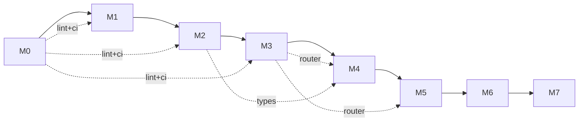

# Milestones

| Milestone | Scope | Done means |
|---|---|---|
| **M0** | Repo skeleton, doc skeleton (zh/en/agent), CI, ADR template, lint config | `cargo build` passes; doc trees exist; ADR-0001 (license) landed |
| **M1** | Lexer + Parser + AST for Cobrust core syntax | Round-trips the spec's "core 30 forms"; fuzz-tested 24h |
| **M2** | Type checker for the static core (no `dyn` yet) | Passes curated suite of well- and ill-typed programs |
| **M3** | LLM Router crate, standalone | OpenAI + Anthropic adapters work; cache + ledger functional; consensus mode tested against a synthetic task |
| **M4** | L0 + L1 pipeline end-to-end on `tomli` | Full provenance manifest; passes `tomli`'s testsuite via PyO3 wrapper |
| **M5** | L2 + L3 gates wired up; second library translated (`python-dateutil` core) | Differential-test failures auto-route to repair; benchmark harness reports |
| **M6 ✅** | First library with native extension translated (`msgpack`) — Cython lexical shim, perf-gate fail-on-miss + repair, dateutil L3 widened, PyO3 build path | Bytes-identical pack/unpack against CPython oracle; Cython shim handles `_packer.pyx`/`_unpacker.pyx` constructs; `--features pyo3` compiles |
| **M7.0 ✅** | First sub-milestone of the numpy core (per ADR-0012 + ADR-0013) — ndarray foundation: closed `Dtype` enum (`Int32 / Int64 / Float32 / Float64 / Bool`), tagged-union `Array`, four constructors (`array` / `zeros` / `ones` / `arange`) | ≥ 50 well-typed + ≥ 50 ill-typed programs; ≥ 1000 fuzz panic-free; differential vs upstream numpy 2.0.2 (bytes-identical for int/bool, `rtol=1e-12` for float) |
| **M7.1+** | Numerical tier follow-up: ufuncs / broadcasting (M7.1) → indexing (M7.2) → reductions (M7.3) → linalg (M7.4) → random (M7.5) → FFT/poly (M7.6+) | Each sub-ms gets its own ADR; sequenced per ADR-0012 §"Sub-milestones" |

## Current status

**M0..M7.0 delivered.** The repo skeleton is in place; the lexer/parser/AST (M1), HIR + bidirectional type checker (M2), and provider-agnostic LLM Router (M3) all ship; **M4** lands the L0+L1 translator pipeline end-to-end against `tomli`. **M5** completes the closed loop: L2.perf benchmark harness (per-library threshold + JSON reports under `target/cobrust-bench/`), L2.behavior repair loop driven by a `BehaviorVerifier` hook + per-attempt synthetic provider routing, and L3 downstream-dependents driver. The second library `python-dateutil` ships as the M5 deliverable; 2/5 dependents (croniter, freezegun) pass through the L3 gate, with the remaining 3/5 (pandas, sqlalchemy, pendulum) explicitly deferred to M6 per ADR-0009. **M6** is the native-extension milestone: `cobrust-msgpack` translates msgpack-python 1.0.8 (17 pure-Python + 2 Cython-typed entrypoints) end-to-end via a Cython lexical shim (`task = "translate_cython"`); the `PerfVerifier` callback wires L2.perf fail-on-miss with a perf-repair loop demonstrated on a deliberately-broken `pack_uint`; dateutil L3 widens to 4/5 + 1 skipped (pendulum tz out of scope per ADR-0010 §5); both `cobrust-dateutil` and `cobrust-msgpack` expose `--features pyo3` per ADR-0011. **M7.0** is the first sub-milestone of the numpy numerical tier (per ADR-0012 §"translate the surface, bind the core"): a new `cobrust-numpy` parent crate (per ADR-0013 the M7.0..M7.5 layout uses one parent crate, not sub-crates per area) wraps the `ndarray = "0.16"` Rust crate as the storage backend; closed `Dtype` enum (5 variants) + tagged-union `Array` (5 variants — per ADR-0013 §4 the public API exposes no `dyn`, satisfying constitution §2.2); four constructors `array / zeros / ones / arange` + observer surface `shape / ndim / size / dtype / repr / to_json`; the L0 differential gate runs upstream numpy 2.0.2 via subprocess oracle (bytes-identical for int/bool, `rtol=1e-12` for float, 1024+ fuzz inputs verified); `tests/numpy_fuzz.rs` exercises 4200 panic-free fuzz inputs; 55 well-typed + 56 ill-typed programs pass; `--features pyo3` build path wired per ADR-0011. Total tests: 501 (was 376 baseline; +125 net for M7.0).

**Why "translate the surface, bind the core"**: upstream numpy's core is `numpy/core/src/multiarray/*.c` — hand-tuned SIMD/BLAS code paths a pure-Rust port could not realistically match without a multi-year detour. Rust's ecosystem already has `ndarray`, which exposes the same `(dtype, shape, strides, data)` model. The M7.0 engineering practice is to treat cobrust-numpy's **surface** (dtype string parsing, error taxonomy, numpy-compatible `repr`, Python-shaped constructor signatures) as the translation target and the **core** (`ArrayD::zeros` / `from_shape_vec`) as the binding target. **Example**: `cobrust_numpy::zeros(&[3, 4], Dtype::Float64)` does dtype dispatch in cobrust-numpy (`match dtype { Dtype::Float64 => ... }`), then ndarray's `ArrayD::<f64>::zeros(IxDyn(&[3, 4]))` actually allocates and zero-fills the buffer. We do not reimplement `zeros`; we call it. This pattern threads through M7+: M7.4 linalg will bind `ndarray-linalg`, M7.5 random will bind `rand` + `rand_distr`, M7.6 FFT will bind `rustfft`.

## Engineering discipline (applies to all milestones)

- **Test-first** for compiler internals: failing test, then implementation
- **Closed-loop validation** for every translated library: L0–L3 gates are not skippable
- **ADR-or-it-didn't-happen**: any decision affecting two or more files needs an ADR
- **Doc-coverage in CI**: any public item without zh + en + agent docs fails CI
- **Provenance-or-it-didn't-happen**: any AI-translated file carries its manifest header
- **Atomic commits**: code + tests + docs (zh, en, agent) + ADR (if applicable) ship in one commit

## Inter-milestone dependencies

- M0 is the shared substrate; every later milestone inherits from it
- M3 (Router) is the prerequisite for M4+ translation pipeline
- M2 (type checker) is the prerequisite for M4+ verification of translated artifacts
