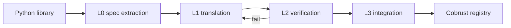

# Overview

## One-sentence positioning

Cobrust is a next-generation, statically-typed language **implemented in Rust** for the **Python ecosystem**, shipped with an **LLM-driven translation pipeline that treats LLMs as first-class components**, and a Phase F.2 AI-native stdlib in development.

## The problem we solve

- Python is slow, has a GIL, and bolts types on after the fact
- Rust is safe and fast, but the syntax is steep and the toolchain is unfamiliar to Python users
- Existing "Python successors" (Mojo / RustPython / PyPy) either aren't open source or don't solve ecosystem migration

## Our answer

| Dimension | Cobrust choice |
|------|------------|
| Syntax | Indentation-based blocks + Python ergonomics, but static types by default |
| Memory | Ownership + borrowing + Result/Option |
| Concurrency | No GIL, structured concurrency, single runtime |
| Toolchain | Single `cobrust` command, zero fragmentation |
| Ecosystem migration | AI translation subsystem: closed-loop translates Python libraries to Cobrust |

## Core innovation: AI translation closed loop

- Every step has an explicit gate; **no gate, no progress**
- L2 failure → diagnostic feeds back to L1 → re-translate → re-verify, until pass or escalation threshold
- **Token cost is not a constraint. Correctness, elegance, and reproducibility are.**

## Three-sentence elevator pitch

1. Python's syntactic ergonomics are genuinely good, but its runtime and packaging drag down the ecosystem
2. Rust's safety and performance are genuinely good, but the learning curve is steep and unfriendly to Python users
3. Graft Python's "frontend feel" onto Rust's "backend engine," then use LLMs to migrate the ecosystem automatically — that's Cobrust

## Further reading

- [Design philosophy](design-philosophy.md)
- [Architecture](architecture.md)
- [Milestones](milestones.md)
