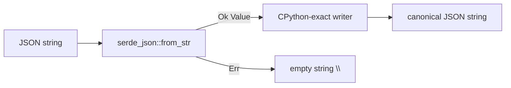

# `std.json` — JSON encode/decode

> Status: v0.7.0 Stream Z.5. Python-`json`-compatible surface over the
> Rust `serde_json` crate. Compatibility tier: `@py_compat(semantic)`.

## Examples first

Cobrust gives you the two functions every Python programmer reaches for:

```python
# Serialize (Cobrust source)
let compact: str = json_dumps("{\"a\": 1, \"b\": [2, 3]}")
# -> {"a": 1, "b": [2, 3]}

# Pretty-print with 2-space indent
let pretty: str = json_dumps_indent("{\"a\": 1, \"b\": [2, 3]}", 2)
# -> {
#      "a": 1,
#      "b": [
#        2,
#        3
#      ]
#    }

# Parse / validate / canonicalize
let canon: str = json_loads("[ 1 , 2 ,3 ]")
# -> [1, 2, 3]
```

These mirror Python's `json.dumps(...)` and `json.loads(...)` exactly for the
common cases.

## What it does

- **`json_dumps(s)`** — takes a JSON string, returns the canonical compact
  serialization. Output matches CPython 3.11 `json.dumps` defaults: `", "`
  between list/object items, `": "` after object keys, and non-ASCII characters
  escaped as `\uXXXX`.
- **`json_dumps_indent(s, n)`** — same, but pretty-printed with `n` spaces per
  nesting level. Empty containers (`{}` / `[]`) stay on one line, exactly like
  CPython `json.dumps(value, indent=n)`.
- **`json_loads(s)`** — parses a JSON string, validates it, and returns the
  canonical form. Invalid input returns the empty string `""` (never a crash).

## Value types supported

| JSON type | Example input | Output |
|---|---|---|
| null | `null` | `null` |
| bool | `true` / `false` | `true` / `false` |
| int | `42`, `-7` | `42`, `-7` |
| float | `3.14`, `3.0` | `3.14`, `3.0` |
| string | `"hello"`, `"你好"` | `"hello"`, `"你好"` |
| list | `[1,2,3]` | `[1, 2, 3]` |
| dict | `{"a":1}` | `{"a": 1}` |

Lists and dicts nest arbitrarily.

## Errors, not exceptions

Cobrust drops Python's exception-as-default-error-path rule (constitution §2.2).

- The Rust-level `loads(s)` returns a `Result<Value, Error>` — a malformed
  document is an `Err(Error::Parse(message))`, never a panic.
- The string-level `.cb` surface (`json_dumps` / `json_loads`) returns the empty
  string `""` on malformed input, the same alpha sentinel convention used by
  `std.tool`.

## Encode/decode flow



## Why this design?

- **HYBRID over a gold-tier crate.** Rather than re-implement a JSON parser, we
  bind `serde_json` (one of the most-downloaded, best-audited Rust crates) and
  wrap it in a thin Python-shaped surface. The roadmap (v0.7.0 network-backend
  libraries §4.1) classifies this as the HYBRID approach: native binding for the
  fast/correct backend, LLM-first surface for the API.
- **LLM-first surface (constitution §2.5).** `json.dumps({"a": 1})` /
  `json.loads("...")` is one of the most-trained patterns in the entire Python
  corpus. The surface matches those priors so an LLM agent writes it correctly on
  the first try.
- **CPython-exact output, deliberately.** `serde_json`'s own `to_string`
  produces compact `,`/`:` output and emits raw UTF-8. We do **not** use it
  directly — we walk the parsed value with a custom writer that reproduces
  CPython's `", "`/`": "` separators and `ensure_ascii=True` escaping, so output
  diffs cleanly against real Python `json`.

## Why `semantic`, not `strict`?

The `@py_compat` tier (constitution §2.4) is `semantic` because two corner cases
can differ from CPython, and we declare them rather than hide them:

1. **Object key order.** `serde_json`'s default map is a sorted `BTreeMap`, so
   object keys come out **alphabetically**, whereas CPython preserves insertion
   order. Everything else — separators, escapes, scalar formatting — matches.
2. **Float formatting.** Rust and CPython use different shortest-float
   algorithms; they agree on integer-valued floats (`3.0`), finite decimals, and
   ordinary values, and may disagree only in the last digit of pathological
   17-digit ties.

## Verification

The module ships a differential test corpus whose expected outputs were captured
from the CPython standard-library `json` module (the oracle), covering the full
value-type matrix, escape edge cases, Unicode and astral-plane surrogate pairs,
`indent=` parity, and a 1500-input reproducible fuzz that asserts round-trip
stability (constitution §4.2 requires ≥ 1000 fuzzed inputs).
