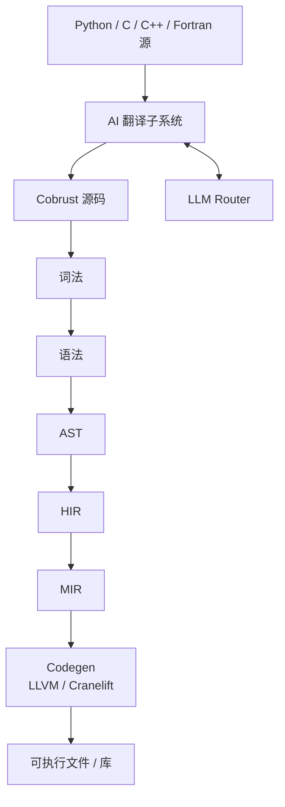
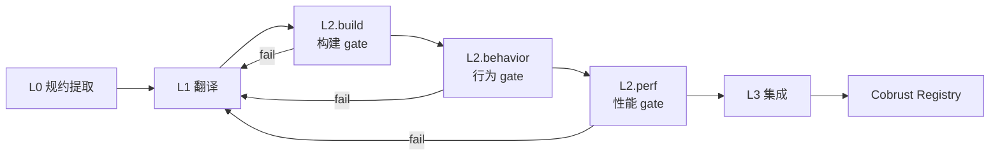
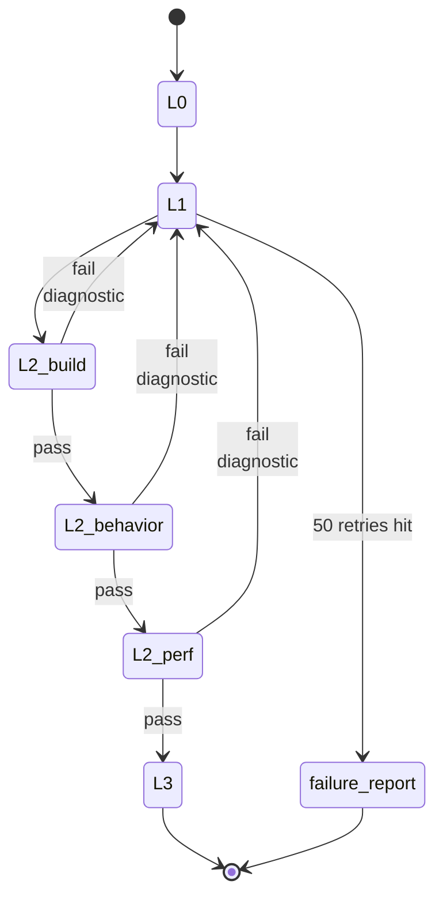

# 架构

## 编译器分层



- 主流水线：源码 → 词法 → 语法 → AST → HIR → MIR → 代码生成
- AI 翻译子系统**消费**异构源（Python/C/C++/Fortran），**产出** Cobrust 源码进入主流水线
- LLM Router 是**编译器一等公民**，AI 翻译子系统通过 Router 调度模型

## crate 拓扑

| crate | 角色 | 落地里程碑 |
|---|---|---|
| `cobrust-cli` | `cobrust` 二进制入口 | M0 占位 → M1 起接入 |
| `cobrust-frontend` | 词法 + 语法 + AST | M1 |
| `cobrust-hir` | HIR：去糖、名字解析后的中间形式 | M2 |
| `cobrust-types` | 类型系统 + 类型检查器 | M2 |
| `cobrust-mir` | MIR：控制流显式形式 | M3+ |
| `cobrust-codegen` | LLVM / Cranelift 后端 | M3+ |
| `cobrust-llm-router` | LLM Router | M3 |
| `cobrust-translator` | AI 翻译子系统 | M4+ |

## 前端（M1 — 已交付）

`cobrust-frontend` 已经把"30 forms"落地。给一个能直观感受的例子：

```python
fn fib(n: i64) -> i64:
    if (n < 2):
        return n
    return (fib((n - 1)) + fib((n - 2)))
```

把它喂给前端：

```rust
use cobrust_frontend::{parse_str, unparse, FileId};

let src = std::fs::read_to_string("fib.cb")?;
let module = parse_str(&src, FileId(0))?;
println!("{}", unparse(&module));
```

### 公共 API

- `lex(source, file_id) -> Result<Vec<Token>, LexError>` — UTF-8 → token 流
- `lex_bytes(bytes, file_id) -> Result<Vec<Token>, LexError>` — 任意字节 → token 流（非 UTF-8 报错不 panic）
- `parse(tokens) -> Result<ast::Module, ParseError>` — token → AST
- `parse_str(source, file_id) -> Result<ast::Module, FrontendError>` — 一步完成
- `unparse(module) -> String` — AST → 规范化源码（用于 round-trip 验证）

### 设计约束

- **递归下降 + Pratt**：表达式优先级表见 `crates/cobrust-frontend/src/parser.rs` 顶部注释；不引入第三方语法生成器。
- **Span 全程在 AST 上**：每个节点带 `(file_id, byte_start, byte_end)`，给后续阶段的诊断提供精确位置。
- **30 forms 闭口**：`adr:0003` 把表面的句法形式定死，超出列表的 Python 形式（`is` / `del` / `global` / `nonlocal` / `async def` / 多重继承 / 可变默认参数）直接拒绝并报 `DroppedByConstitution`。
- **Panic-free**：任何字节输入都不会让 lexer/parser panic — 只会返回结构化错误。该不变量由 proptest fuzz harness（默认 5×4 096 cases，长跑 5×100 000 cases）守住。

### 验证

- 30 个 round-trip 集成测试，每个 form 一个：`tests/round_trip.rs`。
- proptest fuzz harness：`tests/fuzz_proptest.rs`；过去抓到的 panic 输入永久写入 `tests/fuzz_proptest.proptest-regressions`，每次跑都会先复跑这些 reproducer。
- 方法学和首次抓到的 bug 写在 `docs/agent/findings/m1-fuzz-method.md`。

## AI 翻译子系统：四级闭环

每一级都有显式 gate，**没有任何一级是可选的**。



### L0 — 规约提取

- 输入：Python 库源码 + 测试 + 文档
- 输出：机器可读的行为规约（签名、不变量、I/O 示例对、数值容差）
- 方法：LLM agent 用 CPython 库作为 oracle，生成差分测试 harness
- 工件：`spec.toml` + `harness/` 目录，落入翻译清单

### L1 — 翻译

- 输入：L0 规约 + 原始源码
- 输出：Cobrust / Rust 实现
- 颗粒度：**函数级，按依赖图自底向上**
- 方法：通过 LLM Router 调用；高风险函数走 consensus 模式
- 约束：每个生成文件都带翻译来源头部

### L2 — 验证（三道 gate，全部必过）

- **build gate**：`cargo build --release` 零警告
- **behavior gate**：原测试套件 + property tests + L0 差分 harness 全过；容差按 `@py_compat` 标签；每个 public 函数 ≥ 1000 个 fuzz 输入
- **perf gate**：在代表性 benchmark 上 ≥ 原版 0.8×（每库可配）

### L3 — 集成

- PyO3 wrapper 暴露 Cobrust 实现，API 与 Python 兼容
- **下游验证**：跑 top-5 依赖该库的项目的测试套件 — **这是最终 oracle**
- 发布到 Cobrust registry，附完整来源清单

### 失败回路



任何 gate 失败 → 诊断喂回 L1 → 重译 → 重验。循环直到通过或触达升级阈值（默认 50 次重试），届时落一份人类可读的失败报告并把该函数标记为 `@py_compat(none)` 附说明。

## LLM Router（编译器一等公民）

`cobrust-llm-router` 不是工具，是**编译器子系统**。它和类型检查器同等重要，**不**住在 `tools/` 里。

### 关键能力

- Provider 抽象；具体 adapter 覆盖 **OpenAI 兼容** 与 **Anthropic 兼容**
- 每个 provider 可配 `base_url` 和模型名（DeepSeek、Qwen、本地 vLLM、Together、OpenRouter 都通用）
- 按任务路由：`{ task, strategy: "cost" | "quality" | "latency" | "consensus", n? }`
- 流式返回（两种格式都支持）
- Token 账本：按任务、按库、按会话写入 `.cobrust/ledger.jsonl`
- 指数退避重试；provider 之间故障隔离（一家挂掉 ≠ 流水线挂掉）
- 缓存层：`(prompt_hash, model, params)` 内容寻址，本地 + 可选远端共享
- Consensus 模式：N 个模型并发，按多数 / 结构化 diff / verifier 评判 / gate 通过率取最优

### 配置示例

完整配置见 [`cobrust.toml.example`](../../../cobrust.toml.example)。最小例：

```toml
[router]
default_strategy = "quality"

[providers.anthropic_official]
kind = "anthropic"
base_url = "https://api.anthropic.com"
api_key_env = "ANTHROPIC_API_KEY"
models = ["claude-opus-4-7"]

[routing.translate]
strategy = "consensus"
n = 2
preferred = ["anthropic_official:claude-opus-4-7", "deepseek:deepseek-v3"]
```

### Router 不做什么

- **不**是聊天 UI
- **不**承担长链 agent 循环（那是翻译子系统的活）
- **不**内嵌 prompt 模板（模板和消费者放一起）

## 自举路线

编译器初版用 Rust 写。Cobrust 成熟后（M5 之后），开始自举非性能关键的编译器阶段，**类型检查器和 AST printer 优先**。

## 进一步阅读

- [Agent 视角的模块规约](../../agent/modules/)
- [里程碑](milestones.md)
