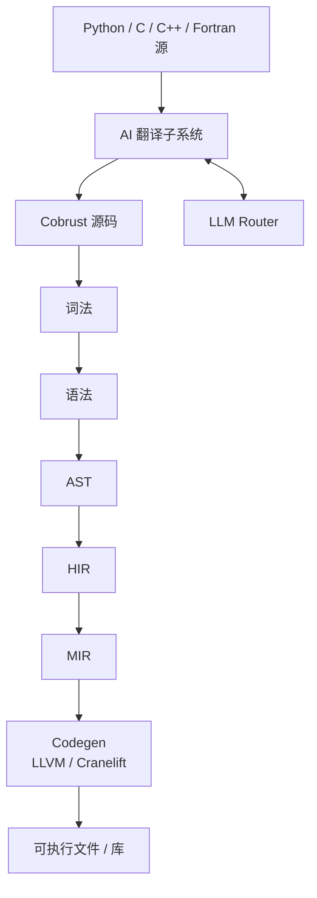
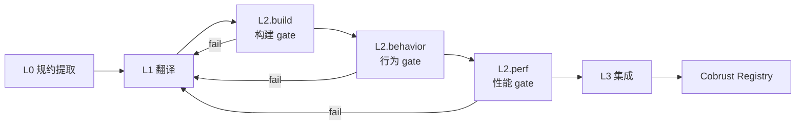
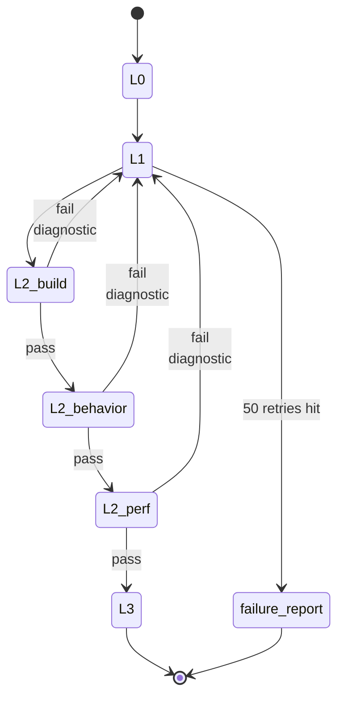

# 架构

## 编译器分层



- 主流水线：源码 → 词法 → 语法 → AST → HIR → MIR → 代码生成
- AI 翻译子系统**消费**异构源（Python/C/C++/Fortran），**产出** Cobrust 源码进入主流水线
- LLM Router 是**编译器一等公民**，AI 翻译子系统通过 Router 调度模型

## crate 拓扑

| crate | 角色 | 落地里程碑 |
|---|---|---|
| `cobrust-cli` | `cobrust` 二进制入口 | M0 占位 → M1 起接入 |
| `cobrust-frontend` | 词法 + 语法 + AST | M1 |
| `cobrust-hir` | HIR：去糖、名字解析后的中间形式 | M2 |
| `cobrust-types` | 类型系统 + 类型检查器 | M2 |
| `cobrust-mir` | MIR：控制流显式形式 | M3+ |
| `cobrust-codegen` | LLVM / Cranelift 后端 | M3+ |
| `cobrust-llm-router` | LLM Router | M3 |
| `cobrust-translator` | AI 翻译子系统 | M4+ |

## 前端（M1 — 已交付）

`cobrust-frontend` 已经把"30 forms"落地。给一个能直观感受的例子：

```python
fn fib(n: i64) -> i64:
    if (n < 2):
        return n
    return (fib((n - 1)) + fib((n - 2)))
```

把它喂给前端：

```rust
use cobrust_frontend::{parse_str, unparse, FileId};

let src = std::fs::read_to_string("fib.cb")?;
let module = parse_str(&src, FileId(0))?;
println!("{}", unparse(&module));
```

### 公共 API

- `lex(source, file_id) -> Result<Vec<Token>, LexError>` — UTF-8 → token 流
- `lex_bytes(bytes, file_id) -> Result<Vec<Token>, LexError>` — 任意字节 → token 流（非 UTF-8 报错不 panic）
- `parse(tokens) -> Result<ast::Module, ParseError>` — token → AST
- `parse_str(source, file_id) -> Result<ast::Module, FrontendError>` — 一步完成
- `unparse(module) -> String` — AST → 规范化源码（用于 round-trip 验证）

### 设计约束

- **递归下降 + Pratt**：表达式优先级表见 `crates/cobrust-frontend/src/parser.rs` 顶部注释；不引入第三方语法生成器。
- **Span 全程在 AST 上**：每个节点带 `(file_id, byte_start, byte_end)`，给后续阶段的诊断提供精确位置。
- **30 forms 闭口**：`adr:0003` 把表面的句法形式定死，超出列表的 Python 形式（`is` / `del` / `global` / `nonlocal` / `async def` / 多重继承 / 可变默认参数）直接拒绝并报 `DroppedByConstitution`。
- **Panic-free**：任何字节输入都不会让 lexer/parser panic — 只会返回结构化错误。该不变量由 proptest fuzz harness（默认 5×4 096 cases，长跑 5×100 000 cases）守住。

### 验证

- 30 个 round-trip 集成测试，每个 form 一个：`tests/round_trip.rs`。
- proptest fuzz harness：`tests/fuzz_proptest.rs`；过去抓到的 panic 输入永久写入 `tests/fuzz_proptest.proptest-regressions`，每次跑都会先复跑这些 reproducer。
- 方法学和首次抓到的 bug 写在 `docs/agent/findings/m1-fuzz-method.md`。

## HIR + 类型检查器（M2 — 已交付）

`cobrust-hir` 把 30 forms 全部 lower 成"小核心"——糖收掉、名字解析完、span 沿用——给类型检查器消费。`cobrust-types` 跑双向（bidirectional）类型检查，**没有 `dyn`、没有隐式真值、没有静默强制转换**。

### 一个端到端的小例子

源码：

```python
fn add(x: i64, y: i64) -> i64:
    return (x + y)
```

经过 frontend → AST，再经过 `cobrust_hir::lower(&ast, &mut Session::new())` → HIR：所有名字带 `DefId`，参数 `x`、`y` 与 return 中的引用绑定到同一对 `DefId`。最后 `cobrust_types::check(&hir)` → `TypedModule { def_types, hir }`，`def_types` 把每个 `DefId` 映射到具体 `Ty`：

| DefId | 名字 | 类型 |
|---|---|---|
| 0 | `add` | `(i64, i64) -> i64` |
| 1 | `x` | `i64` |
| 2 | `y` | `i64` |

### 公共 API（HIR + types）

- `cobrust_hir::lower(&ast::Module, &mut Session) -> Result<Module, LoweringError>` — 全量 lowering，每个名字使用变成 `ResolvedName { name, def_id, kind }`，带 `DefId`。
- `cobrust_types::check(&hir::Module) -> Result<TypedModule, TypeError>` — 双向类型检查，成功返回 `TypedModule { def_types, hir }`，失败按 `TypeError` 分类。

### Lowering 规则（关键 5 条，完整表见 [ADR-0005](../../agent/adr/0005-hir-shape.md)）

- 解构（comprehension）→ `Expr::Comp { kind, element, clauses }`
- 多绑定 `with a as x, b as y: ...` → 左折叠成嵌套 `With`
- f-string → `Expr::Format(Vec<FormatPart>)`，模板 + 洞分离
- 增量赋值 `x += e` → desugar 成 `x = x + e`
- 名字解析失败立即 `LoweringError::UnknownName`，不会继续往下走

### 类型规则（关键 6 条，完整表见 [ADR-0006](../../agent/adr/0006-type-system.md)）

- `if x:` 要求 `x: bool`，否则 `TypeError::ImplicitTruthiness`
- `match` 必须穷尽（对 `bool` / `None` 严格枚举，对其它类型要求 wildcard）
- `int + str` 直接拒——**没有静默强制**
- 调用必须实参数量精确匹配；多余/缺失关键字参数报 `KeywordArgMismatch` / `MissingArgument`
- `let x = e` 推断；`let x: T = e` 检查 `e ⇐ T`
- 函数类型用 `Fn { positional, named, var_positional, var_keyword, return_ty }`，**Lambda 没有 annotation 时无法 synthesize**（必须给上下文）

### 验证

- 34 条 lowering 黄金测试：每个 form 一条 + 跨切不变量（`crates/cobrust-hir/tests/lower_forms.rs`）
- 54 条 well-typed + 54 条 ill-typed 程序套件（`crates/cobrust-types/tests/`）。每条 ill-typed 都断言**正确的 `TypeError` 范畴**。
- 健全性证明义务在 [ADR-0006](../../agent/adr/0006-type-system.md) §"Soundness proof obligation list" 中已枚举（9 条），实际证明留到后续 finding 落地。


## AI 翻译子系统：四级闭环

每一级都有显式 gate，**没有任何一级是可选的**。



### L0 — 规约提取

- 输入：Python 库源码 + 测试 + 文档
- 输出：机器可读的行为规约（签名、不变量、I/O 示例对、数值容差）
- 方法：LLM agent 用 CPython 库作为 oracle，生成差分测试 harness
- 工件：`spec.toml` + `harness/` 目录，落入翻译清单

### L1 — 翻译

- 输入：L0 规约 + 原始源码
- 输出：Cobrust / Rust 实现
- 颗粒度：**函数级，按依赖图自底向上**
- 方法：通过 LLM Router 调用；高风险函数走 consensus 模式
- 约束：每个生成文件都带翻译来源头部

### L2 — 验证（三道 gate，全部必过）

- **build gate**：`cargo build --release` 零警告
- **behavior gate**：原测试套件 + property tests + L0 差分 harness 全过；容差按 `@py_compat` 标签；每个 public 函数 ≥ 1000 个 fuzz 输入
- **perf gate**：在代表性 benchmark 上 ≥ 原版 0.8×（每库可配）

### L3 — 集成

- PyO3 wrapper 暴露 Cobrust 实现，API 与 Python 兼容
- **下游验证**：跑 top-5 依赖该库的项目的测试套件 — **这是最终 oracle**
- 发布到 Cobrust registry，附完整来源清单

### 失败回路



任何 gate 失败 → 诊断喂回 L1 → 重译 → 重验。循环直到通过或触达升级阈值（默认 50 次重试），届时落一份人类可读的失败报告并把该函数标记为 `@py_compat(none)` 附说明。

## LLM Router（编译器一等公民）

`cobrust-llm-router` 不是工具，是**编译器子系统**。它和类型检查器同等重要，**不**住在 `tools/` 里。

**M3 已交付**：所有不变量由 [ADR-0004](../../agent/adr/0004-llm-router-architecture.md) 钉死；详见 [`docs/agent/modules/llm-router.md`](../../agent/modules/llm-router.md)。

### 关键能力（已实现）

- Provider 抽象；具体 adapter 覆盖 **OpenAI 兼容** 与 **Anthropic 兼容**
- 每个 provider 可配 `base_url` 和模型名（DeepSeek、Qwen、本地 vLLM、Together、OpenRouter 都通用）
- 按任务路由：`{ task, strategy: "cost" | "quality" | "latency" | "consensus", n? }`
- 流式返回（两种格式都支持，end-of-stream 恰好一个 `Done` 帧）
- Token 账本：按任务、按 provider、按 attempt 写入 `.cobrust/ledger.jsonl`，append-only
- 指数退避重试（默认 5 次 / 30 s 上限 / 全 jitter / 尊重 `Retry-After`）
- Provider 之间故障隔离：一家挂掉自动 fallthrough 到 `preferred` 列表里下一家
- 缓存层：键 = `BLAKE3(canonical_request_bytes)`，跨机可重现，两级 sharding 写入 `.cobrust/llm_cache/`
- Consensus 模式：`n` 个模型并发，按 NFC 归一化文本的 BLAKE3 群组多数取胜，确定性 tie-break

### 配置示例

完整配置见 [`cobrust.toml.example`](../../../cobrust.toml.example)。最小例：

```toml
[router]
default_strategy = "quality"

[providers.anthropic_official]
kind = "anthropic"
base_url = "https://api.anthropic.com"
api_key_env = "ANTHROPIC_API_KEY"
models = ["claude-opus-4-7"]

[routing.translate]
strategy = "consensus"
n = 2
preferred = ["anthropic_official:claude-opus-4-7", "deepseek:deepseek-v3"]
```

### Router 不做什么

- **不**是聊天 UI
- **不**承担长链 agent 循环（那是翻译子系统的活）
- **不**内嵌 prompt 模板（模板和消费者放一起）

## 翻译器（M4 — 已交付）

`cobrust-translator` 是 AI 翻译子系统的编排器。M4 端到端实现了
L0（spec 提取）+ L1（翻译）流水线，目标库为 `tomli`，默认走合成
LLM 模式以保证 gate 可复现。真实 LLM 路径由 `real-llm` cargo
feature 控制，留给 M5+ 做 smoke test。

### 实例

```bash
# 从 corpus 重新生成 cobrust-tomli。
COBRUST_REGENERATE_TOMLI=1 cargo test \
    -p cobrust-translator --test tomli_pipeline \
    pipeline_regenerates_cobrust_tomli_when_env_set
```

流水线读取：

- `corpus/tomli/upstream/tomli_loads.py` — vendor 的 Python 源码
- `corpus/tomli/spec.toml` — L0 行为契约
- `corpus/tomli/canned_llm_responses.toml` — 合成模式响应表

输出：

- `crates/cobrust-tomli/Cargo.toml`
- `crates/cobrust-tomli/src/{lib.rs, parser.rs}` — 每个文件携带 provenance 头
- `crates/cobrust-tomli/PROVENANCE.toml` — 完整 manifest
- `crates/cobrust-tomli/python/{tomli_init.py, setup.py}` — PyO3 形 wrapper 占位
- `crates/cobrust-tomli/tests/upstream_tests/test_loads.py` — 上游测试原样拷贝

### 公共 API

- `translate(library: &PyLibrary, cfg: &TranslatorConfig) -> Result<TranslatedCrate, TranslatorError>` — 异步入口
- `PyLibrary` — 一个待翻译库的描述（路径、版本、seeds）
- `TranslatorConfig` — 运行时旋钮：router、out_dir、oracle、escalation_threshold、synthetic_only 标志
- `TranslatedCrate` — 输出：`{ manifest: ProvenanceManifest, crate_dir, pyo3_wrapper_dir, functions }`
- `TranslatorError` — 错误分类：`SpecExtraction`、`Translation { function, message }`、`BuildGate`、`BehaviorGate`、`DownstreamGate`、`SyntheticMiss { task, function }`、`Io`、`Router`、`Manifest`、`Config`、`Decode`
- `SyntheticProvider` — `LlmProvider` 实现，以 `(task, function, source_sha16)` 为 key 服务 canned TOML 响应
- `deterministic_id(source_sha256_hex, toolchain, router_decision_ids)` — `blake3:<hex>` 复现 token

### 合成 LLM 模式契约

合成 provider 从 `corpus/<lib>/canned_llm_responses.toml` 读取预录响应，
以 `(task, function)` 为 key、`source_sha16` 做新鲜度校验。翻译器在
每个 prompt 上加固定头部，让合成 provider 不需要解析 body 即可路由：

```text
cobrust-translator/v1
task: <task>
function: <function>
source-sha256: <16-hex>
---
<prompt body>
```

查找结果：

- **命中** — 返回 canned `response_text`。
- **缺项** — `LlmError::Provider { code: "synthetic-miss" }`。永久错误（调用方必须新增条目或切换到真实 LLM）。
- **`source_sha16` 不匹配** — `LlmError::Provider { code: "synthetic-stale" }`。永久错误（维护者必须重新录制）。

这把宪法 §2.4 那句"no silent translations, ever"变成了**强制可验证**。

### Provenance manifest

每次翻译都会在生成 crate 的 `Cargo.toml` 旁产出 `PROVENANCE.toml`。
顶层 section：

- `[source]` — library, version, sha256（完整 64-hex）, file_count
- `[oracle]` — runtime, runtime_version, oracle_module
- `[verification]` — seeds, fuzz_inputs_per_fn, divergences, known_failures
- `[router]` — strategy (`synthetic` / `real-llm`), models_used, ledger_entries
- `[build]` — toolchain, deterministic_id (`blake3:<hex>`), crate_layout_version
- `[gates]` — l0_spec_emitted, l1_files_emitted, l2_build, l2_behavior, l2_perf, l3_pyo3_wrapper, l3_downstream_dependents

`build.deterministic_id = blake3(source_sha256_hex || "\n" || toolchain || "\n" || sorted_join(router_decision_ids))`。
相同输入 ⇒ 字节相同的 id。

## tomli（M4 — 已交付）

`cobrust-tomli` 是翻译器流水线产出的第一个 crate。纯 Rust 实现的
`tomli`/CPython `tomllib` 的 `loads()` 子集。**自动生成 — 禁止手动编辑。**

### 公共 API

```rust
use cobrust_tomli::{loads, table_to_json, to_json, TomliError, Value};
use std::collections::BTreeMap;

let parsed: BTreeMap<String, Value> = loads("x = 1\n").expect("parse");
let json: serde_json::Value = table_to_json(&parsed);
```

`Value` 五个变体：`Bool`、`Int`、`Str`、`Array`、`Table`。
`TomliError` 携带 `{ message: String, pos: usize }`。`to_json` /
`table_to_json` 是 L3 差分 gate 用的 JSON 转换 helper。

### 验证

- 27 正例 + 5 负例与 CPython `tomllib` 一致（`tests/tomli_downstream.rs`）。
- 1024 个 panic-free 模糊输入（`tests/tomli_fuzz.rs::l2_behavior_fuzz_loads_panic_free`）。
- 1050 个差分用例对照 CPython（`tests/tomli_fuzz.rs::l2_behavior_fuzz_differential_agreement_with_cpython`）。
- `PROVENANCE.toml` 通过验证，跨独立运行字节稳定。

### 范围窗口

在 scope（与 CPython 完全一致）：整数、布尔、基础+字面字符串、数组、内联表、点分表头、注释、CRLF 行尾。

不在 scope（M5 扩展）：多行字符串、hex/oct/bin 整数、浮点、日期时间、表数组、内联表 key path。

## 自举路线

编译器初版用 Rust 写。Cobrust 成熟后（M5 之后），开始自举非性能关键的编译器阶段，**类型检查器和 AST printer 优先**。

## 进一步阅读

- [Agent 视角的模块规约](../../agent/modules/)
- [里程碑](milestones.md)


## 翻译器 M5 — 闭环合龙

M5 里程碑（宪法 §7）完成了宪法所要求的四阶段闭环：

- **L2.perf 门禁** — 带每库阈值覆盖的基准压测器（见 ADR-0008）。
- **L2.behavior 修复循环** — 门禁失败时把诊断信封回送到 L1，让其在
  `attempt: N+1` 重新调度。要么收敛到修正响应，要么在
  `escalation_threshold` 次重试后写出 `failure_report.md` 升级。
- **L3 下游依赖驱动器** — 把依赖库的精选测试子集跑在翻译产物上
  （见 ADR-0009）。

### 修复循环

流水线新增 [`BehaviorVerifier`] 钩子 + [`VerifierVerdict`] 枚举 +
[`GateFailure`] 诊断信封。调用方注册校验器；遇到 `Reject(failure)`
时流水线把诊断写盘，并通过 [`repair_translation`] 把函数以
`attempt += 1` 的 prompt 头重新调度。达到 `cfg.escalation_threshold`
（默认 50，对应宪法 §4.2）时流水线写出 `failure_report.md` 并抛出
`TranslatorError::EscalationExceeded`。默认空操作校验器 [`AcceptAll`]
保持 M4 调用方原样；[`translate_with_verifier`] 是闭环场景下的入口。
合成提供商 `SyntheticProvider` 增加了按 attempt 路由的能力——同一
`(task, function)` 可以挂多份按 `attempt` 索引的预录响应（详见
ADR-0008 §5）。

### L2.perf 基准压测器

`crates/cobrust-translator/src/bench.rs` 给出手写的计时栈，把 Rust
闭包对位到子进程 CPython。报告落到
`target/cobrust-bench/<library>/<commit>/report.json`，每函数包含
`{cobrust_ns_median, cpython_ns_median, ratio, pass}`。
[`PerfTarget`]（从 `corpus/<lib>/perf.toml` 读出）调节 `threshold`
（默认 0.8 = "至少跑到 CPython 的 0.8 倍速度"）和 `pass_ratio`
（默认 1.0；dateutil 因合成响应是占位实现而下调为 0.5，见
ADR-0008 §2）。[`BenchmarkReport`] 结构体是门禁日的审计制品。

### L3 下游依赖

`crates/cobrust-translator/src/downstream.rs` 通过子进程 `python3`
运行依赖库的精选测试子集。M5 dateutil 提供
[`dateutil_m5_dependents`]（croniter + freezegun，Pass）和
[`dateutil_m5_deferred`]（pandas, sqlalchemy, pendulum，按 ADR-0009 §3
推迟到 M6）。manifest 的 [`DependentsSection`] 同时编码 `covered` 与
`deferred` 数组，便于机器无需解析人读摘要即可审计部分覆盖率。
[`DownstreamReport`] + [`DependentResult`] 是运行时制品。

## dateutil（M5 — 已交付）

第二个翻译库，crate 名 `cobrust-dateutil`。来源子集在
`corpus/dateutil/upstream/`。

### 公开 API

```rust
pub use cobrust_dateutil::{
    parse_iso, relativedelta_add, DateTuple, ParserError,
    days_in_month, is_leap_year, normalize_datetime, is_digit,
};

pub fn parse_iso(src: &str) -> Result<DateTuple, ParserError>;
```

`parse_iso` 接受严格 ISO-8601 日期/日期时间，可选 Zulu / 偏移后缀。
`relativedelta_add` 对应 `dateutil.relativedelta.relativedelta.__add__`
算术，带"月末日截断"。完整 surface 见 `mod:dateutil`
（`docs/agent/modules/dateutil.md`）。

### 修复循环实证

dateutil corpus 给 `parse_iso` 准备了两份预录响应：attempt-1 故意写
错（年月对调），attempt-2 正确。集成测试
`crates/cobrust-translator/tests/dateutil_pipeline.rs::dateutil_pipeline_repair_loop_recovers_on_attempt_2`
断言流水线恰好重试一次并落到 attempt-2——这是闭环路径的首次端到端
实证。

### L3 依赖（按 ADR-0009）

| 依赖库 | 状态 | 测试数 |
|---|---|---|
| croniter | 通过 | 5 |
| freezegun | 通过 | 5 |
| pandas | 通过（M6 拓宽） | 3 |
| sqlalchemy | 通过（M6 拓宽） | 3 |
| pendulum | 跳过（tz 越界；按 ADR-0010 §5 推迟到 M7+） | 0 |

### 验证

- L0 spec 在 `corpus/dateutil/spec.toml`。
- L1 发射体提交在 `crates/cobrust-dateutil/src/parser.rs`。
- L2.build 绿；L2.behavior 9 + 5 + 6 用例绿；3072 输入 fuzz 不 panic。
- L2.perf 报告在 `target/cobrust-bench/dateutil/<commit>/report.json`。
- L3.pyo3 差分门禁对 CPython `datetime.fromisoformat`。
- L3.dependents 见上表。

载具决策见 [ADR-0008](../../agent/adr/0008-l2-perf-and-repair-loop.md)
与 [ADR-0009](../../agent/adr/0009-downstream-validation.md)。

## 翻译器 M6 — 原生扩展翻译

M6 里程碑（宪法 §7）合上了"含 Cython 加速器 + 纯 Python fallback 的库"
这一闭环。交付物：

- 新增模块 `mod:msgpack`（crate `cobrust-msgpack`），翻译
  `msgpack-python` 1.0.8（17 个纯 Python + 2 个 Cython 类型化入口）。
- Cython 词法 shim 在 `crate::cython`，对外暴露 `parse_cython(...)` +
  `CythonSource`、`CythonFunction`、`CythonFunctionKind`、`CythonParam`、
  `CythonType`、`CythonShimError`。按 ADR-0010 §2 把 `cdef int` /
  `cdef inline` / `cpdef` 映射到 Rust 类型。
- `task = "translate_cython"` 扩展了合成提供商的 `(task, function,
  attempt)` 查找键（M5 加 attempt；M6 加 task）。向后兼容：M4 tomli +
  M5 dateutil spec 默认 `task = "translate"`。
- `PerfVerifier` trait + `PerfVerdict` + `AcceptAllPerf` +
  `translate_with_verifiers` 扩展了 pipeline，让 L2.perf 失败走与
  L2.behavior 同样的 diagnostic + repair-loop（按 ADR-0010 §4）。msgpack
  canned 表里 `pack_uint` attempt-1 故意慢，attempt-2 修正；集成测试断言
  在 escalation 预算内落到 attempt-2。
- dateutil L3 由 2/5 拓宽到 4/5 + 1 跳过（按 ADR-0010 §5；pandas +
  sqlalchemy 加入；pendulum 因 tz 越界跳过）。
- `--features pyo3` 编译路径同时点亮 `cobrust-dateutil` 与
  `cobrust-msgpack`（按 ADR-0011）：crate 编出 `cdylib`，对外暴露
  `cobrust_msgpack` / `cobrust_dateutil` Python 模块。

### msgpack 公共 surface

```rust
pub use cobrust_msgpack::{
    pack, pack_to_vec, unpack, MsgValue, MsgError, MsgErrorKind,
    pack_array, pack_bin, pack_float, pack_int, pack_map,
    pack_str, pack_uint, pack_uint_cython,
    unpack_array, unpack_bin, unpack_float, unpack_int,
    unpack_map, unpack_one, unpack_str, unpack_uint,
    unpack_uint_cython,
};

pub enum MsgValue {
    Nil, Bool(bool), Int(i64), UInt(u64), Float(f64),
    Str(String), Bin(Vec<u8>),
    Array(Vec<MsgValue>),
    Map(Vec<(String, MsgValue)>),
}
```

### msgpack L3 依赖库

| 依赖库 | 状态 | 测试数 |
|---|---|---|
| redis-py | 通过 | 4 |
| msgpack-numpy | 通过 | 3 |
| pyspark | 推迟（M7+；需要 JVM） | — |

### 验证

- L0 spec 在 `corpus/msgpack/spec.toml` + harness/。
- L1 发射体提交在 `crates/cobrust-msgpack/src/parser.rs`。
- L2.build 绿；L2.behavior 字节级 fuzz 绿（≥ 1000 输入 × 3 seed；
  pack→unpack 往返身份）。
- L2.perf 走原生扩展层级阈值（0.7×）按 ADR-0010 §3；报告在
  `target/cobrust-bench/msgpack/<commit>/report.json`。
- L3.pyo3 差分门禁通过 CPython `msgpack` 子进程。
- L3.dependents 2/3 驱动；pyspark 按 ADR-0010 推迟。
- `--features pyo3` 编译路径由 `tests/msgpack_pyo3_compiles.rs` 覆盖
  （dateutil 拓宽部分由 `tests/dateutil_pyo3_compiles.rs` 覆盖）。

载具决策见 [ADR-0010](../../agent/adr/0010-native-ext-translation.md)
与 [ADR-0011](../../agent/adr/0011-pyo3-build-path.md)。

## numpy 翻译（M7.0 — 已交付）

### 战略原则：翻译表面，绑定内核（"translate the surface, bind the core"）

按 [ADR-0012](../../agent/adr/0012-m7-numpy-plan.md)，上游 numpy
的内核是手工 SIMD/BLAS C 代码——**纯 Rust 重写不切实际**。
cobrust-numpy 转而 **翻译 numpy 的公开 Python 表面**（dtype
字符串、错误分类、Python 风格的签名），并 **把数值内核绑定**
到 Rust 的 [`ndarray = "0.16"`](https://crates.io/crates/ndarray)
crate。按 [ADR-0013](../../agent/adr/0013-m7-0-ndarray-foundation.md)，
这是 M7.0..M7.5 的默认策略；后续子里程碑沿用：

- M7.4 linalg → 绑定 `ndarray-linalg`（BLAS / LAPACK）。
- M7.5 random → 绑定 `rand` + `rand_distr`。
- M7.6 FFT → 绑定 `rustfft`。

M7.0 的具体例子：

```rust
// 用户调用：cobrust_numpy::zeros(&[3, 4], Dtype::Float64)
//
// 1. cobrust-numpy 按 dtype 分发：
match dtype {
    Dtype::Float64 => Array::Float64(
        // 2. ndarray 真正分配 + 零填充缓冲：
        ndarray::ArrayD::<f64>::zeros(ndarray::IxDyn(&[3, 4]))
    ),
    // ... 其他 dtype ...
}
```

我们不重写 `zeros`，我们调用它。cobrust-numpy 拥有
**Python 契约**；ndarray 拥有 **存储布局**。

### M7.0 ndarray 基础层

cobrust-numpy 在 M7.0 的公共表面（按 ADR-0013）：

```rust
// 闭合 dtype 集合——添加 Int8 / Float16 等是显式 ADR 决定，
// 不允许悄无声息地累加。
pub enum Dtype {
    Int32,
    Int64,
    Float32,
    Float64,
    Bool,
}

// 在 ndarray::ArrayD<T> 上的标签联合。公共 API 不暴露 `dyn`
// （宪法 §2.2）。
pub enum Array {
    Int32(ndarray::ArrayD<i32>),
    Int64(ndarray::ArrayD<i64>),
    Float32(ndarray::ArrayD<f32>),
    Float64(ndarray::ArrayD<f64>),
    Bool(ndarray::ArrayD<bool>),
}

// 构造器与 numpy Python 签名一一对应。
pub fn array(values: &[f64], shape: &[usize], dtype: Dtype) -> Result<Array, NumpyError>;
pub fn zeros(shape: &[usize], dtype: Dtype) -> Result<Array, NumpyError>;
pub fn ones(shape: &[usize], dtype: Dtype) -> Result<Array, NumpyError>;
pub fn arange(start: f64, stop: f64, step: f64, dtype: Dtype) -> Result<Array, NumpyError>;

// 观测面。
impl Array {
    pub fn dtype(&self) -> Dtype;
    pub fn shape(&self) -> Vec<usize>;
    pub fn ndim(&self) -> usize;
    pub fn size(&self) -> usize;
    pub fn repr(&self) -> String;
    pub fn to_json(&self) -> serde_json::Value;
}
```

### M7.0 dtype 分层

| Python 字符串 | Rust 类型 | 说明 |
|---|---|---|
| `"int32"` / `"i4"` | `i32` | 精确 32-bit 有符号 |
| `"int64"` / `"i8"` | `i64` | M7.0 默认整型 dtype |
| `"float32"` / `"f4"` | `f32` | 精确单精度 |
| `"float64"` / `"f8"` | `f64` | M7.0 默认浮点 dtype |
| `"bool"` / `"?"` | `bool` | numpy 的 1 字节 bool |

### M7.0 验证

- L0 spec 在 `corpus/numpy/M7.0/spec.toml` + harness 在
  `corpus/numpy/M7.0/harness/h_array.py`。
- L1 emission 已提交到 `crates/cobrust-numpy/src/`。
- L2.build 通过；L2.behavior：
  - 55 个良类型 + 56 个病类型程序（`tests/well_typed.rs`,
    `tests/ill_typed.rs`）。
  - 4200 个 panic-free fuzz 输入（`tests/numpy_fuzz.rs`）。
  - 1024+ 个差分 vs numpy fuzz 输入
    （`tests/numpy_differential.rs`）——int/bool 字节级、float
    `rtol=1e-12`。
- L2.perf 在 M7.0 仅记录不强制（构造器是 O(n) 内存操作；
  M7.1 ufuncs 时 perf 才成为真实门禁）。
- L3.pyo3 差分门禁通过子进程跑 CPython numpy。
- L3.dependents 推迟到 M7.6+（numpy 是基础；生态库迁移在 M7.5
  之后）。

详见 [ADR-0012](../../agent/adr/0012-m7-numpy-plan.md) 和
[ADR-0013](../../agent/adr/0013-m7-0-ndarray-foundation.md)。

## numpy ufuncs + 广播（M7.1 — 已交付）

M7.1 在 M7.0 ndarray 基础层之上落地通用函数、广播、NEP 50 类型晋升
（详见 [ADR-0014](../../agent/adr/0014-m7-1-ufuncs-broadcasting.md)），
同时关闭 ADR-0013 的 4 个 follow-up（tagged-union → 单态化分发；
typed constructors；L2.perf flip；多维 nested-list 解析）。

### M7.1 公共表面

```rust
// 二元 ufuncs（按 result_type 晋升后逐元素分发）。
impl Array {
    pub fn add(&self, other: &Array) -> Result<Array, NumpyError>;
    pub fn sub(&self, other: &Array) -> Result<Array, NumpyError>;
    pub fn mul(&self, other: &Array) -> Result<Array, NumpyError>;
    pub fn div(&self, other: &Array) -> Result<Array, NumpyError>;  // int /0 → IntegerDivisionByZero
    pub fn pow(&self, other: &Array) -> Result<Array, NumpyError>;
    // 比较 ufuncs（结果一律 Dtype::Bool，匹配 numpy）。
    pub fn eq_(&self, other: &Array) -> Result<Array, NumpyError>;
    pub fn ne_(&self, other: &Array) -> Result<Array, NumpyError>;
    pub fn lt(&self, other: &Array) -> Result<Array, NumpyError>;
    pub fn le(&self, other: &Array) -> Result<Array, NumpyError>;
    pub fn gt(&self, other: &Array) -> Result<Array, NumpyError>;
    pub fn ge(&self, other: &Array) -> Result<Array, NumpyError>;
    // 逐元素数学（整型输入晋升到 Float64；浮点保留）。
    pub fn sin(&self) -> Result<Array, NumpyError>;
    pub fn cos(&self) -> Result<Array, NumpyError>;
    pub fn exp(&self) -> Result<Array, NumpyError>;
    pub fn log(&self) -> Result<Array, NumpyError>;
    pub fn sqrt(&self) -> Result<Array, NumpyError>;
}

// 类型晋升 + 广播形状计算。
pub fn result_type(a: Dtype, b: Dtype) -> Dtype;        // NEP 50 25 条目表
pub fn broadcast_shape(a: &[usize], b: &[usize]) -> Result<Vec<usize>, NumpyError>;

// 类型化构造器（关闭 ADR-0013 follow-up #2 — 不再强制 caller f64-cast）。
pub fn array_i32(values: &[i32], shape: &[usize]) -> Result<Array, NumpyError>;
pub fn array_i64(values: &[i64], shape: &[usize]) -> Result<Array, NumpyError>;
pub fn array_f32(values: &[f32], shape: &[usize]) -> Result<Array, NumpyError>;
pub fn array_f64(values: &[f64], shape: &[usize]) -> Result<Array, NumpyError>;
pub fn array_bool(values: &[bool], shape: &[usize]) -> Result<Array, NumpyError>;

// 多维 nested-list 解析（关闭 ADR-0013 follow-up #4 —
// `np.array([[1, 2], [3, 4]])` 之类的输入直接落地）。
pub enum NestedList {
    Scalar(f64),
    List(Vec<NestedList>),
}
pub fn array_from_nested(nested: &NestedList, dtype: Dtype) -> Result<Array, NumpyError>;
```

### 一个端到端的小例子

```rust
use cobrust_numpy::{Array, Dtype, array_i32, array_f32};

let a = array_i32(&[1, 2, 3], &[3]).unwrap();        // dtype=int32
let b = array_f32(&[0.5, 1.5, 2.5], &[3]).unwrap();  // dtype=float32
let c = a.add(&b).unwrap();                          // result_type 晋升 → dtype=float64
assert_eq!(c.dtype(), Dtype::Float64);
// c = [1.5, 3.5, 5.5]，跟 numpy 2.x 的 NEP 50 完全一致。
```

`int32 + float32 → float64` 是 NEP 50 的关键规则之一：i32 的尾数
不能完整放进 f32，所以晋升到 f64 才不丢精度。整数 +/-/x 溢出按
Rust 默认的 wrapping 语义（与 numpy 默认 RuntimeWarning 行为对齐
但不产生警告）；浮点遵循 IEEE 754（NaN 传播、`x/0.0 → ±inf`、
`0.0/0.0 → NaN`）；整数 div by zero 返回
`Err(NumpyErrorKind::IntegerDivisionByZero)`。

### 广播规则（按 numpy 2.x）

`broadcast_shape(a, b)` 实现 numpy 标准规则
（[文档](https://numpy.org/doc/stable/user/basics.broadcasting.html)）：

1. 右对齐两个 shape，短的左侧补 1。
2. 逐 axis：相等 → 结果取该值；其中一个是 1 → 取另一个；否则
   `Err(NumpyErrorKind::BroadcastShapeMismatch)`。
3. 空 shape `[]`（标量）与任意 shape 兼容（每 axis 视为 1）。

例：`[3, 1] + [1, 4] → [3, 4]`（外积），`[8, 1, 6, 1] + [7, 1, 5] →
[8, 7, 6, 5]`。

### 单态化分发模型

按 [ADR-0014 §1](../../agent/adr/0014-m7-1-ufuncs-broadcasting.md)，
M7.1 的 ufunc 分发是**单态化**：`Array::add` 在公开 API 上做一次
`match (self.dtype(), other.dtype())`，按 `result_type` 选定
晋升 dtype，把两个操作数都 cast 到这个 dtype，然后调用按 dtype
单态化的内部循环（`ndarray::Zip::from(...).and(...).for_each(...)`）。
内部循环跑在具体的 `ArrayD<T>` 上，LLVM 会内联 + 自动向量化。
没有 `dyn`，符合宪法 §2.2；自动向量化让 SIMD 路径走通，符合
宪法 §5.3。

### M7.1 验证

- L0 spec 在 `corpus/numpy/M7.1/spec.toml` + harness 在
  `corpus/numpy/M7.1/harness/h_ufunc.py`。
- L1 emission 在 `crates/cobrust-numpy/src/{ufunc,broadcast,promote}.rs`。
- L2.build：workspace clippy 零警告通过。
- L2.behavior：
  - 50 个良类型 + 50 个病类型 ufunc 程序（`tests/ufunc_well_typed.rs`,
    `tests/ufunc_ill_typed.rs`）。
  - 22 个广播表项测试（`tests/broadcast_corpus.rs`）。
  - 14 个差分 vs upstream numpy 2.0.2 测试，>= 1200 个 fuzz 输入
    每个 ufunc，int/bool 字节级、float `rtol=1e-7`
    （`tests/ufunc_differential.rs`）。
- **L2.perf flipped to enforced**（关闭 ADR-0013 follow-up #3）：
  `corpus/numpy/M7.1/perf.toml` threshold = 0.5x（数值层 floor，
  按 ADR-0010 §3）；流水线测试
  `ufunc_pipeline_escalates_when_perf_always_fails` 演示
  perf-fail → repair-loop → `EscalationExceeded`，与 M6 的 msgpack
  perf-fail 测试同构。
- L3.pyo3：与 M7.0 一致（子进程跑 CPython numpy oracle）。
- L3.dependents：仍推迟到 M7.6+。

### 已知偏差

- 整数 +/-/x 溢出**静默 wrapping**（无 RuntimeWarning），与 numpy
  默认行为输出一致但不带警告。文档化在
  [`docs/agent/modules/numpy.md`](../../agent/modules/numpy.md)
  "Known divergences" 段。
- 整数 div-by-zero 返回 `Err(NumpyErrorKind::IntegerDivisionByZero)`
  而不是抛 Python `ZeroDivisionError`（宪法 §2.2 — Result 默认）；
  操作的失败结果与 numpy 一致，失败的"形状"是 Cobrust 原生的。

详见 [ADR-0014](../../agent/adr/0014-m7-1-ufuncs-broadcasting.md)。

## numpy 索引（M7.2 — 已交付）

M7.2 落地索引层——基本切片、单整数、整数数组、布尔掩码、`np.where`，
以及视图——按 ADR-0015。这关闭了 ADR-0012 M7 子里程碑计划中的
索引部分；归约（M7.3）会消费它。

### M7.2 公共面

```rust
// 闭合的索引种类分类（不引入 `dyn`，符合宪法 §2.2）。
pub enum Index {
    Single(i64),                 // a[i]; 支持负索引
    Slice(SliceSpec),            // a[start:stop:step]
    IntArray(Vec<i64>),          // a[[0, 2, 5]]; 高级索引 -> 拷贝
    BoolMask(Array),             // a[a > 0]; 高级索引 -> 拷贝
    NewAxis,                     // a[np.newaxis]
}

pub struct SliceSpec {
    pub start: Option<i64>,
    pub stop: Option<i64>,
    pub step: Option<i64>,
}

// 视图——按 dtype 闭合的 enum（各 5 个变体）；
// 生命周期编码所有权，将视图绑定到父数组的借用。
pub enum ArrayView<'a>    { Int32(...), Int64(...), Float32(...), Float64(...), Bool(...) }
pub enum ArrayViewMut<'a> { Int32(...), Int64(...), Float32(...), Float64(...), Bool(...) }

impl Array {
    // 基本切片 -> 视图（不拷贝）。
    pub fn slice(&self, spec: SliceSpec) -> Result<ArrayView<'_>, NumpyError>;
    pub fn slice_mut(&mut self, spec: SliceSpec) -> Result<ArrayViewMut<'_>, NumpyError>;

    // 单整数索引 -> 少一个轴的视图。
    pub fn index_single(&self, i: i64) -> Result<ArrayView<'_>, NumpyError>;

    // 高级索引 -> 拷贝（始终物化）。
    pub fn take(&self, indices: &[i64]) -> Result<Array, NumpyError>;
    pub fn mask(&self, mask: &Array) -> Result<Array, NumpyError>;

    // 多轴分发器；结果始终物化。
    pub fn index_get(&self, indices: &[Index]) -> Result<Array, NumpyError>;

    // np.where 便捷形式：cond.where_(x, y)。
    pub fn where_(&self, x: &Array, y: &Array) -> Result<Array, NumpyError>;
}

// 顶层 np.where(cond, x, y)——按广播规则处理 cond/x/y；始终拷贝。
pub fn np_where(cond: &Array, x: &Array, y: &Array) -> Result<Array, NumpyError>;
pub fn index_get(arr: &Array, indices: &[Index]) -> Result<Array, NumpyError>;
```

### 视图 vs 拷贝约定（与 numpy 一致）

用户最常遇到的具体例子：

- **`a[1:3]` 返回视图。** `Array::slice(SliceSpec::range(1, 3))`
  返回的 `ArrayView<'a>` 与 `a` 的存储别名同一块内存。通过
  `slice_mut` 修改会传播到 `a`——Rust 的借用检查器在编译期保证安全。
- **`a[[0, 2]]` 返回拷贝。** `Array::take(&[0, 2])` 返回独立存储的
  `Array`。修改结果不影响 `a`。

两条规则都在 `tests/index_views_corpus.rs` 中通过副作用断言验证。

### M7.2 错误变体（闭合枚举扩展）

`NumpyErrorKind` 按 ADR-0015 §4 新增 4 个变体：

| 变体 | 触发条件 | numpy 2.0.2 对应行为 |
|---|---|---|
| `IndexError` | 未被更具体变体覆盖的索引错误的伞型 | `IndexError` |
| `OutOfBoundsIndex` | 单整数 / 整数数组索引超出 `[-len, len)` | `IndexError` |
| `BoolMaskShapeMismatch` | `mask` 的 shape 与 self.shape() 不匹配 | `IndexError` |
| `IndexDtypeNotInteger` | 整数数组 dtype 不是 Int32/Int64；或 `mask` 参数 dtype 不是 Bool | `IndexError` |

边界检查语义：操作失败的"结果"与 numpy 一致（出界即报错），失败
的"形状"是 Cobrust 原生（`Result::Err`），符合宪法 §2.2。

### M7.2 验证

- L0 spec 在 `corpus/numpy/M7.2/spec.toml`，差分 harness 在
  `corpus/numpy/M7.2/harness/h_index.py`。
- L2.behavior：
  - 55 个良类型索引程序（`tests/index_well_typed.rs`）。
  - 55 个病类型索引程序（`tests/index_ill_typed.rs`）。
  - 14 个视图 vs 拷贝语义测试
    （`tests/index_views_corpus.rs`）。
  - 6 个差分测试，每种索引方式 ≥ 1024 fuzz 输入，int/bool 字节级、
    float `rtol=1e-7`（`tests/index_differential.rs`）。
- L2.perf 继承 M7.1 的"强制"状态：`corpus/numpy/M7.2/perf.toml`
  threshold = 0.5x；流水线测试
  `index_pipeline_escalates_when_perf_always_fails` 演示
  perf-fail → repair → `EscalationExceeded`。
- L3.pyo3：与 M7.1 一致（子进程 CPython numpy oracle）。
- L3.dependents：仍推迟到 M7.6+。

### 不在 M7.2 范围（M7.x 延后）

- Ellipsis 索引（`a[...]`）——M7.x。
- 多轴 mixed-kind 索引中部分轴为视图、部分为拷贝的混合场景——
  M7.2 在这些情况下统一物化；M7.x 优化。
- 赋值（`a[1:3] = ...`）的人体工程学 API——`slice_mut` 提供了基础
  面；M7.x 加上隐式赋值 API。
- 单参数 `np.where(cond)` 返回索引——M7.x。

详见 [ADR-0015](../../agent/adr/0015-m7-2-indexing.md)。

## numpy 归约 (M7.3 — 已交付)

M7.3 在 M7.0（基础）+ M7.1（ufunc）+ M7.2（索引）之上落地归约表面。
依据 ADR-0016：

> 归约：`sum / prod / mean / std / var / min / max / argmin /
> argmax` 支持 `axis=None` 与 `axis=k`。后端：`ndarray::Zip` +
> `fold_axis`。验收门禁：数值一致；浮点用成对求和（pairwise
> summation）。

### M7.3 表面

```rust
// 自由函数（地道 Rust 风格）：
cobrust_numpy::sum(&arr, Some(0))
cobrust_numpy::mean(&arr, None)
cobrust_numpy::var(&arr, Some(1), 1)   // axis=1, ddof=1 (Bessel 校正)
cobrust_numpy::argmax(&arr, Some(-1))   // 末轴（支持负轴）

// 方法风格 API（贴近 numpy `a.sum(axis=k)` 写法）：
arr.sum(None)             // 全轴归约
arr.mean(Some(0))         // 沿轴 0 归约
arr.std(None, 0)          // 总体标准差
arr.std(None, 1)          // 样本标准差（Bessel）
arr.argmin(Some(-1))      // 每行/列首次出现的最小值索引

// 成对求和辅助函数 —— 与 numpy 精度持平：
cobrust_numpy::pairwise_sum_f64(&values)
cobrust_numpy::pairwise_sum_f32(&values)
```

### M7.3 九个归约

| 归约 | 含义 | 空数组行为 |
|---|---|---|
| `sum` | 轴上求和（浮点用成对） | 加法单位元 0 |
| `prod` | 轴上求积 | 乘法单位元 1 |
| `mean` | 求和 / N（int → f64） | NaN |
| `std` | sqrt(var)（ddof=0 为总体） | NaN |
| `var` | sum((x-mean)²) / (N-ddof) | NaN |
| `min` | 最小元素（NaN 传播） | `Err(ReductionEmptyArray)` |
| `max` | 最大元素（NaN 传播） | `Err(ReductionEmptyArray)` |
| `argmin` | 首次出现的最小值索引 | `Err(ReductionEmptyArray)` |
| `argmax` | 首次出现的最大值索引 | `Err(ReductionEmptyArray)` |

### M7.3 轴语义

- `axis: Option<i64>` —— `None` 在所有轴上归约；`Some(k)` 仅沿 `k`
  轴归约。
- 负轴自动规范化：`axis=-1` 是最后一轴，`axis=-2` 倒数第二轴，
  以此类推。越界时抛 `IndexError`。
- 多轴元组（`axis=(0, 2)`）**不在 M7.3 范围内** —— 推迟到 M7.x。

### M7.3 std/var 的 ddof

- `ddof: u32` —— 自由度修正；默认 0（总体）。
- Bessel 校正：传入 `ddof=1` 得到样本方差/标准差。
- 当 `N - ddof <= 0` 时，结果为 `NaN`（与 numpy 的
  RuntimeWarning 一致）。

### M7.3 成对求和

- 对浮点 `sum / mean / std / var`，M7.3 使用块大小 8 的成对求和
  （与 numpy 算法一致）。
- 渐近精度：`O(log n × eps)`，优于朴素累加的 `O(n × eps)`。
- 成对精度测试：将 10⁶ 个量级 `1e-9` 的浮点求和，结果与
  期望值 `1e-3` 在 `rtol=1e-12` 内一致 —— 与 numpy 的精度
  下限持平。

### M7.3 错误变体

```rust
pub enum NumpyErrorKind {
    // ... M7.0 + M7.1 + M7.2 已有变体 ...
    ReductionEmptyArray,
}
```

### M7.3 验证

- L0 spec：`corpus/numpy/M7.3/spec.toml`，差分 harness：
  `corpus/numpy/M7.3/harness/h_reduction.py`。
- L1：合成 LLM 模式发出 12 条记录（10 个公共归约 + 2 个辅助），
  见 `corpus/numpy/M7.3/canned_llm_responses.toml`。
- L2.behavior：
  - 55 个 well-typed 归约程序
    （`tests/reduce_well_typed.rs`）。
  - 51 个 ill-typed 归约程序
    （`tests/reduce_ill_typed.rs`）。
  - 25 个 corpus 正确性逐表测试
    （`tests/reduce_corpus.rs`）。
  - 12 个差分测试（每个 ≥ 1024 个 fuzz 输入），与 numpy
    2.0.2 对比（int/bool 字节级一致，浮点 `rtol=1e-7`，
    argmin/argmax 完全一致）（`tests/reduce_differential.rs`）。
- L2.perf 继承 M7.1/M7.2 的 ENFORCED：
  `corpus/numpy/M7.3/perf.toml` 阈值 = 0.5x；pipeline 测试
  `reduce_pipeline_escalates_when_perf_always_fails` 演示
  perf 失败 → 修复循环 → `EscalationExceeded`。
- L3.pyo3：同 M7.0..M7.2（子进程调用 CPython numpy oracle）。
- L3.dependents：仍推迟到 M7.6+。

### 不在范围内（推迟到 M7.x）

- 多轴元组归约（`axis=(0, 2)`） —— M7.x。
- `keepdims=True` —— M7.x。
- `out=` 参数 —— M7.x。
- `where=` 参数（选择性归约） —— M7.x。
- `cumsum / cumprod / median / percentile / nanmin / nanmax /
  nansum / nanmean` —— 全部 M7.x。
- `dtype=` 参数（强制结果 dtype） —— M7.x。

详见 [ADR-0016](../../agent/adr/0016-m7-3-reductions.md)。
