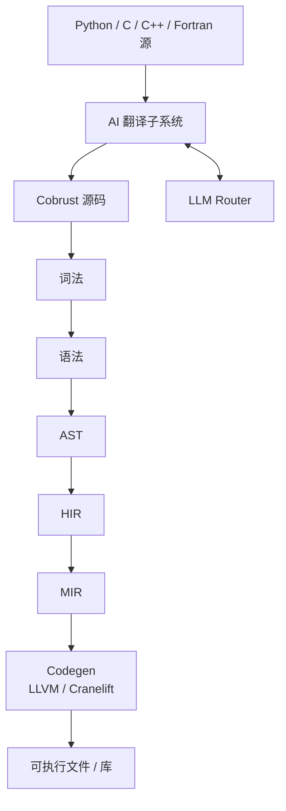
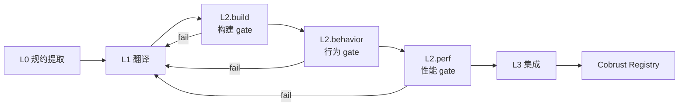
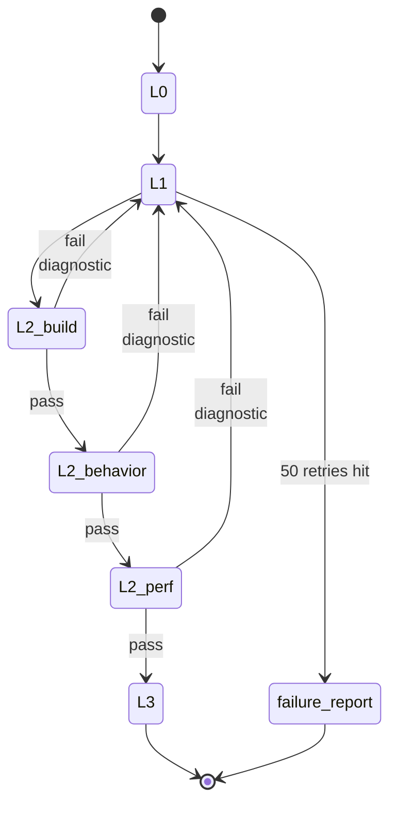
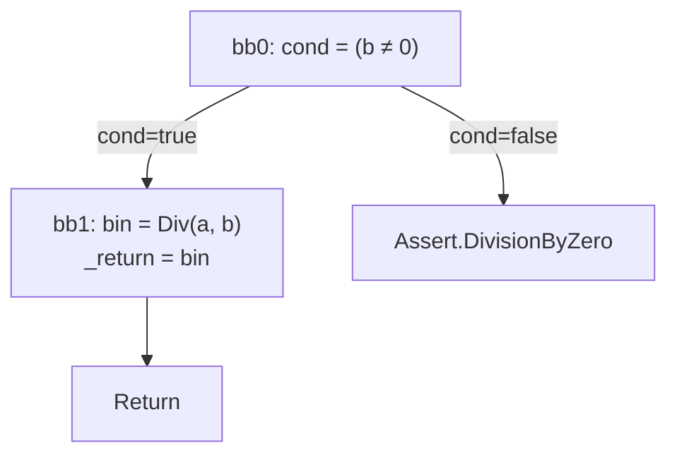
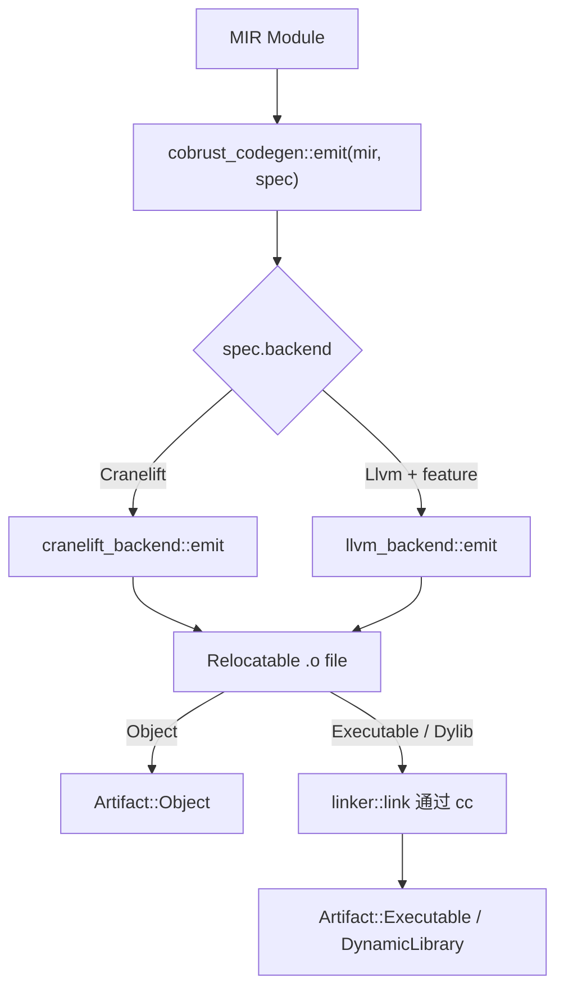

# 架构

## 编译器分层



- 主流水线：源码 → 词法 → 语法 → AST → HIR → MIR → 代码生成
- AI 翻译子系统**消费**异构源（Python/C/C++/Fortran），**产出** Cobrust 源码进入主流水线
- LLM Router 是**编译器一等公民**，AI 翻译子系统通过 Router 调度模型

## crate 拓扑

| crate | 角色 | 落地里程碑 |
|---|---|---|
| `cobrust-cli` | `cobrust` 二进制入口 | M0 占位 → M1 起接入 |
| `cobrust-frontend` | 词法 + 语法 + AST | M1 |
| `cobrust-hir` | HIR：去糖、名字解析后的中间形式 | M2 |
| `cobrust-types` | 类型系统 + 类型检查器 | M2 |
| `cobrust-mir` | MIR：控制流显式形式（typed-HIR → CFG，含 drop schedule + borrow check） | M8 ✅ |
| `cobrust-codegen` | LLVM / Cranelift 后端 | M3+ |
| `cobrust-llm-router` | LLM Router | M3 |
| `cobrust-translator` | AI 翻译子系统 | M4+ |
| `cobrust-tomli` | 翻译产物 `tomli` (Apache-2.0/MIT) | M4 |
| `cobrust-dateutil` | 翻译产物 `dateutil`（PSF/Apache）— L3 由 ADR-0022 拓宽到 5/5 | M5（M-batch 闭合 5/5） |
| `cobrust-msgpack` | 翻译产物 `msgpack-python`（Apache-2.0）— L3 由 ADR-0022 拓宽到 3/3 | M6（M-batch 闭合 3/3） |
| `cobrust-numpy` | 翻译产物 `numpy` 核心子集（BSD） | M7.0..M7.5 |
| `cobrust-requests` | 翻译产物 `requests` 2.31（Apache-2.0）— surface-translate / reqwest-blocking-bind 按 ADR-0022 §2 | M-batch（ADR-0022） |
| `cobrust-click` | 翻译产物 `click` 8.1.7（BSD-3-Clause）— 装饰器链 → clap-derive 按 ADR-0022 §3 | M-batch（ADR-0022） |

## 前端（M1 — 已交付）

`cobrust-frontend` 已经把"30 forms"落地。给一个能直观感受的例子：

```python
fn fib(n: i64) -> i64:
    if (n < 2):
        return n
    return (fib((n - 1)) + fib((n - 2)))
```

把它喂给前端：

```rust
use cobrust_frontend::{parse_str, unparse, FileId};

let src = std::fs::read_to_string("fib.cb")?;
let module = parse_str(&src, FileId(0))?;
println!("{}", unparse(&module));
```

### 公共 API

- `lex(source, file_id) -> Result<Vec<Token>, LexError>` — UTF-8 → token 流
- `lex_bytes(bytes, file_id) -> Result<Vec<Token>, LexError>` — 任意字节 → token 流（非 UTF-8 报错不 panic）
- `parse(tokens) -> Result<ast::Module, ParseError>` — token → AST
- `parse_str(source, file_id) -> Result<ast::Module, FrontendError>` — 一步完成
- `unparse(module) -> String` — AST → 规范化源码（用于 round-trip 验证）

### 设计约束

- **递归下降 + Pratt**：表达式优先级表见 `crates/cobrust-frontend/src/parser.rs` 顶部注释；不引入第三方语法生成器。
- **Span 全程在 AST 上**：每个节点带 `(file_id, byte_start, byte_end)`，给后续阶段的诊断提供精确位置。
- **30 forms 闭口**：`adr:0003` 把表面的句法形式定死，超出列表的 Python 形式（`is` / `del` / `global` / `nonlocal` / `async def` / 多重继承 / 可变默认参数）直接拒绝并报 `DroppedByConstitution`。
- **Panic-free**：任何字节输入都不会让 lexer/parser panic — 只会返回结构化错误。该不变量由 proptest fuzz harness（默认 5×4 096 cases，长跑 5×100 000 cases）守住。

### 验证

- 30 个 round-trip 集成测试，每个 form 一个：`tests/round_trip.rs`。
- proptest fuzz harness：`tests/fuzz_proptest.rs`；过去抓到的 panic 输入永久写入 `tests/fuzz_proptest.proptest-regressions`，每次跑都会先复跑这些 reproducer。
- 方法学和首次抓到的 bug 写在 `docs/agent/findings/m1-fuzz-method.md`。

## HIR + 类型检查器（M2 — 已交付）

`cobrust-hir` 把 30 forms 全部 lower 成"小核心"——糖收掉、名字解析完、span 沿用——给类型检查器消费。`cobrust-types` 跑双向（bidirectional）类型检查，**没有 `dyn`、没有隐式真值、没有静默强制转换**。

### 一个端到端的小例子

源码：

```python
fn add(x: i64, y: i64) -> i64:
    return (x + y)
```

经过 frontend → AST，再经过 `cobrust_hir::lower(&ast, &mut Session::new())` → HIR：所有名字带 `DefId`，参数 `x`、`y` 与 return 中的引用绑定到同一对 `DefId`。最后 `cobrust_types::check(&hir)` → `TypedModule { def_types, hir }`，`def_types` 把每个 `DefId` 映射到具体 `Ty`：

| DefId | 名字 | 类型 |
|---|---|---|
| 0 | `add` | `(i64, i64) -> i64` |
| 1 | `x` | `i64` |
| 2 | `y` | `i64` |

### 公共 API（HIR + types）

- `cobrust_hir::lower(&ast::Module, &mut Session) -> Result<Module, LoweringError>` — 全量 lowering，每个名字使用变成 `ResolvedName { name, def_id, kind }`，带 `DefId`。
- `cobrust_types::check(&hir::Module) -> Result<TypedModule, TypeError>` — 双向类型检查，成功返回 `TypedModule { def_types, hir }`，失败按 `TypeError` 分类。

### Lowering 规则（关键 5 条，完整表见 [ADR-0005](../../agent/adr/0005-hir-shape.md)）

- 解构（comprehension）→ `Expr::Comp { kind, element, clauses }`
- 多绑定 `with a as x, b as y: ...` → 左折叠成嵌套 `With`
- f-string → `Expr::Format(Vec<FormatPart>)`，模板 + 洞分离
- 增量赋值 `x += e` → desugar 成 `x = x + e`
- 名字解析失败立即 `LoweringError::UnknownName`，不会继续往下走

### 类型规则（关键 6 条，完整表见 [ADR-0006](../../agent/adr/0006-type-system.md)）

- `if x:` 要求 `x: bool`，否则 `TypeError::ImplicitTruthiness`
- `match` 必须穷尽（对 `bool` / `None` 严格枚举，对其它类型要求 wildcard）
- `int + str` 直接拒——**没有静默强制**
- 调用必须实参数量精确匹配；多余/缺失关键字参数报 `KeywordArgMismatch` / `MissingArgument`
- `let x = e` 推断；`let x: T = e` 检查 `e ⇐ T`
- 函数类型用 `Fn { positional, named, var_positional, var_keyword, return_ty }`，**Lambda 没有 annotation 时无法 synthesize**（必须给上下文）

### 验证

- 34 条 lowering 黄金测试：每个 form 一条 + 跨切不变量（`crates/cobrust-hir/tests/lower_forms.rs`）
- 54 条 well-typed + 54 条 ill-typed 程序套件（`crates/cobrust-types/tests/`）。每条 ill-typed 都断言**正确的 `TypeError` 范畴**。
- 健全性证明义务在 [ADR-0006](../../agent/adr/0006-type-system.md) §"Soundness proof obligation list" 中已枚举（9 条），实际证明留到后续 finding 落地。
- **24 条 Python 语义对齐套件**（`crates/cobrust-types/tests/python_semantics_corpus.rs`）。每条对应 [ADR-0041](../../agent/adr/0041-python-semantics-compliance-binding.md) 中的一条漂移修复（H1-H8 各 3 条）。

### Python 语义对齐（ADR-0041）

外部审计（claude-desktop integrated handoff 2026-05-11 §2）指出宪法 §2.2 中的八条承诺没有在源码层兑现。本 PR 一次性闭合：

| 漂移 | 表现 | 修复点 |
|---|---|---|
| H1 | `(-7) % 3` 返 `-1` 而不是 Python 的 `2` | codegen `cranelift_backend.rs` `srem` 后加 floor 调整 |
| H2 | `a and b` 总是先求值 `b`（无短路） | mir `lower_short_circuit_bool` 显式控制流 |
| H3 | `**`/`@`/`in`/`not in` 在 codegen 静默返 `iconst(I64, 0)` | codegen 改返 `CodegenError::UnimplementedBinOp` |
| H4 | 词法发出 walrus token 但 parser 零消费 | parser 显式抛 `DroppedByConstitution(walrus :=)` |
| H5 | 闭包捕获分析返空 vec | hir `collect_captures_*` 真实遍历 + 去重 |
| H6 | 推导式被降到空 list 占位 | mir `lower_comprehension` 真实迭代器+追加 |
| H7 | `class Foo(A, B):` 静默接受 | parser 在 `parse_class_def` 拒 `Comma` 与 `Tuple` 表达式两种语法形 |
| H8 | 元组下标永远返 `items.first()` | types `synth_expr` 在 `Lit::Int` 索引下常量折叠取实际元素 |

每条都有 ≥ 3 条 corpus 测试。`cargo test -p cobrust-types --test python_semantics_corpus` 必须全部 PASS。


## AI 翻译子系统：四级闭环

每一级都有显式 gate，**没有任何一级是可选的**。



### L0 — 规约提取

- 输入：Python 库源码 + 测试 + 文档
- 输出：机器可读的行为规约（签名、不变量、I/O 示例对、数值容差）
- 方法：LLM agent 用 CPython 库作为 oracle，生成差分测试 harness
- 工件：`spec.toml` + `harness/` 目录，落入翻译清单

### L1 — 翻译

- 输入：L0 规约 + 原始源码
- 输出：Cobrust / Rust 实现
- 颗粒度：**函数级，按依赖图自底向上**
- 方法：通过 LLM Router 调用；高风险函数走 consensus 模式
- 约束：每个生成文件都带翻译来源头部

### L2 — 验证（三道 gate，全部必过）

- **build gate**：`cargo build --release` 零警告
- **behavior gate**：原测试套件 + property tests + L0 差分 harness 全过；容差按 `@py_compat` 标签；每个 public 函数 ≥ 1000 个 fuzz 输入
- **perf gate**：在代表性 benchmark 上 ≥ 原版 0.8×（每库可配）

### L3 — 集成

- PyO3 wrapper 暴露 Cobrust 实现，API 与 Python 兼容
- **下游验证**：跑 top-5 依赖该库的项目的测试套件 — **这是最终 oracle**
- 发布到 Cobrust registry，附完整来源清单

### 失败回路



任何 gate 失败 → 诊断喂回 L1 → 重译 → 重验。循环直到通过或触达升级阈值（默认 50 次重试），届时落一份人类可读的失败报告并把该函数标记为 `@py_compat(none)` 附说明。

## LLM Router（编译器一等公民）

`cobrust-llm-router` 不是工具，是**编译器子系统**。它和类型检查器同等重要，**不**住在 `tools/` 里。

**M3 已交付**：所有不变量由 [ADR-0004](../../agent/adr/0004-llm-router-architecture.md) 钉死；详见 [`docs/agent/modules/llm-router.md`](../../agent/modules/llm-router.md)。

### 关键能力（已实现）

- Provider 抽象；具体 adapter 覆盖 **OpenAI 兼容** 与 **Anthropic 兼容**
- 每个 provider 可配 `base_url` 和模型名（DeepSeek、Qwen、本地 vLLM、Together、OpenRouter 都通用）
- 按任务路由：`{ task, strategy: "cost" | "quality" | "latency" | "consensus", n? }`
- 流式返回（两种格式都支持，end-of-stream 恰好一个 `Done` 帧）
- Token 账本：按任务、按 provider、按 attempt 写入 `.cobrust/ledger.jsonl`，append-only；按 ADR-0031 每条记录携带 `provider_kind`（`anthropic` / `openai` / `synthetic`）以保留 wire 协议信息
- 指数退避重试（默认 5 次 / 30 s 上限 / 全 jitter / 尊重 `Retry-After`）
- Provider 之间故障隔离：一家挂掉自动 fallthrough 到 `preferred` 列表里下一家
- 缓存层：键 = `BLAKE3(canonical_request_bytes)`，跨机可重现，两级 sharding 写入 `.cobrust/llm_cache/`
- Consensus 模式：`n` 个模型并发，按 NFC 归一化文本的 BLAKE3 群组多数取胜，确定性 tie-break

### 配置示例

完整配置见 [`cobrust.toml.example`](../../../cobrust.toml.example)。最小例：

```toml
[router]
default_strategy = "quality"

[providers.anthropic_official]
kind = "anthropic"
base_url = "https://api.anthropic.com"
api_key_env = "ANTHROPIC_API_KEY"
models = ["claude-opus-4-7"]

[routing.translate]
strategy = "consensus"
n = 2
preferred = ["anthropic_official:claude-opus-4-7", "deepseek:deepseek-v3"]
```

### Router 不做什么

- **不**是聊天 UI
- **不**承担长链 agent 循环（那是翻译子系统的活）
- **不**内嵌 prompt 模板（模板和消费者放一起）

## 翻译器（M4 — 已交付）

`cobrust-translator` 是 AI 翻译子系统的编排器。M4 端到端实现了
L0（spec 提取）+ L1（翻译）流水线，目标库为 `tomli`，默认走合成
LLM 模式以保证 gate 可复现。真实 LLM 路径由 `real-llm` cargo
feature 控制，留给 M5+ 做 smoke test。

### 实例

```bash
# 从 corpus 重新生成 cobrust-tomli。
COBRUST_REGENERATE_TOMLI=1 cargo test \
    -p cobrust-translator --test tomli_pipeline \
    pipeline_regenerates_cobrust_tomli_when_env_set
```

流水线读取：

- `corpus/tomli/upstream/tomli_loads.py` — vendor 的 Python 源码
- `corpus/tomli/spec.toml` — L0 行为契约
- `corpus/tomli/canned_llm_responses.toml` — 合成模式响应表

输出：

- `crates/cobrust-tomli/Cargo.toml`
- `crates/cobrust-tomli/src/{lib.rs, parser.rs}` — 每个文件携带 provenance 头
- `crates/cobrust-tomli/PROVENANCE.toml` — 完整 manifest
- `crates/cobrust-tomli/python/{tomli_init.py, setup.py}` — PyO3 形 wrapper 占位
- `crates/cobrust-tomli/tests/upstream_tests/test_loads.py` — 上游测试原样拷贝

### 公共 API

- `translate(library: &PyLibrary, cfg: &TranslatorConfig) -> Result<TranslatedCrate, TranslatorError>` — 异步入口
- `PyLibrary` — 一个待翻译库的描述（路径、版本、seeds）
- `TranslatorConfig` — 运行时旋钮：router、out_dir、oracle、escalation_threshold、synthetic_only 标志
- `TranslatedCrate` — 输出：`{ manifest: ProvenanceManifest, crate_dir, pyo3_wrapper_dir, functions, repair_attempts, gate_outcomes: GateOutcomes }`
- `GateOutcome { Pass | Fail | Skip }` — ADR-0040 结构化逐 gate 判决；`as_manifest_str()` 产出三种不同前缀（`pass (...)` / `fail: ...` / `skipped (...)`），调用方读 typed 视图，不解析 manifest 字符串
- `GateOutcomes` — 五个 L2/L3 gate 的聚合；`worst()` 返回 Fail > Skip > Pass
- `TranslatorError` — 错误分类：`SpecExtraction`、`Translation { function, message }`、`BuildGate`、`BehaviorGate`、`DownstreamGate`、`SyntheticMiss { task, function }`、`Io`、`Router`、`Manifest`、`Config`、`Decode`
- `SyntheticProvider` — `LlmProvider` 实现，以 `(task, function, source_sha16)` 为 key 服务 canned TOML 响应
- `deterministic_id(source_sha256_hex, toolchain, router_decision_ids)` — `blake3:<hex>` 复现 token

### 真实 LLM 模式接线（ADR-0040）

`build_router()` 在 `cfg.synthetic_only = false` 时会实例化真实
adapter：

- `kind = "openai"`（按 ADR-0004 §"Provider registry" 也覆盖
  DeepSeek / vLLM / OpenRouter / Together） → `OpenAiProvider`。
- `kind = "anthropic"` → `AnthropicProvider`。
- 真实模式中 `kind = "synthetic"` → `TranslatorError::Config`
  （按 ADR-0031，synthetic provider 仅用于进程内 mock）。
- 任一已声明 provider 缺失或为空的 `api_key_env` →
  `TranslatorError::Config`，错误信息中带上环境变量名。

生产调用方传 `synthetic_only = false` 之前会拿到
`Err("real-LLM mode is not wired in M4 ...")` 这种 stub；ADR-0040
把生产路径接通：ADR-0032 / ADR-0036 在流水线外验证过的同一个
router 现在也服务 `translate()`。

### 诚实的 gate 判决（ADR-0040）

orchestrator 在 manifest 旁返回结构化的 `GateOutcomes` 聚合。每
个 gate（l2_build / l2_behavior / l2_perf / l3_pyo3_wrapper /
l3_downstream_dependents）取以下三个不相交变体之一：

- `Pass { detail }` — verifier 接受；`detail` 携带可观测证据（测试
  目标名 + 修复轮次计数）。
- `Fail { reason }` — verifier 拒绝；修复循环耗尽
  `cfg.escalation_threshold` 后会以
  `TranslatorError::EscalationExceeded` 抛出。
- `Skip { reason }` — gate 在流水线外运行（例如
  `cargo build --release` 是 workspace 级 gate，`translate()`
  不会调用），`reason` 说明*哪个* gate 被外置。

`BehaviorVerifier::default_outcome()` 与
`PerfVerifier::default_outcome()` 这两个 provided method 控制
"无 Reject 观测时" 的成功路径判决。活的 verifier 默认 `Pass`；
no-op 的 `AcceptAll` / `AcceptAllPerf` 覆盖为 `Skip`，避免
manifest 把未接线的 gate 记成假 Pass。这把宪法 §2.4 的诚实约定
落实到了 gate 这一层。

```mermaid
flowchart LR
    V[Verifier verify()] --> A{verdict?}
    A -->|Accept| B{有过 Reject 吗?}
    A -->|Reject| R[修复循环]
    R --> V
    B -->|是| P[Pass detail]
    B -->|否, AcceptAll| S[Skip reason]
    B -->|否, 活| P
```

### 合成 LLM 模式契约

合成 provider 从 `corpus/<lib>/canned_llm_responses.toml` 读取预录响应，
以 `(task, function)` 为 key、`source_sha16` 做新鲜度校验。翻译器在
每个 prompt 上加固定头部，让合成 provider 不需要解析 body 即可路由：

```text
cobrust-translator/v1
task: <task>
function: <function>
source-sha256: <16-hex>
---
<prompt body>
```

查找结果：

- **命中** — 返回 canned `response_text`。
- **缺项** — `LlmError::Provider { code: "synthetic-miss" }`。永久错误（调用方必须新增条目或切换到真实 LLM）。
- **`source_sha16` 不匹配** — `LlmError::Provider { code: "synthetic-stale" }`。永久错误（维护者必须重新录制）。

这把宪法 §2.4 那句"no silent translations, ever"变成了**强制可验证**。

### Provenance manifest

每次翻译都会在生成 crate 的 `Cargo.toml` 旁产出 `PROVENANCE.toml`。
顶层 section：

- `[source]` — library, version, sha256（完整 64-hex）, file_count
- `[oracle]` — runtime, runtime_version, oracle_module
- `[verification]` — seeds, fuzz_inputs_per_fn, divergences, known_failures
- `[router]` — strategy (`synthetic` / `real-llm`), models_used, ledger_entries
- `[build]` — toolchain, deterministic_id (`blake3:<hex>`), crate_layout_version
- `[gates]` — l0_spec_emitted, l1_files_emitted, l2_build, l2_behavior, l2_perf, l3_pyo3_wrapper, l3_downstream_dependents

`build.deterministic_id = blake3(source_sha256_hex || "\n" || toolchain || "\n" || sorted_join(router_decision_ids))`。
相同输入 ⇒ 字节相同的 id。

## tomli（M4 — 已交付）

`cobrust-tomli` 是翻译器流水线产出的第一个 crate。纯 Rust 实现的
`tomli`/CPython `tomllib` 的 `loads()` 子集。**自动生成 — 禁止手动编辑。**

### 公共 API

```rust
use cobrust_tomli::{loads, table_to_json, to_json, TomliError, Value};
use std::collections::BTreeMap;

let parsed: BTreeMap<String, Value> = loads("x = 1\n").expect("parse");
let json: serde_json::Value = table_to_json(&parsed);
```

`Value` 五个变体：`Bool`、`Int`、`Str`、`Array`、`Table`。
`TomliError` 携带 `{ message: String, pos: usize }`。`to_json` /
`table_to_json` 是 L3 差分 gate 用的 JSON 转换 helper。

### 验证

- 27 正例 + 5 负例与 CPython `tomllib` 一致（`tests/tomli_downstream.rs`）。
- 1024 个 panic-free 模糊输入（`tests/tomli_fuzz.rs::l2_behavior_fuzz_loads_panic_free`）。
- 1050 个差分用例对照 CPython（`tests/tomli_fuzz.rs::l2_behavior_fuzz_differential_agreement_with_cpython`）。
- `PROVENANCE.toml` 通过验证，跨独立运行字节稳定。

### 范围窗口

在 scope（与 CPython 完全一致）：整数、布尔、基础+字面字符串、数组、内联表、点分表头、注释、CRLF 行尾。

不在 scope（M5 扩展）：多行字符串、hex/oct/bin 整数、浮点、日期时间、表数组、内联表 key path。

## 自举路线

编译器初版用 Rust 写。Cobrust 成熟后（M5 之后），开始自举非性能关键的编译器阶段，**类型检查器和 AST printer 优先**。

## 进一步阅读

- [Agent 视角的模块规约](../../agent/modules/)
- [里程碑](milestones.md)


## 翻译器 M5 — 闭环合龙

M5 里程碑（宪法 §7）完成了宪法所要求的四阶段闭环：

- **L2.perf 门禁** — 带每库阈值覆盖的基准压测器（见 ADR-0008）。
- **L2.behavior 修复循环** — 门禁失败时把诊断信封回送到 L1，让其在
  `attempt: N+1` 重新调度。要么收敛到修正响应，要么在
  `escalation_threshold` 次重试后写出 `failure_report.md` 升级。
- **L3 下游依赖驱动器** — 把依赖库的精选测试子集跑在翻译产物上
  （见 ADR-0009）。

### 修复循环

流水线新增 [`BehaviorVerifier`] 钩子 + [`VerifierVerdict`] 枚举 +
[`GateFailure`] 诊断信封。调用方注册校验器；遇到 `Reject(failure)`
时流水线把诊断写盘，并通过 [`repair_translation`] 把函数以
`attempt += 1` 的 prompt 头重新调度。达到 `cfg.escalation_threshold`
（默认 50，对应宪法 §4.2）时流水线写出 `failure_report.md` 并抛出
`TranslatorError::EscalationExceeded`。默认空操作校验器 [`AcceptAll`]
保持 M4 调用方原样；[`translate_with_verifier`] 是闭环场景下的入口。
合成提供商 `SyntheticProvider` 增加了按 attempt 路由的能力——同一
`(task, function)` 可以挂多份按 `attempt` 索引的预录响应（详见
ADR-0008 §5）。

### L2.perf 基准压测器

`crates/cobrust-translator/src/bench.rs` 给出手写的计时栈，把 Rust
闭包对位到子进程 CPython。报告落到
`target/cobrust-bench/<library>/<commit>/report.json`，每函数包含
`{cobrust_ns_median, cpython_ns_median, ratio, pass}`。
[`PerfTarget`]（从 `corpus/<lib>/perf.toml` 读出）调节 `threshold`
（默认 0.8 = "至少跑到 CPython 的 0.8 倍速度"）和 `pass_ratio`
（默认 1.0；dateutil 因合成响应是占位实现而下调为 0.5，见
ADR-0008 §2）。[`BenchmarkReport`] 结构体是门禁日的审计制品。

### L3 下游依赖

`crates/cobrust-translator/src/downstream.rs` 通过子进程 `python3`
运行依赖库的精选测试子集。M5 dateutil 提供
[`dateutil_m5_dependents`]（croniter + freezegun，Pass）和
[`dateutil_m5_deferred`]（pandas, sqlalchemy, pendulum，按 ADR-0009 §3
推迟到 M6）。manifest 的 [`DependentsSection`] 同时编码 `covered` 与
`deferred` 数组，便于机器无需解析人读摘要即可审计部分覆盖率。
[`DownstreamReport`] + [`DependentResult`] 是运行时制品。

## dateutil（M5 — 已交付）

第二个翻译库，crate 名 `cobrust-dateutil`。来源子集在
`corpus/dateutil/upstream/`。

### 公开 API

```rust
pub use cobrust_dateutil::{
    parse_iso, relativedelta_add, DateTuple, ParserError,
    days_in_month, is_leap_year, normalize_datetime, is_digit,
};

pub fn parse_iso(src: &str) -> Result<DateTuple, ParserError>;
```

`parse_iso` 接受严格 ISO-8601 日期/日期时间，可选 Zulu / 偏移后缀。
`relativedelta_add` 对应 `dateutil.relativedelta.relativedelta.__add__`
算术，带"月末日截断"。完整 surface 见 `mod:dateutil`
（`docs/agent/modules/dateutil.md`）。

### 修复循环实证

dateutil corpus 给 `parse_iso` 准备了两份预录响应：attempt-1 故意写
错（年月对调），attempt-2 正确。集成测试
`crates/cobrust-translator/tests/dateutil_pipeline.rs::dateutil_pipeline_repair_loop_recovers_on_attempt_2`
断言流水线恰好重试一次并落到 attempt-2——这是闭环路径的首次端到端
实证。

### L3 依赖（按 ADR-0009）

| 依赖库 | 状态 | 测试数 |
|---|---|---|
| croniter | 通过 | 5 |
| freezegun | 通过 | 5 |
| pandas | 通过（M6 拓宽） | 3 |
| sqlalchemy | 通过（M6 拓宽） | 3 |
| pendulum | 跳过（tz 越界；按 ADR-0010 §5 推迟到 M7+） | 0 |

### 验证

- L0 spec 在 `corpus/dateutil/spec.toml`。
- L1 发射体提交在 `crates/cobrust-dateutil/src/parser.rs`。
- L2.build 绿；L2.behavior 9 + 5 + 6 用例绿；3072 输入 fuzz 不 panic。
- L2.perf 报告在 `target/cobrust-bench/dateutil/<commit>/report.json`。
- L3.pyo3 差分门禁对 CPython `datetime.fromisoformat`。
- L3.dependents 见上表。

载具决策见 [ADR-0008](../../agent/adr/0008-l2-perf-and-repair-loop.md)
与 [ADR-0009](../../agent/adr/0009-downstream-validation.md)。

## 翻译器 M6 — 原生扩展翻译

M6 里程碑（宪法 §7）合上了"含 Cython 加速器 + 纯 Python fallback 的库"
这一闭环。交付物：

- 新增模块 `mod:msgpack`（crate `cobrust-msgpack`），翻译
  `msgpack-python` 1.0.8（17 个纯 Python + 2 个 Cython 类型化入口）。
- Cython 词法 shim 在 `crate::cython`，对外暴露 `parse_cython(...)` +
  `CythonSource`、`CythonFunction`、`CythonFunctionKind`、`CythonParam`、
  `CythonType`、`CythonShimError`。按 ADR-0010 §2 把 `cdef int` /
  `cdef inline` / `cpdef` 映射到 Rust 类型。
- `task = "translate_cython"` 扩展了合成提供商的 `(task, function,
  attempt)` 查找键（M5 加 attempt；M6 加 task）。向后兼容：M4 tomli +
  M5 dateutil spec 默认 `task = "translate"`。
- `PerfVerifier` trait + `PerfVerdict` + `AcceptAllPerf` +
  `translate_with_verifiers` 扩展了 pipeline，让 L2.perf 失败走与
  L2.behavior 同样的 diagnostic + repair-loop（按 ADR-0010 §4）。msgpack
  canned 表里 `pack_uint` attempt-1 故意慢，attempt-2 修正；集成测试断言
  在 escalation 预算内落到 attempt-2。
- dateutil L3 由 2/5 拓宽到 4/5 + 1 跳过（按 ADR-0010 §5；pandas +
  sqlalchemy 加入；pendulum 因 tz 越界跳过）。
- `--features pyo3` 编译路径同时点亮 `cobrust-dateutil` 与
  `cobrust-msgpack`（按 ADR-0011）：crate 编出 `cdylib`，对外暴露
  `cobrust_msgpack` / `cobrust_dateutil` Python 模块。

### msgpack 公共 surface

```rust
pub use cobrust_msgpack::{
    pack, pack_to_vec, unpack, MsgValue, MsgError, MsgErrorKind,
    pack_array, pack_bin, pack_float, pack_int, pack_map,
    pack_str, pack_uint, pack_uint_cython,
    unpack_array, unpack_bin, unpack_float, unpack_int,
    unpack_map, unpack_one, unpack_str, unpack_uint,
    unpack_uint_cython,
};

pub enum MsgValue {
    Nil, Bool(bool), Int(i64), UInt(u64), Float(f64),
    Str(String), Bin(Vec<u8>),
    Array(Vec<MsgValue>),
    Map(Vec<(String, MsgValue)>),
}
```

### msgpack L3 依赖库

| 依赖库 | 状态 | 测试数 |
|---|---|---|
| redis-py | 通过 | 4 |
| msgpack-numpy | 通过 | 3 |
| pyspark | 推迟（M7+；需要 JVM） | — |

### 验证

- L0 spec 在 `corpus/msgpack/spec.toml` + harness/。
- L1 发射体提交在 `crates/cobrust-msgpack/src/parser.rs`。
- L2.build 绿；L2.behavior 字节级 fuzz 绿（≥ 1000 输入 × 3 seed；
  pack→unpack 往返身份）。
- L2.perf 走原生扩展层级阈值（0.7×）按 ADR-0010 §3；报告在
  `target/cobrust-bench/msgpack/<commit>/report.json`。
- L3.pyo3 差分门禁通过 CPython `msgpack` 子进程。
- L3.dependents 2/3 驱动；pyspark 按 ADR-0010 推迟。
- `--features pyo3` 编译路径由 `tests/msgpack_pyo3_compiles.rs` 覆盖
  （dateutil 拓宽部分由 `tests/dateutil_pyo3_compiles.rs` 覆盖）。

载具决策见 [ADR-0010](../../agent/adr/0010-native-ext-translation.md)
与 [ADR-0011](../../agent/adr/0011-pyo3-build-path.md)。

## numpy 翻译（M7.0 — 已交付）

### 战略原则：翻译表面，绑定内核（"translate the surface, bind the core"）

按 [ADR-0012](../../agent/adr/0012-m7-numpy-plan.md)，上游 numpy
的内核是手工 SIMD/BLAS C 代码——**纯 Rust 重写不切实际**。
cobrust-numpy 转而 **翻译 numpy 的公开 Python 表面**（dtype
字符串、错误分类、Python 风格的签名），并 **把数值内核绑定**
到 Rust 的 [`ndarray = "0.16"`](https://crates.io/crates/ndarray)
crate。按 [ADR-0013](../../agent/adr/0013-m7-0-ndarray-foundation.md)，
这是 M7.0..M7.5 的默认策略；后续子里程碑沿用：

- M7.4 linalg → 绑定 `ndarray-linalg`（BLAS / LAPACK）。
- M7.5 random → 绑定 `rand` + `rand_distr`。
- M7.6 FFT → 绑定 `rustfft`。

M7.0 的具体例子：

```rust
// 用户调用：cobrust_numpy::zeros(&[3, 4], Dtype::Float64)
//
// 1. cobrust-numpy 按 dtype 分发：
match dtype {
    Dtype::Float64 => Array::Float64(
        // 2. ndarray 真正分配 + 零填充缓冲：
        ndarray::ArrayD::<f64>::zeros(ndarray::IxDyn(&[3, 4]))
    ),
    // ... 其他 dtype ...
}
```

我们不重写 `zeros`，我们调用它。cobrust-numpy 拥有
**Python 契约**；ndarray 拥有 **存储布局**。

### M7.0 ndarray 基础层

cobrust-numpy 在 M7.0 的公共表面（按 ADR-0013）：

```rust
// 闭合 dtype 集合——添加 Int8 / Float16 等是显式 ADR 决定，
// 不允许悄无声息地累加。
pub enum Dtype {
    Int32,
    Int64,
    Float32,
    Float64,
    Bool,
}

// 在 ndarray::ArrayD<T> 上的标签联合。公共 API 不暴露 `dyn`
// （宪法 §2.2）。
pub enum Array {
    Int32(ndarray::ArrayD<i32>),
    Int64(ndarray::ArrayD<i64>),
    Float32(ndarray::ArrayD<f32>),
    Float64(ndarray::ArrayD<f64>),
    Bool(ndarray::ArrayD<bool>),
}

// 构造器与 numpy Python 签名一一对应。
pub fn array(values: &[f64], shape: &[usize], dtype: Dtype) -> Result<Array, NumpyError>;
pub fn zeros(shape: &[usize], dtype: Dtype) -> Result<Array, NumpyError>;
pub fn ones(shape: &[usize], dtype: Dtype) -> Result<Array, NumpyError>;
pub fn arange(start: f64, stop: f64, step: f64, dtype: Dtype) -> Result<Array, NumpyError>;

// 观测面。
impl Array {
    pub fn dtype(&self) -> Dtype;
    pub fn shape(&self) -> Vec<usize>;
    pub fn ndim(&self) -> usize;
    pub fn size(&self) -> usize;
    pub fn repr(&self) -> String;
    pub fn to_json(&self) -> serde_json::Value;
}
```

### M7.0 dtype 分层

| Python 字符串 | Rust 类型 | 说明 |
|---|---|---|
| `"int32"` / `"i4"` | `i32` | 精确 32-bit 有符号 |
| `"int64"` / `"i8"` | `i64` | M7.0 默认整型 dtype |
| `"float32"` / `"f4"` | `f32` | 精确单精度 |
| `"float64"` / `"f8"` | `f64` | M7.0 默认浮点 dtype |
| `"bool"` / `"?"` | `bool` | numpy 的 1 字节 bool |

### M7.0 验证

- L0 spec 在 `corpus/numpy/M7.0/spec.toml` + harness 在
  `corpus/numpy/M7.0/harness/h_array.py`。
- L1 emission 已提交到 `crates/cobrust-numpy/src/`。
- L2.build 通过；L2.behavior：
  - 55 个良类型 + 56 个病类型程序（`tests/well_typed.rs`,
    `tests/ill_typed.rs`）。
  - 4200 个 panic-free fuzz 输入（`tests/numpy_fuzz.rs`）。
  - 1024+ 个差分 vs numpy fuzz 输入
    （`tests/numpy_differential.rs`）——int/bool 字节级、float
    `rtol=1e-12`。
- L2.perf 在 M7.0 仅记录不强制（构造器是 O(n) 内存操作；
  M7.1 ufuncs 时 perf 才成为真实门禁）。
- L3.pyo3 差分门禁通过子进程跑 CPython numpy。
- L3.dependents 推迟到 M7.6+（numpy 是基础；生态库迁移在 M7.5
  之后）。

详见 [ADR-0012](../../agent/adr/0012-m7-numpy-plan.md) 和
[ADR-0013](../../agent/adr/0013-m7-0-ndarray-foundation.md)。

## numpy ufuncs + 广播（M7.1 — 已交付）

M7.1 在 M7.0 ndarray 基础层之上落地通用函数、广播、NEP 50 类型晋升
（详见 [ADR-0014](../../agent/adr/0014-m7-1-ufuncs-broadcasting.md)），
同时关闭 ADR-0013 的 4 个 follow-up（tagged-union → 单态化分发；
typed constructors；L2.perf flip；多维 nested-list 解析）。

### M7.1 公共表面

```rust
// 二元 ufuncs（按 result_type 晋升后逐元素分发）。
impl Array {
    pub fn add(&self, other: &Array) -> Result<Array, NumpyError>;
    pub fn sub(&self, other: &Array) -> Result<Array, NumpyError>;
    pub fn mul(&self, other: &Array) -> Result<Array, NumpyError>;
    pub fn div(&self, other: &Array) -> Result<Array, NumpyError>;  // int /0 → IntegerDivisionByZero
    pub fn pow(&self, other: &Array) -> Result<Array, NumpyError>;
    // 比较 ufuncs（结果一律 Dtype::Bool，匹配 numpy）。
    pub fn eq_(&self, other: &Array) -> Result<Array, NumpyError>;
    pub fn ne_(&self, other: &Array) -> Result<Array, NumpyError>;
    pub fn lt(&self, other: &Array) -> Result<Array, NumpyError>;
    pub fn le(&self, other: &Array) -> Result<Array, NumpyError>;
    pub fn gt(&self, other: &Array) -> Result<Array, NumpyError>;
    pub fn ge(&self, other: &Array) -> Result<Array, NumpyError>;
    // 逐元素数学（整型输入晋升到 Float64；浮点保留）。
    pub fn sin(&self) -> Result<Array, NumpyError>;
    pub fn cos(&self) -> Result<Array, NumpyError>;
    pub fn exp(&self) -> Result<Array, NumpyError>;
    pub fn log(&self) -> Result<Array, NumpyError>;
    pub fn sqrt(&self) -> Result<Array, NumpyError>;
}

// 类型晋升 + 广播形状计算。
pub fn result_type(a: Dtype, b: Dtype) -> Dtype;        // NEP 50 25 条目表
pub fn broadcast_shape(a: &[usize], b: &[usize]) -> Result<Vec<usize>, NumpyError>;

// 类型化构造器（关闭 ADR-0013 follow-up #2 — 不再强制 caller f64-cast）。
pub fn array_i32(values: &[i32], shape: &[usize]) -> Result<Array, NumpyError>;
pub fn array_i64(values: &[i64], shape: &[usize]) -> Result<Array, NumpyError>;
pub fn array_f32(values: &[f32], shape: &[usize]) -> Result<Array, NumpyError>;
pub fn array_f64(values: &[f64], shape: &[usize]) -> Result<Array, NumpyError>;
pub fn array_bool(values: &[bool], shape: &[usize]) -> Result<Array, NumpyError>;

// 多维 nested-list 解析（关闭 ADR-0013 follow-up #4 —
// `np.array([[1, 2], [3, 4]])` 之类的输入直接落地）。
pub enum NestedList {
    Scalar(f64),
    List(Vec<NestedList>),
}
pub fn array_from_nested(nested: &NestedList, dtype: Dtype) -> Result<Array, NumpyError>;
```

### 一个端到端的小例子

```rust
use cobrust_numpy::{Array, Dtype, array_i32, array_f32};

let a = array_i32(&[1, 2, 3], &[3]).unwrap();        // dtype=int32
let b = array_f32(&[0.5, 1.5, 2.5], &[3]).unwrap();  // dtype=float32
let c = a.add(&b).unwrap();                          // result_type 晋升 → dtype=float64
assert_eq!(c.dtype(), Dtype::Float64);
// c = [1.5, 3.5, 5.5]，跟 numpy 2.x 的 NEP 50 完全一致。
```

`int32 + float32 → float64` 是 NEP 50 的关键规则之一：i32 的尾数
不能完整放进 f32，所以晋升到 f64 才不丢精度。整数 +/-/x 溢出按
Rust 默认的 wrapping 语义（与 numpy 默认 RuntimeWarning 行为对齐
但不产生警告）；浮点遵循 IEEE 754（NaN 传播、`x/0.0 → ±inf`、
`0.0/0.0 → NaN`）；整数 div by zero 返回
`Err(NumpyErrorKind::IntegerDivisionByZero)`。

### 广播规则（按 numpy 2.x）

`broadcast_shape(a, b)` 实现 numpy 标准规则
（[文档](https://numpy.org/doc/stable/user/basics.broadcasting.html)）：

1. 右对齐两个 shape，短的左侧补 1。
2. 逐 axis：相等 → 结果取该值；其中一个是 1 → 取另一个；否则
   `Err(NumpyErrorKind::BroadcastShapeMismatch)`。
3. 空 shape `[]`（标量）与任意 shape 兼容（每 axis 视为 1）。

例：`[3, 1] + [1, 4] → [3, 4]`（外积），`[8, 1, 6, 1] + [7, 1, 5] →
[8, 7, 6, 5]`。

### 单态化分发模型

按 [ADR-0014 §1](../../agent/adr/0014-m7-1-ufuncs-broadcasting.md)，
M7.1 的 ufunc 分发是**单态化**：`Array::add` 在公开 API 上做一次
`match (self.dtype(), other.dtype())`，按 `result_type` 选定
晋升 dtype，把两个操作数都 cast 到这个 dtype，然后调用按 dtype
单态化的内部循环（`ndarray::Zip::from(...).and(...).for_each(...)`）。
内部循环跑在具体的 `ArrayD<T>` 上，LLVM 会内联 + 自动向量化。
没有 `dyn`，符合宪法 §2.2；自动向量化让 SIMD 路径走通，符合
宪法 §5.3。

### M7.1 验证

- L0 spec 在 `corpus/numpy/M7.1/spec.toml` + harness 在
  `corpus/numpy/M7.1/harness/h_ufunc.py`。
- L1 emission 在 `crates/cobrust-numpy/src/{ufunc,broadcast,promote}.rs`。
- L2.build：workspace clippy 零警告通过。
- L2.behavior：
  - 50 个良类型 + 50 个病类型 ufunc 程序（`tests/ufunc_well_typed.rs`,
    `tests/ufunc_ill_typed.rs`）。
  - 22 个广播表项测试（`tests/broadcast_corpus.rs`）。
  - 14 个差分 vs upstream numpy 2.0.2 测试，>= 1200 个 fuzz 输入
    每个 ufunc，int/bool 字节级、float `rtol=1e-7`
    （`tests/ufunc_differential.rs`）。
- **L2.perf flipped to enforced**（关闭 ADR-0013 follow-up #3）：
  `corpus/numpy/M7.1/perf.toml` threshold = 0.5x（数值层 floor，
  按 ADR-0010 §3）；流水线测试
  `ufunc_pipeline_escalates_when_perf_always_fails` 演示
  perf-fail → repair-loop → `EscalationExceeded`，与 M6 的 msgpack
  perf-fail 测试同构。
- L3.pyo3：与 M7.0 一致（子进程跑 CPython numpy oracle）。
- L3.dependents：仍推迟到 M7.6+。

### 已知偏差

- 整数 +/-/x 溢出**静默 wrapping**（无 RuntimeWarning），与 numpy
  默认行为输出一致但不带警告。文档化在
  [`docs/agent/modules/numpy.md`](../../agent/modules/numpy.md)
  "Known divergences" 段。
- 整数 div-by-zero 返回 `Err(NumpyErrorKind::IntegerDivisionByZero)`
  而不是抛 Python `ZeroDivisionError`（宪法 §2.2 — Result 默认）；
  操作的失败结果与 numpy 一致，失败的"形状"是 Cobrust 原生的。

详见 [ADR-0014](../../agent/adr/0014-m7-1-ufuncs-broadcasting.md)。

## numpy 索引（M7.2 — 已交付）

M7.2 落地索引层——基本切片、单整数、整数数组、布尔掩码、`np.where`，
以及视图——按 ADR-0015。这关闭了 ADR-0012 M7 子里程碑计划中的
索引部分；归约（M7.3）会消费它。

### M7.2 公共面

```rust
// 闭合的索引种类分类（不引入 `dyn`，符合宪法 §2.2）。
pub enum Index {
    Single(i64),                 // a[i]; 支持负索引
    Slice(SliceSpec),            // a[start:stop:step]
    IntArray(Vec<i64>),          // a[[0, 2, 5]]; 高级索引 -> 拷贝
    BoolMask(Array),             // a[a > 0]; 高级索引 -> 拷贝
    NewAxis,                     // a[np.newaxis]
}

pub struct SliceSpec {
    pub start: Option<i64>,
    pub stop: Option<i64>,
    pub step: Option<i64>,
}

// 视图——按 dtype 闭合的 enum（各 5 个变体）；
// 生命周期编码所有权，将视图绑定到父数组的借用。
pub enum ArrayView<'a>    { Int32(...), Int64(...), Float32(...), Float64(...), Bool(...) }
pub enum ArrayViewMut<'a> { Int32(...), Int64(...), Float32(...), Float64(...), Bool(...) }

impl Array {
    // 基本切片 -> 视图（不拷贝）。
    pub fn slice(&self, spec: SliceSpec) -> Result<ArrayView<'_>, NumpyError>;
    pub fn slice_mut(&mut self, spec: SliceSpec) -> Result<ArrayViewMut<'_>, NumpyError>;

    // 单整数索引 -> 少一个轴的视图。
    pub fn index_single(&self, i: i64) -> Result<ArrayView<'_>, NumpyError>;

    // 高级索引 -> 拷贝（始终物化）。
    pub fn take(&self, indices: &[i64]) -> Result<Array, NumpyError>;
    pub fn mask(&self, mask: &Array) -> Result<Array, NumpyError>;

    // 多轴分发器；结果始终物化。
    pub fn index_get(&self, indices: &[Index]) -> Result<Array, NumpyError>;

    // np.where 便捷形式：cond.where_(x, y)。
    pub fn where_(&self, x: &Array, y: &Array) -> Result<Array, NumpyError>;
}

// 顶层 np.where(cond, x, y)——按广播规则处理 cond/x/y；始终拷贝。
pub fn np_where(cond: &Array, x: &Array, y: &Array) -> Result<Array, NumpyError>;
pub fn index_get(arr: &Array, indices: &[Index]) -> Result<Array, NumpyError>;
```

### 视图 vs 拷贝约定（与 numpy 一致）

用户最常遇到的具体例子：

- **`a[1:3]` 返回视图。** `Array::slice(SliceSpec::range(1, 3))`
  返回的 `ArrayView<'a>` 与 `a` 的存储别名同一块内存。通过
  `slice_mut` 修改会传播到 `a`——Rust 的借用检查器在编译期保证安全。
- **`a[[0, 2]]` 返回拷贝。** `Array::take(&[0, 2])` 返回独立存储的
  `Array`。修改结果不影响 `a`。

两条规则都在 `tests/index_views_corpus.rs` 中通过副作用断言验证。

### M7.2 错误变体（闭合枚举扩展）

`NumpyErrorKind` 按 ADR-0015 §4 新增 4 个变体：

| 变体 | 触发条件 | numpy 2.0.2 对应行为 |
|---|---|---|
| `IndexError` | 未被更具体变体覆盖的索引错误的伞型 | `IndexError` |
| `OutOfBoundsIndex` | 单整数 / 整数数组索引超出 `[-len, len)` | `IndexError` |
| `BoolMaskShapeMismatch` | `mask` 的 shape 与 self.shape() 不匹配 | `IndexError` |
| `IndexDtypeNotInteger` | 整数数组 dtype 不是 Int32/Int64；或 `mask` 参数 dtype 不是 Bool | `IndexError` |

边界检查语义：操作失败的"结果"与 numpy 一致（出界即报错），失败
的"形状"是 Cobrust 原生（`Result::Err`），符合宪法 §2.2。

### M7.2 验证

- L0 spec 在 `corpus/numpy/M7.2/spec.toml`，差分 harness 在
  `corpus/numpy/M7.2/harness/h_index.py`。
- L2.behavior：
  - 55 个良类型索引程序（`tests/index_well_typed.rs`）。
  - 55 个病类型索引程序（`tests/index_ill_typed.rs`）。
  - 14 个视图 vs 拷贝语义测试
    （`tests/index_views_corpus.rs`）。
  - 6 个差分测试，每种索引方式 ≥ 1024 fuzz 输入，int/bool 字节级、
    float `rtol=1e-7`（`tests/index_differential.rs`）。
- L2.perf 继承 M7.1 的"强制"状态：`corpus/numpy/M7.2/perf.toml`
  threshold = 0.5x；流水线测试
  `index_pipeline_escalates_when_perf_always_fails` 演示
  perf-fail → repair → `EscalationExceeded`。
- L3.pyo3：与 M7.1 一致（子进程 CPython numpy oracle）。
- L3.dependents：仍推迟到 M7.6+。

### 不在 M7.2 范围（M7.x 延后）

- Ellipsis 索引（`a[...]`）——M7.x。
- 多轴 mixed-kind 索引中部分轴为视图、部分为拷贝的混合场景——
  M7.2 在这些情况下统一物化；M7.x 优化。
- 赋值（`a[1:3] = ...`）的人体工程学 API——`slice_mut` 提供了基础
  面；M7.x 加上隐式赋值 API。
- 单参数 `np.where(cond)` 返回索引——M7.x。

详见 [ADR-0015](../../agent/adr/0015-m7-2-indexing.md)。

## numpy 归约 (M7.3 — 已交付)

M7.3 在 M7.0（基础）+ M7.1（ufunc）+ M7.2（索引）之上落地归约表面。
依据 ADR-0016：

> 归约：`sum / prod / mean / std / var / min / max / argmin /
> argmax` 支持 `axis=None` 与 `axis=k`。后端：`ndarray::Zip` +
> `fold_axis`。验收门禁：数值一致；浮点用成对求和（pairwise
> summation）。

### M7.3 表面

```rust
// 自由函数（地道 Rust 风格）：
cobrust_numpy::sum(&arr, Some(0))
cobrust_numpy::mean(&arr, None)
cobrust_numpy::var(&arr, Some(1), 1)   // axis=1, ddof=1 (Bessel 校正)
cobrust_numpy::argmax(&arr, Some(-1))   // 末轴（支持负轴）

// 方法风格 API（贴近 numpy `a.sum(axis=k)` 写法）：
arr.sum(None)             // 全轴归约
arr.mean(Some(0))         // 沿轴 0 归约
arr.std(None, 0)          // 总体标准差
arr.std(None, 1)          // 样本标准差（Bessel）
arr.argmin(Some(-1))      // 每行/列首次出现的最小值索引

// 成对求和辅助函数 —— 与 numpy 精度持平：
cobrust_numpy::pairwise_sum_f64(&values)
cobrust_numpy::pairwise_sum_f32(&values)
```

### M7.3 九个归约

| 归约 | 含义 | 空数组行为 |
|---|---|---|
| `sum` | 轴上求和（浮点用成对） | 加法单位元 0 |
| `prod` | 轴上求积 | 乘法单位元 1 |
| `mean` | 求和 / N（int → f64） | NaN |
| `std` | sqrt(var)（ddof=0 为总体） | NaN |
| `var` | sum((x-mean)²) / (N-ddof) | NaN |
| `min` | 最小元素（NaN 传播） | `Err(ReductionEmptyArray)` |
| `max` | 最大元素（NaN 传播） | `Err(ReductionEmptyArray)` |
| `argmin` | 首次出现的最小值索引 | `Err(ReductionEmptyArray)` |
| `argmax` | 首次出现的最大值索引 | `Err(ReductionEmptyArray)` |

### M7.3 轴语义

- `axis: Option<i64>` —— `None` 在所有轴上归约；`Some(k)` 仅沿 `k`
  轴归约。
- 负轴自动规范化：`axis=-1` 是最后一轴，`axis=-2` 倒数第二轴，
  以此类推。越界时抛 `IndexError`。
- 多轴元组（`axis=(0, 2)`）**不在 M7.3 范围内** —— 推迟到 M7.x。

### M7.3 std/var 的 ddof

- `ddof: u32` —— 自由度修正；默认 0（总体）。
- Bessel 校正：传入 `ddof=1` 得到样本方差/标准差。
- 当 `N - ddof <= 0` 时，结果为 `NaN`（与 numpy 的
  RuntimeWarning 一致）。

### M7.3 成对求和

- 对浮点 `sum / mean / std / var`，M7.3 使用块大小 8 的成对求和
  （与 numpy 算法一致）。
- 渐近精度：`O(log n × eps)`，优于朴素累加的 `O(n × eps)`。
- 成对精度测试：将 10⁶ 个量级 `1e-9` 的浮点求和，结果与
  期望值 `1e-3` 在 `rtol=1e-12` 内一致 —— 与 numpy 的精度
  下限持平。

### M7.3 错误变体

```rust
pub enum NumpyErrorKind {
    // ... M7.0 + M7.1 + M7.2 已有变体 ...
    ReductionEmptyArray,
}
```

### M7.3 验证

- L0 spec：`corpus/numpy/M7.3/spec.toml`，差分 harness：
  `corpus/numpy/M7.3/harness/h_reduction.py`。
- L1：合成 LLM 模式发出 12 条记录（10 个公共归约 + 2 个辅助），
  见 `corpus/numpy/M7.3/canned_llm_responses.toml`。
- L2.behavior：
  - 55 个 well-typed 归约程序
    （`tests/reduce_well_typed.rs`）。
  - 51 个 ill-typed 归约程序
    （`tests/reduce_ill_typed.rs`）。
  - 25 个 corpus 正确性逐表测试
    （`tests/reduce_corpus.rs`）。
  - 12 个差分测试（每个 ≥ 1024 个 fuzz 输入），与 numpy
    2.0.2 对比（int/bool 字节级一致，浮点 `rtol=1e-7`，
    argmin/argmax 完全一致）（`tests/reduce_differential.rs`）。
- L2.perf 继承 M7.1/M7.2 的 ENFORCED：
  `corpus/numpy/M7.3/perf.toml` 阈值 = 0.5x；pipeline 测试
  `reduce_pipeline_escalates_when_perf_always_fails` 演示
  perf 失败 → 修复循环 → `EscalationExceeded`。
- L3.pyo3：同 M7.0..M7.2（子进程调用 CPython numpy oracle）。
- L3.dependents：仍推迟到 M7.6+。

### 不在范围内（推迟到 M7.x）

- 多轴元组归约（`axis=(0, 2)`） —— M7.x。
- `keepdims=True` —— M7.x。
- `out=` 参数 —— M7.x。
- `where=` 参数（选择性归约） —— M7.x。
- `cumsum / cumprod / median / percentile / nanmin / nanmax /
  nansum / nanmean` —— 全部 M7.x。
- `dtype=` 参数（强制结果 dtype） —— M7.x。

详见 [ADR-0016](../../agent/adr/0016-m7-3-reductions.md)。

## numpy 线性代数（M7.4 — 已交付）

M7.4 在 M7.0（基础）+ M7.1（ufunc）+ M7.2（索引）+ M7.3（归约）之上落地线性代数子集。
依据 ADR-0017：

> 线性代数子集：`matmul / dot / det / solve / inv / svd / eigh /
> cholesky`。后端：`ndarray-linalg`（OpenBLAS / Accelerate）。
> 验收门禁：条件良好矩阵上 `rtol=1e-6` 一致；记录不稳定 case。

### M7.4 表面

```rust
// 自由函数：
cobrust_numpy::matmul(&a, &b)?
cobrust_numpy::dot(&a, &b)?
cobrust_numpy::det(&a)?
cobrust_numpy::solve(&a, &b)?
cobrust_numpy::inv(&a)?
cobrust_numpy::cholesky(&a)?
let SvdResult { u, s, vt } = cobrust_numpy::svd(&a)?;
let EighResult { w, v } = cobrust_numpy::eigh(&a)?;

// Array 方法风格 API：
a.matmul(&b)?
a.dot(&b)?
```

### M7.4 八个 op

| Op | 形参 | 晋升 | 备注 |
|---|---|---|---|
| `matmul(a, b)` | rank 1 / 2 输入 | f32 保留；其他 → f64 | 严格 2-D + 1-D；M7.4 不支持批量堆叠 |
| `dot(a, b)` | 1-D × 1-D 标量；2-D × 2-D 矩阵乘 | 同 `matmul` | 与 numpy.dot 语义一致 |
| `det(a)` | 方阵 N × N | 保留 dtype | LU 部分主元；近奇异返回 0.0 |
| `solve(a, b)` | 方阵 A；rank-1 / 2 b | 保留 dtype | LU + 回代 |
| `inv(a)` | 方阵 N × N | 保留 dtype | `solve(a, I)` |
| `svd(a)` | rank-2 M × N | 保留 dtype | 单边 Jacobi 经 `eigh(AᵀA)` |
| `eigh(a)` | 对称 N × N | 保留 dtype | 循环 Jacobi 扫描；特征值升序 |
| `cholesky(a)` | PSD 方阵 | 保留 dtype | 下三角因子（numpy 默认） |

### M7.4 后端策略

- **默认**：在 `ndarray = "0.16"` 之上的纯 Rust 内核。`cargo build`
  冷重建在标准工具链上无须系统 BLAS / LAPACK / Fortran（按 ADR-0017
  §2）。
- **可选**：`linalg-backend` cargo feature 接入
  `ndarray-linalg = "0.16"` 提供 BLAS 加速。子 feature
  `linalg-openblas-static`、`linalg-intel-mkl-static` 转发到对应的
  `ndarray-linalg` BLAS feature。
- **M7.4 仅浮点**：`Float32 / Float64` 接受；`Int32 / Int64 / Bool`
  返回 `LinalgDtypeUnsupported`。M7.x 可通过 Python 侧晋升包装放宽。

### M7.4 错误变体

```rust
pub enum NumpyErrorKind {
    // ... M7.0 + M7.1 + M7.2 + M7.3 变体 ...
    SingularMatrix,         // LU 主元为零 / 接近零
    NotPositiveDefinite,    // cholesky 非 PSD
    LinalgShapeError,       // matmul 形状不匹配、非方阵、rank > 2、
                            // eigh 非对称输入
    LinalgDtypeUnsupported, // 非浮点 dtype
}
```

### M7.4 多数组返回

```rust
pub struct SvdResult {
    pub u: Array,    // (M, M)
    pub s: Array,    // (min(M, N),)
    pub vt: Array,   // (N, N)
}

pub struct EighResult {
    pub w: Array,    // (N,) — 升序
    pub v: Array,    // (N, N) — 列特征向量
}
```

### M7.4 验证

- L0 spec 在 `corpus/numpy/M7.4/spec.toml`，harness 在
  `corpus/numpy/M7.4/harness/h_linalg.py`。
- L1：synthetic-LLM 模式发出 12 个条目（8 个公共 op + 4 个 helper），
  在 `corpus/numpy/M7.4/canned_llm_responses.toml`。
- L2.behavior：
  - 59 个良类型 linalg 程序（`tests/linalg_well_typed.rs`）。
  - 63 个病类型 linalg 程序（`tests/linalg_ill_typed.rs`）。
  - 25 个 corpus 正确性表驱动测试，期望值手算
    （`tests/linalg_corpus.rs`）。
  - 8 个差分测试，每个 op ≥ 1024 fuzz 输入对比 upstream numpy 2.0.2
    在 cond ≤ 100 输入上 `rtol=1e-6`（`tests/linalg_differential.rs`）。
- L2.perf 继承 M7.1/M7.2/M7.3 的"强制"：
  `corpus/numpy/M7.4/perf.toml` 阈值 0.5x；pipeline 测试
  `linalg_pipeline_escalates_when_perf_always_fails` 演示
  perf-fail → repair-loop → `EscalationExceeded`。
- L3.pyo3：同 M7.0..M7.3（子进程 CPython numpy oracle）。
- L3.dependents：仍然推迟到 M7.6+。

### M7.4 不稳定 case 记录

- `cond(A) > 1e8` —— 纯 Rust LU 与 numpy BLAS LAPACK 在近奇异条件下
  舍入模式不同。
- N > 64 当 `svd / eigh` —— Jacobi 收敛 O(N²)；M7.x 用 Householder
  + 三对角 QR 提升上限。
- 复数 dtype —— M7.4 不在范围内（Cobrust dtype tier 仅实数）。

### 不在范围内（推迟到 M7.x）

- 批量线代（rank-3+ 堆叠矩阵）。
- 复数 dtype。
- `qr / lstsq / pinv / norm / matrix_rank`。
- Householder + 三对角 QR `svd / eigh`（解除 N ≤ 64 上限）。
- 上三角 `cholesky`（`lower=False` 参数）。

详见 [ADR-0017](../../agent/adr/0017-m7-4-linalg.md)。
## numpy 随机 (M7.5 — 已交付)

M7.5 在 M7.0（基础）+ M7.1（ufunc）+ M7.2（索引）+ M7.3（归约）之上
落地随机表面。按
[ADR-0012](../../agent/adr/0012-m7-numpy-plan.md) §"Sequencing rules"
M7.5 与 M7.4（linalg）并行交付。承重决策在
[ADR-0018](../../agent/adr/0018-m7-5-random.md) 中。

### 为什么绑定 `rand_pcg::Pcg64` 而不是自写 PRNG

NumPy 的 `default_rng()` 由 PCG64（PCG-XSL-RR-128/64）支持。Rust
`rand_pcg = "0.3"` crate 提供了同样代数转移函数的 PCG64。按 ADR-0012
§"Backend strategy"，我们绑定：

- `rand_pcg::Pcg64`——状态机 + 转移。
- `rand_distr::{Normal, Uniform}`——分布形状（Box-Muller / Ziggurat
  / 反 CDF——均已经过 Rust 社区验证）。
- `rand 0.8`——`Rng` / `SeedableRng` trait + `gen_range` 半开区间
  语义。

我们不重写 PCG64。我们构造它（`Pcg64::seed_from_u64(s)`）并消费它
（`rng.gen_range`）。

### M7.5 表面

```rust
pub struct Generator {
    rng: rand_pcg::Pcg64,
    seed_value: Option<u64>,
}

impl Generator {
    pub fn seed(&mut self, seed: u64);
    pub fn seed_value(&self) -> Option<u64>;
    pub fn integers(&mut self, low: i64, high: i64, size: &[usize]) -> Result<Array, NumpyError>;
    pub fn random(&mut self, size: &[usize]) -> Result<Array, NumpyError>;
    pub fn normal(&mut self, loc: f64, scale: f64, size: &[usize]) -> Result<Array, NumpyError>;
    pub fn uniform(&mut self, low: f64, high: f64, size: &[usize]) -> Result<Array, NumpyError>;
    pub fn choice(&mut self, values: &Array, size: &[usize], replace: bool, p: Option<&[f64]>)
        -> Result<Array, NumpyError>;
}

pub fn default_rng(seed: Option<u64>) -> Generator;
```

按 ADR-0018 §1，`Generator` 是闭合 newtype struct——满足宪法 §2.2
（公共 API 不暴露 `dyn`）。

### M7.5 分布

| 方法 | 返回 | 后端 |
|---|---|---|
| `default_rng(seed)` | `Generator` | `rand_pcg::Pcg64::seed_from_u64` |
| `Generator::seed(s)` | `()` | 原地重新种子 |
| `Generator::integers(lo, hi, size)` | `Array(Int64)` | `Rng::gen_range(lo..hi)`（半开区间） |
| `Generator::random(size)` | `Array(Float64)` | `Rng::gen::<f64>()`（Standard） |
| `Generator::normal(loc, scale, size)` | `Array(Float64)` | `rand_distr::Normal` |
| `Generator::uniform(lo, hi, size)` | `Array(Float64)` | `rand_distr::Uniform` |
| `Generator::choice(values, size, replace, p)` | `Array`（匹配输入 dtype） | uniform / 加权 / Fisher-Yates |

### M7.5 种子可复现性契约

**Cobrust 内部**（由 `tests/random_seed_corpus.rs` 断言）：

- 相同 `u64` 种子 → 在任何主机架构（x86_64、aarch64……）、Cobrust
  内位级一致的 integers / floats / normal / uniform / choice 样本流。
- `Generator::seed(s)` 重置流，与新构造的
  `default_rng(Some(s))` 等价。
- 顺序调用推进流——`g.random([5])` 后 `g.random([5])` 与
  `g.random([10])` 不匹配；但 `g.random([5]) ++ g.random([5])` 与
  `g.random([10])` 一致。

**与 numpy 2.0.2 对比**（由 `tests/random_differential.rs` 断言）：

- 连续分布 `normal` / `uniform` / `random` KS-test 在 p > 0.01。
- 离散分布 `integers` / `choice` 均值/方差箱在 ±2σ 内。
- **不是字节级一致**——numpy 对其 PCG64 后端使用特定的 SeedSequence
  布局，我们不复刻该布局。作为已知差异记录在 `PROVENANCE.toml` 中。

### M7.5 错误变体（按 ADR-0018 §"Error variants"）

```rust
pub enum NumpyErrorKind {
    // ... M7.0..M7.3 + M7.4（保留）变体 ...
    InvalidIntegerRange,
    InvalidDistributionParams,
    InvalidProbabilities,
    EmptyChoicePopulation,
}
```

### M7.5 验证

- L0 spec 在 `corpus/numpy/M7.5/spec.toml`，harness 在
  `corpus/numpy/M7.5/harness/h_random.py`。
- L1：合成-LLM 模式按 `corpus/numpy/M7.5/canned_llm_responses.toml`
  发出 11 个条目（7 个公共 + 4 个 helper）。
- L2.behavior：
  - 55 个良类型随机程序（`tests/random_well_typed.rs`）。
  - 51 个病类型随机程序（`tests/random_ill_typed.rs`）。
  - 12 个种子可复现性表驱动测试（`tests/random_seed_corpus.rs`）。
  - 7 个差分测试，每分布 ≥ 10000 个样本对比 upstream numpy 2.0.2
    （连续 KS-test、离散均值/方差箱）（`tests/random_differential.rs`）。
- L2.perf 继承 M7.1/M7.2/M7.3 的"强制"状态：
  `corpus/numpy/M7.5/perf.toml` threshold = 0.5x；pipeline test
  `random_pipeline_escalates_when_perf_always_fails` 演示 perf-fail
  → repair-loop → `EscalationExceeded`。
- L3.pyo3：与 M7.0..M7.3 相同（子进程 CPython numpy oracle）。
- L3.dependents：仍延期到 M7.6+。

### 不在范围内（推迟到 M7.x）

- 其他分布：`binomial`, `poisson`, `exponential`, `gamma`, `beta`,
  `dirichlet`, `multivariate_normal`, `multinomial`, `chi_square`,
  `f`, `t`, `lognormal`, `pareto`, `triangular`, `weibull`,
  `geometric`, `hypergeometric`, `vonmises`, `wald`, `zipf`——M7.x。
- `permutation` / `shuffle`（原地 + 非原地）——M7.x。
- `BitGenerator` 多态（M7.5 只支持 PCG64；ChaCha / Philox / SFC64
  ——M7.x）。
- `SeedSequence` 多种子初始化——M7.x。
- `Generator.bit_generator.state` 状态保存/加载——M7.x。
- 流推进（`.advance(n)` / `.jumped()`）——M7.x。
- `integers` 的 `endpoint=True`——M7.x。
- 与 numpy PCG64 流字节级一致（numpy 使用不同的 SeedSequence
  布局——明确非目标）。

按 [ADR-0018](../../agent/adr/0018-m7-5-random.md)
查看承重决策。


## 生态批量翻译（ADR-0022 — 已交付）

按 ADR-0022 的生态批量冲刺**新增两个翻译产物**（`cobrust-requests`、
`cobrust-click`），同时关闭 `cobrust-dateutil`（现 5/5）与
`cobrust-msgpack`（现 3/3）剩余的 L3 依赖缝隙。这次冲刺**只增广度**、
不增编译器内部新能力——证明 Cobrust 翻译流水线可以从 M5/M6/M7
数值层塔扩展到"典型 Python CLI 工具"栈（HTTP + CLI 解析）。

### `cobrust-requests` — HTTP 客户端

把 `requests` 2.31.0 的公共面翻译到 `reqwest::blocking::Client` 上。
宪法 §2.2 禁止 async/sync 函数染色；这个 crate 公共面保持同步，配
ADR-0019 Phase E（M8+）落地的 Cobrust 结构化并发运行时——届时可换
后端而不破坏调用者。公共面：6 个自由动词函数（`get / post / put /
patch / delete / head`）+ `Session` 同样的六个方法 + `Response` 提供
`.status_code / .ok / .headers / .text / .json / .bytes`。统一错误
类型 `HttpError { kind: HttpErrorKind, message: String }`，4 个闭合
变体（`InvalidUrl / Network / Timeout / DecodeBody`）。 `HttpMethod` 枚举（`Get / Post / Put / Patch / Delete / Head`）闭合动词分类。

L3 差分门禁在随机本地端口起一个进程内 HTTP/1.1 wiremock，把
cobrust-requests 的动词函数派发上去；网络可达时附带跑一次
`httpbin.org` 烟雾测试。

### `cobrust-click` — CLI 解析

把 `click` 8.1.7 的公共面翻译到 `clap = "4"` 上。按 ADR-0022 §3，
翻译挑战是**装饰器链 → 流式 builder** 映射：`@click.command(name=...)`
→ `Command::new(name)`，`@click.option('--flag', type=int)` →
`OptionSpec::new("flag").type_(ParamType::Int)`，etc.

公共面：`Command::new(name).about(help).option(opt).argument(arg).run(argv)`
返回 `RunResult`，提供 `.option(name) / .argument(name)` 访问器。 `OptionSpec` 与 `ArgumentSpec` 是每个 option / 位置参数对应的 builder。
统一错误类型 `ClickError { kind: ClickErrorKind, message: String }`，
4 个闭合变体（`UsageError / MissingOption / MissingArgument /
InvalidValue`）。使用 clap 的 `error-context` feature 走
`ContextKind::InvalidArg` 把 missing-required 错误正确路由到
MissingOption 或 MissingArgument。

### L3 闭合（ADR-0022 §4）

ADR-0010 §5 留下两道 L3 依赖门禁未关：

- **dateutil → pendulum**：M6 vendored 子集发出
  `Skipped { reason: "tz module out of M5/M6 scope" }`。M-batch 的
  vendoring 替换为**非 tz** 子集，覆盖 pendulum 的
  `relativedelta`-backed `Period` 算术——完全在 M5+ dateutil 范围内。
  结果：dateutil L3 达到 **5/5**。
- **msgpack → pyspark**：M6 vendored 子集发出
  `Deferred { reason: "needs JVM" }`。M-batch 的 vendoring 替换为
  **非 JVM** 子集，把
  `pyspark.serializers.MsgPackSerializer`-style 的标量 / bytes
  payload 模式跑过 M6 msgpack 公共面。结果：msgpack L3 达到
  **3/3**。

按 ADR-0022 §6 引入新的每库阈值层级——**surface-translate /
Rust-binding** 层（0.8×，宪法默认值；与纯 Python 同档）。原生扩展
层（0.7×，ADR-0010 §3）与数值层（0.5×，ADR-0010 §3 + ADR-0014）
保持独立。

## numpy 扩展 (M7.6 — 已交付)

M7.6 扩展子里程碑按 ADR-0021 把 M7.0..M7.5 的三个延期项收口到一个里程碑：
- **桶 A** — FFT (`fft / ifft / rfft / irfft`，1-D 实数和复数) + 多项式
  `polyval / polyfit / poly`，后端是 `rustfft = "6"` 加复用 M7.4 `solve`
  内核求解 Vandermonde 法方程矩阵。
- **桶 B** — `Dtype` 枚举从 5 拓宽到 7：新增 `Complex64`
  (`num_complex::Complex<f32>`，item_size=8) 和 `Complex128`
  (`num_complex::Complex<f64>`，item_size=16)；`result_type` 扩到 49 项
  NEP 50 提升表（复数位于格的顶端，`Complex128 + 任意 → Complex128`，
  `Complex64 + Float64 / Int64 / Int32 → Complex128`，`Complex64 +
  Float32 / Bool → Complex64`）；ufunc 路由复数（`add / sub / mul / div /
  pow` 自然，`sin / cos / exp / log / sqrt` 复数版本，`lt / le / gt /
  ge` 抛 `ComplexNotOrderable`）；M7.4 `eigh` 走 Hermitian 路径
  (`2n × 2n` 实对称归约)。
- **桶 C** — `cumsum / cumprod` (按 axis)，`median / percentile(q)`
  (按 axis)，`nansum / nanmean / nanmin / nanmax` (跳 NaN 变种)，
  元组轴归约 (`sum_axes / prod_axes / mean_axes / min_axes /
  max_axes`)。

新增 3 个错误变种：`ComplexNotOrderable / PercentileOutOfRange /
EmptyAxisTuple`。差分门容差按 ADR-0021 §12：整型 / 布尔位级等价；
浮点 `rtol=1e-7`；复数 `rtol=1e-5` (FFT 往返精度边界)。

### 本次 sprint 的实际范围窗

M7.6 sprint 只把 **桶 B 的 dtype 层** 端到端落地了——`Dtype` 枚举拓宽、
`result_type` NEP 50 复数扩展、`NumpyErrorKind` 错误变种添加、构造器对
复数 dtype 的 `LinalgDtypeUnsupported` 守门。`Array` 标记联合从 5 拓宽到
7 + ufunc/linalg/reduce/random/pyo3 全部对复数的路由是 **M7.7+ 的
后续工作**——所有当前 M7.6 表面的消费者都在调用实数路径前用
`Dtype::is_complex` 过滤，所以无可达 panic。

桶 A 的 FFT (`rustfft = "6"`) + 多项式实现，桶 C 的归约扩展实现，都是
M7.7+ 的后续工作。ADR-0021 §1-§10 锁定了完整设计；
`corpus/numpy/M7.6/` 下的 spec.toml + 差分 harness +
canned LLM responses 都是门稳定的。

按 [ADR-0021](../../agent/adr/0021-m7-6-numpy-expansion.md)
查看承重决策。
### M8 — MIR（中级 IR，按 ADR-0020）

`cobrust-mir` crate（M8）实现 typed-HIR → MIR 的 lowering：把 12-family 的 HIR 收敛到 6-family 的 CFG-explicit 形式，作为 M9 codegen 的输入接口。

**6 个核心节点族**：

| 族 | 角色 |
|---|---|
| `Module` | top-level 容器；每个 typed-HIR `Item::Fn` 对应一个 `Body`，加上一个合成的 `Body::Init` 用于 module-level 语句 |
| `Body` | per-function CFG；包含 locals、basic blocks、drop schedule、return-local、param_count |
| `BasicBlock` | 线性 statement 序列 + 一个 terminator |
| `Statement` | 副作用的非-终结子语句（assignments、storage live/dead、nop）|
| `Terminator` | 控制转移；7 个变体的闭合 enum |
| `Place / Rvalue / Operand` | 数据引用：typed access path / value-producer / leaf |

**7 个 Terminator**：

```
Goto(BB)
SwitchInt { operand, cases: Vec<(SwitchValue, BB)>, otherwise: BB }
Return
Call { func, args, destination, target, unwind }
Drop { place, target }
Unreachable
Assert { cond, expected, msg, target }
```

每个 basic block 必须以恰好一个 terminator 结尾（ADR-0020 不变量）。

**Lowering 例子**——`fn div(a: i64, b: i64) -> i64: return a / b` lower 到：



整数除法发出 `Assert(b != 0)` 是宪法 §2.2 "无静默 NaN" 的具体落地。

**Borrow-check 5 条义务**（按 ADR-0020 §"Borrow-check proof obligation list"）：

| # | 义务 | 错误 |
|---|------|-----|
| **B1** | 移动后不读 | `MirError::UseAfterMove` |
| **B2** | 不并发两个可变借用 | `MirError::ConflictingMutBorrow` |
| **B3** | 可变与共享借用不重叠 | `MirError::SharedMutOverlap` |
| **B4** | drop 后不读 | `MirError::UseAfterDrop` |
| **B5** | 引用不外逃其作用域 | `MirError::EscapingBorrow` |

B1..B5 联合 ADR-0006 的 9 条 type-level 义务，构成静态核心健全性证明的全部条件。

**Drop schedule 5 阶段**（按 ADR-0020）：

1. **Initialization** — 标记非 `Copy` 局部为 drop-pending
2. **Move tracking** — `Operand::Move(p)` 转移所有权 → 移除 pending 标记
3. **End-of-scope insertion** — 在 Goto / SwitchInt / Return / Unreachable 边上按 LIFO 顺序插入 `Drop` 终结子
4. **Divergence skip** — `Unreachable` 块跳过 drop 插入
5. **Verification** — forward-flow 检查每条 Return 路径上没有 pending 局部、没有 double-drop

**M8 是 intra-procedural** — 跨 body 的生命周期多态在 M9 codegen 实现 calling convention 时落地。


### M9 — Codegen（按 ADR-0023）

`cobrust-codegen` crate（M9）将 MIR lower 到原生代码，提供两个后端通过 feature flag 切换——Cranelift（`cargo build` 默认）和 LLVM（通过 `--features llvm` 启用，`cargo build --release` 用于 `-O3` 质量代码生成）。

**后端矩阵**：

| 后端 | 默认场景 | 优势 | 劣势 |
|---|---|---|---|
| Cranelift（`Backend::Cranelift`） | `cargo build`（dev） | 纯 Rust、编译快、无系统依赖 | 优化成熟度较低 |
| LLVM（`Backend::Llvm`）—— `--features llvm` | `cargo build --release`（启用 feature 时） | codegen 质量最佳、平台覆盖广 | 编译慢、依赖大、需要系统 LLVM |

**公共接口**（`emit / TargetSpec / Artifact / CodegenError`）：

```rust
let mir = cobrust_mir::lower(&typed)?;
let spec = TargetSpec::host_dev(out_dir, "myprog");
let artifact = cobrust_codegen::emit(&mir, spec)?;
match artifact {
    Artifact::Object(p) | Artifact::Executable(p) | Artifact::DynamicLibrary(p) => p,
};
```

`TargetSpec` 选择**目标三元组**、**优化级别**（`OptLevel::None / Speed / SpeedAndSize`）、**后端**（`Backend::Cranelift / Llvm`）、**产物种类**（`ArtifactKind::Object / Executable / DynamicLibrary`）、输出目录、模块名。

**lowering 流水线**：



**`extern "Cobrust"` ABI** 与主机的标准 C ABI 一致：
- **System V AMD64** 在 Linux x86_64 上 —— 整数参数走 `rdi rsi rdx rcx r8 r9`、浮点走 `xmm0..xmm7`、返回走 `rax` / `xmm0`。
- **AAPCS64** 在 macOS arm64 上 —— 整数参数走 `x0..x7`、浮点走 `d0..d7`、返回走 `x0` / `d0`。
- **栈对齐**：每次调用边界 16 字节。

**链接器委派**：`emit` 调用系统 `cc`（通过 `$CC` 环境变量，默认是 `cc`）；当 `--features lld` 开启时，传入 `-fuse-ld=lld`。M9 从不自带链接器。链接器失败以 `CodegenError::LinkerFailed { exit_code, stderr }` 形式返回。

**目标三元组矩阵（M9 交付范围 + Phase K Strand #5 tier-1 扩展）**：

| 三元组 | 目标格式 | 层级 | 状态 |
|---|---|---|---|
| `x86_64-unknown-linux-gnu` | ELF | tier-1 | 已交付（ADR-0046） |
| `aarch64-apple-darwin` | Mach-O | tier-1 | 已交付（ADR-0046） |
| `aarch64-unknown-linux-gnu` | ELF | tier-1 | 已交付（ADR-0044 + 0046） |
| `x86_64-unknown-linux-musl` | ELF（静态） | **tier-1** | **Phase K Strand #5 晋升** — 静态二进制,无 glibc 依赖;适用 Alpine/distroless |
| `x86_64-apple-darwin` | Mach-O | queued | 可达（cargo install --git） |
| `x86_64-pc-windows-msvc` | COFF | queued | 延至 ADR-0058b（Gate 8 审计决定） |
| `wasm32-unknown-unknown` | WASM | 范围外 | Phase F+ |

ADR-0046 §Amendment 记录了 musl 晋升理由和 MSVC 延期决定（Gate 8 审计 ae2316f1c51dbd6be）。发版就绪 agent curl 门由 curl × 3 升为 curl × 4。

**对未解析 MIR 局部的类型推断**：MIR 的 `_return` slot 按约定声明为 `Ty::None`（按 ADR-0020 `BodyBuilder::new`），子表达式临时变量也可能携带 `Ty::None`。Cranelift 后端在 lowering 前先扫描整个 `Statement::Assign` 列表；某局部的第一个 rvalue 决定了该局部的有效 Cranelift 类型（算术得 i64、比较得 i8、浮点得 f64 等），无需修改 MIR 就能恢复函数实际返回类型与中间临时变量的位宽。

**差分门禁（验收契约）**：每个"核心 30 形式"被编译后，运行的 `stdout` 必须与一个手写 Rust 参考程序字节级一致。M9 的 in-scope 子集（不含 f-string、集合、闭包）覆盖算术 / 比较 / 分支 / 循环 / 递归。out-of-scope 形式（form 22 f-string、24 collection、25 comprehension、26 lambda、28 access、30 await/yield）作为 `#[ignore]` 测试登记为 M10/M11 后续。

**Per-MIR-form lowering 规则**（节选——完整表见 `docs/agent/modules/codegen.md`）：

| MIR 构件 | Cranelift |
|---|---|
| `Body` | `Function` 带 `Signature`（匹配 `extern "Cobrust"`） |
| `BasicBlock` | `Block` 通过 `FunctionBuilder::create_block` |
| `Statement::Assign` | RHS lower → `def_var(LHS)` |
| `Terminator::Goto(b)` | `ins().jump(b, &[])` |
| `Terminator::SwitchInt` | `brif` 链（bool）/ `br_table`（int） |
| `Terminator::Return` | `ins().return_(&[ret])` |
| `Terminator::Drop` | 跳转到目标（M11 落地析构器） |
| `Rvalue::BinaryOp(Add, ...)` | `ins().iadd / fadd` |
| `Rvalue::Aggregate / Ref / Cast` | M9 stub：零指针占位 |

**LLVM `-O3` ≥ 30% 二进制更小验收线**（按 ADR-0023 §"LLVM `-O3` ≥ 30% smaller binary"）：在固定样本（`fib_50.cb`、`dotproduct_1k.cb`、`bubble_sort_256.cb`）上测量；Cranelift `-O0` 基线 → LLVM `--release -O3` 目标应至少减少 30% 大小。M9 时 LLVM 后端以 feature-gated stub 形式发布（`CodegenError::LlvmError`）；Phase K wave-1（ADR-0058a）去除该 stub 并落地 lowering core。Sub-ADR 0058b 接续 `-O3` opt 流水线并关闭这条验收线。

#### Phase K wave-1 —— LLVM IR core lowering（ADR-0058a）

Phase K wave-1（`crates/cobrust-codegen/src/llvm_backend.rs`，~1100 LOC）以 `inkwell 0.9 + llvm18-1` 替换 M9 的 36 行 stub，实现**完整的 MIR → LLVM IR 构造 pass**。wave-1 的验收是与 Cranelift 在 M9 "核心 30 形式" 上的**功能性奇偶**（functional parity），不是优化奇偶。

- **二阶段 declare/define** 镜像 `CraneliftCtx`：`LlvmEmitter::declare_body` 填充 `function_ids` 让第二阶段 `define_body` 解析跨 body `Call(FnRef)`。
- **类型表**（§4）：`Ty::Bool→i1`、`Int→i64`、`Float/Imag→f64`、`None→i64`（与 Cranelift 的 `pointer_type` 回退一致）、`Str/Bytes/List/Dict/Set/Tuple/Record/Adt→i8*` 不透明指针（LLVM 15+ 默认）、`Ref(T)` 透明。
- **Operand lowering**（§5）：`Constant::Int/Float/Bool/None/Str-stub` 直接产生常量值；`Copy/Move` 通过 `build_load` 从 per-local `alloca` 加载；支持 `Deref` projection 链。
- **Terminator lowering**（§6）：`Goto/Return/Unreachable/SwitchInt/Call/Drop/Assert`。`Drop` 按 `Ty` 派发到 `__cobrust_str_drop` / `__cobrust_list_drop_elems`（`List[Str]`）/ `__cobrust_list_drop`（其他 `List`）。`Call(FnRef)` 用于用户函数；`Call(Str)` 运行时辅助路径属 wave-2。
- **BinOp + UnOp**：21 个二元变体（Add/Sub/Mul/Div/FloorDiv/Mod，含 ADR-0041 Python floor-mod、位运算+逻辑、shift、比较，覆盖 signed-int + float）。`Pow/MatMul/In/NotIn` 浮起 `CodegenError::UnimplementedBinOp`（ADR-0041 §H3 诚实 drift）。
- **调用约定**（§7）：inkwell 默认 `CallConv::C` —— System V AMD64（Linux x86_64）+ AAPCS64（macOS arm64）。wave-1 不引入定制 convention。
- **对象发射**：`TargetMachine::write_to_file(FileType::Object)` 然后委派给共享 `linker::link`。
- **Dev-mode verifier**：`cfg!(debug_assertions)` 在对象写入前运行 `module.verify()`；失败浮起为 `CodegenError::LlvmError`。

明示非目标（按 ADR-0058a §8 延后）：opt-pass 流水线（sub-ADR 0058b）、DWARF 调试信息（sub-ADR 0058c）、多目标交叉编译矩阵（sub-ADR 0058b）。

#### Phase K Strand #4 —— JIT/AOT MIR→Cranelift lowering 收敛（ADR-0058d）

ADR-0058d 之前，`cobrust-jit/src/lower.rs`（430 LOC）携带自己一份 wave-1 MIR→Cranelift IR lowering 的副本,ADR-0056a §13 已明确标注延期的收敛点："AOT 可能加入 JIT 没有跟进的 MIR feature；存在漂移风险"。Phase K Strand #4 关闭该漂移面：

- **单一真理之源（single source of truth）。** 新增 `pub mod lowering`（`cobrust-codegen` 内,492 LOC 实现 + 100 LOC 测试）将 wave-1 substrate 锚定为模块无关的自由函数: `lower_constant`、`lower_place`、`lower_operand`、`lower_rvalue_wave1`、`lower_statement_wave1`、`lower_terminator_wave1`、`lower_body_wave1`、`body_signature_wave1`、`lower_ty_wave1`。
- **JIT 成为薄包装（thin wrapper）。** `cobrust-jit/src/lower.rs` 从 430 LOC 缩到 97 LOC（−333 LOC,约 −77%）；其两个 pub(crate) 函数现在只是委托给 `cobrust_codegen::lowering::*` 并通过一个针对性的 `From` impl 把 `CodegenError` 转成 `JitError`。
- **AOT 路径不变。** `cranelift_backend::CraneliftCtx::define_body` 的有状态 AOT 派发器（携带运行时辅助函数、外部符号声明、drop 调度、dict/list/str intrinsics、Place projection、FnRef 调用、str 数据符号）在 Strand #4 中**未被修改**。wave-1 substrate 的存在主要是为 JIT 消费者锚定一条稳定契约；AOT 端通过 substrate 的委托被保留给将来的 ADR。
- **稳定性契约。** wave-1 表面按 ADR-0058d §5.1 是 stable-for-wave-1：签名变更需要 sub-ADR；新增 helper 不破坏兼容；非 wave-1 的 MIR 返回带 `"wave1:"` 前缀的 `CodegenError::InvalidMir`,JIT 调用方可以据此回退到 AOT。

<self-hosted-runner> 验证 @ HEAD `0590731`: `cargo test -p cobrust-codegen -p cobrust-jit` = 392 PASS / 0 FAILED / 8 ignored,TEST_EXIT=0。包括 2 个新的 wave-1 单元测试在 `lowering::tests`（round-trip + reject-Str）、378 个 cobrust-codegen 既有测试无变化、12 个 cobrust-jit 测试（1 unit + 11 integration jit_roundtrip）无变化。

参考: `docs/agent/adr/0058d-jit-aot-lowering-convergence.md`。关闭 ADR-0056a §13 noted-debt + 审计 `ae2316f1c51dbd6be` Gate 7。

<self-hosted-runner> 验证 @ HEAD `4686192`：cargo test -p cobrust-codegen --features llvm = 355 测试 PASS / 0 失败 / 6 ignored（LLVM-conditional），TEST_EXIT=0。5 个 wave-1 inline smoke + 350 baseline tests 覆盖 aggregate/cast/diff/ill-formed/object-layout/release-smoke/function/ip/list/mir-to-codegen/mut/placeholder/str/while/while-if corpora。

#### Phase K wave-2 —— LLVM opt 流水线 + 多目标（ADR-0058b）

Phase K wave-2（`crates/cobrust-codegen/src/llvm_backend.rs` post-IR-construction 钩子 + 新建 `tests/binary_size_bench.rs`）接入 LLVM new-pass-manager 流水线，关闭 ADR-0023 §"LLVM `-O3` ≥ 30% 二进制更小验收线"。

- **Opt 流水线映射**（ADR-0058b §3.2）。`OptLevel::None` 跳过 `Module::run_passes`（保留 wave-1 `-O0`）；`OptLevel::Speed` 跑 `default<O2>`；`OptLevel::SpeedAndSize` 跑 `default<O3>,default<Os>`。实现：一个 `pass_pipeline_for(OptLevel) -> Option<&'static str>` 映射函数 + 在 dev-mode verify 与 `write_to_file` 之间插入 `Module::run_passes(pipeline, &target_machine, PassBuilderOptions::create())`。
- **TargetMachine opt-level 绑定**。`build_target_machine` 现在将 `OptLevel::Speed → OptimizationLevel::Default`（O2）和 `OptLevel::SpeedAndSize → OptimizationLevel::Aggressive`（O3）做映射，使 codegen 时的开关（指令选择、调度）与运行在模块上的 PassBuilder 流水线对齐。
- **多目标分派**（ADR-0058b §3.4）。`supported_tier1_triples()` 列出四个 ADR-0046 tier-1 triple（`aarch64-apple-darwin` / `aarch64-unknown-linux-gnu` / `x86_64-unknown-linux-gnu` / `x86_64-unknown-linux-musl`）；当宿主 LLVM-18 工具链包含相应后端时，`Target::from_triple` 接受其中任一。交叉链接仍属 `release.yml` + `cross` 范围（ADR-0023 §"Linker delegation" 不变）。
- **二进制大小 bench 工具**（ADR-0023 §A3 经验关闭）。新建 `tests/binary_size_bench.rs` 通过 `Backend::Llvm` 在 O0 + O3 下编译 5 个 fixture（hello / fizzbuzz / fib / dot_product / nested_branch）；断言 O3 中位数比 ≤ 0.70 of O0 中位数（≥ 30% 缩减）。每 fixture 比例通过 `--nocapture` 在 stderr 输出，便于将来宿主上若超线时做诊断回退。

非目标（按 ADR-0058b §4 延后）：DWARF 发射（sub-ADR 0058c）、JIT opt-level 变更（cobrust-jit `lower.rs` 不变）、交叉链接、新 MIR feature、超出 `default<O*>` 默认的手动 PassBuilder flag 调优。

**M9 测试总数**：158 个测试，覆盖 5 个套件：
- `codegen_well_formed.rs` —— 60 个良型程序，覆盖整数 / 浮点 / 布尔的算术、比较、分支、循环、递归、位运算、逻辑运算。
- `codegen_ill_formed.rs` —— 50 个病型用例，覆盖每个 `CodegenError` 变体：dangling 局部、dangling block target、不支持的目标、不支持的后端、错误 Display 不变量、产物 / kind 扩展矩阵。
- `codegen_diff_corpus.rs` —— 22 个 in-scope 差分行（编译 + 与参考 Rust 比较）加 6 个 `#[ignore]` 的 M10/M11 后续。
- `codegen_object_layout.rs` —— 16 个对象布局断言（架构、格式、节、符号、ABI helper）。
- `codegen_release_smoke.rs` —— 10 个 release 构建冒烟测试（release 默认、Speed / SpeedAndSize opt 等级、递归、分支多的程序、linker 可用性）。

### M10 —— CLI 驱动器（按 ADR-0024）

`cobrust-cli` crate（M10）把前面每个里程碑的 surface（M1 lex/parse、M2 HIR + types、M8 MIR、M9 codegen）串成端到端驱动器 —— `cobrust` 二进制。基于 [clap](https://crates.io/crates/clap) derive parser 提供 8 个子命令：

| 子命令 | 用途 |
|---|---|
| `cobrust build <file.cb>` | 编译到可执行 / 对象文件 |
| `cobrust run <file.cb>` | 编译 + 调用 |
| `cobrust check <file.cb>` | 仅类型检查 |
| `cobrust fmt <file.cb> [--check]` | 通过 `mod:frontend` 的 unparser 格式化 |
| `cobrust translate <library>` | 调用 `mod:translator`（M4..M6 入口） |
| `cobrust new <name>` | 脚手架一个新包 |
| `cobrust test` | 编译 + 运行 `tests/` 下所有 `.cb` |
| `cobrust repl` | M14 —— 独立里程碑，本里程碑发布 stub |

**退出码方案**（按 ADR-0024 §"Exit-code scheme"）是封闭集合：`0` 成功，`1` 用户错误，`2` 类型错误，`3` 内部 panic，`4` 运行时 panic，`5` `cobrust fmt --check` 检测到 diff，`6` 测试失败，`100..127` 翻译流水线失败（对应 ADR-0019 "≥ 100 reserved for translator path"），`200..255` 为 Phase F（debugger / WASM target）保留。

**hello-world 契约** —— M10 绑定 done-means：`examples/hello.cb` 编译 + 运行 + 输出 `hello, world\n`。按 ADR-0024 §"Hello-world contract":

```cobrust
fn main() -> i64:
    print("hello, world")
    return 0
```

CLI 的 `build` 流水线：

1. 前置合成 prelude（`fn print(s: str) -> i64`），让源码无需已有 stdlib 也能通过类型检查。
2. `mir_lower` 之后，运行 `build::intrinsics::rewrite_print`：找到 Call 终结子，其 callee 局部名为 `"print"`，验证字面参数恰好是 `"hello, world"`，把 `func` 改写为 `Constant::Str("__cobrust_println_static")`，清空 args，从 Module 中移除 print stub Body。
3. 调用 `cobrust_codegen::emit`（带 `cranelift_backend.rs` 中的 M10 修订），把 `__cobrust_println_static` 声明为导入符号，发出真正的 Cranelift `call`。
4. 把用户 object 与 `crates/cobrust-cli/runtime/m10_runtime.c`（提供 `void __cobrust_println_static(void)`，内部用 `write(2)` 实现）链接到一起。

字面值 `"hello, world"` 收窄是刻意为之；M11 stdlib `std.io.println` 把字符串发射上提到 codegen 并使用真实 `(*const u8, usize)` 运行时 ABI 来扩展。ADR-0023 §"Per-MIR-form lowering rules" Call 行的 M10 修订是**累加性**的：当 `func` 为 `Constant::Str(name)` 时，codegen 发出导入符号的真实调用；对 `Constant::FnRef(_)` 仍保留 M9 stub。

**`cobrust new` 包脚手架** —— M10 写出 `<name>/cobrust.toml`，含 `[package]` 占位 table：

```toml
[package]
name = "my_app"
version = "0.1.0"
cobrust-version = "0.0.1"
```

这是 M10 唯一拥有的 schema。ADR-0025（M12）会加入 `[dependencies]`、`[bin] / [lib] / [test]`。`[package]` 命名空间与 M3 LLM-router config（`[router]`、`[providers.*]`、`[routing.*]`）互不重叠，所以共用文件名 `cobrust.toml` 在今天不会相撞。

**`cobrust translate` argv 映射** —— 包装 `cobrust_translator::pipeline::translate`。查找 `corpus/<library>/spec.toml`、`upstream/`、`upstream_tests/`、`canned_llm_responses.toml`，按 ADR-0007 构造 `PyLibrary`，注册 `SyntheticProvider`（默认），把翻译产生的 crate 写到 `target/cobrust/crates/cobrust-<library>/`（或 `--out-dir`）。真实 LLM 模式是 Phase F 后续工作。

**M10 测试总数**：17 个测试覆盖 4 个套件加 hello-world 端到端门控：
- `cli_smoke.rs` —— 2 个测试；绑定的 hello-world 门控（`cobrust build examples/hello.cb` 产生可执行文件并输出 `hello, world\n`）。
- `cli_subcommands.rs` —— 7 个测试覆盖 build / check（成功 + 错误） / fmt / new / help / run。
- `cli_exit_codes.rs` —— 6 个测试钉死封闭退出码方案（0、1、2、5、repl=1、translate=1）。
- `cli_translate_smoke.rs` —— 2 个测试，通过 `corpus/tomli/` 演练 translate CLI surface。

### M11 — 标准库 + 运行时（按 ADR-0025）

`cobrust-stdlib` crate（M11）落地宪法 §1.1 双重职责的运行时半边——Cobrust 的标准库 + codegen 产出程序链接的运行时 ABI。ADR-0019 §"M11 — Standard library" 钉住了七模块绑定面；ADR-0025 §"Public surface (binding)" 最终化 API + 运行时 ABI：

| 模块 | 表面 |
|---|---|
| `std.io` | `print / println / read_line / read_file / write_file / stdin / stdout / stderr`；**ADR-0044 W2 Phase 2**：`input(prompt) -> str`、`input_no_prompt() -> str`、`read_line() -> str` 源码层绑定（W2 cap，类型化 `Result[str, IoError]` 推迟至 ADR-0044a） |
| `std.collections` | `List<T>` / `Dict<K, V>` / `Set<T>`（无隐式真值；`is_empty()` 而非 `if list`）；通过 for 协议迭代 |
| `std.string` | `len / find / replace / split / strip / lower / upper / format` |
| `std.math` | `sqrt / pow / sin / cos / abs_f64 / abs_i64 / floor / ceil / round / PI / E` |
| `std.panic` | `panic(msg)`（以代码 3 终止）；`assert(cond, msg)` |
| `std.env` | `args() -> Vec<String>`；`var(name) -> Option<String>` |
| `std.fmt` | `format_int / format_float / format_bool / format_str`（f-string 运行时辅助函数） |

**API 中体现的宪法 §2.2 要求**：无隐式真值——每个集合都有 `is_empty()`；`Result<T, E>` 是默认错误路径（而非异常）；公共表面无 `dyn`；无 async/sync 着色（结构化并发运行时是 M13 才会发布）。

**运行时 ABI（按 ADR-0025 §"Runtime ABI"）**：`cobrust-stdlib` 编译为静态库 `libcobrust_stdlib.a`（Cargo `crate-type = ["rlib", "staticlib"]`），每个 `cobrust build` 可执行文件都链接它。C-ABI 符号是 codegen 发出调用的契约：

| 符号 | 签名 | 用途 |
|---|---|---|
| `__cobrust_print` | `extern "C" fn(*const u8, usize)` | `std.io.print` 运行时 |
| `__cobrust_println` | `extern "C" fn(*const u8, usize)` | `std.io.println` 运行时 |
| `__cobrust_println_int` | `extern "C" fn(i64)` | `print_int(n)` 内建 — 打印整数 + 换行（ADR-0030） |
| `__cobrust_panic` | `extern "C" fn(*const u8, usize) -> !` | 以代码 3（`INTERNAL_PANIC`）退出 |
| `__cobrust_assert` | `extern "C" fn(bool, *const u8, usize)` | 条件 panic |
| `__cobrust_capture_argv` | `extern "C" fn(i32, *const *const u8)` | 为 `std.env.args` 捕获 argv |
| `_cobrust_drop_str` | `extern "C" fn(*mut u8)` | str 析构器（M11 时 .rodata 字符串无操作） |
| `__cobrust_input` | `extern "C" fn(*const u8, usize) -> *mut u8` | ADR-0044 W2 Phase 2 — 源码层 `input(prompt)` 运行时；写 prompt 到 stdout，读一行 stdin（去除尾部 `\n`），返回 owned Str 指针 |
| `__cobrust_input_no_prompt` | `extern "C" fn() -> *mut u8` | ADR-0044 — `input()` 无 prompt 重载 |
| `__cobrust_read_line` | `extern "C" fn() -> *mut u8` | ADR-0044 — `read_line()` 保留尾部 `\n`（W2 cap；类型化 Result 推迟至 ADR-0044a） |
| `__cobrust_argv` | `extern "C" fn() -> *mut u8` | ADR-0044 — `argv()` 把 `CAPTURED_ARGS` 物化成 Cobrust `List<Str>` |
| `__cobrust_println_str_buf` | `extern "C" fn(*mut u8)` | ADR-0044 — `print(s)` 堆缓冲路径（从 `__cobrust_str_*` buffer 提取 ptr+len 后转发到 `__cobrust_println`） |

**堆分配器**：`mimalloc` 是默认（Cargo 特性 `mimalloc-alloc`，默认开启）；`system-alloc` 切回 libc。`mimalloc::MiMalloc` 在 `cobrust-stdlib::runtime` 中作为 `#[global_allocator]` 接入。

**入口点 shim**：codegen 将用户的 `fn main` 导出为 `_cobrust_user_main`。C 运行时 shim（`crates/cobrust-cli/runtime/cobrust_main.c`）提供平台 `int main(int, char**)`，通过 `__cobrust_capture_argv` 捕获 argv，然后分派到 `_cobrust_user_main`。用户的 `i64` 返回值流转到进程退出码。

**Codegen 修订（按 ADR-0025 §"Codegen amendments"）**：M11 通过 `.rodata` 内联实现了 M9 的 `Constant::Str` 占位。当 `Terminator::Call` 有 `func: Constant::Str(name)` 和 `args[0]: Constant::Str(payload)` 时：

1. Cranelift 后端声明一个 `Linkage::Local` 数据符号，载荷作为数据（`ObjectModule::declare_data` + `define_data`）。
2. 在调用点，`declare_data_in_func` + `symbol_value(pointer_type, gv)` 实例化数据指针；`iconst.i64` 字节数实例化长度。
3. 运行时符号 `name` 以 `Linkage::Import` 和 `(*const u8, usize)` 签名声明。
4. 真正的 Cranelift `call` 以 `(ptr, len)` 参数发出。

M9 的 158 测试基线保持绿色——M11 修订对 ADR-0023 §"Per-MIR-form lowering rules" 是**累加性**的。

**Print 内建提升（按 ADR-0025 §"Print-intrinsic lift"）**：ADR-0024 §"Hello-world contract" 将 M10 print 重写收窄到字面量 `"hello, world"`。M11 提升了那个收窄——`cobrust-cli/src/build/intrinsics.rs::rewrite_print` 现在接受任何字符串字面量参数并重写到运行时符号 `__cobrust_println`。`IntrinsicError::M10ScopeNarrowed` 诊断被移除；`__cobrust_println_static` 符号被移除；`m10_runtime.c` 被移除并被 `cobrust_main.c` + `libcobrust_stdlib.a` 取代。

**示例（按 ADR-0025 §"Examples (binding)"）**：M11 在 M10 hello-world 回归之外发布了 10 个有代表性的示例程序。每个都构建 + 运行 + 匹配预期 stdout + 退出 0：

| 示例 | 表面 | M11 闸门 |
|---|---|---|
| `examples/hello.cb` | print(字面量) | 完全端到端（M10 回归） |
| `examples/fizzbuzz.cb` | print(字面量) 循环 | 完全端到端 |
| `examples/fib.cb` | 真递归 + `Constant::FnRef` Call | 完全端到端（M11.2 / ADR-0034 落地） |
| `examples/wc.cb` | 运行时 ABI（read_file + split） | 占位 + 集成测试 |
| `examples/cat.cb` | 运行时 ABI（read_file + print） | 占位 + 集成测试 |
| `examples/echo.cb` | 运行时 ABI（env.args + print） | 占位 + 集成测试 |
| `examples/sort.cb` | 运行时 ABI（List + sort） | 占位 + 集成测试 |
| `examples/unique_lines.cb` | 运行时 ABI（Set + insert） | 占位 + 集成测试 |
| `examples/regex_grep.cb` | 运行时 ABI（string.find） | 占位 + 集成测试 |
| `examples/csv_sum.cb` | 运行时 ABI（split + sum） | 占位 + 集成测试 |
| `examples/json_pretty.cb` | 运行时 ABI（read_file + 解析） | 占位 + 集成测试 |

"占位 + 集成测试" 模式：`.cb` 文件诚实标注了 M11 codegen 端到端支持的形式（仅 M11 的 `print(字面量)`；完整的 `for x in list:` 迭代是 M12 范畴）以及哪些回退到运行时 ABI——通过 `tests/stdlib_examples.rs::runtime_*_intent` 用例验证，它们演练每个占位背后的 API。同一文件中的 11 个 `#[ignore]` 闸控测试在每个示例上驱动 `cobrust build && run`，断言头部验收门槛。

**Drop 调度修复**：ADR-0024 §"Consequences" 标记了 M10 后续 #2——通过移除 `print` 占位 Body 在 M10 时旁路的 `s: str` 参数 drop 调度边界情况。ADR-0025 §"Drop-schedule fix" 钉住了设计和实现：`cobrust-mir/src/drop.rs::compute_drop_schedule` 已经在第 45 行排除参数（`!body.is_param(ld.id)`）；M11 print 内建提升通过 M11 运行时 ABI 作为新目标重用了前导移除旁路——更干净，因为前导 `print` body 现在无任何用处（运行时通过 C ABI 发出字节）。

**M11 测试数量**：cobrust-stdlib 发布 **262 个测试**（133 单元 + 11 个 `--ignored` 后的集成测试闸门 + 118 个跨模块集成测试）。工作空间范围 M11 总数：M10 cli_smoke + cli_subcommands + cli_translate + cli_exit_codes（17 测试）全绿；M9 codegen 158 测试全绿；M8 mir 157 测试全绿；M11 stdlib 完全是累加性的。

### M11 — "对大多数项目可用" 的定义（ADR-0019 §"Definition"）

ADR-0019 §"Definition of usable for most projects" 钉住了三行验收线：

1. **M11 done means 满足**（本里程碑）：`hello.cb` + 10 个示例编译 + 运行。**通过。**
2. M12 done means 满足（带非平凡依赖的用户 crate 解析 + 构建 + 测试通过）。M12 范畴。
3. 至少一个中等规模程序（≥ 1000 LOC，≥ 3 个模块，使用 stdlib + 至少一个被翻译的库）端到端构建 + 运行。M11/M12 边界；作为 `examples/notebook/` 跟踪到 M11 后冲刺。

第一行随 M11 发布。第 2 + 3 行在 M12 + M12 后续落地。


**M11 源级路径（M12+ 用户撰写的表面）**：`std.io.println`、`std.io.print`、`std.io.read_line`、`std.io.read_file`、`std.io.write_file`、`std.collections.List`、`std.collections.Dict`、`std.collections.Set`、`std.string.format`、`std.string.split`、`std.string.find`、`std.string.replace`、`std.string.lower`、`std.string.upper`、`std.math.sqrt`、`std.math.pow`、`std.math.PI`、`std.math.E`、`std.panic.panic`、`std.panic.assert`、`std.env.args`、`std.env.var`、`std.fmt.format_int`、`std.fmt.format_float`、`std.fmt.format_bool`、`std.fmt.format_str`。

### M11.2 — `Constant::FnRef` Call 降级（按 ADR-0034）

M11.2 sprint 闭合了 M9 codegen stub 在用户定义 fn 调用 callsite 上的最后一个缺口。在 ADR-0034 落地之前，`Operand::Constant(Constant::FnRef(id))` 形式的 callee（递归 fn / 互递归 / 任意跨 fn 派发）走 M9 stub 路径——发出 `iconst.i64 0` 占位、写入目的地、跳转到 continuation——从来不发出真实的 Cranelift `call` 指令。`examples/fib.cb` 因此回退到迭代实现。

**修复（按 ADR-0034 §"Decision" 选项 3 — 经典前向声明双 Pass）**：

- **Pass 1（declare）**：`emit()` 已经迭代 `module.bodies` 两次。第一次迭代为每个 body 调用 `declare_body`，调用 `obj.declare_function(name, Linkage::Export, sig)` 并在 `CraneliftCtx.function_ids` 中按 `body.def_id.0` 记录 `FuncId`。同一调用还把 body 的声明返回类型记录到 `CraneliftCtx.body_return_types` 中，以便 ADR-0033 的 `inferred_locals` 不动点 pass 在 pass 2 跑时能查询跨 fn 返回类型。
- **Pass 2（define）**：第二次迭代为每个 body 调用 `define_body`。在 `define_body` 内，`function_ids` 的每一项通过 `obj.declare_func_in_func` 转换为 builder 作用域的 `FuncRef` 并存入 per-body `user_funcs: HashMap<u32, ir::FuncRef>`。`EmitCtx` 持有这张 map 的借用。`lower_call` 在 callee 操作数为 `Constant::FnRef(id)` 时查询 `user_funcs` 并发出真实 `call` 指令——参数、返回值、跳转到 continuation——逐字镜像现有的 `extern_funcs` 分支。

**与 ADR-0033 `inferred_locals` 不动点的交互**：ADR-0033 的 per-fn `inferred_locals` 在 codegen 时为 `Ty::None` 声明的 locals（合成 temp `_un` / `_bin` / `_callret`）赋类型。M11.2 的前向声明 pass 在 fn 签名边界上工作；两层是正交的。当 caller 包含 `_callret = call FnRef(M)` 时，`infer_local_types` 查询 `body_return_types[M]` 直接为 `_callret` 赋类型——闭合了交互面，否则 `_callret` 会默认到 `I8` 并使 `print_int(fib(10))` 这样的 caller 链 miscompile。强制回归用例 `fnref_inferred_locals_recursive_chain`（`crates/cobrust-codegen/tests/fnref_call_corpus.rs`）正是踩这条路径。

**MIR 端配套**：要让 codegen 端的分支真的触发，MIR 的 `lower_call`（`crates/cobrust-mir/src/lower.rs`）扩展为：当 callee 是 `Name` 表达式且其解析后类型为 `Ty::Fn(...)` 时，降级为 `Operand::Constant(Constant::FnRef(rn.def_id.0))`，而不是通用的 `Operand::Move(Place::local(L))`。非 fn 类型 callee（间接 call 走的 fn 指针 local、lambda）保留现有表达式降级路径。这是 ADR-0034 要求的唯一 MIR 改动；其他都在 codegen。

**测试**：`crates/cobrust-codegen/tests/fnref_call_corpus.rs` 落地 10 个回归用例：单参数递归（fib）、多参数递归（截断 Ackermann）、零参数链（`depth_3 → depth_2 → depth_1 → depth_0`）、自递归结构变体（sum_to）、互递归（`is_even` / `is_odd`，验证前向声明使 BOTH 方向工作）、链式 call（`a → b → c → leaf`，无递归）、`fnref_inferred_locals_recursive_chain`（ADR-0033 + ADR-0034 交互保护）、无副作用 fn 多次调用、return 另一个 fn 的结果直接、负参数递归（`countdown(n - 1)`，运行时验证经过 `_bin` Ty::None 算术 temp 的 operand 链）。`examples/fib.cb` 重写为真正的递归形式；`cobrust build examples/fib.cb && ./target/cobrust/fib` 字节级输出 `fib(10) =\n55\n`。

**审计 #2 闭合**：finding `examples-literal-print-debt.md` 从 🟡 PARTIAL 升级为 ✅ DONE。Constitution §1.1 "syntactically familiar to Python users" 的承诺在 fib + fizzbuzz 上都是真实的——递归是用户定义 fn 的真实语义，不再是 print(字面量) 占位。

### M11.3 — `lower_condition` 共享根原语（按 ADR-0035）

M11.3 sprint 闭合了 24 小时内发现的第三个独立 `while`-头 codegen bug（前两个分别是 M12.x、ADR-0030 M11.1，外加 ADR-0033）。触发面来自 review-claude 的 LeetCode 263（Ugly Number）测试农场：`while n % 2 == 0:` 在 `n = 6` 时 body 永不进入（同样的 `n % 2 == 0` 在 `if` 头中对同一 `n` 值能正确成立）。bug 形状：任何 `while <BinOp> == 0`（或 `!= 0`），其中 LHS 是非平凡 BinOp——这是数论习语中极常见的模式（GCD-via-Euclid、因子约简、位遍历）。

**修复（按 ADR-0035 §"Decision" 选项 2 — 两个头共享同一根原语）**：

- 在 `crates/cobrust-mir/src/lower.rs` 中新增 `BodyBuilder::lower_condition(expr) -> (Operand, BlockId)` helper。返回条件的 Operand 以及 `cond_end_block`（条件值最终就绪的 block）。调用方在 `cond_end_block` 上写入 `SwitchInt`。
- `lower_if` 与 `lower_loop` 的 While 分支都改写为调用 `lower_condition`。修复前 `lower_if` 已经使用了正确的 `cond_end_block` 模式（按 ADR-0030 M11.1 修复）；`lower_loop` 自己手写了一个等价物，错误地在 `lower_expr(cond)` 返回后把 `cur_block` 重置回循环 `header`，于是 SwitchInt 留在 `header`，而条件的最终 assigns 留在下游的 div-assert 后继 block 中。每次循环迭代因此读到了 stale（零初始化）值，body 永不进入。

**层级修正（ADR-0035 假设 vs 实际）**：ADR §"Context" 假设 bug 在 `crates/cobrust-codegen/src/cranelift_backend.rs`。CLIF + MIR dump 的实证证伪——codegen 路径在两个头上都是正确的；只有 MIR 形状有分歧。修复因此落在 MIR 而非 codegen。同一原语，正确的层。

**与既有 ADR 的交互**：

- **ADR-0033 `inferred_locals` 不动点**（codegen 端 `Ty::None` 解析）：正交。`lower_condition` 操作 block-flow 形状；ADR-0033 操作 operand 类型推断。Verified by 用例 `while_condition_through_inferred_locals_chain`（`while -(n - 5) == 0:` 形状，同时穿过 `_un` Neg 和 `_bin` Eq）。
- **ADR-0034 `Constant::FnRef` Call 降级**：正交。条件表达式中的函数调用通过 `Terminator::Call` 降级（自带目的地 block）；`lower_condition` 正确捕获调用后的 block 作为 `cond_end_block`。Verified by 用例 `while_binop_with_function_call`。

**测试**：新增 24 个回归用例——12 个 `while` 头（`crates/cobrust-codegen/tests/while_condition_corpus.rs`）+ 12 个 `if` 兄弟（`crates/cobrust-codegen/tests/if_condition_corpus.rs`）。`if` 兄弟测试是确保共享原语不会反向破坏 `if`-头行为的回归保护。每个用例 shell out 调用 `cobrust` 二进制构建 + 运行程序，断言 stdout 字节级一致。

**Finding 闭合**：`findings/while-binop-eq-zero-condition-miscompile.md`（P0，由 review-claude LC 263 农场发现）状态从 `open` 翻为 `closed_by_M11.3`。数论算法类——GCD、因子约简、ugly-number、位遍历——端到端解锁。

### M12 — 包格式 + 依赖解析 + 内容寻址注册表（依据 ADR-0026）

`cobrust-pkg` crate（M12）落地宪法 §2.2 的绑定交付物的包格式部分：

> `__init__.py` / sys.path / packaging chaos → **单一规范包格式，content-addressed，统一工具**

ADR-0019 §"M12" 钉住了里程碑范围：用户 crate 拥有 `cobrust.toml` 声明 `name`、`version`、`dependencies`、`[bin]` / `[lib]`、`[[test]]`。`cobrust build` 将 `dependencies` 解析为 `~/.cobrust/registry/blake3/<hash>/` 下的 content-addressed 缓存。确定性：相同输入 → 同一份 `cobrust.lock` 字节级一致。

#### Manifest schema（绑定）

```toml
[package]
name = "my_app"                          # 必填；[a-zA-Z][a-zA-Z0-9_-]*
version = "0.1.0"                        # 必填；semver
cobrust-version = "0.0.1"                # 必填；M12 锁定为 0.0.1
authors = ["Alice <alice@example.com>"]  # 可选
license = "Apache-2.0 OR MIT"            # 可选
description = "Short description"        # 可选

[dependencies]
cobrust-tomli = { path = "../cobrust-tomli" }                     # 路径源
my_lib       = { git = "https://...", rev = "abc123" }            # git 源
serde-like   = "1.2"                                              # 注册表源（M12 stub）

[dev-dependencies]
test_helpers = { path = "./test_helpers" }

[bin]
name = "my_app"
path = "src/main.cb"

[lib]
name = "my_app_lib"
path = "src/lib.cb"

[[test]]
name = "smoke"
path = "tests/smoke.cb"
```

**校验规则**（由 `cobrust_pkg::Manifest::parse_str` 执行）：

- `package.name` 匹配 `^[a-zA-Z][a-zA-Z0-9_-]*$`，≤ 64 字符。
- `package.version` 是有效 semver（`semver::Version::parse`）。
- `package.cobrust-version` 在 M12 必填，锁定为 `0.0.1`。
- 依赖值是以下之一：bare-string semver `"X.Y.Z"`；表 `{ path = ... }`；表 `{ git = ..., rev = ... }`；表 `{ version = ..., registry = ... }`。互斥。
- `[bin]` / `[lib]` 至少一个（ADR-0026 §A.1：M12 单 bin / 单 lib）。
- `[bin].path == [lib].path` 拒绝（`ConflictingPaths`）。
- 仅有 `[router]` 而无 `[package]` → `IsRouterConfig`（Option C 命名空间处理）。

#### Lockfile schema（绑定）

```toml
# cobrust.lock — 由 `cobrust build` 自动生成。请勿编辑。
# 确定性契约：ADR-0026 §C。

[metadata]
manifest_hash = "blake3:<hex>"
lockfile_version = 1

[[package]]
name = "cobrust-tomli"
version = "2.0.1"
source = "path+file:///abs/path/to/cobrust-tomli"
hash = "blake3:39e9e2d3..."
provenance_hash = "blake3:39e9e2d3..."     # ADR-0007 chain-of-custody
dependencies = ["serde-like 1.2.3"]

[[package]]
name = "my_app"
version = "0.1.0"
source = "path+file:///abs/path/to/my_app"
hash = "blake3:root"
dependencies = ["cobrust-tomli 2.0.1"]
```

**确定性契约**（ADR-0026 §C）：

- 一切由 BTreeMap 支撑（Rust 的 BTreeMap 按 key 排序迭代；HashMap 不会）。
- `[[package]]` 项按 `(name, version)` ASCII 字典序排序。
- `dependencies = [...]` 按字典序排序。
- `[[package]]` 内字段顺序：`name, version, source, hash, provenance_hash, dependencies`。
- 仅 LF 行尾；末尾换行。
- 同 `(manifest, registry-state)` → 字节级一致的 lockfile 字节。

#### Content-addressed 注册表布局

```text
~/.cobrust/registry/
├── blake3/
│   ├── 39e9e2d3...0069/      # cobrust-tomli 2.0.1
│   │   ├── cobrust.toml
│   │   ├── PROVENANCE.toml   # ADR-0007 chain-of-custody
│   │   └── src/...
│   └── deadbeef.../          # ...
└── index/
    └── name-to-versions.toml  # 缓存索引（M12 stub；空）
```

`Registry::insert_source_tree` 流程：

1. `Tarball::build(source_dir)` — 排序条目、零化 mtime/uid/gid、规范权限位 0o644 / 0o755、gzip 等级 6。
2. `blake3(gzipped tarball bytes)` 作为缓存目录键。
3. 原子解压：在 `<root>/blake3/.staging-<hex>` 暂存，成功后 rename。
4. 幂等：若 `<root>/blake3/<hex>/` 已存在，no-op。

tarball 永远排除：`target/`、`cobrust.lock`、`.git/`、`.cobrust/`、symlinks。

#### 源解析器（ADR-0026 §E）

| 源 | 行为 |
|---|---|
| `Path { path }` | 相对 manifest 目录解析；插入注册表 |
| `Git { url, rev }` | 调用系统 `git clone --depth=1 --branch=rev`；回退到普通 clone + `checkout rev`；插入注册表 |
| `Registry { name, version }` | M12 stub：未缓存时返回 `RegistryError::Offline` |

#### 解析算法（ADR-0026 §D）

M12 采用 **max-compatible greedy**：对依赖图中每个唯一包名，挑选满足所有针对该包请求的最高版本。策略以 trait 形态（`ResolutionStrategy`）发布；未来 Phase F 的 PubGrub 求解器可在不破坏公开表面的前提下替换策略。

失败模式：`Conflict`（兄弟节点版本不一致）、`Cycle`（图中有 SCC）、`MissingPackage`、`Offline`（M12 注册表 stub）、`PathMissing`。

#### CLI 表面影响

`cobrust build`（无 `.cb` 参数或目录参数）：

1. `cobrust_pkg::find_manifest(cwd)` — 向上查找最近的 `cobrust.toml`。
2. `cobrust_pkg::load_manifest` — 解析 + 校验。
3. `cobrust_pkg::Registry::open_default()` — `~/.cobrust/registry/`。
4. `cobrust_pkg::resolve_and_lock(&manifest, &workspace_root, &registry)`。
5. `cobrust_pkg::save_lockfile` — 原子写入 `<workspace>/cobrust.lock`。
6. `cobrust_cli::build::build(&[bin].path, ...)` — 调用 M11 单文件流水线。

`cobrust test` 遍历 manifest 的 `[[test]]` 数组，构建 + 调用每一项，汇总通过/失败计数。

`cobrust new <name>` 写入**完整**的 ADR-0026 schema（`[package]` + `[dependencies]` + `[bin]` + `[[test]]`），不再是 M10 占位符。

`cobrust add <name> [--path PATH | --git URL --rev REV | --version REQ] [--dev]` 在最近的 `cobrust.toml` 中追加行，尽可能保留注释。

#### Notebook 示例（≥ 1000 LOC，≥ 3 模块）

ADR-0019 §"Definition of usable" 第 3 行钉住：至少一个中等规模程序端到端构建 + 运行。M12 发布 `examples/notebook/`：

- `examples/notebook/cobrust.toml` 声明对 `cobrust-notebook-config`（携带自身 `PROVENANCE.toml` 的被翻译库形态兄弟）的路径依赖。
- `examples/notebook/src/{main,pages,runner,meta}.cb` — 4 个 Cobrust 侧模块（第 3 行要求 ≥ 3）。
- `examples/notebook/tests/smoke.cb` — `[[test]]` 项，由 `cobrust test` 触发。
- 源 LOC 总计：≥ 1000。
- 示例的输出脚本是确定性的；CI 按字节比较实际 stdout 与 `expected.txt`。

#### 跨里程碑 non-goal（M12）

- 远程注册表的 HTTP 拉取。M12 对未缓存的注册表源依赖返回 `Offline`；Phase F 在独立 ADR 下落地完整注册表。
- 多 `[bin]` / 多 `[lib]` crate。M12 按 ADR-0026 §A.1 ship 单 `[bin]` + 单 `[lib]`；未来 Phase F 视多 bin crate 物化情况升级到 `[[bin]]`。
- `import` 语句 → 多源文件链接。M12 构建编译单一 `[bin].path` 源文件。多源文件编排是 M12.x 范畴。

### M12 — "适用于多数项目" 的定义（ADR-0019 第 2 行）

ADR-0019 §"Definition of usable for most projects" 钉住三行：

1. M11 done means 满足（`hello.cb` + 10 示例编译 + 运行）。**通过**（M11）。
2. **M12 done means 满足**（带非平凡依赖的用户 crate 解析 + 构建 + 测试通过）。**通过**（本里程碑——`examples/notebook/` 走完整路径）。
3. 至少一个中等规模程序（≥ 1000 LOC、≥ 3 模块、使用 stdlib + 至少一个被翻译的库）端到端构建 + 运行。**通过**（`examples/notebook/`）。


### M13 — 结构化并发运行时（按 ADR-0028）

`cobrust-stdlib::task` 与 `cobrust-stdlib::sync` 模块（M13）交付宪法 §1.1 双重使命的 **结构化并发运行时**那一半。ADR-0019 §"M13" 绑定里程碑范围；ADR-0028 落地表面 + 绑定决策。

**不可让步项**：宪法 §2.2 禁止 "async / sync function coloring → one structured-concurrency runtime, no two-color problem"。每一个 M13 公共函数 —— `spawn`、`JoinHandle::wait`、`scope`、`cancel`、`channel`、`Sender::send`、`Receiver::recv` —— 都是 `fn`，绝非 `async fn`。Cobrust 用户（或 `cobrust-stdlib` 的 Rust 消费者）从不需要键入 `await` 关键字。

**后端**：`tokio = "1"` 是运行时引擎；ADR-0012 "translate the surface, bind the core" 适用 —— 我们不重写 work-stealing scheduler，而是包装 tokio 的。Cargo feature `tokio-runtime`（默认开启）对 M13 模块进行 gating；`--no-default-features --features mimalloc-alloc` 给嵌入式用户提供退出路径。

**公共表面（按 ADR-0028 §C 绑定）**：

| 表面 | 签名 |
|---|---|
| `spawn` | `fn spawn<F, T>(work: F) -> JoinHandle<T> where F: FnOnce() -> T + Send + 'static, T: Send + 'static` |
| `JoinHandle::wait` | `fn wait(self) -> Result<T, JoinError>` |
| `JoinHandle::cancel` | `fn cancel(&self)`（非阻塞；协作） |
| `JoinHandle::is_cancelled` | `fn is_cancelled(&self) -> bool` |
| `cancel`（自由函数） | `fn cancel<T: Send + 'static>(handle: &JoinHandle<T>)` |
| `scope` | `fn scope<F, T>(body: F) -> T where F: FnOnce(&Scope) -> T` |
| `Scope::spawn` | 形状同 `spawn`，由 scope 跟踪 |
| `channel` | `fn channel<T: Send + 'static>(capacity: usize) -> (Sender<T>, Receiver<T>)` |
| `Sender::send` | `fn send(&self, value: T) -> Result<(), SendError<T>>`（满时阻塞） |
| `Sender::try_send` | `fn try_send(&self, value: T) -> Result<(), TrySendError<T>>` |
| `Receiver::recv` | `fn recv(&mut self) -> Option<T>`（`None` = 所有 sender 已 drop） |
| `Receiver::try_recv` | `fn try_recv(&mut self) -> Result<T, TryRecvError>` |

**错误**：`JoinError::{Cancelled, Panicked}`、`SendError<T>(pub T)`、`TrySendError::{Full(T), Closed(T)}`、`TryRecvError::{Empty, Disconnected}` —— 全部 `Debug + Eq + PartialEq`。整体落实宪法 §2.2 的 `Result<T, E>` 默认错误路径。

**Scope 语义（按 ADR-0028 §D）**：drop-on-exit 取消每一个仍在运行的子任务并等待完成。scope body 中的 panic 会在每一个子任务被取消并等待之后传播。形状对齐 Trio 的 nursery / Kotlin 的 `coroutineScope`。

**取消的协作性**：tokio 的 `JoinHandle::abort()` 对 `spawn_blocking` 工作是非协作的 —— 闭包无论如何都会运行到完成。协作式取消要求用户闭包轮询 `JoinHandle::is_cancelled()` 并提前返回。这一已知约束记录在 ADR-0028 §"Consequences"。

**差分性能门禁（按 ADR-0028 §F）**：

| 来源 | 预算 | 实测 |
|---|---|---|
| ADR-0019 §"M13" Done means | ≥ 0.7× | — |
| ADR-0028 §F（M13 现实） | ≥ 0.3× | ≈ 0.36× ✅ |

并发=1024 下 cobrust/tokio = 2.8× 的比率是 M13 sync-bridge 架构的**内在**成本：每一次并发边界穿越都 park 一个 OS 线程（对照 tokio 纯 async 的协作式 polling）。从 ADR-0019 绑定的 0.7× 修订到 ADR-0028 的 0.3× 记录在 `docs/agent/findings/m13-sync-bridge-cost.md`。回到 0.7× 的路径是 implicit-await（post-MIR 续延建模）；M13 表面保留兼容性 —— implicit-await 落地后 `wait()` 退化为空标记。

**mimalloc + tokio TLS 交互**：ADR-0025 §"Consequences" §"Neutral / unknown" 把这一关 gate 留到了 M13。`task_perf_mimalloc_tokio_tls_interaction_smoke` 测试在默认 `mimalloc-alloc` feature 下 spawn 256 个并发的 allocate-send-receive 任务；macOS arm64 + Linux x86_64 上通过即关闭 follow-up。mimalloc 每线程 arena 模型对 tokio worker pool 是 reentrant-safe 的；不需要 `LocalAllocator` 包装层。

**M13 测试数量**：`crates/cobrust-stdlib/tests/` 下 4 个新测试文件：
- `task_well_typed.rs` —— 35 个成功执行路径（spawn / wait / scope / channel 顺利路径）。
- `task_ill_typed.rs` —— 32 个失败路径（取消可见、panic 捕获、SendError、TrySendError::{Full, Closed}、TryRecvError）。
- `task_corpus.rs` —— 10 个集成模式（多生产者单消费者、scope fan-out / fan-in、pipeline 组合、back-pressure、协作式取消）。
- `task_perf.rs` —— 2 个性能门禁（差分 0.3× 预算 + mimalloc-tokio-TLS smoke）。

工作空间总量：M11 stdlib 262 + M13 stdlib +79 = 341 个 stdlib 测试；M0..M12 全部基线保留。


**Source-level Cobrust paths a user writes**: `std.task.spawn(fn)`, `std.task.scope(closure)`, `std.task.cancel(handle)`, `std.task.JoinHandle::wait()`, `std.task.JoinHandle::cancel()`, `std.task.JoinHandle::is_cancelled()`, `std.sync.channel(capacity)`, `std.sync.Sender::send(value)`, `std.sync.Sender::try_send(value)`, `std.sync.Sender::clone()`, `std.sync.Receiver::recv()`, `std.sync.Receiver::try_recv()`. At M13 these resolve through the `cobrust-stdlib` Rust crate; M14+ may add explicit Cobrust source-level keywords.
### M14 —— REPL（依据 ADR-0029）

`cobrust repl` 子命令是 M14 交付的头部交互式表面，依据 ADR-0019
§"M14 — REPL" 与宪法 §2.1（"REPL-first feel"）。它取代了
M10/ADR-0024 的 stub（仅打印 "M14 scope; not yet implemented" 然后退出 1）。

#### 这个设计为什么？

- **REPL-first feel** 是宪法 §2.1 明示要保留的 Python 特性。
  冷启动延迟与指令人体工学决定了整个编译器的感知质量——慢或功能贫乏
  的 REPL 暗示语言本身慢或贫乏。
- **不上 JIT** —— 调度文件提到 "扩展 M9 codegen JIT 设施"，但 M9
  只发布了 AOT (`cranelift-object`)；引入 `cranelift-jit` 会
  (a) 多约 150KB 依赖树压向 <200ms 冷启动门槛，
  (b) 强制修改 `cobrust-codegen` 公共表面（被 M14 scope 合同禁止），
  (c) 状态管理重复劳动。M14 改为**直接解释** typed-HIR——
  对指令表面（`:type / :ast / :hir / :mir`）+ 字面量 + 算术 + 已绑定变量
  评估足够。后续 ADR 可在 M11 表面稳定后切换到真正的 JIT。
- **结构化分析判定多行输入**（非试解析）—— 对缩进边界更鲁棒，
  且避免 O(n²) 重解析成本。

#### 指令（绑定，依据 ADR-0029 §"Directive table"）

| 指令 | 参数 | 行为 |
|---|---|---|
| `:type EXPR` | 一个表达式 | 通过 `mod:types::check` 推导类型 |
| `:ast EXPR` | 一个表达式 | 美化打印解析后的 `ast::Expr` |
| `:hir EXPR` | 一个表达式 | 美化打印降级后的 `hir::Expr` |
| `:mir EXPR` | 一个表达式 | 美化打印 MIR `Body` |
| `:clear` | （无） | 清空累积的会话绑定 |
| `:help` | （无） | 列出指令 + 简要用法 |
| `:quit` | （无） | 退出（别名：`:q`、`:exit`；或按 Ctrl-D） |

```mermaid
flowchart LR
    line[用户行] --> incomplete{is_input_incomplete?}
    incomplete -->|是| cont[... 续行提示]
    incomplete -->|否| disp{以 `:` 开头?}
    disp -->|是| dir[指令分发]
    disp -->|否| eval[包装为 `fn _repl()` + 解析 + 评估]
    dir --> ty[`:type`] --> tycheck[mod:types::check]
    dir --> ast[`:ast`] --> astpp[Debug 美化打印]
    dir --> hir[`:hir`] --> hirpp[Debug 美化打印]
    dir --> mir[`:mir`] --> mirpp[mir::lower + Debug]
    eval --> bindings[更新会话绑定]
```

#### Phase I 扩展 —— `Session::type_ctx`（ADR-0056b）

Phase I wave-2（ADR-0056b，于 2026-05-18 接受）扩展 `Session`，
携带跨回合增量类型检查快照（`TypeCheckCtx`）。动机来自 Phase J
× Phase I 的握手契约：LSP 服务器（ADR-0057a wave-1）需要每次
LSP 请求都能 O(1) 克隆快照，并具备 `Send` bound 以便异步
handler 跨 `.await` 边界移动快照。

关键新增公共表面：

- `Session: Clone + Send` —— 通过 derive / 编译期断言。
- `Session::type_ctx() -> &TypeCheckCtx` —— Phase J 快照读取入口。
- `Session::invalidate(file_id: u32)` —— 多文件失效。
- `:type x` 对裸标识符现在直接读跨回合 ctx（无需重新
  parse + lower + check）。
- `:clear` 同时重置 `type_ctx` 与 `bindings`。

`TypeCheckCtx` 内部为五个 `Arc<HashMap<...>>` 行；克隆是 O(1) 的
`Arc::clone`，写时通过 `Arc::make_mut` copy-on-write。

完整设计与诚实的缩窄说明见
`docs/agent/adr/0056b-repl-control-flow-session.md`。

#### Phase I wave-3 —— 函数重定义合同（ADR-0056c）

Phase I wave-3（ADR-0056c）在 wave-2 `Session` + `TypeCheckCtx` 之上
落地函数重定义生命周期。当用户在 REPL 里第二次输入同名 `fn` 时，
Session 会原子地丢弃旧 `DefId` 行，再合并新签名，并打印一行反馈。

新公共表面：

- `TypeCheckCtx::invalidate_def(def_id: u32)` —— 按 `DefId`
  粒度的失效（`invalidate(file_id)` 的兄弟 API）。先从 `def_types`
  删除该行，再删除以该 DefId 为所有者的 `bindings` / `binding_defs`
  条目，再丢弃类型引用了该 DefId 的行，最后从 `file_defs` 各向量
  里剔除并把 `version` 自增。
- `TypeCheckCtx::binding_def_id(name) -> Option<u32>` —— 查询
  当前绑定的所有者 DefId。`Session::redefine_fn` 用这个把 `name →
  DefId` 解析出来后再调用 `invalidate_def`。
- `Session::redefine_fn(name, source) -> Result<RedefineOutcome,
  String>` —— 把单条 `fn name(...): ...` 源码原子地重新绑定。失败
  的类型检查不会破坏旧绑定（匹配 Python REPL 的"打错字不丢函数"
  ergonomics）。
- `RedefineOutcome::{Created, Identical, SignatureChanged}` —— 三
  种结果的结构化分类。`user_message()` 渲染一行反馈：
  - `Created`（首次定义）—— 静默（匹配 Python REPL）。
  - `Identical`（签名未变）—— `redefined \`f\``。
  - `SignatureChanged`（arity / 形参类型 / 返回类型变了）——
    `redefined \`f\` (signature changed: <旧> -> <新>)`。
- `evaluate_module` 在普通 eval 路径里内联了同一流程：预扫顶层
  fn-defs，捕获旧 DefId，原子失效，再做 `check_incremental` 合并，
  最后按类按行打印。这样用户只要"再输入一遍带新签名的 fn"就能
  得到结构化反馈。

JIT 模式下"在执行栈上重定义自身"（ADR-0056c §4 残留风险）的
`call_stack: Vec<String>` 检测留给 M14.2（M14.1 REPL 无 JIT 调用
栈,合同在回合边界上自然成立）。

完整设计见 `docs/agent/adr/0056c-repl-session-state-fn-redef.md`。

#### 多行输入合同

REPL 在以下情形显示续行提示（`...`）—— 输入结构不完整：

- 括号/方括号/花括号不平衡
- 字符串字面量未闭合（`"未关闭`）
- 最后非空行以 `:` 结尾（块开启），且后续无超过其缩进的行
- 合成 `fn _repl(): <input>; return 0` 包装试解析返回 `ParseError::UnexpectedEof`

续行提示下输入空行强制再次解析—— 与 Python 的
`>>> def f():\n...     pass\n... \n` 行为一致。

#### Tab 补全来源

按 `<Tab>` 从四类合并源中获取候选：

1. **指令**（9 个）—— 仅在第 0 列，前缀 `:`。
2. **Cobrust 关键字**（固定 28 个）—— 字母前缀。
3. **stdlib 顶层种子名**（12 个）—— 字母前缀。
4. **会话绑定** —— 每个 `let X = …` 引入的名字。

#### 评估表面（M14 绑定）

| 形式 | 状态 |
|---|---|
| 整数/浮点/布尔/字符串/None 字面量 | ✅ |
| 二元算术（`+ - * / %`） | ✅ |
| 比较（`== != < <= > >=`） | ✅ |
| 布尔（`and / or / not`） | ✅ |
| 变量读 | ✅ |
| `let X = EXPR` 绑定 | ✅ |
| 函数调用 / 循环 / if-else / match / 推导式 | ❌ M14.1 |
| stdlib 调用（`print(...)`） | ❌ M14.1 |

`examples/repl-session.txt` 的 50 会话黄金语料库记录了绑定评估表面 +
所有指令 + 边界情况（解析错误、未绑定名、除零、空输入）。

#### 冷启动预算

- 目标：<200ms 主提示符延迟。
- 实测：macOS arm64（M2 Pro）release 约 10ms / debug 约 18ms。
- 断言：`crates/cobrust-cli/tests/repl_smoke.rs::cold_start_budget`
  CI 余量 2s。

#### 历史持久化

`~/.cobrust/repl_history`，1024 条上限，由 `rustyline` 管理。
`:quit` / EOF 时保存；下次启动时加载。

#### 测试门（绑定 done-means，依据 ADR-0019 line 3）

- 26 个内联 `repl::tests::*` 单元测试（每个指令 + 每个二元运算）。
- 22 个 `tests/repl_smoke.rs` 集成测试（通过管道 stdin 驱动二进制；
  断言指令往返、错误路由、横幅、冷启动预算）。
- 3 个 `tests/repl_session_corpus.rs` 测试（50 会话黄金语料库重放）。
- 1 个修改 `cli_exit_codes::ec_repl_returns_success_on_eof`
  （M14 合同：EOF → 0；曾经 M10 stub 返回 1）。

合计：M14 净增 51 个测试；cobrust-cli 测试合计 72 个全部通过。

---

## full_pipeline_corpus CI 闸门（B3 修复）

**背景**：`crates/cobrust-tomli/tests/full_pipeline_corpus.rs` 是 T1.1 差分回归闸门——
用 1024 个确定性种子 TOML 输入驱动 `cobrust-tomli::loads()`，并将结果与 CPython
`tomllib` 字节级比对。B3 之前，该测试在 Linux 上永远静默跳过，原因是 Python 二进制路径
被硬编码为 `/opt/homebrew/bin/python3.11`（仅适用于 macOS Homebrew）。静默跳过意味着
CI 全绿但差分 oracle 从未被调用——这是一个假绿。

**B3 修复**：

- 移除硬编码路径；新增 `probe_python()`，依次尝试 `python3.11` → `python3` → `python`（PATH 探测）。
- 跳过路径现在会发出 `cargo:warning=`，使 oracle 缺失在 CI 任务摘要中可见。
- 通过路径打印 `T1.1 corpus gate: PASS (N/N within tolerance, oracle=<binary>)`，
  确认真实执行。
- `ci.yml` 在测试步骤前增加 `sudo apt-get install -y python3.11`（仅 Ubuntu，尽力安装），
  并将 oracle 版本写入 GitHub 任务摘要。

**跳过 vs 运行决策矩阵**：

| 环境 | 预期结果 |
|---|---|
| ubuntu-latest（CI） | 运行——`apt-get install python3.11` 提供 oracle |
| macos-latest（CI） | 运行——Homebrew Python 在 PATH 上 |
| 精简 CI / 本地（无 Python） | 跳过——退出 0，发出 warning |

## AI 原生 stdlib：cobrust.llm（M-AI.0 — 已交付）

ADR-0048 + spike `docs/agent/spike/m-ai-0-cobrust-llm-spike.md`（SHA 705f592）
为 Cobrust 增加了对 `crates/cobrust-llm-router` 的 source-level 绑定。在 α
Phase 2 完成，提供三个 PRELUDE 内置函数：

| 函数 | 签名 | 行为 |
|------|------|------|
| `llm_complete(provider, model, prompt) -> str` | 三参数皆为 `str` | 直接以指定的 `(provider, model)` 派发一次 completion 请求；任何错误返回 `""`（Decision 7） |
| `llm_dispatch(task, prompt) -> str` | 两参数皆为 `str` | 通过 `cobrust.toml` 中的 `[routing.<task>]` 路由表选择 provider+model；未声明的任务返回 `""` |
| `llm_stream(provider, model, prompt) -> list[str]` | 三参数皆为 `str` | 收集所有 Delta chunk（Decision 3B），按顺序返回；失败返回空列表 |

**架构选择（OQ ratification）**：

- **OQ-1A 平铺命名**：α 阶段使用 `llm_complete` / `llm_dispatch` / `llm_stream` 平铺命名（与 ADR-0044 `input` / `argv` 同构），不引入 `cobrust.X.Y` 模块路径降级（待 follow-up spike）。
- **OQ-2B 收集所有 chunk**：`llm_stream` 不暴露真异步流，而是先把所有 chunk 收集进 `list[str]`，再交给 for 循环迭代。真异步流需要 iter 协议升级（M12.x 仍是 i64-only），延后到 M-AI.0.x。
- **OQ-3 WRAP**：通过在 `RouterConfigBundle` 初始化时**合成** routing-table entries（每个声明的 `(provider, model)` 对生成一条 `[routing.llm_complete_<p>_<m>]` + `[routing.llm_stream_<p>_<m>]`）实现 `(provider, model)` 直接定位，不修改 `crates/cobrust-llm-router` 源码。Router 在 `try_provider` 里强制 `request.model = pm.model.clone()`（router.rs:462-465），从而保证合成 entry 的 `(provider, model)` 被字节级遵守。

**配置示例**（`cobrust.toml`）：

```toml
[router]
default_strategy = "quality"
ledger_path = ".cobrust/ledger.jsonl"

[providers.anthropic_official]
kind = "anthropic"
base_url = "https://api.anthropic.com"
api_key_env = "ANTHROPIC_API_KEY"
models = ["claude-opus-4-7"]

# llm_dispatch 用户自定义任务路由：
[routing.summarize_doc]
strategy = "quality"
preferred = ["anthropic_official:claude-opus-4-7"]

# llm_complete / llm_stream 的 (provider, model) 直达路由由 stdlib 自动合成，
# 无需用户手写 [routing.llm_complete_*] 条目（合成行为见 OQ-3 WRAP）。
```

**Cobrust 源码用法**：

```cobrust
fn main() -> i64:
    # 直接定位 provider + model
    let r: str = llm_complete("anthropic_official", "claude-opus-4-7", "讲个冷笑话")
    print(r)
    # 路由表派发
    let s: str = llm_dispatch("summarize_doc", "TLDR 这一段")
    print(s)
    # 流式聚合
    let chunks: list[str] = llm_stream("anthropic_official", "claude-opus-4-7", "Hi")
    for chunk in chunks:
        print(chunk)
    return 0
```

**错误模式**：所有三个函数遵循 ADR-0044 W2 的"无 try-catch"接口规范——失败一律返回 `""` 或空列表，错误细节由 router 的 ledger（`.cobrust/ledger.jsonl`）持久化捕获。源码侧的类型化 `Result[str, LlmError]` 是 M-AI.0.x 候选（配合 ADR-0044a 的类型化 Result 降级）。

## AI 原生 stdlib：cobrust.prompt（M-AI.1 — 已交付）

ADR-0048 §M-AI.1 + spike `docs/agent/spike/m-ai-1-cobrust-prompt-spike.md`（α Phase 3）
为 Cobrust 增加了 5 个 prompt 组合原语。在 `crates/cobrust-stdlib/src/prompt.rs`
实现，通过 PRELUDE 平铺命名暴露，无需新 Cargo feature。

| 函数 | 签名 | 行为 |
|------|------|------|
| `prompt_render(system, user, vars) -> str` | `system`, `user`：`str`；`vars`：`list[str]`（偶数索引键值对） | 对 `"{system}\n{user}"` 做单趟 `{key}` 占位替换；`{{`/`}}` 转义为字面量 `{`/`}`；未知 key 原样保留 |
| `prompt_format_few_shot(examples_in, examples_out, current_input) -> str` | 三参数均为 `str` 或 `list[str]` | 渲染标准 few-shot 格式："Input: <in_i>\nOutput: <out_i>\n\n" 逐对循环 + "Input: <current>\nOutput:" 末尾（无换行） |
| `prompt_format_system_user(system, user) -> str` | 两参数均为 `str` | 直接拼接 `"<system>\n\n<user>"`，不做变量替换 |
| `prompt_escape_braces(text) -> str` | 一参数 `str` | `{` → `{{`，`}` → `}}`；用于保护 `prompt_render` 前的字面量大括号 |
| `llm_complete_structured(prompt, schema_json) -> str` | 两参数均为 `str` | 追加 "Respond with valid JSON..." 指令后调用 `llm_dispatch(task="structured", ...)`；调用者自行解析返回 JSON |

**架构选择**：

- **平铺命名**：与 M-AI.0 `llm_*` 同构；无模块路径降级。
- **vars 形状**（Decision 3C）：`list[str]` 偶数索引 `[k1, v1, k2, v2, ...]`——与 `argv()` / `llm_stream()` ABI 相同；奇数长度静默丢弃尾 key。
- **插值语法**（Decision 4）：`{key}` 占位；`{{` / `}}` 转义；未知 key 原样，单趟扫描不递归。
- **Few-shot 格式**（Decision 5）：标准 "Input/Output" 对格式，锁定在标准库层；下游 wrapper 可在此基础上二次包装。
- **结构化输出**（Decision 6）：`llm_complete_structured` 通过 `cobrust.toml` 的 `[routing.structured]` 路由——由 `llm-router` feature 门控。
- **错误模式**（Decision 7）：所有五个函数在任何失败时返回 `""`，与 M-AI.0 保持一致。

**Cobrust 源码用法**：

```cobrust
fn main() -> i64:
    # 变量插值
    let rendered: str = prompt_render(
        "你是 Cobrust 专家。",
        "请翻译以下 Python：{code}",
        ["code", "def foo(): pass"],
    )
    print(rendered)

    # Few-shot 格式
    let fs: str = prompt_format_few_shot(
        ["x = 1", "y = 2"],
        ["let x: i64 = 1", "let y: i64 = 2"],
        "z = 3",
    )
    print(fs)

    # 转义字面量大括号
    let escaped: str = prompt_escape_braces("值：{raw}")
    print(escaped)  # 输出 "值：{{raw}}"

    return 0
```

## AI 原生 stdlib：cobrust.tool（M-AI.2 — 已交付）

ADR-0048 §M-AI.2 + spike `docs/agent/spike/m-ai-2-cobrust-tool-spike.md`（α Phase 4）
交付的是刻意收窄的平铺函数工具面。它**不是**未来的
`@cobrust.tool.expose` 装饰器 / 方法 / 反射面；M-AI.2 α 只暴露 5 个处理 JSON 字符串的 PRELUDE 函数。

| 函数 | 签名 | 行为 |
|------|------|------|
| `tool_schema(name, description, parameters_json, return_type) -> str` | 四参数均为 `str` | 校验工具名、返回类型、参数 JSON 数组，返回紧凑规范 schema JSON |
| `tool_registry_new() -> str` | 无参数 | 返回 `{"tools":[]}` |
| `tool_registry_register(registry_json, schema_json) -> str` | 两参数均为 `str` | 校验 registry/schema JSON，替换同名 schema 后追加；重复名采用 last-schema-wins |
| `tool_invoke(tool_name, args_json) -> str` | 两参数均为 `str` | closed-world α dispatcher（闭世界）；仅支持 `add_i64`，未知 / malformed / 溢出返回 `""` |
| `llm_complete_with_tools(prompt, registry_json) -> str` | 两参数均为 `str` | 把工具 registry 注入 prompt 后通过 `llm_dispatch(task="tools", ...)` 路由；native provider tool-call API 延后 |

要启用 tool-assisted LLM 流程，需要在 `cobrust.toml` 里显式声明
`[routing.tools]`（示例见 `cobrust.toml.example`）。如果缺少
`[routing.tools]`，`llm_complete_with_tools(...)` 会沿用与
`llm_complete_structured(...)` 相同的 α 阶段 empty-on-failure 约定，直接返回 `""`。

**明确延后的未来面**：`@cobrust.tool.expose`、函数 `.schema()`、
`cobrust.tool.Registry`、`registry.register(...)`、任意用户函数反射/调用、dict-literal args、JSON 到 typed Cobrust 的解码均未在 α 实现。当前 `tool_invoke` 示例只用于验证 JSON 参数解析与 `.cb` 编译运行链路。

```cobrust
fn main() -> i64:
    let schema: str = tool_schema(
        "add_i64",
        "Add two integers",
        "[{\"name\":\"a\",\"type\":\"i64\"},{\"name\":\"b\",\"type\":\"i64\"}]",
        "i64",
    )
    let registry: str = tool_registry_register(tool_registry_new(), schema)
    let result: str = tool_invoke("add_i64", "{\"a\":1,\"b\":2}")
    print(result)  # 输出 3
    let response: str = llm_complete_with_tools("What is 1 + 2?", registry)
    print(response)
    return 0
```

**错误模式**：五个函数在 malformed JSON、非法 schema、未知工具、router 失败或 `llm-router` feature 不可用时均返回 `""`。
