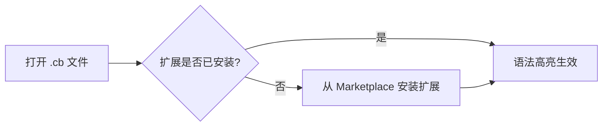
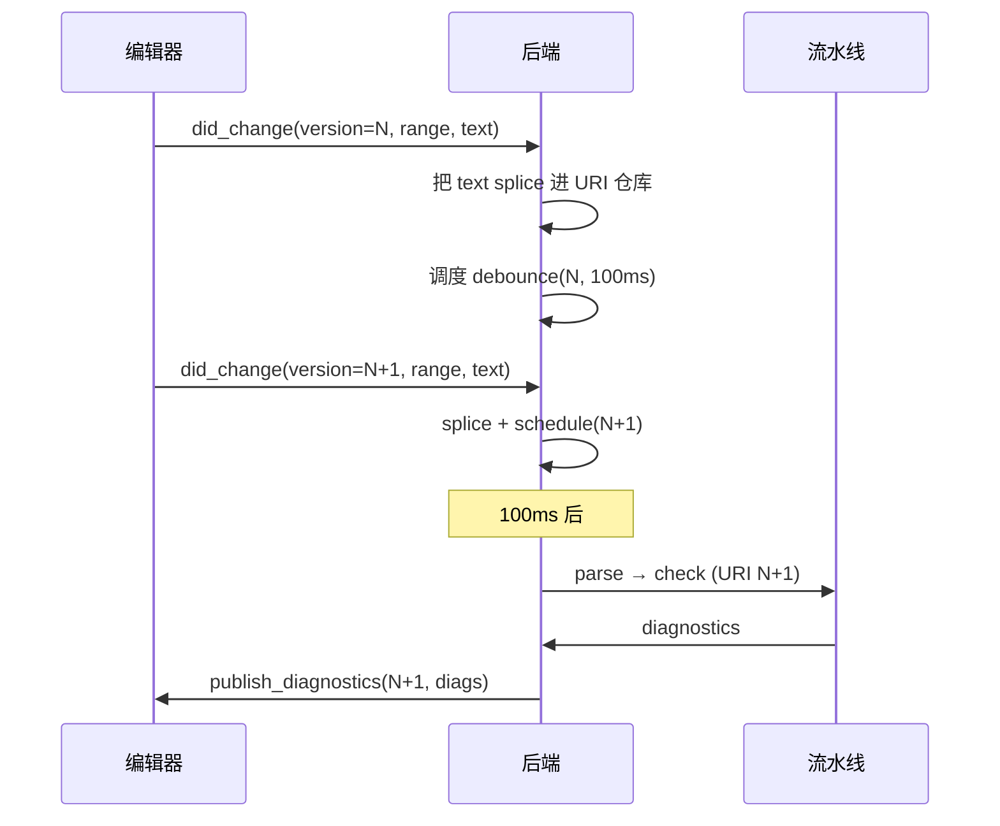

# 编辑器配置 — Cobrust 语法高亮

## VSCode

1. 在 VSCode 扩展面板中搜索 **"Cobrust Language Support"**，点击 **安装**。
   - 或通过命令行：`code --install-extension cobrust-language-support-0.1.0.vsix`
2. 打开任意 `.cb` 文件 — 语法高亮自动激活。
3. 注释切换快捷键：`Ctrl+/`（Windows/Linux）或 `Cmd+/`（macOS）。
4. 括号匹配和自动补全括号开箱即用。



## Vim / Neovim

### 使用 vim-plug

```vim
" 添加到 ~/.vimrc 或 ~/.config/nvim/init.vim
Plug 'cobrust-lang/vim-cobrust'
```

运行 `:PlugInstall`，然后重新打开任意 `.cb` 文件。

### 手动安装

```bash
# Vim
mkdir -p ~/.vim/pack/cobrust/start/vim-cobrust
cp -r tools/vim-cobrust/syntax   ~/.vim/pack/cobrust/start/vim-cobrust/
cp -r tools/vim-cobrust/ftdetect ~/.vim/pack/cobrust/start/vim-cobrust/

# Neovim
mkdir -p ~/.local/share/nvim/site/pack/cobrust/start/vim-cobrust
cp -r tools/vim-cobrust/syntax   ~/.local/share/nvim/site/pack/cobrust/start/vim-cobrust/
cp -r tools/vim-cobrust/ftdetect ~/.local/share/nvim/site/pack/cobrust/start/vim-cobrust/
```

验证方式：`vim -c 'syntax on' examples/fizzbuzz.cb`

## Helix

Helix 使用 Tree-sitter 语法。Cobrust 的 Tree-sitter 语法将在后续里程碑中支持。
目前可以使用 TextMate 回退方案：

1. 将 `tools/textmate-cobrust.tmbundle/Syntaxes/cobrust.tmLanguage` 复制到
   Helix 配置目录。
2. 在 `~/.config/helix/languages.toml` 中添加文件类型关联：

```toml
[[language]]
name = "cobrust"
scope = "source.cobrust"
file-types = ["cb"]
comment-token = "#"
indent = { tab-width = 4, unit = "    " }
```

> **注意**：完整的 Helix Tree-sitter 支持在路线图项目 **F.1.8**（语言服务器）中跟踪。
> TextMate 方案仅提供基础语法着色。

## TextMate / Sublime Text

1. 双击 `tools/textmate-cobrust.tmbundle` — TextMate 会自动安装。
2. 对于 Sublime Text：将 bundle 复制到 `Packages/User/` 并重启编辑器。

## 语言服务器 (LSP, wave-1 + wave-2.1:实时诊断)

Cobrust 提供语言服务器协议(LSP)实现 `cobrust-lsp`,可在编辑时直接
将编译器错误浮现在编辑器中。

**Wave-1 范围(根据 ADR-0057a):**

- `textDocument/publishDiagnostics` —— Cobrust 编译流水线(parse + lower +
  type-check)中的每个 `TypeError` / `MirError` / `LoweringError` 都会以
  LSP `Diagnostic` 形式发布,包含:
  - `cobrust check` 的规范错误信息;
  - 结构化的 `code` 字段(例如 `"implicit-truthiness"`),供编辑器侧
    code-action 路由使用;
  - ADR-0052b 的 `suggestion` 字段(若已设置)作为
    `relatedInformation[0].message` 附加 —— agent-LLM 直接消费的修复路径。

### 编辑时的实时诊断 (didChange) —— wave-2.1 (ADR-0057b)

ADR-0057b 实现后,诊断不再只在打开文件时刷新,而是随用户键入实时更新
(经过 ~100ms 防抖)。服务器会:

- 声明 `INCREMENTAL` 文档同步;客户端发送 `textDocument/didChange` 事件
  时,可以在 `contentChanges[].range` 中携带局部编辑范围,也可以提供
  无 `range` 的完整文本替换。两种模式服务器均支持。
- 维护每个 URI 的内存文本仓库,通过 range-splice 就地变更(UTF-16
  列偏移符合 LSP 规范)。
- 跨调用共享一份 `TypeCheckCtx`(遵循 ADR-0056b 的 Clone+Send Arc-COW
  合约),每次重检前对该 URI 的旧类型行调用 `invalidate`,保证符号
  表与客户端文本一致。
- 防抖窗口:~100ms 内的多次编辑合并为一次流水线重跑 + 一次
  `publish_diagnostics` 发送(可通过 `Backend::with_debounce_ms` 调整)。



### 悬浮类型提示 —— wave-2.2 (ADR-0057c)

ADR-0057c 实现后，`cobrust-lsp` 可响应 `textDocument/hover` 请求。
将光标置于任意 `let` 绑定或函数名上，编辑器将以 Markdown 气泡形式显示推断出的类型：

```
**x**: `Int`

Inferred type.
```

- 适用于文件打开后（或经过 `didChange` 防抖后）`TypeCheckCtx` 中登记的所有绑定。
- 对于未知名称、关键字和标点符号，返回无提示（`null`）。
- Wave-2.2 使用单词边界启发式算法；子表达式类型的完整 DefId 索引 hover 留待 wave-3 实现。

### 补全 —— PRELUDE + 作用域 + 关键字 (wave-2.2, ADR-0057c)

`cobrust-lsp` 可响应 `textDocument/completion` 请求，由任意标识符字符或 `.` / `_` 触发。

三级补全候选：

| 层级 | 类型 | 示例 | 排序前缀 |
|---|---|---|---|
| PRELUDE 函数 | Function | `print`、`len`、`range`、`map`、`filter` | `0_` |
| 作用域绑定 | Variable | 当前文件中的每个 `let` 绑定 | `1_` |
| 关键字 | Keyword | `let`、`fn`、`if`、`match`、`for`、`return` | `2_` |

过滤规则为大小写敏感前缀匹配。输入 `pri` 后仅剩 `print`。

### 重命名 — 文件内符号重命名（wave-2.3，ADR-0057d）

自 ADR-0057d 起，`cobrust-lsp` 支持 `textDocument/prepareRename` 和
`textDocument/rename` 请求——即所有主流编辑器中的 F2"重命名符号"快捷键。

**工作原理：**

1. **预检（`prepareRename`）** — 编辑器在弹出重命名输入框之前先调用此请求。
   服务器返回：
   - 包含可重命名符号的 `Range`；
   - 若光标位于关键字、空白符或未绑定的标识符上，则返回 `null`。
2. **重命名** — 用户输入新名称并确认后，编辑器发送 `textDocument/rename`。
   服务器返回一个 `WorkspaceEdit`，包含当前文件中该旧名称所有出现位置的
   `TextEdit[]`——定义处与所有引用处均会被原子替换。

**示例：**

```cobrust
let count = 0
count + 1
```

将光标置于 `count`，按 **F2**（VSCode/Cursor）或 `<space>rn`（Neovim），
输入 `total` 后回车。服务器返回两个编辑——两处 `count` 引用同时被替换。

**作用域：** wave-2.3 仅支持单文档内重命名。**Wave-3（ADR-0057e）
已实现**——参见下方"跳转到定义 + Quick Fix + 跨文件重命名"小节。

**不可重命名的情况：**
- 语言关键字（`let`、`def`、`if`、`match` 等）
- 空白符与标点
- 尚未被类型检查器解析的标识符

### 跳转到定义 + Quick Fix + 跨文件重命名（wave-3，ADR-0057e）

Wave-3（v1.1 LSP 服务器）将三项编辑器生产力必备能力补全到 v1 之上：

#### `textDocument/definition` —— F12 / Cmd+点击跳转

将光标置于任意使用点标识符，按 **F12**（VSCode/Cursor）或 `gd`（Neovim），
服务器返回指向定义点的 `Location`：

```cobrust
let x = 42
x + 1     # ← 光标在此，按 F12 → 跳到第 1 行的 'x'
```

以下情况返回 `null`（不跳转）：

- 光标位于 Cobrust 关键字上（`let`、`fn`、`if`、`match` 等）。
- 光标位于空白或标点上。
- 该符号未在类型检查器中绑定（未知/未解析）。

Wave-3 诚实作用域：仅支持同文档内跳转。跨文件定义点索引延后至
wave-4——目前定义点 `Location` 的 URI 与光标 URI 一致。

#### `textDocument/codeAction` —— Quick Fix（ADR-0062 FixSafety 分级）

每个携带建议的诊断现在还会生成一个 **Quick Fix** 代码动作，
其行为取决于 ADR-0062 的 FixSafety 分级：

| 分级 | Quick-fix 类型 | 自动应用编辑？ |
|---|---|---|
| `BehaviorPreserving` | `QuickFix` | 是（建议文本即替换文本） |
| `LocalEdit` | `QuickFix` | 是（建议文本即替换文本） |
| `ApiChanging` | `Refactor` | 否（建议仅在标题展示） |
| `FormatOnly` | `SourceFixAll` | 否（建议仅在标题展示） |
| `TargetChanging` | — | 不发出代码动作 |
| `RequiresHumanReview` | — | 不发出代码动作 |

例：在 `x: i64` 上写 `if x:` 会产生 ADR-0052b 的 `ImplicitTruthiness`
诊断，建议 `change to 'if x != 0:'`。Wave-3 将其作为
`BehaviorPreserving` QuickFix 发出——编辑器显示灯泡，点击"应用"即
替换源代码。在 Cursor / Continue 等编辑器中驱动的 agent-LLM 通过
`workspace/applyEdit` 直接应用修复，而无需自行组装补丁。

#### 跨文件 `rename`（扩展 ADR-0057d）

Wave-3 把重命名动词扩展到 LSP 会话中**当前打开的每个文档**。按 **F2**
输入新名字；服务器扫描所有打开的 URI 查找单词边界出现，并聚合到一个
`WorkspaceEdit.changes` map 中。编辑器一次性原子地应用每个文件的
`TextEdit[]`。

```cobrust
# file_a.cb（已打开）
let widget = 1
widget + 1

# file_b.cb（已打开）
widget * 2

# file_c.cb（已打开）—— 不包含 'widget'
let other = 99
```

在 `file_a.cb` 中将 `widget` → `gadget`：file-A 收到 2 处编辑、
file-B 收到 1 处编辑、file-C 完全不变（根本不在 `WorkspaceEdit.changes`
映射中）。

**诚实作用域：**

- 跨文件重命名仅限于 LSP 会话中**打开**的文档。编辑器未打开的文件
  不会被访问——文件系统遍历的全工作区搜索延后至后续 sub-ADR。
- 作用域盲点：单词边界扫描尚未跨文件解析标识符作用域。若 `x` 在两个
  打开文件的不同作用域中出现，两者都会被改名。真正支持跨文件作用域
  感知的重命名（基于 HIR `DefId` 跨文件解析）延后至 wave-4。

### 内联类型提示 + 语义高亮 + 调用层次（wave-4，ADR-0057f）

Wave-4（v1.2 LSP 服务器）补齐三项现代编辑器期待的能力：

#### `textDocument/inlayHint` —— 内联类型与参数名提示

服务器为以下两类位置发出内联提示：

- **`let` 绑定类型**：未带显式类型注解的 `let` 语句末尾追加
  `: <推断类型>` 灰显文字。
- **函数调用参数名**：非字面量位置参数前追加 `<参数名>:` 灰显文字。

```cobrust
let x = 42               # 显示为：let x: i64 = 42
fn add(left: i64, right: i64) -> i64:
    return left + right
let y = some_var
add(y, 2)                # 显示为：add(left: y, 2)  —— left: 是提示
```

字面量参数（`add(1, 2)`）不会显示提示，避免视觉噪声。

#### `textDocument/semanticTokens/full` —— 语义高亮（8 类）

服务器返回 LSP delta-encoded `SemanticTokens`，使用 8 个类型的 legend：
`keyword` / `string` / `number` / `comment` / `operator` / `variable` /
`function` / `type`。

- 标识符默认 `variable`，AST refine 将其升级为：
  - `function`：fn / class 定义名（在 fn header 中位置由扫描 stmt.span
    向前回溯 256 字节定位）。
  - `type`：类型注解中的路径段（按段单独 push 以匹配 lexer 发出的
    精确 `(line, char, length)`）。
- `#` 注释由独立字节扫描发出（lexer 会剥离）。

诚实作用域：modifier 位掩码全为零（declaration / readonly / static
等 modifier 延后至 wave-5）。

#### `textDocument/prepareCallHierarchy` + `incomingCalls` + `outgoingCalls`

将光标置于函数定义名上（VSCode：右键 → "Show Call Hierarchy"；
Neovim：`vim.lsp.buf.incoming_calls()` / `outgoing_calls()`），服务器
返回该函数的 incoming（谁调用了我）与 outgoing（我调用了谁）链。

```cobrust
fn add(x: i64, y: i64) -> i64:
    return x + y
fn caller1() -> i64:
    return add(1, 2)
fn caller2() -> i64:
    return add(3, 4)
```

光标置于 `add` 定义名上 → incomingCalls 返回 `caller1` + `caller2`
两个 `CallHierarchyIncomingCall`，每个包含其调用点 range。

诚实作用域：仅同文档分析（跨文件调用图延后至 wave-5）。`<module>`
调用方（模块顶层语句）作为合成调用方汇总，但 fn 内部嵌套调用不会
被双重计入。

### 构建与运行

```bash
# 在仓库根目录
cargo build --release -p cobrust-lsp
# 产物路径:target/release/cobrust-lsp
```

### VSCode / Cursor 配置

在 `~/.vscode/extensions/<your-ext>/extension.js` 添加一个最小客户端,
通过 stdio 为 `.cb` 文件启动 `cobrust-lsp`:

```javascript
const { LanguageClient } = require('vscode-languageclient/node');
const serverOptions = { command: '/path/to/cobrust-lsp' };
const clientOptions = {
  documentSelector: [{ scheme: 'file', language: 'cobrust' }],
};
new LanguageClient('cobrust', 'Cobrust LSP', serverOptions, clientOptions).start();
```

### Neovim 配置 (nvim-lspconfig)

```lua
local lspconfig = require('lspconfig')
local configs = require('lspconfig.configs')
configs.cobrust = {
  default_config = {
    cmd = { '/path/to/cobrust-lsp' },
    filetypes = { 'cobrust' },
    root_dir = lspconfig.util.root_pattern('cobrust.toml', '.git'),
  },
}
lspconfig.cobrust.setup{}
```

## Debug Adapter Protocol (DAP, wave-2: VSCode / Cursor 调试)

Cobrust 提供 DAP(Debug Adapter Protocol)服务器 `cobrust-dap`,
通过 VSCode / Cursor 的 **Run > Start Debugging** 菜单驱动编辑器侧
单步调试。服务器底层委托 `lldb-18`,并自动加载 Phase L wave-1 +
wave-2 的 pretty-printer,使得 Variables 面板显示 Cobrust 源代码
形式的值(例如 `xs: List<Int> = [1, 2, 3]`、
`d: Dict<Int, Str> = {1: "a", 2: "b"}`、
`opt: Option<Int> = Some(<0xaddr>)`,而非原始的 struct 字节)。

Phase L wave-2(ADR-0059a §6 于 2026-05-20 解决)在 printer 表面
之上扩展了:

- **Dict 按插入顺序的 K:V 遍历** — printer 通过 lldb `expression`
  API 调用运行时导出
  `__cobrust_dict_iter_{key,value}_{i64,str}_at`,因此 `d` 渲染为
  实际的 `{k: v, ...}` 形状,而不是 wave-1 的 `{<n entries>}`
  占位符。
- **泛型 Adt 命名** — 每个 `Ty::Adt` 局部变量现在拥有独立的
  `cobrust::Adt` DWARF 类型名,因此 printer 会为任何用户定义的
  枚举或未来的 Option / Result 渲染 `None` / `Some(<0xaddr>)`
  指针标签。逐变体渲染(例如 `Some(42)` 显示实际 payload)需要
  MIR 把 Adt schema 透传到 DI(Phase L+ 范围)。

**Wave-2 范围(根据 ADR-0059b):**

- 支持 9 个 DAP 请求:`initialize`、`launch`、`setBreakpoints`、
  `continue`、`next`(step-over)、`pause`、`stackTrace`、`variables`、
  `disconnect`。
- 仅支持单线程调试(Cobrust 程序目前是单线程的)。
- 仅支持行断点(条件断点、函数断点、表达式求值是 wave-3+ 推迟项)。
- 不支持 attach 模式;仅 `launch`(派生新进程)。

### 前置条件

- `lldb-18` 在 PATH 中可用(macOS:`brew install llvm@18`;
  Linux:`apt install lldb-18` 或通过 [llvm.sh](https://apt.llvm.org/))。
- 带调试信息构建的 Cobrust 二进制:`cobrust build --debug
  examples/fib.cb -o fib`。

### 构建 DAP 服务器

```bash
cargo build --release -p cobrust-dap
# 二进制位于:target/release/cobrust-dap
```

### VSCode `launch.json` 示例

添加到项目的 `.vscode/launch.json`:

```json
{
  "version": "0.2.0",
  "configurations": [
    {
      "type": "cobrust",
      "request": "launch",
      "name": "Debug Cobrust binary",
      "program": "${workspaceFolder}/fib",
      "cwd": "${workspaceFolder}",
      "stopOnEntry": true
    }
  ]
}
```

为让 VSCode 发现 `cobrust` 调试类型,需安装或开发一个薄扩展,
其 `debuggers` 条目指向 `target/release/cobrust-dap`。同样的
`launch.json` 也适用于 Cursor(VSCode 的分叉)。

### 单步调试演示(终端步骤)

```bash
# 1. 携带调试信息构建。
cargo run -p cobrust-cli -- build --debug examples/fib.cb -o /tmp/fib

# 2. 在 VSCode/Cursor 中通过 Run > Start Debugging (F5) 启动调试,
#    配置见上方 launch.json。

# 3. 在 examples/fib.cb 第 8 行(递归 fib() 调用所在行)设置断点。
#    VSCode 会在装订线显示断点。

# 4. 按 F5 启动。cobrust-dap 派生 lldb-18,加载 wave-1 pretty-printer,
#    设置断点并运行二进制。执行在断点处暂停;Variables 面板显示
#    递归情况下的 `n: Int = N`。
```

## `cobrust debug`(wave-3:一键调试入口)

`cobrust debug` 子命令(Phase L wave-3,ADR-0059c)把 wave-1 lldb pretty-
printer 和 wave-2 `cobrust-dap` 包装成单条 CLI 入口 —— 常见场景下不再需要
手动 `lldb` / `command script import` 或为每个编辑器写 `launch.json`。

三种模式:

```bash
# 交互式 lldb 会话:带 debug info 构建、自动加载 wave-1 pretty-printers、
# 落到 (lldb) 提示符。
cobrust debug examples/fib.cb

# 交互模式 + 行号断点(可重复:--bp 5 --bp 12)。
cobrust debug examples/fib.cb --bp 5

# 把 stdio 转发到 cobrust-dap 服务(替代 `launch.json` 里显式写
# cobrust-dap 二进制路径的方式)。
cobrust debug --dap
```

**参数:**

- `<source.cb>` —— 交互模式下必填;`--dap` 模式下可选(DAP `Launch`
  请求会带上程序路径)。
- `--dap` —— 启动同目录的 `cobrust-dap`,转发 stdin/stdout/stderr。
- `--bp <line>` —— 自动设置行号断点;可重复。
- `--lldb-path <path>` —— 覆盖 lldb 二进制路径(默认查找顺序:
  `lldb-18`,再到 `$PATH` 上的 `lldb`)。
- `--quiet` / `-q` —— 静默 informational stderr。

**退出码**(按 ADR-0024 §"Exit-code scheme"):

- `0` —— lldb / cobrust-dap 正常退出。
- `1` —— 用户错误(源文件缺失、lldb 二进制未找到、cobrust-dap 同目录缺失)。
- `3` —— 构建失败(从 `cobrust build` 驱动透传)。

## v1.1 DAP (ADR-0059f Phase L wave-4) — 进阶特性

`cobrust-dap` 在 wave-4 通告四个新的 DAP 请求处理器。

### 监视表达式 (`evaluate`)

在编辑器的 debug REPL 或 WATCH 面板中输入任意表达式。表达式会被原
样转发到 lldb 的 `expression` 命令;wave-1 pretty-printer 已经
自动美化了 Cobrust 类型的输出。

支持的表达式形态(透传到 lldb 的 C-like 解析器):

- 算术运算: `i + 1`、`n * 2`、`i % len`
- 比较运算: `i > 10`、`s == 0`
- 字段访问: `p.name`、`point.x`
- 数组下标: `xs[0]`、`arr[i + 1]`

不支持(需要 Cobrust 源级求值器):`match` 表达式、推导式、泛型函数
调用。

### 条件断点

在编辑器的 "Edit Breakpoint" UI 中给任意断点添加 `condition`(右
键点击 gutter 红点 > "Edit Breakpoint" > "Expression")。条件只
有在断点命中时为真,才会真正暂停。

### 多线程调试

ADR-0028 的结构化并发运行时会启动多个 OS 线程承载 task 工作。
wave-4 在编辑器的 "Call Stack" 面板列出所有线程。单线程程序仍然只
显示一个 "main" 项(对 v1.0 DAP 客户端向后兼容)。

### 异常断点

wave-4 在 "Breakpoints" 面板通告三个过滤器:

- **Uncaught Panic**(默认开启)—— 在 Cobrust `panic!` 时停下。
- **Result::Err Construction**(默认关闭)—— **honest scope**:当
  前代码生成器尚未发出对应的运行时符号;断点会以 `verified: false`
  + "symbol not emitted in current build" 消息返回。未来 ADR 补上。
- **Unreachable! Intrinsic**(默认关闭)—— 在 `unreachable!()` 经
  LLVM `unreachable` intrinsic 时停下。

## 不包含的功能

- Wave-1 LSP 仅提供诊断。定义跳转、补全、悬浮提示、重命名、code-action
  快速修复均在 ADR-0057b/c/d 范围内。
- Wave-2 DAP 承担单线程单步调试的核心表面;wave-4(ADR-0059f)补足
  watch / 条件断点 / 多线程 / 异常断点。`setVariable` 与 `attach`
  模式仍是 non-goal。
- Wave-3 `cobrust debug` 仅支持行号断点。条件断点 / 函数名断点需要
  在 lldb 提示符内手动输入,详见 ADR-0059c §5。
- Cobrust 源级表达式求值(watch 内写 `match` / 推导式)—— out-of-
  scope;ADR-0059 §4 永久延期。
- Logpoint(纯日志断点)+ 数据断点(内存观察点)—— 延期到 wave-5+,
  详见 ADR-0059f §4。
- 格式化集成 — 参见 `cobrust fmt` CLI 工具。
