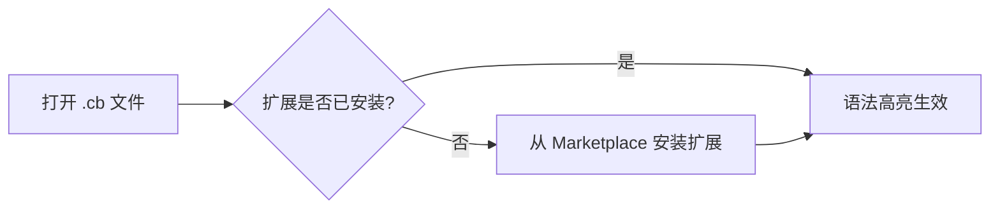

# 编辑器配置 — Cobrust 语法高亮

## VSCode

1. 在 VSCode 扩展面板中搜索 **"Cobrust Language Support"**，点击 **安装**。
   - 或通过命令行：`code --install-extension cobrust-language-support-0.1.0.vsix`
2. 打开任意 `.cb` 文件 — 语法高亮自动激活。
3. 注释切换快捷键：`Ctrl+/`（Windows/Linux）或 `Cmd+/`（macOS）。
4. 括号匹配和自动补全括号开箱即用。



## Vim / Neovim

### 使用 vim-plug

```vim
" 添加到 ~/.vimrc 或 ~/.config/nvim/init.vim
Plug 'cobrust-lang/vim-cobrust'
```

运行 `:PlugInstall`，然后重新打开任意 `.cb` 文件。

### 手动安装

```bash
# Vim
mkdir -p ~/.vim/pack/cobrust/start/vim-cobrust
cp -r tools/vim-cobrust/syntax   ~/.vim/pack/cobrust/start/vim-cobrust/
cp -r tools/vim-cobrust/ftdetect ~/.vim/pack/cobrust/start/vim-cobrust/

# Neovim
mkdir -p ~/.local/share/nvim/site/pack/cobrust/start/vim-cobrust
cp -r tools/vim-cobrust/syntax   ~/.local/share/nvim/site/pack/cobrust/start/vim-cobrust/
cp -r tools/vim-cobrust/ftdetect ~/.local/share/nvim/site/pack/cobrust/start/vim-cobrust/
```

验证方式：`vim -c 'syntax on' examples/fizzbuzz.cb`

## Helix

Helix 使用 Tree-sitter 语法。Cobrust 的 Tree-sitter 语法将在后续里程碑中支持。
目前可以使用 TextMate 回退方案：

1. 将 `tools/textmate-cobrust.tmbundle/Syntaxes/cobrust.tmLanguage` 复制到
   Helix 配置目录。
2. 在 `~/.config/helix/languages.toml` 中添加文件类型关联：

```toml
[[language]]
name = "cobrust"
scope = "source.cobrust"
file-types = ["cb"]
comment-token = "#"
indent = { tab-width = 4, unit = "    " }
```

> **注意**：完整的 Helix Tree-sitter 支持在路线图项目 **F.1.8**（语言服务器）中跟踪。
> TextMate 方案仅提供基础语法着色。

## TextMate / Sublime Text

1. 双击 `tools/textmate-cobrust.tmbundle` — TextMate 会自动安装。
2. 对于 Sublime Text：将 bundle 复制到 `Packages/User/` 并重启编辑器。

## 语言服务器 (LSP, wave-1:诊断)

Cobrust 提供语言服务器协议(LSP)实现 `cobrust-lsp`,可在编辑时直接
将编译器错误浮现在编辑器中。

**Wave-1 范围(根据 ADR-0057a):**

- `textDocument/publishDiagnostics` —— Cobrust 编译流水线(parse + lower +
  type-check)中的每个 `TypeError` / `MirError` / `LoweringError` 都会以
  LSP `Diagnostic` 形式发布,包含:
  - `cobrust check` 的规范错误信息;
  - 结构化的 `code` 字段(例如 `"implicit-truthiness"`),供编辑器侧
    code-action 路由使用;
  - ADR-0052b 的 `suggestion` 字段(若已设置)作为
    `relatedInformation[0].message` 附加 —— agent-LLM 直接消费的修复路径。

**Wave-2+(后续):** hover、补全、定义跳转、重命名、codeAction。
roster 参见 ADR-0057。

### 构建与运行

```bash
# 在仓库根目录
cargo build --release -p cobrust-lsp
# 产物路径:target/release/cobrust-lsp
```

### VSCode / Cursor 配置

在 `~/.vscode/extensions/<your-ext>/extension.js` 添加一个最小客户端,
通过 stdio 为 `.cb` 文件启动 `cobrust-lsp`:

```javascript
const { LanguageClient } = require('vscode-languageclient/node');
const serverOptions = { command: '/path/to/cobrust-lsp' };
const clientOptions = {
  documentSelector: [{ scheme: 'file', language: 'cobrust' }],
};
new LanguageClient('cobrust', 'Cobrust LSP', serverOptions, clientOptions).start();
```

### Neovim 配置 (nvim-lspconfig)

```lua
local lspconfig = require('lspconfig')
local configs = require('lspconfig.configs')
configs.cobrust = {
  default_config = {
    cmd = { '/path/to/cobrust-lsp' },
    filetypes = { 'cobrust' },
    root_dir = lspconfig.util.root_pattern('cobrust.toml', '.git'),
  },
}
lspconfig.cobrust.setup{}
```

## Debug Adapter Protocol (DAP, wave-2: VSCode / Cursor 调试)

Cobrust 提供 DAP(Debug Adapter Protocol)服务器 `cobrust-dap`,
通过 VSCode / Cursor 的 **Run > Start Debugging** 菜单驱动编辑器侧
单步调试。服务器底层委托 `lldb-18`,并自动加载 Phase L wave-1 的
pretty-printer,使得 Variables 面板显示 Cobrust 源代码形式的值
(例如 `xs: List<Int> = [1, 2, 3]`,而非原始的 struct 字节)。

**Wave-2 范围(根据 ADR-0059b):**

- 支持 9 个 DAP 请求:`initialize`、`launch`、`setBreakpoints`、
  `continue`、`next`(step-over)、`pause`、`stackTrace`、`variables`、
  `disconnect`。
- 仅支持单线程调试(Cobrust 程序目前是单线程的)。
- 仅支持行断点(条件断点、函数断点、表达式求值是 wave-3+ 推迟项)。
- 不支持 attach 模式;仅 `launch`(派生新进程)。

### 前置条件

- `lldb-18` 在 PATH 中可用(macOS:`brew install llvm@18`;
  Linux:`apt install lldb-18` 或通过 [llvm.sh](https://apt.llvm.org/))。
- 带调试信息构建的 Cobrust 二进制:`cobrust build --debug
  examples/fib.cb -o fib`。

### 构建 DAP 服务器

```bash
cargo build --release -p cobrust-dap
# 二进制位于:target/release/cobrust-dap
```

### VSCode `launch.json` 示例

添加到项目的 `.vscode/launch.json`:

```json
{
  "version": "0.2.0",
  "configurations": [
    {
      "type": "cobrust",
      "request": "launch",
      "name": "Debug Cobrust binary",
      "program": "${workspaceFolder}/fib",
      "cwd": "${workspaceFolder}",
      "stopOnEntry": true
    }
  ]
}
```

为让 VSCode 发现 `cobrust` 调试类型,需安装或开发一个薄扩展,
其 `debuggers` 条目指向 `target/release/cobrust-dap`。同样的
`launch.json` 也适用于 Cursor(VSCode 的分叉)。

### 单步调试演示(终端步骤)

```bash
# 1. 携带调试信息构建。
cargo run -p cobrust-cli -- build --debug examples/fib.cb -o /tmp/fib

# 2. 在 VSCode/Cursor 中通过 Run > Start Debugging (F5) 启动调试,
#    配置见上方 launch.json。

# 3. 在 examples/fib.cb 第 8 行(递归 fib() 调用所在行)设置断点。
#    VSCode 会在装订线显示断点。

# 4. 按 F5 启动。cobrust-dap 派生 lldb-18,加载 wave-1 pretty-printer,
#    设置断点并运行二进制。执行在断点处暂停;Variables 面板显示
#    递归情况下的 `n: Int = N`。
```

## 不包含的功能

- Wave-1 LSP 仅提供诊断。定义跳转、补全、悬浮提示、重命名、code-action
  快速修复均在 ADR-0057b/c/d 范围内。
- Wave-2 DAP 仅承担单线程单步调试的核心表面。条件断点、表达式监视
  (`evaluate`)、多线程调试、attach 模式、`setVariable` 是 Phase L
  wave-3+ 的后续工作,详见 ADR-0059b §5。
- 格式化集成 — 参见 `cobrust fmt` CLI 工具。
