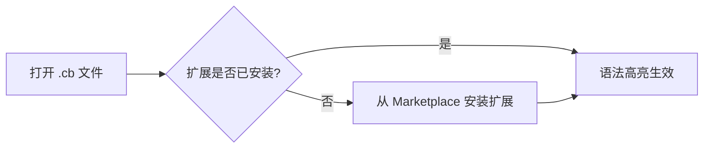

# 编辑器配置 — Cobrust 语法高亮

## VSCode

1. 在 VSCode 扩展面板中搜索 **"Cobrust Language Support"**，点击 **安装**。
   - 或通过命令行：`code --install-extension cobrust-language-support-0.1.0.vsix`
2. 打开任意 `.cb` 文件 — 语法高亮自动激活。
3. 注释切换快捷键：`Ctrl+/`（Windows/Linux）或 `Cmd+/`（macOS）。
4. 括号匹配和自动补全括号开箱即用。



## Vim / Neovim

### 使用 vim-plug

```vim
" 添加到 ~/.vimrc 或 ~/.config/nvim/init.vim
Plug 'cobrust-lang/vim-cobrust'
```

运行 `:PlugInstall`，然后重新打开任意 `.cb` 文件。

### 手动安装

```bash
# Vim
mkdir -p ~/.vim/pack/cobrust/start/vim-cobrust
cp -r tools/vim-cobrust/syntax   ~/.vim/pack/cobrust/start/vim-cobrust/
cp -r tools/vim-cobrust/ftdetect ~/.vim/pack/cobrust/start/vim-cobrust/

# Neovim
mkdir -p ~/.local/share/nvim/site/pack/cobrust/start/vim-cobrust
cp -r tools/vim-cobrust/syntax   ~/.local/share/nvim/site/pack/cobrust/start/vim-cobrust/
cp -r tools/vim-cobrust/ftdetect ~/.local/share/nvim/site/pack/cobrust/start/vim-cobrust/
```

验证方式：`vim -c 'syntax on' examples/fizzbuzz.cb`

## Helix

Helix 使用 Tree-sitter 语法。Cobrust 的 Tree-sitter 语法将在后续里程碑中支持。
目前可以使用 TextMate 回退方案：

1. 将 `tools/textmate-cobrust.tmbundle/Syntaxes/cobrust.tmLanguage` 复制到
   Helix 配置目录。
2. 在 `~/.config/helix/languages.toml` 中添加文件类型关联：

```toml
[[language]]
name = "cobrust"
scope = "source.cobrust"
file-types = ["cb"]
comment-token = "#"
indent = { tab-width = 4, unit = "    " }
```

> **注意**：完整的 Helix Tree-sitter 支持在路线图项目 **F.1.8**（语言服务器）中跟踪。
> TextMate 方案仅提供基础语法着色。

## TextMate / Sublime Text

1. 双击 `tools/textmate-cobrust.tmbundle` — TextMate 会自动安装。
2. 对于 Sublime Text：将 bundle 复制到 `Packages/User/` 并重启编辑器。

## 不包含的功能

- 定义跳转、类型检查、代码补全、诊断信息 — 参见 **F.1.8**（LSP 语言服务器）。
- 格式化集成 — 参见 `cobrust fmt` CLI 工具。
