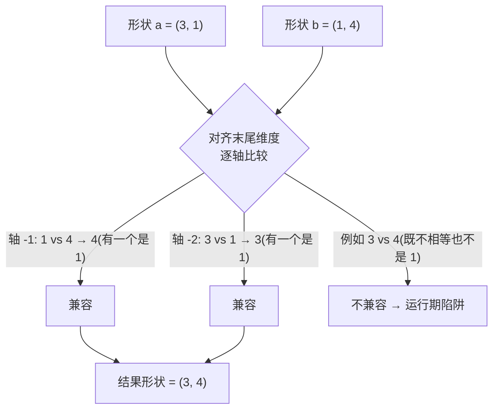

# `import coil` — 在 Cobrust 中用 numpy 的 ndarray buffer(8/8 ——最后一块 cobra 生态模块)

> 状态:ADR-0072 8/8 首次证明 —— coil 是 cobra 批次的第八个也是最
> 后一个生态模块。基于已验证的「值-句柄」链(与 den / molt / strike
> 相同形状)接入,完成了 v0.7.0 已落地的全部工作区内置生态。首次证明
> 范围只覆盖构造器 + repr;此后 ADR-0077 补上了操作符 / 索引 / 属性表
> 面 —— 逐元素 `a + b` / `a - b` / `a * b` / `a / b`(numpy **真除法**,
> 带 **广播**)、比较操作符(`a < b` … → bool 掩码)、**`a @ b` 矩阵乘
> 法**操作符、标量形式 `a + 1` / `a * 2`、标量 `a[i]` 读取,以及
> `a.shape` / `a.ndim` / `a.size`。

## 先看例子

```python
import coil

fn main() -> i64:
    let a: coil.Buffer = coil.zeros(3)
    let _ = coil.print_buffer(a)
    return 0
```

构建并运行:

```bash
cobrust build prog.cb -o prog
./prog
# array([0, 0, 0], dtype=float64)
```

## 你能用到的(首次证明表面)

- **`coil.zeros(n: i64) -> Buffer`** —— 分配一个 `n` 元素的 f64 全零
  1-D buffer。Shape `[n]`。`n` 负值会防御性地 clamp 到 0。
- **`coil.ones(n: i64) -> Buffer`** —— 分配一个 `n` 元素的 f64 全一
  1-D buffer。Shape `[n]`。
- **`coil.eye(n: i64) -> Buffer`** —— 分配 `n x n` 的 f64 单位矩阵
  (`k=0` 主对角线)。Shape `[n, n]` —— 也顺便证明这条链能处理非 1-D
  buffer(drop 与 shape 无关)。
- **`coil.print_buffer(b: Buffer) -> i64`** —— 把 buffer 的 numpy 兼容
  `array_repr` 打印到 stdout。成功返回 `0`;接收者为 null 时返回 `-1`
  (防御性)。

## 等距 / 填充构造器(`linspace` / `logspace` / `full`)

又是三个全标量参数构造器 —— 它们只接受**数字**(没有 buffer 输入),
产出一个新的 `float64` 1-D buffer。这是真实代码里最常用的 numpy 等距 /
填充构造器:

```text
import coil

fn main() -> i64:
    let a: coil.Buffer = coil.linspace(0.0, 1.0, 5)   # [0, 0.25, 0.5, 0.75, 1]
    let _ = coil.print_buffer(a)                       # 含端点
    let b: coil.Buffer = coil.logspace(0.0, 2.0, 3)   # [1, 10, 100]
    let _ = coil.print_buffer(b)                       # = 10 ** linspace
    let c: coil.Buffer = coil.full(3, 5.0)            # [5, 5, 5]
    let _ = coil.print_buffer(c)                       # n 份 value 拷贝
    let m: f64 = coil.mean(coil.linspace(0.0, 10.0, 5))  # mean([0,2.5,5,7.5,10])
    print((m as i64))                                  # 5
    return 0
```

- **`coil.linspace(start: f64, stop: f64, num: i64) -> Buffer`** —— 在
  `[start, stop]` 上取 `num` 个等距样本,**含 `stop` 端点**(numpy 的
  `endpoint=True` 默认 —— `linspace(0, 1, 5)` 是 `[0, 0.25, 0.5, 0.75,
  1]`,且最后一个样本**精确**等于 `stop`,无浮点漂移)。步长为
  `(stop - start) / (num - 1)`。边界情况与 numpy 一致:`num == 1` →
  `[start]`;`num <= 0` → 空 buffer。
- **`coil.logspace(start: f64, stop: f64, num: i64) -> Buffer`** —— 在
  以 10 为底的**对数**刻度上取 `num` 个等距样本:`10 ** linspace(start,
  stop, num)`。`logspace(0, 2, 3)` 是 `[1, 10, 100]`。`num <= 0` → 空。
- **`coil.full(n: i64, value: f64) -> Buffer`** —— 一个含 `n` 份 `value`
  拷贝的 1-D buffer。`full(3, 5.0)` 是 `[5, 5, 5]`。`n <= 0` → 空 buffer
  (负 `n` clamp 到 `0`,与 `coil.zeros` 一致)。

> 为什么没有 `endpoint` / `base` / `num=50` 这些默认关键字参数?`.cb`
> 表面让这些构造器保持**位置参数且显式** —— numpy 的默认值
> (`num=50`、`endpoint=True`、`base=10.0`)正是优雅账本要丢弃的、易踩坑
> 的隐式状态。你总是显式写出数量;含端点 + 以 10 为底是常见情形,未来若
> 真实代码需要 `endpoint=False` / 自定义 `base` 形式,会作为已记录的后续
> 项跟进。

## 统计 —— 标量归约(`mean` / `median` / `std` / `var` / `min` / `max` / `prod` / `ptp` / `nan*` / `percentile`)

这些函数都把整个 buffer 归约成**一个 `f64`** —— 与 LLM 为 numpy 写出的
形状一致(`np.mean(a)` → `coil.mean(&a)`)。`&a` 是一个显式共享借用:
`coil.Buffer` 是非 Copy 的句柄,所以传 `&a`(而不是裸 `a`)能让这个
buffer 在下一次调用时仍然存活。

```python
import coil

fn main() -> i64:
    let a: coil.Buffer = coil.mgrid(0, 5)        # [0, 1, 2, 3, 4]
    print((coil.mean(&a) as i64))                # 2  (均值 = 2.0)
    print((coil.min(&a) as i64))                 # 0  (最小元素)
    print((coil.max(&a) as i64))                 # 4  (最大元素)
    print((coil.prod(&a) as i64))                # 0  (0*1*2*3*4 = 0)
    print((coil.ptp(&a) as i64))                 # 4  (max 4 - min 0)
    print((coil.nansum(&a) as i64))              # 10 (0+1+2+3+4)
    print((coil.percentile(&a, 50.0) as i64))    # 2  (第 50 百分位 = 中位数)
    return 0
```

完整的归约表面:

- **`coil.mean(a: Buffer) -> f64`** —— 算术均值。空数组 → `NaN`。
- **`coil.median(a: Buffer) -> f64`** —— 顺序统计量中位数(偶数长度取中间
  两元素的平均)。遇 NaN 传播;空数组 → `NaN`。
- **`coil.std(a: Buffer) -> f64`** —— 总体标准差(ddof=0)。
- **`coil.var(a: Buffer) -> f64`** —— 总体方差(ddof=0)。
- **`coil.min(a: Buffer) -> f64`** —— 最小元素。遇 NaN 传播(单个 NaN 会让
  整个结果变成 `NaN`,与 `mean` 一致)。**空** buffer 是 numpy 的
  `ValueError`,所以会干净地中止进程(一次受控的 trap —— `np.min([])`
  会抛异常)。
- **`coil.max(a: Buffer) -> f64`** —— 最大元素。与 `min` 相同的 NaN 传播 +
  空数组中止约定。
- **`coil.prod(a: Buffer) -> f64`** —— 所有元素的乘积。遇 NaN 传播。**空**
  buffer → `1.0`(乘法单位元,正是 numpy 的 `np.prod([]) == 1.0` ——
  **不是** trap)。溢出饱和为 `+inf`(与 numpy 一致)。
- **`coil.ptp(a: Buffer) -> f64`** —— 峰峰值,即 `max(a) - min(a)`(数据的
  极差)。单元素 → `0.0`。遇 NaN 传播。
- **`coil.nansum(a: Buffer) -> f64`** —— 求和,把 NaN 当作零。全 NaN(或空)
  → `0.0`,而**不是** NaN(与 `np.nansum` 一致)。
- **`coil.nanmean(a: Buffer) -> f64`** —— 仅在非 NaN 元素上求均值。全 NaN /
  空 → `NaN`。
- **`coil.nanstd(a: Buffer) -> f64`** —— 仅在非 NaN 元素上求总体标准差
  (ddof=0)。全 NaN / 空 → `NaN`。
- **`coil.percentile(a: Buffer, q: f64) -> f64`** —— 第 `q` 百分位(`q` 从
  `0` 到 `100`),使用 numpy 默认的**线性插值**。`q=0` 是最小值,`q=100`
  是最大值,`q=50` 等于中位数。例如对 `[1, 2, 3, 4]` 调用
  `coil.percentile(&a, 25.0)` 得到 `1.75`。遇 NaN 传播;`q` 被钳制到
  `[0, 100]`;空数组 → `NaN`。

整数和布尔 buffer 会先提升为 `f64`(与 numpy 一致)。当数据有缺口时,
`nan*` 系列是正确的工具;而普通的 `mean` / `ptp` / `percentile` 会传播
NaN,让一个坏值显式可见,而不是被悄悄吸收。(numpy 跳过 NaN 的
`nanpercentile` 是有意的后续项 —— 今天只交付会传播 NaN 的
`percentile`。)

## 数组操作 —— 形状变换与拼接(`transpose` / `flatten` / `ravel` / `concatenate` / `vstack` / `hstack`)

这些是返回 **新 `coil.Buffer`** 的「组合 + 变形」操作 —— 它们精确镜像
numpy 中 LLM 最常用的那批数组操作习惯用法。它们的接线方式与 `@` 矩阵
乘法运算符**完全一致**(借用 Buffer 参数 → 返回一个全新的 Buffer 句柄,
该句柄由 `.cb` 作用域在退出时 drop 一次),而**不是**统计那批的标量返回。

```python
import coil

fn main() -> i64:
    let a: coil.Buffer = coil.array2x3(1.0, 2.0, 3.0, 4.0, 5.0, 6.0)  # (2,3)
    let t: coil.Buffer = coil.transpose(a)        # (3,2):[[1,4],[2,5],[3,6]]
    let _ = coil.print_buffer(t)
    let f: coil.Buffer = coil.flatten(a)          # (6,):[1,2,3,4,5,6]
    let _ = coil.print_buffer(f)
    let b: coil.Buffer = coil.array2x3(7.0, 8.0, 9.0, 10.0, 11.0, 12.0)
    let c: coil.Buffer = coil.concatenate(a, b)   # (4,3):沿轴 0 拼接
    let _ = coil.print_buffer(c)
    let h: coil.Buffer = coil.hstack(a, b)        # (2,6):沿轴 1 拼接
    let _ = coil.print_buffer(h)
    return 0
```

**单参(变形,无条件成功)**:

- **`coil.transpose(a: Buffer) -> Buffer`** —— 反转所有轴(`a.T`)。一维
  数组原样返回(numpy 语义:`np.array([1,2,3]).T` 仍是 `(3,)`);二维
  `(m, n)` 变成 `(n, m)`。dtype 与数值保持不变。
- **`coil.flatten(a: Buffer) -> Buffer`** —— 折叠成一维 C 序(行主序)拷贝。
- **`coil.ravel(a: Buffer) -> Buffer`** —— 同样折叠成一维 C 序拷贝。numpy
  的 `ravel` 可能返回**视图**,但句柄 ABI 没有「视图指回父数组」的表面,
  所以这里返回一份拥有所有权的拷贝(**数值与 numpy 完全一致**)。

**双参(组合;非共形 / dtype 不匹配 → 干净 trap)**:

- **`coil.concatenate(a: Buffer, b: Buffer) -> Buffer`** —— 沿轴 0 拼接两个
  数组(`np.concatenate` 的默认轴)。两者必须同秩,且除轴 0 外每个轴
  尺寸都要相等。
- **`coil.vstack(a: Buffer, b: Buffer) -> Buffer`** —— 按行堆叠。一维
  `(n,)` 参数先被提升为 `(1, n)`,然后沿轴 0 拼接(`vstack((n,),(n,)) ->
  (2, n)`;`vstack((r,c),(s,c)) -> (r+s, c)`)。
- **`coil.hstack(a: Buffer, b: Buffer) -> Buffer`** —— 按列堆叠。一维参数
  沿轴 0 拼接(`hstack((p,),(q,)) -> (p+q,)`);二维及以上沿轴 1 拼接
  (`hstack((r,c1),(r,c2)) -> (r, c1+c2)`)。

> **dtype 约定**:单参操作(`transpose`/`flatten`/`ravel`)对全部五种 dtype
> 通用,保持输入 variant。双参组合操作要求两个参数**同 dtype**,否则报错。
> numpy 会把混合 dtype 提升到公共 dtype;我们保留干净的同 dtype 约定,因为
> (a)今天每个 `.cb` Buffer 构造器都产出 `Float64`(所以常见路径永远是
> `f64`+`f64`),(b)悄悄的跨 dtype 强制转换正是 §2.2 禁止的隐式强转。混合
> dtype 的提升形式是有记录的后续项。
>
> **非共形 trap**:组合操作返回的是裸 `Buffer`(不是 `Result`),所以一对
> 非共形(秩 / 非拼接轴维度 / dtype 不匹配)的输入会**中止进程**(干净
> trap,绝不跨 C-ABI 栈展开),对应 numpy 抛 `ValueError`(§2.5 最接近的
> 诚实语义;可失败的 `a.checked_concatenate(b) -> Result` 逃生口是后续
> 表面)。
>
> **N 数组 / shape 元组形式被推迟**:`np.concatenate([a, b, c, ...])`(N 数组
> 列表)和 `np.reshape(a, (m, n))`(shape 元组)需要 `list[Buffer]` / 元组
> 编组,目前还不存在 —— 等那个落地后再补。本批只交付单参与双数组形式。

## 排序与搜索(`sort` / `argsort` / `unique` / `flatnonzero`)

这是 LLM 在 numpy 里最先伸手去用的四个「扁平搜索与排序」操作。每个都接收一个
Buffer 并返回一个**全新的 `coil.Buffer`** —— 接线方式与上面的形状变换操作完全
一致。它们都会先把多维输入**展平**成一维(C 序),与 numpy 的无轴默认行为一致。

```python
import coil

fn main() -> i64:
    let a: coil.Buffer = coil.array2x2(3.0, 1.0, 4.0, 2.0)
    let s: coil.Buffer = coil.sort(a)              # [1, 2, 3, 4](float64)
    let _ = coil.print_buffer(s)

    let lo: coil.Buffer = coil.array1d2(3.0, 1.0)
    let hi: coil.Buffer = coil.array1d2(4.0, 2.0)
    let v: coil.Buffer = coil.concatenate(lo, hi)  # [3, 1, 4, 2]
    let idx: coil.Buffer = coil.argsort(v)         # [1, 3, 0, 2](int64!)
    let _ = coil.print_buffer(idx)
    return 0
```

- **`coil.sort(a: Buffer) -> Buffer`** —— 全新的**升序**一维拷贝。**保留
  dtype**(浮点输入仍是浮点,整数输入仍是整数)。对浮点而言,所有 `NaN` 都排到
  **末尾**(numpy:`np.sort([3., nan, 1.]) == [1., 3., nan]`)。
- **`coil.argsort(a: Buffer) -> Buffer`** —— 能把 `a` 升序排好的**下标**。结果
  **永远是 `int64` Buffer**(下标),与输入 dtype 无关。排序是**稳定的**,相等键
  保持原有顺序。对浮点而言,带 `NaN` 的下标排到末尾。
  `np.argsort([3., 1., 2.]) == [1, 2, 0]`。
- **`coil.unique(a: Buffer) -> Buffer`** —— **排序去重**后的值。**保留 dtype**。
  `np.unique([3, 1, 2, 1, 3]) == [1, 2, 3]`。对浮点而言,多个 `NaN` 折叠为**一个**
  末尾 `NaN`(`np.unique([nan, 1., nan]) == [1., nan]`)。
- **`coil.flatnonzero(a: Buffer) -> Buffer`** —— `a != 0` 处的扁平(C 序)
  **下标**。永远是 **`int64` Buffer**。`np.flatnonzero([0, 5, 0, 2]) == [1, 3]`。
  对浮点而言判定是 `a != 0.0`,所以 `NaN`(因为 `!= 0.0`)**会**被算作非零
  (`np.flatnonzero([0., nan, 0.]) == [1]`)。

> **dtype 翻转就是信号**:每个 `.cb` Buffer 构造器都建出 `Float64` Buffer,所以
> `sort` / `unique` 打印 `dtype=float64`,而 `argsort` / `flatnonzero` 打印
> `dtype=int64` —— 返回下标的操作里,结果 dtype 会实实在在地翻成 `int64`。
>
> **四个操作都是全函数(total)** —— 排序 / 去重 / 找非零在合法 Buffer 上永不
> 失败(单参没有形状相容性这一概念),所以不像双数组拼接操作那样有陷阱路径。
>
> **`axis` 参数被推迟**:numpy 的 `sort` / `argsort` / `unique` 接收可选 `axis`;
> 本批永远展平(无轴默认)。按轴形式是已记录的后续项。

## 逐元素数学 —— 超越函数 ufunc(`exp` / `log` / `log10` / `sqrt` / `sin` / `cos` / `tan`)

这些对**每个元素**施加一个数学函数,返回**新 `coil.Buffer`** —— 它们
是 numpy 中 LLM 最常用的那批一元数学习惯用法。接线方式与上面的变形操作
**完全一致**(借用 Buffer 参数 → 返回一个 `.cb` 作用域在退出时丢弃一次的
新 Buffer 句柄)。

```python
import coil

fn main() -> i64:
    let a: coil.Buffer = coil.array1d2(0.0, 1.0)
    let e: coil.Buffer = coil.exp(a)              # [1, 2.718281828459045]
    let _ = coil.print_buffer(e)

    let b: coil.Buffer = coil.array2x2(0.0, 1.0, 4.0, 9.0)
    let s: coil.Buffer = coil.sqrt(b)             # [[0, 1], [2, 3]]
    let _ = coil.print_buffer(s)

    # 链式:每个操作返回的新 Buffer 喂给下一个。
    let r: coil.Buffer = coil.sqrt(coil.exp(a))   # sqrt([1, e]) = [1, 1.648...]
    let _ = coil.print_buffer(r)
    return 0
```

**七个核心操作**(全部 `Buffer -> Buffer`):

- **`coil.exp(a)`** —— `e**x`。
- **`coil.log(a)`** —— 自然对数(以 e 为底)。
- **`coil.log10(a)`** —— 以 10 为底的对数。
- **`coil.sqrt(a)`** —— 平方根。
- **`coil.sin(a)` / `coil.cos(a)` / `coil.tan(a)`** —— 三角函数(弧度)。

另有六个 **dtype 规则相同**的便捷操作:**`coil.exp2`**(`2**x`)、
**`coil.log2`**、**`coil.cbrt`**(立方根 —— 与 `sqrt` 不同,对负数有定义:
`cbrt(-8) = -2`)、**`coil.sinh`**、**`coil.cosh`**、**`coil.tanh`**。

> **dtype 规则(唯一需要记住的)**:这些操作全部**返回浮点**。**整数**输入
> 提升到 `float64`(`exp` 作用于整数数组得到 `float64` buffer);**`float32`**
> 输入保持 `float32`;**`float64`** 输入保持 `float64`。(**`bool`** 输入也
> 提升到 `float64` —— numpy 会用 `float16`,而 coil 没有对应类型;**值**完全
> 一致,只是 dtype 层级不同。)
>
> **定义域错误是值,不是崩溃**:一元操作没有「形状不匹配」之说,所以这些
> 操作**绝不 trap**。数学上未定义的输入产出 numpy 同样产出的 IEEE-754 特殊
> 值 —— `log(0) = -inf`、`log(-1) = NaN`、`sqrt(-1) = NaN`、`exp(710) = +inf`
> (溢出)—— 程序继续运行。(numpy 会打印 RuntimeWarning;数组的值是一样的。)
> repr 把它们渲染为 `inf` / `-inf` / `NaN`。

## 逐元素数学 —— 取整与符号 ufunc(`abs` / `floor` / `ceil` / `round` / `trunc` / `square` / `sign`)

这些同样作用于**每个元素**并返回一个**全新的 `coil.Buffer`** —— 接线方式
与上面的超越函数完全一致。它们有一个重要区别:**保留 dtype**(见下面的提
示框)。

```python
import coil

fn main() -> i64:
    let a: coil.Buffer = coil.array2x2(0.5, 1.5, 2.5, -0.5)
    let r: coil.Buffer = coil.round(a)            # [[0, 2], [2, -0]]  (银行家舍入!)
    let _ = coil.print_buffer(r)

    let b: coil.Buffer = coil.array2x2(-2.5, 0.0, 3.0, -7.0)
    let s: coil.Buffer = coil.sign(b)             # [[-1, 0], [1, -1]]
    let _ = coil.print_buffer(s)

    # 链式:每个操作返回一个全新的 Buffer,喂给下一个操作。
    let c: coil.Buffer = coil.array1d2(-1.5, 2.5)
    let d: coil.Buffer = coil.abs(coil.floor(c))  # abs([-2, 2]) = [2, 2]
    let _ = coil.print_buffer(d)
    return 0
```

**七个操作**(全部 `Buffer -> Buffer`):

- **`coil.abs(a)`** —— 绝对值(`abs(-1.5) = 1.5`)。
- **`coil.floor(a)`** —— 向下取整(`floor(-1.5) = -2`)。
- **`coil.ceil(a)`** —— 向上取整(`ceil(-1.5) = -1`)。
- **`coil.round(a)`** —— 四舍六入五成双(**银行家舍入**,见下)。
- **`coil.trunc(a)`** —— 向零截断(`trunc(-1.7) = -1`,与 `floor` 不同)。
- **`coil.square(a)`** —— `x * x`(`square(-3) = 9`)。
- **`coil.sign(a)`** —— `-1` / `0` / `1`。

> **`round` 是银行家舍入(四舍六入五成双)** —— 这是最容易搞错的地方。恰好
> 处在中点的值舍入到最近的**偶数**,与 numpy 的 `np.round`(以及 Python 3 的
> `round`)一致:`round(0.5) = 0`、`round(1.5) = 2`、`round(2.5) = 2`、
> `round(3.5) = 4`。这**不是**学校里「0.5 一律进位」的规则。(`round(-0.5)`
> 给出 `-0`,会被打印成 `-0`。)

> **`sign(0) = 0` 且 `sign(NaN) = NaN`** —— 零的符号是零(不是 `+1`),NaN
> 保持 NaN。`x > 0` 时 `sign(x) = 1`,`x < 0` 时 `sign(x) = -1`。

> **dtype 规则(唯一需要记住的)**:与超越函数不同,这些操作**保留 dtype**
> —— `int` 数组保持 `int`,`float32` 保持 `float32`,`float64` 保持 `float64`。
> 它们**不会**把整数提升成浮点。而且 `floor` / `ceil` / `round` / `trunc` 对
> **整数数组是空操作**(整数本就已经「取整」过了 —— numpy 原样返回)。`abs`
> / `square` / `sign` 则会变换整数(`abs(-3) = 3`、`square(2) = 4`、
> `sign(-5) = -1`)。(**`bool`** 输入在 coil 中原样返回 —— numpy 会提升到
> `float16` / `int8`,而对 `sign` 则会报错;coil 保持 `bool`,且值一致,因为
> `True`/`False` 正是这些操作所作用的 `1`/`0`。)
>
> 和超越函数一样,这些操作**绝不 trap**(一元操作没有形状不匹配):
> `floor(NaN) = NaN`、`floor(-inf) = -inf`、`abs(NaN) = NaN`。(上面例子里每
> 个 `.cb` 构造器都生成 `float64` buffer,所以整数值的结果打印时不带 `.0`
> —— `[[0, 2], [2, -0]]`,`dtype=float64`。)

## 谓词 —— `isnan` / `isinf` / `isfinite`(→ 一个 `bool` 掩码)

当一段计算可能产生 NaN(`0/0`)或无穷(`1/0`)时,你会想在它悄悄污染后续
数学之前先**检查**出来。这三个谓词逐元素回答「这个值特殊吗?」 —— 结果是一个
**布尔掩码**(一个由 `True`/`False` 组成的 `Buffer`),形状与输入相同。这是
`a < b` 比较(同样给出掩码)的一元表亲。

```cobrust
import coil

fn main() -> i64:
    # 目前还没有 NaN/inf 字面量,所以用 IEEE 除法构造它们:
    #   0.0/0.0 = NaN、1.0/0.0 = +inf、x/1.0 = x(有限)。
    let num: coil.Buffer = coil.array1d2(0.0, 1.0)
    let den: coil.Buffer = coil.array1d2(0.0, 1.0)
    let mixed: coil.Buffer = num / den            # [NaN, 1.0]

    let nans: coil.Buffer = coil.isnan(mixed)     # [True, False]
    let _ = coil.print_buffer(nans)               # array([True, False], dtype=bool)

    let fin: coil.Buffer = coil.isfinite(mixed)   # [False, True](取反)
    let _ = coil.print_buffer(fin)

    # 「这个 buffer 里有没有 NaN?」惯用法 —— 掩码喂给 `any`。
    let has_nan: bool = coil.any(&coil.isnan(mixed))
    if has_nan:
        print(1)                                  # 1(是的,存在一个 NaN)
    return 0
```

**这三个操作**(都是 `Buffer -> Buffer`,结果是 `bool` 掩码):

- **`coil.isnan(a)`** —— 元素是 NaN 吗?`isnan(nan) = True`、
  `isnan(inf) = False`、`isnan(1.0) = False`。
- **`coil.isinf(a)`** —— 元素是 `+inf` 或 `-inf` 吗?两个符号都算。
  `isinf(inf) = True`、`isinf(-inf) = True`、`isinf(nan) = False`。
- **`coil.isfinite(a)`** —— 元素是有限的吗(**既不是** NaN **也不是** inf)?
  `isfinite(1.0) = True`、`isfinite(nan) = False`、`isfinite(inf) = False`。
  它正是「NaN 或 inf」的反面。

> **结果永远是 `bool` 掩码** —— 无论输入是什么 dtype。正如 `np.isnan(x).dtype`
> 永远是 `bool`,`coil.isnan` /`isinf` / `isfinite` 永远返回一个 `True`/`False`
> buffer(打印为 `dtype=bool`),绝不是数字。把掩码和 `coil.any` / `coil.all`
> 组合即可坍缩成单个是/否 —— `coil.any(coil.isnan(a))` 就是经典的「我的数据
> 是否 NaN-干净?」检查。

> **整数永远是有限的。** 一个整数绝不可能是 NaN 或无穷,所以在 `int`(或
> `bool`)buffer 上,`isnan` 和 `isinf` **全为 `False`**,`isfinite` **全为
> `True`** —— 与 numpy 一致(`np.isnan([1, 2]) = [False, False]`,
> `np.isfinite(int_array)` 全为 `True`)。和其他一元操作一样,这些操作**绝不
> trap**(谓词只是为每个值作答,NaN 和 inf 也不例外)。

## 归约 —— `cumsum` / `cumprod`(→ Buffer)、`argmin` / `argmax`(→ int)、`any` / `all`(→ bool)

这些是你最常用到的归约操作。与上面所有操作不同,它们有**三种返回形态**
—— 一个 buffer、一个整数,或一个布尔值 —— 取决于操作的语义:

```python
import coil

fn main() -> i64:
    # cumsum / cumprod 返回一个全新的 1-D Buffer(累加 / 累乘的运行值)。
    let a: coil.Buffer = coil.array2x2(1.0, 2.0, 3.0, 4.0)
    let r: coil.Buffer = coil.cumsum(a)    # [1, 3, 6, 10](已展平为 1-D!)
    let _ = coil.print_buffer(r)

    # argmin / argmax 返回 i64 —— 最小 / 最大元素的索引。
    let b: coil.Buffer = coil.array2x2(3.0, 1.0, 1.0, 5.0)
    let lo: i64 = coil.argmin(&b)          # 1(最小值的首次出现)
    let hi: i64 = coil.argmax(&b)          # 3(那个 5)
    print(lo)
    print(hi)

    # any / all 返回 bool。用 `if` 惯用法打印。
    let c: coil.Buffer = coil.array1d2(0.0, 5.0)
    let some: bool = coil.any(&c)          # True(5 是真值)
    let every: bool = coil.all(&c)         # False(0 是假值)
    if some:
        print(1)
    else:
        print(0)
    return 0
```

**这六个操作**:

- **`coil.cumsum(a) -> Buffer`** —— 累加(running)和。
- **`coil.cumprod(a) -> Buffer`** —— 累乘(running)积。
- **`coil.argmin(a) -> i64`** —— 最小元素的索引。
- **`coil.argmax(a) -> i64`** —— 最大元素的索引。
- **`coil.any(a) -> bool`** —— **任一**元素为真值时返回 `True`。
- **`coil.all(a) -> bool`** —— **所有**元素都为真值时返回 `True`。

> **`cumsum` / `cumprod` 会先把多维数组展平** —— 在没有 axis 参数时,numpy
> (与 coil)按行主序(C 序)遍历数组,返回长度为 `a.size` 的**一维**结果。
> 所以 `cumsum([[1,2],[3,4]])` 是 `[1, 3, 6, 10]` —— 一个扁平的 4 元素 buffer,
> **而不是** 2×2。
>
> **Dtype 说明**:整数累加器会扩宽到 64 位 —— `int32` 输入给出 `int64` 结果,
> `bool` 输入同样给出 `int64`(`[True,False,True]` → `[1, 1, 2]`)。`float32`
> 保持 `float32`,`float64` 保持 `float64`。(每个 `.cb` 构造器都生成 `float64`
> buffer,所以例子打印整数值的浮点数时不带 `.0`。)

> **`argmin` / `argmax` 给出*扁平*索引,平局取首次出现。** 对二维输入,索引按
> 行主序计数(`argmax([[3,1],[1,5]]) = 3`,指向那个 `5`)。若最小 / 最大值出现
> 多次,你得到的是**第一个**位置。`NaN` 被视为胜者(numpy 的规则 ——
> `argmax([1, nan, 2]) = 1`)。
>
> **空输入是错误。** 对空 buffer 调用 `coil.argmin` / `coil.argmax` 会干净地
> 中止程序(numpy 抛 `ValueError` —— “空的索引”无意义)。这是受控中止,不是崩溃。

> **`any` / `all` 真值性**:0 是假值,其余都是真值 —— **包括 `NaN`**
> (`any([nan]) = True`,与 numpy 一致)。空情形遵循逻辑:`any([]) = False`
> (没有真值元素)、`all([]) = True`(空真 —— 没有任何元素失败)。打印 `bool`
> 请用上面展示的 `if b:` 形式,而不是直接 `print(b)`。

> **`min` / `max` / `prod` 这几个*值*归约**(最小 / 最大*值*本身,或乘积 ——
> 而非索引)位于上面的**统计 —— 标量归约**一节:它们返回 `f64`,与
> `coil.mean` 完全一样。(每个 `.cb` buffer 都是 `float64`,所以 f64 返回是
> numpy 精确的 —— `np.max(f64_array)` 就是一个浮点。)numpy 的*保持 dtype*
> 形式 —— `np.max(int_array)` 返回 `int` —— 是一个独立的后续设计步骤;f64
> 形式已覆盖今天你能构造的每一个 buffer。

## 带标量参数的 ufunc —— `clip(a, lo, hi)` 与 `power(a, p)`

这是**首批**在 buffer 之外还接受**额外标量参数**的逐元素操作 —— `clip` 接受一个
钳制区间,`power` 接受一个指数。两者都返回一个**全新的 `coil.Buffer`**。

```python
import coil

fn main() -> i64:
    # clip 把每个元素钳制进 [lo, hi]。
    let a: coil.Buffer = coil.array1d2(1.0, 9.0)
    let r: coil.Buffer = coil.clip(a, 2.0, 7.0)   # [2, 7](1 上调到 2,9 下调到 7)
    let _ = coil.print_buffer(r)

    # power 把每个元素提升到 p 次幂。
    let b: coil.Buffer = coil.array1d2(2.0, 3.0)
    let s: coil.Buffer = coil.power(b, 2.0)        # [4, 9](平方)
    let _ = coil.print_buffer(s)

    # power(_, 0.5) 即 sqrt;把一个 power 链入 clip。
    let c: coil.Buffer = coil.array1d2(1.0, 4.0)
    let d: coil.Buffer = coil.clip(coil.power(c, 2.0), 2.0, 9.0)  # clip([1,16],2,9)=[2,9]
    let _ = coil.print_buffer(d)
    return 0
```

**这两个操作**:

- **`coil.clip(a, lo, hi) -> Buffer`** —— 把每个元素钳制到 `[lo, hi]`。
- **`coil.power(a, p) -> Buffer`** —— 把每个元素提升到 `p` 次幂。

> **`clip`:当 `lo > hi` 时,*上*界胜出。** numpy 将 `clip` 计算为
> `minimum(maximum(a, lo), hi)`,所以如果你传入的 `lo` 大于 `hi`,所有元素都会
> 落到 `hi`:`clip([1, 9], 7, 2) = [2, 2]`。(这是唯一让人意外的情形 —— 多数语言
> 的 `clamp` 在 `lo > hi` 时会 *panic*;coil 选择与 numpy 一致。)`NaN` 元素原样
> 通过(`clip(nan, 0, 1) = nan`)。

> **`clip` 保持 dtype;`power` 提升为浮点。** `clip` 保持输入 dtype(`int` buffer
> 保持 `int` —— 边界被按数组的 dtype 读取,`clip([1,5,9], 2, 7) = [2,5,7]` int64;
> `float32` 保持 `float32`)。`power` 则相反,**永远返回浮点** —— `int` buffer
> 给出 `float64` 结果(`power([1,2,3], 2.0) = [1., 4., 9.]`),`float32` 保持
> `float32`。(这里每个 `.cb` 构造器都生成 `float64` buffer,所以整数值结果打印时
> 不带 `.0`。)

> **`power` 接受*浮点*指数 —— 这是有意为之。** 使用 `f64` 指数(而非整数)避开了
> numpy 在此处的一个坑:带*负*整数指数的 `int ** int` 在 numpy 中会**报错**(整数
> 没法表示 `1/n`)。浮点指数总会提升为浮点,所以负指数自然可用。常见情形仍然成立:
> `power(x, 0.5)` 即 `sqrt(x)`,`power(x, 0)` 对每个 `x` 都是 `1`(连 `0 ** 0 = 1`
> 也与 numpy 一致),`power(x, 2.0)` 即 `x * x`。负底数的分数次幂没有实数值,所以
> `power(-4.0, 0.5) = NaN`(实数分支 —— 是一个值,绝不是错误)。

> 和其他逐元素操作一样,这两个操作**永不陷入陷阱**(一个「buffer + 标量」的操作
> 没有形状不匹配的概念):`NaN` / `inf` 是一个流过去的*值*,而不是错误。

## 二元 min/max ufunc —— `maximum` / `minimum` / `fmax` / `fmin`

这四个操作接收**两个 buffer**,逐元素地在配对元素里挑出更大的
(`maximum` / `fmax`)或更小的(`minimum` / `fmin`)那个,返回一个同形状、
同 dtype 的**全新 `coil.Buffer`**。两个 buffer 必须同形状、同 dtype —— 不匹配的
配对会**陷入陷阱**(见下方说明)。

之所以是*四个*而不是两个,关键在于它们对 `NaN` 的处理**截然不同**:

- **`maximum` / `minimum` 传播 `NaN`。** 某条 lane 上只要*有一个*操作数是
  `NaN`,该 lane 的结果就是 `NaN`。(`maximum(1, NaN) = NaN`。)
- **`fmax` / `fmin` 忽略 `NaN`。** 它们返回*非 `NaN`* 的那个操作数,只有当
  **两个**操作数都是 `NaN` 时才给出 `NaN`。
  (`fmax(1, NaN) = 1`,`fmax(NaN, NaN) = NaN`。)

```python
import coil


fn main() -> i64:
    let a: coil.Buffer = coil.array1d2(1.0, 2.0)
    let b: coil.Buffer = coil.array1d2(3.0, 1.0)
    # 逐元素挑选:lane 0 取 b 的 3,lane 1 取 a 的 2。
    let mx: coil.Buffer = coil.maximum(a, b)        # [3, 2]
    let mn: coil.Buffer = coil.minimum(a, b)        # [1, 1]

    # NaN 分叉。用 0/0 造一个 NaN(无需 NaN 字面量):
    let znum: coil.Buffer = coil.array1d2(1.0, 0.0)
    let zden: coil.Buffer = coil.array1d2(1.0, 0.0)
    let an: coil.Buffer = znum / zden               # [1, NaN]
    let bn: coil.Buffer = coil.array1d2(3.0, 7.0)
    let p: coil.Buffer = coil.maximum(an, bn)       # [3, NaN]  (NaN 传播)
    let q: coil.Buffer = coil.fmax(an, bn)          # [3, 7]    (NaN 被忽略)

    let _ = coil.print_buffer(mx)
    let _ = coil.print_buffer(q)
    return 0
```

- **`coil.maximum(a, b) -> Buffer`** —— 逐元素 max,传播 `NaN`。
- **`coil.minimum(a, b) -> Buffer`** —— 逐元素 min,传播 `NaN`。
- **`coil.fmax(a, b) -> Buffer`** —— 逐元素 max,忽略 `NaN`。
- **`coil.fmin(a, b) -> Buffer`** —— 逐元素 min,忽略 `NaN`。

> **`maximum`-对-`fmax` 的分叉是唯一需要记牢的细节。** 在某条 lane 上只有一个
> 操作数是 `NaN` 时:`maximum` / `minimum` 保留 `NaN`(任何 `NaN` 进 → `NaN`
> 出,与 IEEE 算术的其余部分一致),而 `fmax` / `fmin` 跳过它、返回那个实数。
> 于是 `maximum([1, NaN], [3, 7]) = [3, NaN]`,但
> `fmax([1, NaN], [3, 7]) = [3, 7]`。`fmax` / `fmin` *唯一*给出 `NaN` 的情形,
> 是**两个**操作数都是 `NaN`。(这与 numpy 完全一致:`np.maximum`/`np.minimum`
> 传播,`np.fmax`/`np.fmin` 忽略。)

> **保持 dtype;要求同形状 + 同 dtype。** 结果保留操作数的 dtype
> (`maximum([1, 5], [3, 2]) = [3, 5]` 仍是 `int64`;`bool` 配对仍是 `bool`,此时
> max 即 OR、min 即 AND)。与 numpy 不同,coil 在这里**不**广播、**不**提升:
> 两个 buffer 必须同形状*且*同 dtype。不可对齐的配对(例如 `(2,)` 对 `(2, 2)`)
> 或跨 dtype 的配对会**陷入陷阱** —— 干净地中止,绝不会悄悄广播或产生垃圾结果。
> (广播与跨 dtype 提升是已登记的后续工作,与 `concatenate` 的同 dtype 契约一致。)

## 二元浮点 ufunc —— `arctan2` / `hypot` / `logaddexp`

这三个操作接收**两个 buffer**,用一个**浮点**数学函数逐元素地合并配对元素 ——
它们是几何与机器学习里的常客。与上面的 min/max 家族不同,它们是**浮点提升**的:
结果永远是浮点(对两个整数 buffer 求 `arctan2`/`hypot` 也会回到 `float64`),
与超越函数(`exp` / `sqrt`)是同一条 dtype 规则。

```python
import coil

fn main() -> i64:
    # arctan2(y, x):点 (x, y) 的角度(弧度)。参数顺序是 (y, x) —— Y 在前。
    # 两个参数的符号共同决定落在哪个象限。
    let y: coil.Buffer = coil.array1d2(1.0, 1.0)
    let x: coil.Buffer = coil.array1d2(1.0, 0.0)
    let a: coil.Buffer = coil.arctan2(y, x)     # [pi/4, pi/2]
    let _ = coil.print_buffer(a)

    # hypot(x, y):欧几里得范数 sqrt(x*x + y*y) —— 防溢出。
    let p: coil.Buffer = coil.array1d2(3.0, 5.0)
    let q: coil.Buffer = coil.array1d2(4.0, 12.0)
    let h: coil.Buffer = coil.hypot(p, q)       # [5, 13]
    let _ = coil.print_buffer(h)

    # logaddexp(a, b):log(exp(a) + exp(b)) —— 数值稳定。
    let u: coil.Buffer = coil.array1d2(0.0, 1000.0)
    let v: coil.Buffer = coil.array1d2(0.0, 1000.0)
    let g: coil.Buffer = coil.logaddexp(u, v)   # [ln2, 1000+ln2]  (有限!)
    let _ = coil.print_buffer(g)
    return 0
```

**这三个操作**:

- **`coil.arctan2(y, x) -> Buffer`** —— 点 `(x, y)` 的角度(弧度,落在
  `(-π, π]`)。例如 `arctan2(1, 0) = π/2`(正上方),`arctan2(0, -1) = π`
  (正左方)。
- **`coil.hypot(x, y) -> Buffer`** —— 斜边 / 欧几里得范数
  `sqrt(x*x + y*y)`。`hypot(3, 4) = 5`。
- **`coil.logaddexp(a, b) -> Buffer`** —— `log(exp(a) + exp(b))`,即
  log-sum-exp 这一基础构件。`logaddexp(0, 0) = ln 2 ≈ 0.693`。

> **`arctan2` 的参数顺序是 `(y, x)` —— Y 在前。** 这点常让人犯错,因为它读起来
> 与 `(x, y)` 坐标「相反」。这是 numpy(以及 C 的 `atan2`)的顺序,如此选择是为了
> 让*两个参数的符号*把角度放进正确的象限 —— 单参数的 `arctan(y/x)` 做不到这点。
> 试金石:`arctan2(1, 0) = π/2`,**而非** `0`。如果你在那里看到 `0`,就是参数
> 写反了。

> **`hypot` 防溢出;`logaddexp` 数值稳定。** 两者都避开了朴素公式的陷阱。
> `hypot(1e308, 1e308)` 返回一个*有限*的 `≈ 1.41e308`,而直白的
> `sqrt(x*x + y*y)` 会溢出到 `+inf`(`x*x` 先爆掉)。`logaddexp(1000, 1000)`
> 返回一个*有限*的 `1000 + ln 2`,而直白的 `log(exp(1000) + exp(1000))` 会溢出
> (`exp(1000) = inf`)。这正是这两个操作要作为基本原语、而不是手写表达式存在的
> 全部理由 —— 它们是机器人学(`hypot`/`arctan2`)与机器学习(`logaddexp`)的
> 安全版本。

> **浮点提升;要求同形状 + 同 dtype。** 结果永远是浮点 —— 整数 / `float64` 输入
> 得 `float64`,只有当*两个*输入都是 `float32` 时才得 `float32`(与 `exp` /
> `sqrt` 相同的逐操作数规则)。`bool` 配对回到 `float64`
> (`hypot(True, True) = sqrt(2)`;numpy 会给 `float16`,但数值一致)。与 min/max
> 家族一样,coil 在这里**不**广播、**不**跨 dtype 提升:两个 buffer 必须同形状
> *且*同 dtype —— 不可对齐或跨 dtype 的配对会**陷入陷阱**(干净中止,绝不产生
> 垃圾结果)。(广播与跨 dtype 提升是已登记的后续工作。)

## 反三角与反双曲 ufunc —— `arcsin` / `arccos` / `arctan` / `arcsinh` / `arccosh` / `arctanh`

这六个是三角 / 双曲函数的**反函数** —— 它们补全了一元数学家族(正向的
`sin` / `cos` / `tan` / `sinh` / `cosh` / `tanh` 在上文)。每个接收**一个
buffer**,返回一个同形状的**新 `coil.Buffer`**。它们是**浮点提升**的:结果永远
是浮点(与 `exp` / `sqrt` 相同的 dtype 规则 —— 整数 / bool 输入回到 `float64`,
`float32` 保持 `float32`)。

```python
import coil

fn main() -> i64:
    # arcsin(1) = pi/2,arctan(1) = pi/4 —— 经典的参考角。
    let a: coil.Buffer = coil.array1d2(1.0, 0.0)
    let s: coil.Buffer = coil.arcsin(a)     # [pi/2, 0]
    let t: coil.Buffer = coil.arctan(a)     # [pi/4, 0]
    let _ = coil.print_buffer(s)
    let _ = coil.print_buffer(t)

    # 往返:对 x 属于 [-1, 1],sin(arcsin(x)) = x。
    let x: coil.Buffer = coil.array1d2(0.5, -0.25)
    let r: coil.Buffer = coil.sin(coil.arcsin(x))   # [0.5, -0.25]
    let _ = coil.print_buffer(r)
    return 0
```

**这六个操作**:

- **`coil.arcsin(a) -> Buffer`** —— 反正弦。定义域 `[-1, 1]`,值域
  `[-π/2, π/2]`。`arcsin(1) = π/2`,`arcsin(0) = 0`。
- **`coil.arccos(a) -> Buffer`** —— 反余弦。定义域 `[-1, 1]`,值域
  `[0, π]`。`arccos(1) = 0`,`arccos(0) = π/2`,`arccos(-1) = π`。
- **`coil.arctan(a) -> Buffer`** —— 反正切。全体实数,值域 `(-π/2, π/2)`。
  `arctan(1) = π/4`。(单参数 —— 需要象限感知的双参数形式时,用上文的
  `arctan2(y, x)`。)
- **`coil.arcsinh(a) -> Buffer`** —— 反双曲正弦。全体实数。`arcsinh(0) = 0`。
- **`coil.arccosh(a) -> Buffer`** —— 反双曲余弦。定义域 `[1, ∞)`。
  `arccosh(1) = 0`。
- **`coil.arctanh(a) -> Buffer`** —— 反双曲正切。定义域 `(-1, 1)`。
  `arctanh(0) = 0`;`arctanh(±1) = ±∞`(边界)。

> **超出定义域的输入返回 `NaN` *值*,绝不是错误。** `arcsin` 和 `arccos` 只在
> `[-1, 1]` 上有定义,`arccosh` 只在 `[1, ∞)` 上,`arctanh` 只在 `(-1, 1)` 上。
> 喂给它们一个定义域之外的值,你会**得到 `NaN` 作为返回值** —— 程序继续运行,与
> numpy 完全一致(numpy 打印一条运行时警告,但数组的值就是 `NaN`)。于是
> `arcsin(2) = NaN`,`arccosh(0) = NaN`,`arctanh(2) = NaN`。`arctanh` 的边界是
> `±∞`:`arctanh(1) = +∞`,`arctanh(-1) = -∞`。这些都不会陷入陷阱 —— `NaN` / `∞`
> 是一个会流过去的值,正如正向操作里 `sqrt(-1) = NaN` 一样。

> **浮点提升(与正向超越函数同一规则)。** 结果永远是浮点 —— 整数 / `float64`
> 输入得 `float64`,只有 `float32` 输入才得 `float32`。`bool` 输入回到 `float64`
> (`arcsin(True) = arcsin(1) = π/2`;numpy 会给 `float16`,但数值一致)。由于
> 单 buffer 操作没有形状不匹配的问题,它们在形状上**绝不陷入陷阱**;唯一的特殊
> 输出就是上面那些定义域 `NaN` / `±∞` 的*值*。

## 重排与重复 —— `diff` / `flip` / `roll` / `repeat` / `tile`

这五个操作重排或重复 buffer 中的元素。每个都在 **C 序展平**后的数组上工作
(numpy 的无 axis 默认行为),并返回一个**新的 `coil.Buffer`**。它们按参数形态
分两类:`diff` 和 `flip` 只接受 buffer;`roll`、`repeat`、`tile` 额外接受一个
**整数**(一个 `i64` —— 移位量或重复次数)。

```python
import coil

fn main() -> i64:
    let a: coil.Buffer = coil.array1d2(1.0, 4.0)
    let d: coil.Buffer = coil.diff(a)        # [3]   (a[1] - a[0] = 4 - 1)
    let _ = coil.print_buffer(d)

    let b: coil.Buffer = coil.array1d2(1.0, 2.0)
    let f: coil.Buffer = coil.flip(b)        # [2, 1]   (反转)
    let _ = coil.print_buffer(f)

    # roll 接受一个整数移位;负的移位会朝反方向滚动。
    let r: coil.Buffer = coil.roll(b, 1)     # [2, 1]   (末尾绕回开头)
    let _ = coil.print_buffer(r)

    # repeat 把每个元素重复 n 次;tile 把整个数组重复 n 次。
    let p: coil.Buffer = coil.repeat(b, 2)   # [1, 1, 2, 2]
    let _ = coil.print_buffer(p)
    let t: coil.Buffer = coil.tile(b, 2)     # [1, 2, 1, 2]
    let _ = coil.print_buffer(t)

    # 链式:一个新 buffer 喂给下一个操作。flip(diff(...))。
    let g: coil.Buffer = coil.array2x2(1.0, 4.0, 9.0, 16.0)  # [[1,4],[9,16]]
    let c: coil.Buffer = coil.flip(coil.diff(g))             # diff→[3,5,7],flip→[7,5,3]
    let _ = coil.print_buffer(c)
    return 0
```

**这五个操作**:

- **`coil.diff(a) -> Buffer`** —— *一阶差分* `a[1:] - a[:-1]`。结果比输入短一个
  元素:`diff([1,4,9,16]) = [3,5,7]`。
- **`coil.flip(a) -> Buffer`** —— 反转后的数组:`flip([1,2,3]) = [3,2,1]`。
- **`coil.roll(a, k) -> Buffer`** —— *循环*移位 `k`:每个元素向右移 `k` 位,落出
  末尾的绕回开头。`roll([1,2,3,4], 1) = [4,1,2,3]`。
- **`coil.repeat(a, n) -> Buffer`** —— 把**每个元素**重复 `n` 次:
  `repeat([1,2], 2) = [1,1,2,2]`。
- **`coil.tile(a, n) -> Buffer`** —— 把**整个数组**重复 `n` 次:
  `tile([1,2], 2) = [1,2,1,2]`。

> **移位量与重复次数是*整数*,不是浮点。** `roll`、`repeat`、`tile` 接受一个整数
> —— 写 `coil.roll(a, 1)`,而不是 `coil.roll(a, 1.0)`。传入浮点(或字符串)是一个
> **编译期错误**,在程序运行前就被捕获(这正是 §2.5「在编译期捕获」的规则 —— 对比
> `coil.power(a, p)`,它的指数确实*是*浮点)。`power` 的指数是浮点;这里的次数是
> 整数 —— 类型签名让两者不会混淆。

> **`roll` 保持原始形状;其余的展平为 1-D。** `roll` 是唯一保持多维形状的操作 ——
> 它在展平视图上移位,但会重塑回去,所以 `roll([[1,2],[3,4]], 1) = [[4,1],[2,3]]`
> (仍是 2×2)。`diff` / `flip` / `repeat` / `tile` 总是返回扁平的 1-D 结果(2-D
> 输入会先被展平)。

> **负的 `roll` 朝反方向移位;移位会绕回。** 负的次数向*左*滚动:
> `roll([1,2,3], -1) = [2,3,1]`。次数会对长度取模,所以 `roll(a, 0)`(或任何长度的
> 整数倍)让数组保持不变,而 `roll([1,2,3], 4)` 与 `roll([1,2,3], 1)` 相同。

> **`repeat` / `tile` 次数为 0 时给出空 buffer**,与 numpy 一致
> (`repeat(a, 0) = []`,`tile(a, 0) = []`);次数为 1 就是一份拷贝。`diff` 对长度为
> 1(或空)的 buffer 是空的(没有相邻的成对元素可相减)。

> **dtype 被保持。** 这五个都保持输入 dtype(整数 buffer 的 `diff` 仍是整数,等等)
> —— 与 `power` 不同,它们都不提升为浮点。(这里每个 `.cb` 构造器都生成 `float64`
> buffer,所以整数值结果打印时不带 `.0`。)

> 和其他操作一样,这些操作**永不陷入陷阱** —— 空输入或零次数是一个空 buffer,而
> 不是错误。

## 三角与对角线提取 —— `diag` / `tril` / `triu`

这三个从矩阵中取出**对角线**或一个**三角**。它们是 numpy 里最接近"只看 2-D
数组的一个切片"的操作,且都返回一个**全新的 `coil.Buffer`**。它们都只接受
buffer 本身(没有额外参数 —— 仅主对角线)。

```python
import coil

fn main() -> i64:
    # diag 是形状相关的 —— 它对向量和矩阵做相反的事。
    let v: coil.Buffer = coil.array1d2(1.0, 2.0)
    let m: coil.Buffer = coil.diag(v)        # [[1, 0], [0, 2]]   (向量 -> 对角矩阵)
    let _ = coil.print_buffer(m)

    let a: coil.Buffer = coil.array2x2(1.0, 2.0, 3.0, 4.0)  # [[1,2],[3,4]]
    let d: coil.Buffer = coil.diag(a)        # [1, 4]   (矩阵 -> 它的对角线)
    let _ = coil.print_buffer(d)

    # tril 保留下三角(对角线之上置零);triu 保留上三角(对角线之下置零)。
    let lo: coil.Buffer = coil.tril(a)       # [[1, 0], [3, 4]]
    let _ = coil.print_buffer(lo)
    let hi: coil.Buffer = coil.triu(a)       # [[1, 2], [0, 4]]
    let _ = coil.print_buffer(hi)

    # 链式:diag(diag(v)) 让向量穿过它的对角矩阵再回到向量。
    let back: coil.Buffer = coil.diag(coil.diag(v))   # [1, 2]
    let _ = coil.print_buffer(back)
    return 0
```

**这三个操作**:

- **`coil.diag(a) -> Buffer`** —— *形状相关*:
  - 一个长度为 `n` 的 **1-D** 向量变成 `n × n` 矩阵,向量在主对角线上、其余为
    零:`diag([1, 2]) = [[1, 0], [0, 2]]`。
  - 一个 **2-D** 矩阵变成它的 1-D 主对角线:`diag([[1, 2], [3, 4]]) = [1, 4]`。
- **`coil.tril(a) -> Buffer`** —— **下三角**:保留主对角线**及其下方**的每个元素,
  把**上方**的置零(形状不变):`tril([[1, 2], [3, 4]]) = [[1, 0], [3, 4]]`。
- **`coil.triu(a) -> Buffer`** —— **上三角**:保留主对角线**及其上方**的每个元素,
  把**下方**的置零(形状不变):`triu([[1, 2], [3, 4]]) = [[1, 2], [0, 4]]`。

> **`diag` 根据输入的秩做两件相反的事。** 这是 numpy 的精确行为,也是唯一需要
> 记住的一点:给它一个*向量*得到一个*矩阵*(向量铺在对角线上);给它一个*矩阵*
> 得到一个*向量*(取出对角线)。这就是为什么 `diag(diag(v))` 会回到 `v` ——
> 外层调用提取了内层调用所构造的东西。对非方阵,取出的对角线长度为
> `min(行数, 列数)`:`diag` 一个 `2 × 3` 矩阵给出 2 个元素。

> **`tril` 把*上方*置零,`triu` 把*下方*置零 —— 别搞反。** 记忆法:tri**l** =
> **l**ower(下三角保留),tri**u** = **u**pper(上三角保留)。对同一个矩阵,它们
> 把*相反*的角置零:`tril([[1,2],[3,4]]) = [[1,0],[3,4]]`(右上角的 `2` 没了),
> 而 `triu([[1,2],[3,4]]) = [[1,2],[0,4]]`(左下角的 `3` 没了)。

> **`tril` / `triu` 要求 2-D 矩阵。** 传入 1-D 向量是一个**运行期陷阱**(干净的
> 进程中止 + numpy 风格诊断,绝不是静默的垃圾值)。numpy 本身把更高秩输入当作批
> 处理;coil 的首个实现严格要求 2-D,否则陷入陷阱(批处理形式是有记录的后续项)。
> `diag` 接受 1-D *或* 2-D;0-D 标量或 ≥3-D 数组会陷入陷阱。

> **仅主对角线(偏移 0)。** numpy 可选的 `k=` 参数(选择主对角线上方或下方的某条
> 对角线)是有记录的后续项 —— 今天这三个都作用于主对角线。

> **dtype 被保持**,且零填充使用该 dtype 的零(整数矩阵的 `tril` 仍是整数,被
> 置零的角是整数 `0`)。(这里每个 `.cb` 构造器都生成 `float64` buffer,所以整数值
> 结果打印时不带 `.0`。)

## 线性代数 —— `coil.linalg.*` 子命名空间(ADR-0079 Phase 1)

`coil.linalg.*` 是生态模块下的**第一个点分子命名空间** —— 它精确镜像
numpy 的 `np.linalg.*` 习惯用法(LLM 为 numpy 写的同样代码在这里也能
用,只需把 `np` 换成 `coil`)。`coil.linalg` 是一个**命名空间,不是你
要绑定的值**:直接写 `coil.linalg.solve(a, b)`(你永远不会
`let la = coil.linalg`)。

```python
import coil

fn main() -> i64:
    let a: coil.Buffer = coil.array2x2(1.0, 2.0, 3.0, 4.0)  # [[1,2],[3,4]]
    let b: coil.Buffer = coil.array1d2(5.0, 11.0)           # [5, 11]
    let x: coil.Buffer = coil.linalg.solve(a, b)            # 解 A·x = b
    print((x[0] as i64))   # 1
    print((x[1] as i64))   # 2
    let d: f64 = coil.linalg.det(a)
    print((d as i64))      # -2
    return 0
```

- **`coil.linalg.solve(a: Buffer, b: Buffer) -> Buffer`** —— 解线性方程
  组 `A · x = b`(LU 部分主元 —— LAPACK `*gesv` 的对应物)。返回解向量。
  `@py_compat(numerical(rtol=1e-6))`。
- **`coil.linalg.det(a: Buffer) -> f64`** —— 方阵的行列式。返回一个普通
  `f64`(numpy 的 0-d 标量不是 Cobrust 类型 —— 一个良性的、已记录的偏
  离)。
- **`coil.linalg.inv(a: Buffer) -> Buffer`** —— 矩阵求逆(通过
  `solve(a, I)` —— LAPACK `*getrf`+`*getri` 的对应物)。

它们包装的是 coil **已有的纯 Rust kernel**(零新数值代码),因此在 coil
能交叉编译到的每个目标(native / RISC-V / WebAssembly)上都能跑,无需
任何系统 BLAS —— 纯 Rust 路径是通用底座(ADR-0079 §6)。

### 最小 2-D / 显式数据构造器

`coil.linalg.*` 需要 2-D 矩阵,但 coil 其它构造器都是 1-D 的(而
`coil.eye(n)` 只能造单位矩阵)。这些最小的、全标量参数的构造器,用来构
造 linalg 表面要操作的小矩阵:

- **`coil.array2x2(a, b, c, d: f64) -> Buffer`** —— 行主序 `2 x 2` 矩阵
  `[[a, b], [c, d]]`。
- **`coil.array2x3(a, b, c, d, e, f: f64) -> Buffer`** —— 行主序
  `2 x 3` 矩阵(一个非方阵,例如用于 `det` 形状错误)。
- **`coil.array1d2(a, b: f64) -> Buffer`** —— 一个 2 元素 1-D 向量
  `[a, b]`,带显式数据(一个任意 RHS,如 `[5, 11]`,是 `coil.ones` /
  `coil.mgrid` 造不出来的)。

> 它们刻意保持最小(固定小 shape)。通用的嵌套列表
> `coil.array([[1, 2], [3, 4]])` 是 `list[f64]` → coil 编组落地后的后续
> 工作。这里**没有 `np.matrix` 遗留类** —— 只有 `Buffer`,且
> `coil.linalg.*` 是 matmul 风格(优雅账本丢弃了 numpy 积累的陷阱)。

### 形状 / 奇异错误是运行期陷阱

`coil.Buffer` 的静态类型里不携带 rank 或条件数,因此形状 / 奇异错误在
**运行期**暴露(干净的进程中止 + 诊断,绝不是静默的垃圾值):

- 对**奇异**矩阵调用 `coil.linalg.solve` / `coil.linalg.inv` →
  运行期中止(`Singular matrix`)。
- 对**非方阵**调用 `coil.linalg.det` → 运行期中止
  (`det requires a square matrix`)。(对**奇异**但方的矩阵,`det`
  返回 `0.0` 而不中止 —— 与 numpy 一致。)

arity 和未知成员错误**在编译期**被捕获:`coil.linalg.solve(a)`
(arity 错)和 `coil.linalg.solveX(a)`(未知成员)都是类型错误,不是运
行期崩溃。

## 顶层线性代数算子 —— `trace` / `norm` / `outer`

还有三个线性代数算子放在**顶层**(`coil.trace`,和 `coil.mean` 一样),
而不是 `coil.linalg.*` 下 —— 它们对应 numpy 的 `np.trace` /
`np.linalg.norm` / `np.outer`。两个返回标量 `f64`(`trace`、`norm`);
`outer` 返回一个 2-D `Buffer`。

```python
import coil

fn main() -> i64:
    let a: coil.Buffer = coil.array2x2(1.0, 2.0, 3.0, 4.0)  # [[1,2],[3,4]]
    let t: f64 = coil.trace(&a)             # 1 + 4 = 5(主对角线之和)
    print((t as i64))                       # 5

    let v: coil.Buffer = coil.array1d2(3.0, 4.0)  # [3, 4]
    let n: f64 = coil.norm(&v)              # sqrt(3² + 4²) = 5(L2 范数)
    print((n as i64))                       # 5

    let p: coil.Buffer = coil.outer(coil.array1d2(1.0, 2.0), v)  # [1,2] ⊗ [3,4]
    let _ = coil.print_buffer(p)            # [[3, 4], [6, 8]](2×2)
    return 0
```

- **`coil.trace(a: Buffer) -> f64`** —— 主对角线 `a[i, i]` 之和,`i` 取
  `0 .. min(rows, cols)`。需要 **2-D** 矩阵。`trace([[1,2],[3,4]]) = 5`;
  非方阵也行 —— `trace([[1,2,3],[4,5,6]]) = 1 + 5 = 6`(取较短的对角线)。
  非 2-D 输入是**运行期陷阱**(numpy 的 `ValueError`);`offset=` /
  `axis1,axis2=` 形式是已记录的后续项。
- **`coil.norm(a: Buffer) -> f64`** —— Frobenius / L2 范数:
  `sqrt(所有元素平方之和)`。对 1-D 向量(`norm([3,4]) = 5`)**和** 2-D
  矩阵(`norm([[1,2],[3,4]]) = sqrt(30) ≈ 5.477`)都适用 —— 公式相同。
  空 buffer 给 `0.0`。`ord=` 参数(L1、∞、核范数)是后续项 —— 这里只有
  默认的 L2 / Frobenius 范数。
- **`coil.outer(a: Buffer, b: Buffer) -> Buffer`** —— 外积:
  `result[i, j] = a[i] * b[j]`,一个 2-D `(a.size, b.size)` 矩阵(两个
  输入先被展平成 1-D)。`outer([1,2],[3,4]) = [[3,4],[6,8]]`。和
  `concatenate` 一样,两个输入必须同 dtype(结果保留它 —— `int ⊗ int`
  仍是 `int`);混合一对是运行期陷阱。空输入给一个退化矩阵
  (`outer([], [3,4])` → 形状 `(0,2)`)。

> **为什么 `trace` / `norm` 用 `&a`,而 `outer` 的输入用裸 `a`?**
> `trace` / `norm` 只**读**取 buffer,所以用 `&a` 借用它(句柄仍归你所有,
> 后面还能用 —— 和 `coil.mean(&a)` 的共享借用规则相同)。`outer` 的接线
> 和 `concatenate` 一样:它按值接收两个操作数(在调用处自动借用)。两者
> 都是非 `Copy` 的 `Buffer` 句柄;只读归约上的 `&` 正是让你之后能复用
> `a` 的原因。

`trace` 在求和时把整数输入提升到 `f64`(一个数值忠实的标量返回 —— numpy
保留整数 dtype)。它们包装 coil 的纯 Rust kernel(无系统 BLAS,无
`ndarray-linalg`),因此在 coil 交叉编译到的每个目标上都能用。

## 逐元素操作符 + 广播(`a + b`、`a - b`、`a * b`、`a / b`)

两个 `coil.Buffer` 句柄可以用 `+` / `-` / `*` / `/` 做加 / 减 / 乘 /
**除** —— 而且和 numpy 一样,形状**不必相同**:只要两者**可广播**,就
会先被拉伸到一个公共形状。你也可以写 `a + 1` / `a - 1` / `a * 2` /
`a / 2` —— 一个 buffer 和一个普通数字(**标量**)运算,与 numpy 完全
一致。

```text
import coil

fn main() -> i64:
    let a: coil.Buffer = coil.ones(3)     # 形状 (3,): [1, 1, 1]
    let b: coil.Buffer = coil.ones(1)     # 形状 (1,): [1]
    let c: coil.Buffer = a + b            # 广播 (3,)+(1,) -> (3,): [2, 2, 2]
    let m: f64 = coil.mean(c)             # 2.0
    print((m as i64))                     # 2
    return 0
```

相同形状照常工作(`coil.ones(3) + coil.ones(3)` → `[2, 2, 2]`),`*` /
`-` / `/` 的广播方式完全一致(它们和 `+` 共享同一条代码路径,所以 `+`
能广播的,其余也都能广播)。

### 除法是「真除法」(`/` 永远给出浮点)

`a / b` 就是 numpy 的 `/` —— **真除法(true division)** —— 所以它**永远**
产生浮点结果,绝不是整数向下取整。`[1, 2, 3] / [2]` 是
`[0.5, 1.0, 1.5]`,而不是 `[0, 1, 1]`。而除以零遵循 IEEE 754(和 numpy
完全一样):它**不会**崩溃 —— `1.0 / 0.0` 是 `inf`,`-1.0 / 0.0` 是
`-inf`,`0.0 / 0.0` 是 `nan`。程序会继续运行。

```text
import coil

fn main() -> i64:
    let a: coil.Buffer = coil.array1d2(10.0, 20.0)  # [10, 20]
    let b: coil.Buffer = coil.array1d2(2.0, 4.0)    # [2, 4]
    let c: coil.Buffer = a / b                       # [5.0, 5.0]  (10/2, 20/4)
    let _ = coil.print_buffer(c)

    let one: coil.Buffer = coil.ones(1)              # [1.0]
    let zero: coil.Buffer = coil.zeros(1)            # [0.0]
    let inf: coil.Buffer = one / zero                # [inf]  (IEEE,不是崩溃)
    let _ = coil.print_buffer(inf)
    return 0
```

> 注意:`/` 是**真除法**,不是向下取整除法。Cobrust 目前还没有为 buffer
> 接上 `//`(向下取整除法)—— `a // b` 今天是一个编译错误。

### 标量:`a + 1`、`a * 2`、`a / 2`

一个 buffer 和一个普通数字运算,会把那个数字加 / 减 / 乘 / 除到**每一个
元素**上 —— 即 numpy 的「数组 ⊕ 标量」。在底层,标量被当作一个长度为
`1` 的 buffer 来广播,所以它复用了和 `a + b` 完全相同的机制。

```text
import coil

fn main() -> i64:
    let a: coil.Buffer = coil.mgrid(1, 4)   # [1.0, 2.0, 3.0]
    let c: coil.Buffer = a + 1              # [2.0, 3.0, 4.0]
    let d: coil.Buffer = a * 2              # [2.0, 4.0, 6.0]
    let e: coil.Buffer = a / 2              # [0.5, 1.0, 1.5]  (真除法)
    let m: f64 = coil.mean(c)              # 3.0
    print((m as i64))                       # 3
    return 0
```

标量可以是整数(`a + 1`)或浮点(`a + 1.5`);整数会被自动提升为浮点。
buffer 和**非数字**(例如 `a + "x"`)运算仍然是编译错误。

### 标量放在**左边**:`2 * a`、`6 / a`(以及 `-` 和 `/` 的陷阱)

标量可以放在**任意一边** —— `2 * a` 和 `a * 2` 完全一样,就像你在 numpy
里写的那样。

```text
import coil

fn main() -> i64:
    let a: coil.Buffer = coil.array1d2(2.0, 4.0)   # [2, 4]
    let p: coil.Buffer = 1 + a                      # [3, 5]   (等同于 a + 1)
    let m: coil.Buffer = 3 * a                       # [6, 12]  (等同于 a * 3)
    let s: coil.Buffer = 10 - a                      # [8, 6]   -> 10 减每个,不是每个减 10
    let d: coil.Buffer = 6 / a                       # [3, 1.5] -> 6 除以每个,不是每个除以 6
    return 0
```

关键的陷阱:`+` 和 `*` 满足**交换律**(顺序无所谓),但 `-` 和 `/`
**不满足**。`10 - a` 表示「10 减去每个元素」(`[10-2, 10-4] = [8, 6]`),
而**不是**「每个元素减去 10」;同理 `6 / a` 是「6 除以每个元素」
(`[6/2, 6/4] = [3, 1.5]`)。Cobrust 会保持正确的方向 —— 不会悄悄把你的
操作数颠倒。

### 比较两个 buffer:`a < b` 给出**掩码**,而不是单个 bool

用 `<`、`<=`、`>`、`>=`、`==`、`!=` 比较两个 buffer 是**逐元素**的,和
numpy 完全一样:结果是一个由 `True`/`False` 组成的**新 buffer**(布尔
掩码),**而不是**单个 `True`/`False`。

```text
import coil

fn main() -> i64:
    let a: coil.Buffer = coil.array1d2(1.0, 5.0)
    let b: coil.Buffer = coil.array1d2(3.0, 2.0)
    let lt: coil.Buffer = a < b              # [1<3, 5<2] = [True, False]
    let eq: coil.Buffer = a == b             # [1==3, 5==2] = [False, False]
    let _ = coil.print_buffer(lt)            # array([True, False], dtype=bool)
    return 0
```

注意结果类型是 `coil.Buffer`(一个 bool dtype 的数组),**不是**普通的
`bool`。这就是为什么 `a == b` 不会坍缩成一个「是 / 否」的答案 —— 它会
逐对比较每个元素。和算术操作符一样,比较也会**广播**
(`coil.mgrid(0, 3) < coil.ones(1)` → `[True, False, False]`)。

**暂不支持**的:用一个**普通数字**和 buffer 比较(`a < 1`)。Cobrust 会
在编译期拒绝它,并给出告诉你修法的提示 —— 改成和一个同形状的 buffer
比较(例如 `a < b`)。

### 用掩码挑选取值:`coil.where(cond, a, b)`

`coil.where(cond, a, b)` 逐元素地挑选:在 `cond` 为真的位置取 `a` 的值,
否则取 `b` 的值。这就是 numpy 的三参数 `np.where`。`cond` 最自然的来源
正是上面看到的比较掩码 —— `a < b` 给出的那个 bool 类型 buffer:

```text
import coil

fn main() -> i64:
    let a: coil.Buffer = coil.array1d2(1.0, 5.0)
    let b: coil.Buffer = coil.array1d2(3.0, 2.0)
    let cond: coil.Buffer = a < b                  # [True, False]
    let x: coil.Buffer = coil.array1d2(10.0, 20.0)
    let y: coil.Buffer = coil.array1d2(30.0, 40.0)
    let r: coil.Buffer = coil.where(cond, x, y)    # [x[0], y[1]] = [10, 40]
    let _ = coil.print_buffer(r)                   # array([10, 40], dtype=float64)
    return 0
```

- **`coil.where(cond: Buffer, a: Buffer, b: Buffer) -> Buffer`** —— 对每个
  位置 `i`,当 `cond[i]` 为真时 `result[i]` 取 `a[i]`,否则取 `b[i]`。
  全真的 `cond` 返回 `a`;全假的 `cond` 返回 `b`。
- **`cond` 的真值判定**:bool 类型的掩码(来自 `a < b`)是最干净的情况
  —— 直接用它的 `True`/`False`。数值类型的 `cond` 在**非零**处为真
  (与 numpy 一致)。
- **`a` 和 `b` 必须是同一种 dtype** —— 那个 dtype 就是结果的 dtype。
  (今天每个 `.cb` buffer 都是 `float64`,所以这总是成立。)`a`/`b` 里的
  `NaN` 会像普通值一样被**挑选**出来 —— 它原样流过。

> **三者必须共享同一个形状。** numpy 会把 `cond`/`a`/`b` **广播**到一个
> 公共形状;Cobrust 目前要求 `cond`、`a`、`b` 形状**相同**。形状不匹配的
> 三元组是一次运行期陷阱(干净地中止,对应 numpy 的 `ValueError`)。带
> 广播的 `where` —— 以及返回真值元素**下标**的单参数 `np.where(cond)`
> 形式 —— 都是已记录的后续项。

### 矩阵乘法:`a @ b`

`@` 是**矩阵乘法**(numpy 的 `@` / `np.matmul`),不是逐元素运算。
`Buffer @ Buffer` 给出一个新的 `Buffer`:`(m,k) @ (k,n)` 的乘积是
`(m,n)`,矩阵乘向量 `(m,k) @ (k,)` 是 `(m,)`。

```python
import coil

fn main() -> i64:
    let a: coil.Buffer = coil.array2x2(1.0, 2.0, 3.0, 4.0)   # [[1,2],[3,4]]
    let b: coil.Buffer = coil.array2x2(5.0, 6.0, 7.0, 8.0)   # [[5,6],[7,8]]
    let c: coil.Buffer = a @ b           # [[19,22],[43,50]]  (矩阵积)
    let _ = coil.print_buffer(c)         # array([[19, 22], [43, 50]], dtype=float64)

    let v: coil.Buffer = coil.array1d2(5.0, 6.0)   # [5, 6]
    let mv: coil.Buffer = a @ v          # [1*5+2*6, 3*5+4*6] = [17, 39]
    let _ = coil.print_buffer(mv)        # array([17, 39], dtype=float64)
    return 0
```

要记住两点:

- **`@` 不是 `*`。** `a * b` 是逐元素相乘(并广播);`a @ b` 收缩内维度
  (行乘列的点积)。它们给出不同的答案 —— 用你真正想要的那个。
- **`@` 需要两个 buffer。** 你不能用 `@` 把一个 buffer 和一个普通数字
  相乘 —— `a @ 2` 会在编译期被拒绝,并给出指向修法的提示(要**缩放**一个
  buffer 请用 `*`;`@` 只用于两个 buffer 之间)。缩放写 `a * 2`;矩阵乘
  法请让两边都是 buffer。
- **单个数的点积是一个方法。** 一维 · 一维的点积,如
  `[1,2,3] · [4,5,6] = 32`,结果是一个普通数字,而 Cobrust 没有零维标量
  数组类型 —— 所以那种情况是 `a.dot(b)` **方法**(返回一个 `f64`),而
  `@` 永远返回一个 `coil.Buffer`。

和 `+` 一样,形状不在静态类型里,所以一个不可乘(内维度对不上,例如
`(2,3)` 乘 `(2,2)`)的 `a @ b` 会在**运行期**被捕获 —— 一次干净的中止 +
numpy 风格的 `shapes ... not aligned` 信息,绝不会给出静默错误的答案
(见下面的运行期陷阱小节)。

> **关于速度的说明。** `@` 是正确且符合直觉的,但 coil 默认的线性代数后
> 端是 `ndarray` 自带的纯 Rust 矩阵乘法 —— **不是** numpy 用的那种调优过
> 的 BLAS。对大矩阵 numpy 会更快;实测的差距(以及用纯 Rust 的 BLAS 级
> 后端来缩小它的计划)记录在 `docs/agent/benchmarks/coil-matmul.md`。

### 广播规则(与 numpy 精确一致)

Cobrust 采用与 numpy 完全相同的规则。从**末尾**(最右)维度对齐两个
形状;缺失的前导维度按 `1` 计;两个维度兼容的条件是**相等** 或 **其中
一个是 `1`**(大小为 `1` 的维度会被重复);结果维度取两者中的较大值。



实例(每个值都与 numpy 产生的一致):

- `(3,1) + (1,4)` → `(3,4)` —— 教科书式的外积求和。
- `(2,3) + (3,)` → `(2,3)` —— 矩阵 + 行(`(3,)` 缺失的前导维按 `1`
  计)。
- `(3,) + (1,)` → `(3,)` —— 长度为 `1` 的 buffer 会被广播到更长的那个上。
  (这也正是标量 `a + 1` 在内部的工作方式:`1` 变成一个长度为 `1` 的
  buffer。)

### 不兼容的形状是运行期陷阱

和 `coil.linalg` 一样,`coil.Buffer` 的**静态类型里不携带形状**,所以
不可广播的一对只能在**运行期**被捕获:一次干净的进程中止 + numpy 风格
的诊断,绝不会产生一个静默错误的 buffer。

- `coil.ones(3) + coil.ones(4)` → 运行期中止:`operands could not be
  broadcast together with shapes [3] [4]`(`3` vs `4` 既不相等也不是
  `1`)。numpy 抛出同样的错误。
- `coil.mgrid(0, 5) + coil.ones(2)` → 运行期中止(`5` vs `2`)。
- 对 `@` 而言,规则是矩阵乘法的对齐(不是广播):`(2,3) @ (2,2)` 会中止
  并给出 `shapes [2, 3] and [2, 2] not aligned`(内维度 `3` 和 `2` 必须
  相等)。numpy 抛出同样的错误。

这是 §2.5「在编译期捕获」唯一无法适用的地方 —— 在这里形状正确性本质上
是一个运行期属性(句柄类型与形状无关)。这个取舍是刻意的,并记录在
ADR-0077 中:操作符镜像 numpy 的表面(`a + b`,没有 `?`),代价是用一
次运行期检查代替编译期错误。

## 为什么是这样的设计?

- **den、molt、strike、coil 共享同一个值-句柄 ABI 形状**:每个
  `Buffer` 都以 opaque `*mut u8` 指针形式跨越,指向 Boxed 的
  `coil::Array`(已有的 `ndarray::ArrayD<T>` tagged-union)。`.cb` 调
  用方持有句柄;作用域退出时 `__cobrust_coil_buffer_drop` 恰好执行一
  次,顺势把整条所有权链(Array → ArrayD → Vec<T>)一起回收。
- **编译期捕获(§2.5 约束)**:`coil.flatten(a)`(清单未注册)在
  type-check 阶段被拒;`coil.zeros("three")`(参数类型错)也在
  type-check 阶段被拒。运行期没有惊吓。
- **没有 `__init__.py` / 没有 pip / 没有 sys.path 之乱**:`import coil`
  是特权生态别名(ADR-0072 Q1);`cobrust build` 仅在源码确实用到
  时才静态链接 `libcoil.a`(没有链接膨胀)。

## 当前限制

- **逐元素操作符**:`a + b` / `a - b` / `a * b` / `a / b` 都已可编译且
  会**广播**(`/` 是真除法);六个比较操作符(`a < b` … `a != b` → bool
  掩码)也已可编译(见上文)。仍未落地:向下取整除法 `//`、取模 `%` 和
  幂 `**` —— 在 ADR-0077 §12 跟踪。
- **矩阵乘法 `a @ b` 已落地**(矩阵积与矩阵乘向量 → 一个 `coil.Buffer`)。
  `@` 仍延后的:批量 / N 维 matmul、原地 `@=`、以及混合秩的广播 matmul。
- **标量两边都能用**:`a + 1` / `a * 2` 和 `2 * a` / `6 / a` 都已可编译
  (numpy 的「数组 ⊕ 标量」)。**不支持**的是在 `<` 或 `@` 下混用 buffer
  和裸数字 —— `a < 1` 和 `a @ 2` 都会在编译期被拒绝(各自给出修法提示:
  改成和同形状 buffer 比较 / 相乘,或用 `*` 来缩放)。
- **一维点积是 `a.dot(b)` 方法**(返回 `f64`);`@` 操作符覆盖矩阵 / 矩阵
  乘向量的情况(返回 `coil.Buffer`)。
- **dtype 固定为 `float64`**:首次证明范围只支持一个 dtype 以保持
  wire surface 最小。带显式 dtype 等级的 `coil.zeros(n, dtype)` 形
  状是后续 follow-up。
- **`print_buffer` 不返回结构化数据**:这个读方法直接通过 Rust 端
  的 `println!` 打印。未来的 `Buffer.tolist() -> str` 形状将复用
  den 风格的 `__cobrust_str_*` extern 接线(build.rs 里的延迟解析
  flag 已经就位)。

## 这条链是怎么对接的

```text
.cb 中的 `import coil` + `coil.zeros(3)` + `coil.print_buffer(a)`
  → cobrust-types 生态清单(typecheck)          [L1]
  → cobrust-mir lowering(Str retarget → __cobrust_coil_*) [L2]
  → cobrust-codegen 外部声明 + 句柄 drop          [L3]
  → cobrust-coil C-ABI shims(libcoil.a)         [L4]
  → cobrust-cli build.rs 按需静态链接           [L5]
```

前几个 cobra 批次的数据模块(`den` / `nest` / `strike` / `scale` /
`molt`)依次走过这条链;`coil` 是最后一个走完它的模块。MIR / HIR /
drop / link-locate 各层在这次证明里**完全没动** —— 链泛化第八次成
立。
