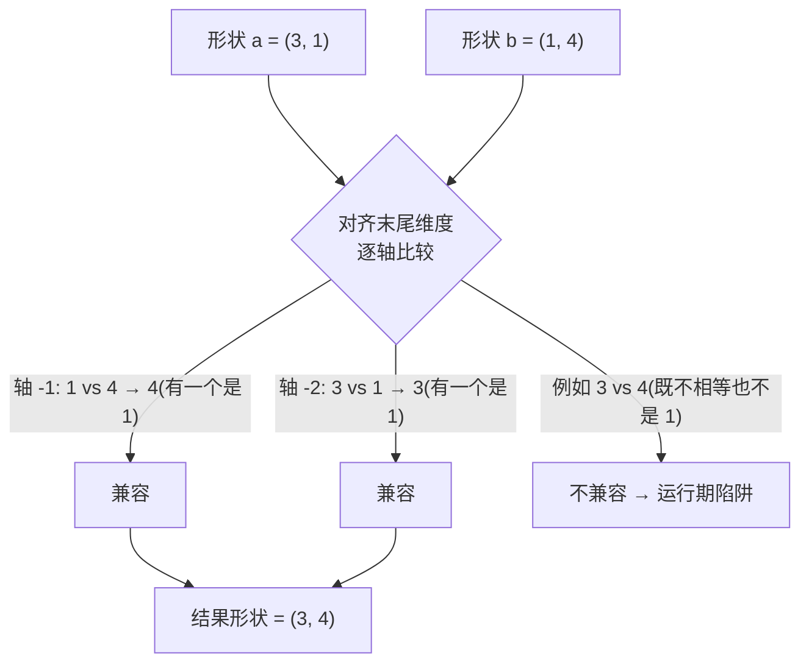

# `import coil` — 在 Cobrust 中用 numpy 的 ndarray buffer(8/8 ——最后一块 cobra 生态模块)

> 状态:ADR-0072 8/8 首次证明 —— coil 是 cobra 批次的第八个也是最
> 后一个生态模块。基于已验证的「值-句柄」链(与 den / molt / strike
> 相同形状)接入,完成了 v0.7.0 已落地的全部工作区内置生态。首次证明
> 范围只覆盖构造器 + repr;此后 ADR-0077 补上了操作符 / 索引 / 属性表
> 面 —— 逐元素 `a + b` / `a - b` / `a * b` / `a / b`(numpy **真除法**,
> 带 **广播**)、标量形式 `a + 1` / `a * 2`、标量 `a[i]` 读取,以及
> `a.shape` / `a.ndim` / `a.size`。

## 先看例子

```python
import coil

fn main() -> i64:
    let a: coil.Buffer = coil.zeros(3)
    let _ = coil.print_buffer(a)
    return 0
```

构建并运行:

```bash
cobrust build prog.cb -o prog
./prog
# array([0, 0, 0], dtype=float64)
```

## 你能用到的(首次证明表面)

- **`coil.zeros(n: i64) -> Buffer`** —— 分配一个 `n` 元素的 f64 全零
  1-D buffer。Shape `[n]`。`n` 负值会防御性地 clamp 到 0。
- **`coil.ones(n: i64) -> Buffer`** —— 分配一个 `n` 元素的 f64 全一
  1-D buffer。Shape `[n]`。
- **`coil.eye(n: i64) -> Buffer`** —— 分配 `n x n` 的 f64 单位矩阵
  (`k=0` 主对角线)。Shape `[n, n]` —— 也顺便证明这条链能处理非 1-D
  buffer(drop 与 shape 无关)。
- **`coil.print_buffer(b: Buffer) -> i64`** —— 把 buffer 的 numpy 兼容
  `array_repr` 打印到 stdout。成功返回 `0`;接收者为 null 时返回 `-1`
  (防御性)。

## 线性代数 —— `coil.linalg.*` 子命名空间(ADR-0079 Phase 1)

`coil.linalg.*` 是生态模块下的**第一个点分子命名空间** —— 它精确镜像
numpy 的 `np.linalg.*` 习惯用法(LLM 为 numpy 写的同样代码在这里也能
用,只需把 `np` 换成 `coil`)。`coil.linalg` 是一个**命名空间,不是你
要绑定的值**:直接写 `coil.linalg.solve(a, b)`(你永远不会
`let la = coil.linalg`)。

```python
import coil

fn main() -> i64:
    let a: coil.Buffer = coil.array2x2(1.0, 2.0, 3.0, 4.0)  # [[1,2],[3,4]]
    let b: coil.Buffer = coil.array1d2(5.0, 11.0)           # [5, 11]
    let x: coil.Buffer = coil.linalg.solve(a, b)            # 解 A·x = b
    print((x[0] as i64))   # 1
    print((x[1] as i64))   # 2
    let d: f64 = coil.linalg.det(a)
    print((d as i64))      # -2
    return 0
```

- **`coil.linalg.solve(a: Buffer, b: Buffer) -> Buffer`** —— 解线性方程
  组 `A · x = b`(LU 部分主元 —— LAPACK `*gesv` 的对应物)。返回解向量。
  `@py_compat(numerical(rtol=1e-6))`。
- **`coil.linalg.det(a: Buffer) -> f64`** —— 方阵的行列式。返回一个普通
  `f64`(numpy 的 0-d 标量不是 Cobrust 类型 —— 一个良性的、已记录的偏
  离)。
- **`coil.linalg.inv(a: Buffer) -> Buffer`** —— 矩阵求逆(通过
  `solve(a, I)` —— LAPACK `*getrf`+`*getri` 的对应物)。

它们包装的是 coil **已有的纯 Rust kernel**(零新数值代码),因此在 coil
能交叉编译到的每个目标(native / RISC-V / WebAssembly)上都能跑,无需
任何系统 BLAS —— 纯 Rust 路径是通用底座(ADR-0079 §6)。

### 最小 2-D / 显式数据构造器

`coil.linalg.*` 需要 2-D 矩阵,但 coil 其它构造器都是 1-D 的(而
`coil.eye(n)` 只能造单位矩阵)。这些最小的、全标量参数的构造器,用来构
造 linalg 表面要操作的小矩阵:

- **`coil.array2x2(a, b, c, d: f64) -> Buffer`** —— 行主序 `2 x 2` 矩阵
  `[[a, b], [c, d]]`。
- **`coil.array2x3(a, b, c, d, e, f: f64) -> Buffer`** —— 行主序
  `2 x 3` 矩阵(一个非方阵,例如用于 `det` 形状错误)。
- **`coil.array1d2(a, b: f64) -> Buffer`** —— 一个 2 元素 1-D 向量
  `[a, b]`,带显式数据(一个任意 RHS,如 `[5, 11]`,是 `coil.ones` /
  `coil.mgrid` 造不出来的)。

> 它们刻意保持最小(固定小 shape)。通用的嵌套列表
> `coil.array([[1, 2], [3, 4]])` 是 `list[f64]` → coil 编组落地后的后续
> 工作。这里**没有 `np.matrix` 遗留类** —— 只有 `Buffer`,且
> `coil.linalg.*` 是 matmul 风格(优雅账本丢弃了 numpy 积累的陷阱)。

### 形状 / 奇异错误是运行期陷阱

`coil.Buffer` 的静态类型里不携带 rank 或条件数,因此形状 / 奇异错误在
**运行期**暴露(干净的进程中止 + 诊断,绝不是静默的垃圾值):

- 对**奇异**矩阵调用 `coil.linalg.solve` / `coil.linalg.inv` →
  运行期中止(`Singular matrix`)。
- 对**非方阵**调用 `coil.linalg.det` → 运行期中止
  (`det requires a square matrix`)。(对**奇异**但方的矩阵,`det`
  返回 `0.0` 而不中止 —— 与 numpy 一致。)

arity 和未知成员错误**在编译期**被捕获:`coil.linalg.solve(a)`
(arity 错)和 `coil.linalg.solveX(a)`(未知成员)都是类型错误,不是运
行期崩溃。

## 逐元素操作符 + 广播(`a + b`、`a - b`、`a * b`、`a / b`)

两个 `coil.Buffer` 句柄可以用 `+` / `-` / `*` / `/` 做加 / 减 / 乘 /
**除** —— 而且和 numpy 一样,形状**不必相同**:只要两者**可广播**,就
会先被拉伸到一个公共形状。你也可以写 `a + 1` / `a - 1` / `a * 2` /
`a / 2` —— 一个 buffer 和一个普通数字(**标量**)运算,与 numpy 完全
一致。

```text
import coil

fn main() -> i64:
    let a: coil.Buffer = coil.ones(3)     # 形状 (3,): [1, 1, 1]
    let b: coil.Buffer = coil.ones(1)     # 形状 (1,): [1]
    let c: coil.Buffer = a + b            # 广播 (3,)+(1,) -> (3,): [2, 2, 2]
    let m: f64 = coil.mean(c)             # 2.0
    print((m as i64))                     # 2
    return 0
```

相同形状照常工作(`coil.ones(3) + coil.ones(3)` → `[2, 2, 2]`),`*` /
`-` / `/` 的广播方式完全一致(它们和 `+` 共享同一条代码路径,所以 `+`
能广播的,其余也都能广播)。

### 除法是「真除法」(`/` 永远给出浮点)

`a / b` 就是 numpy 的 `/` —— **真除法(true division)** —— 所以它**永远**
产生浮点结果,绝不是整数向下取整。`[1, 2, 3] / [2]` 是
`[0.5, 1.0, 1.5]`,而不是 `[0, 1, 1]`。而除以零遵循 IEEE 754(和 numpy
完全一样):它**不会**崩溃 —— `1.0 / 0.0` 是 `inf`,`-1.0 / 0.0` 是
`-inf`,`0.0 / 0.0` 是 `nan`。程序会继续运行。

```text
import coil

fn main() -> i64:
    let a: coil.Buffer = coil.array1d2(10.0, 20.0)  # [10, 20]
    let b: coil.Buffer = coil.array1d2(2.0, 4.0)    # [2, 4]
    let c: coil.Buffer = a / b                       # [5.0, 5.0]  (10/2, 20/4)
    let _ = coil.print_buffer(c)

    let one: coil.Buffer = coil.ones(1)              # [1.0]
    let zero: coil.Buffer = coil.zeros(1)            # [0.0]
    let inf: coil.Buffer = one / zero                # [inf]  (IEEE,不是崩溃)
    let _ = coil.print_buffer(inf)
    return 0
```

> 注意:`/` 是**真除法**,不是向下取整除法。Cobrust 目前还没有为 buffer
> 接上 `//`(向下取整除法)—— `a // b` 今天是一个编译错误。

### 标量:`a + 1`、`a * 2`、`a / 2`

一个 buffer 和一个普通数字运算,会把那个数字加 / 减 / 乘 / 除到**每一个
元素**上 —— 即 numpy 的「数组 ⊕ 标量」。在底层,标量被当作一个长度为
`1` 的 buffer 来广播,所以它复用了和 `a + b` 完全相同的机制。

```text
import coil

fn main() -> i64:
    let a: coil.Buffer = coil.mgrid(1, 4)   # [1.0, 2.0, 3.0]
    let c: coil.Buffer = a + 1              # [2.0, 3.0, 4.0]
    let d: coil.Buffer = a * 2              # [2.0, 4.0, 6.0]
    let e: coil.Buffer = a / 2              # [0.5, 1.0, 1.5]  (真除法)
    let m: f64 = coil.mean(c)              # 3.0
    print((m as i64))                       # 3
    return 0
```

标量可以是整数(`a + 1`)或浮点(`a + 1.5`);整数会被自动提升为浮点。
buffer 和**非数字**(例如 `a + "x"`)运算仍然是编译错误。

### 标量放在**左边**:`2 * a`、`6 / a`(以及 `-` 和 `/` 的陷阱)

标量可以放在**任意一边** —— `2 * a` 和 `a * 2` 完全一样,就像你在 numpy
里写的那样。

```text
import coil

fn main() -> i64:
    let a: coil.Buffer = coil.array1d2(2.0, 4.0)   # [2, 4]
    let p: coil.Buffer = 1 + a                      # [3, 5]   (等同于 a + 1)
    let m: coil.Buffer = 3 * a                       # [6, 12]  (等同于 a * 3)
    let s: coil.Buffer = 10 - a                      # [8, 6]   -> 10 减每个,不是每个减 10
    let d: coil.Buffer = 6 / a                       # [3, 1.5] -> 6 除以每个,不是每个除以 6
    return 0
```

关键的陷阱:`+` 和 `*` 满足**交换律**(顺序无所谓),但 `-` 和 `/`
**不满足**。`10 - a` 表示「10 减去每个元素」(`[10-2, 10-4] = [8, 6]`),
而**不是**「每个元素减去 10」;同理 `6 / a` 是「6 除以每个元素」
(`[6/2, 6/4] = [3, 1.5]`)。Cobrust 会保持正确的方向 —— 不会悄悄把你的
操作数颠倒。

### 比较两个 buffer:`a < b` 给出**掩码**,而不是单个 bool

用 `<`、`<=`、`>`、`>=`、`==`、`!=` 比较两个 buffer 是**逐元素**的,和
numpy 完全一样:结果是一个由 `True`/`False` 组成的**新 buffer**(布尔
掩码),**而不是**单个 `True`/`False`。

```text
import coil

fn main() -> i64:
    let a: coil.Buffer = coil.array1d2(1.0, 5.0)
    let b: coil.Buffer = coil.array1d2(3.0, 2.0)
    let lt: coil.Buffer = a < b              # [1<3, 5<2] = [True, False]
    let eq: coil.Buffer = a == b             # [1==3, 5==2] = [False, False]
    let _ = coil.print_buffer(lt)            # array([True, False], dtype=bool)
    return 0
```

注意结果类型是 `coil.Buffer`(一个 bool dtype 的数组),**不是**普通的
`bool`。这就是为什么 `a == b` 不会坍缩成一个「是 / 否」的答案 —— 它会
逐对比较每个元素。和算术操作符一样,比较也会**广播**
(`coil.mgrid(0, 3) < coil.ones(1)` → `[True, False, False]`)。

**暂不支持**的:用一个**普通数字**和 buffer 比较(`a < 1`)。Cobrust 会
在编译期拒绝它,并给出告诉你修法的提示 —— 改成和一个同形状的 buffer
比较(例如 `a < b`)。`@` 矩阵乘法操作符同样暂不支持。

### 广播规则(与 numpy 精确一致)

Cobrust 采用与 numpy 完全相同的规则。从**末尾**(最右)维度对齐两个
形状;缺失的前导维度按 `1` 计;两个维度兼容的条件是**相等** 或 **其中
一个是 `1`**(大小为 `1` 的维度会被重复);结果维度取两者中的较大值。



实例(每个值都与 numpy 产生的一致):

- `(3,1) + (1,4)` → `(3,4)` —— 教科书式的外积求和。
- `(2,3) + (3,)` → `(2,3)` —— 矩阵 + 行(`(3,)` 缺失的前导维按 `1`
  计)。
- `(3,) + (1,)` → `(3,)` —— 长度为 `1` 的 buffer 会被广播到更长的那个上。
  (这也正是标量 `a + 1` 在内部的工作方式:`1` 变成一个长度为 `1` 的
  buffer。)

### 不兼容的形状是运行期陷阱

和 `coil.linalg` 一样,`coil.Buffer` 的**静态类型里不携带形状**,所以
不可广播的一对只能在**运行期**被捕获:一次干净的进程中止 + numpy 风格
的诊断,绝不会产生一个静默错误的 buffer。

- `coil.ones(3) + coil.ones(4)` → 运行期中止:`operands could not be
  broadcast together with shapes [3] [4]`(`3` vs `4` 既不相等也不是
  `1`)。numpy 抛出同样的错误。
- `coil.mgrid(0, 5) + coil.ones(2)` → 运行期中止(`5` vs `2`)。

这是 §2.5「在编译期捕获」唯一无法适用的地方 —— 在这里形状正确性本质上
是一个运行期属性(句柄类型与形状无关)。这个取舍是刻意的,并记录在
ADR-0077 中:操作符镜像 numpy 的表面(`a + b`,没有 `?`),代价是用一
次运行期检查代替编译期错误。

## 为什么是这样的设计?

- **den、molt、strike、coil 共享同一个值-句柄 ABI 形状**:每个
  `Buffer` 都以 opaque `*mut u8` 指针形式跨越,指向 Boxed 的
  `coil::Array`(已有的 `ndarray::ArrayD<T>` tagged-union)。`.cb` 调
  用方持有句柄;作用域退出时 `__cobrust_coil_buffer_drop` 恰好执行一
  次,顺势把整条所有权链(Array → ArrayD → Vec<T>)一起回收。
- **编译期捕获(§2.5 约束)**:`coil.flatten(a)`(清单未注册)在
  type-check 阶段被拒;`coil.zeros("three")`(参数类型错)也在
  type-check 阶段被拒。运行期没有惊吓。
- **没有 `__init__.py` / 没有 pip / 没有 sys.path 之乱**:`import coil`
  是特权生态别名(ADR-0072 Q1);`cobrust build` 仅在源码确实用到
  时才静态链接 `libcoil.a`(没有链接膨胀)。

## 当前限制

- **逐元素操作符**:`a + b` / `a - b` / `a * b` / `a / b` 都已可编译且
  会**广播**(`/` 是真除法);六个比较操作符(`a < b` … `a != b` → bool
  掩码)也已可编译(见上文)。仍未落地:`@` matmul 操作符和向下取整除法
  `//` —— 在 ADR-0077 §12 跟踪。
- **标量两边都能用**:`a + 1` / `a * 2` 和 `2 * a` / `6 / a` 都已可编译
  (numpy 的「数组 ⊕ 标量」)。**不支持**的是用一个裸数字和 buffer 比较
  —— `a < 1` 会在编译期被拒绝(并给出指向 `a < b` 的修法提示);请改用
  同形状的 buffer。
- **除 `dot` 外没有多句柄方法**:`a.dot(b)` 已可编译(一维点积);
  `a.matmul(b)` / `@` 操作符还不能 —— 需要清单扩展接收者-参数形状。
- **dtype 固定为 `float64`**:首次证明范围只支持一个 dtype 以保持
  wire surface 最小。带显式 dtype 等级的 `coil.zeros(n, dtype)` 形
  状是后续 follow-up。
- **`print_buffer` 不返回结构化数据**:这个读方法直接通过 Rust 端
  的 `println!` 打印。未来的 `Buffer.tolist() -> str` 形状将复用
  den 风格的 `__cobrust_str_*` extern 接线(build.rs 里的延迟解析
  flag 已经就位)。

## 这条链是怎么对接的

```text
.cb 中的 `import coil` + `coil.zeros(3)` + `coil.print_buffer(a)`
  → cobrust-types 生态清单(typecheck)          [L1]
  → cobrust-mir lowering(Str retarget → __cobrust_coil_*) [L2]
  → cobrust-codegen 外部声明 + 句柄 drop          [L3]
  → cobrust-coil C-ABI shims(libcoil.a)         [L4]
  → cobrust-cli build.rs 按需静态链接           [L5]
```

前几个 cobra 批次的数据模块(`den` / `nest` / `strike` / `scale` /
`molt`)依次走过这条链;`coil` 是最后一个走完它的模块。MIR / HIR /
drop / link-locate 各层在这次证明里**完全没动** —— 链泛化第八次成
立。
