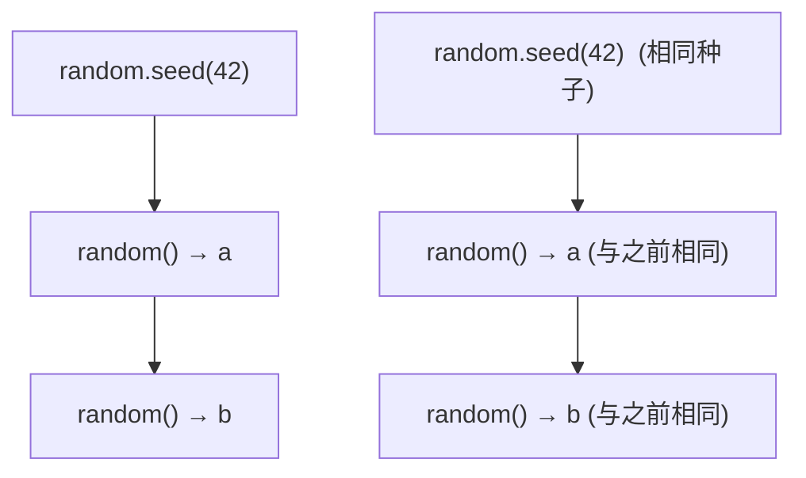

# `import random` — 在 Cobrust 中进行伪随机采样

> 状态:ADR-0086。伪随机采样 —— 采样、模拟、随机化测试在 Python 中无处不在。
> 第一版提供四个标量函数(`random`、`randint`、`uniform`、`seed`);列表形式
> (`choice`、`shuffle`、`sample`)是已记录的后续工作。

## 先看例子

```python
import random

fn main() -> i64:
    # 重新设置种子,使运行可复现(相同种子 → 相同序列)。
    let _ = random.seed(42)

    # [0, 1) 上的均匀浮点数。
    let x: f64 = random.random()

    # [1, 6] 上的均匀整数 —— 两端都包含(掷骰子)。
    let d: i64 = random.randint(1, 6)
    print(d)

    # [a, b] 上的均匀浮点数。
    let t: f64 = random.uniform(-1.0, 1.0)

    # 用相同的种子重新设置 → 得到相同的下一次抽样。
    let _ = random.seed(42)
    let y: f64 = random.random()
    if x == y:
        print("reproducible")        # 会打印 —— 相同种子,相同序列

    return 0
```

编译并运行:

```bash
cobrust build prog.cb -o prog
./prog
```

## 你得到了什么

| 函数 | 返回 | 作用 |
|---|---|---|
| `random.random()` | `f64` | **`[0, 1)`** 上的均匀浮点数(无参数) |
| `random.randint(a, b)` | `int` | **`[a, b]`、两端都包含**的均匀整数 |
| `random.uniform(a, b)` | `f64` | **`[a, b]`** 上的均匀浮点数 |
| `random.seed(n)` | —— | 重新设置生成器(相同种子 → 相同序列) |

### `random.randint` 包含两端

唯一需要记住的一点:`randint(a, b)` **可以**返回任一端点。

```python
random.randint(5, 5)   # 总是 5
random.randint(1, 6)   # 1、2、3、4、5、6 中的任意一个 —— 公平的骰子,包含 6
```

(如果你曾经用错误的上界写过"随机下标",却从未取到最后一个元素 —— 这种差一
错误正是 `randint` 的闭区间所要避免的。)

### `random.random()` 和 `random.uniform()`

```python
random.random()            # 0.0 <= x < 1.0   (单位区间)
random.uniform(2.5, 9.5)   # 2.5 <= x <= 9.5
random.uniform(-5.0, -1.0) # 对任意区间都适用,包括负数
```

### `random.seed()` 让运行可复现

设置种子是这个模块在测试中的核心价值:**相同的种子产生相同的序列**,每一次
都如此。



```python
let _ = random.seed(42)
let a: f64 = random.random()
let _ = random.seed(42)
let b: f64 = random.random()
# a == b  —— 有保证
```

如果不调用 `seed(...)`,生成器会在首次使用时由操作系统的熵来设置种子 —— 因此
未设种子的程序是真正非确定的(这正是它的特性)。也正因如此,你永远无法断言某
次*原始*抽样的具体值;你*可以*断言的是上面的**种子可复现等式**,以及某次抽样
落在它的区间内。

> 注意:在 Python 中,`random.seed(n)` 返回 `None`。在 Cobrust 中,该调用会产
> 生一个一次性的值,你用 `let _ = random.seed(n)` 丢弃它。重新设种子才是效果;
> 返回值不携带任何信息。

## 兼容性 —— `@py_compat(semantic)`

Cobrust 的 `random` 由 **PCG64** 生成器支撑(与 `coil.random` 使用的相同,对应
numpy 的 `default_rng` 家族)。Python 的 `random` 模块由 **梅森旋转**
(Mersenne Twister)支撑。

这意味着:

- **分布是一致的。** `random()` 在 `[0, 1)` 上均匀,`randint(a, b)` 在闭区间整
  数 `[a, b]` 上均匀,`uniform(a, b)` 在 `[a, b]` 上均匀 —— 与 Python 完全相同。
- **具体的数字与 Python 不一致。** 对相同的种子,Cobrust 与 CPython 产生*不同*
  的序列(生成器不同)。Cobrust 不会、也不试图复现 CPython 的精确值。
- **在 Cobrust 内部,相同的种子总是复现相同的序列** —— 在任何机器、任何架构上
  (PCG64 是可移植的)。

所以:依赖*分布*以及 *Cobrust 内部的种子可复现性*;不要期望 Cobrust 的抽样在相
同种子下等于 CPython 的抽样。这与 `coil.random` 对待 numpy 的诚实立场一致。

## 暂未提供的部分

基于列表的函数是计划中的后续工作:

- `random.choice(seq)` —— 随机选取一个元素。
- `random.shuffle(seq)` —— 原地打乱一个列表。
- `random.sample(seq, k)` —— 选取 `k` 个不同的元素。

它们需要一个列表参数(而且 `shuffle` 会修改它),这是库表面的下一步。今天若使用
其中之一,会是**编译期错误**(未知函数),而不是静默的错误结果。

## 为什么这样设计?

- **一个全局生成器,和 Python 一样。** `random.random()` 等函数共享一个隐藏的生
  成器,由 `random.seed(...)` 重新设种 —— 正如 Python 的模块级函数。(当你需要一
  个*独立的*、显式持有的生成器时,那是 `coil.random` 的 `Generator`。)
- **`randint` 两端都包含。** 这是 Python 的做法,也是能避免经典"取不到最后一个
  值"差一错误的形式。实现使用闭区间,因此 `randint(1, 6)` 确实能返回 6。
- **设种子可复现,默认用操作系统熵。** 设了种子的运行可复现(对测试至关重要);
  未设种子的运行是真正随机的。
- **对生成器保持诚实。** 我们用 PCG64 而非梅森旋转,所以我们*明说*这一点,并承诺
  分布 + 可复现性,而不是暗示一个并不成立的、与 CPython 逐位一致的匹配(章程
  §5.2:不做不科学的断言)。
