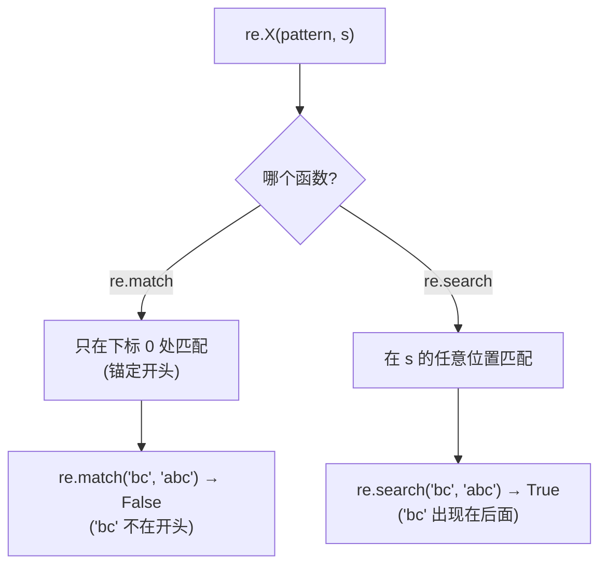

# `import re` — 在 Cobrust 中使用正则表达式

> 状态:ADR-0084。正则表达式处理 —— Python 中最常用的能力之一。第一版
> 提供四个无状态函数(`sub`、`findall`、`match`、`search`);Match 对象的
> `.group()` 形式是已记录的后续工作。

## 先看例子

```python
import re

fn main() -> i64:
    # 替换全部匹配。
    print(re.sub("a", "X", "banana"))           # bXnXnX

    # 找出所有匹配,然后遍历列表。
    let nums: list[str] = re.findall("[0-9]+", "a1b22c333")
    for n in nums:
        print(n)                                # 1  /  22  /  333

    # match 锚定在开头;search 在任意位置查找。
    if re.search("bc", "abc"):
        print("found bc somewhere")             # 会打印
    if re.match("bc", "abc"):
        print("starts with bc")                 # 不会打印
    else:
        print("does not start with bc")         # 会打印

    return 0
```

编译并运行:

```bash
cobrust build prog.cb -o prog
./prog
```

## 你得到了什么

| 函数 | 返回 | 作用 |
|---|---|---|
| `re.sub(pattern, repl, s)` | `str` | 替换**全部**不重叠的匹配 |
| `re.findall(pattern, s)` | `list[str]` | **所有**不重叠的匹配,作为一个列表 |
| `re.match(pattern, s)` | `bool` | `pattern` 是否在 `s` 的**开头**匹配? |
| `re.search(pattern, s)` | `bool` | `pattern` 是否在 `s` 的**任意位置**匹配? |

### `re.sub` 替换全部匹配

```python
re.sub("a", "X", "banana")        # "bXnXnX"  —— 三次替换,不是一次
re.sub("[0-9]+", "#", "a1b22c333") # "a#b#c#" —— 每一段数字变成一个 #
```

### `re.findall` 给你一个可以遍历的真正列表

```python
re.findall("[0-9]+", "a1b22c333")  # ["1", "22", "333"]
re.findall("[0-9]+", "abcdef")     # []  (无匹配 → 空列表)
```

返回值是一个普通的 `list[str]` —— 可以遍历、可以索引、可以四处传递。

### `re.match` 与 `re.search` —— 锚点是关键

只需记住一件事:**`match` 锚定在开头;`search` 在任意位置查找。**



```python
re.match("bc", "abc")   # False —— "abc" 不以 "bc" 开头
re.search("bc", "abc")  # True  —— "bc" 确实在里面(下标 1)
re.match("ab", "abc")   # True  —— "abc" 确实以 "ab" 开头
```

两者都返回 `bool`,所以可以直接用在 `if` 里:

```python
if re.search("[0-9]+", line):
    print("the line has a number")
```

> 注意:在 Python 中,`re.match` / `re.search` 返回的是一个 *Match 对象*
> (或 `None`)。Cobrust 第一版返回普通的 `bool`。Match 对象的 `.group()`
> 接口是计划中的后续工作。

## 兼容性 —— `@py_compat(semantic)`

Cobrust 的 `re` 由 Rust 的 `regex` 引擎支撑。对于日常的模式 —— 字符类
(`[0-9]`、`\w`、`\d`)、量词(`+`、`*`、`?`、`{2,4}`)、选择
(`a|b`)、锚点(`^`、`$`)、分组(`(...)`)—— 它的行为与 Python 的 `re`
一致。

有两点不同(已记录的差异):

- **不支持反向引用**(`\1`)和**环视**(`(?=...)`、`(?<=...)`)。这是
  `regex` 线性时间保证的代价。使用它们的模式会**失败**(见下方"非法
  模式")。
- **`re.findall` 返回完整匹配。** 对于没有捕获组的模式,这与 Python 完全
  一致。Python 的捕获组行为(一个组 → 该组的文本;多个组 → 元组)尚未
  镜像 —— 带分组的模式会返回整个匹配。

## 非法模式会触发陷阱(而不是悄悄失败)

如果你给 `re` 一个非法模式(例如 `"["`),它会**带着清晰的错误终止程序**
—— 而**不会**悄悄返回"无匹配":

```python
import re

fn main() -> i64:
    print(re.sub("[", "X", "abc"))   # 陷阱:cobrust panic: re: invalid pattern "["
    return 0
```

程序以非零状态退出,并打印一条指明非法模式的消息。(Python 抛出
`re.error`;Cobrust 触发陷阱。)目前这发生在**运行时**,因为模式是一个
运行时字符串;在**编译时**捕获非法的**字面量**模式是一项计划中的改进。

## 为什么这样设计?

- **先做四个无状态函数。** 它们覆盖了绝大多数真实的 `re` 用法(替换、
  查找全部、测试是否匹配),且不需要有状态的 Match 对象 —— 因此可以干净
  地映射到 Cobrust 的 string / list / bool 返回值,零新增机制。
- **`match` / `search` 暂时返回 `bool`。** 大多数代码用的是
  `if re.search(...)`。返回 `bool` 让这种写法自然且类型安全;更丰富的
  Match 对象稍后再来。
- **遇到非法模式,触发陷阱,而不是撒谎。** 对一个打错的模式悄悄返回"无
  匹配"是经典的 Python 陷阱。Cobrust 把它响亮地暴露出来(宪法 §2.2:
  不允许悄无声息的错误答案)。
