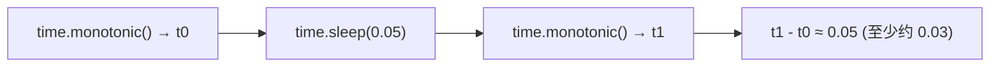

# `import time` — 在 Cobrust 中进行计时与时间戳

> 状态:ADR-0087。计时与时间戳 —— 读取时钟和暂停线程在 Python 中无处不在。
> 第一版提供四个标量函数(`time`、`monotonic`、`perf_counter`、`sleep`);日历
> 相关机制(`strftime`、`gmtime`……)和整数纳秒变体(`time_ns`……)是已记录的
> 后续工作。

## 先看例子

```python
import time

fn main() -> i64:
    # 时间戳:当前 Unix 纪元时间,单位为秒(墙上时钟)。
    let now: f64 = time.time()
    if now > 1.7e9:
        print("after 2023")          # 会打印 —— 一个合理的 2023 年之后的纪元

    # 用单调时钟测量某件事花了多久。
    let start: f64 = time.monotonic()
    let _ = time.sleep(0.05)          # 暂停 0.05 秒
    let elapsed: f64 = time.monotonic() - start
    if elapsed >= 0.03:
        print("waited")              # 会打印 —— sleep 确实产生了延迟

    # perf_counter 与 monotonic 是同一个高分辨率时钟。
    let p: f64 = time.perf_counter()

    return 0
```

编译并运行:

```bash
cobrust build prog.cb -o prog
./prog
```

## 你得到了什么

| 函数 | 返回 | 作用 |
|---|---|---|
| `time.time()` | `f64` | 当前 Unix 纪元时间,单位为**秒**(墙上时钟;无参数) |
| `time.monotonic()` | `f64` | 自进程相对原点起的秒数,**永不倒退**(无参数) |
| `time.perf_counter()` | `f64` | 与 `monotonic` **完全相同**的高分辨率单调时钟(无参数) |
| `time.sleep(secs)` | —— | 将当前线程暂停 `secs` 秒 |

### 两个时钟,两种用途

- **`time.time()` 是墙上时钟。** 它回答"现在几点?",以秒为单位给出 Unix 时间戳
  (带小数部分以提供亚秒精度)。如果系统时钟被调整(NTP、夏令时、手动改动),它
  可能向前或向后跳变。用它来打时间戳,而不是测量时长。

- **`time.monotonic()` 是区间时钟。** 它只会向前走,且不受系统时钟调整影响。它的
  绝对值本身没有意义(它从程序启动时的某个任意点开始计数)—— 它的用途是两次读数
  之间的*差值*。

```python
# 测量时长的正确方式:
let t0: f64 = time.monotonic()
# ... 做一些工作 ...
let dt: f64 = time.monotonic() - t0      # 经过的秒数,总是 >= 0
```

### `time.perf_counter()` 与 `monotonic` 是同一个时钟

Python 把 `perf_counter` 和 `monotonic` 记为两个命名时钟。在 Cobrust 中它们是
**同一个**最高分辨率的单调时钟 —— 读取任一个都得到来自同一原点的值。哪个名字读
起来更顺就用哪个;在同一次 `start` / `end` 测量中混用它们也没问题。

### `time.sleep()` 暂停线程

```python
let _ = time.sleep(0.5)    # 暂停半秒
let _ = time.sleep(2.0)    # 暂停两秒
```

非正数的 sleep 什么都不做,立即返回:

```python
let _ = time.sleep(0.0)    # 空操作,立即返回
let _ = time.sleep(-1.0)   # 同样是空操作 —— 不是错误,也不会崩溃
```

> 在 Python 中,`time.sleep(-1)` 会抛出 `ValueError`。Cobrust 采用更温和、安全的
> 做法:零或负的 sleep 直接作为空操作。因此如果你用减法计算 sleep
> (`time.sleep(deadline - now)`)而结果为负,你的程序会继续运行而不是崩溃。

> 注意:在 Python 中,`time.sleep(secs)` 返回 `None`。在 Cobrust 中,该调用会产生
> 一个一次性的值,你用 `let _ = time.sleep(secs)` 丢弃它。暂停才是效果;返回值不
> 携带任何信息。



## 时钟是非确定的 —— 你可以断言什么

每次读取时钟,读数都会变化,且 `monotonic` 的原点取决于程序启动的时刻,因此你永远
无法断言时钟的*精确*值。你*可以*依赖的是:

- `time()` 落在一个合理的 Unix 纪元区间内(2023 年之后,即大于 `1.7e9` 秒)。
- `monotonic()` 连续两次读取永不减小(`较晚的 >= 较早的`)。
- `sleep(d)` 使至少约 `d` 秒过去(操作系统可能睡得稍*久*一点,但不会有意义地睡得
  更*短*)。

## 兼容性 —— `@py_compat(semantic)`

时钟是环境的一部分,而非纯函数,因此 Cobrust **不会**复现 CPython 的精确浮点值:

- **时钟*语义*是一致的。** `time()` 是以 Unix 纪元秒为单位的墙上时钟;`monotonic()`
  / `perf_counter()` 是以秒为单位、不减小的区间时钟;`sleep(secs)` 暂停 `secs` 秒
  —— 与 Python 完全相同。
- **具体的数字与 Python 不一致。** 不同的纪元舍入以及不同的(进程相对的)单调原点
  意味着原始浮点值不同。`sleep` 是尽力而为的,这在任何语言中都如此。

这与 `random` 对待 CPython 生成器的诚实立场一致:依赖*行为*与*次序*,而非逐位一致
的匹配。

## 暂未提供的部分

计划中的后续工作:

- `time.time_ns()` / `time.monotonic_ns()` / `time.perf_counter_ns()` —— 整数纳秒
  变体。
- `time.process_time()` / `time.thread_time()` —— CPU 时间时钟。
- `time.gmtime()` / `time.localtime()` / `time.strftime()` / `time.strptime()` /
  …… —— 日历格式化与 `struct_time`(需要日期/时间结构以及时区)。

今天若使用其中之一,会是**编译期错误**(未知函数),而不是静默的错误结果。

## 为什么这样设计?

- **一个共享的单调原点,惰性捕获。** `monotonic` 和 `perf_counter` 从每个程序中
  一个固定的点开始测量,该点在你首次调用任一函数时被捕获 —— 因此程序的每个部分
  (以及每个线程)都看到一条一致的时间线。(这与 `random` 相反,后者中每个线程*想
  要*自己的序列。)
- **`perf_counter` 与 `monotonic` 是同一个时钟。** 标准库的单调时钟本身*就是*平台
  提供的最高分辨率计时器,因此另设一个时钟只会返回相同的数字。我们保留两个名字但
  统一时钟。
- **负的 sleep 是空操作,而非崩溃。** 零或负的暂停没有什么可等待,因此立即返回是
  安全、无意外的选择 —— 比在计算出负时长时崩溃更友好。
- **对时钟保持诚实。** 时钟读数取决于机器和时刻,所以我们承诺*语义*与*次序*,而不
  是暗示一个并不成立的、与 CPython 逐位一致的匹配(章程 §5.2:不做不科学的断言)。
