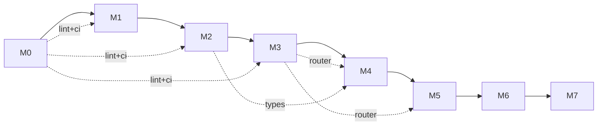

# 里程碑

| 里程碑 | 范围 | 验收标准 |
|---|---|---|
| **M0** | 仓库骨架、文档骨架（zh/en/agent）、CI、ADR 模板、lint 配置 | `cargo build` 通过；三棵文档树存在；ADR-0001（许可证）落地 |
| **M1** | Cobrust 核心语法的词法器 + 语法分析器 + AST | "核心 30 形式" round-trip；24h fuzz 测试无 crash |
| **M2** | 静态核心的类型检查器（暂不含 `dyn`） | 通过精选的"良类型 / 病类型程序"测试套件 |
| **M3** | LLM Router crate（独立可用） | OpenAI + Anthropic adapter 工作；缓存 + 账本工作；consensus 模式在合成任务上验证 |
| **M4** | L0 + L1 流水线在 `tomli` 上端到端跑通 | 完整来源清单；通过 PyO3 wrapper 跑过 `tomli` 测试套件 |
| **M5** | L2 + L3 gate 接通；翻译第二个库（`python-dateutil` 核心） | 差分测试失败自动路由到 repair；benchmark 报告 |
| **M6** | 第一个含原生扩展的库（`orjson` 或 `msgpack`） | 证明非纯 Python 翻译可行性 |
| **M7+** | 数值层：`numpy` 核心子集 | 单独规划文档。**大头。仅在 M6 完成之后开始。** |

## 当前状态

我们在 **M0**。当你看到这份文档时，仓库骨架已经搭好——`cargo build` 跑通、三棵文档树齐活、ADR-0001 已落地。

## 开发纪律（适用于所有里程碑）

- **测试先行**：编译器内部一律先写失败测试，再写实现
- **闭环验证**：每个翻译库的 L0–L3 gate 全部不可跳
- **ADR-or-it-didn't-happen**：影响两个及以上文件的决定都要写 ADR
- **doc-coverage 在 CI 强制**：任何 public item 缺 zh / en / agent 文档 → CI 红
- **Provenance-or-it-didn't-happen**：AI 翻译文件必须带清单头
- **原子提交**：代码 + 测试 + 文档（zh、en、agent）+ ADR（如适用）一次性提交

## 里程碑之间的依赖

- M0 是公共底座，所有后续里程碑共享
- M3（Router）是 M4+ 翻译流水线的前提
- M2（类型检查器）是 M4+ 验证翻译产物的前提
