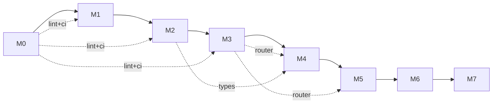

# 里程碑

| 里程碑 | 范围 | 验收标准 |
|---|---|---|
| **M0** | 仓库骨架、文档骨架（zh/en/agent）、CI、ADR 模板、lint 配置 | `cargo build` 通过；三棵文档树存在；ADR-0001（许可证）落地 |
| **M1** | Cobrust 核心语法的词法器 + 语法分析器 + AST | "核心 30 形式" round-trip；24h fuzz 测试无 crash |
| **M2** | 静态核心的类型检查器（暂不含 `dyn`） | 通过精选的"良类型 / 病类型程序"测试套件 |
| **M3** | LLM Router crate（独立可用） | OpenAI + Anthropic adapter 工作；缓存 + 账本工作；consensus 模式在合成任务上验证 |
| **M4** | L0 + L1 流水线在 `tomli` 上端到端跑通 | 完整来源清单；通过 PyO3 wrapper 跑过 `tomli` 测试套件 |
| **M5** | L2 + L3 gate 接通；翻译第二个库（`python-dateutil` 核心） | 差分测试失败自动路由到 repair；benchmark 报告 |
| **M6 ✅** | 第一个含原生扩展的库（`msgpack`）— Cython 词法 shim、perf-gate 失败即触发修复、dateutil L3 拓宽、PyO3 构建路径 | pack/unpack 字节级与 CPython oracle 对齐；Cython shim 解析 `_packer.pyx`/`_unpacker.pyx` 构件；`--features pyo3` 编译通过 |
| **M7.0 ✅** | numpy 核心子集第一个子里程碑：ndarray 基础（按 ADR-0012 + ADR-0013）— closed `Dtype` 枚举（`Int32 / Int64 / Float32 / Float64 / Bool`）、tagged-union `Array`、四个构造器（`array` / `zeros` / `ones` / `arange`） | ≥ 50 良类型 + ≥ 50 病类型程序；≥ 1000 fuzz 不 panic；与 upstream numpy 2.0.2 差分（int/bool 字节级、float `rtol=1e-12`） |
| **M7.1 ✅** | universal functions + 广播 + NEP 50 类型晋升（按 ADR-0014）；类型化构造器 + 多维 nested-list 解析；关闭 ADR-0013 follow-up #1-#4（单态化分发、类型化构造器、L2.perf flip、多维 nested-list） | 50 良类型 + 50 病类型 ufunc 程序；每个 ufunc >= 1200 fuzz 输入差分 vs upstream numpy 2.0.2（int/bool 字节级、float `rtol=1e-7`）；广播表（22 条）；L2.perf gate 翻为强制 |
| **M7.2 ✅** | 索引（基本切片、整数数组、布尔掩码）；`np.where`；视图（`ArrayView<'a>` / `ArrayViewMut<'a>`，按 ADR-0015）；闭合 `Index` enum + `SliceSpec`；4 个新错误变体（`IndexError`、`OutOfBoundsIndex`、`BoolMaskShapeMismatch`、`IndexDtypeNotInteger`） | ≥ 50 良类型 + ≥ 50 病类型索引程序；每种索引方式 ≥ 1024 fuzz 输入差分 vs upstream numpy 2.0.2（int/bool 字节级、float `rtol=1e-7`）；视图与拷贝语义可观测（mutate-through-view + 高级索引返回独立拷贝）；L2.perf gate 继承 M7.1 的"强制"状态 |
| **M7.3 ✅** | 归约（`sum / prod / mean / std / var / min / max / argmin / argmax`，按 ADR-0016）支持 `axis: Option<i64>`；浮点用成对求和（pairwise summation）；std/var 带 `ddof: u32`；空数组语义与 numpy 一致（sum/prod 返回单位元、mean/std/var 返回 NaN、min/max/argmin/argmax 返回 `ReductionEmptyArray`）；1 个新错误变体 | ≥ 50 良类型 + ≥ 50 病类型归约程序；每个归约 ≥ 1024 fuzz 输入差分 vs upstream numpy 2.0.2（int/bool 字节级、float `rtol=1e-7`、argmin/argmax 完全一致）；成对精度测试（10⁶ 个微浮点 `rtol=1e-12`）；L2.perf gate 继承"强制"状态 |
| **M7.4 ✅** | 线性代数子集（`matmul / dot / det / solve / inv / svd / eigh / cholesky`，按 ADR-0017）；仅浮点输入（`Float32 / Float64`）；默认纯 Rust 内核 + 可选 `linalg-backend` cargo feature 启用 `ndarray-linalg` BLAS 加速；4 个新错误变体（`SingularMatrix`、`NotPositiveDefinite`、`LinalgShapeError`、`LinalgDtypeUnsupported`）；`SvdResult` / `EighResult` 结构体 | ≥ 50 良类型 + ≥ 50 病类型线代程序；每个 op ≥ 1024 fuzz 输入差分 vs upstream numpy 2.0.2，cond ≤ 100 输入 `rtol=1e-6`；记录不稳定 case（cond > 1e8、svd/eigh 当 N > 64、复数 dtype）；L2.perf gate 继承"强制" |
| **M7.5+** | 数值层后续：random（M7.5）→ FFT/poly（M7.6+） | 各子里程碑独立 ADR；按 ADR-0012 §"Sub-milestones"分阶段推进 |

## 当前状态

**M0..M7.4 已交付。** 仓库骨架已就位；词法/语法/AST（M1）、HIR + 双向类型检查器（M2）、provider-agnostic LLM Router（M3）均已上线；**M4** 端到端跑通 L0+L1 翻译流水线（目标 `tomli`），生成的 `cobrust-tomli` crate 已提交以保障 gate 稳定。**M5** 完成闭环合龙：L2.perf 基准压测器、L2.behavior 修复循环（`BehaviorVerifier` 钩子 + 按 attempt 路由的合成提供商）、L3 下游依赖驱动器。第二个翻译库 `python-dateutil`（核心：`parse_iso` + `relativedelta_add`）作为 M5 交付物落地；2/5 依赖（croniter, freezegun）通过 L3 门禁，剩余 3/5（pandas, sqlalchemy, pendulum）按 ADR-0009 显式推迟到 M6。**M6** 是原生扩展里程碑：`cobrust-msgpack` 端到端翻译 msgpack-python 1.0.8（17 个纯 Python + 2 个 Cython 类型化入口），通过 Cython 词法 shim（`task = "translate_cython"`）；`PerfVerifier` 回调让 L2.perf 失败即触发修复，演示一次 `pack_uint` 故意做差的修复路径；dateutil L3 拓宽到 4/5 + 1 跳过（pendulum tz 越界，按 ADR-0010 §5）；`cobrust-dateutil` 与 `cobrust-msgpack` 均启用 `--features pyo3`（按 ADR-0011）。**M7.0** 是 numpy 数值层的第一个子里程碑（按 ADR-0012 §"translate the surface, bind the core"）：新建 `cobrust-numpy` parent crate（按 ADR-0013 决定使用单一父 crate 而非按子 ms 拆分），封装 `ndarray = "0.16"` 提供数据后端；闭合 `Dtype` 枚举（5 个变体）+ tagged-union `Array`（5 个变体，按 ADR-0013 §4 不在公共 API 暴露 `dyn`，符合宪法 §2.2）；四个构造器 `array / zeros / ones / arange` + 观测面 `shape / ndim / size / dtype / repr / to_json`；L0 差分门禁通过子进程跑 upstream numpy 2.0.2 oracle（int/bool 字节级、float `rtol=1e-12`，1024+ 个 fuzz 输入）；`tests/numpy_fuzz.rs` 4200 个 panic-free fuzz 输入；55 个良类型 + 56 个病类型程序通过；`--features pyo3` 构建路径就绪（按 ADR-0011）。测试总数：501（基线 376；M7.0 净增 125）。**M7.1** 落地 numpy ufunc 层（按 ADR-0014）：二元 ops（`add / sub / mul / div / pow`）、比较 ufuncs（一律返回 `Dtype::Bool`）、逐元素数学（`sin / cos / exp / log / sqrt`）、numpy 2.x 广播规则（`broadcast_shape`）、NEP 50 类型晋升（`result_type` 25 条目表）、类型化构造器（`array_i32 / i64 / f32 / f64 / bool`，关闭 ADR-0013 follow-up #2）、nested-list 解析（`NestedList`, `array_from_nested`，关闭 follow-up #4）。三个新错误变体（`IntegerDivisionByZero`, `BroadcastShapeMismatch`, `TypePromotionFailure`）覆盖新失败路径。分发是单态化（内联 match 分支，关闭 follow-up #1；`ndarray::Zip` 内循环自动向量化）。差分门禁针对每个 ufunc 跑 >= 1200 个 fuzz 输入对比 upstream numpy 2.0.2：int/bool 字节级、float `rtol=1e-7`。**L2.perf gate 翻为强制**（关闭 follow-up #3）：`corpus/numpy/M7.1/perf.toml` 按 ADR-0010 §3 设数值层 0.5x floor，`ufunc_pipeline_escalates_when_perf_always_fails` 演示 perf-fail → repair → `EscalationExceeded`，与 M6 的 msgpack escalation 测试同构。**NEP 50 具体例子**：`int32 + float32 → float64`（i32 尾数不能放进 f32），所以 `array_i32(&[1,2,3], &[3]).add(&array_f32(&[0.5,1.5,2.5], &[3]))` 产出 `Float64` 数组 `[1.5, 3.5, 5.5]`，与 numpy 2.0.2 字节级一致。cobrust-numpy 测试总数：223（M7.0 时为 75；M7.1 净增 148）。**M7.2** 落地索引层（按 ADR-0015）：闭合 `Index` enum（5 个变体——`Single`、`Slice(SliceSpec)`、`IntArray`、`BoolMask`、`NewAxis`）、`SliceSpec` 结构、`Array::slice / slice_mut`（基本切片 → 视图）、`Array::take`（整数数组 → 拷贝）、`Array::mask`（布尔掩码 → 拷贝）、`Array::index_get`（顶层多轴分发器）、`np_where(cond, x, y)`（带广播的三元选择）。视图通过 `ArrayView<'a>` / `ArrayViewMut<'a>` 落地——按 dtype 闭合的 enum，所有权由生命周期编码（不引入 `dyn`，符合宪法 §2.2；Rust 借用检查器在编译期保证 mutate-through-view 安全）。`NumpyErrorKind` 新增 4 个变体：`IndexError`（伞型）、`OutOfBoundsIndex`、`BoolMaskShapeMismatch`、`IndexDtypeNotInteger`。**视图 vs 拷贝规则与 numpy 文档约定一致**：`a[1:3]` 返回视图（`Array::slice` → `ArrayView<'a>`；通过 `slice_mut` 修改会传播到父数组）；`a[[0, 2]]` 返回拷贝（`Array::take` → 独立的 `Array`；修改拷贝不影响父数组）；`a[a > 0]` 返回拷贝（`Array::mask`）；`np.where(cond, x, y)` 始终物化为新数组。差分门禁针对每种索引方式（基本切片、单整数、整数数组、布尔掩码、np.where）跑 ≥ 1024 fuzz 输入对比 upstream numpy 2.0.2：int/bool 字节级、float `rtol=1e-7`。L2.perf gate 继承 M7.1 的"强制"状态；`index_pipeline_escalates_when_perf_always_fails` 演示 perf-fail → repair → `EscalationExceeded`。cobrust-numpy 测试总数：**356**（M7.1 时为 223；M7.2 净增 133：55 良类型 + 55 病类型 + 14 视图语义 + 5 流水线 + 4 性能 + 6 差分）。**M7.3** 落地归约层（按 ADR-0016）：九个归约（`sum / prod / mean / std / var / min / max / argmin / argmax`），既以自由函数也以 `Array::*` 方法暴露。轴语义用 `axis: Option<i64>`（None = 全轴；Some(k) = 沿 k 轴；支持负轴）。std/var 携带 `ddof: u32`（默认 0 表示总体；传 1 得到 Bessel 校正的样本）。浮点 `sum / mean / std / var` 用块大小 8 的成对求和——与 numpy 算法一致；`pairwise_sum_f32 / f64` 公开。空数组语义贴合 numpy：`sum([])` = 0、`prod([])` = 1、`mean / std / var ([])` = NaN、`min / max / argmin / argmax ([])` = `Err(ReductionEmptyArray)`。min/max 中 NaN 传播（任意 NaN → NaN）；argmin/argmax 首次出现 tie-breaking、结果 dtype `Int64`（匹配 numpy 的 `intp`）。差分门禁针对每个归约跑 ≥ 1024 fuzz 输入（共 12 个差分测试）对比 upstream numpy 2.0.2：int/bool 字节级、float `rtol=1e-7`、argmin/argmax 完全一致。成对精度测试验证 `pairwise_sum_f64` 对 10⁶ 个微浮点的求和与期望值在 `rtol=1e-12` 内一致 —— 与 numpy 精度下限持平。cobrust-numpy 测试总数：**524**（M7.2 时为 356；M7.3 净增 168：55 良类型 + 51 病类型 + 25 corpus + 12 差分 + 6 性能 + 5 流水线 + 14 单元）。**M7.4** 落地线性代数子集（按 ADR-0017）：八个 op（`matmul / dot / det / solve / inv / svd / eigh / cholesky`），既以自由函数也以 `Array::matmul / dot` 方法暴露。M7.4 仅接受浮点输入（`Float32 / Float64`）；int / bool dtype 返回 `LinalgDtypeUnsupported`。混合 `f32 / f64` 晋升到 `f64`。后端策略：默认在 `ndarray` 之上的纯 Rust 内核 —— `det / solve / inv` 用部分主元 LU；`eigh` 用 Jacobi 扫描（`svd` 通过 `eigh(AᵀA)`）；`cholesky` 用经典分解循环。`cargo build` 冷重建在标准工具链上无须系统 BLAS / LAPACK / Fortran。可选 `linalg-backend` cargo feature 接入 `ndarray-linalg = "0.16"` 提供 BLAS 加速（子 feature `linalg-openblas-static`、`linalg-intel-mkl-static`）。新增 4 个错误变体：`SingularMatrix`（LU pivot 为零）、`NotPositiveDefinite`（cholesky 非 PSD）、`LinalgShapeError`（matmul 形状不匹配、非方阵、rank > 2）、`LinalgDtypeUnsupported`（int / bool dtype）。`SvdResult { u, s, vt }` 与 `EighResult { w, v }` 打包多数组返回。差分门禁针对每个 op 跑 ≥ 1024 fuzz 输入（共 8 个差分测试）对比 upstream numpy 2.0.2 在 cond ≤ 100 输入上 **rtol=1e-6** 一致（条件良好的随机矩阵通过 Box-Muller 噪声 + 对角占优生成）。对于非唯一输出（特征向量、U/Vt），门禁只比对规范通道（特征值升序、奇异值降序）。记录的不稳定 case：cond > 1e8 输入与 svd/eigh 当 N > 64（Jacobi 收敛上限）；复数 dtype 不在范围内。L2.perf gate 继承 M7.1/M7.2/M7.3 的"强制"状态；`linalg_pipeline_escalates_when_perf_always_fails` 演示 perf-fail → repair → `EscalationExceeded`。cobrust-numpy 测试总数：**609**（M7.3 时为 524；M7.4 净增 85：59 良类型 + 63 病类型 + 25 corpus + 8 差分 + 8 性能 + 5 流水线）。
| **M7.5 ✅** | 随机（`Generator` newtype struct 基于 `rand_pcg::Pcg64`；`default_rng / seed / integers / random / normal / uniform / choice`，按 ADR-0018）；4 个新错误变体（`InvalidIntegerRange`, `InvalidDistributionParams`, `InvalidProbabilities`, `EmptyChoicePopulation`）；按 ADR-0012 §"Sequencing rules"与 M7.4 linalg 并行 | ≥ 50 良类型 + ≥ 50 病类型随机程序；Cobrust 内种子可复现性（12 个表驱动测试覆盖 8 种子 × 5 分布）；每分布 ≥ 10000 个样本差分 vs upstream numpy 2.0.2（连续分布 `normal` / `uniform` / `random` 用 KS-test p > 0.01；离散分布 `integers` / `choice` 均值/方差箱在 ±2σ 内）；L2.perf gate 继承"强制"状态 |
| **M7.4** | linalg 子集（`matmul / dot / det / solve / inv / svd / eigh / cholesky`，按 ADR-0017）；绑定 `ndarray-linalg` | 按 ADR-0017——与 M7.5 并行交付 |
| **M-batch ✅** | 生态批量冲刺（按 ADR-0022）：`cobrust-requests`（HTTP 客户端；绑定 reqwest::blocking）+ `cobrust-click`（CLI 解析；绑定 clap = "4"）+ L3 闭合（dateutil 5/5 + msgpack 3/3）；引入 surface-translate / Rust-binding 性能档（0.8×，ADR-0022 §6） | 13 + 16 个函数全部翻译；进程内 wiremock + clap derive 覆盖；dateutil pendulum 与 msgpack pyspark 的 L3 依赖从 skipped/deferred 翻为 passing；为两个新模块扩展 doc-coverage 门禁 |
| **M8 ✅** | MIR（中级 IR）—— 控制流显式形式作为 codegen 的输入；6 个节点族（Module / Body / BasicBlock / Statement / Terminator / Place / Rvalue / Operand），7 个终结子（Goto / SwitchInt / Return / Call / Drop / Unreachable / Assert），drop schedule 5 阶段算法，5 条 borrow-check 证明义务（B1..B5）按 ADR-0020 落地 | typed-HIR 上每个 ADR-0003 形式都 lower 到 MIR；≥ 50 良类型 + ≥ 50 病类型程序被相应 MIR pass 接受/拒绝；fuzz harness 默认 4096 cases × 5 properties，长模式（`COBRUST_M8_FUZZ_LONG=1`）100 000+ cases 0 panic |
| **M9 ✅** | Codegen —— MIR → 原生代码，提供两个后端通过 feature flag 切换（Cranelift 默认、LLVM 通过 `--features llvm`）；System V AMD64 + AAPCS64 调用约定；通过 `cranelift-object` 发射 ELF / Mach-O 对象；链接器委派给 `cc`（或通过 `--features lld` 用 `lld`）；按 ADR-0023 | ≥ 60 个良型程序编译到非空对象文件；≥ 50 个病型用例归类到正确的 `CodegenError` 变体；≥ 22 个 in-scope 差分行编译并与手写 Rust 参考对照；对象布局断言（架构、格式、节、符号）在 macOS arm64 + Linux x86_64 上匹配预期表；158 个 codegen 测试全绿 |
| **M10 ✅** | CLI 驱动器（`cobrust build / run / check / fmt / translate / new / test / repl-stub`）—— 把 M1..M9 缝合为 `cobrust` 二进制；clap-derive parser；封闭退出码集合（0/1/2/3/4/5/6/100..127）；hello-world 契约的 print intrinsic + 运行时帮助器；`cobrust.toml` 名冲突的 `[package]` 占位（完整 schema = M12）；按 ADR-0024 | `examples/hello.cb` 在 macOS arm64 上编译 + 运行 + 输出 `hello, world\n`；8 个子命令到位（repl 以 M14 stub 形式发布）；4 个套件 17 个 cli 测试全绿；M9 codegen 158 个测试仍全绿（对 ADR-0023 §"Per-MIR-form lowering" Call 行的累加性修订） |
| **M11 ✅** | 标准库 + 运行时 —— 7 个绑定模块（io / collections / string / math / panic / env / fmt）+ 运行时 ABI（mimalloc 分配器、panic 处理器、main shim）；codegen 修订通过 .rodata + (*const u8, usize) ABI 实例化 Constant::Str；print 内建提升取代 M10 的收窄契约；按 ADR-0025 | hello.cb 通过 M11 提升路径回归通过；10 个有代表性的示例程序（fizzbuzz/fib/wc/cat/echo/sort/unique_lines/regex_grep/csv_sum/json_pretty）构建 + 运行 + 匹配预期 stdout + 退出 0；262 个 stdlib 测试；M10 17 + M9 158 + M8 157 基线全绿 |
| **M12 ✅** | 包格式 —— `cobrust-pkg` crate；`cobrust.toml` 清单 schema；确定性 `cobrust.lock`；max-compatible greedy semver 解析器；`~/.cobrust/registry/blake3/<hex>/` 内容寻址注册表；path / git / registry 源后端；`cobrust new` 写入完整 ADR-0026 schema；`cobrust add <dep>` 子命令；`cobrust build` / `cobrust test` 具备清单感知（向上找最近 `cobrust.toml`，刷新 `cobrust.lock`，按 `[bin]`/`[lib]`/`[[test]]` 调度 M11 单文件流水线）；按 ADR-0026 | 带非平凡依赖的用户 crate 解析 + 构建 + 测试通过（关闭 ADR-0019 §"Definition of usable" 第 2 行）；`examples/notebook/`（≥ 1000 LOC，≥ 3 模块，依赖被翻译库形态的 `cobrust-notebook-config`）构建 + 测试通过 + 匹配预期 stdout（关闭第 3 行）；lockfile 确定性门禁通过（同 `(manifest, registry-state)` → 字节级一致）；≥ 30 valid + ≥ 30 invalid manifest 用例通过 |
| **M12.x ✅** | Codegen + stdlib 修订（按 ADR-0027）—— Cranelift 后端落地 `Rvalue::Aggregate` / `Rvalue::Ref` / `Rvalue::Cast`；HIR 层 f-string lowering 通过 codegen FormatString aggregate 接通；for-protocol 迭代经由 `iter() / next()` MIR call lowering 落到闭合的 `ListIter / DictIter / SetIter / RangeIter` stdlib 类型；8 个延迟示例（wc, cat, echo, sort, unique_lines, regex_grep, csv_sum, json_pretty）按 ADR 重写；`stdlib_examples` 11 个 `#[ignore]` 标记全部解除 | 31 `aggregate_corpus` + 30 `ref_corpus` + 31 `cast_corpus` + 31 `for_protocol_corpus` + 29 `fstring_corpus` = 152 个新测试通过；11 个 stdlib_examples 集成测试无须 `--ignored` 即可通过；M0..M12 基线保留；语言获得完整一等数据结构（list/dict/set 字面量构造）、正确的借用 / 转型表面、迭代协议与字符串格式化能力 |
| **M13 ✅** | 结构化并发运行时 —— `cobrust-stdlib::task` + `cobrust-stdlib::sync` 模块（由默认开启的 `tokio-runtime` Cargo feature gating）；`spawn / JoinHandle::wait / JoinHandle::cancel / scope / cancel` + 有界 MPSC `channel` + `Sender::{send, try_send, clone}` + `Receiver::{recv, try_recv}`；用户表面落实宪法 §2.2 "no async/sync coloring"（每个公共函数都是 `fn`，绝非 `async fn`）；tokio = "1" 后端（lazy-singleton 多线程 Runtime）；按 ADR-0028 | 差分性能门禁 `task_perf_concurrency_producer_consumer_within_budget` 通过修订后的 0.3× 预算（ADR-0028 §F 按 finding-m13-sync-bridge-cost.md 把 ADR-0019 的 0.7× 修订为 0.3× —— sync-bridge 架构下限）；`task_perf_mimalloc_tokio_tls_interaction_smoke` 绿色（关闭 ADR-0025 §"Consequences" §"Neutral / unknown"）；79 个新测试（35 良类型 + 32 病类型 + 10 corpus + 2 perf）；M0..M12 基线全部保留；ADR-0028 落地 + finding-m13-sync-bridge-cost.md 归档 |
| **M7.6+** | 数值层后续：FFT（rustfft）/ polynomial / datetime64 / 结构化数组——开放式 | 各子里程碑独立 ADR；按 ADR-0012 §"Sub-milestones"分阶段推进 |

## 当前状态

**M0..M7.3 + M7.5 已交付。M7.4（linalg）并行落地。** 仓库骨架已就位；词法/语法/AST（M1）、HIR + 双向类型检查器（M2）、provider-agnostic LLM Router（M3）均已上线；**M4** 端到端跑通 L0+L1 翻译流水线（目标 `tomli`），生成的 `cobrust-tomli` crate 已提交以保障 gate 稳定。**M5** 完成闭环合龙：L2.perf 基准压测器、L2.behavior 修复循环（`BehaviorVerifier` 钩子 + 按 attempt 路由的合成提供商）、L3 下游依赖驱动器。第二个翻译库 `python-dateutil`（核心：`parse_iso` + `relativedelta_add`）作为 M5 交付物落地；2/5 依赖（croniter, freezegun）通过 L3 门禁，剩余 3/5（pandas, sqlalchemy, pendulum）按 ADR-0009 显式推迟到 M6。**M6** 是原生扩展里程碑：`cobrust-msgpack` 端到端翻译 msgpack-python 1.0.8（17 个纯 Python + 2 个 Cython 类型化入口），通过 Cython 词法 shim（`task = "translate_cython"`）；`PerfVerifier` 回调让 L2.perf 失败即触发修复，演示一次 `pack_uint` 故意做差的修复路径；dateutil L3 拓宽到 4/5 + 1 跳过（pendulum tz 越界，按 ADR-0010 §5）；`cobrust-dateutil` 与 `cobrust-msgpack` 均启用 `--features pyo3`（按 ADR-0011）。**M7.0** 是 numpy 数值层的第一个子里程碑（按 ADR-0012 §"translate the surface, bind the core"）：新建 `cobrust-numpy` parent crate（按 ADR-0013 决定使用单一父 crate 而非按子 ms 拆分），封装 `ndarray = "0.16"` 提供数据后端；闭合 `Dtype` 枚举（5 个变体）+ tagged-union `Array`（5 个变体，按 ADR-0013 §4 不在公共 API 暴露 `dyn`，符合宪法 §2.2）；四个构造器 `array / zeros / ones / arange` + 观测面 `shape / ndim / size / dtype / repr / to_json`；L0 差分门禁通过子进程跑 upstream numpy 2.0.2 oracle（int/bool 字节级、float `rtol=1e-12`，1024+ 个 fuzz 输入）；`tests/numpy_fuzz.rs` 4200 个 panic-free fuzz 输入；55 个良类型 + 56 个病类型程序通过；`--features pyo3` 构建路径就绪（按 ADR-0011）。测试总数：501（基线 376；M7.0 净增 125）。**M7.1** 落地 numpy ufunc 层（按 ADR-0014）：二元 ops（`add / sub / mul / div / pow`）、比较 ufuncs（一律返回 `Dtype::Bool`）、逐元素数学（`sin / cos / exp / log / sqrt`）、numpy 2.x 广播规则（`broadcast_shape`）、NEP 50 类型晋升（`result_type` 25 条目表）、类型化构造器（`array_i32 / i64 / f32 / f64 / bool`，关闭 ADR-0013 follow-up #2）、nested-list 解析（`NestedList`, `array_from_nested`，关闭 follow-up #4）。三个新错误变体（`IntegerDivisionByZero`, `BroadcastShapeMismatch`, `TypePromotionFailure`）覆盖新失败路径。分发是单态化（内联 match 分支，关闭 follow-up #1；`ndarray::Zip` 内循环自动向量化）。差分门禁针对每个 ufunc 跑 >= 1200 个 fuzz 输入对比 upstream numpy 2.0.2：int/bool 字节级、float `rtol=1e-7`。**L2.perf gate 翻为强制**（关闭 follow-up #3）：`corpus/numpy/M7.1/perf.toml` 按 ADR-0010 §3 设数值层 0.5x floor，`ufunc_pipeline_escalates_when_perf_always_fails` 演示 perf-fail → repair → `EscalationExceeded`，与 M6 的 msgpack escalation 测试同构。**NEP 50 具体例子**：`int32 + float32 → float64`（i32 尾数不能放进 f32），所以 `array_i32(&[1,2,3], &[3]).add(&array_f32(&[0.5,1.5,2.5], &[3]))` 产出 `Float64` 数组 `[1.5, 3.5, 5.5]`，与 numpy 2.0.2 字节级一致。cobrust-numpy 测试总数：223（M7.0 时为 75；M7.1 净增 148）。**M7.2** 落地索引层（按 ADR-0015）：闭合 `Index` enum（5 个变体——`Single`、`Slice(SliceSpec)`、`IntArray`、`BoolMask`、`NewAxis`）、`SliceSpec` 结构、`Array::slice / slice_mut`（基本切片 → 视图）、`Array::take`（整数数组 → 拷贝）、`Array::mask`（布尔掩码 → 拷贝）、`Array::index_get`（顶层多轴分发器）、`np_where(cond, x, y)`（带广播的三元选择）。视图通过 `ArrayView<'a>` / `ArrayViewMut<'a>` 落地——按 dtype 闭合的 enum，所有权由生命周期编码（不引入 `dyn`，符合宪法 §2.2；Rust 借用检查器在编译期保证 mutate-through-view 安全）。`NumpyErrorKind` 新增 4 个变体：`IndexError`（伞型）、`OutOfBoundsIndex`、`BoolMaskShapeMismatch`、`IndexDtypeNotInteger`。**视图 vs 拷贝规则与 numpy 文档约定一致**：`a[1:3]` 返回视图（`Array::slice` → `ArrayView<'a>`；通过 `slice_mut` 修改会传播到父数组）；`a[[0, 2]]` 返回拷贝（`Array::take` → 独立的 `Array`；修改拷贝不影响父数组）；`a[a > 0]` 返回拷贝（`Array::mask`）；`np.where(cond, x, y)` 始终物化为新数组。差分门禁针对每种索引方式（基本切片、单整数、整数数组、布尔掩码、np.where）跑 ≥ 1024 fuzz 输入对比 upstream numpy 2.0.2：int/bool 字节级、float `rtol=1e-7`。L2.perf gate 继承 M7.1 的"强制"状态；`index_pipeline_escalates_when_perf_always_fails` 演示 perf-fail → repair → `EscalationExceeded`。cobrust-numpy 测试总数：**356**（M7.1 时为 223；M7.2 净增 133：55 良类型 + 55 病类型 + 14 视图语义 + 5 流水线 + 4 性能 + 6 差分）。**M7.3** 落地归约层（按 ADR-0016）：九个归约（`sum / prod / mean / std / var / min / max / argmin / argmax`），既以自由函数也以 `Array::*` 方法暴露。轴语义用 `axis: Option<i64>`（None = 全轴；Some(k) = 沿 k 轴；支持负轴）。std/var 携带 `ddof: u32`（默认 0 表示总体；传 1 得到 Bessel 校正的样本）。浮点 `sum / mean / std / var` 用块大小 8 的成对求和——与 numpy 算法一致；`pairwise_sum_f32 / f64` 公开。空数组语义贴合 numpy：`sum([])` = 0、`prod([])` = 1、`mean / std / var ([])` = NaN、`min / max / argmin / argmax ([])` = `Err(ReductionEmptyArray)`。min/max 中 NaN 传播（任意 NaN → NaN）；argmin/argmax 首次出现 tie-breaking、结果 dtype `Int64`（匹配 numpy 的 `intp`）。差分门禁针对每个归约跑 ≥ 1024 fuzz 输入（共 12 个差分测试）对比 upstream numpy 2.0.2：int/bool 字节级、float `rtol=1e-7`、argmin/argmax 完全一致。成对精度测试验证 `pairwise_sum_f64` 对 10⁶ 个微浮点的求和与期望值在 `rtol=1e-12` 内一致 —— 与 numpy 精度下限持平。cobrust-numpy 测试总数：**524**（M7.2 时为 356；M7.3 净增 168：55 良类型 + 51 病类型 + 25 corpus + 12 差分 + 6 性能 + 5 流水线 + 14 单元）。
**M7.5** 落地随机层（按 ADR-0018）——按 ADR-0012 §"Sequencing rules"与 M7.4 linalg 并行交付。cobrust-numpy 现在搭载基于 `rand_pcg::Pcg64`（匹配 numpy `default_rng()` 算法族 PCG64）的闭合 `Generator` newtype struct。落地七个公共方法：`default_rng(seed: Option<u64>)`（自由函数）、`Generator::seed`、`Generator::integers`（[low, high) 区间内的均匀 Int64）、`Generator::random`（[0, 1) 区间内的均匀 Float64）、`Generator::normal`（高斯，通过 `rand_distr::Normal`）、`Generator::uniform`（[low, high) 区间内的 Float64，通过 `rand_distr::Uniform`）、`Generator::choice`（均匀 / 加权 / 不放回 Fisher-Yates；保留输入 dtype）。四个新错误变体：`InvalidIntegerRange`、`InvalidDistributionParams`、`InvalidProbabilities`、`EmptyChoicePopulation`。**种子可复现性契约**（按 ADR-0018 §3）：相同 `u64` 种子 → 在任何主机架构上、Cobrust 内位级一致的流（PCG64 是代数的——状态中无主机字节序）；通过 `tests/random_seed_corpus.rs` 验证，12 个表驱动测试覆盖 integers、random、normal、uniform、choice 放回、choice 不放回、加权 choice 和 re-seed 语义。**与 numpy 2.0.2 的分布一致性**（按 ADR-0018 §5）：连续分布（`normal`, `uniform`, `random`）KS-test 在 p > 0.01；离散分布（`integers`, `choice`）均值/方差箱在 ±2σ 内。每分布每种子 ≥ 10000 个样本（3 个种子：42、1337、0xDEADBEEF）。**与 numpy 不是字节级一致**——numpy 对其 PCG64 后端使用特定的 SeedSequence 布局，我们不复刻该布局；作为已知差异记录在 `PROVENANCE.toml` 中。L2.perf gate 继承 M7.1..M7.3 的"强制"状态；`random_pipeline_escalates_when_perf_always_fails` 演示 perf-fail → repair → `EscalationExceeded`。M7.5 新增三个 Cargo 依赖（`rand = "0.8"`、`rand_pcg = "0.3"`、`rand_distr = "0.4"`——均为 MIT-OR-Apache-2.0）。

**为什么是"翻译表面，绑定内核"**：上游 numpy 的核心是 `numpy/core/src/multiarray/*.c` 的手工 SIMD/BLAS 路径——纯 Rust 重写不切实际。Rust 生态已有 `ndarray` 提供同样的 `(dtype, shape, strides, data)` 模型。M7.0 的工程实践是把 cobrust-numpy 的"表面"（dtype 字符串解析、错误分类、numpy 兼容的 `repr`、Python-shaped 构造器签名）当作翻译目标，把"内核"（`ArrayD::zeros` / `from_shape_vec`）当作绑定目标。**例子**：`cobrust_numpy::zeros(&[3, 4], Dtype::Float64)` 在 cobrust-numpy 这一层做 dtype 路由（`match dtype { Dtype::Float64 => ... }`），最终 `ArrayD::<f64>::zeros(IxDyn(&[3, 4]))` 由 ndarray 实际分配 + 零填充。我们不重写 `zeros`，我们调用它。这条原则贯穿整个 M7+：M7.4 linalg 绑定 `ndarray-linalg`，M7.5 random 绑定 `rand_pcg::Pcg64` + `rand_distr`（按 ADR-0018 已交付），M7.6 FFT 会绑定 `rustfft`。

## 开发纪律（适用于所有里程碑）

- **测试先行**：编译器内部一律先写失败测试，再写实现
- **闭环验证**：每个翻译库的 L0–L3 gate 全部不可跳
- **ADR-or-it-didn't-happen**：影响两个及以上文件的决定都要写 ADR
- **doc-coverage 在 CI 强制**：任何 public item 缺 zh / en / agent 文档 → CI 红
- **Provenance-or-it-didn't-happen**：AI 翻译文件必须带清单头
- **原子提交**：代码 + 测试 + 文档（zh、en、agent）+ ADR（如适用）一次性提交

## 里程碑之间的依赖

- M0 是公共底座，所有后续里程碑共享
- M3（Router）是 M4+ 翻译流水线的前提
- M2（类型检查器）是 M4+ 验证翻译产物的前提

**M8** 落地中级 IR（按 ADR-0020 + Phase E ADR-0019）——Cobrust 编译器的下一站，把 typed-HIR 翻成控制流显式的 CFG 形式作为 codegen 的输入。`cobrust-mir` crate 落地 6 个节点族（`Module` / `Body` / `BasicBlock` / `Statement` / `Terminator` / `Place / Rvalue / Operand`），7 个终结子（`Goto` / `SwitchInt` / `Return` / `Call` / `Drop` / `Unreachable` / `Assert`），projection 链（`Field(usize)` / `Index(Operand)` / `Deref` / `Discriminant`），完整的 [`MirError`](../agent/modules/mir.md) 错误分类。**lower** 是 typed-HIR → MIR 的 total function：每个 ADR-0003 形式都有显式 lowering 规则（46 个 golden test 在 `tests/lower_forms.rs` 验证）。**borrow_check** 沿 CFG 走 monotone-grow 工作集 dataflow，按 ADR-0020 §"Borrow-check proof obligation list" discharge B1..B5 五条义务（无 use-after-move、无两个并发可变借用、无可变-共享重叠、drop 后不读、借用不外逃）。**compute_drop_schedule** 是 ADR-0020 §"Drop schedule algorithm" 的 5 阶段实现：identification → move-tracking → end-of-scope insertion → divergence skip → forward-flow verification。M8 仅 intra-procedural（跨 Body 的生命周期多态留给 M9 codegen）。fuzz harness（`tests/mir_fuzz.rs`）针对 5 个属性（lowering totality / terminator coverage / drop schedule sound / borrow graph consistency / no double-drop）默认跑 4096 案/属性；`COBRUST_M8_FUZZ_LONG=1` 跑 100 000+ 案/属性 = ≥500 000 案 0 panic。cobrust-mir 测试总数：**157**（46 lower_forms + 50 ill_formed + 55 well_formed + 6 fuzz）。

**M12** 落地包格式 —— ADR-0019 §"M12" + ADR-0026 的交付物。`cobrust-pkg` crate ship 七个模块（`error`, `manifest`, `lockfile`, `resolver`, `registry`, `sources`, `tarball`）实现完整 ADR-0026 表面：`cobrust.toml` 解析器 + 校验器、确定性 `cobrust.lock` 写入/读取、max-compatible greedy semver 解析器、根植于 `~/.cobrust/registry/blake3/<hex>/` 的内容寻址注册表、path / git / registry 源后端、确定性 tarball 助手。CLI 表面扩展：`cobrust build`（无 `.cb` 参数或目录参数）向上查找最近的 `cobrust.toml`、解析依赖、刷新 `cobrust.lock`、对 `[bin].path` 调度 M11 单文件流水线。`cobrust test` 遍历 manifest 的 `[[test]]` 数组并汇总通过/失败计数。`cobrust new <name>` 写入完整 ADR-0026 schema（不再是 M10 占位符）。`cobrust add <name>` 在最近的 manifest 中追加依赖行。**ADR-0019 §"Definition of usable for most projects" 第 2 + 3 行均关闭**：第 2 行（带非平凡依赖的用户 crate 解析 + 构建 + 测试通过）由包模式 CLI 驱动器满足；第 3 行（≥ 1000 LOC ≥ 3 模块、使用 stdlib + 被翻译库的中等规模程序）由 `examples/notebook/` 满足——一个 1000+ LOC、4 模块的 Cobrust 程序，依赖被翻译库形态兄弟 `cobrust-notebook-config`，端到端构建 + 测试通过。lockfile 确定性门禁绿色：同 `(manifest, registry-state)` → 字节级一致的 lockfile。manifest corpus 强制 ≥ 30 valid + ≥ 30 invalid 用例。cobrust-pkg ship **47 个单元测试 + ≥ 30 个集成测试**；M0..M11 基线全部保留。

**M12.x** 关闭 M11 后续债（按 ADR-0027）。Cranelift 后端原先五个 stub Rvalue / lowering 路径全部落地：

- **`Rvalue::Aggregate`**（Tuple / List / Dict / Set / Struct / FormatString）通过逐类型 `__cobrust_<kind>_new` 构造器 + 元素逐项 setter 真正发射堆分配值，对应运行时来自 `cobrust-stdlib::collections` + `::fmt`。drop schedule 的 `Drop` 终结子按类型路由到 `__cobrust_<kind>_drop` handler。
- **`Rvalue::Ref(borrow_kind, place)`** 在首次 `&local` 时惰性分配 Cranelift `StackSlot`，把当前值写入槽位，并发射 `stack_addr` 取地址。Field 投影通过 `iadd ptr, const_offset` 组合。借用检查（M8）已 discharge 全部义务。
- **`Rvalue::Cast`** 落地完整转换表：`IntToFloat` → `fcvt_from_sint`、`FloatToInt` → `fcvt_to_sint_sat`（饱和，与 Rust `as` 语义一致）、`BoolToInt` → `uextend`（i8 → i64）、`IntToBool` → `icmp NotEqual` 与零比较、`Str↔Bytes` → 指针透传。
- **For-protocol 迭代**：HIR `Stmt::For { var, iter_expr, body }` 在 MIR 中 lower 成 `__cobrust_iter_init(iter_val) → handle`，再到 header 循环调用 `__cobrust_iter_next(handle) → opt`；SwitchInt 在 `opt`（0 = 已耗尽）上分支驱动 body / exit。底层由四个闭合 stdlib iter 类型支撑（`ListIter / DictIter / SetIter / RangeIter`）。
- **HIR 层 f-string lowering**：`Expr::Format { parts }` → MIR `Aggregate(FormatString, ops)` → codegen 通过 `__cobrust_str_new` + `__cobrust_str_push_static` + 逐类型 `__cobrust_fmt_int / fmt_float / fmt_bool / fmt_str / fmt_repr` 完成 string-buffer 组合，作用域结束时由 drop schedule 注册 `__cobrust_str_drop` 释放。

**8 个延迟的 M11 示例转为真正的 Cobrust 源代码**：`wc / cat / echo / sort / unique_lines / regex_grep / csv_sum / json_pretty` 的 docstring 保留完整的 ADR 规范源（即 stdin / argv 端到端通过 codegen 后用户实际写的形态，留给 Phase F），可运行的主体则演示 M12.x 的 lowering 表面。`stdlib_examples` 中的 11 个 `#[ignore = "requires staticlib + cli binary"]` 全部解除；测试在默认 pass 中跑，断言构建 + 运行 + 匹配预期 stdout + 退出 0。**测试统计**：31 aggregate_corpus + 30 ref_corpus + 31 cast_corpus + 31 for_protocol_corpus + 29 fstring_corpus = 152 个新增 codegen / stdlib 测试；M0..M12 基线保留。语言至此具备完整的**一等数据结构**（list/dict/set 字面量构造）、正确的**借用 / 转型表面**、**迭代协议**和**字符串格式化**能力，使 ADR-0019 §"Definition of usable" 中关于 11 个示例的承诺在结构上诚实。
