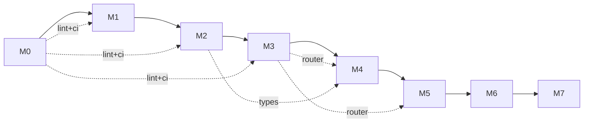

# 里程碑

| 里程碑 | 范围 | 验收标准 |
|---|---|---|
| **M0** | 仓库骨架、文档骨架（zh/en/agent）、CI、ADR 模板、lint 配置 | `cargo build` 通过；三棵文档树存在；ADR-0001（许可证）落地 |
| **M1** | Cobrust 核心语法的词法器 + 语法分析器 + AST | "核心 30 形式" round-trip；24h fuzz 测试无 crash |
| **M2** | 静态核心的类型检查器（暂不含 `dyn`） | 通过精选的"良类型 / 病类型程序"测试套件 |
| **M3** | LLM Router crate（独立可用） | OpenAI + Anthropic adapter 工作；缓存 + 账本工作；consensus 模式在合成任务上验证 |
| **M4** | L0 + L1 流水线在 `tomli` 上端到端跑通 | 完整来源清单；通过 PyO3 wrapper 跑过 `tomli` 测试套件 |
| **M5** | L2 + L3 gate 接通；翻译第二个库（`python-dateutil` 核心） | 差分测试失败自动路由到 repair；benchmark 报告 |
| **M6 ✅** | 第一个含原生扩展的库（`msgpack`）— Cython 词法 shim、perf-gate 失败即触发修复、dateutil L3 拓宽、PyO3 构建路径 | pack/unpack 字节级与 CPython oracle 对齐；Cython shim 解析 `_packer.pyx`/`_unpacker.pyx` 构件；`--features pyo3` 编译通过 |
| **M7.0 ✅** | numpy 核心子集第一个子里程碑：ndarray 基础（按 ADR-0012 + ADR-0013）— closed `Dtype` 枚举（`Int32 / Int64 / Float32 / Float64 / Bool`）、tagged-union `Array`、四个构造器（`array` / `zeros` / `ones` / `arange`） | ≥ 50 良类型 + ≥ 50 病类型程序；≥ 1000 fuzz 不 panic；与 upstream numpy 2.0.2 差分（int/bool 字节级、float `rtol=1e-12`） |
| **M7.1 ✅** | universal functions + 广播 + NEP 50 类型晋升（按 ADR-0014）；类型化构造器 + 多维 nested-list 解析；关闭 ADR-0013 follow-up #1-#4（单态化分发、类型化构造器、L2.perf flip、多维 nested-list） | 50 良类型 + 50 病类型 ufunc 程序；每个 ufunc >= 1200 fuzz 输入差分 vs upstream numpy 2.0.2（int/bool 字节级、float `rtol=1e-7`）；广播表（22 条）；L2.perf gate 翻为强制 |
| **M7.2+** | 数值层后续：索引（M7.2）→ 归约（M7.3）→ linalg（M7.4）→ random（M7.5）→ FFT/poly（M7.6+） | 各子里程碑独立 ADR；按 ADR-0012 §"Sub-milestones"分阶段推进 |

## 当前状态

**M0..M7.1 已交付。** 仓库骨架已就位；词法/语法/AST（M1）、HIR + 双向类型检查器（M2）、provider-agnostic LLM Router（M3）均已上线；**M4** 端到端跑通 L0+L1 翻译流水线（目标 `tomli`），生成的 `cobrust-tomli` crate 已提交以保障 gate 稳定。**M5** 完成闭环合龙：L2.perf 基准压测器、L2.behavior 修复循环（`BehaviorVerifier` 钩子 + 按 attempt 路由的合成提供商）、L3 下游依赖驱动器。第二个翻译库 `python-dateutil`（核心：`parse_iso` + `relativedelta_add`）作为 M5 交付物落地；2/5 依赖（croniter, freezegun）通过 L3 门禁，剩余 3/5（pandas, sqlalchemy, pendulum）按 ADR-0009 显式推迟到 M6。**M6** 是原生扩展里程碑：`cobrust-msgpack` 端到端翻译 msgpack-python 1.0.8（17 个纯 Python + 2 个 Cython 类型化入口），通过 Cython 词法 shim（`task = "translate_cython"`）；`PerfVerifier` 回调让 L2.perf 失败即触发修复，演示一次 `pack_uint` 故意做差的修复路径；dateutil L3 拓宽到 4/5 + 1 跳过（pendulum tz 越界，按 ADR-0010 §5）；`cobrust-dateutil` 与 `cobrust-msgpack` 均启用 `--features pyo3`（按 ADR-0011）。**M7.0** 是 numpy 数值层的第一个子里程碑（按 ADR-0012 §"translate the surface, bind the core"）：新建 `cobrust-numpy` parent crate（按 ADR-0013 决定使用单一父 crate 而非按子 ms 拆分），封装 `ndarray = "0.16"` 提供数据后端；闭合 `Dtype` 枚举（5 个变体）+ tagged-union `Array`（5 个变体，按 ADR-0013 §4 不在公共 API 暴露 `dyn`，符合宪法 §2.2）；四个构造器 `array / zeros / ones / arange` + 观测面 `shape / ndim / size / dtype / repr / to_json`；L0 差分门禁通过子进程跑 upstream numpy 2.0.2 oracle（int/bool 字节级、float `rtol=1e-12`，1024+ 个 fuzz 输入）；`tests/numpy_fuzz.rs` 4200 个 panic-free fuzz 输入；55 个良类型 + 56 个病类型程序通过；`--features pyo3` 构建路径就绪（按 ADR-0011）。测试总数：501（基线 376；M7.0 净增 125）。**M7.1** 落地 numpy ufunc 层（按 ADR-0014）：二元 ops（`add / sub / mul / div / pow`）、比较 ufuncs（一律返回 `Dtype::Bool`）、逐元素数学（`sin / cos / exp / log / sqrt`）、numpy 2.x 广播规则（`broadcast_shape`）、NEP 50 类型晋升（`result_type` 25 条目表）、类型化构造器（`array_i32 / i64 / f32 / f64 / bool`，关闭 ADR-0013 follow-up #2）、nested-list 解析（`NestedList`, `array_from_nested`，关闭 follow-up #4）。三个新错误变体（`IntegerDivisionByZero`, `BroadcastShapeMismatch`, `TypePromotionFailure`）覆盖新失败路径。分发是单态化（内联 match 分支，关闭 follow-up #1；`ndarray::Zip` 内循环自动向量化）。差分门禁针对每个 ufunc 跑 >= 1200 个 fuzz 输入对比 upstream numpy 2.0.2：int/bool 字节级、float `rtol=1e-7`。**L2.perf gate 翻为强制**（关闭 follow-up #3）：`corpus/numpy/M7.1/perf.toml` 按 ADR-0010 §3 设数值层 0.5x floor，`ufunc_pipeline_escalates_when_perf_always_fails` 演示 perf-fail → repair → `EscalationExceeded`，与 M6 的 msgpack escalation 测试同构。**NEP 50 具体例子**：`int32 + float32 → float64`（i32 尾数不能放进 f32），所以 `array_i32(&[1,2,3], &[3]).add(&array_f32(&[0.5,1.5,2.5], &[3]))` 产出 `Float64` 数组 `[1.5, 3.5, 5.5]`，与 numpy 2.0.2 字节级一致。cobrust-numpy 测试总数：223（M7.0 时为 75；M7.1 净增 148）。

**为什么是"翻译表面，绑定内核"**：上游 numpy 的核心是 `numpy/core/src/multiarray/*.c` 的手工 SIMD/BLAS 路径——纯 Rust 重写不切实际。Rust 生态已有 `ndarray` 提供同样的 `(dtype, shape, strides, data)` 模型。M7.0 的工程实践是把 cobrust-numpy 的"表面"（dtype 字符串解析、错误分类、numpy 兼容的 `repr`、Python-shaped 构造器签名）当作翻译目标，把"内核"（`ArrayD::zeros` / `from_shape_vec`）当作绑定目标。**例子**：`cobrust_numpy::zeros(&[3, 4], Dtype::Float64)` 在 cobrust-numpy 这一层做 dtype 路由（`match dtype { Dtype::Float64 => ... }`），最终 `ArrayD::<f64>::zeros(IxDyn(&[3, 4]))` 由 ndarray 实际分配 + 零填充。我们不重写 `zeros`，我们调用它。这条原则贯穿整个 M7+：M7.4 linalg 会绑定 `ndarray-linalg`，M7.5 random 会绑定 `rand` + `rand_distr`，M7.6 FFT 会绑定 `rustfft`。

## 开发纪律（适用于所有里程碑）

- **测试先行**：编译器内部一律先写失败测试，再写实现
- **闭环验证**：每个翻译库的 L0–L3 gate 全部不可跳
- **ADR-or-it-didn't-happen**：影响两个及以上文件的决定都要写 ADR
- **doc-coverage 在 CI 强制**：任何 public item 缺 zh / en / agent 文档 → CI 红
- **Provenance-or-it-didn't-happen**：AI 翻译文件必须带清单头
- **原子提交**：代码 + 测试 + 文档（zh、en、agent）+ ADR（如适用）一次性提交

## 里程碑之间的依赖

- M0 是公共底座，所有后续里程碑共享
- M3（Router）是 M4+ 翻译流水线的前提
- M2（类型检查器）是 M4+ 验证翻译产物的前提
