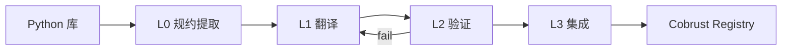

# 项目概览

## 一句话定位

Cobrust 是一门用 **Rust** 实现、面向 **Python 生态**的下一代静态语言，配备**以 LLM 为一等公民的 LLM 驱动翻译流水线**，以及正在开发中的 Phase F.2 AI 原生标准库。

## 我们要解决的问题

- Python 慢、有 GIL、类型系统是事后补的
- Rust 安全快，但语法陡峭、对 Python 用户不友好
- 现有"Python 替代品"（Mojo / RustPython / PyPy）要么不开源、要么不解决生态迁移

## 我们的答案

| 维度 | Cobrust 选择 |
|------|------------|
| 语法 | 缩进式块 + Python 习惯，但默认静态类型 |
| 内存 | 所有权 + 借用 + Result/Option |
| 并发 | 无 GIL，结构化并发，单一 runtime |
| 工具链 | 单一 `cobrust` 命令，零碎片化 |
| 生态迁移 | AI 翻译子系统：闭环把 Python 库翻译成 Cobrust |

## 核心创新：AI 翻译闭环

- 每一步都有显式 gate，**没有 gate 就不能往下走**
- L2 失败 → 诊断回灌 L1 → 重译 → 重验，直到通过或触达升级阈值
- Token 成本不是约束，**正确性、优雅、可重现才是**

## 三句话解释

1. Python 的语法人体工学是真的好，但运行时和包管理拖慢了整个生态
2. Rust 的安全和性能是真的好，但学习曲线陡峭、对 Python 用户不友好
3. 把 Python 的"前端体验"嫁接到 Rust 的"后端引擎"上，再用 LLM 自动迁移生态——这就是 Cobrust

## 进一步阅读

- [设计哲学](design-philosophy.md)
- [架构](architecture.md)
- [里程碑](milestones.md)
