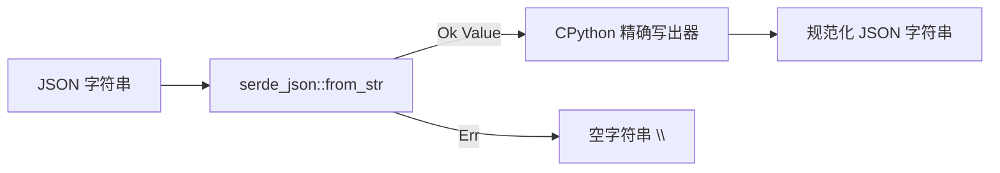

# `std.json` — JSON 编码/解码

> 状态:v0.7.0 Stream Z.5。基于 Rust `serde_json` crate 的 Python-`json`
> 兼容表面。兼容性等级:`@py_compat(semantic)`。

## 先看示例

Cobrust 提供了每个 Python 程序员都会用到的两个函数:

```python
# 序列化(Cobrust 源码)
let compact: str = json_dumps("{\"a\": 1, \"b\": [2, 3]}")
# -> {"a": 1, "b": [2, 3]}

# 以 2 个空格缩进美化输出
let pretty: str = json_dumps_indent("{\"a\": 1, \"b\": [2, 3]}", 2)
# -> {
#      "a": 1,
#      "b": [
#        2,
#        3
#      ]
#    }

# 解析 / 校验 / 规范化
let canon: str = json_loads("[ 1 , 2 ,3 ]")
# -> [1, 2, 3]
```

它们在常见场景下与 Python 的 `json.dumps(...)` 和 `json.loads(...)` 完全一致。

## 功能说明

- **`json_dumps(s)`** —— 接收一个 JSON 字符串,返回规范化的紧凑序列化结果。
  输出与 CPython 3.11 `json.dumps` 的默认行为一致:列表/对象元素之间用 `", "`
  分隔,对象键后用 `": "` 分隔,非 ASCII 字符转义为 `\uXXXX`。
- **`json_dumps_indent(s, n)`** —— 同上,但以每层 `n` 个空格的方式美化输出。
  空容器(`{}` / `[]`)保持单行,与 CPython `json.dumps(value, indent=n)`
  完全一致。
- **`json_loads(s)`** —— 解析一个 JSON 字符串,校验其合法性,返回规范化形式。
  非法输入返回空字符串 `""`(绝不崩溃)。

## 支持的值类型

| JSON 类型 | 示例输入 | 输出 |
|---|---|---|
| null | `null` | `null` |
| bool | `true` / `false` | `true` / `false` |
| int | `42`、`-7` | `42`、`-7` |
| float | `3.14`、`3.0` | `3.14`、`3.0` |
| string | `"hello"`、`"你好"` | `"hello"`、`"你好"` |
| list | `[1,2,3]` | `[1, 2, 3]` |
| dict | `{"a":1}` | `{"a": 1}` |

列表与字典可任意嵌套。

## 用 Result,不用异常

Cobrust 摒弃了 Python "异常即默认错误路径" 的规则(宪法 §2.2)。

- Rust 层的 `loads(s)` 返回 `Result<Value, Error>` —— 非法文档是
  `Err(Error::Parse(message))`,绝不 panic。
- 字符串层的 `.cb` 表面(`json_dumps` / `json_loads`)在输入非法时返回空字符串
  `""`,与 `std.tool` 采用相同的 alpha 哨兵约定。

## 编码/解码流程



## 为什么这样设计?

- **基于 gold 级 crate 的 HYBRID 方案。** 我们不重新实现 JSON 解析器,而是绑定
  `serde_json`(下载量最高、审计最充分的 Rust crate 之一),并用一层薄薄的
  Python 形状表面包装它。路线图(v0.7.0 网络后端库 §4.1)将其归类为 HYBRID:
  后端用原生绑定保证快与正确,API 用 LLM-first 表面。
- **LLM-first 表面(宪法 §2.5)。** `json.dumps({"a": 1})` /
  `json.loads("...")` 是整个 Python 语料中训练最充分的模式之一。表面与这些先验
  对齐,LLM agent 第一次就能写对。
- **刻意做到 CPython 精确输出。** `serde_json` 自带的 `to_string` 产生紧凑的
  `,`/`:` 输出且原样输出 UTF-8。我们**不**直接使用它 —— 而是用一个自定义写出器
  遍历解析后的值,复现 CPython 的 `", "`/`": "` 分隔符与 `ensure_ascii=True`
  转义,使输出可与真实 Python `json` 干净地逐字符比对。

## 为什么是 `semantic`,而不是 `strict`?

`@py_compat` 等级(宪法 §2.4)定为 `semantic`,是因为有两个边角场景可能与
CPython 不同,我们选择声明而非隐藏:

1. **对象键顺序。** `serde_json` 默认的 map 是排序的 `BTreeMap`,因此对象键按
   **字母序**输出,而 CPython 保留插入顺序。其余一切 —— 分隔符、转义、标量格式化
   —— 均一致。
2. **浮点格式化。** Rust 与 CPython 使用不同的最短浮点算法;它们在整数值浮点
   (`3.0`)、有限小数及常规数值上一致,仅在病态的 17 位数字平局的最后一位上可能
   不同。

## 验证

该模块附带一套差分测试语料,其期望输出取自 CPython 标准库的 `json` 模块(预言机
oracle),覆盖完整的值类型矩阵、转义边角场景、Unicode 及星光面代理对、`indent=`
一致性,以及一个 1500 个输入的可复现 fuzz —— 断言往返稳定性(宪法 §4.2 要求
≥ 1000 个 fuzz 输入)。
